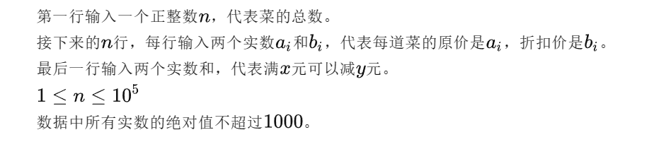

作者：似水流年
链接：https://www.zhihu.com/question/485090581/answer/3208055747
来源：知乎
著作权归作者所有。商业转载请联系作者获得授权，非商业转载请注明出处。


小美正在设计[美团外卖](https://www.zhihu.com/search?q=美团外卖&search_source=Entity&hybrid_search_source=Entity&hybrid_search_extra={"sourceType"%3A"answer"%2C"sourceId"%3A3208055747})的定价信息。已知外卖定价的规则如下：

1. 每道菜有折扣价和原价。折扣价不能超过原价。
2. 订单有满*x*元减*y*元的优惠。当购买的菜的价格总和不小于*x*元时，总价格可以减*y*元。“减”的价格不能超过“满”的价格。
3. [满减优惠](https://www.zhihu.com/search?q=满减优惠&search_source=Entity&hybrid_search_source=Entity&hybrid_search_extra={"sourceType"%3A"answer"%2C"sourceId"%3A3208055747})和折扣价是互斥的，[当且仅当](https://www.zhihu.com/search?q=当且仅当&search_source=Entity&hybrid_search_source=Entity&hybrid_search_extra={"sourceType"%3A"answer"%2C"sourceId"%3A3208055747})每个菜都选择了原价才可以触发满减。
4. 系统会自动为客户计算最低[价格](https://www.zhihu.com/search?q=价格&search_source=Entity&hybrid_search_source=Entity&hybrid_search_extra={"sourceType"%3A"answer"%2C"sourceId"%3A3208055747})的方案。

在设计定价时，原价、折扣价和满减的价格都必须是[正实数](https://www.zhihu.com/search?q=正实数&search_source=Entity&hybrid_search_source=Entity&hybrid_search_extra={"sourceType"%3A"answer"%2C"sourceId"%3A3208055747})。如果设计的定价发生问题，则会提示数据错误。 请使用[等价划分法](https://www.zhihu.com/search?q=等价划分法&search_source=Entity&hybrid_search_source=Entity&hybrid_search_extra={"sourceType"%3A"answer"%2C"sourceId"%3A3208055747})设计[测试用例](https://www.zhihu.com/search?q=测试用例&search_source=Entity&hybrid_search_source=Entity&hybrid_search_extra={"sourceType"%3A"answer"%2C"sourceId"%3A3208055747})，来测试该[系统的功能](https://www.zhihu.com/search?q=系统的功能&search_source=Entity&hybrid_search_source=Entity&hybrid_search_extra={"sourceType"%3A"answer"%2C"sourceId"%3A3208055747})。

```text
时间限制：C/C++ 1秒，其他语言2秒
空间限制：C/C++ 256M，其他语言512M
```

*输入描述：*



*输出描述：*

```text
如果数据有误，则输出一行字符串"error"。
否则输出一个小数，小数点后保留2位即可。该小数代表顾客购买了全部菜各一份时，订单的总价格。
```

*示例1*

```text
输入例子：
2
10 5.5
10 6.5
15 3
输出例子：
12.00
例子说明：
虽然触发了满15元减3元，但使用折扣只需要花12元，低于使用满减的价格（20-3=17），因此最终系统会为客户推荐折扣价。
```

*示例2*

```text
输入例子：
2
10 5.5
10 6.5
20 10
输出例子：
10.00
例子说明：
触发满20元减10元即可。满减价优于折扣价。
```

*示例3*

```text
输入例子：
2
10 10.25
10 3.5
20 4.5
输出例子：
error
例子说明：
折扣价高于原价，数据错误。
```

*代码*

```text
import java.util.Scanner;

// 注意类名必须为 Main, 不要有任何 package xxx 信息
public class Main {
    public static void main(String[] args) {
        Scanner in = new Scanner(System.in);
        
        // 读取菜的总数
        int n = in.nextInt();
        in.nextLine(); // 换行

        // 原价和折扣数组
        double[] originalPrices = new double[n];
        double[] discountedPrices = new double[n];

        for(int i = 0; i < n; i++){
            originalPrices[i] = in.nextDouble();
            discountedPrices[i] = in.nextDouble();
            if(originalPrices[i] < discountedPrices[i] || discountedPrices[i] <= 0){
                System.out.println("error");
                return;
            }
            in.nextLine();
        }

        double x = in.nextDouble();
        double y = in.nextDouble();

        if(y <= 0 || x < y){
            System.out.println("error");
                return;
        }

        double totalPrice = calculateTotalPrice(originalPrices, discountedPrices, x, y);

        if(totalPrice < 0){
            System.out.println("error");
        }else{
            System.out.printf("%.2f\n", totalPrice);
        }
    }

    private static double calculateTotalPrice(double[] originalPrices, double[] discountedPrices, double x, double y){
        double totalOriginalPrice = 0;
        double totalDiscountedPrice = 0;

        for(int i = 0; i < originalPrices.length; i++){
            totalOriginalPrice += originalPrices[i];
            totalDiscountedPrice += discountedPrices[i];
        }

        if(totalOriginalPrice >= x){
            return Math.min(totalOriginalPrice - y, totalDiscountedPrice);
        }else{
            return totalDiscountedPrice;
        }
    }
}
```

## **2 小美的字符串匹配度**


```text
时间限制：C/C++ 1秒，其他语言2秒
空间限制：C/C++ 256M，其他语言512M
```

*输入描述：*


*输出描述：*

```text
输出一个整数，s和t的最大匹配度。
```

*示例1*

```text
输入例子：
5
ababc
babac
输出例子：
3
```

*代码*

```text
import java.util.Scanner;

// 注意类名必须为 Main, 不要有任何 package xxx 信息
public class Main {
    public static void main(String[] args) {
        Scanner in = new Scanner(System.in);
        
        int n = in.nextInt();
        in.nextLine();
        String s = in.nextLine();
        String t = in.nextLine();

        int initialMatch = calculateMatch(s, t);

        int maxMatch = initialMatch;
        for(int i = 0; i < n; i++){
            for(int j = i + 1; j < n; j++){
                char[] tChars = t.toCharArray();
                char temp = tChars[i];
                tChars[i] = tChars[j];
                tChars[j] = temp;

                int newMatch = calculateMatch(s, new String(tChars));

                maxMatch = Math.max(maxMatch, newMatch);

                temp = tChars[i];
                tChars[i] = tChars[j];
                tChars[j] = temp;
            }
        }

        System.out.println(maxMatch);
    }

    private static int calculateMatch(String s, String t){
        int match = 0;
        int n = s.length();

        for(int i = 0; i < n; i++){
            if(s.charAt(i) == t.charAt(i)){
                match++;
            }
        }
        return match;
    }
}
```

## **3 小美的树上染色**

小美拿到了一棵树，每个节点有一个权值。初始每个节点都是白色。

小美有若干次操作，每次操作可以选择两个相邻的节点，如果它们都是白色且权值的乘积是[完全平方数](https://www.zhihu.com/search?q=完全平方数&search_source=Entity&hybrid_search_source=Entity&hybrid_search_extra={"sourceType"%3A"answer"%2C"sourceId"%3A3208055747})，小美就可以把这两个节点同时染红。

小美想知道，自己最多可以染红多少个节点？

```text
时间限制：C/C++ 1秒，其他语言2秒
空间限制：C/C++ 256M，其他语言512M
```

*输入描述：*


*输出描述：*

```text
输出一个整数，表示最多可以染红的节点数量。
```

*示例1*

```text
输入例子：
3
3 3 12
1 2
2 3
输出例子：
2
例子说明：
可以染红第二个和第三个节点。
请注意，此时不能再染红第一个和第二个节点，因为第二个节点已经被染红。
因此，最多染红 2 个节点。
```

*代码*

```text
import java.util.*;

public class Main {

    static List<List<Integer>> edges = new ArrayList<>();
    static int[][] dp;
    static int[] weights;
    static int ans = 0;
    public static void main(String[] args) {
        //处理输入
        Scanner scanner = new Scanner(System.in);
        int n = scanner.nextInt();
        weights = new int[n];
        dp = new int[n][2];
        for (int i = 0; i < n; i++) {
            weights[i] = scanner.nextInt();
            edges.add(new ArrayList<>());
        }
        for (int i = 0; i < n - 1; i++) {
            int u = scanner.nextInt() - 1;
            int v = scanner.nextInt() - 1;
            edges.get(u).add(v);
            edges.get(v).add(u);
        }
        dfs(0, -1);
        System.out.println(ans);
    }

    private static void dfs(int node, int fa) {
        List<Integer> children = edges.get(node);
        for (int ch : children) {
            if (ch != fa) {
                dfs(ch, node);
                dp[node][0] += Math.max(dp[ch][1], dp[ch][0]);
            }
        }
        for (int ch : children) {
            if (ch != fa) {
                if (qualifyB(weights[ch], weights[node])) {
                    dp[node][1] = Math.max(dp[node][1], dp[node][0] - Math.max(dp[ch][0],
                                           dp[ch][1]) + dp[ch][0] + 2);
                }
            }
        }
        ans = Math.max(dp[node][0], dp[node][1]);
    }

    private static boolean qualifyB(int weight1, int weight2) {
        long product = (long) weight1 * weight2;
        long x = (long) Math.sqrt(product);
        return x * x == product;
    }


}
```

## **4 小美的排列询问**

小美拿到了一个排列。她想知道在这个排列中，*x*和*y*是否是相邻的。你能帮帮她吗？

排列是指一个长度为*n*的数组，其中 1 到*n*每个元素恰好出现一次。

```text
时间限制：C/C++ 1秒，其他语言2秒
空间限制：C/C++ 256M，其他语言512M
```

*输入描述：*


*输出描述：*

```text
如果x和y在排列中相邻，则输出"Yes"。否则输出"No"。
```

*示例1*

```text
输入例子：
4
1 4 2 3
2 4
输出例子：
Yes
```

*示例2*

```text
输入例子：
5
3 4 5 1 2
3 2
输出例子：
No
```

*代码*

```text
import java.util.Scanner;

// 注意类名必须为 Main, 不要有任何 package xxx 信息
public class Main {
    public static void main(String[] args) {
        Scanner in = new Scanner(System.in);
        int n = in.nextInt();
        int[] permutation = new int[n];

        for(int i = 0; i < n; i++){
            permutation[i] = in.nextInt();
        }

        int x = in.nextInt();
        int y = in.nextInt();

        int xIndex = -1;
        int yIndex = -1;

        for(int i = 0; i < n; i++){
            if(permutation[i] == x){
                xIndex = i;
            }
            if(permutation[i] == y){
                yIndex = i;
            }
        }

        if(Math.abs(xIndex - yIndex) == 1){
            System.out.println("Yes");
        }else{
            System.out.println("No");
        }
    }
}
```

## **5 小美的排列构造**

小美定义一个数组*a*的权值计算如下：

首先将*a*的每一对相邻两项求和，得到一个*b*数组。那么*b*数组的[最大值](https://www.zhihu.com/search?q=最大值&search_source=Entity&hybrid_search_source=Entity&hybrid_search_extra={"sourceType"%3A"answer"%2C"sourceId"%3A3208055747})减最小值即为*a*数组的权值。

例如，若*a*=[2,1,3]，那么*b*=[3,4]，*b*数组的极差是1。因此*a*数组的权值为1。

现在小美希望你能构造一个长度为n*的排列，满足权值尽可能小。你能帮帮她吗？

排列是指一个长度为*n*的数组，其中 1 到*n*每个元素恰好出现一次。

```text
时间限制：C/C++ 1秒，其他语言2秒
空间限制：C/C++ 256M，其他语言512M
```

*输入描述：*

一个正整数，代表排列的长度。一个正整数n，代表排列的长度。2≤n≤200000

*输出描述：*

```text
一个合法的排列。如果有多解输出任意即可。
```

*示例1*

```text
输入例子：
3
输出例子：
2 1 3
例子说明：
这个数组的权值为 1。输出[2,3,1]等排列也是合法的。
```

*代码*

```text
import java.util.*;


// 注意类名必须为 Main, 不要有任何 package xxx 信息
public class Main {
    public static void main(String[] args) {
        Scanner scanner = new Scanner(System.in);
        int n = scanner.nextInt();

        // 初始化构造顺序排列
        List<Integer> a = new ArrayList<>();
        int i = 1, j = n;

        while (a.size() < n && i < j) {
            // 交叉重新排列数组
            a.add(i);
            a.add(j);
            i++;
            j--;
        }
        a.add(i);

        for (int c = 0; c < n; c++) {
            System.out.print(a.get(c) + " ");
        }
    }
}
```

## **6 小美走公路**

有一个环形的公路，上面共有*n*站，现在给定了顺时针第*i*站到第*i*+1站之间的距离（特殊的，也给出了第*n*站到第 1 站的距离）。小美想沿着公路第*x*站走到第*y*站，她想知道最短的距离是多少？

```text
时间限制：C/C++ 1秒，其他语言2秒
空间限制：C/C++ 256M，其他语言512M
```

*输入描述：*


*输出描述：*

```text
一个正整数，代表小美走的最短距离。
```

*示例1*

```text
输入例子：
3
1 2 2
2 3
输出例子：
2
```

*示例2*

```text
输入例子：
3
1 2 2
1 3
输出例子：
2
```

*代码*

```text
import java.util.Scanner;

// 注意类名必须为 Main, 不要有任何 package xxx 信息
public class Main {
    public static void main(String[] args) {
        Scanner in = new Scanner(System.in);
        // 注意 hasNext 和 hasNextLine 的区别
        while (in.hasNextInt()) { // 注意 while 处理多个 case
            int n = in.nextInt();
            Long[] a = new Long[n];
            for(int i = 0; i < n; i++) {
                a[i] = in.nextLong();
            }
            Long x = in.nextLong() - 1;
            Long y = in.nextLong() - 1;
            if(x > y) {
                Long t = x;
                x = y;
                y = t;
            }
            if(x == y) {
                System.out.print(0);
                return;
            }
            Long sum1 = Long.valueOf(0);
            Long sum2 = Long.valueOf(0);
            for(int i = 0; i < n; i++) {
                if((x + i) != y) {
                    sum1 += a[(int) (x + i)];
                }else {
                    break;
                }
            }
            for(int i = 0; i < n; i++) {
                if((y + i) % n != x) {
                    sum2 += a[(int) ((y + i) % n)];
                }else {
                    break;
                }
            }
            System.out.println(Math.min(sum1, sum2));
        }
    }
}
```

## **7 小美的好矩阵**

小美定义一个矩阵是好矩阵，当且仅当该矩阵满足：

1. 矩阵仅由'A'、'B'、'C'三种字符组成。且三种字符都出现过。
2. 矩阵相邻的字符都不相等。

现在给定一个*n*∗*m*的矩阵，小美想知道有多少个3*3的子矩阵是好矩阵，你能帮帮她吗？

```text
时间限制：C/C++ 1秒，其他语言2秒
空间限制：C/C++ 256M，其他语言512M
```

*输入描述：*


*输出描述：*

```text
输出一个整数表示答案。
```

*示例1*

```text
输入例子：
4 4
DABC
ABAB
BABA
BBAB
输出例子：
1
例子说明：
有4个3*3的子矩阵。
左上角的子矩阵出现了'D'，因此不合法。
右上角的是好矩阵。
左下角的存在两个相邻的字母相同，因此不合法。
右下角的子矩阵里没有'C'，因此不合法。
```

*代码*

```text
import java.util.*;

// 注意类名必须为 Main, 不要有任何 package xxx 信息
public class Main {
   public static void main(String[] args) {
        Scanner scanner = new Scanner(System.in);
        int n = scanner.nextInt();
        int m = scanner.nextInt();
        scanner.nextLine();
        char[][] matrix = new char[n][m];
        for (int i = 0; i < n; i++) {
            matrix[i] = scanner.nextLine().toCharArray();
        }

        int result = 0; // 好矩阵的数量

        // 遍历每个3x3子矩阵
        for (int i = 0; i <= n - 3; i++) {
            for (int j = 0; j <= m - 3; j++) {
                if (isGood(matrix, i, j)) {
                    // 符合条件的使result++
                    result++;
                }
            }
        }
        System.out.println(result);
    }

    // 判断子矩阵是否满足2个条件
    private static boolean isGood(char[][] matrix, int row, int col) {
        Set<Character> set = new HashSet<>();

        for (int x = row; x < row + 3; x++) {
            for (int y = col; y < col + 3; y++) {
                char ch = matrix[x][y];
                set.add(ch);
                // 相邻相等的话，跟右边和跟下面的字符相比较就OK
                if (ch >= 'D' || (y + 1 < col + 3 && ch == matrix[x][y + 1]) || (x + 1 < row + 3 && ch == matrix[x + 1][y])) {
                    return false;
                }
            }
        }
        // 到了这一步表明相邻的字符没有相等的，只剩下判断ABC是否都出现过即可
        return set.size() == 3;
    }
}1
```

## **8 小美的蛋糕切割**

小美有一个矩形的蛋糕，共分成了 *n* 行 *m* 列，共 *n*×*m* 个区域，每个区域是一个小正方形，已知蛋糕每个区域都有一个美味度。她想切一刀把蛋糕切成两部分，自己吃一部分，小团吃另一部分。

小美希望两个人吃的部分的美味度之和尽可能接近，请你输出∣*s*1−*s*2∣的最小值。（其中*s*1代表小美吃的美味度，*s*2代表小团吃的美味度）。

请务必保证，切下来的区域都是完整的，即不能把某个小正方形切成两个小区域。

```text
时间限制：C/C++ 1秒，其他语言2秒
空间限制：C/C++ 256M，其他语言512M
```

*输入描述：*


*输出描述：*

一个整数，代表的最小值。一个整数，代表|s1−s2|的最小值。

*示例1*

```text
输入例子：
2 3
1 1 4
5 1 4
输出例子：
0
例子说明：
把蛋糕像这样切开：
1 1 | 4
5 1 | 4
左边蛋糕美味度之和是8
右边蛋糕美味度之和是8
所以答案是0。
```

*代码*

```text
import java.util.Scanner;

// 注意类名必须为 Main, 不要有任何 package xxx 信息
public class Main {
    public static void main(String[] args) {
        Scanner sc = new Scanner(System.in);
        int n = sc.nextInt();
        int m = sc.nextInt();
        int[][] arr = new int[n][m];

        long[] sumRow = new long[n]; // 每行所有元素相加的和
        long[] sumCol = new long[m]; // 每列所有元素相加的和

        for (int i = 0; i < n; i ++) {
            for (int j = 0; j < m; j ++) {
                arr[i][j] = sc.nextInt();
                sumRow[i] += arr[i][j];
                sumCol[j] += arr[i][j];
            }
        }

        if (m == 1 && n == 1) {
            System.out.println(arr[0][0]);
            return;
        }

        /*
        因为只能一刀，且不能切开每个元素，所以只能横一刀或者竖一刀

        以行的最小差值为例，可以把分成上下两部分，分别从最上面和最小面开始累加，哪个小，就让哪个多加一次
         */
        // 先计算行最小差值绝对值
        int i = 0;
        int j = n - 1;
        long sumUp = sumRow[i];
        long sumDown = sumRow[j];
        while (i < j - 1) {

            if (sumUp > sumDown) {
                j--;
                sumDown += sumRow[j];
            } else {
                i++;
                sumUp += sumRow[i];
            }
        }

        // 再计算列最小差值绝对值
        i = 0;
        j = m - 1;
        long sumLeft = sumCol[i];
        long sumRight = sumCol[j];
        while (i < j - 1) {
            if (sumLeft > sumRight) {
                j --;
                sumRight += sumCol[j];
            } else {
                i ++;
                sumLeft += sumCol[i];
            }
        }

        System.out.println(Math.min(Math.abs(sumDown - sumUp),
                                    Math.abs(sumLeft - sumRight)));
    }
}
```

## **9 小美的字符串变换**

小美拿到了一个长度为*n*的字符串，她希望将字符串从左到右平铺成一个矩阵（先平铺第一行，然后是第二行，以此类推，矩阵有*x*行*y*列，必须保证*x*∗*y*=*n*，即每*y*个字符换行，共*x*行）。

该矩阵的权值定义为这个矩阵的连通块数量。小美希望最终矩阵的权值尽可能小，你能帮小美求出这个最小权值吗？

注：我们定义，上下左右四个方向相邻的**相同**字符是连通的。

```text
时间限制：C/C++ 1秒，其他语言2秒
空间限制：C/C++ 256M，其他语言512M
```

*输入描述：*


*输出描述：*

```text
输出一个整数表示最小权值。
```

*示例1*

```text
输入例子：
9
aababbabb
输出例子：
2
例子说明：
平铺为3*3的矩阵：
aab
abb
abb
共有2个连通块，4个a和5个b。
```

*代码*

```text
import java.util.*;

// 注意类名必须为 Main, 不要有任何 package xxx 信息
public class Main {
    static class Pair {
        int first, second;

        Pair(int first, int second) {
            this.first = first;
            this.second = second;
        }
    }

    public static void main(String[] args) {
        Scanner scanner = new Scanner(System.in);
        int len = scanner.nextInt();
        String s = scanner.next();

        int[] vis = new int[len];
        int[] dx = {-1, 0, 1, 0};
        int[] dy = {0, 1, 0, -1};

        int mid = len / 2;
        int ans = 0x3f3f3f3f;

        for (int i = 1; i <= mid; ++i) {
            if (len % i == 0) {
                ans = Math.min(ans, get(i, len / i, s, vis, dx, dy));
            }
        }

        System.out.println(ans);
    }

    static int get(int n, int m, String s, int[] vis, int[] dx, int[] dy) {
        Queue<Pair> q = new LinkedList<>();
        int res = 0;
        Arrays.fill(vis, 0);

        for (int i = 0; i < n; ++i) {
            for (int j = 0; j < m; ++j) {
                if (vis[i * m + j] != 0) {
                    continue;
                }

                char ch = s.charAt(i * m + j);
                q.add(new Pair(i, j));

                while (!q.isEmpty()) {
                    Pair top = q.poll();

                    for (int k = 0; k < 4; ++k) {
                        int nx = top.first + dx[k];
                        int ny = top.second + dy[k];

                        if (nx >= 0 && nx < n && ny >= 0 && ny < m && vis[nx * m + ny] == 0 &&
                                s.charAt(nx * m + ny) == ch) {
                            vis[nx * m + ny] = 1;
                            q.add(new Pair(nx, ny));
                        }
                    }
                }
                res += 1;
            }
        }
        return res;
    }
}
```