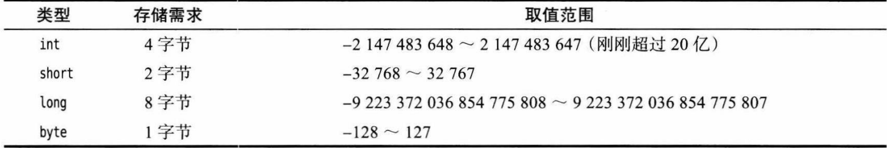
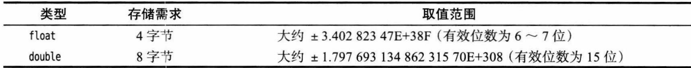
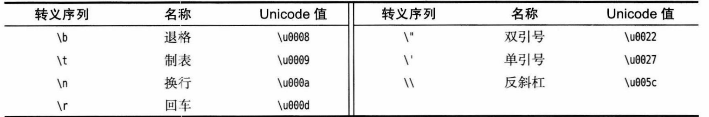
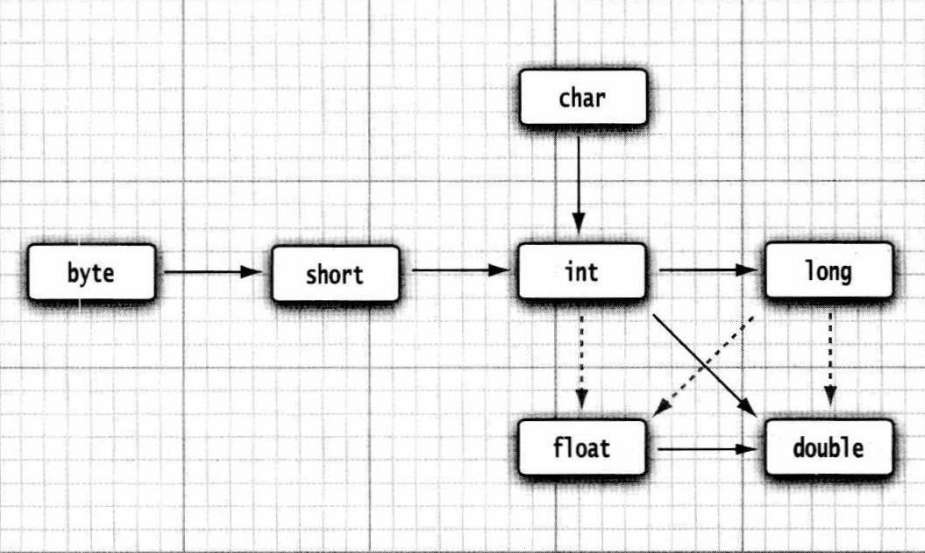
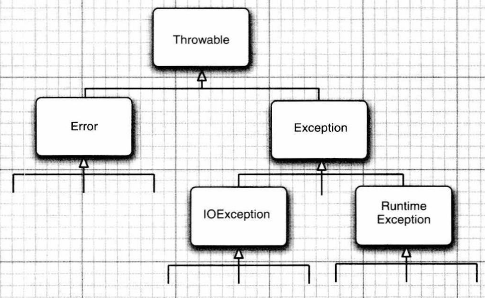
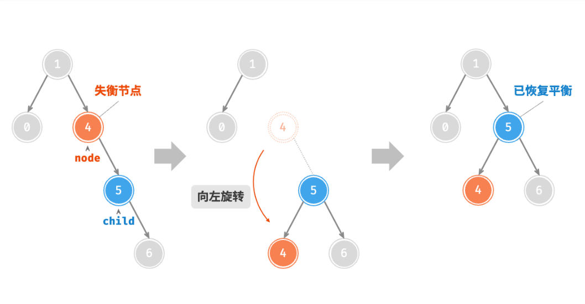
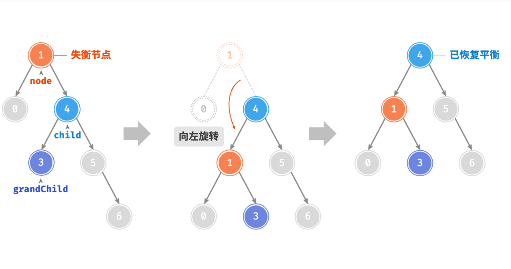
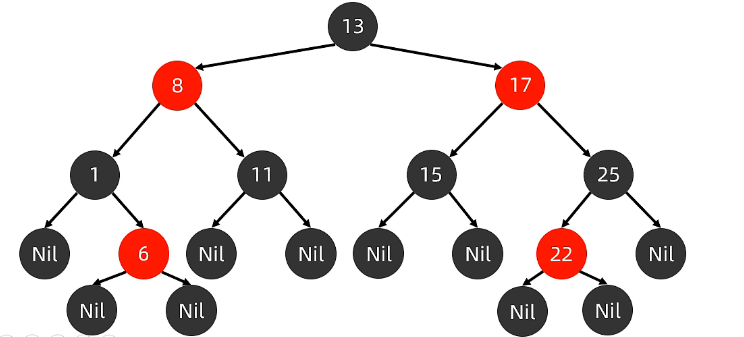
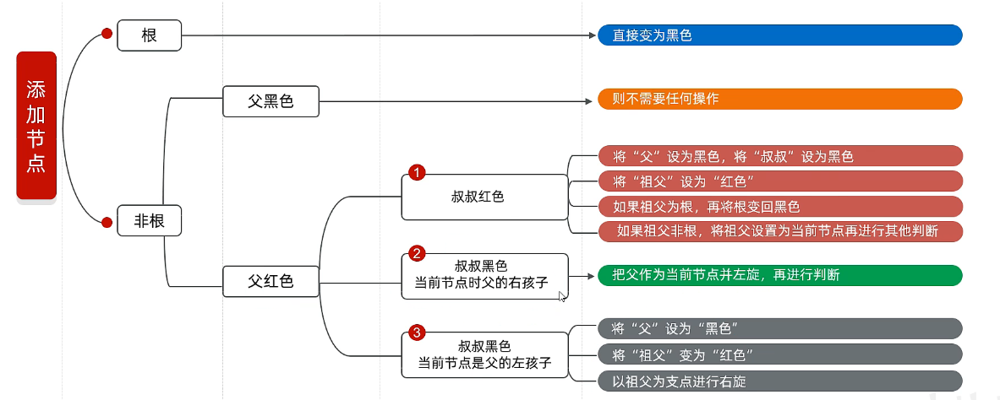

#Java基础

## 数据类型

**整形**



**浮点型**



**char类型**



**boolean类型**

整形与布尔值之间不能相互转换

**常量**

使用final关键词指定，一旦被赋值，不能更改。

枚举类型

enum Size{SMALL,MEDIUM,LARGE}; 变量的取值只在一个有限的集合内。

**类型转换**



实线表示无信息丢失的转换，虚线表示有精度损失。**小→大无丢失**。int、float都是4字节，但float表示小数，范围比int小。

当二元运算符连接两个值时，自动要先统一数据类型。变成较大的那个。

有时需要强制类型转换时 int y = (int) x;

**大数**

如果基本的整数和浮点数精度不能满足要求，可以使用java.math包中的BigInteger、Bigdecimal可以处理任意长度的数字序列数值

**字符串**

Java中的字符串是unicode字符序列。java没有内置的字符串类型，只有一个预定义类String

使用substring方法可以取子串；允许使用+进行字符串拼接，拼接的不是字符串是会先转换成字符串(任何一个java对象都可以转换成字符串)

检测字符串是否相等是需要使用**equals**方法(equalsIgnoreCase忽略大小写)。==运算符无法检测，它只能检测字符串是否在同一个位置。

字符串中的码点与代码单元可能不同。s.charAt(i)返回的是字符串s的第i个代码单元。但一个字符可能有多个代码单元组成。所以使用码点更为准确: s.codePointAt(s.offsetByCodePoints(0,i))

**构建字符串**

字符串拼接的方式构建字符串每次都会构建一个新的String对象。耗时浪费空间。使用StringBuilder类更好。

```java
StringBuilder builder = new StringBuilder();
builder.append(ch);//拼接字符串或者单个字符
builder.insert(8, "Java");//在第8位置开始假如java（从0开始）
builder.delete(5,8);//删除[5，8]的位置字符
String S = builder.toString();//toString方法转换为String对象   
```

**数组**

数组存储相同类型值的序列

java中一个数组拷贝到另一个数组变量时，两个变量引用一个数组

int[] a = b; a[5] = 12;此时b[5]也等12

若想拷贝新数组则使用

int[] b = Arrays.copyOf(a,a.length);

java中实际上没有多维数组，多维数组本质上是数组的数组。所以可以构建不规则数组，即每行有不同的长度。

**基本数据类型与引用数据类型**

java中内存有：本地方法栈、寄存器、栈、方法区、堆

引用数据类型不保存值本身，而是地址，保存在栈中，其真实值存储在堆内存中。

基本数据类型在方法中声明的变量在栈中，类中的变量在堆中。方法进行调用运行时就是进入栈中。

**输入输出**

```java
//读取输入
Scanner in = new Scanner(System.in); // 从键盘接收数据
String str1 = in.next();//一定要读取到有效字符后才可以结束输入。
String str2 = in.nextLine();//以Enter为结束符,也就是说 nextLine()方法返回的是输入回车之前的所有字符。
//输入的是int ，float in.nextInt();in.nextFloat();
```

## 对象与类

**内存状况**

当运行类时，类的字节码文件加载进方法区临时存储。方法调用时，会存储进栈内存运行，变量也保存在此。new的东西存储在堆内存中。

Employee e = new Employee ();

执行时

先加载class文件Employee 在方法区(类的变量与方法)，

申明局部变量e在栈，将会未来存储对象的地址，

new 后堆开辟空间(对象存储在此)，保存复制类中变量、成员方法的地址

对于对象变量进行初始化(默认、显示、构造方法)。将new后的变量进行默认初始化，再依据是否指明变量值来进行显示初始化，再进行构造方法。

Employee e1 = new Employee ();

Employee e2 = new Employee ();

当对于一个类创建多个对象时，堆内存中会创建多个属于自己对象的变量和方法地址。两个对象互不干扰。

Employee e1 = new Employee ();

Employee e2 =  e1；

当两个引用指向一个对象时，e2保存e1的地址，共同指向堆中的变量。会互相影响。


```java
import java.util.*;
public class ArrayListTest
{
   public static void main(String[] args)
   {
      ArrayList<Employee> staff = new ArrayList<Employee>();
      staff.add(new Employee("Carl Cracker", 75000, 1987, 12, 15));
      staff.add(new Employee("Harry Hacker", 50000, 1989, 10, 1));
      staff.add(new Employee("Tony Tester", 40000, 1990, 3, 15));

      for (Employee e : staff)
         e.raiseSalary(5);

      for (Employee e : staff)
         System.out.println("name=" + e.getName() + ",salary=" + e.getSalary() + ",hireDay="
               + e.getHireDay());
   }
}

class Employee
{    
   private String name;
   private double salary;
   private Date hireDay;
   private static int nextId; 
    //构造器
   public Employee(String n, double s, int year, int month, int day){
      name = n;
      salary = s;
      GregorianCalendar calendar = new GregorianCalendar(year, month - 1, day);
      hireDay = calendar.getTime();
   }

   public String getName(){
      return name;
   }

   public double getSalary(){
      return salary;
   }

   public Date getHireDay(){
      return hireDay;//尽量不要返回可变对象引用，这可能导致对象的hireDay改变，应当返回clone值
   }

   public void raiseSalary(double byPercent){
      double raise = salary * byPercent / 100;
      salary += raise;
   }
    public boolean equals(Employee other){
        return name.equals(other.name);
    }
    public static void tripleSalary(Employee x){
        x.raiseSalary(200);
    }

}
```

源文件名ArrayListTest必须与public类名字一致。一个源文件中，只能由一个公共类public。

构造器与类同名；每一个类可以有一个以上的构造器；构造器可以有多个参数；构造器没有返回值；构造器总是与new操作符一起调用。

私有数据只能被本类中方法调用调用

harry.equals(boss) 是合法的。boss是Employee类型的对象，Employee类的方法可以访问任何Employee对象的私有字段。所以boss.name尽管是私有字段，但在Employee类中可以访问。

**final**

对于基本类型或者不可变类型字段如string时十分有用，但对于可变类可能造成混乱.对于以下的StringBuilder 类的对象s仍然可以使用append方法进行改变。但final在这里表示s的对象引用不会再指示另外一个不同的StringBuilder 对象。因为s本质存储的是一个引用地址。final限制了这个地址不会改变。

final StringBuilder s = new StringBuilder ();

final可以修饰类，修饰的类不能被继承。并类中的方法也会被final修饰。final修饰的方法可以被继承和重载，但不能被重写。但类中的字段不会被final修饰。

**static**

对于静态字段，是每一个对象有静态字段的副本。假如Employee有100个对象，每一个对象都有自己的name，但只有一个nextId。即使没有对象，nextId仍然存在，属于类。不需要实例化就可调用。

静态方法是不在对象上执行的方法。**静态方法不能访问普通字段**。可以访问静态字段。静态方法可以不能直接调用非静态方法。需要对象的引用变量。如tripleSalary的 x.raiseSalary

静态方法可以被继承，但是不能被覆盖，即不能重写。

**方法参数**

参数的传递给方法有**按值调用**和**按引用调用**两种。Java种总是**按值调用**，方法得到的是所有参数值的一个副本。方法不能修改传递给他的任何参数变量的内容。但当参数属于对象引用时有所不同。

```java
//执行时会生成percent的副本，执行完毕后percent仍然为10
double percent = 10;
harry.raseSalary(percent);
//harry是对象，会先生成harry的副本x，这是对象引用，本质上只是复制了一个地址。但x与harry都引用的是对象的工资。尽管X是副本，但仍会改变工资(因为在堆中是一个内容)。因为副本与harry的引用相同。
harry = new Employee(...);
tripleSalary(harry);
```

**对象构造**

**重载**

一个类有多个构造器，叫做重载。不止是构造器，任何方法都可以重载。但返回类型不是方法签名的一部分，不能有两个名字相同，参数类型相同，但返回类型的方法。

如果没有写构造器，会默认提供一个无参构造器。实例字段中数值为0，布尔为false，对象变量为null

**this**

关键词this指示一个方法的隐式参数(类中的字段)。但this的话可以调用同一个类的另一个构造器

```java
public Employee(double s){
    this("Employee #" +nextId,s);//调用Employee(String s)构造器
}
```

**包**

包确保类名的唯一性。一个类可以使用所属包中的所有类，以及其他包中的公共类。

调用时使用import java.util.*调用util下的所有类。如果使用包名不同但类名相同的类时，尽管使用import 但也不能省略完整包名

还可以利用static导入静态方法和静态字段。import static java.lang.System.* 使用时直接out.println("hello")。不必加前缀。

将类放入包中。需要将包名放在源文件开头，文件放在包目录下。package...，没有放置则类属于无名包。如果不将包放在对应目录下，若文件不依赖其他包，则可以编译通过，但程序无法运行。

## 继承

```java
public class Manager extends Employee{
    private double bonus;
    public Manager(String name, double salary,int year,int month,int day){
        super(name,salary,year,month,day);
        bonus = 0;
    }
    public void setBonus(double bonus){
        this.bonus = bonus;
    }
    public double getSalary(){
        double baseSalary = super.getSalary();
        return baseSalary+bonus;
    }
    
}
```

extends表示正在构造的新类派生于一个已存在的类。子类比超类拥有的功能更多。子类Manager会继承Employee的方法和字段。

子类不能继承超类的构造方法和私有方法。超类中的所有字段会被继承，但私有字段不能直接调用。

**覆盖**

超类中的方法不一定适合子类，所以子类可以使用新的方法覆盖超类,如getSalary()。但Salary是private的，子类不能直接访问，应当使用超类的方法调用。但方法名于子类重载的方法名相同。需要使用super关键字。

超类中的静态方法不能被覆盖

**子类构造器**

Manager不能访问Employee的私有字段，需要通过构造器初始化这些私有字段。使用super(...) ，使用super() 必须是子类构造器的第一条语句

**多态**

一个对象变量可以指示多种实际类型的现象叫做多态。

```java
Manager boss = new Manager("Carl Cracker",80000,1987,12,15);
boss.setBonus(5000);
var staff = new Employee[3];
staff[0]=boss;
staff[1]=new Employee("Harry Hacker",50000,1989,10,1);
staff[2]=new Employee("Tony Tester",40000,1990,3,15);
```

staff既可以指Employee，也可以指示Manager。程序中出现超类对象的任何地方都可以使用子类对象替换。但是对象不能使用子类中的方法。如staff[0].setBonus(5000)是错误的。

多态时，

调用变量时，编译看超类，运行也看超类。

调用方法时，编译看超类，运行看子类。

类也可以进行强制类型转换，如Manager boss = (Manager) staff[0].强制类型转换后的boss可以使用Manager 类中的新方法。注意Manager boss = (Manager) staff[1]是错误的。

**抽象类**

使用**abstract**可以定义抽象类和抽象方法。抽象方法充当占位角色，在子类中具体实现。

抽象类不能实例化对象，所以抽象类必须被继承，才能被使用。

抽象类中不一定包含抽象方法，但是有抽象方法的类必定是抽象类。

 **访问控制修饰符**

| 修饰符      | 当前类 | 同一包内 | 子孙类(同一包) | 子孙类(不同包)                                               | 其他包 |
| :---------- | :----- | :------- | :------------- | :----------------------------------------------------------- | :----- |
| `public`    | Y      | Y        | Y              | Y                                                            | Y      |
| `protected` | Y      | Y        | Y              | Y/N（[说明](https://www.runoob.com/java/java-modifier-types.html#protected-desc)） | N      |
| `default`   | Y      | Y        | Y              | N                                                            | N      |
| `private`   | Y      | N        | N              | N                                                            | N      |

**protected**

不能修饰类

对本包，以及所有子类可见

在子类中，子类可以使用从父类继承得到的protected成员，注意是继承得到的，如果仅仅是在子类中构造了一个父类对象，然后调用该父类对象的protected成员，同时若该子类又不和父类在同一个包中，那便会无法编译。

## 接口、lambda、内部类

**接口**

接口用来描述类应该做什么，不指定如何做。一个类可以实现一个或多个接口。

接口中不会有实例字段。可以看成没有实例字段的抽象类。接口中的所有方法都是自动public,字段为public static final 是常量

实现接口需要：将类声明为实现给定的接口。对接口中的所有方法提供定义

不能构造接口对象，但可以声明接口变量，且引用必须实现了接口的类对象。

Comarable x;

x = new Employee(...)

```java
public interface Comparable{
    int compareTo(Object other);
}
class Employee implements Comparable<Employee>{
    public int compareTo(Employee other){
        return Double.compare(salary,other.salary);
    }
}
public interface Hockey extends Sports, Event
```

一个接口能继承另一个接口，和类之间的继承方式比较相似。接口的继承使用extends关键字

类的多继承是不合法，但接口允许多继承。

jdk8以后接口方法可以被default修饰，不是抽象方法，不要求强制重写。


**lambda表达式**

lambda表达式是一个可传递的代码块，可以在以后执行一次或多次。可以对某些匿名内部类写法的简化。

表现形式：参数，箭头(→)，表达式。

```java
//如果无法放在一个表达式中，可以把代码放入{}中，并包含显式的return语句
(String first,String second) -> first.length()-second.length()

    
```

对于只有一个抽象方法的接口需要接口对象，可以提供一个lambda表达式。这种接口为函数式接口。

```java
Arrays.sort(words,(first,second) -> first.length()-second.length())
```

Arrays.sort方法第二个参数需要Comparator实例，Comparator就是只有一个方法的接口。

**方法引用**

方法引用通过方法的名字来指向一个方法，替换单方法的Lambda表达式。使用类名/对象名::方法名

```java
//Lambda表达式的那个单方法是某个类的静态方法
(args) -> Class.staticMethod(args)
 Class::staticMethod
//调用传入的实例参数的方法
(obj, args) -> obj.instanceMethod(args)
ObjectType::instanceMethod//lambda的入参obj，假设为ObjectType类的实例对象 
//调用已经存在的实例的方法
(args) -> obj.instanceMethod(args)
obj::instanceMethod//obj对象不是当做参数传入的，而是已经存在的
//调用类的构造函数
(args) -> new ClassName(args)
ClassName::ne
```


**内部类**

内部类是定义在另一个类中的类。

内部类可以对同一个包中的其他类隐藏(私有)，可以访问定义这个类的作用域中的数据，包括私有

```java
public class Car{
    String carName;
    private int carAge;
    String carColor;
    int a = 10;
    void show(){
        System.out.println(carName);//不能直接访问内部类，除非声明一个对象
    }
    public Engine getEngine(){
        return new Engine();
    }
    
    class Engine{
        String engineName;
        int engineAge;
        int a = 20;
        void show(){
            int a = 30;
        	System.out.println(engineAge);
            System.out.println(carAge);//可以访问外部类的字段
            System.out.println(a);//30
            System.out.println(this.a);//20
            System.out.println(Car.this.a);//10
    	}
    }
}
public class Fu {
    public void method(){
        System.out.println("我是父类，你想继承我然后再去重写我的方法？");
    }
}
public class Demo {
    public static void main(String[] args) {
        //创建匿名内部类，直接重写父类的方法，省去了创建子类继承，创建子类对象的过程
     Fu fu= new Fu(){
            @Override
            public void method() { //重写父类method方法
                super.method();
                
            }
        };
     fu.method();   //调用method方法
    }

```

获取成员类对象方法：1.在外部类编写方法，对外提供内部类的对象。2.直接创建格式：外部类名.内部类名.对象名 = 外部类对象.内部类对象。

Car.Engine s = new Car().new Engine ();(私有内部类不能调用)

内部类可以被static修饰成静态内部类，静态内部类只能调用静态外部字段，或者先声明外部类再调用外部类的非静态字段

定义在外部类方法中的类为局部内部类，类似局部变量，外界无法直接使用，需要再方法内部创建对象使用。该类可以直接访问外部类的成员和方法内的局部变量

隐藏了名字的内部类为匿名内部类。

原本我们需要创建子类或者实现类，去继承父类和实现接口，才能重写其中的方法。但是有时候我们这样做了，然而子类和实现类却只使用了一次（定义了一个对象）。这个时候我们就可以使用匿名内部类，不用去写子类和实现类，起到简化代码的作用。

匿名内部类的格式：父类/接口 对象 = new 父类/接口（）{  重写父类/接口中的方法  }；

对于只有一个抽象方法的匿名内部类可以使用Lambda表达式简化使用。


## 异常、断言、日志

**异常**



异常对象都是派生于Throwable类的一个类实例。所有异常都是由Throwable继承而来，下一层分为：Error、Exception

Error描述了系统内部错误和资源耗尽错误。这种错误除了通知用户终止程序外没有其他方法

Runtime Exception:由编程错误导致的异常。(错误的强制类型转换、数组越界、访问null指针)

IOException:程序本身无错，由于向I/O错误导致的异常。(超越文件末尾读取数据、打开不存在文件、依据给定紫都城查找Class对象，而类不存在)

Error、Runtime Exception属于非检查型异常。其他异常为检查型异常。

**抛出异常**：找到一个合适的异常类并创建异常对象，使用throw抛出这个对象

**throw** 关键字用于在当前方法中抛出一个异常。通常情况下，当代码执行到某个条件下无法继续正常执行时，可以使用 throw 关键字抛出异常，以告知调用者当前代码的执行状态。

**throws** 关键字用于在方法声明中指定该方法可能抛出的异常。当方法内部抛出指定类型的异常时，该异常会被传递给调用该方法的代码，并在该代码中处理异常。

若现有异常类无法满足，可自定义异常类继承现有某个类，自定义类一般要不含两个构造器，一个默认，一个包含详细描述信息的有构造器。

**捕获异常**：需要设置try/catch语句块

```java
try{
    code
    more code
}
catch(ExceptionType e){
    handler for this type
}
public void read(String filename){
    try{
        var in = new FileInputStream(filename);
        int b;
        while ((b = in.read()) != -1){
            process input
        }
    }
    catch(IOException exception){
        exception.printStackTrace();
    }
    catch(Exception e){
        throw e;
    }
    finally{
  // 程序代码
	}
}
try (resource declaration) {
  // 使用的资源
} catch (ExceptionType e1) {
  // 异常块
}
```

如果try中代码块抛出了cath子句的指定异常类，程序会跳过try语句块中的其余代码并执行catch中的处理代码。若抛出的异常在catch之外，这个方法会立即退出。

**finally子句**：finally 关键字用来创建在 try 代码块后面执行的代码块。无论是否发生异常，finally 代码块中的代码总会被执行。在 finally 代码块中，可以运行清理类型等收尾善后性质的语句。

**try-with-resources**：打开资源，并且可以在语句执行完毕后确保每个资源都被自动关闭 。可以简化资源管理代码的编写。在try首部中提供之前声明的事实最终变量。

**堆栈轨迹**：程序执行过程中某个特定点上所有挂起的方法调用的一个列表

**断言**

断言允许测试期间向代码插入一些检查，使用assert

```java
assert condition;
assert x>0;//若false 抛出AssertionError异常
assert condition:expression;
assert x>0:x;//若false 将x传递给AssertionError对象，可以查收消息字符串
```

默认情况下断言是禁用的，运行时使用-ea/-enableassertions启用，(系统类要使用-esa/-enablesystemassertions)或者在某类/包中使用-ea:MyClass。使用-da/-disableassertions禁用断言。

**日志**

```java
Logger.getGlobal().info(".....")//全局日志记录器打印记录
Logger.getGlobal().setLevel(Level.OFF)//取消所有日志
    
Logger myLogger = Logger.getLogger("...")
    
logger.setLevel(Level.FINE)//设置记录的日志级别
logger.fine(message)//以FINE级别记录    
logger.log(Level.FINE, message)//以FINE级别记录
    
```

简单日志使用全局日志记录器(global logger)并调用info方法即可。

创建/获取日志记录器:日志记录器具有层次结构，父子之间共享某个属性

日志7个级别：SEVERE WARNING INFO CONFIG FINE FINER FINEST

默认只记录前3个级别

每个日志记录器和处理器都有一个可选的过滤器来完成附加的过滤。定义过滤器需要实现Filter接口并定义isLoggable方法。

## 泛型

泛型的本质是参数化类型，也就是说所操作的数据类型被指定为一个参数。

泛型有三种：**泛型类**、**泛型接口**、**泛型方法**。

```java
//泛型类
public class Pair<T>{
    private T first;
    private T second;
    public Pair(){first null;second null;}
    public Pair(T first,T second){this.first first;this.second second;}
    public T getFirst(){return first;}
	public T getSecond(){return second;}
    public static <T> T getMiddle(T...a){
        return a[a.length/2];
    }
    //泛型方法
    public static <T extends Comparable>T min(T[]a){//<T extends BoundingType>
        if (a =null a.length ==0)return null;
        T smallest a[0];
        for (int i=1;i<a.length;i++)
            if (smallest.compareTo(a[i])>0)smallest a[i];
        return smallest;
    }
}
String middle = Pair.<String>getMiddle("john","Q.","public");
//泛型接口
public interface Generator<T> {
    public T method();
}
//泛型方法
public static < E > void printArray( E[] inputArray ){
    for ( E element : inputArray ){
        System.out.printf( "%s ", element );
    }
}

```

Pair类引入了类型变量T，指定方法的返回类型和字段以及局部变量的类型。一般来说，E表示集合的元素类型，K,V表示表的键值，T(必要是也可U,S)表示任意类型。

也可定义带类型参数的方法如getMiddle。类型变量放在修饰符后，返回类型之前。

类型变量限定：有时需要对类型变量进行约束，如min方法中的类型变量 <T>，在方法中定义了T类型的变量smallest，并使用了smallest的compareTo方法。我们要限制类型T中有compareTo方法。所以限制T只能是实现Comparable接口的类。多个限定使用& ，T extends Comparable & Serializable

泛型类中的静态方法和静态变量不可以使用泛型类所声明的泛型类型参数.注意min方法中的T不是泛型类中的<T>,而是泛型方法中定义的<T extends Comparable>，可以编译。

Integer类是Number的子类，但ArrayList<Integer>不是ArrayList<Number>的子类。

**集合**

集合类的基本接口是Collection接口。

迭代器：Iterator接口，调用next方法可以逐个访问集合中的元素，hasNext方法查看是否有下一个元素。remove方法删除上次调用next方法返回的元素(remove前一定要调用next)

List接口实现类：有序、可重复、有索引

**ArrayList**

底层是数组实现的。优点是访问容易。空参创建时会创建默认长度为0的数组elementDate,添加元素时会创建一个新的长度为10的数组。当数组元素存满时，会创建一个原来容量1.5倍的数组，将原始数组拷贝进行再添加新元素。当一次性添加的元素超过1.5倍的容量时，新创建的数组以需要的实际长度为准。

**LinkedList**

底层是双向链表。优点是删除添加容易。

 Set接口实现类：无序、不重复、无索引

**二叉查找树**：每一个节点最多两个子节点；任意节点左子树的值小于当前节点；任意节点任意右子树的值大于当前节点。缺点：二叉查找树再某些情况下会退化成单链表。

**平衡二叉树**AVL ：满足二叉查找树；任意节点左右子树高度差不能超过1。

**AVL保持平衡**

当添加元素破坏平衡时，会使用左旋、右旋来保持平衡

左子树的左子树插入导致失衡（左左）：一次右旋

左子树的右子树插入导致失衡（左右）：先局部左旋，再整体右旋

右子树的右子树插入导致失衡（右右）：一次左旋

右子树的左子树插入导致失衡（右左）：先局部右旋，再整体左旋





从添加的节点开始，不断的往父节点找不平衡的节点。找到后以不平衡点为支点，左边小就左旋，右边小就右旋。将支点进行旋转降级，原来的子节点晋升。(当原来子节点存在子节点时，晋升后，原始的子节点变成降级节点的左/右子节点)

局部旋转时是指支点的前一个点作为支点

**红黑树**：特殊的二叉查找树，红黑树的每一个节点都有存储位表示节点颜色 红/黑。



 红黑规则：每一个节点都是红/黑的。根节点是黑的。若一个节点没有子节点或者父节点，几点的相应指针属性值为Nil，Nil为叶节点每个叶节点都是黑的。不能出现红节点相连。从任意一个节点到其后代叶节点的简单路径上，有相同数目的黑节点。



添加节点：默认添加红节点。 

哈希表

数组+链表+红黑树结构。数据需要转换成哈希值计算在数组中的存储位置。哈希值依据hashCode方法计算出来的int类型整数（原始计算依据的对象地址，这样相同意义的对象可能会有不同的值。一般会重写，利用对象内部属性计算）。不同属性值可能哈希值相同，这是哈希碰撞。

JDK8以后建立默认长度16，加载因子0.75的数组，依据哈希值与长度计算存入位置，位置为null，直接存入，有元素则equals比较，一致则不存，不一致形成链表挂在新元素下面。当存入的数组值大于长度*加载因子时，数组大小*2倍。当链表长度大于8时，数组长度大于64，会将链表改成红黑树。

**HashSet**

 底层采用哈希表存储。

LinkedHashSet 能有序。它继承HashSet方法。底层是哈希表，但每个元素多了一个双链表记录存储顺序。

**TreeSet** 可排序，默认从小到大。

底层是红黑树。由于可排序，所以存储的对象一定要有比较规则。

方式1：对象类实现Comparable接口指定比较规则，重写规则的compareTo方法。方式2：创建对象时传递比较器Comparator指定规则

**Map**

```java
//遍历
//键找值:将所有的键放到单列集合中
Set<String> keys = map.KeySet();
for(String key : keys){String val = map.get(key);}
//键值对：
Set<Map.Entry<String,String>> entries = map.entrySet();
for(Map.Entry<String,String> entry : entries){
    String key = entry.getKey();
    String val = entry.getValue();
}
//lambda表达式
map.forEach((key,value)->System.out.println(key+value));
//简化
```

**HashMap**

Map的实现类，底层是哈希表。只不过存储对象是Entry，计算哈希值时只用到键的属性。

LinkedHashMap继承HashMap类，只不过是有序的。有序是通过双向链表保证的。

**TreeMap**

底层是红黑树，可排序。具体可见TreeSet。

##stream流

用来对集合或者数组进行链状流式操作。

Stream 处理数据的过程可以类别成工厂的流水线。数据可以看做流水线上的原料，对数据的操作可以看做流水线上的工人对原料的操作。

Stream相较于传统的foreach的方式处理stream，到底有啥优势？

代码更简洁、 逻辑间解耦，一个stream中间处理逻辑，无需关注上游与下游的内容，只需要按约定实现自身逻辑即可、并行流场景效率会比迭代器逐个循环更高 、函数式接口，延迟执行的特性，中间管道操作不管有多少步骤都不会立即执行，只有遇到终止操作的时候才会开始执行，可以避免一些中间不必要的操作消耗

Stream 常用的流操作包括：

中间操作：

map或者filter会从输入流中获取每一个元素，并且在输出流中得到一个结果，这些操作没有内部状态，**称为无状态操作**。
但是像reduce、sum、max这些操作都需要内部状态来累计计算结果，所以**称为有状态操作。**

无状态（Stateless）操作：每个数据的处理是独立的，不会影响或依赖之前的数据。`filter()`、`flatMap()`、`flatMapToDouble()`、`flatMapToInt()`、`flatMapToLong()`、`map()`、`mapToDouble()`、`mapToInt()`、`mapToLong()`、`peek()`、`unordered()` 等。

有状态（Stateful）操作：处理时会记录状态，比如处理了几个。后面元素的处理会依赖前面记录的状态，或者拿到所有元素才能继续下去。如
`distinct()`、`sorted()`、`sorted(comparator)`、`limit()`、`skip()` 等

终止操作：

非短路操作：处理完所有数据才能得到结果。如
`collect()`、`count()`、`forEach()`、`forEachOrdered()`、`max()`、`min()`、`reduce()`、`toArray()`等

短路操作：拿到符合预期的结果就会停下来，不一定会处理完所有数据。如
`anyMatch()`、`allMatch()`、`noneMatch()`、`findFirst()`、`findAny()` 等

```java
//创建流
//单列集合
集合对象.stream();
List<Author> authors =;
Stream<Author> stream = authors.stream();
//数组，Arrays.stream(数组)/Stream.of
Integer[] arr ={1,2,3,4,5};
Stream<Integer> stream1 = Arrays.stream(arr);
Stream<Integer> stream2 = Stream.of(arr);
//双列结合：转换成单列集合再创建
Map<String,Integer> map = new HashMap<>();
map.put()...
Stream<Map.Entry<String,Integer>> stream = map.entrySet().stream(); 
//中间操作
//传入对象是一个实现匿名类，重写其中的方法进行自己的功能
filter()//进行过滤操作
map()//进行类型转换，或者对原始数据进行相应计算
distinct()//去重，依据equals方法判断(适当情况需要重写) 
sort()//空参排序，需要类实现comparable接口，有参需要实现匿名类，重写其中的方法
limit(n)//增加限制，取前n个元素
skip(n)//跳过第n个元素
flatMap()//进行类型转换,但可以将一个对象转换成多个对象
//流结束必须有终结操作
forEach()//遍历
count()//获取流量中元素个数
max()、min()
collect()//将当前流转换成一个集合
reduce()//对流中的数据按照你指定的计算方式得出结果
```


##文件

**File**

File的对象表示一个路径。

```java
String str = "E:\\paper_code\\a.txt"
File f1 = new File(str);
mkdir()方法创建一个文件夹，成功则返回true，失败则返回false。
mkdirs()方法创建一个文件夹和它的所有父文件夹。
isDirectory() 判断是否是目录
list() 方法，来提取它包含的文件和文件夹的列表。    
```

**IO流**

用于读写数据的解决方案 

Input就是读，output就是写

字符的方式读取数据的，一次读取一个字符，只能读取普通文本文件（记事本能打开的）java.io.**Reader** 字符输入流；java.io.**Writer** 字符输出流

按照 字节 的方式读取数据，一次读取1个字节byte，等同于一次读取8个二进制位。什么类型的文件都可以读取。java.io.**InputStream** 字节输入流；java.io.**OutputStream** 字节输出流

```java
//两种方式创建了InputStream对象
InputStream f = new FileInputStream("C:/java/hello");
File f = new File("C:/java/hello");
InputStream in = new FileInputStream(f);
    
public void close() throws IOException{}//关闭此文件输入流并释放与此流有关的所有系统资源。
protected void finalize()throws IOException {}//这个方法清除与该文件的连接。
public int read(int r)throws IOException{}//从 InputStream 对象读取指定字节的数据。返回为整数值。返回下一字节数据，如果已经到结尾则返回-1。
public int read(byte[] r) throws IOException{}//从输入流读取r.length长度的字节。返回读取的字节数。如果是文件结尾则返回-1。
public int available() throws IOException{}//返回下一次对此输入流调用的方法可以不受阻塞地从此输入流读取的字节数。

OutputStream f = new FileOutputStream("C:/java/hello")
public void close() throws IOException{}
protected void finalize()throws IOException {}
public void write(int w)throws IOException{}
public void write(byte[] w)
```


## 多线程

线程是操作系统能够进行运算调度的最小单位，被包含在进程之中。

并发：在同一时刻，有多个指令在单个CPU上交替进行。

并行：在同一时刻，有多个指令在多个CPU上同时进行。

 实现方式

用实现 Runnable、Callable 接口的方式创建多线程时，线程类只是实现了 Runnable 接口或 Callable 接口，还可以继承其他类。

使用继承 Thread 类的方式创建多线程时，编写简单，如果需要访问当前线程，则无需使用 Thread.currentThread() 方法，直接使用 this 即可获得当前线程。

```java
//继承Thread类的方式实现
//定义类继承Thread，重写run方法，创建类对象并启动线程
class MyThread extends Thread{
    public void run(){
        for(int i = 0;i<100;i++){
            System.out.println("hello");
        }
    }
}
MyThread t1 = new MyThread();
t1.start();
//实现Runnable接口方式
//定义类实现Runnable接口，重写run方法，创建类对象，创建Thread类对象并启动线程
class MyRun implements Runnable{
    public void run(){
        for(int i = 0;i<100;i++){
            System.out.println("hello");
        }
    }
}
MyRun mr = new MyRun();
Thread t1 = new Thread(mr);
t1.start();
//利用Callable和Future接口实现
//定义类实现Callable接口，重写call（返回值为多线程运行结果），创建Callable类对象（表示多线程执行的任务），创建FutureTask类对象（管理多线程运行结果），创建Thread类对象并启动线程
class MyCallable implements Callable<Integer>{
    public Integer call(){
        int sum = 0;
        for(int i = 0;i<100;i++){
            sum +=i;
        }
        return sum;
    }
}
MyCallable mc = new MyCallable();
FutureTask<Integer> ft = new FutureTask<>(mc);
Thread t1 = new Thread(ft);
t1.start();
Integer res = ft.get();//获得多线程运行结果
```

 线程有六种状态：新建、可运行、阻塞、等待、计时等待、终止。

为了避免多线程时引起的数据错乱，我们使用同步代码块，使用synchronized(锁对象){操作共享代码}

synchronized在方法前加上，变成同步方法，同步方法会锁住方法内所有代码，锁对象不能自己指定。this表示非静态，当前类字节码文件对象表示静态

 synchronized的锁定于解锁是自动的。Lock锁可以自己指定，手动上锁，手动解锁。Lock是接口。

死锁：两个线程互锁，互相等待时，造成死锁。

线程池：Executor类

##**反射注解**

Java反射就是在运行状态中，对于任意一个类，都能够知道这个类的所有属性和方法；对于任意一个对象，都能够调用它的任意方法和属性；并且能改变它的属性。

原理：Java在编译之后会生成一个**class文件**，反射通过**字节码文件**找到其类中的方法和属性等

```java
//得到 Class 的三种方式
//通过对象调用 getClass() 方法来获取
Person p1 = new Person();
Class c1 = p1.getClass();
//直接通过 类名.class 的方式得到
Class c2 = Person.class;
//通过 Class 对象的 forName() 静态方法来获取，用的最多
Class c3 = Class.forName("com.ys.reflex.Person");

//获得类完整的名字
String className = c2.getName();
//获得类的public类型的属性。
Field[] fields = c2.getFields();
//获得类的所有属性。包括私有的
Field [] allFields = c2.getDeclaredFields();
//获得类的public类型的方法。这里包括 Object 类的一些方法
Method [] methods = c2.getMethods();
//获得类的所有方法。 
Method [] allMethods = c2.getDeclaredMethods();
//获得指定的属性
Field f1 = c2.getField("age");
//获得指定的私有属性
Field f2 = c2.getDeclaredField("name");
//启用和禁用访问安全检查的开关，值为 true，则表示反射的对象在使用时应该取消 java 语言的访问检查；反之不取消
f2.setAccessible(true);
//获取构造方法
Constructor [] constructors = c2.getConstructors();
//创建这个类的一个对象
Object p2 =  c2.newInstance();
//将p2对象的f2属性赋值为Bob，f2属性即为私有属性name
f2.set(p2,"Bob");

```

一个类在 JVM 中只会有一个 Class 实例,即我们对上面获取的 c1,c2,c3进行 equals 比较，发现都是true

通过 Class 类获取成员变量、成员方法、接口、超类、构造方法等

优点：反射机制极大的提高了程序的灵活性和扩展性，降低模块的耦合性，提高自身的适应能力。

缺点：反射需要在运行时通过类型信息来动态检查对象的类型，这比编译时的静态类型检查要慢。jvm无法对这些代码优化，性能低；反射破坏了封装性和泛型的约束性，增加了不安全的风险。

**注解**

注解本质上是一个接口，所有的注解类型都继承自这个普通的接口（Annotation）。

注解作用是注释。应用的典型场景就是在框架中使用注解代替xml。

注解起作用需要解析，一种是编译期直接的扫描，一种是运行期反射。编译器的扫描指的是编译器在对 java 代码编译字节码的过程中会检测到某个类或者方法被一些注解修饰，这时它就会对于这些注解进行某些处理。如@Override，编译器就会检查当前方法的方法签名是否真正重写了父类的某个方法。

『元注解』是用于修饰注解的注解，通常用在注解的定义上：

- @Target：注解的作用目标
- @Retention：注解的生命周期
- @Documented：注解是否应当被包含在 JavaDoc 文档中
- @Inherited：是否允许子类继承该注解

~~~java
//自定义注解
//指定了 Hello 这个注解只能修饰字段和方法，并且该注解永久存活
@Target(value={ElementType.FIELD,ElementType.METHOD})
@Retention(value=RetentionPolicy.RUNTIME)
public @interface Hello{
    String value();
}

~~~

class类中存在一些方法用于反射

- getAnnotation：返回指定的注解
- isAnnotationPresent：判定当前元素是否被指定注解修饰
- getAnnotations：返回所有的注解
- getDeclaredAnnotation：返回本元素的指定注解
- getDeclaredAnnotations：返回本元素的所有注解，不包含父类继承而来的

反射注解：我们通过键值对的形式可以为注解属性赋值，像这样：@Hello（value = "hello"）。注解修饰某个元素，编译器将在编译期扫描每个类或者方法上的注解，会做一个基本的检查，你的这个注解是否允许作用在当前位置，最后会将注解信息写入元素的属性表。

进行反射的时候，虚拟机将所有生命周期在 RUNTIME 的注解取出来放到一个 map 中，并创建一个 AnnotationInvocationHandler 实例，把这个 map 传递给它。虚拟机将采用 JDK 动态代理机制生成一个目标注解的代理类，并初始化好处理器。
