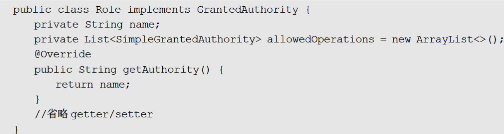

#Spring Security

Spring Security功能本质上都是通过过滤器来实现的。

## 认证

当在springboot中引入Spring Security依赖后，访问controller中的连接会自动跳转进验证

请求会经过过滤器链，在最后的过滤器被拦截并抛出未验证的异常，异常在ExceptionTranslationFilter过滤器中被捕获，并调用方法使得客户端重定向到登录界面。

在默认配置的情况下，引入Spring Security依赖后会创建过滤器并注入spring，过滤器会负责认证授权重定向等功能。

其中一个过滤器会调用attemptAuthentication方法来验证请求的合法性，它接收request、respose并将接收的用户名与密码封装成UsernamePasswordAuthenticationToken对象给AuthenticationManager接口的authenticate方法进行检验（通过providerManager这个实现类实现）。ProviderManager中可能存在许多AuthenticationProvider类。调用ProviderManager类的authenticate方法，选择AuthenticationProvider类。选择的AuthenticationProvider实现中存在UserDetailService接口的实例对象来通过用户名调用loadUserByUsername查询数据库中的密码。在验证后返回一个userDetails的实例。

所以想要实现自己的数据库中的密码研制需要重写UserDetailService接口的实例，以及其中的loadUserByUsername方法

### 自定义认证规则

我们需要继承WebSecurityConfigurerAdapter重写自己的Config

~~~java
public class SecurityConfig extends WebSecurityConfigurerAdapter {
      @Override
    protected void configure(HttpSecurity http) throws Exception {
        http
                //关闭csrf
                .csrf().disable()
                //不通过Session获取SecurityContext
                .sessionManagement().sessionCreationPolicy(SessionCreationPolicy.STATELESS)
                .and() 
                .authorizeRequests()
                // 对于登录接口 允许匿名访问
                .antMatchers("/login").anonymous()
                // 除上面外的所有请求全部不需要认证即可访问
                .anyRequest().permitAll();

        http.logout().disable();
        //允许跨域
        http.cors();
    }
}
~~~

可以通过.loginPage("")自定义登陆页面。登录成功后可以指定跳转

**登录成功**

.successForwardUrl() 使用Forward跳转路径，并且始终跳转指定路径

.defaultSuccessUrl()使用redirect跳转路径，并且优先跳转登录前的页面。

但这两种不适应前后端分离的开发，因为只需要返回前端一个json通知登录与否，这可以使用AuthenticationSuccessHandler接口实现。需要自定义接口实现

**登录失败**

.failureUrl("")表示登录失败后重定向到..页面。不能携带异常信息

.failureForwardUrl("")，服务器跳转，携带错误信息

这些都是AuthenticationFailureHandler接口楼的实现。

**注销登录**

**登录用户数据获取**

登录成功后，用户信息保存在HttpSession中，Spring Security为方便，使用SecurityContextHolder进行封装。获取信息是会使用对象Authentication。

Authentication作为AuthenticationManager的输入，提供用户认证的名字密码。经过认证后它也代表认证完成后的身份信息会以Authentication存在SecurityContextHolder中。

Authentication：包含principal：用户(若使用密码名字登录一般为UserDetails对象)；credentails：登录凭证，一般是密码；authorities：授予的权限信息。

**自定义数据源**

认证流程

AuthenticationManager是一个接口，里面有authenticate方法需要接收Authentication类型的参数(不完整只有用户名密码)，返回一个完整的Authentication对象。方法内完成校验。

AuthenticationManager的默认实现为ProviderManager，其中的authenticate方法提供了AuthenticationProvider类型的列表为List<AuthenticationProvider> providers，这是认证具体的认证方式，就是使用providers的authenticate方法

AuthenticationManager是接口，ProviderManager是实现类，AuthenticationProvider是针对不同身份类型进行的具体认证（用户名密码，手机验证等，不同的方式对应不同的类）。

默认情况下AuthenticationProvider接口由AbstractUserDetailsAuthenticationProvider类的子类DaoAuthenticationProvider类实现的，在DaoAuthenticationProvider认证时通过UserDetailsService完成认证。authenticate方法没有重写所以逻辑在AbstractUserDetailsAuthenticationProvider中，具体调用时会使用UserDetailsService的loadUserByUsername方法。该方法依据用户名返回用户对象包含密码，此时知识返回密码，具体的密码比较在authenticate方法内中后面的additionalAuthenticationChecks方法中

所以自定义认证只需要重写loadUserByUsername方法即可

 **流程**

自定义配置

继承重写WebSecurityConfigurerAdapter

~~~java
//配置全局AuthenticationManager
//1全局默认
////默认的自动配置会找当前项目中谁都存在自定义的UserDetailsService实例，并将器设置为数据源
@Autowired
public void initialize(AuthenticationManagerBuilder builder){
   
}
//2自定义
//自定义的会覆盖默认，自定义的没有自动配置功能，需要手动设置UserDetailsService实例 
@override
public void configure(AuthenticationManagerBuilder builder) {
   
}
~~~

**自定义数据源**

 loadUserByUsername返回一个UserDetails对象。为方便我们一般设计自己的用户表，并创建表的实体类，并使用实体类封装一个类对UserDetails进行实现。

自定义UserDetailsService类的实现，重写loadUserByUsername方法获得密码

在传统web开发中，在前后端分离开发中，可以自定义Filter替换原始的UsernamePasswordAuthenticationFilter，

~~~java
public class LoginFilter extends UsernamePasswordAuthenticationFilter {

    @Override
    public Authentication attemptAuthentication(HttpServletRequest request, HttpServletResponse response) throws AuthenticationException {
        System.out.println("========================================");
        //1.判断是否是 post 方式请求
        if (!request.getMethod().equals("POST")) {
            throw new AuthenticationServiceException("Authentication method not supported: " + request.getMethod());
        }
        //2.判断是否是 json 格式请求类型
        if (request.getContentType().equalsIgnoreCase(MediaType.APPLICATION_JSON_VALUE)) {
            //3.从 json 数据中获取用户输入用户名和密码进行认证 {"uname":"xxx","password":"xxx"}
            try {
                Map<String, String> userInfo = new ObjectMapper().readValue(request.getInputStream(), Map.class);
                String username = userInfo.get(getUsernameParameter());
                String password = userInfo.get(getPasswordParameter());
                System.out.println("用户名: " + username + " 密码: " + password);
                UsernamePasswordAuthenticationToken authRequest = new UsernamePasswordAuthenticationToken(username, password);
                setDetails(request, authRequest);
                return this.getAuthenticationManager().authenticate(authRequest);
            } catch (IOException e) {
                e.printStackTrace();
            }
        }
        return super.attemptAuthentication(request, response);
    }

}

 //自定义 filter 交给工厂管理
@Bean
public LoginFilter loginFilter() throws Exception {
    LoginFilter loginFilter = new LoginFilter();
    loginFilter.setFilterProcessesUrl("/doLogin");//指定认证 url
    loginFilter.setUsernameParameter("uname");//指定接收json 用户名 key
    loginFilter.setPasswordParameter("passwd");//指定接收 json 密码 key
    loginFilter.setAuthenticationManager(authenticationManagerBean());
    //认证成功处理
    loginFilter.setAuthenticationSuccessHandler((req, resp, authentication) -> {
        Map<String, Object> result = new HashMap<>();
        result.put("msg", "登录成功");
        result.put("用户信息", authentication.getPrincipal());
        resp.setContentType("application/json;charset=UTF-8");
        resp.setStatus(HttpStatus.OK.value());
        String s = new ObjectMapper().writeValueAsString(result);
        resp.getWriter().println(s);
    });
    //认证失败处理
    loginFilter.setAuthenticationFailureHandler((req, resp, ex) -> {
        Map<String, Object> result = new HashMap<>();
        result.put("msg", "登录失败: " + ex.getMessage());
        resp.setStatus(HttpStatus.INTERNAL_SERVER_ERROR.value());
        resp.setContentType("application/json;charset=UTF-8");
        String s = new ObjectMapper().writeValueAsString(result);
        resp.getWriter().println(s);
    });
    return loginFilter;
}
~~~

**加密**

默认在authenticate方法内中后面的additionalAuthenticationChecks方法中进行密码匹配，匹配时会依据查询的密码的加密方式进行

~~~java
String id = this.extractId(prefixEncodedPassword);//获得加密方式
//依据加密方式对输入密码进行加密与查询密码进行匹配
~~~

要设置机密方式需要在密码前指定{XXX}。

密码自动升级：只需要实现UserDetailsPasswordService接口，实现updatePassword方法。

**RememberMe**

具体的实现思路就是通过Cookie来记录当前用户身份。当用户登录成功之后，会通过一
定的算法，将用户信息、时间戳等进行加密，加密完成后，通过响应头带回前端存储在Cook
中，当浏览器关闭之后重新打开，如果再次访问该网站，会自动将Cook中的信息发送给服
务器，服务器对Cookie中的信息进行校验分析，进而确定出用户的身份，Cookie中所保存的
用户信息也是有时效的，例如三天、一周等。

只需要在configure中开启.rememberMe()

开启时会引入RememberMeAuthenticationFilter，当SecurityContextHodler中保存的认证过期后，会调用

rememberMeServices.autoLogin来自动登录。autoLogin主要功能是从当前请求的Cookie中提取认证信息，调用decodeCookie方法解析，转化成名字、时间戳、签名。调用processAutoLoginCookie对其验证

返回Authentication对象，不为空则成功，成功的用户信息保存进SecurityContextHodler。

 

持久化令牌：增加了series、token两个校验参数，使用名字密码登录时series更新。一旦有了新的对话token更新。当令牌被盗用时，一旦基于RememberMe登录token更新，自己的RememberMe失效，可以及时处理。Spring Security中对于持久化令牌提供了两种实现：JdbcTokenRepositoryImpl和InMemory
TokenRepositoryImpl（少用）

自定义持久化：

~~~java
.rememberMe() //开启记住我功能
.rememberMeParameter("rememberMe") //用来接收请求中哪个参数作为开启记住我的参数
//.alwaysRemember(true) //总是记住我

~~~

前后端分离

~~~java

/**
 * 自定义记住我 services 实现类
 */
public class MyPersistentTokenBasedRememberMeServices extends PersistentTokenBasedRememberMeServices {

    public MyPersistentTokenBasedRememberMeServices(String key, UserDetailsService userDetailsService, PersistentTokenRepository tokenRepository) {
        super(key, userDetailsService, tokenRepository);
    }

    /**
     * 自定义前后端分离获取 remember-me 方式
     *
     * @param request 请求报文
     * @param parameter 参数
     * @return 是否成功
     */
    @Override
    protected boolean rememberMeRequested(HttpServletRequest request, String parameter) {
        String paramValue = request.getAttribute(parameter).toString();
        if (paramValue != null) {
            return paramValue.equalsIgnoreCase("true") || paramValue.equalsIgnoreCase("on")
                    || paramValue.equalsIgnoreCase("yes") || paramValue.equals("1");
        }
        return false;
    }
}

@Bean
public RememberMeServices rememberMeServices() {
    return new MyPersistentTokenBasedRememberMeServices(
        UUID.randomUUID().toString(),
        userDetailsService(),
        new InMemoryTokenRepositoryImpl()
    );
}
.rememberMe() //开启记住我功能  cookie 进行实现  1.认证成功保存记住我 cookie 到客户端   2.只有 cookie 写入客户端成功才能实现自动登录功能
.rememberMeServices(rememberMeServices())//设置自动登录使用哪个 rememberMeServices
~~~

**会话管理**

当浏览器调用登录接口登录成功后，服务端会和浏览器之间建立一个会话(Session),
浏览器在每次发送请求时都会携带一个SessionId,服务端则根据这个SessionId来判断用户身
份。当浏览器关闭后，服务端的Session并不会自动销毁，需要开发者手动在服务端调用Session销毁方法，或者等Session过期时间到了自动销毁

HttpSession相关的功能由SessionManagementFilter和
SessionAuthenticationStrategy接口来处理，SessionManagementFilter过滤器将Session相关操作委托给SessionAuthenticationStrategy接口去完成。

~~~java
//传统 web 开启会话管理
.sessionManagement()//开启会话管理
.maximumSessions(1)//允许会话最大并发只能一个客户端
.expiredUrl("/login");//传统架构处理方案: 当用户的挤下线之后跳转路径
.maxSessionsPreventsLogin(true);//登录之后禁止再次登录（默认是挤掉前者）
//前后端分离开启会话管理

protected void configure(HttpSecurity http) throws Exception {
    http.authorizeRequests()
        .anyRequest().authenticated()
        .and()
        .formLogin()
        .and()
        .logout()
        .and()
        .csrf().disable()
        .sessionManagement()//开启会话管理
        .maximumSessions(1)//允许会话最大并发只能一个客户端
        //.expiredUrl("/login");//传统架构处理方案: 当用户的挤下线之后跳转路径
        .expiredSessionStrategy(event -> { //前后端分离架构处理分案
            HttpServletResponse response = event.getResponse();
            Map<String, Object> result = new HashMap<>();
            result.put("status", 500);
            result.put("msg", "当前会话已经失效,请重新登录!");
            String s = new ObjectMapper().writeValueAsString(result);
            response.setContentType("application/json;charset=UTF-8");
            response.getWriter().println(s);
            response.flushBuffer();
        })
        .sessionRegistry(sessionRegistry()) //将 session 交给谁管理
        .maxSessionsPreventsLogin(true); //一旦登录 禁止再次登录
}
    // ③会话共享，基于 spring-session、redis，适用于集群环境
private final FindByIndexNameSessionRepository findByIndexNameSessionRepository;

@Autowired
public SecurityConfig(FindByIndexNameSessionRepository findByIndexNameSessionRepository) {
    this.findByIndexNameSessionRepository = findByIndexNameSessionRepository;
}
//创建 session 同步到 redis 中方案
@Bean
public SpringSessionBackedSessionRegistry sessionRegistry() {
    return new SpringSessionBackedSessionRegistry(findByIndexNameSessionRepository);
}
~~~

**CSRF**

CSRF 攻击是一种持用户在当前已登录的浏览器上发送恶意请求的攻击方法。相对于XSS利用用户对指定网站的信任，CSRF则是利用网站对用户网页浏览器的信任。简单来说,CSRF是攻击者通过一些技术手段欺骗用户的浏览器，去访问一个用户曾经认证过的网站并执行恶意请求，例如发送邮件、发消息、甚至财产操作（如转账和购买商品）

防御

具体的操作方式就是在每一个HTTP请求中，除了默认自动携带的Cookie参数之外，再额外提供一个安全的、随机生成的字符串，我们称之为CSRF令牌。这个CSRF令牌由服务端生成，生成后在HttpSession中保存一份。当前端请求到达后，将请求携带的CSRF令牌信息和服务端中保存的令牌进行对比，如果两者不相等，则拒绝掉该HTTP请求。

~~~java
.csrf()
//对于前后端分离，CSRF令牌放在Cookie中
.csrfTokenRepository(CookieCsrfTokenRepository.withHttpOnlyFalse());
~~~

## 授权

依据系统设置规则，给予用户某一资源的权限。

认证成功后，信息存储在Authentication对象中，其中有返回权限信息的方法getAuthorities。返回为集合Collection<? extends GrantedAuthority>, 存储GrantedAuthority类的子类。可以被视为权限。

角色与权限：角色可以代表一类权限的集合

GrantedAuthority的实现类SimpleGrantedAuthority可以表示权限，则角色可为

权限管理策略

**基于过滤器URL的权限管理**

~~~java
//创建内存数据源
@Bean
public UserDetailsService userDetailsService() {
    InMemoryUserDetailsManager inMemoryUserDetailsManager = new InMemoryUserDetailsManager();
    inMemoryUserDetailsManager.createUser(User.withUsername("root").password("{noop}123").roles("ADMIN", "USER").build());
    inMemoryUserDetailsManager.createUser(User.withUsername("lisi").password("{noop}123").roles("USER").build());
    inMemoryUserDetailsManager.createUser(User.withUsername("win7").password("{noop}123").authorities("READ_INFO").build());
    return inMemoryUserDetailsManager;
}
.mvcMatchers(HttpMethod.GET, "/admin").hasRole("ADMIN")  //具有 admin 角色   强大 通用: /admin /admin/  /admin.html
.mvcMatchers("/user").hasRole("USER")    //具有 user 角色
.mvcMatchers("/getInfo").hasAuthority("READ_INFO") //READ_INFO 权限
.antMatchers(HttpMethod.GET, "/admin").hasRole("ADMIN")
//.regexMatchers().hasRole()  //注意: 好处 支持正则表达
~~~

基于方法AOP的权限管理

开启注解权限：@EnableGlobal MethodSecurity(prePostEnabled = true,jsr250Enabled = true,securedEnabled = true)

~~~java
@RestController
public class HelloController {
    /**
     * /admin/**   ROLE_ADMIN
     * /user/**    ROLE_USER
     * /guest/**   ROLE_USER ROLE_GUEST
     *
     *  
     *
     * admin      ADMIN USER
     * user       USER
     * blr        GUEST
     *
     */
    @prePostenable("hasAuthority('READ_INFO')")
    @GetMapping("/admin/hello")
    public String admin() {
        return "hello admin";
    }
 	@prePostenable("hasRole('ADMIN')")
    @GetMapping("/user/hello")
    public String user() {
        return "hello user";
    }
	@prePostenable("hasRole('ADMIN')")
    @GetMapping("/guest/hello")
    public String guest() {
        return "hello guest";
    }

    @GetMapping("/hello")
    public String hello() {
        return "hello";
    }

}
~~~

 **OAuth2**

授权模式：授权码、简化模式、密码模式、客户端模式

