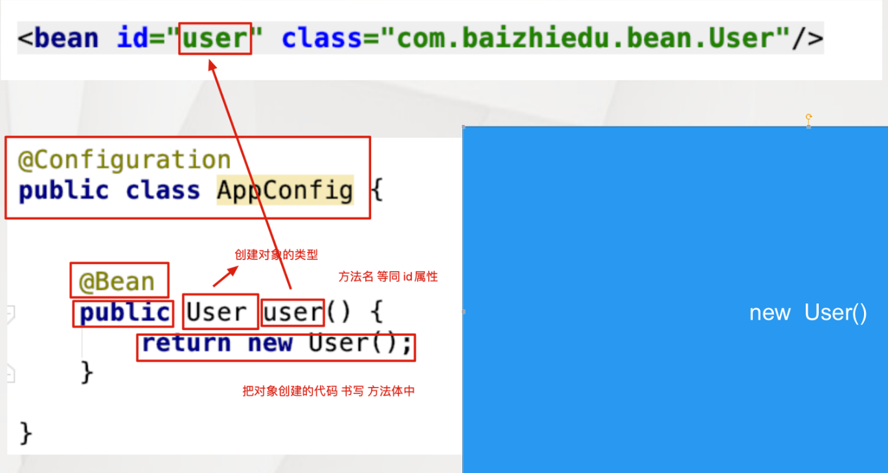

#Spring

轻量级JavaEE解决方案

对于运行环境没有额外要求；代码移植性高，不需要实现额外接口。

**设计模式**

广义上说面向对象设计中，解决特定问题的经典代码。狭义上说GOP4人帮定义23种设计模式

**工厂设计模式**

通过工厂类来创建对象。好处：解耦合

原始设计种使用UserDAO userDAO = new UserDAOImpl();的声明方式，由于UserDAOImpl的改变会导致userDAO 所在的类调用的改变，这是耦合的。借助额外的工厂类来包装，仅仅传递类的参数，无需改变程序

```java
public class BeanFactory {

    private static Properties env = new Properties();
    static{
        try {
            //第一步 获得IO输入流
            InputStream inputStream = BeanFactory.class.getResourceAsStream("/applicationContext.properties");
            //第二步 文件内容 封装 Properties集合中 key = userService value = com.yuziyan.UserServiceImpl
            env.load(inputStream);
        } catch (IOException e) {
            e.printStackTrace();
        }

    }

    /*
	   对象的创建方式：
	       1. 直接调用构造方法 创建对象  UserService userService = new UserServiceImpl();
	       2. 通过反射的形式 创建对象 解耦合
	       Class clazz = Class.forName("com.yuziyan.basic.UserServiceImpl");
	       UserService userService = (UserService)clazz.newInstance();
     */

    public static UserService getUserService(){
        UserService userService = null;
        try {
            //                          com.yuziyan.basic.UserServiceImpl
            Class clazz = Class.forName(env.getProperty("userService"));
            userService = (UserService) clazz.newInstance();
        } catch (ClassNotFoundException e) {
            e.printStackTrace();
        } catch (InstantiationException e) {
            e.printStackTrace();
        } catch (IllegalAccessException e) {
            e.printStackTrace();
        }
        return userService;
    }

    public static UserDao getUserDao(){
        UserDao userDao = null;
        try {
            Class clazz = Class.forName(env.getProperty("userDao"));
            userDao = (UserDao) clazz.newInstance();
        } catch (ClassNotFoundException e) {
            e.printStackTrace();
        } catch (InstantiationException e) {
            e.printStackTrace();
        } catch (IllegalAccessException e) {
            e.printStackTrace();
        }
        return userDao;
    }
}
```

通用工厂设计

```java
public class BeanFactory {

    private static Properties env = new Properties();
    static{
        try {
            //第一步 获得IO输入流
            InputStream inputStream = BeanFactory.class.getResourceAsStream("/ applicationContext.properties");
            //第二步 文件内容 封装 Properties集合中 key = userService value = com.yuziyan.UserServiceImpl
            env.load(inputStream);
        } catch (IOException e) {
            e.printStackTrace();
        }

    }
    //通用工厂
    public static Object getBean(String key){
        Object res = null;
        try {
            Class clazz = Class.forName(env.getProperty(key));
            res = clazz.newInstance();
        } catch (ClassNotFoundException e) {
            e.printStackTrace();
        } catch (InstantiationException e) {
            e.printStackTrace();
        } catch (IllegalAccessException e) {
            e.printStackTrace();
        }
        return res;
    }
}
```

spring自动帮我们集成了一些工厂，只需要调用其配置文件，做好配置就可以实现上述效果

```java
//配置文件的配置 applicationContext.xml
 <bean id="id名字" class="类名"/>  //class这里就是反射时用到的参数
//通过工厂类，获得对象
ApplicationContext ctx = new ClassPathXmlApplicationContext("/applicationContext.xml");
Person person = (Person)ctx.getBean("person");

//getBean存在三种重载方式
Person person = (Person)ctx.getBean("person")
Person person = ctx.getBean("person",Person.class);//无需强制类型转换    
Person person = ctx.getBean(Person.class); //要求配置文件只有1个 Person类

//获取配置文件中所有bean标签的id值  
String[] beanDefinitionNames = ctx.getBeanDefinitionNames();
//根据类型获取配置文件中对应bean标签的id值
String[] beanNamesForType = ctx.getBeanNamesForType(Person.class);
//用于判断是否存在指定id值的bean，不能判断name值
ctx.containsBeanDefinition("a");
//用于判断是否存在指定id值的bean，可以判断name值
ctx.containsBean("person");
```

**spring与日志整合**

便于了解Spring框架的运行过程，利于程序的调试。 Spring 5.x 默认整合的⽇志框架 logback、log4j2

##**注入Injection**

通过Spring工厂及配置文件，为所创建对象的成员变量赋值. 注入的好处：**解耦合**

前提：类的成员变量提供set get方法, 配置Spring配置文件.

```xml
<bean id="person1" name="p" class="com.yuziyan.basic.Person">
    <property name="name">
        <value>张无忌</value>
    </property>
    <property name="age">
        <value>200</value>
    </property>
</bean>

<!-- list标签 -->
<property name="emails">
    <list>
        <value>1234@qq.com</value>
        <value>yangGuo@qq.com</value>
    </list>
</property>
<!-- List集合中有非基本类型时： -->
<list>
   <ref bean
   <set 
</list>
<!-- set标签 -->
<property name="tels">
    <set>
        <value>131********</value>
        <value>159********</value>
    </set>
</property>
<!-- Set集合中有非基本类型时： -->
<set>
   <ref bean
   <set 
</set>

<!-- 需要用到map entry key三个标签 -->
<property name="qqs">
    <map>
        <entry>
            <key><value>周芷若</value></key>
            <value>备胎</value>
        </entry>
        <entry>
            <key><value>赵敏</value></key>
            <value>爱人</value>
        </entry>
    </map>
</property>
<!-- Map集合中有非基本类型时： -->
<entry>
	<key><value>chenyn</value></key>
	<ref bean=""
</entry>
<!-- props和prop标签 -->
<property name="p">
    <props>
        <prop key="唐僧">白骨精</prop>
        <prop key="Tom">Jerry</prop>
    </props>
</property>    
```

不同的成员变量类型不同，<value>会发生变化

用自定义类型时

```xml
//方式一
<bean id="userService" class="com.xxxx.basic.UserSeriviceImpl">
    <property name="userDAO">
        <bean class="com.xxxx.basic.UserDAOImpl"/>
    </property>
</bean>
//方式二
方式1在需要多个userDAO对象的时候存在代码冗余，要写一样的代码多遍。
<bean id="userDAO" class="com.xxxx.basic.UserDAOImpl"/>
<bean id="userService" class="com.xxxx.basic.UserSeriviceImpl">
    <property name="userDAO">
        <ref bean="userDAO"/>
    </property>
</bean>
```

```xml
JDK类型注入：（注意：value属性 只能简化 8种基本类型+String 注入标签）：
<!-- 简化前 -->
<bean id="person2" class="com.yuziyan.basic.Person">
    <property name="name">
        <value>韩信</value>
    </property>
</bean>

<!-- 简化后 -->
<bean id="person2" class="com.yuziyan.basic.Person">
    <property name="name" value="韩信"/>
</bean>

<!-- 简化前 -->
<bean id="userDao" class="com.yuziyan.basic.UserDaoImpl"/>
<bean id="userService" class="com.yuziyan.basic.UserServiceImpl">
    <property name="userDao">
        <ref bean="userDao"/>
    </property>
</bean>

<!-- 简化后 -->
<bean id="userDao" class="com.yuziyan.basic.UserDaoImpl"/>
<bean id="userService" class="com.yuziyan.basic.UserServiceImpl">
    <property name="userDao" ref="userDao"/>
</bean>
```

**构造注入**

pring解析配置文件，调用构造方法，为成员变量赋值。

提供带参数构造方法；Spring配置文件中赋值（注入）

```xml
<bean id="customer" class="com.yuziyan.basic.constructor.Customer">
    <constructor-arg>
        <value>武松</value>
    </constructor-arg>
    <constructor-arg>
        <value>234</value>
    </constructor-arg>
</bean>
```

构造方法可以进行重载，参数不同的重载通过控制<constructor-arg>标签的数量进行区分，参数相同，类型不同的重载通过在标签引入 type属性 进行类型的区分 <constructor-arg type="">

**控制反转**（IOC）

把对于成员变量赋值的控制权，从代码中反转(转移)到Spring工厂和配置文件中完成。

好处：解耦合  底层实现：工厂设计模式

**依赖注入**（DI）

当一个类需要另一个类时，就意味着依赖，这时可以把另一个类作为本类的成员变量，最终通过Spring配置文件进行注入(赋值)。好处：解耦合。

##**Spring工厂创建复杂对象**

复杂对象：指的就是不能直接通过new构造方法创建的对象。如Connection，SqlSessionFactory。

**FactoryBean接口方式**

实现FactoryBean接口；Spring配置文件中注册


1. 如果就想获得FactoryBean类型的对象，在id前加上&符号，`ctx.getBean("&conn")`，此时获得的就是ConnectionFactoryBean对象本身。

2. `isSingleton()`方法，返回 true 只会创建一个复杂对象，返回 false 每一次都会创建新的对象

   问题：根据这个对象的特点 ，决定是返回true (SqlSessionFactory) 还是 false (Connection)。

3. mysql高版本连接创建时，需要制定SSL证书，解决问题的方式。

 **实例工厂**

作用：避免Spring框架的侵入；整合遗留系统。

步骤：定义实例工厂类；Spring配置文件中注册

```xml
public class ConnectionFactory {
    public Connection getConnection(){
        //xxxx
        return conn;
    }
}


<bean id="connFactory" class="com.yuziyan.xxxx.ConnectionFactory"/>
<bean id="conn" factory-bean="connFactory" factory-method="getConnection"/>

```

**静态工厂**

同实例工厂，但方法是静态的。

```xml
public class StaticConnectionFactory {
    public static Connection getConnection(){
        //xxxx
        return conn;
    }
}
<bean id="conn1" class="xxx.StaticConnectionFactory" factory-method="getConnection"/>
```

**控制spring工厂创建次数**

为了减少不必要的内存浪费，我们需要控制次数

想SqlSessionFactory、DAO等需要资源很多的需要只创建一次。

```java
//简单对象
//singleton:只会创建一次简单对象 默认值 prototype:每一次都会创建新的对象
<bean id="account" scope="singleton|prototype" class="xxxx.Account"/>

//复杂对象
FactoryBean{
   isSingleton(){
      return true;//只会创建一次
      return false;//每一次都会创建新的
   }
}
//如没有isSingleton方法，还是通过scope属性，进行控制。
```

## Spring工厂高级特性

**对象的生命周期**

一个对象创建、存活、消亡的一个完整过程

创建阶段

对象只创建一次是，Spring工厂创建的同时，对象也会被创建。多次创建时会在获取对象时创建(ctx.getBean("")时)。如果有属性需要注入(DI)，会在创建完成时立即进行注入。

初始化阶段

创建阶段完成后，Spring会调用对象的初始化方法，完成对应的初始化操作。

初始化操作：资源的初始化：数据库、IO、网络 .....

程序员提供初始化方法的途径：

```java
//1实现InitializingBean接口：
//实现这个方法，完成初始化操作
public void afterProperitesSet(){
  
}
//2对象中提供一个普通的方法同时配置Spring配置文件：
public void myInit(){
  
}
<bean id="product" class="xxx.Product" init-method="myInit"/>
//一个对象即实现InitializingBean，同时又提供的普通的初始化方法 ，顺序：
//1. InitializingBean 
//2. 普通初始化方法
```

销毁阶段

Spring销毁对象在工厂关闭ctx.close()前，会调用对象的销毁方法，完成销毁操作

销毁方法的操作只适用于 `scope="singleton"`

销毁操作主要指资源的释放操作，比如`io.close();` ` connection.close();`

程序员提供销毁方法的途径：

```java
//1实现DisposableBean
public void destroy()throws Exception{
  
}
//2定义一个普通的销毁方法同时配置Spring配置文件：
public void myDestroy()throws Exception{

}
<bean id="" class="" init-method="" destroy-method="myDestroy"/>
```

**配置文件参数化**

把Spring配置文件中需要经常修改的字符串信息，转移到一个更小的配置文件中。

要提供一个小的配置文件(.properities)

```properties
//小文件
jdbc.driverClassName = com.mysql.jdbc.Driver
jdbc.url = jdbc:mysql://localhost:3306/test?useSSL=false
jdbc.username = root
jdbc.password = root
//与配置文件整合
<context:property-placeholder location="classpath:/db.properties"/>
```

**自定义类型转换器**

Spring通过类型转换器把配置文件中字符串类型的数据，转换成对象中成员变量对应类型的数据，进而完成了注入。

实际应用中需要转换某种特定的类型，且Spring内部没有提供这种类型转换器时，需要程序员自己定义。

 步骤：实现Converter接口；在spring配置文件中进行配置

```java
public class MyDateConverter implements Converter<String, Date> {
    /*
    convert方法作用：String --->  Date
                   SimpleDateFormat sdf = new SimpleDateFormat();
                   sdf.parset(String) ---> Date
    param:source 代表的是配置文件中 日期字符串 <value>2020-10-11</value>

    return : 当把转换好的Date作为convert方法的返回值后，Spring自动的为birthday属性进行注入（赋值）

    */
    public Date convert(String source) {
        Date date = null;
        try {
            SimpleDateFormat sdf = new SimpleDateFormat("yyyy-MM-dd");
            date = sdf.parse(source);
        } catch (ParseException e) {
            e.printStackTrace();
        }
        return date;
    }
}

<!-- 创建自定义转换器对象 -->
<bean id="myDateConverter" class="com.yuziyan.converter.MyDateConverter"/>

<!-- 在Spring中注册自定义的转换器 -->
<!-- 目的：告知Spring框架，我们所创建的MyDateConverter是一个类型转换器 -->
<bean id="conversionService" class="org.springframework.context.support.ConversionServiceFactoryBean">
    <property name="converters">
        <set>
            <ref bean="myDateConverter"/>
        </set>
    </property>
</bean>

```

**后置处理Bean**

BeanPostProcessor(接口)：对Spring工厂所创建的对象，进行再加工。

Object postProcessBeforeInitiallization(Object bean String beanName)
作用：Spring创建完对象，并进行注入后，会运行Before方法进行加工

Object postProcessAfterInitiallization(Object bean String beanName)
作用：Spring执行完对象的初始化操作后，会运行After方法进行加工

```java
public class MyBeanPostProcessor implements BeanPostProcessor {

    @Override
    public Object postProcessBeforeInitialization(Object bean, String beanName) throws BeansException {
        return bean;
    }

    @Override
    public Object postProcessAfterInitialization(Object bean, String beanName) throws BeansException {

        Categroy categroy = (Categroy) bean;
        categroy.setName("xiaowb");


        return categroy;
    }
}
<bean id="myBeanPostProcessor" class="xxx.MyBeanPostProcessor"/>
```

## AOP编程

**静态代理设计模式**

JavaEE分层开发中，最为重要的是Service层

通过代理类，为原始类（目标）增加额外的功能 好处：利于原始类(目标)的维护

代理类 = 实现和目标类相同的接口 + 在同名方法中添加额外功能 + 调用原始类同名方法

静态类文件数量过多，不利于项目管理
额外功能维护性差

**动态代理开发**

概念：通过代理类为原始类(目标类)增加额外功能,代理类由Spring动态生成。
好处：利于原始类(目标类)的维护

```java
//创建原始类及对象
public class UserServiceImpl implements UserService{
    @Override
    public void register(User user) {
        System.out.println("UserServiceImpl.register");
    }

    @Override
    public boolean login(String name, String password) {
        System.out.println("UserServiceImpl.login");
        return true;
    }
}

//定义额外功能。实现MethodBeforeAdvice接口
public class Before implements MethodBeforeAdvice {
	//作用：给原始方法添加额外功能
    //注意：会在原始方法运行之前运行此方法
    @Override
    public void before(Method method, Object[] args, Object target) throws Throwable {
        System.out.println("-----method before advice log------");
    }
}
//
<bean id="userServiceImpl" class="com.yuziyan.factory.UserServiceImpl"></bean>
    
<bean id="before" class="com.yuziyan.dynamic.Before"/>
//定义切入点，由程序员根据自己的需要，决定额外功能加入给那个原始方法
<aop:config>
<aop:pointcut id="pc" expression="execution(* *(..))"/>
</aop:config>
//组装
<aop:advisor advice-ref="before" pointcut-ref="pc"/>
//调用，获得Spring工厂创建的动态代理对象，并进行调用
    
    

ApplicationContext ctx = new ClassPathXmlApplicationContext("/applicationContext.xml");
UserService userService=(UserService)ctx.getBean("userService");
userService.login("")
userService.register()
```

在额外功能不改变的前提下，创建其他目标类（原始类）的代理对象时，只需要指定原始(目标)对象即可。

**额外功能**

MethodBeforeAdvice

```java
public class Before implements MethodBeforeAdvice {
    /**
     * 作用：给原始方法添加额外功能
     * 注意：会在原始方法运行之前运行此方法
     * @param method 原始方法 login() register() ...
     * @param objects 原始方法的参数列表 name password ...
     * @param o 原始对象 UserService Impl OrderServiceImpl
     * @throws Throwable 抛出的异常
     */
    @Override
    public void before(Method method, Object[] objects, Object o) throws Throwable {
        System.out.println("---- MethodBeforeAdvice  log... ----");
    }
}
```

MethodInterceptor(方法拦截器)

MethodInterceptor接口：额外功能可定义在原始方法执行 前、后、前和后。

```java
public class Around implements MethodInterceptor {
    /**
     * @param invocation 封装了原始方法 invocation.proceed()表示原始方法的运行
     * @return 原始方法的返回值
     * @throws Throwable 可能抛出的异常
     */
    @Override
    public Object invoke(MethodInvocation invocation) throws Throwable {
        System.out.println("------ 额外功能 log -----");
		//原始方法的执行
        Object ret = invocation.proceed();
        //返回原始方法的返回值
        return ret;
    }
}
```

MethodInterceptor可以影响原始方法的返回值

切入点决定了额外功能加入的位置，execution()  切入点函数

```markdown
*  *(..)  --> 所有方法

* ---> 修饰符 返回值
* ---> 方法名
()---> 参数表
..---> 对于参数没有要求 (0个或多个)

# 定义login方法作为切入点
* login(..)

# 定义register作为切入点
* register(..)

# 定义名字为login且有两个字符串类型参数的方法 作为切入点
* login(String,String)

# 注意：非java.lang包中的类型，必须要写全限定名
* register(com.yuziyan.proxy.User)

# ..可以和具体的参数类型连用(至少有一个参数是String类型)
* login(String,..)

# 精准方法切入点限定
# 修饰符  返回值    包.类.方法(参数)

*  com.yuziayn.proxy.UserServiceImpl.login(..)
*  com.yuziyan.proxy.UserServiceImpl.login(String,String)
```

类切入点表达式：指定特定的类作为切入点，即这个类中所有的方法都会加上额外功能。

```markdown
# 类中的所有方法都加入额外功能 
* com.yuziyan.proxy.UserServiceImpl.*(..)

# 忽略包
# 1. 类只在一级包下  com.UserServiceImpl
* *.UserServiceImpl.*(..)

# 2. 类可在多级包下  com.yuziyan.proxy.UserServiceImpl
* *..UserServiceImpl.*(..)
```

包切入点表达式：指定包作为切入点，即这个包中的所有类及其方法都会加入额外的功能

```markdown
# proxy包作为切入点，即proxy包下所有类中的所有方法都会加入额外功能，但是不包括其子包中的类！
* com.yuziyan.proxy.*.*(..)

# 当前包及其子包都生效
* com.yuziyan.proxy..*.*(..) 
```

切入点函数：用于执行切入点表达式

**execution()**

最为重要的切入点函数，功能最全！
用于执行：方法切入点表达式、类切入点表达式、包切入点表达式 

弊端：execution执行切入点表达式 ，书写麻烦
     execution(* com.yuziyan.proxy..*.*(..))
   注意：其他的切入点函数 只是简化execution书写复杂度，功能上完全一致

**args()：**用于函数(方法)参数的匹配

举例：方法参数必须得是2个字符串类型的参数

```markdown
execution(* *(String,String))
等价于：
args(String,String)
```

**within()**：用于进行类、包切入点表达式的匹配

```markdown

# UserServiceImpl类作为切入点：
	execution(* *..UserServiceImpl.*(..))
	within(*..UserServiceImpl)
# proxy包作为切入点：
	execution(* com.yuziyan.proxy..*.*(..))
	within(com.yuziayan.proxy..*)
```

@annotation():为具有特殊注解的方法加入额外功能

```xml
<aop:pointcut id="" expression="@annotation(com.baizhiedu.Log)"/>
```

 切入点函数间的逻辑运算：整合多个切入点函数一起配合工作，进而完成更为复杂的需求。

```java
//and
execution(* login(..)) and args(String,String)
//与操作不能用于同种类型的切入点函数 
    
//or
execution(* login(..)) or  execution(* register(..))    
```

**AOP**

```markdown
AOP (Aspect Oriented Programing)   面向切面编程 = Spring动态代理开发
以切面为基本单位的程序开发，通过切面间的彼此协同，相互调用，完成程序的构建
切面 = 切入点 + 额外功能

OOP (Object Oriented Programing)   面向对象编程 Java
以对象为基本单位的程序开发，通过对象间的彼此协同，相互调用，完成程序的构建

POP (Procedure Oriented Programing) 面向过程(方法、函数)编程 C 
以过程为基本单位的程序开发，通过过程间的彼此协同，相互调用，完成程序的构建

AOP的概念：
     本质就是Spring的动态代理开发，通过代理类为原始类增加额外功能。
     好处：利于原始类的维护

注意：AOP编程不可能取代OOP，而是OOP编程的补充。
```

 jdk编码

\`Proxy.newProxyInstance()`方法参数详解:

```java
public class TestJDKProxy {
    public static void main(String[] args) {
        //1.创建原始对象
        //注意：由于后面匿名子类的方法中用到了userService，所以应该用final修饰
        //     而JDK1.8以后默认加了final，不需要手动加
        UserService userService = new UserServiceImpl();

        //2.JDK创建代理对象
        InvocationHandler handler = new InvocationHandler() {
            @Override
            public Object invoke(Object proxy, Method method, Object[] args) throws Throwable {
                System.out.println("----------- JDKProxy log -----------");\
                //目标方法运行：
                Object ret = method.invoke(userService, args);
                return ret;
            }
        };

        UserService userServiceProxy = (UserService) 					Proxy.newProxyInstance(userService.getClass().getClassLoader(), 							userService.getClass().getInterfaces(),handler);

        userServiceProxy.login("海绵宝宝", "1111");
        userServiceProxy.register(new User());

    }
}
```

CGlib编码

```java
public class TestCGlibProxy {
    public static void main(String[] args) {
        //1.创建原始对象
        UserServiceImpl userService = new UserServiceImpl();

        //2.通过CGlib创建代理对象
        //  2.1 创建Enhancer
        Enhancer enhancer = new Enhancer();
        //  2.2 设置借用类加载器
        enhancer.setClassLoader(TestCGlibProxy.class.getClassLoader());
        //  2.3 设置父类（目标类）
        enhancer.setSuperclass(userService.getClass());
        //  2.4 设置回调，额外功能写在里面
        enhancer.setCallback(new MethodInterceptor() {
            //相当于 InvocationHandler --> invoke()
            @Override
            public Object intercept(Object o, Method method, Object[] objects, MethodProxy methodProxy) throws Throwable {
                //额外功能：
                System.out.println("========= CGlibProxy log ========");
                //目标方法执行：
                Object ret = method.invoke(userService, objects);
                return ret;
            }
        });
        //  2.5 通过Enhancer对象创建代理
        UserServiceImpl service = (UserServiceImpl) enhancer.create();

        //测试：
        service.register();
        service.login();

    }
}
```

**基于注解的AOP编程**

```java
/**
 * 声明切面类     @Aspect
 * 定义额外功能   @Around
 * 定义切入点     @Around("execution(* login(..))")
 *
 */
@Aspect
public class MyAspect {

    @Around("execution(* login(..))")//组装了切入点和额外功能
    public Object around(ProceedingJoinPoint joinPoint) throws Throwable {
        //额外功能：
        System.out.println("--------- 基于注解的AOP编程 log --------");
        //原始方法执行：
        Object ret = joinPoint.proceed();

        return ret;
    }
}
<!-- 原始对象 -->
<bean id="userService" class="com.yuziyan.aspect.UserServiceImpl"></bean>

<!-- 切面 -->
<bean id="myAspect" class="com.yuziyan.aspect.MyAspect"/>

<!-- 开启基于注解的AOP编程 -->
<aop:aspectj-autoproxy/>
```

## 持久层

JavaEE开发需要持久层进行数据库的访问操作。JDBC、Hibernate、MyBatis开发过程存在大量的代码冗余，Spring基于模板设计模式对于上述的持久层技术进行了封装

**与mybatis整合**

```xml
<!-- 注意：以下一个项目只需要配置一次 --> 
<bean id="dataSource" class=""/> 

<!--注册SqlSessionFactoryBean 为了创建SqlSessionFactory-->
<bean id="ssfb" class="SqlSessionFactoryBean">
    <property name="dataSource" ref=""/>
    <property name="typeAliasesPackage">
         指定 实体类所在的包  com.baizhiedu.entity  User
                                                 Product
    </property>
    <property name="mapperLocations">
          指定 配置文件(映射文件)的路径 还有通用配置 
          com.baizhiedu.mapper/*Mapper.xml 
    </property>
</bean>

<!--DAO接口的实现类
    session ---> session.getMapper() --- xxxDAO实现类对象 
    XXXDAO  ---> xXXDAO
-->
<bean id="scanner" class="MapperScannerConfigure">
    <property name="sqlSessionFactoryBeanName" value="ssfb"/>
    <property name="basePacakge">
        指定 DAO接口放置的包  com.baizhiedu.dao 
    </property>
</bean>


<!--连接池-->
<bean id="dataSource" class="com.alibaba.druid.pool.DruidDataSource">
  <property name="driverClassName" value="com.mysql.jdbc.Driver"></property>
  <property name="url" value="jdbc:mysql://localhost:3306/suns?useSSL=false"></property>
  <property name="username" value="root"></property>
  <property name="password" value="123456"></property>
</bean>

<!--注册SqlSessionFactoryBean 为了创建SqlSessionFactory-->
<bean id="sqlSessionFactoryBean" class="org.mybatis.spring.SqlSessionFactoryBean">
  <property name="dataSource" ref="dataSource"></property>
  <property name="typeAliasesPackage" value="com.baizhiedu.entity"></property>
  <property name="mapperLocations">
    <list>
      <value>classpath:com.baizhiedu.mapper/*Mapper.xml</value>
    </list>
  </property>
</bean>

<!--注册MapperScannerConfigure 用于创建Dao的实现类-->

<bean id="scanner" class="org.mybatis.spring.mapper.MapperScannerConfigurer">
  <property name="sqlSessionFactoryBeanName" value="sqlSessionFactoryBean"></property>
  <property name="basePackage" value="com.baizhiedu.dao"></property>
</bean>
```

**事务**

事务是保证业务操作完整性的一种数据库机制。

spring通过AOP的方式进行事务开发。

 spring中的事务额外方法已经封装，使用DataSourceTransactionManager类实现，实现事务需要Connection，要声明连接池获取。最后通过基于注解的AOP编程方法实现。使用@Transactional在原始类中添加，这样类下的所有方法都添加了事务的额外功能。若注解添加到方法上，只该方法添加事务

```xml
<!-- 原始对象 -->
<bean id="userService" class="com.baizhiedu.service.UserServiceImpl">
	<property name="userDAO" ref="userDAO"/>
</bean>

<!--DataSourceTransactionManager-->
<bean id="dataSourceTransactionManager" class="org.springframework.jdbc.datasource.DataSourceTransactionManager">
    <!-- 需要Connection 而Connection又在dataSource里 -->
 	<property name="dataSource" ref="dataSource"/>
</bean>

@Transactional
public class UserServiceImpl implements UserService {
    private UserDAO userDAO;
<!-- 告诉Spring开启基于注解的事务管理 -->
<tx:annotation-driven transaction-manager="dataSourceTransactionManager"/>
```

可以向事务添加属性@Transactional(isloation=,propagation=,readOnly=,timeout=,rollbackFor=,noRollbackFor=,)

**隔离属性**：参照mysql(脏读、不可重复读、幻读)

**传播属性**：描述了事务解决嵌套问题的特征。

若事务A内包含子事务B，子事务B会导致事务原子性的丧失。如子事务B提交会导致事务A回滚失效。

| 传播属性的值  | 外部不存在事务 | 外部存在事务               | 用法                                                    | 备注           |
| ------------- | -------------- | -------------------------- | ------------------------------------------------------- | -------------- |
| REQUIRED      | 开启新的事务   | 融合到外部事务中           | @Transactional(propagation = Propagation.REQUIRED)      | 增删改方法     |
| SUPPORTS      | 不开启事务     | 融合到外部事务中           | @Transactional(propagation = Propagation.SUPPORTS)      | 查询方法       |
| REQUIRES_NEW  | 开启新的事务   | 挂起外部事务，创建新的事务 | @Transactional(propagation = Propagation.REQUIRES_NEW)  | 日志记录方法中 |
| NOT_SUPPORTED | 不开启事务     | 挂起外部事务               | @Transactional(propagation = Propagation.NOT_SUPPORTED) | 及其不常用     |
| NEVER         | 不开启事务     | 抛出异常                   | @Transactional(propagation = Propagation.NEVER)         | 及其不常用     |
| MANDATORY     | 抛出异常       | 融合到外部事务中           | @Transactional(propagation = Propagation.MANDATORY)     | 及其不常用     |

增删改 方法：直接使用默认值REQUIRED 
查询   操作：显示指定传播属性的值为SUPPORTS  

**只读属性**：针对于只进行查询操作的业务方法，可以加入只读属性，提供运行效率。默认false

**超时属性**：指定事务等待的最长时间。当访问数据被别的事务加锁时会等待@Transactional(timeout=2)单位秒

**异常属性**：

```java
//Spring事务处理过程中
//默认 对于RuntimeException及其子类 采用的是回滚的策略
//默认 对于Exception及其子类 采用的是提交的策略

rollbackFor = {java.lang.Exception,xxx,xxx} 
noRollbackFor = {java.lang.RuntimeException,xxx,xx}

@Transactional(rollbackFor = {java.lang.Exception.class},noRollbackFor = {java.lang.RuntimeException.class})

//建议：实战中使用RuntimeExceptin及其子类 使用事务异常属性的默认值
```

```text
常见配置
1. 隔离属性   默认值 
2. 传播属性   Required(默认值) 增删改   Supports 查询操作
3. 只读属性   readOnly false  增删改   true 查询操作
4. 超时属性   默认值 -1
5. 异常属性   默认值 

增删改操作   @Transactional
查询操作     @Transactional(propagation=Propagation.SUPPORTS,readOnly=true)
```

**基于标签的事务配置方式**

```xml
<bean id="userService" class="com.baizhiedu.service.UserServiceImpl">
  <property name="userDAO" ref="userDAO"/>
</bean>
<!--DataSourceTransactionManager-->
<bean id="dataSourceTransactionManager" class="org.springframework.jdbc.datasource.DataSourceTransactionManager">
  <property name="dataSource" ref="dataSource"/>
</bean>
<!-- 事务属性 -->
<tx:advice id="txAdvice" transacation-manager="dataSourceTransactionManager">
    <tx:attributes>
          <tx:method name="register" isoloation="",propagation=""></tx:method>
          <tx:method name="login" .....></tx:method>
          等效于 
          @Transactional(isolation=,propagation=,)
          public void register(){
        
          }
      
    </tx:attributes>
</tx:advice>

<aop:config>
     <aop:pointcut id="pc" expression="execution(* com.baizhiedu.service.UserServiceImpl.register(..))"></aop:pointcut>
     <aop:advisor advice-ref="txAdvice" pointcut-ref="pc"></aop:advisor>
</aop:config>
```

在实战中的应用时,使用负责进行增删改操作的方法 都以modify开头，查询方法都可以。使用通配符来简化方法的重复书写。这里第二个*表示除了前面的以外的方法。

```xml
    <tx:attributes>
          <tx:method name="register"></tx:method>
          <tx:method name="modify*"></tx:method>
          <tx:method name="*" propagation="SUPPORTS"  read-only="true"></tx:method>
    </tx:attributes>
```

## 注解编程

指的是在类或者方法上加入特定的注解（`@XXX`）完成特定功能的开发。

作用：替换XML这种配置形式，简化配置；替换接口，实现调用双方的契约性


**基础注解**

```xml
<!-- 告知Spring扫描指定包及其子包对应的注解 -->
<context:component-scan base-package="com.xxxx"/>
```

**@Component:**替换原有spring配置文件中的<bean>标签 ,component注解默认的id：首单词首字母小写.class属性 通过反射获得class内容 。也可以手动指定id，@Component("u").

@Component的衍生注解：@Repository、@Service、@Controller 。本质上与Component一样。目的：更加准确表达类型作用

**@Scope注解**：控制简单对象创建次数，不添加@Scope Spring提供默认值 singleton

**@Lazy注解**：延迟创建单实例对象，一旦使用了@Lazy注解后，Spring会在获取这个对象时候，才进行创建

生命周期方法相关注解：

```
1. 初始化相关方法 @PostConstruct  "构造后处理"
   InitializingBean
   <bean init-method=""/>
2. 销毁方法 @PreDestroy    "销毁前处理"
   DisposableBean
   <bean destory-method=""/>
注意：1. 上述的2个注解并不是Spring提供的，JSR(JavaEE规范)520
     2. 再一次的验证，通过注解实现了接口的契约性 
```

**注入注解**

用户自定义类型 **@Autowired**

```xml
@Autowired细节
1. Autowired注解基于类型进行注入 [推荐]
   基于类型的注入：注入对象的类型，必须与目标成员变量类型相同或者是其子类（实现类）

2. Autowired Qualifier 基于名字进行注入 [了解]
   基于名字的注入：注入对象的id值，必须与Qualifier注解中设置的名字相同

3. Autowired注解放置位置 
    a) 放置在对应成员变量的set方法上 
    b) 放置在成员变量之上，Spring通过反射直接对成员变量进行注入（赋值）[推荐]

4. JavaEE规范中类似功能的注解
    JSR250 @Resouce(name="userDAOImpl") 基于名字进行注入
           @Autowired()
           @Qualifier("userDAOImpl")
           注意：如果在应用Resource注解时，名字没有配对成功，那么他会继续按照类型进行注入。
    JSR330 @Inject 作用 @Autowired完全一致 基于类型进行注入 ---》 EJB3.0
          <dependency>
            <groupId>javax.inject</groupId>
            <artifactId>javax.inject</artifactId>
            <version>1</version>
          </dependency>
```

**@Value**

```
1. 设置xxx.properties 
   id = 10
   name = suns
2. 告知Spring的工厂读取这个xxx.properties配置文件：
   	 方式一：applicationContext.xml文件中加：
   			<context:property-placeholder location=""/>
   	 方式二：类上加 @PropertySource("") 注解，指明配置文件路径
3. 代码中获取：
   属性上加 @Value("${key}") 注解
```

 @Value注解不能应用在静态成员变量上,@Value注解+Properties这种方式，不能注入集合类型

**注解扫描**

```xml
排除方式
<context:component-scan base-package="com.baizhiedu">
   <context:exclude-filter type="" expression=""/>
   type: assignable:排除特定的类型 不进行扫描
         annotation:排除特定的注解 不进行扫描
         aspectj:切入点表达式（指定的包/类 不进行扫描）
                 包切入点： com.baizhiedu.bean..*
                 类切入点： *..User
         regex:正则表达式 
         custom：自定义排除策略框(架底层开发才会使用)
</context:component-scan>

排除策略可以叠加使用 
<context:component-scan base-package="com.baizhiedu">
  <context:exclude-filter type="assignable" expression="com.baizhiedu.bean.User"/>

  <context:exclude-filter type="aspectj" expression="com.baizhiedu.injection..*"/>
</context:component-scan>
```

```xml
包含方式
<context:component-scan base-package="com.baizhiedu" use-default-filters="false">
   <context:include-filter type="" expression=""/>
</context:component-scan>

1. use-default-filters="false"
   作用：让Spring默认的注解扫描方式 失效。
2. <context:in  clude-filter type="" expression=""/>
   作用：指定要扫描的注解 
   type:assignable:只扫描指定的类型
        annotation:只扫描指定的注解
        aspectj:切入点表达式（只扫描指定的包/类）
                包切入点： com.baizhiedu.bean..*
                类切入点： *..User
        regex:正则表达式 
        custom：自定义排除策略框架底层开发

包含的方式也支持叠加
<context:component-scan base-package="com.baizhiedu" use-default-filters="false">
    <context:include-filter type="annotation" expression="org.springframework.stereotype.Repository"/>
    <context:include-filter type="annotation" expression="org.springframework.stereotype.Service"/>
</context:component-scan>
```

**高级注解**

Spring在3.x提供的新的注解，用于替换XML配置文件。

 @Configuration：将类变为配置bean，替换原来的xml文件

```
使用配置Bean之后创建工厂的两种方式：
   1. 指定配置bean的Class
       ApplicationContext ctx = new AnnotationConfigApplicationContext(AppConfig.class);
   2. 指定配置bean所在的路径 
       ApplicationContext ctx = new AnnotationConfigApplicationContext("com.baizhiedu");
```

使用配置Bean之后无法再集成log4j日志框架，而应该集成新的日志框架logback。logback配置文件 (logback.xml)

```xml
<?xml version="1.0" encoding="UTF-8"?>
<configuration>
    <!-- 控制台输出 -->
    <appender name="STDOUT" class="ch.qos.logback.core.ConsoleAppender">
        <encoder>
            <!--格式化输出：%d表示日期，%thread表示线程名，%-5level：级别从左显示5个字符宽度%msg：日志消息，%n是换行符-->
            <pattern>%d{yyyy-MM-dd HH:mm:ss.SSS} [%thread] %-5level %logger{50} - %msg%n</pattern>
        </encoder>
    </appender>

    <root level="DEBUG">
        <appender-ref ref="STDOUT" />
    </root>

</configuration>
```

@Configuration注解的本质是@Component注解的衍生注解，可以应用<context:component-scan进行扫描。

@Bean：在配置bean中进行使用，等同于XML配置文件中的<bean标签

对象创建：

简单对象



```java
//复杂对象
@Bean
public Connection conn1() {
  Connection conn = null;
  try {
    ConnectionFactoryBean factoryBean = new ConnectionFactoryBean();
    conn = factoryBean.getObject();
  } catch (Exception e) {
    e.printStackTrace();
  }
  return conn;
}
```

```java
//自定义id值
@Bean("id")
//控制对象创建次数
@Bean
@Scope("singleton|prototype") 默认值 singleton
```

@Bean注入

```java
//自定义注入
//待注入对象
@Bean
public UserDAO userDAO() {
  return new UserDAOImpl();
}
//方式一：待注入对象作为参数：
@Bean
public UserService userService(UserDAO userDAO) {
  UserServiceImpl userService = new UserServiceImpl();
  userService.setUserDAO(userDAO);
  return userService;
}
//方式二（简化）：直接调用该方法：
@Bean
public UserService userService() {
  UserServiceImpl userService = new UserServiceImpl();
  userService.setUserDAO(userDAO());
  return userService;
}
//jdk注入
@Configuration
@PropertySource("classpath:/init.properties")
public class AppConfig1 {
    @Value("${id}")
    private Integer id;
    @Value("${name}")
    private String name;
    
    @Bean
    public Customer customer() {
        Customer customer = new Customer();
        customer.setId(id);
        customer.setName(name);

        return customer;
    }
}
```

  **@componentScan**:等同于XML配置文件中的`<context:component-scan`标签,进行相关注解的扫描 （@Component @Value @Autowired . . .)

```java
//加载配置Bean上：
@Configuration
@ComponentScan(basePackages = "com.baizhiedu.scan")
public class AppConfig2 {

}

<context:component-scan base-package=""/>
```

排除与包含

```xml
排除
<context:component-scan base-package="com.baizhiedu">
  <context:exclude-filter type="assignable" expression="com.baizhiedu.bean.User"/>
</context:component-scan>

@ComponentScan(basePackages = "com.baizhiedu.scan",
               excludeFilters = {@ComponentScan.Filter(type= FilterType.ANNOTATION,value={Service.class}),
                                 @ComponentScan.Filter(type= FilterType.ASPECTJ,pattern = "*..User1")})

包含
<context:component-scan base-package="com.baizhiedu" use-default-filters="false">
   <context:include-filter type="" expression=""/>
</context:component-scan>

@ComponentScan(basePackages = "com.baizhiedu.scan",
               useDefaultFilters = false,
               includeFilters = {@ComponentScan.Filter(type= FilterType.ANNOTATION,value={Service.class})})
```

**spring工厂创建对象的多种方式**


 **配置优先级**

```
@Component及其衍生注解 < @Bean < 配置文件bean标签
优先级高的配置会覆盖优先级低配置 

@Component
public class User{

}

@Bean
public User user(){
  return new User();
}

<bean id="user" class="xxx.User"/>

配置覆盖条件：id值 保持一致
```

##**整合多个配置信息**

```
多个配置Bean的整合
配置Bean与@Component相关注解的整合
配置Bean与SpringXML配置文件的整合
```

**多个配置Bean的整合:**

方式一：将多个配置Bean放到一个包中，加载包。如配置都在com.baizhiedu.config

ApplicationContext ctx = new AnnotationConfigApplicationContext("com.baizhiedu.config");

方式二：通过 @Import(xxx.class)，把AppConfig1当作主配置Bean，在AppConfig1上添加@Import(Appconfig2.class)，完成整合


方式三：ApplicationContext ctx = new AnnotationConfigApplicationContext(AppConfig1.class,AppConfig2.class);

跨配置注入：如AppConfig1注入Appconfig2.class的对象。把要跨配置注入的对象作为本配置Bean的属性

```java
@Configuration
@Import(AppConfig2.class)
public class AppConfig1 {

    //把要跨配置注入的对象作为本配置Bean的属性
    @Autowired
    private UserDAO userDAO;

    @Bean
    public UserService userService() {
        UserServiceImpl userService = new UserServiceImpl();
        userService.setUserDAO(userDAO);
        return userService;
    }
}

@Configuration
public class AppConfig2 {
    @Bean
    public UserDAO userDAO() {
        return new UserDAOImpl();
    }
}
```

**配置Bean与@Component的整合:**

通过 @ComponentScan(basePackages = " ") 注解整合：

```java
@Component/(@Repository)
public class UserDAOImpl implements UserDAO{
  
}

@Configuration
@ComponentScan("UserDAOImpl的包")
public class AppConfig3 {
   
    @Autowired
    private UserDAO userDAO;

    @Bean
    public UserService userService() {
        UserServiceImpl userService = new UserServiceImpl();
        userService.setUserDAO(userDAO);
        return userService;
    }
}

ApplicationContext ctx = new AnnotationConfigApplicationContext(AppConfig3.class);
```

**配置Bean与SpringXML配置文件的整合：**

使用 @ImportResource("applicationContext.xml") 注解整合：

```java
//1. 遗留系统的整合 2. 配置覆盖
public class UserDAOImpl implements UserDAO{
  
}
<bean id="userDAO" class="com.baizhiedu.injection.UserDAOImpl"/>

@Configuration
@ImportResource("applicationContext.xml")
public class AppConfig4 {
  
    @Autowired
    private UserDAO userDAO;

    @Bean
    public UserService userService() {
        UserServiceImpl userService = new UserServiceImpl();
        userService.setUserDAO(userDAO);
        return userService;
    }
}

ApplicationContext ctx = new AnnotationConfigApplicationContext(AppConfig4.class);
```

**配置Bean底层实现原理**

Spring在配置Bean中加入了@Configuration注解后，底层就会通过Cglib的代理方式，来进行对象相关的配置、处理。

 