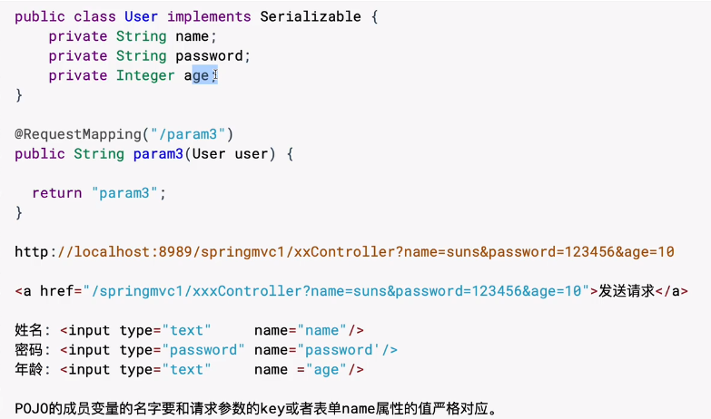
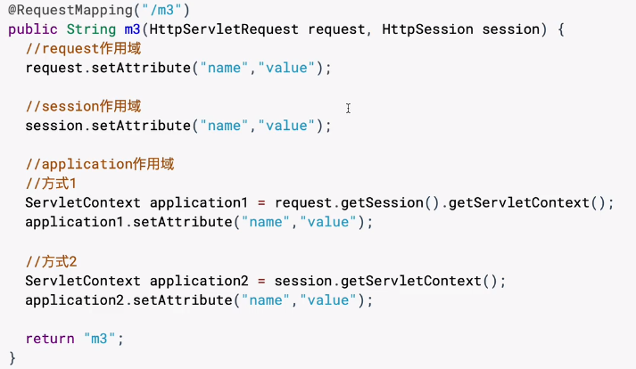
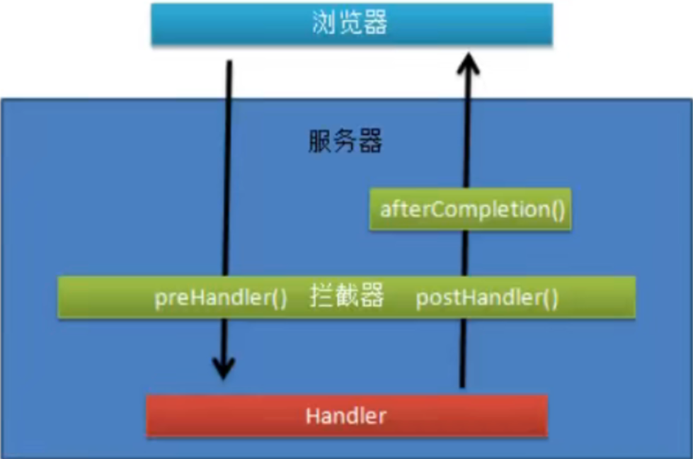

#SpringMVC

传统视图开发：通过作用域进行数据传递，视图层技术进行数据展示

前后端分离开发：提供多种请求发送方式，Restful访问，HttpMessageConverter数据响应

WebFlux开发

**控制器开发**

接收client请求参数 - 调用业务对象 - 流程跳转

~~~java
@Controller
public class FirstController {
    @RequestMapping("/first")
    public String first(HttpServletRequest request, HttpServletResponse response){
        System.out.println("FirstController.first");
        return "/result.jsp";
    }
}
//与servlet不同，springmvc中一个类可以有多个控制方法。只需在对应方法上加上相对应的注解
~~~

一种类型的sprinmvcg控制器默认被创建一次，会存在线程安全问题，但也可以被创建多次，servlet只能创建一次。在spring中被@Scope控制。

 **@RequestMapping**

为控制器方法提供外部访问的url路径。在底层有RequestMappingHanderMapping类实现HanderMapping接口来处理。

在注解中路径分割符/可以被省略@RequestMapping("first")。在多级目录中，第一个/可被省略。

在一个控制器方法上可以映射多个路径。 @RequestMapping("/first"，"/thirst")

Controller类上假如@RequestMapping会多加一级的目录。 这样可以在url上进行区分，利于项目管理。

限定用户的请求方式： @RequestMapping("/first",method={RequestMethod.POST,RequestMethod.GET})

web开发中POST与GET请求：GET通过请求行(地址栏)提交数据，需要明文数据提交，不安全，提交数据量小(<2048字节)。POST请求：通过请求体提交数据，密文提交(不是加密，但用户不可见)，相对安全，提交数据量大。

对于@RequestMapping修饰的方法，参数可以接收HttpServletRequest、HttpServletResponse、HttpSession。三者接收不固定。无参的方法不耦合servlet方法，但不能接收客户端的参数。

**视图解析器**

控制器方法返回值为一个页面路径。但若返回是实际路径，这与工厂路径耦合。通过ViewResolver来解决。将变化的路径单独配置在ViewResolver中

~~~java
@Controller
@RequestMapping("/view")
public class Viewcontroler {
    @RequestMapping("/m1")
    public String m1(){
        System.out.println("ViewResolver.m1");
        return "result";
    }
}
    <bean id = "viewResolver" class="org.springframework.web.servlet.view.InternalResourceViewResolver">
        <property name="prefix" value="/"></property>
        <property name="suffix" value=".jsp"></property>
    </bean>
~~~

## 接收client请求

（1）地址栏中url+ ？+ k-v形式的参数 （2）超级链接<a href="url + ? + k-v形式的参数"> 发送请求 < / a>>  (3)表单

**基于servlet API接收请求参数**

~~~java
@RequestMapping("/m2")
public String m2(HttpServletRequest request, HttpServletResponse response){
    System.out.println("ViewResolver.m2");
    String name  =request.getParameter("name");
    String password  =request.getParameter("password");

    System.out.println("name = "+name);
    System.out.println("password = "+password);
    return "param1";
}
~~~

**基于简单变量接收请求参数。**

~~~java
//支持常见类型的自动转化。8种基本及其包装类，String
//建议使用包装类，因为当参数没有时默认为null，基本类型无法传递null，但包装类可以
@RequestMapping("/m3")
public String m3(String name, String password){
    System.out.println("ViewResolver.m3");
    System.out.println("name = "+name);
    System.out.println("password = "+password);
    return "param1";
}
~~~

**基于POJO类型接收请求参数**

POJO：简单的java对象。

POJO类型对象特定：成员变量必须有set、get方法。有默认无参构造。不能实现容器或框架的接口。Serializable可以实现也可以不实现

创建一个类包含了所有请求参数，类对象是POJO类型。接收时自动转化到对象中，无需手动对对象字段进行赋值

**接收一组简单变量的请求参数**

不能使用List或者ArrayList形式进行接收。在接收数据时需要先将形参类型的对象创建出来，因为List没有构造方法，无法创建。ArrayList虽然可以创建，但是需要符合POJO接收时的规则。ArrayList没有一个叫ids的属性

如果是8种基本类型+String，则参数的形参名字要与表单中的name属性ids对应。如果是其他的类型，会餐形参类型的属性名字是否与表单中的name属性对应

~~~java
<form method="post" action="${pageContext.request.contextPath}/view/m4">
    <input type="checkbox" name="ids"value="1"/> 
    <input type="checkbox" name="ids"value="2"/> 
    <input type="checkbox" name="ids"value="3"/> 
    <input type="checkbox" name="ids"value="4"/> 
    <input type="checkbox" name="ids"value="5"/> 
    <input type="submit" value="reg"/> 
    </form>

@RequestMapping("/m4")
public String m4(int[] ids){
    System.out.println("ViewResolver.m4");
    for(int id :ids){
        System.out.println(id);
    }

    return "param1";
}
~~~

**接收一组POJO对象的请求参数**

自定义一个类进行将类型名进行包装，这样在UsersDto中就会存在users的属性名进行对应

~~~java
public UsersDto{
    private List<User> users = new ArrayList<>();
    get/set方法
}
~~~

**@RequestParam**

修饰控制器的形参。POJO类型的形参不能使用整个注解

~~~java
//解决请求参数与方法形参名字不一致问题,表单中的name为n，password为p
@RequestMapping("/m5")
public String m5(@RequestParam("n") String name, @RequestParam("p") String password){
    System.out.println("ViewResolver.m5");
    System.out.println("name = "+name);
    System.out.println("password = "+password);
    return "param1";
}

~~~

@RequestParam中可以使用required属性，为true是客户端必须提交数据，false则不对要求。

defaultValue属性，客户端没有提交数据时提供默认值，使用时required属性将自动设置false。这个默认值还可以避免使用int等类型时传递null出错的问题。

**中文字符乱码处理**

GET、POST对问题的处理不同，因为请求方式不同，GET请求行，POST请求体

GET请求乱码：Tomcat8以前添加UTF-8的字符编码，8以后版本自动支持无需更改。

POST请求乱码：方法1：底层使用request.setCharacterEncoding("UTF-8")；2：使用过滤器解决。

**springmvc类型转换器**

内置转换器：将请求提交的字符串类型转换成控制器方法需要的数据类型。

在SpringMVC.启动时，会通过<mvc:annotation-driven/ >把FormattingConversionServiceFactoryBean。引入到SpringMVC体系中。FormattingConversionServiceFactoryBean存储了SpringMVC中所有的内置类型转换器。后续client提交请求参数时，如果对应控制器方法形参不是字符串类型，那么FormattingConversionServiceFactoryBean就会调用对应的类型转化器，进行类型转换，最终完成控制器方法形参的赋值

自定义类型转化器：实现Convert接口以及其中的convert方法。创建新的FormattingConversionServiceFactoryBean类并配置引入类型转化类，设置<mvc:annotation-driven conversion-service=“ ” />

~~~java
//实现Convert接口以及其中的convert方法
public class DateConverter implements Converter<String,Date>{
    public Date convert(String source){
        try{
            SimpleDateFormat simpleDateFormat = new SimpleDateFormat(pattern:"yyyy-MM-dd");
            parse = simpleDateFormat.parse(source);
        }catch (ParseException e){
            e.printStackTrace（）;
        }
        return parse;
    }
}
<bean id = "dateConverter" class = "com.xxxx.DateConverter">
    </bean>
//创建新的FormattingConversionServiceFactoryBean类
<bean id="serviceFactoryBean"class="org.springframework.format.support.FormattingConversionServiceFactoryBean">
    <property name="converters">
    	<set
			ref bean="dateconverter">
		</set>
    </property>
</bean>
//设置mvc:annotation-driven
<mvc:annotation-driven conversion-service="serviceFactoryBean" />
~~~

**动态参数收集**

使用Map类型接收动态参数，key-value形式的接收

单值时一个key对应一个value，(@RequestParam Map<String,String> params)

多值时一个key对应一组value  (@RequestParam MultiValueMap<String,String> params)

MultiValueMap类型每一个value  是一个list类型

**接收cookie数据**

 ~~~java
 //通过request对象如servlet一样获取
 Cookie[] cookies = request.getCookies();
 for(Cookie cookie : cookies){
     if ("name".equals(cookie.getName())){
         System.out.println("cookie.getvalue（）="+cookie.getValue()));
     }
 }
 //@CookieValue注解,获得叫name的cookie的值cookieValue
 方法中使用(@CookieValue("name") String cookieValue)
 ~~~

**接收请求头数据**

~~~java
//通过request对象
String value = request.getHeader("")//输入头的key
//@RequestHeader(" ")    
~~~

## 调用业务对象

## 流程跳转

**页面跳转**

forward：一次请求、地址栏不变、可以通过request作用域传递数据

redirect：多次请求、地址栏改变、不能request作用域传递数据、可以跨域跳转

**控制器-foward-页面**

方式1：使用视图解析器直接返回result.jsp的名字 return "result"；

方式2：使用forward：关键字return "forward：/result.jsp"；

**控制器-foward-控制器**

假如有foward1、foward2两个方法，从1到2： return "forward：/路径/foward2"；

**控制器-redirect-控制器**

假如有foward1、foward2两个方法，从1到2： return "redirect：/路径/foward2"；

需要传参时在后面？+参数

**作用域**

request作用域、session作用域、application作用域。用于控制器、页面之间跳转时传递数据

xxx.setAttribute();//k-v形式存储

xxx.getAttribute();//k形式查询

作用域与servlet耦合，springmvc更推荐Model方式、ModelMap方式。两种一样，都是BindingAwareModelMap类型。之所以不直接使用，是方便与mvc解耦，以后可能用其他的方法替换，其他方法底层可能就不是BindingAwareModelMap。Model兼容更强推荐使用这个，ModelMap只是为了旧版本维护

redirect方式传递数据时，使用Model方式、ModelMap方式会自动？形式添加到url

**@SessionAttributes**

在类上声明@SessionAttributes(value="数据key")指明是session作用域。但是存在session作用域的同时也会存在request作用域。session作用域、request作用域存储的是对象的引用。

~~~java
session.removeAttribute("key")//只删除指定的一项
sessionStatus.setComplete()//删除全部
~~~

application作用域（ServletContext）全局唯一，存储全局唯一的对象，一般不会进行业务操作

**@ModelAttribute**

接收参数的同时，也把参数存到request作用域中

~~~java
在方法中 (@ModelAttribute("name"), String name);
等价于之前的(@RequestParam("name"), String name,Model model){model.addAttribute("name",name)}
~~~

@ModelAttribute若参数是简单变量，注解的value属性要与key保持一致。POJO类型则没有这个要求，但这个value属性会作为request作用域的名字

@ModelAttribute与@SessionAttributes的value值不能一致。

**视图控制器**

通过配置方式访问受保护的视图模板JSP

将jsp放在web-inf目录下就会被保护，不能直接访问了。

<mvc: view-controller path=" " view-name=" "/ >通过配置可以直接访问

path用户访问的连接，view-name是jsp的所在工程的连接。

但对于redirect方式，若放在了web-inf目录下，程序中return "redirect：/web-inf/jsp/foward2.jsp"；不能成功跳转。则要改成return "redirect：/foward2.jsp"；并配置<mvc: view-controller path=" /foward2" view-name="foward2 "/ >

**静态资源处理**

非java代码内容：图片、jsp、css文件。无法访问静态资源。

http:localhost:8008/view/xxx.jsp时无法访问，因为按照程序会寻找名字叫xxx.jsp的控制器方法，没有就会error

DefaultServlet方法:在web.xml中添加

~~~xml
<servlet-mapping>
        <servlet-name>default</servlet-name>
        <url-pattern>*.jpg</url-pattern>
</servlet-mapping>
<servlet-mapping>
        <servlet-name>default</servlet-name>
        <url-pattern>*.css</url-pattern>
</servlet-mapping>
~~~

default-servlet-hander方式

在springmvc配置<mvc: default-servlet-hander>

其底层也是调用了defaultServlet进行的静态资源处理，通过DefaultServletHttpRequestHandler，以forward的形式调用DefaultServlet

**HttpMessageConverter**

报文信息转换器：请求报文响应报文与java对象的转换

~~~java
<form method="post" action="${pageContext.request.contextPath}/view/m6">
    <input type="checkbox" name="ids1"value="1"/> 
    <input type="checkbox" name="ids2"value="2"/> 
    <input type="submit" value="reg"/> 
    </form>
//@RequestBody：获取请求体。   
@RequestMapping("/m6")
public String m6(@RequestBody String requestBody){
    System.out.println("requestBody = "+requestBody);//ids1=1&ids2=2
    return "param1";
}
//RequestEntity
//封装请求报文的一种类型
@RequestMapping("/m6")
public String m6(RequestEntity<String> requestEntity){
    System.out.println("requestBody = "+requestEntity.getBody());
    System.out.println("requestHeaders = "+requestEntity.getHeaders());
    return "param1";
}
//@ResponseBody
//标识控制器方法，将该方法的返回值直接作为响应报文的响应体响应到游览器
@RequestMapping("/m6")
@ResponseBody
public String m6(){
    return "param1";
}

~~~

**异常处理**

springmvc采用统一的全局的异常处理。把控制器中的所有异常集中到一个地方，使用AOP

@RestControllerAdvice/@ControllerAdvice

需要创建异常处理类使用@ControllerAdvice修饰。并定义处理方法

~~~java
@ControllerAdvice
public class ProjectExceptionAdvice{
    @ExceptionHandler(Exception.class)
    public void doException(Exception ex){
        ...
    }
}
~~~

**拦截器**

Interceptor拦截器作用为拦截指定的用户请求，并在控制器方法进行相应的预处理和后处理

编写拦截器功能类实现HandlerInterceptor接口，配置声明拦截器，

~~~java
public class ProjectInterceptor implements HandlerInterceptor {
    @Override
    public boolean preHandle(HttpServletRequest request, HttpServletResponse response, Object handler) throws Exception {
        //计算的业务逻辑，根据计算结果，返回true或者false
        //当返回false时，给浏览器一个返回结果
        //true表示请求验证通过，可以执行处理器的方法,false求没有通过拦截器验证
        
        return false;
    }

    @Override
    public void postHandle(HttpServletRequest request, HttpServletResponse response, Object handler, ModelAndView modelAndView) throws Exception {
        //能够获取到处理器方法的返回值ModelAndView,可以修改ModelAndView中的数据和视图，
    }

    /* 
        1.在请求处理完成后执行的。框架中规定当你的视图解析器完成后，对视图执行了forward。就认为请求完成。
        2.主要用来做资源回收的工作，程序请求过程中创建了一些对象，在这里可以删除，
          把占用的内存回收。
     */
    @Override
    public void afterCompletion(HttpServletRequest request, HttpServletResponse response, Object handler, Exception ex) throws Exception {
       
    }
}

   <!--声明拦截器：拦截器可以有0个或多个-->
    <mvc:interceptors>
        <!--声明第一个拦截器-->
        <mvc:interceptor>
            <!--
               指定拦截器的请求uri地址
               path：就是uri地址，可以通配符 ** 可以表示任意字符、文件或多级目录和目录中的文件
               /user/**  :以user开头的请求都会诶拦截
               /** :所有请求都会被拦截
            -->
            <mvc:mapping path="/**"/>
            <!--声明拦截器对象-->
            <bean class="com.bjpowernode.handler.MyInterceptor"/>
        </mvc:interceptor>

~~~

