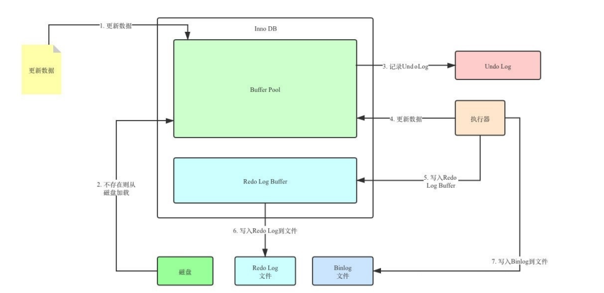

#MySQL

## 基础语法

- DDL: 数据定义语言，用来定义数据库对象（数据库、表、字段）
- DML: 数据操作语言，用来对数据库表中的数据进行增删改
- DQL: 数据查询语言，用来查询数据库中表的记录
- DCL: 数据控制语言，用来创建数据库用户、控制数据库的控制权限

### 数据定义操作(DDL)

####数据库操作

```mysql
#查看所有数据库
show databases; 
#查看当前数据库
select databases();
#创建数据库 
create database (if not exit) [数据库名] (default charset [字符集]) (collate [排序规则]);
#删除数据库
drop database (if exit) [数据库名];
#使用指定的数据库
use [数据库名];
```

字符集（Character Set）：指定数据库中存储的字符编码方式，默认为服务器的默认字符集。常见的字符集包括UTF8、UTF8mb4等。

排序规则（Collation）：指定字符排序规则，用于比较和排序字符串。默认为字符集的默认排序规则。

##### 举例

```mysql
#建立database_test数据库，默认字符集编码utf8，排序规则utf8_general_ci
create database if not exit database_test default charset utf8 collate utf8_general_ci;
# 删除database_test
drop database if exit database_test;
#使用删除database_test
use database_test; 
```


#### 表操作

```mysql
#查询当前数据库所有表
show tables;
#查询表结构
desc [表名];
#查询建表语句
show create table [表名];
#创建表
create table 表名(
	字段1 字段1类型 (comment 字段1注释),
	字段2 字段2类型 (comment 字段2注释),
	字段3 字段3类型 (comment 字段3注释),
	...
	字段n 字段n类型 (comment 字段n注释)
) (comment 表注释) ;
#向已经存在的表中添加字段
alter table [表名] add [字段名] [类型(长度)] (comment 注释)(约束);
#只修改数据类型
alter table [表名] modify [字段名][新数据类型(长度)] 
#修改数据类型和数据名
alter table [表名] change [旧字段名] [新字段名] [类型(长度)] (comment 注释) (约束);
#删除字段
alter table [表名] drop [字段名];
#修改表名
alter table [表名] rename to [新表名];
#删除表
drop table (if exists) [表名];
#删除表，并重新创建该表
truncate table [表名];
```

在列定义中，需要指定列名和数据类型。数据类型定义了该列可以存储的数据类型，如整数、字符、日期等。常见的数据类型包括：

整数类型（Integer Types）：如INT、BIGINT、TINYINT等。

字符串类型（String Types）：如VARCHAR、CHAR、TEXT等。

小数类型（Decimal Types）：如DECIMAL、FLOAT、DOUBLE等。

日期和时间类型（Date and Time Types）：如DATE、DATETIME、TIMESTAMP等。

##### 举例

```mysql
#建立一个 [id,name,department,salary,hire_date]的表
CREATE TABLE employees ( 
  id INT,
  name VARCHAR(50),
  department VARCHAR(50),
  salary DECIMAL(10,2),
  hire_date DATE
);
desc employees;
#向employees添加一列nickname
alter table employees add nickname varchar(20) comment '昵称'; 
#向employees中nickname的数据类型改成varchar(30)
alter table employees modify nickname varchar(30);
#将employees表的nickname字段修改为username，类型为varchar(30)
alter table emp change nickname username varchar(30) comment '昵称';
#将employees表的username字段删除
alter table employees drop username;
#将employees表名字改为emp
alter table employees rename to emp;
#删除表emp
drop table if exists emp;
```

分类：

| 约束                    | 描述                                                     | 关键字      |
| ----------------------- | -------------------------------------------------------- | ----------- |
| 非空约束                | 限制该字段的数据不能为null                               | NOT NULL    |
| 唯一约束                | 保证该字段的所有数据都是唯一、不重复的                   | UNIQUE      |
| 主键约束                | 主键是一行数据的唯一标识，要求非空且唯一                 | PRIMARY KEY |
| 默认约束                | 保存数据时，如果未指定该字段的值，则采用默认值           | DEFAULT     |
| 检查约束（8.0.1版本后） | 保证字段值满足某一个条件                                 | CHECK       |
| 外键约束                | 用来让两张图的数据之间建立连接，保证数据的一致性和完整性 | FOREIGN KEY |

约束是作用于表中字段上的，可以再创建表/修改表的时候添加约束。

##### 常用约束

| 约束条件 | 关键字         |
| -------- | -------------- |
| 主键     | PRIMARY KEY    |
| 自动增长 | AUTO_INCREMENT |
| 不为空   | NOT NULL       |
| 唯一     | UNIQUE         |
| 逻辑条件 | CHECK          |
| 默认值   | DEFAULT        |

例子：

```mysql
create table user(
	id int primary key auto_increment,
	name varchar(10) not null unique,
	age int check(age > 0 and age < 120),
	status char(1) default '1',
	gender char(1)
);
```

##### 外键约束

```mysql
#添加外键
create table 表名(
	字段名 字段类型,
	...
	[constraint] [外键名称] foreign key(外键字段名) references 主表(主表列名)
);
#添加外键
alter table 表名 add constraint 外键名称 foreign key (外键字段名) references 主表(主表列名) on update 行为 on delete 行为;
#删除外键
alter table 表名 drop foreign key 外键名;
-- 例子
alter table emp add constraint fk_emp_dept_id foreign key(dept_id) references dept(id);
#当关联外键时，一个表的更新与另一个表相关，其行为如下表
```

| 行为        | 说明                                                         |
| ----------- | ------------------------------------------------------------ |
| no action   | 当在父表中删除/更新对应记录时，首先检查该记录是否有对应外键，如果有则不允许删除/更新（与RESTRICT一致） |
| restrict    | 当在父表中删除/更新对应记录时，首先检查该记录是否有对应外键，如果有则不允许删除/更新（与NO ACTION一致） |
| cascade     | 当在父表中删除/更新对应记录时，首先检查该记录是否有对应外键，如果有则也删除/更新外键在子表中的记录 |
| set null    | 当在父表中删除/更新对应记录时，首先检查该记录是否有对应外键，如果有则设置子表中该外键值为null（要求该外键允许为null） |
| set default | 父表有变更时，子表将外键设为一个默认值（Innodb不支持）       |

###增删改(DML)

```mysql
#向表中指定字段中增加数据
insert into [表名] (字段名1, 字段名2, ...) values (值1, 值2, ...);
#向表中全部字段中增加数据
insert into [表名] values (值1, 值2, ...);
#向表中增加多行数据（效率更高）
insert into [表名] values (值1, 值2, ...),(值1, 值2, ...),(值1, 值2, ...),(值1, 值2, ...);
#改变指定数据
update [表名] set 字段1 = 值1，字段2 = 值2，字段3 = 值3... (where 条件);
#删除数据
delete from [表名] (where 条件);
```

#### 举例

```mysql
#向emp表中添加数据
insert into emp (id, name, department,salary,hire_date) values (0, '张三', '成华大道','1000','2000-1-1');
#将emp表中的张三改为李四
update emp set name = '李四' where id = 0;
#删除这一条数据
delete from emp where id = 0;
```

### 查(DQL)

```mysql
SELECT
	字段列表
FROM
	表名字段
WHERE
	条件列表
GROUP BY
	分组字段列表
HAVING
	分组后的条件列表
ORDER BY
	排序字段列表
LIMIT
	分页参数
	
#执行顺序	
from -> where -> group by -> having -> select -> order by -> limit  
#方式1:
select
from
where多表的连接条件
and不包含组函数的过滤条件
group by
having包含组函数的过滤条件
order by...asc/desc
limit
#方式2:
select
from
..join
on多表的连接条件
join
on
where不包含组函数的过滤条件
and/or不包含组函数的过滤条件
group by
having包含组函数的过滤条件
order by...asc/desc
limit
```

| 比较运算符          | 功能                                        |
| ------------------- | ------------------------------------------- |
| >                   | 大于                                        |
| >=                  | 大于等于                                    |
| <                   | 小于                                        |
| <=                  | 小于等于                                    |
| =                   | 等于                                        |
| <> 或 !=            | 不等于                                      |
| BETWEEN ... AND ... | 在某个范围内（含最小、最大值）              |
| IN(...)             | 在in之后的列表中的值，多选一                |
| LIKE 占位符         | 模糊匹配（\_匹配单个字符，%匹配任意个字符） |
| IS NULL             | 是NULL                                      |

| 逻辑运算符 | 功能                         |
| ---------- | ---------------------------- |
| AND 或 &&  | 并且（多个条件同时成立）     |
| OR 或 \|\| | 或者（多个条件任意一个成立） |
| NOT 或 !   | 非，不是                     |

| 函数  | 功能     |
| ----- | -------- |
| count | 统计数量 |
| max   | 最大值   |
| min   | 最小值   |
| avg   | 平均值   |
| sum   | 求和     |

```mysql
#基础条件查询
select [字段列表] from [表名] where [条件列表];
#去重
select distinct [字段列表] from [表名];
#聚合查询
select [聚合函数]([字段列表]) from [表名];
#分组查询  执行顺序：where > 聚合函数 > having
#group by x意思是将所有具有相同x字段值的记录放到一个分组里，
#group by x, y意思是将所有具有相同x字段值和y字段值的记录放到一个分组里。
select [字段列表] from [表名] (where 条件) group by [分组字段名] (having 分组后的过滤条件);
# 排序查询 ASC: 升序（默认）ASC: 升序（默认） 多字段排序，当第一个字段值相同时，才会根据第二个字段进行排序
select [字段列表] from [表名] order by [字段1] [排序方式1], [字段2] [排序方式2];
#分页查询
select [字段列表] from [表名] limit [起始索引], [查询记录数];

#多表查询
select * from [表名], [表名] where [表名].[条件] = [表名].[条件];
#多表内连接查询
#隐式内连接
select [字段列表] from [表1], [表2] where 条件 ...;
#显式内连接
select [字段列表] from [表1] (inner) join [表2] on 连接条件 ...;
#外连接查询
#左外连接
select [字段列表] from [表1] left (outer) join [表2] on 条件 ...;
#右外连接
select [字段列表] from [表1] right (outer) join [表2] on 条件 ...;
#自连接
select [字段列表] from [表a] [别名a] join [表a] [别名b] on 条件 ...;
# 联合查询 union all 会有重复结果，union 不会
select 字段列表 from 表a ...
union [all]
select 字段列表 from 表b ...
#子查询
select * from t1 where column1 = ( select column1 from t2);
```

```mysql
#1.注意执行顺序，from -> where -> group by -> having -> select -> order by -> limit  
#2.where在select前，所以select的别名不能在where出现
#3.select的别名可以在having后出现，这是mysql的特殊优化
#4.聚合函数(count、sum、max、min、avg等)的使用要注意，它只能用在select 语句的选择列表（子查询或外部查询）、having 子句、compute 或 compute by 子句
#5.order by可以存在 union的字句里面，但是它的功能不会生效。order by子句只能在最后一次使用，要使用union并对联合的子句分别排序则要在
SELECT * FROM
( SELECT * FROM t1  ORDER BY 字段 ) newt1 ## 一定要对表重新命名，否则报错
UNION
SELECT * FROM
( SELECT * FROM t2  ORDER BY 字段 ) newt2
#6.时间函数timestampdiff(interval, datetime1,datetime2)结果单位由interval参数给出。second minute hour day week month quarter year
#7.时间转换 date_format(start_time,'%Y%m%d') 年月天
#8.DATE_SUB() 函数从日期减去指定的时间间隔。
date_sub('2008-11-06',interval 5 day)
#9.adddate()日期加减函数
select adddate(now(),interval 1 day);
```

窗口函数

```mysql
#<窗口函数> over (partition by <用于分组的列名> order by <用于排序的列名> rows/range子句<用于定义窗口大小>) 
#排序
rank() over (partition by <分组列> order by <排序列>) #1，1，1，4
dense_rank() over (partition by <分组列> order by <排序列>) #1，1，1，2
row_number() over (partition by <分组列> order by <排序列>) #1，2，3，4
#分布
#分组内各元素占比
percent_rank() over (partition by <分组列> by <排序列>)
#分组内大于等于当前rank值的行数/分组内总行数
cume_dist() over (partition by <分组列> by <排序列>)
#前后函数
#分组中位于当前行后n行（lead）/ 前n行(lag)的记录值
lead(列名，行数n) over (partition by <分组列> by <排序列>)
lag(列名，行数n) over (partition by <分组列> by <排序列>)
#头尾函数 -得到分区中的第一个/最后一个指定参数的值
first_val(列名) over (partition by <分组列> by <排序列>)
last_val(列名) over (partition by <分组列> by <排序列>)
#返回窗口中当前列的第N个值
nth_value(列名，n) over (partition by <分组列> by <排序列>)

#控制窗口函数的范围Rows & Range
[<ROWS or RANGE clause> BETWEEN <Start expr> AND <End expr>]
#ROWS表示按照行的范围进行定义框架，根据order by子句排序后，取的前N行及后N行的数据计算
Current Row#当前行
N preceding#前 n 行，n 为数字， 比如 2 Preceding 表示前2行
unbounded preceding#开头
N following#后N行，n 为数字， 比如 2 following 表示后2行
unbounded following#结尾
#RANGE表示按照值的范围进行定义框架，根据order by子句排序后，指定当前行对应值的范围取值，行数不固定，只要行值在范围内，对应行都包含在内。
range interval 7-1 day preceding#最近7天的值
range between interval 1 day preceding and interval 1 day following#前后一天和当天的值
```


#### 举例

```mysql
# 姓名为两个字 _代表确定单个
select * from employee where name like '__';
# 身份证最后为X %代表不确定，可多可单
select * from employee where idcard like '%X';

# 年龄小于45，并根据工作地址分组，获取员工数量大于等于3的工作地址  分组查询
select workaddress, count(*) as address_count from employee where age < 45 group by workaddress having address_count >= 3;
# 两字段排序，根据年龄升序排序，入职时间降序排序 排序查询
SELECT * FROM employee ORDER BY age ASC, entrydate DESC;
# 查询第一页数据，展示10条
SELECT * FROM employee LIMIT 0, 10;
# 查询employee、dept两个表中dept==id的部分
select * from employee, dept where employee.dept = dept.id
# 查询员工姓名，及关联的部门的名称
# 隐式
select e.name, d.name from employee as e, dept as d where e.dept = d.id;
# 显式
select e.name, d.name from employee as e inner join dept as d on e.dept = d.id;
```

### 数据控制(DCL)

#### 用户

```mysql
#查询用户
select * from user;
#创建用户
create user '用户名'@'主机名' identified by '密码';
#修改用户密码
alter user '用户名'@'主机名' identified with mysql_native_password by '新密码';
#删除用户
DROP USER '用户名'@'主机名';


-- 创建用户test，只能在当前主机localhost访问
create user 'test'@'localhost' identified by '123456';
-- 创建用户test，能在任意主机访问
create user 'test'@'%' identified by '123456';
create user 'test' identified by '123456';
-- 修改密码
alter user 'test'@'localhost' identified with mysql_native_password by '1234';
-- 删除用户
drop user 'test'@'localhost';
```

#### 用户权限

| 权限                | 说明               |
| ------------------- | ------------------ |
| ALL, ALL PRIVILEGES | 所有权限           |
| SELECT              | 查询数据           |
| INSERT              | 插入数据           |
| UPDATE              | 修改数据           |
| DELETE              | 删除数据           |
| ALTER               | 修改表             |
| DROP                | 删除数据库/表/视图 |
| CREATE              | 创建数据库/表      |

```mysql
#查询权限
show grants for '用户名'@'主机名';
#授予权限
grant 权限列表 on 数据库名.表名 to '用户名'@'主机名';
#撤销权限
revoke 权限列表 on 数据库名.表名 from '用户名'@'主机名';
```

### 函数

- 字符串函数
- 数值函数
- 日期函数
- 流程函数

| 字符串函数                       | 功能                                                      |
| -------------------------------- | --------------------------------------------------------- |
| CONCAT(s1, s2, ..., sn)          | 字符串拼接，将s1, s2, ..., sn拼接成一个字符串             |
| LOWER(str)                       | 将字符串全部转为小写                                      |
| UPPER(str)                       | 将字符串全部转为大写                                      |
| LPAD(str, n, pad)                | 左填充，用字符串pad对str的左边进行填充，达到n个字符串长度 |
| RPAD(str, n, pad)                | 右填充，用字符串pad对str的右边进行填充，达到n个字符串长度 |
| TRIM(str)                        | 去掉字符串头部和尾部的空格                                |
| SUBSTRING(str, start, len)       | 返回从字符串str从start位置起的len个长度的字符串           |
| REPLACE(column, source, replace) | 替换字符串                                                |

| 数值函数    | 功能                             |
| ----------- | -------------------------------- |
| CEIL(x)     | 向上取整                         |
| FLOOR(x)    | 向下取整                         |
| MOD(x, y)   | 返回x/y的模                      |
| RAND()      | 返回0~1内的随机数                |
| ROUND(x, y) | 求参数x的四舍五入值，保留y位小数 |

| 日期函数                           | 功能                                              |
| ---------------------------------- | ------------------------------------------------- |
| CURDATE()                          | 返回当前日期                                      |
| CURTIME()                          | 返回当前时间                                      |
| NOW()                              | 返回当前日期和时间                                |
| YEAR(date)                         | 获取指定date的年份                                |
| MONTH(date)                        | 获取指定date的月份                                |
| DAY(date)                          | 获取指定date的日期                                |
| DATE_ADD(date, INTERVAL expr type) | 返回一个日期/时间值加上一个时间间隔expr后的时间值 |
| DATEDIFF(date1, date2)             | 返回起始时间date1和结束时间date2之间的天数        |

| 流程函数                                                     | 功能                                                      |
| ------------------------------------------------------------ | --------------------------------------------------------- |
| if(value, t, f)                                              | 如果value为true，则返回t，否则返回f                       |
| ifnull(value1, value2)                                       | 如果value1不为空，返回value1，否则返回value2              |
| case when [ val1 ] then [ res1 ] ... else [ default ] end    | 如果val1为true，返回res1，... 否则返回default默认值       |
| case [ expr ] when [ val1 ] then [ res1 ] ... else [ default ] end | 如果expr的值等于val1，返回res1，... 否则返回default默认值 |

## 事务

- 原子性(Atomicity)：事务是不可分割的最小操作但愿，要么全部成功，要么全部失败
- 一致性(Consistency)：事务完成时，必须使所有数据都保持一致状态
- 隔离性(Isolation)：数据库系统提供的隔离机制，保证事务在不受外部并发操作影响的独立环境下运行
- 持久性(Durability)：事务一旦提交或回滚，它对数据库中的数据的改变就是永久的

**脏写**：如果事务Session A 修改了另一个未提交事务Session B 修改过的数据，那就意味着发生了脏写

**脏读**：Session A 读取了已经被 Session B 更新但还没有被提交的字段。 之后若 Session B 回滚 ，Session A读取的内容就是临时且无效 的。

**不可重复读**：Session A 读取 了一个字段，然后 Session B 更新了该字段。 之后 Session A 再次读取同一个字段， 值就不同了。那就意味着发生了不可重复读。

**幻读**：Session A 从一个表中读取 了一个字段, 然后 Session B 在该表中插入了一些新的行。之后, 如果 Session A 再次读取 同一个表, 就会多出几行。那就意味着发生了幻读。

| 隔离级别              | 脏读 | 不可重复读 | 幻读 |
| --------------------- | ---- | ---------- | ---- |
| Read uncommitted      | √    | √          | √    |
| Read committed        | ×    | √          | √    |
| Repeatable Read(默认) | ×    | ×          | √    |
| Serializable          | ×    | ×          | ×    |

```mysql
#修改事务的隔离级别
set [global|session] transaction isolation level 隔离级别
```

事务的隔离性由 锁机制 实现。而事务的原子性、一致性和持久性由事务的 redo 日志和undo 日志来保证。

REDO LOG 称为 重做日志 ，提供再写入操作，恢复提交事务修改的页操作，用来保证事务的持久性。记录是物理级别的修改操作，如页号，偏移量，数据(只存储更改值)。

UNDO LOG 称为 回滚日志 ，回滚行记录到某个特定版本，用来保证事务的原子性、一致性。是逻辑操作的日志，记录了对数据的相反操作，如进行insert操作，则记录相反的delete操作。用于事务的回滚



### redo 日志

事务包含持久性的特性，就是说对于一个已经提交的事务，在事务提交后即使系统发生了崩 溃，这个事务对数据库中所做的更改也不能丢失。当数据发生改变时，数据现在缓冲池进行更改，在由master线程进行处理(刷入磁盘)。当事务提交，缓冲池的内容并未更新到数据库时，数据库崩溃时，可以由redo日志进行刷新恢复。

第1步：先将原始数据从磁盘中读入内存中来，修改数据的内存拷贝 第2步：生成一条重做日志并写入redo log buffer，记录的是数据被修改后的值 第3步：当事务commit时，将redo log buffer中的内容刷新到 redo log file，对 redo log file采用追加 写的方式 第4步：定期将内存中修改的数据刷新到磁盘中

###undo日志

事务执行过程中可能遇到各种错误，比如服务器本身的错误 ， 操作系统错误 ，甚至是突然断电导致的错误。或者人为事务执行过程中ROLLBACK 语句结束当前事务的执行。我们需要把数据改回原先的样子，这个过程称之为 回滚 。

undo log 使用回滚段的方式进行管理，每个事务只会使用一个回滚段，一个回滚段在同一时刻可能会服务于多个事务。  当开启事务时，需要向undo log 的页中把旧数据进行记录。

回滚段中记录的数据分类:未提交的回滚数据、已经提交但未过期的回滚数据、事务已经提交并过期的数据

undo log 有两种类型

insert undo log ：insert操作阐释的日志，只对事务本身可见，这种类型的日志在事务提交后可以直接删除。

update undo log: 记录对delete 、uodate的操作，这可能需要提供MVCC，不能再事务提交时就删除，通过后台purge线程进行回收处理的

### 锁

MySQL锁可以按模式分类为：乐观锁与悲观锁。按粒度分可以分为全局锁、表级锁、页级锁、行级锁。按属性可以分为：共享锁、排它锁。按状态分为：意向共享锁、意向排它锁。按算法分为：间隙锁、临键锁、记录锁。NOTE : **针对事物才有加锁的意义。**

全局锁就是对整个数据库实例加锁，加锁后整个实例就处于只读状态，后续的DML的写语句，DDL语句，已经更新操作的事务提交语句都将被阻塞。

全局锁：

全局锁就是对整个数据库实例加锁，加锁后整个实例就处于只读状态，后续的DML的写语句，DDL语句，已经更新操作的事务提交语句都将被阻塞。
其典型的使用场景是做全库的逻辑备份，对所有的表进行锁定，从而获取一致性视图，保证数据的完整性。

Flush tables with read lock 

整个库处于只读状态.数据更新语句（数据的增删改）、数据定义语句（包括建表、修改表结构等）和更新类事务的提交语句。

表锁：

表级锁，每次操作锁住整张表。锁定粒度大，发生锁冲突的概率最高，并发度最低。应用在MyISAM、InnoDB、BDB等存储引擎中。

对于表级锁，主要分为以下三类：

1. 表锁：对于表锁，分为两类：1.表共享读锁（read lock）所有的事物都只能读（当前加锁的客户端也只能读，不能写），不能写 2.表独占写锁（write lock），对当前加锁的客户端，可读可写，对于其他的客户端，不可读也不可写。
   读锁不会阻塞其他客户端的读，但是会阻塞写。写锁既会阻塞其他客户端的读，又会阻塞其他客户端的写。

   lock tables … read/write；

   lock tables t1 read, t2 write; 其他线程写 t1、读写 t2 的语句都会被阻塞。线程 A 在执行 unlock tables 之前，也只能执行读 t1、读写 t2 的操作。

   解锁：unlock tables;

2. 元数据锁（meta data lock，MDL），MDL加锁过程是系统自动控制，无需显式使用，在访问一张表的时候会自动加上。MDL锁主要作用是维护表元数据的数据一致性，在表上有活动事务的时候，不可以对元数据进行写入操作。在MySQL5.5中引入了MDL，当对一张表进行增删改查的时候，加MDL读锁（共享）;当对表结构进行变更操作的时候，加MDL写锁（排他）。

   select\insert\updata\delete 的对写与增删改查共存。与alter改变表结构的互斥。 

3. 意向锁: 为了避免DML在执行时，加的行锁与表锁的冲突，在InnoDB中引入了意向锁，使得表锁不用检查每行数据是否加锁，使用意向锁来减少表锁的检查。
   一个客户端对某一行加上了行锁，那么系统也会对其加上一个意向锁，当别的客户端来想要对其加上表锁时，便会检查意向锁是否兼容，若是不兼容，便会阻塞直到意向锁释放。

意向锁兼容性：

1. 意向共享锁（IS）：与表锁共享锁（read）兼容，与表锁排它锁（write）互斥。

   select ... lock in share mode       

2. 意向排他锁（lX）：与表锁共享锁（read）及排它锁（write）都互斥。意向锁之间不会互斥。

   insert\updata\delete\    select ... for update

行锁：

行级锁，每次操作锁住对应的行数据。锁定粒度最小，发生锁冲突的概率最低，并发度最高。应用在InnoDB存储引擎中。
InnoDB的数据是基于索引组织的，行锁是通过对索引上的索引项加锁来实现的，而不是对记录加的锁。对于行级锁，主要分为以下三类：

1. 行锁（Record Lock）：锁定单个行记录的锁，防止其他事务对此行进行update和delete。在RC（read commit ）、RR（repeat read）隔离级别下都支持。
2. 间隙锁（GapLock）：锁定索引记录间隙（不含该记录），确保索引记录间隙不变，防止其他事务在这个间隙进行insert，产生幻读。在RR隔离级别下都支持。比如说 两个临近叶子节点为 15 23，那么间隙就是指 [15 , 23],锁的是这个间隙。
3. 临键锁（Next-Key Lock）：行锁和间隙锁组合，同时锁住数据，并锁住数据前面的间隙Gap。在RR隔离级别下支持。

InnoDB实现了以下两种类型的行锁：

1. 共享锁（S）：允许一个事务去读一行，阻止其他事务获得相同数据集的排它锁。
2. 排他锁（X）：允许获取排他锁的事务更新数据，阻止其他事务获得相同数据集的共享锁和排他锁。

| SQL                          | 行锁类型   | 说明                                     |
| ---------------------------- | ---------- | ---------------------------------------- |
| insert                       | 排他锁     | 自动加锁                                 |
| update                       | 排他锁     | 自动加锁                                 |
| delete                       | 排他锁     | 自动加锁                                 |
| select                       | 不加任何锁 |                                          |
| select　lock　in　share mode | 共享锁     | 需要手动在SELECT之后加LOCK IN SHARE MODE |
| select　for　update          | 排他锁     | 需要手动在SELECT之后加FOR UPDATE         |

行锁 - 演示

默认情况下，InnoDB在REPEATABLE READ事务隔离级别运行，InnoDB使用next-key 锁进行搜索和索引扫描，以防止幻读。

1. 针对唯一索引进行检索时，对已存在的记录进行等值匹配时，将会自动优化为行锁。
2. InnoDB的行锁是针对于索引加的锁，不通过索引条件检索数据，那么InnoDB将对表中的所有记录加锁，此时就会升级为表锁。

间隙锁/临键锁-演示

默认情况下，InnoDB在REPEATABLE READ事务隔离级别运行，InnoDB使用next-key 锁进行搜索和索引扫描，以防止幻读。

1. 索引上的等值查询（唯一索引），给不存在的记录加锁时，优化为间隙锁。
2. 索引上的等值查询（普通索引），向右遍历时最后一个值不满足查询需求时，next-key lock 退化为间隙锁。
3. 索引上的范围查询（唯一索引）--会访问到不满足条件的第一个值为止。

注意：间隙锁唯一目的是防止其他事务插入间隙。间隙锁可以共存，一个事务采用的间隙锁不会阻止另一个事务在同一间隙上采用间隙锁。

## 视图

```mysql
#创建视图
create (or replace) (algorithm = {undefined | merge | temptable}) 
view [视图名称] as [查询语句] (with (cascaded | local) check option)
#查看视图
show tables;
desc/ describe 视图名称
show table status link '视图名称'\G
show create view 视图名称
#更新视图数据
# 更新本质上改变的是源数据表中的数据，当源数据表改变时，视图也会改变
# 更改视图必须要保证视图的行与源数据的行存在一对一关系
#删除视图
drop view if exit 视图名称;

```

查看事务隔离级别：
`select @@transaction_isolation;`
设置事务隔离级别：
`set [ session | global ] transaction isolation level {read uncommitted | read committed | repeatable read | serializable };`
session 是会话级别，表示只针对当前会话有效，global 表示对所有会话有效


## 存储过程和函数

存储过程是一组预先编译的SQL语句的封装。存储过程没有返回值

命令行中;作为结束符。但在存储过程体中，;被中间过程的SQL语句用到。可用delimiter 重定义\


```mysql
#创建存储过程
create procedure [存储过程名](in|out|inout [参数名 参数类型])
(约束条件)
begin
	中间存储过程
end;
#调用
call [存储过程名]([变量/值]);

```

举例

```mysql
create procedure countproc(in sid int, out num int)
begin
	select count(*) into num from fruits where s_id = sid;
end;

call(101,@num);
```

函数

```mysql
#创建函数
create function 函数名(参数名 参数类型)
returns 返回值类型
[约束]
begin
 函数体 #内一定有return 函数
end;
#调用函数
select 函数名(实参列表);
```

```mysql
#创建函数
create function email_by_id(emp_id INT)
returns varchar(25)
deterministic #表示结果是确定的。
contains sql
begin
	return (select email from employees where last_name = 'Abel');
end
#调用
set @emp_id = 102;
select email_by_id(102);
```

## 变量、流程控制与游标

### 变量

#### 系统变量

变量由系统定义，属于服务器层面。分为全局系统变量(global)与会话系统变量(session).静态变量属于特殊的全局系统变量。

```mysql
#查看系统变量
show global / session variables (like '%标识符%');
select @@global.变量名;
select @@session.变量名;
select @@变量名;
#修改系统变量
set @@global.变量名 = 变量;
set global 变量名 = 变量;
```

#### 用户变量

用户自己定义，分为会话用户变量(只对当前连接的会话有效)和局部变量(只在 begin end语句块有效，在存储过程或者函数中使用)。

```mysql
#定义会话用户变量
set @用户变量 = 变量值;
select @用户变量 = 表达式[from];
select 表达式 into @用户变量 [from];
#查看(查看未声明变量会得到null)
select @用户变量;

#局部变量
begin
	declare 变量名 数据类型 [default 变量默认值];  #定义
	set 变量名 = 值;
end
#使用
select 变量名;

```

### 流程控制

条件判断：if ,case

循环：loop, while,repeat

跳转：iterate(相当于continue),  leave(相当于break)

```mysql
#条件判断：if 
if 表达式1 then 操作1
[elseif 表达式2 then 操作2]……
[else 操作n]
end if
#条件判断：case 
case 表达式
when 值1/条件 then 结果1或语句1(如果是语句，需要加分号)
when 值2/条件 then 结果2或语句2(如果是语句，需要加分号)
...
else 结果n或语句n(如果是语句，需要加分号)
end [case]（如果是放在begin end中需要加上case，如果放在select后面不需要）
#循环：loop loop只能用leave跳出
[loop_label:]:LOOP
	循环体(内有leave条件)
end loop [loop_label:];
#循环：while
[while_label:] while 循环条件 do
循环体
end while [while_label];
#循环：repeat
repeat
循环体
until (结束条件)
end repeat 
```

### 游标

游标，可以对结果集中的每一条记录进行定位，并对指向的记录中的数据进行操作的数据结构。游标是一种临时的数据库对象，可以指向存储在数据库表中的数据行指针。这里游标充当了指针的作用 ，我们可以通过操作游标来对数据行进行操作。

```mysql
#声明游标
declare 游标名 cursor for 数据数据结果集(select获取);
#打开游标
open 游标名;
#从游标获得数据
fetch 游标名 into 变量名;
#关闭游标
close 游标名;
```

## 触发器

触发器是由 事件来触发 某个操作，这些事件包括 insert 、 update 、 delete 事件。所谓事件就是指 用户的动作或者触发某项行为。如果定义了触发程序，当数据库执行这些语句时候，就相当于事件发生 了，就会 自动 激发触发器执行相应的操作。

```mysql
#创建触发器
create trigger 触发器名称
{before|after} {insert|update|delete} on 表名
for each row
#查看触发器
show triggers\g;
show create trigger 触发器名;
select * from information_schema.triggers;
#删除触发器
drop trigger if exists 触发器名称;
```

## MVCC

多版本并发控制。顾名思义，MVCC 是通过数据行的多个版本管理来实现数据库的并发控制 。这项技术使得在InnoDB的事务隔离级别下执行 一致性读 操作有了保证。

快照读

快照读又叫一致性读，读取的是快照数据。不加锁的简单的 SELECT 都属于快照读，即不加锁的非阻塞读；

当前读

当前读读取的是记录的最新版本（最新数据，而不是历史版本的数据），读取时还要保证其他并发事务 不能修改当前记录，会对读取的记录进行加锁。加锁的 SELECT，或者对数据进行增删改都会进行当前 读。

## 索引

```mysql
#创建表时添加
create table book(
id INT ,
name varchar(100),
authors varchar(100),
info varchar(100),
comment varchar(100),
year_publication year,
index(year_publication) #index 索引名 (字段1，字段2..) 添加普通索引
unique index (year_publication) #unique index 索引名 (字段) 添加唯一索引     
primary key(id) # primary key()添加主键索引
fulltext index (comment) #fulltext index 索引名 (字段) 添加全文索引
);
# 额外添加
alter table table_name add [unique | fulltext | spatial] [index | key]
[index_name] (col_name[length],...) [asc | desc]
#删除索引
alter table table_name drop index index_name;
drop index index_name on table_name;
```

## 数据库优化

### 优化目标

尽可能 节省系统资源 ，以便系统可以提供更大负荷的服务。（吞吐量更大）

合理的结构设计和参数调整，以提高用户操作 响应的速度 。（响应速度更快）

减少系统的瓶颈，提高MySQL数据库整体的性能。

### 性能分析

存在周期性波动:

1.加缓存 2.SQL调优

SQL执行时间长：1.优化索引设计 2.减少join表，3优化数据表设计

SQL等待时间长：调优服务器参数

SQL到达瓶颈：读写分离 分库分表

```mysql
#查看系统性能
show [global | session] status like '参数';
#Connections：连接MySQL服务器的次数。 Uptime：MySQL服务器的上线时间。Slow_queries：慢查询的次数。Innodb_rows_read：Select查询返回的行数 Innodb_rows_inserted：执行INSERT操作插入的行数 Innodb_rows_updated：执行UPDATE操作更新的行数 Innodb_rows_deleted：执行DELETE操作删除的行数 • Com_select：查询操作的次数。Com_insert：插入操作的次数。对于批量插入的 INSERT 操作，只累加一次。Com_update：更新操作的次数。 Com_delete：删除操作的次数。

#sql 查询成本
show status like 'last_query_cost';
#定位执行慢的sql:慢查询日志
#开启慢查询日志
set global slow_query_log='ON';
#修改日志记录阈值
set global long_query_time = 1;#慢查询的时间阈值1s
#查看
show global status like '%slow_queries%';

#慢查询日志分析工具mysqldumpslow
#得到返回记录集最多的10个SQL
mysqldumpslow -s r -t 10 /var/lib/mysql/atguigu-slow.log
#得到访问次数最多的10个SQL
mysqldumpslow -s c -t 10 /var/lib/mysql/atguigu-slow.log
#得到按照时间排序的前10条里面含有左连接的查询语句
mysqldumpslow -s t -t 10 -g "left join" /var/lib/mysql/atguigu-slow.log
#另外建议在使用这些命令时结合 | 和more 使用 ，否则有可能出现爆屏情况
mysqldumpslow -s r -t 10 /var/lib/mysql/atguigu-slow.log | more

#查看 SQL 执行成本 show profile
show variables like 'profiling';
#开启
set profiling = 'ON';
#查看
show profiles;

#分析查询语句：explain
explain select select_options

# 分析优化器执行计划：trace
set optimizer_trace="enabled=on",end_markers_in_json=on;

```

### 索引优化

问题

1.页分裂：当插入数据时，插入页已满时，需要将当前页面分裂成两个。这导致性能损耗

规避：键值依次递增顺序插入，不会中途来一个数据插入已满页

2.索引失效

```mysql
#计算、函数、类型转换(自动或手动)导致索引失效
select sql_no_cache * from student where left(student.name,3) = 'abc';#left函数
select sql_no_cache id, stuno, name from student where stuno+1 = 900001;#+1计算
select sql_no_cache * from student where name=123;#name应该为字符串，发生类型转换
#范围条件右边的列索引失效
create index idx_age_name_classid on student(age,name,classid);
explain select sql_no_cache * from student where student.age=30 and student.classid>20 and student.name = 'abc' ;# 顺序与索引不一致
#不等于(!= 或者< >)索引失效 出现范围查询(>,<)，范围查询右侧的列索引失效。（当范围查询使用>= 或 <= 时，就能走联合索引，所以，在业务允许的情况下，尽可能的使用类似于 >= 或 <= 这类的范围查询，而避免使用 > 或 <）
# is null可以使用索引，is not null无法使用索引
# like以通配符%开头索引失效
# OR 前后存在非索引的列，索引失效
```

 数据库和表的字符集统一使用utf8mb4：统一使用utf8mb4( 5.5.3版本以上支持)兼容性更好，统一字符集可以避免由于字符集转换产生的乱码。不 同的 字符集 进行比较前需要进行 转换 会造成索引失效。

####查询优化

```mysql
#外连接优化
select sql_no_cache * from `type` left join book on type.card = book.card;#没有索引 全表扫描
alter table book add index y (card); #添加索引
alter table `type` add index x (card); #左外连接必定遍历全部左边，左数据索引重要程度低
#内连接优化
select sql_no_cache * from type inner join book on type.card=book.card;
alter table book add index y (card);
alter table type add index x (card);
#在决定哪个表做驱动表的时候，应该是两个表按照各自的条件过滤，过滤完成之后，计算参与join的各个字段的总数据量，数据量小的那个表，就是“小表”，应该作为驱动表。
```

#### 子查询优化

子查询可以一次性完成很多逻辑上需要多个步骤才能完成的SQL操作 。

执行子查询时，MySQL需要为内层查询语句的查询结果 建立一个临时表 ，然后外层查询语句从临时表 中查询记录。查询完毕后，再 撤销这些临时表 。这样会消耗过多的CPU和IO资源，产生大量的慢查询。子查询的结果集存储的临时表，不论是内存临时表还是磁盘临时表都不会存在索引 ，所以查询性能会 受到一定的影响。

SQL中，可以使用连接（JOIN）查询来替代子查询。连接查询 不需要建立临时表 ，其 速度比子查询 要快 ，如果查询中使用索引的话，性能就会更好。同理：尽量不要使用NOT IN 或者 NOT EXISTS，用LEFT JOIN xxx ON xx WHERE xx IS NULL替代

#### 排序优化

1. sql 中，可以在 where 子句和 order by 子句中使用索引，目的是在 where 子句中避免全表扫 描 ，在 order by 子句避免使用filesort 排序 。当然，某些情况下全表扫描，或者 filesort 排序不一定比索引慢。但总的来说，我们还是要避免，以提高查询效率。 

2. 尽量使用 index 完成 order by 排序。如果 where 和 order by 后面是相同的列就使用单索引列； 如果不同就使用联合索引。
3. 无法使用 index 时，需要对 filesort 方式进行调优。

```mysql
#排序时需要遵循最左前缀原则
#尽量让where的过滤条件和排序使用上索引
create index idx_age_stuno_name on student (age,stuno,name);
explain select sql_no_cache * from student where age = 30 and stuno <101000 order by
name ;
#当【范围条件】和【group by 或者 order by】的字段出现二选一时，优先观察条件字段的过滤数量，如果过滤的数据足够多，而需要排序的数据并不多时，优先把索引放在范围字段上。反之，亦然。
#无法使用索引列，增大 max_length_for_sort_data 和 sort_buffer_size 参数的设置
#Order by 时select * 是一个大忌。最好只Query需要的字段。避免回表查询
```

#### 优化分页

```mysql
#在索引上完成排序分页操作，最后根据主键关联回原表查询所需要的其他列内容。
explain select * from student t,(select id from student order by id limit 2000000,10) a where t.id = a.id;
#该方案适用于主键自增的表，可以把Limit 查询转换成某个位置的查询。
explain select * from student where id > 2000000 limit 10;
```

#### 字符串索引

```mysql
select col1, col2 from teacher where email='xxx';
#MySQL是支持前缀索引的。默认地，如果你创建索引的语句不指定前缀长度，那么索引就会包含整个字符串。
alter table teacher add index index2(email(6));
#使用前缀索引，定义好长度，就可以做到既节省空间，又不用额外增加太多的查询成本
```

#### 索引下推

ICP可以减少存储引擎访问基表的次数以及MySQL服务器访问存储引擎的次数。

```mysql
select * from tuser where age = 10 and name like '%张%' and ismale = 1;
```

假如我们有(age,name)的联合索引，在进行查找时由于%在前面，只能用到age的索引。这是筛选出来的数据并不直接进行回表查询进行再次筛选，而是在联合索引中进行进一步排除，搜索符合条件的name。

#### 数据库设计规范

第一范式：保证表中每个字段都具有原子性，即不可拆分

第二范式：满足第一范式。  满足数据表中每一条记录都是唯一标识的。所有非主键的字段，都必须完全依赖主键

第三范式：满足第二范式。保证数据表中的所有分非主键字段不能依赖其他非主键字段

优点：减少数据冗余

缺点：降低了查询效率

反范式化：为满足某种商业目标 , 数据库性能比规范化数据库更重要

#### 总体数据库调优步骤

1.选择合适的DBMS

事务行锁外键等需求选择Innodb，不然可以myisam

2.优化表设计

遵循三范式原则；若查询应用多，采用反范式优化，采用空间换时间；表字段的数据类型选择要合适

3.优化查询逻辑

sql语句算法上

4.优化物理查询

正确使用索引

5.使用redis或者memcached作为缓存

6.库级分离

读写分离：如主数据库完成写，从数据库完成读

数据切片：

#### MySQL服务器优化

1.硬件优化

 （1） 配置较大的内 存 （2） 配置高速磁盘系统 （3） 合理分布磁盘I/O （4） 配置多处理器

2.参数优化

3.数据库结构优化

**冷热数据分离** ：将一个表中被经常访问的字段(热数据)进行分离，减小表的宽度；优势：减小磁盘IO，保证热数据的内存缓存命中率。2.更有效利用缓存，避免读入无用的冷数据。

**增加中间表**：对于经常联合查询的表，建立中间表，提高查询效率

**增加冗余字段：**表的规范化程度越高，表与表之间的关系就越多，需要连接查询的情况也就越多。尤其在数据量大，而 且需要频繁进行连接的时候，为了提升效率，我们也可以考虑增加冗余字段来减少连接。

**优化数据类型**:  

(1)整型优化：遇到整数类型的字段可以用INT，对于非负的数据，优先使用无符号整型 UNSIGNED 来存储。

(2)既可以使用文本类型也可以使用整数类型的字段，要选择使用整数类型。跟文本类型数据相比，大整数往往占用 更少的存储空间.

(3)避免使用TEXT、BLOB数据类型，因为内存临时表不支持这样的类型，必须使用磁盘临时表。若一定使用可以将其列分离到单独的扩展表

(4)避免enum类型，修改enum要用alter，并且使用order by效率低，使用tinyint代替enum

(5)使用timestamp存储时间

(6)用DECIMAL代替FLOAT和DOUBLE存储精确浮点数

4.优化插入记录的速度

myisam:禁用索引，禁用唯一性检查，使用批量插入

innodb:禁用唯一性检查,禁用外键，禁用自动提交

5.使用非空约束

进行比较和计算时，省去NULL的判断这部分开销，提高存储效率。

非空字段容易创建索引

6.分析表，检查表，优化表。