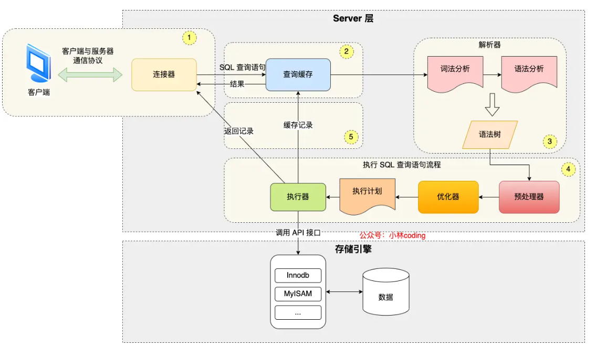
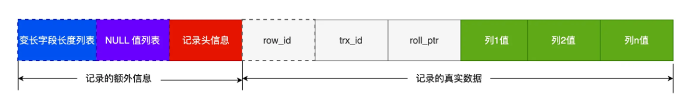
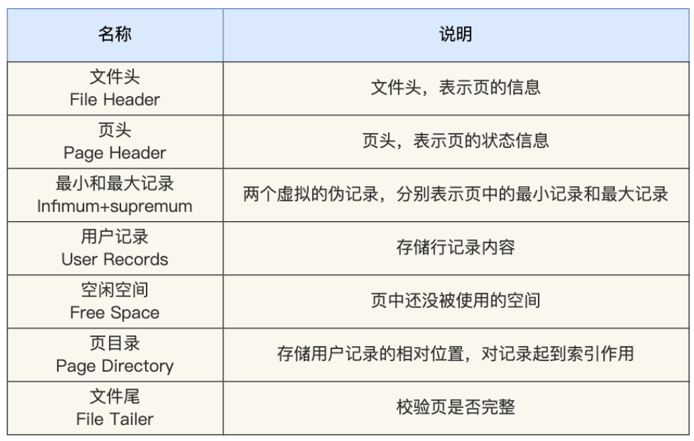
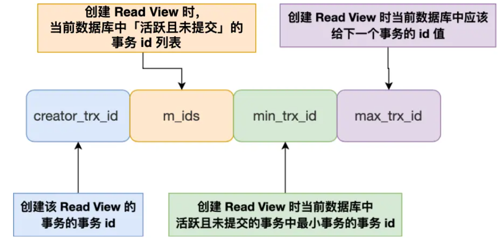
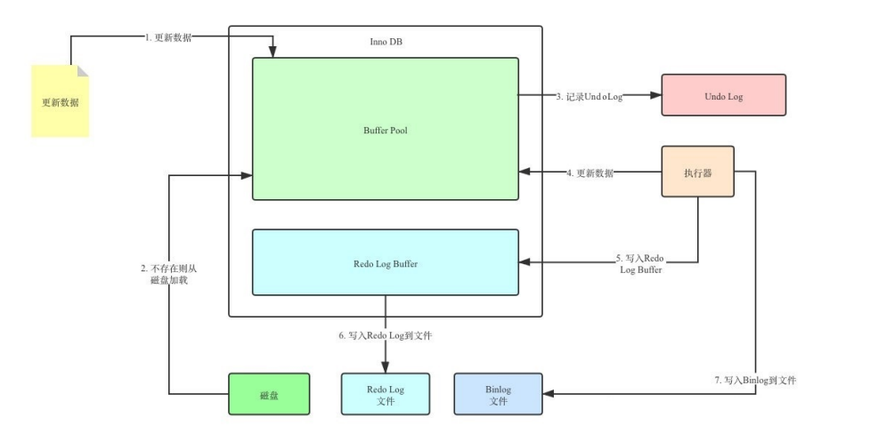

# MySQL

## 执行select语句发生了什么？

- 连接器：建立连接，管理连接、校验用户身份；
- 查询缓存：查询语句如果命中查询缓存则直接返回，否则继续往下执行。MySQL 8.0 已删除该模块；
- 解析 SQL，通过解析器对 SQL 查询语句进行词法分析、语法分析，然后构建语法树，方便后续模块读取表名、字段、语句类型；
- 执行 SQL：执行 SQL 共有三个阶段：
  - 预处理阶段：检查表或字段是否存在；将 `select *` 中的 `*` 符号扩展为表上的所有列。
  - 优化阶段：基于查询成本的考虑， 选择查询成本最小的执行计划；
  - 执行阶段：根据执行计划执行 SQL 查询语句，从存储引擎读取记录，返回给客户端；

##  MySQL 一行记录是怎么存储的？

.opt，用来存储当前数据库的默认字符集和字符校验规则

.frm，**表结构**会保存在这个文件，保存每个表的元数据信息的，主要包含表结构定义。

.ibd，**表数据**会保存在这个文件。表数据既可以存在共享表空间文件，也可以存放在独占表空间文件

###表空间文件的结构

**表空间由段（segment）、区（extent）、页（page）、行（row）组成**。

表空间是由各个段（segment）组成的，段是由多个区（extent）组成的。段一般分为数据段、索引段和回滚段等。

数据库表中的记录都是按行（row）进行存放的，每行记录根据不同的行格式，有不同的存储结构。InnoDB 的数据是按「页」为单位来读写的**，**默认每个页的大小为 **16KB**，也就是最多能保证 16KB 的连续存储空间。为了B+树链表中相邻的两个页之间的物理位置相邻，大数据下又更好的IO性能，分配空间按区分配，**每个区的大小为 1MB**，包含64个页。

###**Compact 行格式**

一条完整的记录分为「记录的额外信息」和「记录的真实数据」两个部分。

**变长字段长度列表**

varchar是变长的，存数据需要将数据大小存储才能正确读取。变长字段的真实数据占用的字节数会按照列的顺序**逆序存放**。这样可以使得位置靠前的记录的真实数据和数据对应的字段长度信息可以同时在一个 CPU Cache Line 中，这样就可以提高 CPU Cache 的命中率。

**NULL 值列表**

NULL 值都放到记录的真实数据中会比较浪费空间，所以 Compact 行格式把这些值为 NULL 的列存储到 NULL值列表中。允许 NULL 值的列，则每个列对应一个二进制位（bit），二进制位按照列的顺序逆序排列。

**记录头信息**

重要的信息包括：

- delete_mask ：标识此条数据是否被删除。从这里可以知道，我们执行 detele 删除记录的时候，并不会真正的删除记录，只是将这个记录的 delete_mask 标记为 1。
- next_record：下一条记录的位置。从这里可以知道，记录与记录之间是通过链表组织的。指向的是下一条记录的「记录头信息」和「真实数据」之间的位置，向左读就是记录头信息，向右读就是真实数据，比较方便。
- record_type：表示当前记录的类型，0表示普通记录，1表示B+树非叶子节点记录，2表示最小记录，3表示最大记录

**隐藏字段**

- row_id：既没有指定主键，又没有唯一约束，那么 InnoDB 就会为记录添加 row_id 隐藏字段。

- trx_id：事务id，表示这个数据是由哪个事务生成的。 trx_id是必需的

- roll_pointer：记录上一个版本的指针。roll_pointer 是必需的

一行记录除了 TEXT、BLOBs 类型的列，限制最大为 65535 字节。一个页的大小一般是 `16KB`，也就是 `16384字节`，所以存在一个页可能就存不了一条记录发生**行溢出**，**多的数据就会存到另外的「溢出页」中**。

Compressed 和 Dynamic 这两个行格式和 Compact 非常类似，主要的区别在于处理行溢出数据时有些区别。这两种格式采用完全的行溢出方式，记录的真实数据处不会存储该列的一部分数据，只存储 20 个字节的指针来指向溢出页。

###页格式

页包含7个部分

在 File Header 中有两个指针，分别指向上一个数据页和下一个数据页，连接起来的页相当于一个双向的链表。页中的记录按照「主键」顺序组成单向链表。为了更好的查询链表，页中的页目录起到索引的作用。

## 索引

- 按「数据结构」分类：**B+tree索引、Hash索引、Full-text索引**。
- 按「物理存储」分类：**聚簇索引（主键索引）、二级索引（辅助索引）**。
- 按「字段特性」分类：**主键索引、唯一索引、普通索引、前缀索引**。
- 按「字段个数」分类：**单列索引、联合索引**。

索引列的选择：

- 如果有主键，默认会使用主键作为聚簇索引的索引键（key）；
- 如果没有主键，就选择第一个不包含 NULL 值的唯一列作为聚簇索引的索引键（key）；
- 在上面两个都没有的情况下，InnoDB 将自动生成一个隐式自增 id 列作为聚簇索引的索引键（key）；

###**B+Tree**

- 主键索引的 B+Tree 的叶子节点存放的是实际数据，所有完整的用户记录都存放在主键索引的 B+Tree 的叶子节点里；
- 二级索引的 B+Tree 的叶子节点存放的是主键值，而不是实际数据。

对于有 N 个叶子节点的 B+Tree，其搜索复杂度为`O(logdN)`，其中 d 表示节点允许的最大子节点个数为 d 个。在实际的应用当中， d 值是大于100的，即使数据达到千万级别时，B+Tree 的高度依然维持在 3~4 层左右，也就是说一次数据查询操作只需要做 3~4 次的磁盘 I/O 操作就能查询到目标数据。

使用二级索引查询时需要先查询主键值，再查询一级索引。这叫**回表**。不过，当查询的数据是能在二级索引的 B+Tree 的叶子节点里查询到，这时就不用再查主键索引查**叫作「覆盖索引」**。

#### **B+Tree 相比于 B 树、二叉树或 Hash 索引结构的优势**

***二叉查找树***：二叉树的每个父节点的儿子节点个数只能是 2 个，搜索复杂度为 `O(logN)`。二叉树检索到目标数据所经历的磁盘 I/O 次数要更多。当每次插入的元素都是二叉查找树中最大的元素，二叉查找树就会退化成了一条链表，查找数据的时间复杂度变成了` O(n)`

***B Tree***：B+Tree 只在叶子节点存储数据，而 B 树 的非叶子节点也要存储数据，所以 B+Tree 的单个节点的数据量更小，在相同的磁盘 I/O 次数下，就能查询更多的节点。另外，B+Tree 叶子节点采用的是双链表连接，适合 MySQL 中常见的基于范围的顺序查找，而 B 树无法做到这一点。

 ***Hash***：Hash 在做等值查询的时候效率贼快，搜索复杂度为 O(1)。但是 Hash 表不适合做范围查询。

#### B+树的页结构

页结构由7部分组成，其中的记录是按照主键值从小到大的顺序组成一个单向链表，并且提供页目录方便记录的查找。页与页之间是双向链表。当数据很多需要额外的页时，会将新的记录保存再另一个页。，新分配的数据页编号可能并不是连续的，但要保证下一个数据页中用户记录的主键值必须大于上一个页中用户记录的主键值。如果不符合就要进行调整。为了保持这样状的调整过程为**页分裂**。

但数据再页与页的查询很困难，所以也需要一个类似页目录的东西提供索引。所以将一些页成为目录。其中保存了其他非目录页的主键值和对应的页地址。形成索引。

#### B+ 树能存多少条数据

假如一行数据的大小约为1K字节，那么按 `16K / 1K = 16`，可以计算出一页大约能存放16条数据。

B+树的存放总记录数为：根节点指针数*单个叶子节点记录行数。

单个叶子节点记录行数已经算出是16，需要计算出非叶子节点能存放多少指针，主键ID为bigint类型，长度为8字节，而指针大小在InnoDB源码中设置为6字节，这样一共14字节。一页中大约可以放16384/14=1170个指针。所以高度为2的B+树，能存放1170*16=18720条这样的数据记录。

**联合索引**

通过将多个字段组合成一个索引，该索引就被称为联合索引。使用联合索引时，存在**最左匹配原则**，也就是按照最左优先的方式进行索引的匹配。

####**失效情况**

**对索引使用左或者左右模糊匹配**

`like %xx` 或者 `like %xx%` 这两种方式都会造成索引失效。

**对索引使用函数**

如果查询条件中对索引字段使用函数，就会导致索引失效。`select * from t_user where length(name)=6;`因为索引保存的是索引字段的原始值，而不是经过函数计算后的值，自然就没办法走索引了。

**对索引进行表达式计算**

`select * from t_user where id + 1 = 10;`但是，如果把查询语句的条件改成 where id = 10 - 1，这样就不是在索引字段进行表达式计算了，于是就可以走索引查询了。

**对索引隐式类型转换**

如果索引字段是字符串类型，但是在条件查询中，输入的参数是整型的话，你会在执行计划的结果发现这条语句会走全表扫描。**MySQL 在遇到字符串和数字比较的时候，会自动把字符串转为数字，然后再进行比较**。

**联合索引非最左匹配**

如果创建了一个 `(a, b, c)` 联合索引，先按 a 排序，在 a 相同的情况再按 b 排序，在 b 相同的情况再按 c 排序。where b=2 and c=3因为没有a会失效。原则上如果a顺序不对也会失效但mysql内部优化a的顺序无影响。

原因是，在联合索引的情况下，数据是按照索引第一列排序，第一列数据相同时才会按照第二列排序。

**WHERE 子句中的 OR**

在 WHERE 子句中，如果在 OR 前的条件列是索引列，而在 OR 后的条件列不是索引列，那么索引会失效。

**范围查询**

select * from t_table where a > 1 and b = 2失效，select * from t_table where a >= 1 and b = 2生效。SELECT * FROM t_table WHERE a BETWEEN 2 AND 8 AND b = 2生效，由于 MySQL 的 BETWEEN 包含 value1 和 value2 边界值类似于>=和<=。SELECT * FROM t_user WHERE name like 'j%' and age = 22生效，SELECT * FROM t_user WHERE name like '%j' and age = 22失效。

### 什么时候需要 / 不需要创建索引？

**什么时候适用索引？**

- 字段有唯一性限制的，比如商品编码；
- 经常用于 `WHERE` 查询条件的字段，这样能够提高整个表的查询速度，如果查询条件不是一个字段，可以建立联合索引。
- 经常用于 `GROUP BY` 和 `ORDER BY` 的字段，这样在查询的时候就不需要再去做一次排序了，因为我们都已经知道了建立索引之后在 B+Tree 中的记录都是排序好的。

**什么时候不需要创建索引？**

- `WHERE` 条件，`GROUP BY`，`ORDER BY` 里用不到的字段，索引的价值是快速定位，如果起不到定位的字段通常是不需要创建索引的，因为索引是会占用物理空间的。
- 字段中存在大量重复数据，不需要创建索引，比如性别字段，只有男女，如果数据库表中，男女的记录分布均匀，那么无论搜索哪个值都可能得到一半的数据。在这些情况下，还不如不要索引，因为 MySQL 还有一个查询优化器，查询优化器发现某个值出现在表的数据行中的百分比很高的时候，它一般会忽略索引，进行全表扫描。
- 表数据太少的时候，不需要创建索引；
- 经常更新的字段不用创建索引，比如不要对电商项目的用户余额建立索引，因为索引字段频繁修改，由于要维护 B+Tree的有序性，那么就需要频繁的重建索引，这个过程是会影响数据库性能的。

###优化索引

**前缀索引优化**

使用前缀索引是为了减小索引字段大小，可以增加一个索引页中存储的索引值，有效提高索引的查询速度。在一些大字符串的字段作为索引时，使用前缀索引可以帮助我们减小索引项的大小。

**覆盖索引优化**

覆盖索引是指从二级索引中查询得到记录，而不需要通过聚簇索引查询获得，可以避免回表的操作。

**主键索引最好是自增**

使用自增主键，每次插入的新数据就会按顺序添加到当前索引节点的位置，不需要移动已有的数据，当页面写满，就会自动开辟一个新页面。因为每次插入一条新记录，都是追加操作，不需要重新移动数据。减小页分裂。

**防止索引失效**

 **count(1)、count(`*`)、count(字段)** 

性能排序：count(*)=count(1)>count(主键字段)>count(字段)

通过 count 函数统计有多少个记录时，MySQL 的 server 层会维护一个名叫 count 的变量。count(主键字段)时会使用一级索引，若有二级索引优先二级索引。相同数量的二级索引记录可以比聚簇索引记录占用更少的存储空间，所以二级索引树比聚簇索引树小，这样遍历二级索引的 I/O 成本比遍历聚簇索引的 I/O 成本小，因此「优化器」优先选择的是二级索引。

但count(字段)会采用全表扫描的方式来计数。count(1)，如果表里只有主键索引，没有二级索引时会进行一级索引。count(1) 相比 count(主键字段) 少一个步骤，就是不需要读取记录中的字段值。但是，如果表里有二级索引时，InnoDB 循环遍历的对象就二级索引了。当你使用 count(`*`) 时，MySQL 会将 `*` 参数转化为参数 0 来处理。

**优化count(*)**

如果对一张大表经常用 count(*) 来做统计，性能很低。如果你的业务对于统计个数不需要很精确使用 show table status 或者 explain 命令来表进行估算。果是想精确的获取表的记录总数，我们可以将这个计数值保存到单独的一张计数表中。当我们在数据表插入一条记录的同时，将计数表中的计数字段 + 1。

## 事务

事务是一组操作的集合，事务会把所有操作作为一个整体一起向系统提交或撤销操作请求，即这些操作要么同时成功，要么同时失败。

**四大特性ACID**

- 原子性(Atomicity)：事务是不可分割的最小操作但愿，要么全部成功，要么全部失败
- 一致性(Consistency)：事务完成时，必须使所有数据都保持一致状态
- 隔离性(Isolation)：数据库系统提供的隔离机制，保证事务在不受外部并发操作影响的独立环境下运行
- 持久性(Durability)：事务一旦提交或回滚，它对数据库中的数据的改变就是永久的
- 原子性是通过 undo log（回滚日志） 来保证的；
- 隔离性是通过 MVCC（多版本并发控制） 或锁机制来保证的；
- 持久性是通过 redo log （重做日志）来保证的；
- 一致性则是通过持久性+原子性+隔离性来保证；

| 问题       | 描述                                                         |
| ---------- | ------------------------------------------------------------ |
| 脏读       | 一个事务读到另一个事务还没提交的数据                         |
| 不可重复读 | 一个事务先后读取同一条记录，但两次读取的数据不同             |
| 幻读       | 一个事务按照条件查询数据时，没有对应的数据行，但是再插入数据时，又发现这行数据已经存在 |

A、B是两个事务，假设都未提交。

脏读：B读到了A更新但未提交的数据，一旦A回滚，数据失效。

不可重复读：A读取数据，B更新了数据并提交，A再读数据。

幻读：AB查出5条数据，A插入新数据并提交，B再查变成了6条。

| 隔离级别              | 脏读 | 不可重复读 | 幻读 |
| --------------------- | ---- | ---------- | ---- |
| Read uncommitted      | √    | √          | √    |
| Read committed        | ×    | √          | √    |
| Repeatable Read(默认) | ×    | ×          | √    |
| Serializable          | ×    | ×          | ×    |

`READ UNCOMMITTED`由于可以读到未提交事务修改过的记录，所以直接读取记录的最新版。对于使用`SERIALIZABLE`使用加锁的方式来访问记录。对于使用`READ COMMITTED`和`REPEATABLE READ`隔离级别的事务保证读到已经提交了的事务修改过的记录，不能直接读取最新版本的记录。

### MVCC

多版本并发控制。MVCC 是通过数据行的多个版本管理来实现数据库的并发控制 。

**快照读**又叫一致性读，读取的是快照数据。不加锁的简单的 SELECT 都属于快照读，即不加锁的非阻塞读；

**当前读**读取的是记录的最新版本（最新数据，而不是历史版本的数据），读取时还要保证其他并发事务 不能修改当前记录，会对读取的记录进行加锁。加锁的 SELECT，或者对数据进行增删改都会进行当前读。

**ReadView**

只有在对表中的记录做改动时（执行INSERT、DELETE、UPDATE这些语句时）才会为事务分配事务id，否则在一个只读事务中的事务id值都默认为0。

对于使用 InnoDB 存储引擎的数据库表，它的聚簇索引记录中都包含下面两个隐藏列：

- trx_id，当一个事务对某条聚簇索引记录进行改动时，就会**把该事务的事务 id 记录在 trx_id 隐藏列里**；
- roll_pointer，每次对某条聚簇索引记录进行改动时，都会把旧版本的记录写入到 undo 日志中，然后**这个隐藏列是个指针，指向每一个旧版本记录**，于是就可以通过它找到修改前的记录。

- `trx_id = creator_trx_id`：当前事务在访问它自己修改过的记录，该版本可以被当前事务访问。
- `trx_id <min_trx_id` : 此版本的事务在当前事务生成ReadView前已经提交，可访问
- `trx_id >max_trx_id` : 此版本的事务在当前事务生成ReadView后才开启,不可访问
- `min_trx_id <trx_id<max_trx_id` :判断一下`trx_id`属性值是不是在`m_ids`列表,在表示还活跃不可访问。不在可以访问。

`READ COMMITTD`、`REPEATABLE READ`这两个隔离级别的一个很大不同就是：生成ReadView的时机不同，Read committed在每一次进行普通SELECT操作前都会生成一个ReadView，而Repeatable Read只在第一次进行普通SELECT操作前生成一个ReadView，之后的查询操作都重复使用这个ReadView就好了。

每次生成ReadView意味着已提交的事务会排除在m_ids的列表，因为被更新了，所以当前情况可以读到已提交事务的数据造成不可重复读。

只第一次生成意味着它的版本处于第一次查询时的状态，对新提交时造成的快照忽略，解决了不可重复读。

MySQL InnoDB 引擎的默认隔离级别虽然是「可重复读」，但是它很大程度上避免幻读现象，解决的方案有两种：

- 针对**快照读**（普通 select 语句），是**通过 MVCC 方式解决了幻读**，因为可重复读隔离级别下，事务执行过程中看到的数据，一直跟这个事务启动时看到的数据是一致的，即使中途有其他事务插入了一条数据，是查询不出来这条数据的，所以就很好了避免幻读问题。
- 针对**当前读**（select ... for update 等语句），是**通过 next-key lock（记录锁+间隙锁）方式解决了幻读**，因为当执行 select ... for update 语句的时候，会加上 next-key lock，如果有其他事务在 next-key lock 锁范围内插入了一条记录，那么这个插入语句就会被阻塞，无法成功插入，所以就很好了避免幻读问题。

当AB两个事务，A首次查询时数据5，B在此时插入数据5，由于A是快照读再查询也不会读到。但若A执行更新操作，就会成功更新5。要避免就是先执行更新操作，此时会使用当前读加锁。

只有在聚簇索引记录中才有 trx_id 和 roll_pointer，如果某个查询语句是使用的二级索引来查询，要使用下面的方式判断可见性：
二级索引页面的 Page Header 部分有一个名为 PAGE_MAX_TRX_ID 的属性，执行增删改操作时，更新为max(事务 id ,PAGE_MAX_TRX_ID )， PAGE_MAX_TRX_ID 属性值设置为执行该操作的最大事务 id。
当 SELECT 语句访问某个二级索引记录时，如果 ReadView的 min_trx_id > PAGE_MAX_TRX_ID 属性值？如果是，则说明该页面中的所有记录对该 ReadView 可见；否则利用二级索引记录中的主键值进行回表操作，得到对应的聚簇索引记录后在按照聚簇索引的方式，判断该可见性。

## 锁

MySQL锁可以按模式分类为：乐观锁与悲观锁。按粒度分可以分为全局锁、表级锁、页级锁、行级锁。按属性可以分为：共享锁、排它锁。按状态分为：意向共享锁、意向排它锁。按算法分为：间隙锁、临键锁、记录锁。NOTE : **针对事物才有加锁的意义。**

###全局锁

`flush tables with read lock`添加全局锁，数据库处于只读状态，可以用于全库逻辑备份。但此时会影响业务。可以通过事务的可重复读的隔离，利用Read View进行备份。

### 表级锁

**表锁**

表锁除了会限制别的线程的读写外，也会限制本线程接下来的读写操作。

**元数据锁**MDL

不需要显示的使用，对数据库表进行操作时，会自动添加，为了保证当用户对表执行 CRUD 操作时，防止其他线程对这个表结构做了变更。在事务提交后才会释放，这意味着**事务执行期间，MDL 是一直持有的**。

申请 MDL 锁的操作会形成一个队列，队列中**写锁获取优先级高于读锁**，一旦出现 MDL 写锁等待，会阻塞后续该表的所有 CRUD 操作。所以若存在MD阻塞表结构变更后，后续对该表的 select 语句，就都会被阻塞。会有线程爆满的风险。

**意向锁**

了避免增删改在执行时，加的行锁与表锁的冲突，在InnoDB中引入了意向锁，使得表锁不用检查每行数据是否加锁，使用意向锁来减少表锁的检查。

**AUTO-INC 锁**

主键通常都会设置成自增，使用`AUTO_INCREMENT` 属性实现。AUTO-INC 锁是特殊的表锁机制，锁不是再一个事务提交后才释放，而是再执行完插入语句后就会立即释放。它保证了主键是自增连续的。但是， AUTO-INC 锁再对大量数据进行插入的时候，会影响插入性能，因为另一个事务中的插入会被阻塞。

5.1版本后，插入数据的时候，会为被 `AUTO_INCREMENT` 修饰的字段加上轻量级锁，给该字段赋值一个自增的值，就把这个轻量级锁释放。不需要等语句执行后才释放。但是当搭配 binlog 的日志格式是 statement 一起使用的时候，在「主从复制的场景」中会发生**数据不一致的问题**。生成的 id 可能不连续。

事务发生回滚时，赋予的自增值不会回滚导致下次赋予的值不连续。

当两个事务同时执行表插入数据时，A获得id1，2。B获得3。B再插入获得4。binlog 记录这两个 session 的 insert 语句。主从复制时，依据binlog 循序执行可能插入语句执行属性与主库不一致，导致id不连续。要解决这问题，binlog 日志格式要设置为 row，这样在 binlog 里面记录的是主库分配的自增值

###**行级锁**

InnoDB 引擎是支持行级锁的，而 MyISAM 引擎并不支持行级锁

普通的 select 语句是不会对记录加锁的，因为它属于快照读。但可以手动加锁。

对于行级锁，主要分为以下三类：

1. **记录锁**（Record Lock）：锁定单个行记录的锁，防止其他事务对此行进行update和delete。在RC（read commit ）、RR（repeat read）隔离级别下都支持。
2. **间隙锁**（GapLock）：锁定索引记录间隙（不含该记录），确保索引记录间隙不变，防止其他事务在这个间隙进行insert，产生幻读。在RR隔离级别下都支持。比如说 两个临近叶子节点为 15 23，那么间隙就是指 [15 , 23],锁的是这个间隙。
3. **临键锁**（Next-Key Lock）：行锁和间隙锁组合，同时锁住数据，并锁住数据前面的间隙Gap。在RR隔离级别下支持。**左开右闭**。

按属性可以分为

1. 共享锁（S）：允许一个事务去读一行，阻止其他事务获得相同数据集的排它锁。
2. 排他锁（X）：允许获取排他锁的事务更新数据，阻止其他事务获得相同数据集的共享锁和排他锁。

| SQL                          | 行锁类型   | 说明                                     |
| ---------------------------- | ---------- | ---------------------------------------- |
| insert                       | 排他锁     | 自动加锁                                 |
| update                       | 排他锁     | 自动加锁                                 |
| delete                       | 排他锁     | 自动加锁                                 |
| select                       | 不加任何锁 |                                          |
| select　lock　in　share mode | 共享锁     | 需要手动在SELECT之后加LOCK IN SHARE MODE |
| select　for　update          | 排他锁     | 需要手动在SELECT之后加FOR UPDATE         |

**MySQL 是怎么加行级锁的？**

InnoDB的行锁是通过给索引上的索引项加锁来实现的，所以加锁的不是数据本身而是索引。

即使是访问不同行的记录，如果使用了相同的索引键，也是会出现锁冲突的。

在某些场景下，临建锁会退化为**记录锁**或**间隙锁**，即在只使用记录锁或间隙锁就能**避免幻读现象**的场景下，临建锁会退化！

- 唯一索引等值查询：当索引项存在时，next-key lock 退化为 record lock；当索引项不存在时，默认 next-key lock，访问到不满足条件的第一个值后next-key lock退化成gap lock

- 唯一索引范围查询：默认 next-key lock，(特殊’<=’ 范围查询直到访问不满足条件的第一个值为止)

- 非唯一索引等值查询：默认next-key lock ，索引项存在/不存在都是访问到不满足条件的第一个值后next-key lock退化成gap lock

- 非唯一索引范围查询：默认 next-key lock，向右访问到不满足条件的第一个值为止

**update 语句的 where 条件没有使用索引，就会全表扫描，于是就会对所有记录加上 next-key 锁（记录锁 + 间隙锁），相当于把整个表锁住了**。

### 死锁

解决办法：

- 回滚较小的那个事务
- 在REPEATABLE-READ隔离级别下，如果两个线程同时对相同条件记录用SELECT…FOR UPDATE加排他锁，在没有符合该条件记录情况下，两个线程都会加锁成功。程序发现记录尚不存在，就试图插入一条新记录，如果两个线程都这么做，就会出现死锁。这种情况下，将隔离级别改成READ COMMITTED，就可避免问题。
  

## 日志

- **undo log（回滚日志）**：是 Innodb 存储引擎层生成的日志，实现了事务中的**原子性**，主要**用于事务回滚和 MVCC**。
- **redo log（重做日志）**：是 Innodb 存储引擎层生成的日志，实现了事务中的**持久性**，主要**用于掉电等故障恢复**；
- **binlog （归档日志）**：是 Server 层生成的日志，主要**用于数据备份和主从复制*

### undo log

如果我们每次在事务执行过程中，都记录下回滚时需要的信息到一个日志里，那么在事务执行中途发生了 MySQL 崩溃后，就不用担心无法回滚到事务之前的数据，我们可以通过这个日志回滚到事务之前的数据。实现这一机制就是 undo log（回滚日志），它保证了AICD中的原子性。另外，undo log 还有一个作用，通过 ReadView + undo log 实现 MVCC（多版本并发控制）。

发生回滚时，就读取 undo log 里的数据，然后做原先相反操作。 

### redo log

在事务提交后即使系统发生了崩溃，这个事务对数据库中所做的更改也不能丢失。在事务提交时，只要先将 redo log 持久化到磁盘即可，可以不需要等到将缓存在 Buffer Pool 里的脏页数据持久化到磁盘。

写入 redo log 的方式使用了追加操作， 所以磁盘操作是**顺序写**，而写入数据需要先找到写入位置，然后才写到磁盘，所以磁盘操作是**随机写**。磁盘的「顺序写 」比「随机写」 高效的多，因此 redo log 写入磁盘的开销更小。

 redo log 也不是直接写入磁盘的，因为这样会产生大量的 I/O 操作，会先存到自己的缓存**redo log buffer**。

**redo log 和 undo log 区别在哪？**

- redo log 记录了此次事务「**完成后**」的数据状态，记录的是更新**之后**的值；
- undo log 记录了此次事务「**开始前**」的数据状态，记录的是更新**之前**的值；

### binlog

binlog 文件是记录了所有数据库表结构变更和表数据修改的日志，不会记录查询类的操作。

**redo log 和 binlog 有什么区别？**

- binlog 是 MySQL 的 Server 层实现的日志，所有存储引擎都可以使用，redo log 是 Innodb 存储引擎实现的日志；

- binlog 是追加写，写满一个文件，就创建一个新的文件继续写，不会覆盖以前的日志，保存的是全量的日志。redo log 是循环写，日志空间大小是固定，全部写满就从头开始，保存未被刷入磁盘的脏页日志。
- binlog 用于备份恢复、主从复制；redo log 用于掉电等故障恢复。
- binlog 有 3 种格式类型，分别是 STATEMENT（默认格式）、ROW、 MIXED。redo log 是物理日志，记录的是在某个数据页做了什么修改

###Buffer Pool

**缓冲池（Buffer Pool）**，来提高数据库的读写性能。读取数据时，优先从Buffer Pool获取数据，修改数据时，优先修改缓存然后设置脏页。后续由后台线程写入磁盘。

为了能够快速找到空闲的缓存页，可以使用链表结构，将空闲缓存页的「控制块」作为链表的节点，这个链表称为 **Free 链表**（空闲链表）。为了能快速知道哪些缓存页是脏的，于是就设计出 **Flush 链表**，它跟 Free 链表类似的，链表的节点也是控制块，区别在于 Flush 链表的元素都是脏页。

**提高缓存命中率**

使用LRU 算法。

MySQL 在加载数据页时，会提前把它相邻的数据页一并加载进来，目的是为了减少磁盘 IO。这叫预读。但预读的数据可能不会被访问反而会导致以前的数据被LRU删除。

解决：改进了LRU。将 LRU 划分了 2 个区域：**old 区域 和 young 区域**。预读的页就只需要加入到 old 区域的头部，当页被真正访问的时候，才将页插入 young 区域的头部。

当某一个 SQL 语句扫描了大量的数据时可能会占满Buffer Pool造成污染。

解决：LRU 链表中 young 区域就是热点数据，只要我们提高进入到 young 区域的门槛，就能有效地保证 young 区域里的热点数据不会被替换掉。进入到 young 区域条件增加了一个停留在 old 区域的时间判断。

**脏页什么时候会被刷入磁盘？**

- 当 redo log 日志满了的情况下，会主动触发脏页刷新到磁盘；
- Buffer Pool 空间不足时，需要将一部分数据页淘汰掉，如果淘汰的是脏页，需要先将脏页同步到磁盘；
- MySQL 认为空闲时，后台线程会定期将适量的脏页刷入到磁盘；
- MySQL 正常关闭之前，会把所有的脏页刷入到磁盘；

### 主从复制

MySQL 的主从复制依赖于 binlog，复制的过程就是将 binlog 中的数据从主库传输到从库上。这个过程一般是**异步**的。

MySQL 集群的主从复制过程梳理成 3 个阶段：

- **写入 Binlog**：主库写 binlog 日志，提交事务，并更新本地存储数据。
- **同步 Binlog**：把 binlog 复制到所有从库上，每个从库把 binlog 写到暂存日志中。
- **回放 Binlog**：回放 binlog，并更新存储引擎中的数据。

### 两阶段提交

在持久化 redo log 和 binlog 这两份日志的时候，如果出现半成功的状态(一个保存一个失败)，就会造成主从环境的数据不一致性。

两阶段提交把单个事务的提交拆分成了 2 个阶段，分别是「准备阶段」和「提交阶段」

事务的提交过程有两个阶段，就是将 redo log 的写入拆成了两个步骤：prepare 和 commit，中间再穿插写入binlog。MySQL 使用了**内部 XA 事务**保证两个日志的一致性。

- **prepare 阶段**：将内部 XA 事务的 ID(XID )写入到 redo log，同时将 redo log 对应的事务状态设置为 prepare，然后将 redo log 持久化到磁盘
- **commit 阶段**：把 内部 XA 事务的 ID写入到 binlog，然后将 binlog 持久化到磁盘，接着调用引擎的提交事务接口，将 redo log 状态设置为 commit，此时该状态并不需要持久化到磁盘，只需要 write 到文件系统的 page cache 中就够了，因为只要 binlog 写磁盘成功，就算 redo log 的状态还是 prepare 也没有关系，一样会被认为事务已经执行成功；

若 MySQL 重启，会按顺序扫描 redo log 文件，碰到处于 prepare 状态的 redo log，就拿着 redo log 中的 XID 去 binlog 查看是否存在此 XID.没有证明binlog失败，使用redolog回滚。成功就是正常。

**事务没提交的时候，redo log 会被持久化到磁盘吗？**

事务执行中间过程的 redo log 也是直接写在 redo log buffer 中的，这些缓存在 redo log buffer 里的 redo log 也会被「后台线程」每隔一秒一起持久化到磁盘。

若mysql 崩溃，即使redo log被持久化，但binlog没有，会进行回滚操作。所以， redo log 可以在事务没提交之前持久化到磁盘，但是 binlog 必须在事务提交之后，才可以持久化到磁盘。

**两阶段提交缺点**

- **磁盘 I/O 次数高**：每个事务提交都会进行两次 fsync（刷盘），一次是 redo log ，一次是 binlog 。
- **锁竞争激烈**：两阶段提交虽然能够保证「单事务」两个日志的内容一致，但在「多事务」的情况下，却不能保证两者的提交顺序一致，因此，在两阶段提交的流程基础上，还需要加一个锁来保证提交的原子性，从而保证多事务的情况下，两个日志的提交顺序一致。

MySQL 引入了 binlog 组提交（group commit）机制，当有多个事务提交的时候，会将多个 binlog 刷盘操作合并成一个，从而减少磁盘 I/O 的次数。

##update 语句的执行过程。

`update t_user set name = 'xiaolin' where id = 1;`

执行器通过主键索引查询，若在buffer pool直接返回，不在从磁盘读入pool。得到数据后判断更新前后是否一致，不一致则继续执行。开启事务，先记录undo日志，将旧数据记录。更新记录到缓存并设置脏页。随后记录到redo日志，先保存到 redolog buffer。后台线程选择时机写入磁盘。

记录更新完毕后，记录binlog，binlog 会被保存到 binlog cache。两阶段事务提交。提交后binlog刷新到硬盘。