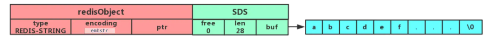
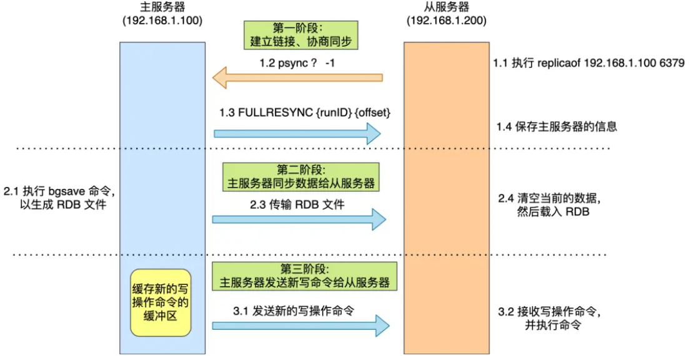
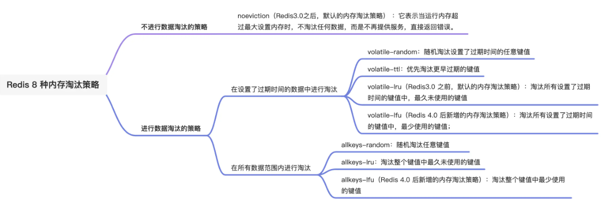

# Redis

Redis 是一种基于内存的数据库，对数据的读写操作都是在内存中完成，因此**读写速度非常快**，常用于**缓存，消息队列、分布式锁等场景**。

## Redis 和 Memcached 有什么区别？

Redis 与 Memcached **共同点**：

1. 都是基于内存的数据库，一般都用来当做缓存使用。
2. 都有过期策略。
3. 两者的性能都非常高。

Redis 与 Memcached **区别**：

- Redis 支持的数据类型更丰富（String、Hash、List、Set、ZSet），而 Memcached 只支持最简单的 key-value 数据类型；
- Redis 支持数据的持久化，可以将内存中的数据保持在磁盘中，重启的时候可以再次加载进行使用，而 Memcached 没有持久化功能，数据全部存在内存之中，Memcached 重启或者挂掉后，数据就没了；
- Redis 原生支持集群模式，Memcached 没有原生的集群模式，需要依靠客户端来实现往集群中分片写入数据；
- Redis 支持发布订阅模型、Lua 脚本、事务等功能，而 Memcached 不支持；

## 为什么用 Redis 作为 MySQL 的缓存？

主要是因为 **Redis 具备「高性能」和「高并发」两种特性**。

操作 Redis 缓存就是直接操作内存，所以速度相当快。

单台设备的 Redis 的 QPS（Query Per Second，每秒钟处理完请求的次数） 是 MySQL 的 10 倍，Redis 单机的 QPS 能轻松破 10w，而 MySQL 单机的 QPS 很难破 1w。

为什么快？

主要是有三个原因：1、Redis的全部操作都是纯内存的操作；2、Redis采用单线程，有效避免了频繁的上下文切换；3，采用了非阻塞I/O多路复用机制。

## 数据结构

常见的有五种：**String（字符串），Hash（哈希），List（列表），Set（集合）、Zset（有序集合）**。面又支持了四种数据类型： **BitMap（2.2 版新增）、HyperLogLog（2.8 版新增）、GEO（3.2 版新增）、Stream（5.0 版新增）**。

### String

最基本的 key-value 结构，value其实不仅是字符串， 也可以是数字（整数或浮点数）

底层的数据结构实现主要是 int 和 SDS（简单动态字符串）。SDS 不仅可以保存文本数据，还可以保存二进制数据。使用 `len` 属性记录了字符串长度可以O(1)获得长度。拼接字符串缓冲不足时自动扩容，是安全的。

字符串对象的内部编码（encoding）有 3 种 ：**int、raw和 embstr**。embstr小字符串，通过一次内存分配函数来分配一块连续的内存空间来保存。raw大字符串，调用两次内存分配函数来分别分配两块空间来保存。

应用场景：缓存对象，计数，分布式锁(SET 命令有个 NX 参数可以实现「key不存在才插入」，可以用它来实现分布式锁)，共享Session信息.

### List

List 列表是简单的字符串列表，**按照插入顺序排序**，可以从头部或尾部向 List 列表添加元素。

底层数据结构是由**双向链表或压缩列表**实现

- 如果列表的元素个数小于 `512` 个，列表每个元素的值都小于 `64` 字节，Redis 会使用**压缩列表**作为 List 类型的底层数据结构；
- 如果列表的元素不满足上面的条件，Redis 会使用**双向链表**作为 List 类型的底层数据结构；

应用场景：消息队列

### Hash

Hash 是一个键值对（key - value）集合，其中 value 的形式如： `value=[{field1，value1}，...{fieldN，valueN}]`。Hash 特别适合用于存储对象。

Hash 类型的底层数据结构是由**压缩列表或哈希表**实现的：

- 如果哈希类型元素个数小于 `512` 个，所有值小于 `64` 字节的话，Redis 会使用**压缩列表**作为 Hash 类型的底层数据结构；
- 如果哈希类型元素不满足上面条件，Redis 会使用**哈希表**作为 Hash 类型的 底层数据结构。

### Set

Set 类型是一个无序并唯一的键值集合，它的存储顺序不会按照插入的先后顺序进行存储。

Set 类型的底层数据结构是由**哈希表或整数集合**实现的：

- 如果集合中的元素都是整数且元素个数小于 `512` 个，Redis 会使用**整数集合**作为 Set 类型的底层数据结构；
- 如果集合中的元素不满足上面条件，则 Redis 使用**哈希表**作为 Set 类型的底层数据结构。

###Zset

Zset 类型（有序集合类型）相比于 Set 类型多了一个排序属性 score（分值），对于有序集合 ZSet 来说，每个存储元素相当于有两个值组成的，一个是有序集合的元素值，一个是排序值。

Zset 类型的底层数据结构是由**压缩列表或跳表**实现的：

- 如果有序集合的元素个数小于 `128` 个，并且每个元素的值小于 `64` 字节时，Redis 会使用**压缩列表**作为 Zset 类型的底层数据结构；
- 如果有序集合的元素不满足上面的条件，Redis 会使用**跳表**作为 Zset 类型的底层数据结构；

### BitMap

Bitmap，即位图，是一串连续的二进制数组（0和1），可以通过偏移量（offset）定位元素。BitMap通过最小的单位bit来进行`0|1`的设置，表示某个元素的值或者状态，时间复杂度为O(1)。

Bitmap 本身是用 String 类型作为底层数据结构实现的一种统计二值状态的数据类型。

### HyperLogLog

一种用于「统计基数」的数据集合类型，基数统计就是指统计一个集合中不重复的元素个数。HyperLogLog 是统计规则是基于概率完成的，不是非常准确.

HyperLogLog 的优点是，在输入元素的数量或者体积非常非常大时，计算基数所需的内存空间总是固定的、并且是很小的。

### GEO

主要用于存储地理位置信息，并对存储的信息进行操作。

GEO 本身并没有设计新的底层数据结构，而是直接使用了 Sorted Set 集合类型。

###Stream 

Redis 专门为消息队列设计的数据类型。它支持消息的持久化、支持自动生成全局唯一 ID、支持 ack 确认消息的模式、支持消费组模式等，让消息队列更加的稳定和可靠。

## 线程模型

Redis 6.0 之前为什么使用单线程，以后使用多线程。

**Redis 程序并不是单线程的**，Redis 在启动的时候，是会**启动后台线程**（BIO）的。Redis 主要3个后台线程来完成「关闭文件、AOF 刷盘、释放内存」。因为这些任务的操作都是很耗时的，如果把这些任务都放在主线程来处理，那么 Redis 主线程就很容易发生阻塞。

- BIO_CLOSE_FILE，关闭文件任务队列：当队列有任务后，后台线程会调用 close(fd) ，将文件关闭；
- BIO_AOF_FSYNC，AOF刷盘任务队列：当 AOF 日志配置成 everysec 选项后，主线程会把 AOF 写日志操作封装成一个任务，也放到队列中。当发现队列有任务后，后台线程会调用 fsync(fd)，将 AOF 文件刷盘，
- BIO_LAZY_FREE，lazy free 任务队列：当队列有任务后，后台线程会 free(obj) 释放对象 / free(dict) 删除数据库所有对象 / free(skiplist) 释放跳表对象

**单线程模式**

Redis 单线程指的是「接收客户端请求->解析请求 ->进行数据读写等操作->发送数据给客户端」这个过程是由一个线程（主线程）来完成的。

Redis 初始化的时候，会做下面这几件事情：

- 首先，调用 epoll_create() 创建一个 epoll 对象和调用 socket() 创建一个服务端 socket
- 然后，调用 bind() 绑定端口和调用 listen() 监听该 socket；
- 然后，将调用 epoll_ctl() 将 listen socket 加入到 epoll，同时注册「连接事件」处理函数。

初始化后主线程就进入到一个**事件循环函数**，先调用**处理发送队列函数**，看是发送队列里是否有任务。接着，调用 epoll_wait 函数等待事件的到来。到来交给相应的事件处理函数。

### Redis 采用单线程为什么还这么快？

- Redis 的大部分操作**都在内存中完成**，并且采用了高效的数据结构，因此 Redis 瓶颈可能是机器的内存或者网络带宽，而并非 CPU，既然 CPU 不是瓶颈，那么自然就采用单线程的解决方案了；
- Redis 采用单线程模型可以**避免了多线程之间的竞争**，省去了多线程切换带来的时间和性能上的开销，而且也不会导致死锁问题。
- Redis 采用了 **I/O 多路复用机制**处理大量的客户端 Socket 请求，IO 多路复用机制是指一个线程处理多个 IO 流，就是我们经常听到的 select/epoll 机制。简单来说，在 Redis 只运行单线程的情况下，该机制允许内核中，同时存在多个监听 Socket 和已连接 Socket。内核会一直监听这些 Socket 上的连接请求或数据请求。一旦有请求到达，就会交给 Redis 线程处理，这就实现了一个 Redis 线程处理多个 IO 流的效果。

## 持久化

Redis 共有三种数据持久化的方式：

- **AOF 日志**：每执行一条写操作命令，就把该命令以追加的方式写入到一个文件里；
- **RDB 快照**：将某一时刻的内存数据，以二进制的方式写入磁盘；
- **混合持久化方式**：Redis 4.0 新增的方式，集成了 AOF 和 RBD 的优点；

###AOF 日志

Redis 在执行完一条写操作命令后，就会把该命令以追加的方式写入到一个文件里，然后 Redis 重启时，会读取该文件记录的命令，然后逐一执行命令的方式来进行数据恢复。

Reids 是先执行写操作命令后，才将该命令记录到 AOF 日志里的，这么做其实有两个好处，**避免额外的检查开销**，**不会阻塞当前写操作命令的执行**。当然，这样做也会带来风险：**数据可能会丢**，**可能阻塞其他操作**

**AOF 写回策略**

1. Redis 执行完写操作命令后，会将命令追加到 server.aof_buf 缓冲区；
2. 然后通过 write() 系统调用，将 aof_buf 缓冲区的数据写入到 AOF 文件，此时数据并没有写入到硬盘，而是拷贝到了内核缓冲区 page cache，等待内核将数据写入硬盘；
3. 具体内核缓冲区的数据什么时候写入到硬盘，由内核决定

Redis 提供了 3 种写回硬盘的策略：

**Always**：每次写操作命令执行完后，同步将 AOF 日志数据写回硬盘

**Everysec**：每次写操作命令执行完后，先将命令写入到 AOF 文件的内核缓冲区，然后每隔一秒将缓冲区里的内容写回到硬盘

**No**：不由 Redis 控制写回硬盘的时机，转交给操作系统控制写回的时机

**AOF 重写机制**

AOF 日志过大，会触发 **AOF 重写机制**，来压缩 AOF 文件。使用重写机制后，就会读取最新的键值对 ，将设置命令记录到新的 AOF 文件，消除无用的历史命令。重写 AOF 日志的过程**由后台子进程bgrewriteaof 来完成的**，从而避免阻塞主进程。不使用线程的原因是线程之间会共享内存，那么在修改共享内存数据的时候，需要通过加锁来保证数据的安全，而这样就会降低性能。

但是重写过程中，主进程依然可以正常处理命令，会产生数据不一致问题。Redis 设置了一个 **AOF 重写缓冲区**在创建 bgrewriteaof 子进程之后使用，重写过程将命令写入到 「AOF 缓冲区」和 「AOF 重写缓冲区」。主进程收到重写完成信号后，将缓冲区内容追加到新AOF文件中。

###RDB 快照

RDB 快照就是记录某一个瞬间的内存数据，记录的是实际数据，而 AOF 文件记录的是命令操作的日志，而不是实际的数据。 RDB 恢复数据的效率会比 AOF 高。

Redis 的快照是**全量快照**，也就是说每次执行快照，都是把内存中的「所有数据」都记录到磁盘中。Redis 提供了save 和 bgsave两个命令来生成 RDB 文件。

- 执行了 save 命令，就会在主线程生成 RDB 文件，由于和执行操作命令在同一个线程，所以如果写入 RDB 文件的时间太长，**会阻塞主线程**；
- 执行了 bgsave 命令，会创建一个子进程来生成 RDB 文件，这样可以**避免主线程的阻塞**；

**写时复制技术**

执行 bgsave 命令的时候，会通过 fork() 创建子进程，此时子进程和父进程是共享同一片内存数据。主线程执行写操作，则被修改的数据会复制一份副本，然后 bgsave 子进程会把该副本数据写入 RDB 文件

### 混合持久化

混合持久化，既保证了 Redis 重启速度，又降低数据丢失风险。

混合持久化工作在 **AOF 日志重写过程**，

重写子进程会先将与主线程共享的内存数据以 RDB 方式写入到 AOF 文件，然后主线程处理的操作命令会被记录在重写缓冲区里，重写缓冲区里的增量命令会以 AOF 方式写入到 AOF 文件。使用了混合持久化，AOF 文件的**前半部分是 RDB 格式的全量数据，后半部分是 AOF 格式的增量数据**。

## 集群

### 主从复制

主从复制是 Redis 高可用服务的最基础的保证，实现方案就是将从前的一台 Redis 服务器，同步数据到多台从 Redis 服务器上，即一主多从的模式，且主从服务器之间采用的是「读写分离」的方式。主服务器可以进行读写操作，从服务器一般是只读，并接受主服务器同步过来写操作命令。主从服务器之间的命令复制是**异步**进行的，所以无法实现强一致性保证。

**应对主从数据不一致？**

保证主从节点间的网络连接状况良好。开发一个外部程序来监控主从节点间的复制进度。用 INFO replication 命令查到主、从节点的进度，然后，我们用 master_repl_offset 减去 slave_repl_offset，得到从节点和主节点间的复制进度差。若大于我们预设的阈值，可以禁止读取

**第一次同步**

使用 `replicaof`命令形成主服务器和从服务器的关系。第一次同步的过程可分为三个阶段：

- 第一阶段是建立链接、协商同步；
- 第二阶段是主服务器同步数据给从服务器；
- 第三阶段是主服务器发送新写操作命令给从服务器。

执行了 replicaof 命令后，从服务器就会给主服务器发送 `psync` 命令，表示要进行数据同步。主服务器收到 psync 命令后，会用 `FULLRESYNC` (**全量复制**)作为响应命令返回给对方。接着，主服务器会执行 bgsave 命令来生成 RDB 文件，然后把文件发送给从服务器。在生成、发送和从服务器加载时间的写命令会写入replication buffer 缓冲区。在主服务器生成的 RDB 文件发送完，从服务器收到 RDB 文件后，丢弃所有旧数据，将 RDB 数据载入到内存。完成 RDB 的载入后，会回复一个确认消息给主服务器。接着，主服务器将 replication buffer 缓冲区里所记录的写操作命令发送给从服务器。

**命令传播**

主从服务器在完成第一次同步后，双方之间就会维护一个 TCP 长连接。后续主服务器可以通过这个连接继续将写操作命令传播给从服务器。

从服务器可以有自己的从服务器，分摊主服务器的压力。

**增量复制**

主从服务器在命令同步时出现了网络断开又恢复的情况,TCP 长连接断开后，数据不一致。为了解决全量复制开销大的问题，使用增量复制的方式，只会把网络断开期间主服务器接收到的写操作命令，同步给从服务器。

- 从服务器在恢复网络后，会发送 psync 命令给主服务器，此时的 psync 命令里的 offset 参数不是 -1；
- 主服务器收到该命令后，然后用 CONTINUE 响应命令告诉从服务器接下来采用增量复制的方式同步数据；
- 然后主服务将主从服务器断线期间，所执行的写命令发送给从服务器，然后从服务器执行这些命令。

网络断开后，当从服务器重新连上主服务器时，从服务器会通过 psync 命令将自己的复制偏移量 slave_repl_offset 发送给主服务器，主服务器根据自己的 master_repl_offset 和 slave_repl_offset 之间的差距，然后来决定对从服务器执行哪种同步操作，判断出从服务器要读取的数据还在 repl_backlog_buffer 缓冲区里，那么主服务器将采用**增量同步**的方式；

Redis 判断节点是否正常工作，基本都是通过互相的 ping-pong 心态检测机制，如果有一半以上的节点去 ping 一个节点的时候没有 pong 回应，集群就会认为这个节点挂掉了，会断开与这个节点的连接

**Buffer(replication buffer 、repl backlog buffer)**

- 出现的阶段不一样：
  - repl backlog buffer 是在增量复制阶段出现，**一个主节点只分配一个 repl backlog buffer**；
  - replication buffer 是在全量复制阶段和增量复制阶段都会出现，**主节点会给每个新连接的从节点，分配一个 replication buffer**；
- 这两个 Buffer 都有大小限制的，当缓冲区满了之后，发生的事情不一样：
  - 当 repl backlog buffer 满了，因为是环形结构，会直接**覆盖起始位置数据**;
  - 当 replication buffer 满了，会导致连接断开，删除缓存，从节点重新连接，**重新开始全量复制**。

**数据丢失**

主从切换过程中，产生数据丢失的情况有两种：

**异步复制同步丢失**

主节点还没来得及同步给从节点时发生了断电，那么主节点内存中的数据会丢失。可以配置min-slaves-max-lag。如果数据同步完成所需要时间超过设定值拒绝新写入请求。

**集群产生脑裂数据丢失**

由于网络问题，集群节点之间失去联系。主从数据不同步；重新平衡选举，产生两个主服务。等网络恢复，旧主节点会降级为从节点，再与新主节点进行同步复制的时候，由于会从节点会清空自己的缓冲区，所以导致之前客户端写入的数据丢失了。

当主节点发现「从节点下线的数量太多」，或者「网络延迟太大」的时候，那么主节点会禁止写操作，直接把错误返回给客户端。

###哨兵模式

Redis 主从服务,当 Redis 的主从服务器出现故障宕机时，需要手动进行恢复。哨兵模式可以监控主从服务器，并且提供**主从节点故障转移的功能。**哨兵节点主要负责三件事情：**监控、选主、通知**。

为了更加“客观”的判断主节点故障，哨兵是以哨兵集群的方式存在的。哨兵节点至少要有 3 个。防止可能挂掉一个无法选举leader。因为leader需要大于半数，2个节点相当leader需要2票，若挂掉一个无法成功选举。

哨兵会每隔 1 秒给所有主从节点发送 PING 命令，当主从节点收到 PING 命令后，会发送一个响应命令给哨兵。如果主节点或者从节点没有在规定的时间内响应哨兵的 PING 命令，哨兵就会将它们标记为「**主观下线**」。

当一个哨兵判断主节点为「主观下线」后，就会向其他哨兵发起命令，其他哨兵收到这个命令后，就会根据自身和主节点的网络状况，做出赞成投票或者拒绝投票的响应。赞成票达成阈值后主节点就会被该哨兵标记为「客观下线」。客观下线只适用于主节点。

哨兵节点判断主节点为「客观下线」，此节点被列为候选者来竞争Leader 。候选者会向其他哨兵发送命令来投票，拿到半数以上的赞成票且大于等于哨兵配置文件中的 quorum 值的为leader，进行主从故障转移

**主从故障转移的过程**

- 第一步：在已下线主节点（旧主节点）属下的所有「从节点」里面，挑选出一个从节点，并将其转换为主节点。
- 第二步：让已下线主节点属下的所有「从节点」修改复制目标，修改为复制「新主节点」；
- 第三步：将新主节点的 IP 地址和信息，通过「发布者/订阅者机制」通知给客户端；
- 第四步：继续监视旧主节点，当这个旧主节点重新上线时，将它设置为新主节点的从节点；

新主节点选择：把网络状态不好的从节点过滤掉，对所有从节点进行三轮考察：**优先级、复制进度、ID 号**。选择优先级排名前，从主节点复制数据多，ID小的依次排序。

当新主节点出现之后，哨兵 leader 下一步要做的就是，让已下线主节点属下的所有「从节点」指向「新主节点」，这一动作可以通过向「从节点」发送 `SLAVEOF` 命令来实现。

通过 Redis 的发布者/订阅者机制来通知给客户端新主节点的信息(客户端订阅哨兵)

故障转移操作最后要做的是，继续监视旧主节点，当旧主节点重新上线时，哨兵集群就会向它发送 `SLAVEOF` 命令，让它成为新主节点的从节点

**哨兵节点之间是通过 Redis 的发布者/订阅者机制来相互发现的**。

###切片集群模式

当 Redis 缓存数据量大到一台服务器无法缓存时，就需要使用 **Redis 切片集群**Redis Cluster方案。将数据分布在不同的服务器上，以此来降低系统对单主节点的依赖。

## 过期删除与内存淘汰

Redis 是可以对 key 设置过期时间的，因此需要有相应的机制将已过期的键值对删除，而做这个工作的就是过期键值删除策略。Redis 使用的过期删除策略是「**惰性删除+定期删除**」这两种策略配和使用。

惰性删除策略的做法是，不主动删除过期键，每次从数据库访问 key 时，都检测 key 是否过期，如果过期则删除该 key。

惰性删除策略的**优点**：

- 因为每次访问时，才会检查 key 是否过期，所以此策略只会使用很少的系统资源，因此，惰性删除策略对 CPU 时间最友好。

惰性删除策略的**缺点**：

- 如果一个 key 已经过期，而这个 key 又仍然保留在数据库中，那么只要这个过期 key 一直没有被访问，它所占用的内存就不会释放，造成了一定的内存空间浪费。所以，惰性删除策略对内存不友好。

定期删除策略的做法是，**每隔一段时间「随机」从数据库中取出一定数量的 key 进行检查，并删除其中的过期key。**

Redis 内存淘汰策略共有八种，这八种策略大体分为「不进行数据淘汰」和「进行数据淘汰」两类策略。

**LRU 算法和 LFU 算法有什么区别？**

LRU选择淘汰最近最少使用的数据，Redis 实现的是一种近似 LRU 算法，目的是为了更好的节约内存，它的实现方式是在 Redis 的对象结构体中添加一个额外的字段，用于记录此数据的最后一次访问时间。当 Redis 进行内存淘汰时，会使用**随机采样的方式来淘汰数据**，它是随机取 5 个值（此值可配置），然后**淘汰最久没有使用的那个**。

LFU选择淘汰最近最不常用的数据，相比于 LRU 算法的实现，多记录了logc「数据的访问频次」的信息。每次 key 被访问时，会先对 logc 做一个衰减操作，衰减的值跟前后访问时间的差距有关系，如果上一次访问的时间与这一次访问的时间差距很大，那么衰减的值就越大，这样实现的 LFU 算法是根据**访问频率**来淘汰数据的，而不只是访问次数。

**持久化时，过期键处理**

RDB 文件生成阶段，过期的键「不会」被保存到新的 RDB 文件中。

加载阶段，「主服务器」运行模式的话过期键不会载入。「从服务器」运行模式不检查都载入。但主从服务器在进行数据同步时，从服务器的数据会被清空。所以一般来说，过期键对载入 RDB 文件的从服务器也不会造成影响。

AOF 文件写入阶段，过期键还没被删除，那么 AOF 文件会保留此过期键，当此过期键被删除后，Redis 会向 AOF 文件追加一条 DEL 命令来显式地删除该键值。

AOF 重写阶段，会检查，已过期的键不会被保存到重写后的 AOF 文件中。

**主从模式中，过期键处理**

从库不会进行过期扫描，从库对过期的处理是被动的，依靠主服务器控制。

## 缓存设计

###缓存雪崩

为了保证缓存中的数据与数据库中的数据一致性，会给 Redis 里的数据设置过期时间，当大量缓存数据在同一时间过期（失效）时，如果此时有大量的用户请求，都无法在 Redis 中处理，于是全部请求都直接访问数据库，从而导致数据库的压力骤增，严重的会造成数据库宕机，从而形成一系列连锁反应，造成整个系统崩溃，这就是缓存雪崩。

**方案解决**

大量数据同时过期

- **将缓存失效时间随机打散：** 我们可以在原有的失效时间基础上增加一个随机值（比如 1 到 10 分钟）这样每个缓存的过期时间都不重复了，也就降低了缓存集体失效的概率。
- **互斥锁：**如果发现访问的数据不在 Redis 里，就加个互斥锁，保证同一时间内只有一个请求来构建缓存
- **设置缓存不过期：** 我们可以通过后台服务来更新缓存数据，从而避免因为缓存失效造成的缓存雪崩，也可以在一定程度上避免缓存并发问题。

Redis 故障宕机

- 服务熔断或请求限流机制，暂停业务应用对缓存服务的访问，直接返回错误或只处理少部分请求。
- 构建 Redis 缓存高可靠集群，通过**主从节点的方式构建 Redis 缓存高可靠集群**。

###缓存击穿

被频地访问的数据被称为热点数据。缓存中的**某个热点数据过期**了，此时大量的请求访问了该热点数据，就无法从缓存中读取，直接访问数据库，数据库很容易就被高并发的请求冲垮，这就是**缓存击穿**的问题。缓存击穿是缓存雪崩的一个子集。 

**方案解决**

- 互斥锁方案（Redis 中使用 setNX 方法设置一个状态位，表示这是一种锁定状态），保证同一时间只有一个业务线程请求缓存，未能获取互斥锁的请求，要么等待锁释放后重新读取缓存，要么就返回空值或者默认值。
- 不给热点数据设置过期时间，由后台异步更新缓存，或者在热点数据准备要过期前，提前通知后台线程更新缓存以及重新设置过期时间；

###缓存穿透

当发生缓存雪崩或击穿时，数据库中还是保存了应用要访问的数据，一旦缓存恢复相对应的数据，就可以减轻数据库的压力。当用户访问的数据，**既不在缓存中，也不在数据库中**，导致请求在访问缓存时，发现缓存缺失，再去访问数据库时，发现数据库中也没有要访问的数据，没办法构建缓存数据，来服务后续的请求。那么当有大量这样的请求到来时，数据库的压力骤增，这就是**缓存穿透**的问题。

缓存穿透的发生一般有这两种情况：业务误操作，数据被删除。黑客恶意大量访问不存在的数据。

**方案解决**

- **非法请求的限制**：当有大量恶意请求访问不存在的数据的时候，也会发生缓存穿透，因此在 API 入口处我们要判断求请求参数是否合理，请求参数是否含有非法值、请求字段是否存在，如果判断出是恶意请求就直接返回错误，避免进一步访问缓存和数据库。
- **设置空值或者默认值**：当我们线上业务发现缓存穿透的现象时，可以针对查询的数据，在缓存中设置一个空值或者默认值，这样后续请求就可以从缓存中读取到空值或者默认值，返回给应用，而不会继续查询数据库。
- **使用布隆过滤器快速判断数据是否存在，避免通过查询数据库来判断数据是否存在**：我们可以在写入数据库数据时，使用布隆过滤器做个标记，然后在用户请求到来时，业务线程确认缓存失效后，可以通过查询布隆过滤器快速判断数据是否存在，如果不存在，就不用通过查询数据库来判断数据是否存在，即使发生了缓存穿透，大量请求只会查询 Redis 和布隆过滤器，而不会查询数据库，保证了数据库能正常运行，Redis 自身也是支持布隆过滤器的。

布隆过滤器由「初始值都为 0 的位图数组」和「 N 个哈希函数」两部分组成。使用 N 个哈希函数分别对数据做哈希计算，得到 N 个哈希值； N 个哈希值对位图数组的长度取模，得到每个哈希值在位图数组的对应位置。设置为1。当应用要查询数据 x 是否数据库时，只需要使用N个哈希函数计算哈希值取模后比较位图位置即可。但可能由于哈希冲突存在误判。

减少布隆过滤器的误判：增加二进制位数组的长度。增加Hash函数。

### 动态缓存热点数据

热点数据动态缓存的策略总体思路：**通过数据最新访问时间来做排名，并过滤掉不常访问的数据，只留下经常访问的数据**。

- 先通过缓存系统做一个排序队列（比如存放 1000 个商品），系统会根据商品的访问时间，更新队列信息，越是最近访问的商品排名越靠前；
- 同时系统会定期过滤掉队列中排名最后的 200 个商品，然后再从数据库中随机读取出 200 个商品加入队列中；
- 这样当请求每次到达的时候，会先从队列中获取商品 ID，如果命中，就根据 ID 再从另一个缓存数据结构中读取实际的商品信息，并返回。

###缓存更新策略

- Cache Aside（旁路缓存）策略；
- Read/Write Through（读穿 / 写穿）策略；
- Write Back（写回）策略；

Cache Aside（旁路缓存）策略是最常用的，应用程序直接与「数据库、缓存」交互，并负责对缓存的维护，该策略又可以细分为「读策略」和「写策略」。

**写策略的步骤：**

- 先更新数据库中的数据，再删除缓存中的数据。

**读策略的步骤：**

- 如果读取的数据命中了缓存，则直接返回数据；
- 如果读取的数据没有命中缓存，则从数据库中读取数据，然后将数据写入到缓存，并且返回给用户。

Read/Write Through（读穿 / 写穿）策略原则是应用程序只和缓存交互，不再和数据库交互，而是由缓存和数据库交互，相当于更新数据库的操作由缓存自己代理了。

Write Back（写回）策略在更新数据的时候，只更新缓存，同时将缓存数据设置为脏的，然后立马返回，并不会更新数据库。对于数据库的更新，会通过批量异步更新的方式进行。

### 数据库和缓存一致性

入了缓存，那么在数据更新时，不仅要更新数据库，而且要更新缓存。

无论是「先更新数据库，再更新缓存」，还是「先更新缓存，再更新数据库」，这两个方案都存在并发问题，当两个请求并发更新同一条数据的时候，可能会出现缓存和数据库中的数据不一致的现象。

**Cache Aside 策略**：更新数据时，**不更新缓存，而是删除缓存中的数据。然后，到读取数据时，发现缓存中没了数据之后，再从数据库中读取数据，更新到缓存中。**策略又分写策略与读策略。

写策略中，先更新数据库，再删除缓存较好，因为缓存写入速度快，实际中很难遇到数据库写缓存过程中又更新了数据库的情况。

**其他方案的问题解决**

「先更新数据库，再删除缓存」的方案虽然保证了数据库与缓存的数据一致性，但是每次更新数据的时候，缓存的数据都会被删除，这样会对缓存的命中率带来影响。**我们可以采用「更新数据库 + 更新缓存」的方案**，在更新缓存前先加个**分布式锁**，保证同一时间只运行一个请求更新缓存。在更新完缓存时，给缓存加上较短的**过期时间**，这样即时出现缓存不一致的情况，缓存的数据也会很快过期，对业务还是能接受的。

**「先删除缓存，再更新数据库」**方案在「读 + 写」并发请求而造成缓存不一致的解决办法是「**延迟双删**」。先删除缓存再更新数据库。再加了睡眠时间，再删除一次缓存。防止删完缓存之后还未更新数据库之前又来查询数据将旧数据又缓存进去的情况

对于先更新数据库，再删除缓存。但我们要保证更新数据库与删除缓存**两个操作都能成功**。

- 重试机制。
- 订阅 MySQL binlog，再操作缓存。

引入**消息队列**，将第二个操作（删除缓存）要操作的数据加入到消息队列，由消费者来操作数据。如果应用**删除缓存失败**，可以从消息队列中重新读取数据，然后再次删除缓存。如果**删除缓存成功**，就要把数据从消息队列中移除。

「**先更新数据库，再删缓存**」的策略的第一步是更新数据库，那么更新数据库成功，就会产生一条变更日志，记录在 binlog 里。通过订阅 binlog 日志，拿到具体要操作的数据，然后再执行缓存删除

## Redis实战

### Redis 如何实现延迟队列？

延迟队列是指把当前要做的事情，往后推迟一段时间再做。一般场景为超时后订单取消。

在 Redis 可以使用有序集合（ZSet）的方式来实现延迟消息队列的，ZSet 有一个 Score 属性可以用来存储延迟执行的时间。使用 zadd score1 value1 命令就可以一直往内存中生产消息。再利用 zrangebysocre 查询符合条件的所有待处理的任务， 通过循环执行队列任务即可。

### Redis 事务支持回滚吗？

**Redis 中并没有提供回滚机制**，虽然 Redis 提供了 DISCARD 命令，但是这个命令只能用来主动放弃事务执行，把暂存的命令队列清空，起不到回滚的效果。

### 如何用 Redis 实现分布式锁的？

分布式锁是用于分布式环境下并发控制的一种机制，用于控制某个资源在同一时刻只能被一个应用所使用。

Redis 的 SET 命令有个 NX 参数可以实现「key不存在才插入」，所以可以用它来实现分布式锁。`SET lock_key unique_value NX PX 10000 `

- lock_key 就是 key 键；
- unique_value 是客户端生成的唯一的标识，区分来自不同客户端的锁操作；
- NX 代表只在 lock_key 不存在时，才对 lock_key 进行设置操作；
- PX 10000 表示设置 lock_key 的过期时间为 10s，这是为了避免客户端发生异常而无法释放锁。

分布式锁**合理设置超时时间**:基于续约的方式设置超时时间：先给锁设置一个超时时间，然后启动一个守护线程，让守护线程在一段时间后，重新设置这个锁的超时时间。

Redis 如何解决集群情况下分布式锁的可靠性？

**Redis 主从复制模式中的数据是异步复制的，这样导致分布式锁的不可靠性**。如果在 Redis 主节点获取到锁后，在没有同步到其他节点时，Redis 主节点宕机了，此时新的 Redis 主节点依然可以获取锁，所以多个应用服务就可以同时获取到锁。

Redis 官方已经设计了一个分布式锁算法 Redlock（红锁）。Redlock 算法的基本思路，是让客户端和多个独立的 Redis 节点依次请求申请加锁，如果客户端能够和半数以上的节点成功地完成加锁操作，那么我们就认为，客户端成功地获得分布式锁，否则加锁失败。加锁成功要同时满足两个条件（*简述：如果有超过半数的 Redis 节点成功的获取到了锁，并且总耗时没有超过锁的有效时间，那么就是加锁成功*）