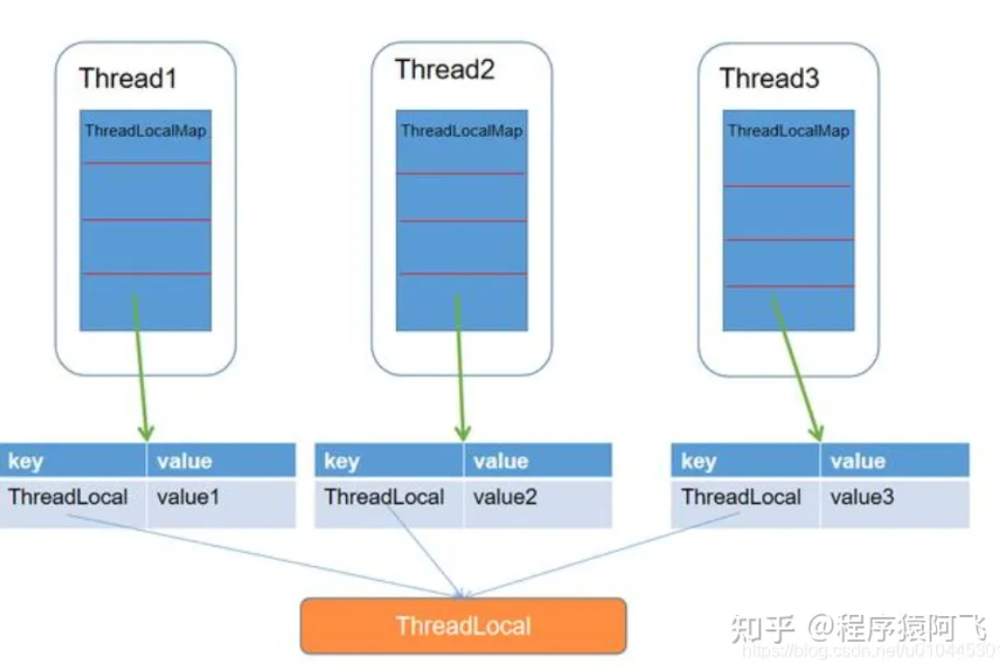

# java

**字节码**：JVM 可以理解的代码就叫做字节码（即扩展名为 `.class` 的文件），它不面向任何特定的处理器，只面向虚拟机。Java 语言通过字节码的方式，在一定程度上解决了传统解释型语言执行效率低的问题，同时又保留了解释型语言可移植的特点。

**JRE、JDK**： JRE 是 Java 运行时环境，仅包含 Java 应用程序的运行时环境和必要的类库。而 JDK 则包含了 JRE，同时还包括了 javac、javadoc、jdb、jconsole、javap 等工具，可以用于 Java 应用程序的开发和调试

 **JIT**：JVM 类加载器首先加载字节码文件，然后通过解释器逐行解释执行，这种方式的执行速度会相对比较慢。 JIT 属于运行时编译。当 JIT 编译器完成第一次编译后，其会将字节码对应的机器码保存下来，下次可以直接使用。

**AOT**： JIT 不同的是，这种编译模式会在程序被执行前就将其编译成机器码，属于静态编译。避免了 JIT 预热等各方面的开销，可以提高 Java 程序的启动速度，避免预热时间长。并且，AOT 还能减少内存占用和增强 Java 程序的安全性（AOT 编译后的代码不容易被反编译和修改），特别适合云原生场景。

AOT 更适合当下的云原生场景，对微服务架构的支持也比较友好。除此之外，AOT 编译无法支持 Java 的一些动态特性，如反射、动态代理、动态加载、JNI（Java Native Interface）等。然而，很多框架和库（如 Spring、CGLIB）都用到了这些特性。

**Java 和 C++ 的区别?**

Java 不提供指针来直接访问内存，程序内存更加安全

Java 的类是单继承的，C++ 支持多重继承；虽然 Java 的类不可以多继承，但是接口可以多继承。

Java 有自动内存管理垃圾回收机制(GC)，不需要程序员手动释放无用内存。

C ++同时支持方法重载和操作符重载，但是 Java 只支持方法重载（操作符重载增加了复杂性，这与 Java 最初的设计思想不符）。

**面向对象和面向过程的区别**

- 面向过程把解决问题的过程拆成一个个方法，通过一个个方法的执行解决问题。
- 面向对象会先抽象出对象，然后用对象执行方法的方式解决问题。

**面向对象三大特征**

封装：把一个对象的状态信息（也就是属性）隐藏在对象内部，不允许外部对象直接访问对象的内部信息。但是可以提供一些可以被外界访问的方法来操作属性。

继承：继承是使用已存在的类的定义作为基础建立新类的技术，新类的定义可以增加新的数据或新的功能，也可以用父类的功能，但不能选择性地继承父类。通过使用继承，可以快速地创建新的类。

多态：一个对象具有多种的状态，具体表现为父类的引用指向子类的实例。

**多态的底层实现**是动态绑定，即在运行时才把方法调用与方法实现关联起来。某个方法被调用时，JVM 首先要查找相应的常量池，得到方法的符号引用，并查找调用类的方法表以确定该方法的直接引用，最后才真正调用该方法

父类和子类相同的方法的符号引用在各自方法表中偏移量是一样的。jvm中类调用方法时，根据方法签名在字符串常量池中确定符号引用，然后先找对象的符号引用类型（也就是父类类型）方法表中该符号引用的偏移量，然后执行对象的实际类型的（也就是子类类型）方法表中相同偏移量的方法。

重载与重写

方法的重载和重写都是实现多态的方式，区别在于前者实现的是编译时的多态性，而后者实现的是运行时的多态性。

- 重载发生在一个类中，同名的方法如果有不同的参数列表（参数类型不同、参数个数不同或者二者都不同）则视为重载；
- 重写发生在子类与父类之间，重写要求子类被重写方法与父类被重写方法有相同的返回类型，比父类被重写方法更好访问，不能比父类被重写方法声明更多的异常（里氏代换原则）。

接口与抽象类

- 接口类（Interface Class）是一种特殊的类，只包含方法的声明而没有方法的实现。它定义了一组方法的规范，由其他类来实现这些方法。
- 抽象类（Abstract Class）也是一种特殊的类，它可以包含方法的声明和方法的实现。但是它不能被实例化，只能被继承。

**深拷贝和浅拷贝**

**浅拷贝**：浅拷贝会在堆上创建一个新的对象（区别于引用拷贝的一点），不过，如果原对象内部的属性是引用类型的话，浅拷贝会直接复制内部对象的引用地址，也就是说拷贝对象和原对象共用同一个内部对象。Student studentC = (Student) studentA.clone();

**深拷贝**：深拷贝会完全复制整个对象，包括这个对象所包含的内部对象。实现上重写clone方法，将引用类型也clone一份重新赋值Student studentC = (Student) studentA.clone();

**引用拷贝**：引用拷贝就是两个不同的引用指向同一个对象。Student studentB = studentA;

**基本类型和包装类型的区别**

基本数据类型的局部变量存放在 Java 虚拟机栈中的局部变量表中，基本数据类型的成员变量（未被 `static` 修饰 ）存放在 Java 虚拟机的堆中。包装类型属于对象类型，我们知道几乎所有对象实例都存在于堆中。

成员变量包装类型不赋值就是 `null` ，而基本类型有默认值且不是 `null`。所有整型包装类对象之间值的比较，全部使用 `equals()` 方法。

**包装类型的缓存机制**

Java 基本数据类型的包装类型的大部分都用到了缓存机制来提升性能。`Byte`,`Short`,`Integer`,`Long` 这 4 种包装类默认创建了数值 **[-128，127]** 的相应类型的缓存数据。`Character` 创建了数值在 **[0,127]** 范围的缓存数据。`Float`,`Double` 并没有实现缓存机制。如果超出对应范围仍然会去创建新的对象。注意==的判断。利用缓存的没有创建新对象。

**== 和 equals()**

基本数据类型`==` 比较的是值。对引用数据类型来说，`==` 比较的是对象的内存地址。**`equals()`** 不能用于判断基本数据类型的变量，只能用来判断两个对象是否相等。

**hashCode** 

`hashCode()` 的作用是获取哈希码（`int` 整数），也称为散列码。这个哈希码的作用是确定该对象在哈希表中的索引位置。重写 equals() 时必须重写 hashCode() 方法.

用到 HashSet 等集合时。存储的对象我们需要用 `hashcode 判断对象是否存在`，如果使用 Object 默认的hashcode方法，那我们同样属性的俩个用户一定是不相等

**静态方法为什么不能调用非静态成员?**

静态方法是属于类的，在类加载的时候就会分配内存，可以通过类名直接访问。而非静态成员属于实例对象，只有在对象实例化之后才存在，需要通过类的实例对象去访问。在类的非静态成员不存在的时候静态方法就已经存在了，此时调用在内存中还不存在的非静态成员，属于非法操作。

**String、StringBuffer、StringBuilder 的区别？**

**线程安全性**：`String` 中的对象是不可变的，也就可以理解为常量，线程安全。`StringBuffer` 对方法加了同步锁或者对调用的方法加了同步锁，所以是线程安全的。`StringBuilder` 并没有对方法进行加同步锁，所以是非线程安全的。

**性能**：每次对 `String` 类型进行改变的时候，都会生成一个新的 `String` 对象，然后将指针指向新的 `String` 对象。`StringBuffer` 每次都会对 `StringBuffer` 对象本身进行操作，而不是生成新的对象并改变对象引用。相同情况下使用 `StringBuilder` 相比使用 `StringBuffer` 仅能获得 10%~15% 左右的性能提升，但却要冒多线程不安全的风险。

字符串对象通过“+”的字符串拼接方式，实际上是通过 `StringBuilder` 调用 `append()` 方法实现的，拼接完成之后调用 `toString()` 得到一个 `String` 对象 。会导致创建过多的 `StringBuilder` 对象。 JDK 9优化就没有这个问题了。

**字符串常量池** 

**字符串常量池** 是 JVM 为了提升性能和减少内存消耗针对字符串（String 类）专门开辟的一块区域，主要目的是为了避免字符串的重复创建。

 **Java 值传递详解**

- **实参（实际参数，Arguments）**：用于传递给函数/方法的参数，必须有确定的值。
- **形参（形式参数，Parameters）**：用于定义函数/方法，接收实参，不需要有确定的值。

- **值传递**：方法接收的是实参值的拷贝，会创建副本。
- **引用传递**：方法接收的直接是实参所引用的对象在堆中的地址，不会创建副本，对形参的修改将影响到实参。

**在 Java 中只有值传递。**

对于引用类型的参数实际上也是值传递，只不过它拷贝创建的副本还是引用类型的地址，操作时改变的是地址的值所以才会影响到实参。

传入两个对象后在函数中交换地址，但主函数中其实并未改变。原因是交换的是副本地址。而不是真实的地址。没有改变地址的内容。

 **Java 序列化详解**

- **序列化**：将数据结构或对象转换成二进制字节流的过程
- **反序列化**：将在序列化过程中所生成的二进制字节流转换成数据结构或者对象的过程

属于OSI 七层协议模型中的表示层。 TCP/IP 四层模型中的应用层。

对于不想进行序列化的变量，使用 `transient` 关键字修饰(只能修饰变量，不能修饰类和方法)。`transient` 关键字的作用是：阻止实例中那些用此关键字修饰的的变量序列化；当对象被反序列化时，被 `transient` 修饰的变量值不会被持久化和恢复。`static` 变量因为不属于任何对象(Object)，所以无论有没有 `transient` 关键字修饰，均不会被序列化

JDK 自带的序列化，只需实现 `java.io.Serializable`接口即可。

序列化号 `serialVersionUID` 属于版本控制的作用。反序列化时，会检查 `serialVersionUID` 是否和当前类的 `serialVersionUID` 一致。serialVersionUID在类中由static修饰。对其做了特殊处理会被序列化到二进制字节流中；在反序列化时，也会解析它并做一致性判断。`serialVersionUID` 只是用来被 JVM 识别，实际并没有被序列化。

**Java 代理模式详解**

使用代理对象来代替对真实对象(real object)的访问，这样就可以在不修改原目标对象的前提下，提供额外的功能操作，扩展目标对象的功能。代理模式有静态代理和动态代理两种实现方式。

静态代理中，我们对目标对象的每个方法的增强都是手动完成的。手动定义代理类，并在代理类中注入代理对象手动调用方法和自己想实现的额外功能。相比于静态代理来说，动态代理更加灵活。我们不需要针对每个目标类都单独创建一个代理类，并且也不需要我们必须实现接口，我们可以直接代理实现类( *CGLIB 动态代理机制*)。

从 JVM 层面来说， 静态代理在编译时就将接口、实现类、代理类这些都变成了一个个实际的 class 文件。动态代理是在运行时动态生成类字节码，并加载到 JVM 中的。

在 Java 动态代理机制中 `InvocationHandler` 接口和 `Proxy` 类是核心。当你使用代理对象调用方法的时候实际会调用到InvocationHandler实现类的invoke方法。可以在 `invoke()` 方法中自定义处理逻辑，比如在方法执行前后做什么事情。

JDK 动态代理有一个最致命的问题是其只能代理实现了接口的类。可以用 CGLIB 动态代理机制来避免。Spring 中的 AOP 模块中：如果目标对象实现了接口，则默认采用 JDK 动态代理，否则采用 CGLIB 动态代理。

~~~java
public class TestJDKProxy {
    public static void main(String[] args) {
        //1.创建原始对象
        //注意：由于后面匿名子类的方法中用到了userService，所以应该用final修饰
        //     而JDK1.8以后默认加了final，不需要手动加
        UserService userService = new UserServiceImpl();

        //2.JDK创建代理对象
        InvocationHandler handler = new InvocationHandler() {
            @Override
            public Object invoke(Object proxy, Method method, Object[] args) throws Throwable {
                System.out.println("----------- JDKProxy log -----------");\
                //目标方法运行：
                Object ret = method.invoke(userService, args);
                return ret;
            }
        };

        UserService userServiceProxy = (UserService) 					Proxy.newProxyInstance(userService.getClass().getClassLoader(), 							userService.getClass().getInterfaces(),handler);

        userServiceProxy.login("海绵宝宝", "1111");
        userServiceProxy.register(new User());

    }
}
public class TestCGlibProxy {
    public static void main(String[] args) {
        //1.创建原始对象
        UserServiceImpl userService = new UserServiceImpl();

        //2.通过CGlib创建代理对象
        //  2.1 创建Enhancer
        Enhancer enhancer = new Enhancer();
        //  2.2 设置借用类加载器
        enhancer.setClassLoader(TestCGlibProxy.class.getClassLoader());
        //  2.3 设置父类（目标类）
        enhancer.setSuperclass(userService.getClass());
        //  2.4 设置回调，额外功能写在里面
        enhancer.setCallback(new MethodInterceptor() {
            //相当于 InvocationHandler --> invoke()
            @Override
            public Object intercept(Object o, Method method, Object[] args, MethodProxy methodProxy) throws Throwable {
                //额外功能：
                System.out.println("========= CGlibProxy log ========");
                //目标方法执行：
                Object ret = method.invoke(userService, args);
                return ret;
            }
        });
        //  2.5 通过Enhancer对象创建代理
        UserServiceImpl service = (UserServiceImpl) enhancer.create();

        //测试：
        service.register();
        service.login();

    }
}
~~~

**BigDecimal 详解**

浮点数的运算会有精度丢失的风险。计算机在表示一个数字时，宽度是有限的，无限循环的小数存储在计算机时，只能被截断，所以就会导致小数精度发生损失的情况。如0.2存储二进制时会发生01循环。`BigDecimal` 可以实现对浮点数的运算，不会造成精度丢失。**浮点数之间的等值判断，基本数据类型不能用 == 来比较，包装数据类型不能用 equals 来判断。**

为了防止精度丢失，推荐使用它的`BigDecimal(String val)`构造方法或者 `BigDecimal.valueOf(double val)` 静态方法来创建对象。`add` 方法用于将两个 `BigDecimal` 对象相加，`subtract` 方法用于将两个 `BigDecimal` 对象相减。`multiply` 方法用于将两个 `BigDecimal` 对象相乘，`divide` 方法用于将两个 `BigDecimal` 对象相除。大小比较使用compareTo，`a.compareTo(b)` : 返回 -1 表示 `a` 小于 `b`，0 表示 `a` 等于 `b` ， 1 表示 `a` 大于 `b`。

**泛型**

我们在向集合中添加元素的过程中add()方法里填入的是Object类，而Object类是所有类的父类，这就产生了一个问题——**添加的类型无法统一**，由此可能产生在遍历集合取出元素时类型不统一而报错。泛型提供了编译时类型安全检测机制，允许在编译时检测到非法的类型。使用泛型参数，可以增强代码的可读性以及稳定性。本质是**参数化类型**。

泛型是提供给javac编译器使用的，用于限定集合的输入类型，让编译器在源代码级别上，避免向集合中插入非法数据。但编译器编译完带有泛型的java程序后，生成的class文件中不再带有泛型信息，以此使程序运行效率不受影响，这个过程称为擦除。

泛型和Object相比优势：Object 有两个痛点：1、得强制转换；2、没有编译器级别的安全校验；

泛型为什么不支持基本类型：因为泛型在没有定义边界的时，进行类型擦除后，原始类型会变成Object，而基本类型不是对象

##**Java 集合**

主要是由两大接口派生而来：一个是 `Collection`接口，主要用于存放单一元素；另一个是 `Map` 接口，主要用于存放键值对。对于`Collection` 接口，下面又有三个主要的子接口：`List`、`Set` 和 `Queue`。

###**ArrayList**

`ArrayList` 的底层是数组队列，相当于动态数组。与 Java 中的数组相比，它的容量能动态增长。在添加大量元素前，应用程序可以使用`ensureCapacity`操作来增加 `ArrayList` 实例的容量。这可以减少递增式再分配的数量。

`public class ArrayList <E> extends AbstractList <E> implementsList <E> ,RandomAccess,Cloneable,java.io.Serializable{}`

**初始化**

底层是一个`Object[] elementData`的空数组。初始化时默认无参构造创建空数组。有参构造创建指定容量数组。或者传入其他集合转换为数组。

**扩容机制**

添加元素时会先保证数组容量充足。具体来说会计算数组所需要的容量。如果当前数组元素为空数组（初始情况），返回默认容量10和最小容量中的较大值作为所需容量。所需容量不足就会触发扩容。将新容量更新为旧容量的1.5倍。然后检查新容量是否大于最小需要容量，若还是小于最小需要容量，那么就把最小需要容量当作数组的新容量。再检查新容量是否超出了ArrayList所定义的最大容量，若超出了，则调用hugeCapacity()来比较minCapacity和 MAX_ARRAY_SIZE，如果minCapacity大于MAX_ARRAY_SIZE，则新容量则为Interger.MAX_VALUE，否则，新容量大小则为 MAX_ARRAY_SIZE。最后Arrays.copyOf将旧数组复制进新数组。

 `System.arraycopy()` 和 `Arrays.copyOf()`方法

`Arrays.copyOf()`内部实际调用了 `System.arraycopy()` 方法。`arraycopy()` 需要目标数组，将原数组拷贝到你自己定义的数组里或者原数组，而且可以选择拷贝的起点和长度以及放入新数组中的位置 `copyOf()` 是系统自动在内部新建一个数组，并返回该数组。

 `ensureCapacity`方法

用户手动扩容的方法。向 `ArrayList` 添加大量元素之前用 `ensureCapacity` 方法，以减少增量重新分配的次数

**删除操作**

需要调用 System.arraycopy() 将 index+1 后面的元素都复制到 index 位置上，在旧数 组上操作，该操作的时间复杂度为 O(N)，可以看到 ArrayList 删除元素的代价是非常高的

### LinkedList

`LinkedList` 是一个基于双向链表实现的集合类。

`public class LinkedList <E> extends AbstractSequentialList <E> implementsList <E> List<E>, Deque<E>, Cloneable, java.io.Serializable{}`

**初始化**

有空参初始化。带集合类型参数的初始化，将传入的集合添加到空双向链表中。

**插入元素**

当依据序号插入元素时，需要先移动到指定位置。移动平均 n/2 个元素，时间复杂度为 O(n)。

#### Arraylist 与 LinkedList 区别

- `ArrayList` 和 `LinkedList` 都是不同步的，也就是不保证线程安全；

- `ArrayList` 底层使用的是 **`Object` 数组**；`LinkedList` 底层使用的是 **双向链表** 数据结构

- `ArrayList` 采用数组存储，所以插入和删除元素的时间复杂度受元素位置的影响。 比如：执行`add(E e)`方法的时候， `ArrayList` 会默认在将指定的元素追加到此列表的末尾，这种情况时间复杂度就是 O(1)。但是如果要在指定位置 i 插入和删除元素的话，时间复杂度就为 O(n)。`LinkedList` 采用链表存储，所以在头尾插入或者删除元素不受元素位置的影响时间复杂度为 O(1)，如果是要在指定位置 `i` 插入和删除元素的话， 时间复杂度为 O(n) ，因为需要先移动到指定位置再插入和删除。

- `LinkedList` 不支持高效的随机元素访问，而 `ArrayList`（实现了 `RandomAccess` 接口） 支持。快速随机访问就是通过元素的序号快速获取元素对象(对应于`get(int index)`方法)。
- `ArrayList` 的空间浪费主要体现在在 list 列表的结尾会预留一定的容量空间，而 LinkedList 的空间花费则体现在它的每一个元素都需要消耗比 ArrayList 更多的空间（因为要存放直接后继和直接前驱以及数据）。

### HashMap

HashMap 主要用来存放键值对，它基于哈希表的 Map 接口实现，是常用的 Java 集合之一，是线程不安全的。

JDK1.8 之前 HashMap 底层是 **数组和链表** 结合在一起使用也就是 **链表散列**。

HashMap 通过 key 的 hashCode 经过扰动函数处理过后得到 hash 值，然后通过 `(n - 1) & hash` 判断当前元素存放的位置（这里的 n 指的是数组的长度），如果当前位置存在元素的话，就判断该元素与要存入的元素的 hash 值以及 key 是否相同，如果相同的话，直接覆盖，不相同就通过拉链法解决冲突。

扰动函数？

(h = key.hashCode()) ^ (h >>> 16)；将 hashCode 无符号右移 16 位，高 16bit 和低 16bit 做异或。原因：当数组长度很小，假设是 16，那么 n-1 即为 1111 ，这样的值和 hashCode() 直接做按位与 操作，实际上只使用了哈希值的后 4 位。如果当哈希值的高位变化很大，低位变化很小，就很容易 造成哈希冲突了，所以这里把高低位都利用起来，让高16 位也参与运算，从而解决了这个问题

JDK1.8之后，当链表长度大于阈值（默认为 8）时，会首先调用 `treeifyBin()`方法。这个方法会根据 HashMap 数组来决定是否转换为红黑树。只有当数组长度大于或者等于 64 的情况下，才会执行转换红黑树操作，以减少搜索时间。否则，就是只是执行 `resize()` 方法对数组扩容。

**loadFactor 负载因子**

loadFactor 负载因子是控制数组存放数据的疏密程度，loadFactor 越趋近于 1，那么 数组中存放的数据(entry)也就越多，也就越密，也就是会让链表的长度增加，loadFactor 越小，也就是趋近于 0，数组中存放的数据(entry)也就越少，也就越稀疏。**loadFactor 太大导致查找元素效率低，太小导致数组的利用率低，存放的数据会很分散。loadFactor 的默认值为 0.75f 是官方给出的一个比较好的临界值**。

给定的默认容量为 16，负载因子为 0.75。Map 在使用过程中不断的往里面存放数据，当数量超过了 16 * 0.75 = 12 就需要将当前 16 的容量进行扩容，而扩容这个过程涉及到 rehash、复制数据等操作，所以非常消耗性能。

**初始化**

四个构造方法中，都初始化了负载因子 loadFactor。HashMap 中没有 capacity 这样的字段，即使指定了初始化容量 initialCapacity ，也只是通过 tableSizeFor 将其扩容到与 initialCapacity 最接近的 2 的幂次方大小，然后暂时赋值给 threshold ，后续通过 resize 方法将 threshold 赋值给 newCap 进行 table 的初始化。

在进行初始化操作时，只是初始化了创建数组的相关参数，并没有真正创建动态数组。真正动态数组的创建是在第一次进行数据写入时引发的。是一种懒加载操作，防止了初始化后而不用的内存浪费。

**put 方法**

通过hash发现要放入的元素的数组位置为null，则直接把该元素放在这里即可

如果定位到的数组位置有元素就和要插入的 key 比较，如果 key 相同就直接覆盖，如果 key 不相同，就判断 p 是否是一个树节点，如果是就调用`e = ((TreeNode<K,V>)p).putTreeVal(this, tab, hash, key, value)`将元素添加进入。如果不是就遍历链表插入(插入的是链表尾部)。

**数组扩容**

扩容分两步：一是将数组的长度变为原来的两倍。二是将已经hash分布到数组中的所有元素重新计算hash值，分配到新的数组中。而数组大小必须是2^n，就可以提升重hash的性能。

HashMap中所用的hash函数：hash=(key == null) ? 0 : (h = key.hashCode()) ^ (h >>> 16)。计算的数字最终要被映射到数组的某个位置tab[i = (n - 1) & hash]。(n-1)为数组中的最大位置，hash为哈希的结果，两者进行了逻辑与操作。与操作之后只能变小，所以与完后一定小于h-1。扩容2倍相当于二进制最高位增加1，与hash相与后处理最高位不一样，其余都与原始n-1计算相同。因此，这样就减少了计算和移动量。

**线程安全问题**

在多线程环境下，多个线程可能同时对HashMap进行修改（添加、删除、修改元素），从而导致不可预期的结果。当多个线程同时执行put操作时，可能会导致键值对的冲突和覆盖。在HashMap的内部实现中，使用了链表或红黑树（Java 8之后）来解决哈希冲突。但在多线程环境下，如果链表节点的next指针被并发修改，可能会导致链表变为环形(JDK7 下)，导致get操作无法正常结束。

### ConcurrentHashMap

线程安全的 HashMap

jdk1.7：`ConcurrnetHashMap` 由很多个分段锁 `Segment` 组合，而每一个 `Segment` 是一个类似于 `HashMap` 的结构，所以每一个 `HashMap` 的内部可以进行扩容。但是 `Segment` 的个数一旦**初始化就不能改变**，默认 `Segment` 的个数是 16 个，你也可以认为 `ConcurrentHashMap` 默认支持最多 16 个线程并发。

jdk1.8：JDK1.8 中的ConcurrentHashMap 选择了与 HashMap 相同的**数组+链表+红黑树**结构；在锁的实现上，抛弃了原有的 Segment 分段锁，采用`CAS + synchronized`实现更加细粒度的锁。将锁的级别控制在了更细粒度的哈希桶数组元素级别，也就是说只需要锁住这个链表头节点（红黑树的根节点），就不会影响其他的哈希桶数组元素的读写，大大提高了并发度。

**初始化**

有参初始化需要设置初始容量、负载因子、并发级别。可以依据并发级别计算划出高于并发级别之上最近的 2的次方值ssize。ssize来确定有几个Segment，是Segment总长度。以及每个Segment的容量。记录 `segmentShift` 偏移量，这个值为【容量 = 2 的 N 次方】中的 N

**put 方法**

###LinkedHashMap

继承自 `HashMap`，并在 `HashMap` 基础上维护一条双向链表，使得具备如下特性:支持遍历时会按照插入顺序有序进行迭代。支持按照元素访问顺序排序,适用于封装 LRU 缓存工具。因为内部使用双向链表维护各个节点，所以遍历时的效率和元素个数成正比，相较于和容量成正比的 HashMap 来说，迭代效率会高很多。

而 `LinkedHashMap` 是在 `HashMap` 的基础上为 bucket 上的每一个节点建立一条双向链表，这就使得转为红黑树的树节点也需要具备双向链表节点的特性，即每一个树节点都需要拥有两个引用存储前驱节点和后继节点的地址

`LinkedHashMap` 定义了排序模式 `accessOrder`(boolean 类型，默认为 false)，访问顺序则为 true，插入顺序则为 false。

**get 方法**

若accessOrder为true，则调用afterNodeAccess将当前元素移到链表末尾。

**remove 方法**

`LinkedHashMap` 并没有对 `remove` 方法进行重写，而是直接继承 `HashMap` 的 `remove` 方法，为了保证键值对移除后双向链表中的节点也会同步被移除，`LinkedHashMap` 重写了 `HashMap` 的空实现方法 `afterNodeRemoval`。`afterNodeRemoval` 方法的整体操作就是让当前节点 p 和前驱节点、后继节点断开联系，等待 gc 回收

**put 方法**

同样的 `LinkedHashMap` 并没有实现插入方法，而是直接继承 `HashMap` 的所有插入方法交由用户使用，但为了维护双向链表访问的有序性重写 `afterNodeAccess`以及`HashMap` 的 `afterNodeInsertion` 方法，当 `removeEldestEntry` 返回 true 时，会将链表首节点移除。除最老的缓存项(即链表的第一个元素)

重写 `removeEldestEntry` 方法当链表大小超过容量时返回 true，使得每次访问一个元素时，该元素会被移动到链表的末尾。一旦插入操作让 `removeEldestEntry` 返回 true 时，视为缓存已满，`LinkedHashMap` 就会将链表首元素移除，由此我们就能实现一个 LRU 缓存。

#### LinkedHashMap 和 HashMap 遍历性能

`LinkedHashMap` 维护了一个双向链表来记录数据插入的顺序，因此在迭代遍历生成的迭代器的时候，是按照双向链表的路径进行遍历的。这一点相比于 `HashMap` 那种遍历整个 bucket 的方式来说，高效需多。

###CopyOnWriteArrayList

线程安全 `List` 实现。`CopyOnWriteArrayList` 线程安全的核心在于其采用了 **写时复制（Copy-On-Write）** 的策略。当需要修改时，不会直接修改原数组，而是会先创建底层数组的副本，对副本数组进行修改，修改完之后再将修改后的数组赋值回去，这样就可以保证写操作不会影响读操作了。

**初始化**

有一个无参构造函数和两个有参构造函数。创建一个空的 CopyOnWriteArrayList、按照集合的迭代器返回的顺序创建一个包含指定集合元素的 CopyOnWriteArrayList、创建一个包含指定数组的副本的列表

**插入元素**

`add`方法内部用到了 `ReentrantLock` 加锁，保证了同步，避免了多线程写的时候会复制出多个副本出来。锁被修饰保证了锁的内存地址肯定不会被修改，并且，释放锁的逻辑放在 `finally` 中，可以保证锁能被释放。

每次写操作都需要通过 `Arrays.copyOf` 复制底层数组，时间复杂度是 O(n) 的，且会占用额外的内存空间。先创建一个新的数组来容纳新添加的元素，然后在新数组中进行写操作，最后将新数组赋值给底层数组的引用，替换掉旧的数组。

**读取元素**

读取操作时不需要进行同步控制和锁操作，可以保证数据的安全性。不过，`get`方法是弱一致性的，在某些情况下可能读到旧的元素值。

## IO

相关概念： 

- 同步：当前线程要自己进行数据的读写操作（自己去银行取钱）
- 异步：当前线程可以去做其他事情（委托别人拿银行卡到银行取钱，然后给你） 
- 阻塞：在数据没有的情况下，还是要继续等待着读（排队等待） 
- 非阻塞：在数据没有的情况下，会去做其他事情，一旦有了数据再来获取（柜台取款，取个号，然 后坐在椅子上做其它事，等号广播会通知你办理）

Linux 有五种 I/O 模型：阻塞式 I/O 非阻塞式 I/O I/O 复用（select 和 poll） 信号驱动式 I/O（SIGIO） 异步 I/O（AIO）

1. 同步阻塞 I/O ：应用程序发起 read 调用后，会一直阻塞，直到内核把数据拷贝到用户空间。
2. 同步非阻塞 I/O ：应用程序发起read后立刻返回并不断询问。
3. I/O 多路复用 ：线程首先发起 select 调用，询问内核数据是否准备就绪，等内核把数据准备好了，用户线程再发起 read 调用。read 调用的过程（数据从内核空间 -> 用户空间）还是阻塞的。
4. 信号驱动 I/O ：应用程序发起read调用后去做自己的事情，内核准备好数据后发出SIGIO信号通知应用程序已经准备好数据， 应用进程收到之后在信号处理程序中调用 recvfrom 将数据从内核复制到应用进程中。
5. 异步 I/O ：应用程序发起read调用后去做自己的事情，内核将数据从内核空间拷贝到用户空间**后**发起**signal信号**通知应用程序已经准备好数据。

阻塞 和 非阻塞 是指数据就绪前，用户线程的状态。两者都是 同步IO，即数据就绪后，由用户线程负责数据拷贝到用户空间，此时是同步拷贝的。因此是 阻塞同步IO 和 非阻塞同步IO。IO多路复用是在 非阻塞IO 的基础上，原因每次只询问单个数据状态，多路复用 则是询问多个数据状态，即多个数据复用在同一个线程上处理。数据在内核缓冲区就绪后，用户线程依旧是同步IO拷贝的。

**同步**和**异步**主要看请求发起方对消息结果的获取方式，是**主动获取**还是**被动通知**。同步是消息准备好了，仍然是用户线程负责获取，异步则是消息是内核线程处理的，只是告知用户线程消息已经好了。

在Java里面没有这么多IO模式，只有BIO、NIO、AIO。

- **BIO** 表示同步阻塞式通信，服务器实现模式为一个连接一个线程，即客户端有连接请求时服务器端 就需要启动一个线程进行处理，如果这个连接不做任何事情会造成不必要的线程开销，可以通过线程池机制改善

- **NIO** 表示同步非阻塞 IO，服务器实现模式为请求对应一个线程，客户端发送的连接会注册到多路复用器上，多路复用器轮询到连接有 I/O 请求时才启动一个线程进行处理。

- **AIO** 表示异步非阻塞 IO，AIO 引入异步通道的概念，采用了 Proactor 模式，有效的请求才启动线 程，特点是先由操作系统完成后才通知服务端程序启动线程去处理，一般适用于连接数较多且连接 时间较长的应用

各种模型应用场景： 

- BIO 适用于连接数目比较小且固定的架构，该方式对服务器资源要求比较高，并发局限于应用中， 程序简单 
- NIO 适用于连接数目多且连接比较短（轻操作）的架构，如聊天服务器，并发局限于应用中，编程 复杂，JDK 1.4 开始支持 
- AIO 适用于连接数目多且连接比较长（重操作）的架构，如相册服务器，充分调用操作系统参与并 发操作，JDK 1.7 开始支持

**Java 的 NIO 模型对应操作系统的 IO 多路复用模型**，BIO 的操作都是基于流的，而 NIO 的操作都是基于缓存的。提供了几个重要的组件：

- Buffer ：缓冲区，本质是一块可以写入数据、读取数据的内存，底层是一个数组。
- Channel ：通道，数据是从通道读入缓冲区，从缓冲区写入通道中的
- Selector ：多路复用器，能够检查一个或多个 NIO 通道，并确定哪些通道已经准备好进行读取或写入。

~~~java
//文件通道
FileChannel fileChannel = new RandomAccessFile("NIO测试.txt", "rw").getChannel();
//1. 分配一个指定大小的缓冲区
ByteBuffer buffer = ByteBuffer.allocate(1024);
//2. 利用 put() 存入数据到缓冲区中
buffer.put(str.getBytes());
// 将文件中的内容读取到ByteBuffer中
fileChannel.read(buffer);
//3. 切换读取数据模式
buffer.flip();
//4. 利用 get() 读取缓冲区中的数据
byte[] dst = new byte[buffer.limit()];//limit最大操作到哪个下标了
buffer.get(dst);
//5. clear() : 清空缓冲区. 但是缓冲区中的数据依然存在，但是处于“被遗忘”状态
buffer.clear();
~~~

## 并发编程

进程是程序的一次执行过程，是系统运行程序的基本单位。一个进程在其执行的过程中可以产生多个线程。与进程不同的是同类的多个线程共享进程的**堆**和**方法区**资源，但每个线程有自己的**程序计数器**、**虚拟机栈**和**本地方法栈**。

**程序计数器**用于记录当前线程执行的位置，从而当线程被切换回来的时候能够知道该线程上次运行位置。

**虚拟机栈：** 每个 Java 方法在执行之前会创建一个栈帧用于存储局部变量表、操作数栈、常量池引用等信息。从方法调用直至执行完成的过程，就对应着一个栈帧在 Java 虚拟机栈中入栈和出栈的过程。

**本地方法栈：** 和虚拟机栈所发挥的作用非常相似，区别是：**虚拟机栈为虚拟机执行 Java 方法 （也就是字节码）服务，而本地方法栈则为虚拟机使用到的 Native 方法服务。** 在 HotSpot 虚拟机中和 Java 虚拟机栈合二为一。

为了**保证线程中的局部变量不被别的线程访问到**，虚拟机栈和本地方法栈是线程私有的。

**堆和方法区**是所有线程共享的资源，其中堆是进程中最大的一块内存，主要用于存放新创建的对象 (几乎所有对象都在这里分配内存)，方法区主要用于存放已被加载的类信息、常量、静态变量、即时编译器编译后的代码等数据

对于单核 CPU 来说，如果任务是 CPU 密集型的，那么开很多线程会影响效率；如果任务是 IO 密集型的，那么开很多线程会提高效率。

####线程的生命周期和状态

Java 线程在运行的生命周期中的指定时刻只可能处于下面 6 种不同状态的其中一个状态：

- NEW: 初始状态，线程被创建出来但没有被调用 `start()` 。
- RUNNABLE: 运行状态，线程被调用了 `start()`等待运行的状态。
- BLOCKED：阻塞状态，需要等待锁释放。
- WAITING：等待状态，表示该线程需要等待其他线程做出一些特定动作（通知或中断）。
- TIME_WAITING：超时等待状态，可以在指定的时间后自行返回而不是像 WAITING 那样一直等待。
- TERMINATED：终止状态，表示该线程已经运行完毕。

**sleep() 方法和 wait() 方法**

**`sleep()` 方法没有释放锁，而 `wait()` 方法释放了锁** 。wait()被调用后，线程不会自动苏醒，需要别的线程调用同一个对象上的 `notify()`或者 `notifyAll()` 方法。`sleep()` 是 `Thread` 类的静态本地方法，`wait()` 则是 `Object` 类的本地方法。因为wait让获得对象锁的线程实现等待，会自动释放当前线程占有的对象锁。要操作对应的对象（`Object`）而非当前的线程（`Thread`）。

**调用 `start()` 方法方可启动线程并使线程进入就绪状态，直接执行 `run()` 方法的话不会以多线程的方式执行。**

#### volatile

"volatile" 是一个关键字，用来修饰变量，主要用于多线程编程中，用来确保变量的可见性和防止指令重排序。相比于使用锁或者原子类等同步机制，volatile是一种轻量级的同步方式。它不需要上锁，不需要进行线程间的等待和唤醒操作，因此在某些场景下可以提升程序的性能。

JMM中的数据原子操作：

- read（读取）：从主内存读取数据
- load（载入）：将主内存读取到的数据写入工作内存
- use（使用）：从工作内存读取数据来计算
- assign（赋值）：将计算好的值从新赋值到工作内存中
- store（存储）：将工作内存数据写入到主内存
- write（写入）：将store过去的变量值赋值给主内存中的变量
- lock（锁定）：将主内存变量加锁，标识为线程独占状态
- unlock（解锁）：将主内存变量解锁，解锁后其他线程可以锁定该变量

JMM(Java内存模型)操作变量的时候不是直接在主存进行操作的,而是每个线程拥有自己的工作内存,在使用前,将该变量的值copy一份到自己的工作内存,读取时直接读取自己的工作内存中的值.写入操作时,先将修改后的值写入到自己的工作内存,再讲工作内存中的值刷新回主存.

`volatile` 关键字可以保证变量的可见性（线程正在使用对象状态而另一个线程在同时修改该状态，需要确保当一个线程修改了对象状态后，其他线程能够看到发生的状态变化。），如果我们将变量声明为 **`volatile`** ，这就指示 JVM，这个变量是共享且不稳定的，每次使用它都到主存中进行读取。`volatile` 关键字能保证数据的可见性，但不能保证数据的原子性。`synchronized` 关键字两者都能保证。

volatile实现可见性：有volatile修饰的共享变量在进行写操作时的汇编代码是具有lock前缀的指令，lock前缀的指令在多核处理器下会引发两件事：①将当前处理器缓存行的数据写回到系统内存。②处理器将缓存回写到内存的操作会使在其他CPU里缓存了该内存地址的数据无效。
为了提高处理速度，处理器不直接和内存进行通信，而是先将系统内存的数据读到内部缓存后再进行操作，但操作完不知道何时会写回内存。如果对声明了volatile的变量进行写操作，JVM就会向处理器发送一条lock前缀的指令，将这个变量在缓存行的数据写回到系统内存。为了保证各个处理器的缓存是一致的就会实现缓存一致性协议，每个处理器通过嗅探在总线上传播的数据来检查自己缓存的值是不是过期了，当处理器发现自己缓存行对应的内存地址被修改，就会将当前处理器的缓存行设置为无效状态，当处理器对这个数据进行修改操作的时候，会重新从系统内存中把数据读到处理器缓存里。

#### 指令重排

重排序是指编译器和处理器为了优化程序性能而对指令序列进行排序的一种手段。

**禁止指令重排序**

内存屏障：为了实现volatile的内存语义，编译器在生成字节码时，会在指令序列中插入内存屏障来禁止特定类型的处理器重排序。内存屏障有以下三种类型：

- Load屏障（Load Barrier）：确保所有的读操作都发生在Load Barrier之前。
- Store屏障（Store Barrier）：确保所有的写操作都发生在Store Barrier之前。
- Full屏障（Full Barrier）：包括Load屏障和Store屏障的效果，确保了读写操作的顺序性。

#### CAS算法

CAS 的全称是 **Compare And Swap（比较与交换）** ，用于实现乐观锁，被广泛应用于各大框架中。CAS 的思想很简单，就是用一个预期值和要更新的变量值进行比较，两值相等才会进行更新。CAS 是一个原子操作，底层依赖于一条 CPU 的原子指令。CAS 是一种无锁的非阻塞算法的实现。`Java` 中的 `CAS` 操作通常使用 `sun.misc.Unsafe` 类来实现

CAS 涉及到三个操作数：**V**：要更新的变量值，**E**：预期值，**N**：拟写入的新值。当且仅当 V 的值等于 E 时，CAS 通过原子方式用新值 N 来更新 V 的值。如果不等，说明已经有其它线程更新了 V，则当前线程放弃更新。

**ABA 问题**：如果一个变量 V 初次读取的时候是 A 值，并且在准备赋值的时候检查到它仍然是 A 值，在这段时间它的值可能被改为其他值，然后又改回 A，那 CAS 操作就会误认为它从来没有被修改过。这个问题被称为 CAS 操作的 **"ABA"问题。**ABA 问题的解决思路是在变量前面追加上**版本号或者时间戳**。

CAS 经常会用到自旋操作来进行重试，也就是不成功就一直循环执行直到成功。如果长时间不成功，会给 CPU 带来非常大的执行开销。

CAS高效原因：防止获取锁时频繁的上下文切换。CAS适合变量并发访问稍小的情况，大规模并发访问会导致CAS长期处于重试。

#### synchronized

synchronized是Java中的关键字，主要解决的是多个线程之间访问资源的同步性，可以保证被它修饰的方法或者代码块在任意时刻只能有一个线程执行。可以修饰实例方法、静态方法、代码块。

**Monitor**

对象大致可以分为三个部分，分别是对象头，实例变量和填充字节，对象头分成两个部分：MarkWord和 KlassWord。每一个锁都对应一个monitor对象

每个 Java 对象都可以关联一个 Monitor 对象，Monitor 也是 class，其**实例存储在堆中**，如果使用 synchronized 给对象上锁（重量级）之后，该对象的对象头的 Mark Word 中就被设置指向 Monitor 对象的指针，这就是重量级锁。

**工作流程**：

- 开始时 Monitor 中 Owner 为 null，当 Thread-2 执行 synchronized(obj) 就会将 Monitor 的所有者 Owner 置为 Thread-2，Monitor 中只能有一个 Owner，obj 对象的 Mark Word 指向 Monitor，把对象原有的 MarkWord 存入。
- 在 Thread-2 上锁的过程，Thread-3、Thread-4、Thread-5 也执行 synchronized(obj)，就会进入 EntryList BLOCKED（双向链表）
- Thread-2 执行完同步代码块的内容，根据 obj 对象头中 Monitor 地址寻找，设置 Owner 为空， 把线程栈的锁记录中的对象头的值设置回 MarkWord
- 唤醒 EntryList 中等待的线程来竞争锁，竞争是非公平的，如果这时有新的线程想要获取锁，可能 直接就抢占到了，阻塞队列的线程就会继续阻塞
- 以前获得过锁的线程，但条件不满足会进入 WAITING 状态的线程（wait-notify 机制）

`synchronized` 同步语句块的实现使用的是 `monitorenter` 和 `monitorexit` 指令，其中 `monitorenter` 指令指向同步代码块的开始位置，`monitorexit` 指令则指明同步代码块的结束位置。`synchronized` 修饰的方法并没有 `monitorenter` 指令和 `monitorexit` 指令，取得代之的确实是 `ACC_SYNCHRONIZED` 标识，该标识指明了该方法是一个同步方法。

JDK1.6中引入偏向锁和轻量级锁对synchronized进行优化。此时的synchronized一共存在四个状态：无锁状态、偏向锁状态、轻量级锁状态和重量级锁状态。随锁竞争激烈程度，锁的状态会出现一个升级的过程。即可以从偏向锁升级到轻量级锁，再升级到重量级锁。锁升级的过程是单向不可逆的，即一旦升级为重量级锁就不会再出现降级的情况。

**偏向锁**：**在大多数情况下锁不仅不存在多线程竞争关系，而且大多数情况都是被同一线程多次获得**。如果一个线程获得了锁，那么锁就进入偏向模式。当这个线程再次请求锁时，无需再做任何同步操作，即可获取锁的过程。

当锁对象第一次被线程获得的时候进入偏向状态，标记为 101，同时使用 CAS 操作将线程 ID 记录 到 Mark Word。如果 CAS 操作成功，这个线程以后进入这个锁相关的同步块，查看这个线程 ID 是自己的就表示没有竞争，就不需要再进行任何同步操作。当有另外一个线程去尝试获取这个锁对象时，偏向状态就宣告结束。

**轻量级锁**：**对于大部分的锁，在整个同步生命周期内都不存在竞争。**JVM会利用CAS尝试把对象原本的Mark Word 更新为锁记录Lock Record的指针，成功就说明加锁成功

使用轻量级锁时会创建锁记录Lock Record对象，每个线程的栈帧都会包含一个锁记录的结构，存储锁定对象的 Mark Word。锁记录的Object reference 指向锁住的对象。并且使用CAS将Object的MarkWard更改为锁记录地址以及状态00标识轻量级锁。并将原始的MarkWard存入锁记录中。

CAS失败则有两者情况：一、其他线程持有了锁对象，这证明有竞争，执行锁膨胀。二、由于可重入锁的特性，可能是自己线程以及获取了锁，则就添加一条锁记录作为重入的计数。

当退出synchronized(解锁)时，如果有取值为 null 的锁记录，表示有重入，这时重置锁记录，表示重入计数减 1，如果锁记录的值不为 null，这时使用 CAS 将 Mark Word 的值恢复给Object对象头。成功，则解锁成功；失败，说明轻量级锁进行了锁膨胀或已经升级为重量级锁，进入重量级锁解锁流程。

**重量级锁**：存在锁竞争时，轻量级锁会进入锁碰撞变成重量级锁。

当 Thread-1 进行轻量级加锁时，Thread-0 已经对该对象加了轻量级锁。Thread-1 加轻量级锁失败，进入锁膨胀流程：为 Object 对象申请 Monitor 锁，将 Monitor 的 Owner 置为 Thread-0，将 Object 的对象头指向重量级锁地址，然后自己进入 Monitor 的 EntryList BLOCKED。

**锁的优化**

**自旋锁**：基于**在大多数情况下，线程持有锁的时间都不会太长**。操作系统实现线程之间的切换时需要从用户态转换到核心态。自旋锁会假设在不久将来，当前的线程可以获得锁，因此虚拟机会让当前想要获取锁的线程做几个空循环(这也是称为自旋的原因)，不断的尝试获取锁。

**锁消除**：对于被检测出不可能存在竞争的共享数据的锁进行消除，这是 JVM 即时编译器的优化。锁消除主要是通过逃逸分析来支持的。

**锁粗化**：对相同对象多次加锁，导致线程发生多次重入，频繁的加锁操作就会导致性能损耗，可以使用锁粗化方式优化。如果虚拟机探测到一串的操作都对同一个对象加锁，将会把加锁的范围扩展（粗化）到整个操作序列的外部。

**死锁**

Java 死锁产生的四个必要条件： 

1. 互斥条件，即当资源被一个线程使用（占有）时，别的线程不能使用 
2. 不可剥夺条件，资源请求者不能强制从资源占有者手中夺取资源，资源只能由资源占有者主动释放 
3. 请求和保持条件，即当资源请求者在请求其他的资源的同时保持对原有资源的占有 
4. 循环等待条件，即存在一个等待循环队列：p1 要 p2 的资源，p2 要 p1 的资源，形成了一个等待环路

定位死锁：使用 jps 定位进程 id，再用 jstack id 定位死锁，找到死锁的线程去查看源码，解决优化

#### AQS

AQS是抽象队列同步器，它是Java中用于创建同步器的一个抽象基类。AQS使用一个FIFO的等待队列来管理多个线程的竞争和等待，它通过维护一个状态变量来表示同步状态，并提供了一系列的方法来操作状态变量和等待队列，以实现线程的同步和互斥。

AQS 核心思想是，如果被请求的共享资源空闲，则将当前请求资源的线程设置为有效的工作线程，并且将共享资源设置为锁定状态。如果被请求的共享资源被占用，那么就需要一套线程阻塞等待以及被唤醒时锁分配的机制，这个机制 AQS 是基于 **CLH 锁**  实现的。

首节点独占锁，后面的结点排序等候，状态state为0表示初始状态可以占有锁，state=1表示已有线程占有，大于1是重入锁，设置的state和入队都是通过cas保证原子操作。首节点结点状态为signal时释放锁将state置为0且唤醒后续结点，后续结点开始自旋判断state获取锁。

#### ReentrantLock

`ReentrantLock` 实现了 `Lock` 接口，是一个可重入且独占式的锁，和 `synchronized` 关键字类似。更灵活、更强大，增加了轮询、超时、中断、公平锁和非公平锁等高级功能。

`ReentrantLock` 里面有一个内部类 `Sync`，`Sync` 继承 AQS，添加锁和释放锁的大部分操作实际上都是在 `Sync` 中实现的。`Sync` 有公平锁 `FairSync` 和非公平锁 `NonfairSync` 两个子类。默认使用非公平锁。

**公平锁**是指多个线程按照申请锁的顺序来获取锁，线程直接进入同步队列中排队，队列中最先到的线程先获得锁。**非公平锁**是多个线程加锁时每个线程都会先去尝试获取锁，如果刚好获取到锁，那么线程无需等待，直接执行，如果获取不到锁才会被加入同步队列的队尾等待执行。

**原理**：底层通过AQS实现的。

**非公平锁**：lock方法调用CAS方法设置state的值，state=0证明无锁，当前线程可以占据。否则执行acquire(1)。nonfairTryAcquire方法首先调用getState方法获取state的值，如果state的值为0(之前占领锁的线程刚好释放了锁)，那么占据。否则那就调用查看占用锁的线程是不是自己，如果是的话那就直接将state + 1，然后返回true。如果state不为0且锁的所有者又不是自己，那就返回false，然后线程会进入到同步队列中。

**公平锁**：lock方法调用CAS方法设置state的值，state=0证明无锁。此时要先考虑同步队列是否有线程等待，再考虑自己线程。若！=0，则看是否是自己线程的锁，如果是的话那就直接将state + 1，然后返回true。不是就将本线程加入同步队列。

**synchronized 和 ReentrantLock 区别**

两者都是可重入锁，线程可以再次获取自己的内部锁。`synchronized` 是依赖于 JVM 实现的，`ReentrantLock` 是 JDK 层面实现的。相比`synchronized`，`ReentrantLock`增加了一些高级功能。**等待可中断**、**可实现公平锁** 、**可实现选择性通知（锁可以绑定多个条件）**。

- **等待可中断** : `ReentrantLock`提供了一种能够中断等待锁的线程的机制，通过 `lock.lockInterruptibly()` 来实现这个机制。也就是说正在等待的线程可以选择放弃等待，改为处理其他事情。

- **可实现公平锁** : `ReentrantLock`可以指定是公平锁还是非公平锁。而`synchronized`只能是非公平锁。所谓的公平锁就是先等待的线程先获得锁。`ReentrantLock`默认情况是非公平的，可以通过 `ReentrantLock`类的`ReentrantLock(boolean fair)`构造方法来指定是否是公平的。

- **可实现选择性通知（锁可以绑定多个条件）**: `synchronized`关键字与`wait()`和`notify()`/`notifyAll()`方法相结合可以实现等待/通知机制。`ReentrantLock`类当然也可以实现，但是需要借助于`Condition`接口与`newCondition()`方法。

Synchronized适合于并发竞争低的情况，因为Synchronized的锁升级如果最终升级为重量级锁在使用的过程中是没有办法消除的，意味着每次都要和cpu去请求锁资源，而ReentrantLock主要是提供了阻塞的能力，通过在高并发下线程的挂起，来减少竞争，提高并发能力。

#### ThreadLocal

**原理**

每个Thread线程内部都有一个ThreadLocalMap。当第一次调用ThreadLocal的get()或set()方法时，会自动创建并初始化该线程的ThreadLocalMap对象。这个ThreadLocalMap对象是线程的属性。但ThreadLocalMap这个类是ThreadLocal的内部类，没有实现 Map 接口。ThreadLocalMap里面存储线程本地对象ThreadLocal（key）和线程的变量副本（value）。

其ThreadLocalMap中的Entry使用的是K-V方式来组织数据，Entry中key是ThreadLocal对象，且是一个弱引用（弱引用，生命周期只能存活到下次GC前）。

**ThreadLocalMap为什么要用ThreadLocal做key，而不是用Thread做key？**

一个线程中很有可能不只使用了一个ThreadLocal对象。通过Thread对象，无法知道要获取哪个ThreadLocal对象。 

**Entry的key为什么设计成弱引用？**

假如key对ThreadLocal对象的弱引用，改为强引用。ThreadLocal变量生命周期完了，设置成null了，但由于key对ThreadLocal还是强引用。ThreadLocal对象和ThreadLocalMap都将不会被GC回收，于是产生了内存泄露问题。如果key是弱引用，当ThreadLocal变量指向null之后，在GC做垃圾清理的时候，key会被自动回收，其值也被设置成null。

**设计成弱引用就彻底不存在内存泄漏了吗？**

假如ThreadLocalMap中存在很多key为null的Entry，但后面的程序，一直都没有调用过有效的ThreadLocal的get、set或remove方法。 那么，Entry的value值一直都没被清空。其结果就是：Entry和ThreadLocalMap将会长期存在下去，会导致内存泄露。因为只有当其他的ThreadLocal变量，调用了它的get、set或remove，三个方法中的任何一个方法，都会自动触发清理机制，将key为null的value值清空。这样在GC时才会清理这个Entry不会内存泄漏。所以为了防止这样的内存泄漏需要在使用完ThreadLocal对象之后调用一次remove方法。

**hash冲突**

当你在一个线程需要保存多个变量时，需要创建多个ThreadLocal对象防止Key相同造成hash冲突。和HashMap的最大的不同在于，ThreadLocalMap解决Hash冲突的方式就是简单的步长加1或减1及线性探测，寻找下一个相邻的位置。当set方法存储数据时，使用hash方法计算位置，若位置有值会一直探测下一个地址。如果找到最后一个，还是没有找到，则再从头开始找。

**清理**

在探测过程中会复用key为null的脏对象并进行垃圾清理防止内存泄漏。

探测式清理：从当前节点(hash计算的值)开始遍历数组，key==null的将entry置为null，key!=null的对当前元素的key重新hash分配位置，若重新分配的位置上有元素就往后顺延。

启发式清理：从当前节点开始，进行do-while循环检查清理过期key，遇到时会触发探测式清理。结束条件是连续`n`次未发现过期key就跳出循环，n是经过位运算计算得出的，可以简单理解为数组长度的2的多少次幂次。例如：数组长度是16，那么24=16，也就是连续4次没有过期Entry。

在set、get方法中遇到过期key时会触发探测式清理。rehash中会触发探测式清理。set方法最后会执行一次发式清理，在启发式清理中发现过期key会触发探测式清理。

**ThreadLocal是如何扩容的？**

存在一个扩容阈值，为数组长度的2/3.

在set方法最后会进行扩容。扩容开始先触发探测式清理。当清理完成之后现有数组超过3/4阈值则会进扩容。数组扩容为原来的2倍。重新计算key的散列值。重新设置阈值为2/3的新数组值。

**InheritableThreadLocal**

InheritableThreadLocal类可以在子线程中能够正常获取父线程中设置的值。在它的init方法中会将父线程中往ThreadLocal设置的值，拷贝一份到子线程中。

**线程池中如何共享数据？**

使用InheritableThreadLocal不能满足。因为第一次submit任务的时候，该线程池会自动创建一个线程。因为使用了InheritableThreadLocal，所以创建线程时，会调用它的init方法，将父线程中的inheritableThreadLocals数据复制到子线程中。但第二次submit后是复用之前线程，不再调用它的init方法。此时应当使用阿里开源的TransmittableThreadLocal

#### 线程池

线程池就是管理一系列线程的资源池。当有任务要处理时，直接从线程池中获取线程来处理，处理完之后线程并不会立即被销毁，而是等待下一个任务。池化技术的思想主要是为了减少每次获取资源的消耗，提高对资源的利用率。

线程池的参数：核心线程数、最大线程数、存活时间、时间单位、任务队列、线程工厂、拒绝策略

顶级接口Executor提供了一种方式，解耦任务的提交和执行，只定义了一个 execute(Runnable command) 方法用来提交任务，至于具体任务怎么执行则交给他的实现者去自定义实现。ExecutorService 接口继承 Executor，且扩展了生命周期管理的方法、返回 Futrue 的方法、批量提交任务的方法。AbstractExecutorService 抽象类继承 ExecutorService 接口，对 ExecutorService 相关方法提供了默认实现，用FutureTask 包装 Runnable 任务，交给 execute() 方法执行，然后可以从该 FutureTask 阻塞获取执行结果。

ThreadPoolExecutor 继承 AbstractExecutorService，采用池化思想管理一定数量的线程来调度执行提交的任务，且定义了一套线程池的生命周期状态，用一个 ctl 变量来同时保存当前池状态（高3位）和当前池线程数（低29位）。ThreadPoolExecutor 类里的方法大量有同时需要获取或更新池状态和池当前线程数的场景，放一个原子变量里，可以很好的保证数据的一致性以及代码的简洁性。

**通过`ThreadPoolExecutor`构造函数来创建**

~~~java
// 实例化一个线程池
ThreadPoolExecutor executor = new ThreadPoolExecutor(3, 10, 60,
        TimeUnit.SECONDS, new ArrayBlockingQueue<>(20));
// 使用线程池执行一个任务        
executor.execute(() -> {
    // Do something
});
// 关闭线程池,会阻止新任务提交，但不影响已提交的任务
executor.shutdown();
// 关闭线程池，阻止新任务提交，并且中断当前正在运行的线程
executor.showdownNow();

public ThreadPoolExecutor(int corePoolSize,
                              int maximumPoolSize,
                              long keepAliveTime,
                              TimeUnit unit,//时间单位
                              BlockingQueue<Runnable> workQueue,
                              ThreadFactory threadFactory,//线程工厂，用来创建线程，一般默认即可
                              RejectedExecutionHandler handler//拒绝策略，
                               )
//corePoolSize 线程池的核心线程数量,有任务提交到线程池时，如果线程池中的线程数小于corePoolSize,那么则直接创建新的线程来执行任务。
//workQueue 是一个阻塞队列，用于存储来不及执行的任务的队列。当有任务提交到线程池的时候，如果线程池中的线程数大于等于corePoolSize，那么这个任务则会先被放到这个队列中，等待执行。
//maximumPoolSize 线程池的最大线程数,表示线程池支持的最大线程数量。当一个任务提交到线程池时，线程池中的线程数大于corePoolSize,并且workQueue已满，那么则会创建新的线程执行任务，但是线程数要小于等于maximumPoolSize。
//keepAliveTime 线程数大于核心线程数时，多余的空闲线程存活的最长时间
//handler 当线程池中的线程达到maximumPoolSize线程数后且workQueue已满的情况下，再向线程池提交任务则执行对应的拒绝策略
~~~

线程池从诞生到死亡，中间会经历running、shutdown、stop、tidying、terminated五个生命周期状态。

线程池任务流程

**阻塞队列**

- ArrayBlockQueue：由数组结构组成的有界阻塞队列 
- LinkedBlockingQueue：由链表结构组成的无界（默认大小 Integer.MAX_VALUE）的阻塞队列 
- PriorityBlockQueue：支持优先级排序的无界阻塞队列 
- DelayedWorkQueue：使用优先级队列实现的延迟无界阻塞队列 
- SynchronousQueue：不存储元素的阻塞队列，每一个生产线程会阻塞到有一个 put 的线程放入元 素为止 
- LinkedTransferQueue：由链表结构组成的无界阻塞队列 
- LinkedBlockingDeque：由链表结构组成的双向阻塞队列

线程池饱和策略分为一下几种：

1）AbortPolicy：线程池默认的拒绝策略，触发时会抛出 RejectedExecutionException 异常。如果是一些比较重要的业务，可以使用该拒绝策略，在系统不能进一步支持更大并发量的情况下通过抛出异常及时发现问题并进行处理。

2）CallerRunsPolicy：在线程池没关闭的情况下，由调用者线程去处理任务，反之直接丢弃。此拒绝策略追求任务都能被执行，不丢失，比较适合并发量不大并且不允许丢失任务的场景场景，性能较低。

3）DiscardPolicy：丢弃任务，不抛出异常，一般无感知。建议一些无关紧要的任务可以使用此策略。

4）DiscardOldestPolicy：丢弃队列中最老的任务，然后重新提交被拒绝的任务。需要根据业务场景进行选择是否要用。

3、4 这两种拒绝策略都在会在无感知的情况下丢弃任务，需要根据业务场景决定是否要使用。

**Worker 类**

Worker 是ThreadPoolExecutor的内部类，继承AQS，实现的Runnable,所以本身具有锁的特性，又是一个可执行任务。Worker 类内部有线程属性Thread，即为线程池的线程，Runnable类的任务firstTask。

执行线程池 `execute()` 方法提交任务时，如果需要创建一个新的工作线程，则会调用 `addWorker()` 方法，并传递Runnable类的任务绑定给线程。调用 worker对象 中 thread 的 `start()` 方法启动线程。线程的任务是worker对象本身(实现l1的Runnable接口)。

启动任务后，会执行到 Worker 的 `run()` 方法，最终的任务执行逻辑在 `runWorker()` 方法中：执行创建时添加的 `firstTask` 任务或不断调用 `getTask()` 方法从队列拉取任务，获取到任务后先执行 beforeExecute() 钩子函数，再执行任务，然后再执行 afterExecute() 钩子函数。若超时获取不到任务会调用 processWorkerExit() 方法执行 Worker 线程的清理工作。

**ThreadPoolExecutor中的锁**

**mainLock 锁**：ThreadPoolExecutor 内部维护了 ReentrantLock 类型锁 mainLock，在访问 workers 成员变量以及进行相关数据统计（ largestPoolSize、completedTaskCount）时需要获取该重入锁。目的是workers 变量用的 HashSet 是线程不安全的，是不能用于多线程环境的。以及一些数据变量也没有用volatile 修饰，需要保护。

相比于线程安全容器，此处更适合用 lock，主要原因之一就是串行化 interruptIdleWorkers() 方法，避免了不必要的中断风暴。interruptIdleWorkers() 方法在多线程访问下就会发生这种情况。一个线程调用interruptIdleWorkers() 方法对 Worker 进行中断，此时该 Worker 出于中断中状态，此时又来一个线程去中断正在中断中的 Worker 线程，这就是所谓的中断风暴。

 largestPoolSize、completedTaskCount不使用volatile ，为了保证这两个参数的准确性，在获取这两个值时，能保证获取到的一定是修改方法执行完成后的值。如果不加锁，可能在修改方法还没执行完成时，此时来获取该值，获取到的就是修改前的值，然后修改方法一提交，就会造成获取到的数据不准确了。

**Worker 线程锁**：该锁主要是用来维护运行中线程的中断状态。在runWorker() 方法中获取到任务开始执行前，需要先调用 w.lock() 方法，lock() 方法会调用 tryAcquire() 方法，tryAcquire() 实现了一把非重入锁，通过 CAS 实现加锁。interruptIdleWorkers() 方法会中断那些等待获取任务的线程，会调用 w.tryLock() 方法来加锁，如果一个线程已经在执行任务中，那么 tryLock() 就获取锁失败，保证不能中断运行中的线程了。

**execute() 和 submit() 不同**

execute() 无返回值，submit() 有返回值，会返回一个 FutureTask，然后可以调用 get() 方法阻塞获取返回值。Callable接口类似于Runnable，但是Runnable不会返回结果，并且无法抛出返回结果的异常，而Callable功能更强大一些，被线程执行后，可以返回值。

FutureTask 表示一个可以取消的异步运算类。它有启动和取消运算、查询运算是否完成和取回运算结果等方法。只有当运算完成的时候结果才能取回，如果运算尚未完成get方法将会阻塞。一个FutureTask对象可以对调用了Callable和Runnable的对象进行包装，由于FutureTask也是调用了Runnable接口所以它可以提交给Executor来执行。

调用 submit() 方法提交的任务（Runnable or Callable）会被包装成 FutureTask() 对象。FutureTask 类提供了多种任务状态。并且有Callable类的任务以及线程Thread runner。创建 FutureTask 对象时 state 置为 NEW，callable 赋值为我们传入的任务，并设置线程启动。 执行任务，执行成功后会将结果赋值给 outcome。

**优雅关闭线程池**

shuwdown：如果线程正在执行线程池里的任务，即便任务处于阻塞状态，线程也不会被中断，而是继续执行。如果线程池阻塞等待从队列里读取任务，则会被唤醒，但是会继续判断队列是否为空，如果不为空会继续从队列里读取任务，为空则线程退出。

shutdownnow：将线程池的状态设置为STOP，正在执行的任务则被停止，没被执行任务的则返回。

线程池如何进行监控？
①taskCount，线程池需要执行的任务数量。②completedTaskCount，线程池在运行过程中已经完成的任务数量，小于或等于taskCount。③largestPoolSize，线程池里曾经创建过的最大线程数量，通过这个数据可以知道线程池是否曾经满过，如果该数值等于线程池的最大大小表示线程池曾经满过。④getPoolSize，获取线程池的线程数量，如果线程池不销毁的化线程池里的线程不会自动销毁，所以这个数值只增不减。⑤getActiveCount，获取活动的线程数。
通过扩展线程池进行监控，可以继承线程池来自定义，重写线程池的beforeExecute、afterExecute和terminated方法，也可以在任务执行前、执行后和线程池关闭前来执行一些代码进行监控，例如监控任务的平均执行时间、最大执行时间和最小执行时间。

**CPU 密集型任务(N+1)：** 这种任务消耗的主要是 CPU 资源，可以将线程数设置为 N（CPU 核心数）+1。比 CPU 核心数多出来的一个线程是为了防止线程偶发的缺页中断，或者其它原因导致的任务暂停而带来的影响。一旦任务暂停，CPU 就会处于空闲状态，而在这种情况下多出来的一个线程就可以充分利用 CPU 的空闲时间。

**I/O 密集型任务(2N)：** 这种任务应用起来，系统会用大部分的时间来处理 I/O 交互，而线程在处理 I/O 的时间段内不会占用 CPU 来处理，这时就可以将 CPU 交出给其它线程使用。因此在 I/O 密集型任务的应用中，我们可以多配置一些线程，具体的计算方法是 2N。

动态修改线程池参数：对线程池的核心参数实现自定义可配置corePoolSize、maximumPoolSize、workQueue。

根据任务的优先级来执行的线程池

考虑使用 `PriorityBlockingQueue` （优先级阻塞队列）作为任务队列。`PriorityBlockingQueue` 是一个支持优先级的无界阻塞队列，可以看作是线程安全的 `PriorityQueue`，两者底层都是使用小顶堆形式的二叉堆，即值最小的元素优先出队。

## JVM

###内存结构

**虚拟机栈**：每个线程运行时所需要的内存，每个风法被执行时都会在虚拟机栈中船舰一个栈帧。不需要GC

- 局部变量表：存储方法里java基本数据类型及对象引用

- 动态链接：指向运行时常量池的方法引用

- 方法的返回地址：方法正常退出或者异常退出的定义

- 操作数栈：方法执行过程中，依据字节码往栈中写入或者提取数据。

**本地方法栈**：为虚拟机执行本地方法时提供服务的，如JNI，不需要GC

**程序计数器**：内部保存字节码的行号，用于记录正在执行的字节码指令地址，不会存在内存溢出，不进行GC

**堆**：是 JVM 内存中最大的一块，由所有线程共享，由垃圾回收器管理的主要区域，堆中对象大部分都需要考虑线程安全的问题

- 对象实例：类初始化生成的对象，基本数据类型的数组也是对象实例，new 创建对象都使用堆内存

- 字符串常量池：字符串常量池存储的是 String 对象的直接引用或者对象
- 静态变量：是有 static 修饰的变量，属于类的信息
- 线程分配缓冲区：为每个线程在堆内单独分配了一个缓冲区，多线程分配内存 时，使用 TLAB 可以避免线程安全问题，可以提升对象分配的效率。分配内存失败时，JVM 就会通过使用加锁机制确保数据操作的原子性，从而直接在堆中 分配内存

**本地内存**：线程共享的区域，本地内存这块区域是不会受到 JVM 的控制的，不会发生 GC；

**方法区**：用于存储已被虚拟机加载的类信息、常量、即时编译器编译后的代码等数据

- 常量池表：是 Class 文件的一部分，存储了类在编译期间生成的字面量、符号引用，JVM 为每个已加载的类维护一个常量池。字面量：基本数据类型、字符串类型常量、声明为 final 的常量值等；符号引用：类、字段、方法、接口等的符号引用
- 运行时常量池：常量池中的数据会在类加载的加载阶段放入运行时常量池

**内存分配**

如果内存规整，使用指针碰撞（Bump The Pointer）。所有用过的内存在一边，空闲的内存在另 外一边，中间有一个指针作为分界点的指示器，分配内存就仅仅是把指针向空闲那边挪动一段与对 象大小相等的距离 

如果内存不规整，虚拟机需要维护一个空闲列表（Free List）分配。已使用的内存和未使用的内存相互交错，虚拟机维护了一个列表，记录上哪些内存块是可用的，再分配的时候从列表中找到一块 足够大的空间划分给对象实例，并更新列表上的内容

内存分配并发问题：1. 使用线程分配缓冲区，为每个线程在堆内单独分配了一个缓冲区，多线程分配内存 时，使用 TLAB 可以避免线程安全问题。2. CAS+失败重试

**逃逸分析**

~~~java
//逃逸
public static StringBuffer craeteStringBuffer(String s1, String s2) {
    StringBuffer sb = new StringBuffer();
    sb.append(s1);
    sb.append(s2);
    return sb;//发生逃逸
}
public static String createStringBuffer(String s1, String s2) {
    StringBuffer sb = new StringBuffer();
    sb.append(s1);
    sb.append(s2);
    return sb.toString();//不发生逃逸
}
//标量替换
//point不发生逃逸，经过标量替换，point不会直接创建，而是直接使用Point的x，y
public static void main(String[] args) {
   alloc();
}
private static void alloc() {
   Point point = new Point（1,2）;
   System.out.println("point.x="+point.x+"; point.y="+point.y);
}
class Point{
    private int x;
    private int y;
}
//经过变量替换
private static void alloc() {
   int x = 1;
   int y = 2;
   System.out.println("point.x="+x+"; point.y="+y);
}
~~~

通过动态分析对象的作用域，为优化手段如 栈上分配、标量替换和同步消除等提供依据。发生逃逸行为的情况有两种：方法逃逸和线程逃逸。

方法逃逸：当一个对象在方法中定义之后，被外部方法引用。

线程逃逸：如类变量或实例变量，可能被其它线程访问到

如果不存在逃逸行为，则可以对该对象进行如下优化：同步消除、标量替换和栈上分配

**同步消除**：如果确定一个对象不会逃逸出线程，不被其它线程访问到，那对象的读写就不会存在竞争，则可以消除对该对象的同步锁。

**标量替换**：如果逃逸分析发现一个对象不会被外部访问，并且该对象可以被拆散，那么经过优化之后，并 不直接生成该对象，而是将该对象成员变量分解若干个被这个方法使用的成员变量所代替

**栈上分配**：如果一个对象没有逃逸出方法的话，就可能被优化成栈上分配。分配完成后，继续在调用栈内执行，最后线程结束，栈空间被回收，局部变量对象也被回收，这样就无需 GC

### 垃圾回收GC

内存垃圾回收机制主要集中的区域就是线程共享区域：**堆和方法区**

Minor GC：回收新生代，新生代对象存活时间很短，所以 Minor GC 会频繁执行，执行的速度比较快

Full GC：回收老年代和新生代，老年代对象其存活时间长，所以 Full GC 很少执行，执行速度会比 Minor GC 慢很多

**分带**

Java8 时，堆被分为了两份：新生代和老年代（1:2），新生代里有 3 个分区：Eden、To Survivor、From Survivor。在 Java7 时，还存在一个永久代。

工作机制：

- 对象优先在 Eden 分配：当创建一个对象的时候，对象会被分配在新生代的 Eden 区，当 Eden 区 要满了时候，触发 Minor GC
- 当进行 Minor GC后，此时在 Eden 区存活的对象被移动到 to 区，并且当前对象的年龄会加 1，清 空 Eden 区 
- 当再一次触发 Minor GC的时候，会把 Eden 区中存活下来的对象和 to 中的对象，移动到 from 区 中，这些对象的年龄会加 1，清空 Eden 区和 to 区 
- 每次 MinorGC 后From 、From 两个区域名称互换 ，有数据的叫From ，无数据的为To。(上面描述没有换名称)

晋升到老年代：

- 长期存活的对象进入老年代：为对象定义年龄计数器，对象在 Eden 出生并经过 Minor GC 依然存活，将移动到 Survivor 中，年龄就增加 1 岁，增加到一定年龄则移动到老年代中
- 大对象直接进入老年代：需要连续内存空间的对象，最典型的大对象是很长的字符串以及数组；避免在 Eden 和 Survivor 之间的大量复制；经常出现大对象会提前触发 GC 以获取足够的连续空间分配给大对象
- 动态对象年龄判定：如果在 Survivor 区中相同年龄的对象的所有大小之和超过 Survivor 空间的一 半，年龄大于等于该年龄的对象就可以直接进入老年代

空间分配担保：

在发生 Minor GC 之前，虚拟机先检查老年代最大可用的连续空间是否大于新生代所有对象总空 间，如果条件成立的话，那么 Minor GC 可以确认是安全的，如果不成立，虚拟机会查看 HandlePromotionFailure 的值是否允许担保失败，如果允许那么就会 继续检查老年代最大可用的连续空间是否大于历次晋升到老年代对象的平均大小，如果大于将尝试 着进行一次 Minor GC；如果小于或者 HandlePromotionFailure 的值不允许冒险，那么就要进行 一次 Full GC。

触发full gc条件：调用 System.gc()、老年代空间不足、空间分配担保失败。程序执行时并非在所有地方都能停顿下来开始 GC，只有在安全点才能停下。

**垃圾判断**

如果一个或多个对象没有任何的引用指向它了，那么这个对象现在就是垃圾。

强引用：被强引用关联的对象不会被回收，只有所有 GCRoots 都不通过强引用引用该对象，才能被垃圾回收

软引用（SoftReference）：被软引用关联的对象只有在内存不够的情况下才会被回收

弱引用（WeakReference）：被弱引用关联的对象一定会被回收，只能存活到下一次垃圾回收发生 之前

虚引用（PhantomReference）：也称为幽灵引用或者幻影引用，是所有引用类型中最弱的一个，用于跟踪垃圾回收过程，能在这个对象被回收时收到一个系统通知

**引用计数法**：对每个对象保存一个整型的引用计数器属性，用于记录对象被引用的情况。对于一个对象 A，只要有任何一个对象引用了 A，则 A 的引用计数器就加 1；当引用失效 时，引用计数器就减 1；当对象 A 的引用计数器的值为 0，即表示对象A不可能再被使用，可进行回收**。**

缺点： 每次对象被引用时，都需要去更新计数器，有一点时间开销 浪费 CPU 资源，即使内存够用，仍然在运行时进行计数器的统计。 **无法解决循环引用问题，会引发内存泄露**（最大的缺点）

**可达性分析**：以根对象集合（GCRoots）为起始点，从上至下的方式搜索被根对象集合所连接的目标对象。可达性分析算法后，内存中的存活对象都会被根对象集合直接或间接连接着，搜索走过的路径称为引用链。没有连着的就是垃圾对象。

根对象：虚拟机栈中局部变量表中引用的对象、本地方法栈中引用的对象、堆中类静态属性引用的对象、方法区中的常量引用的对象、字符串常量池里的引用、同步锁 synchronized 持有的对象

**三色标记**：三色标记法把遍历对象图过程中遇到的对象，标记成以下三种颜色： 

白色：尚未访问过 

灰色：本对象已访问过，但是本对象引用到的其他对象尚未全部访问 

黑色：本对象已访问过，而且本对象引用到的其他对象也全部访问完成

- 1 初始时，所有对象都在白色集合 ，
- 2 将 GC Roots 直接引用到的对象挪到灰色集合，
- 3 从灰色集合中获取对象： 将本对象引用到的其他对象全部挪到灰色集合中，将本对象挪到黑色集合里面 
- 4 重复步骤 3，直至灰色集合为空时结束 
- 5 结束后，仍在白色集合的对象即为 GC Roots 不可达，可以进行回收

并发标记时，对象间的引用可能发生变化，多标和漏标的情况就有可能发生。多标：A线程断开了引用，但B线程已将标记了灰色(断开后应该是白色)。漏标：A线程断开了引用，标记了白色，但B线程又添加了引用(因为有了引用应当是灰色)。

多标情况下，本该回收的垃圾没有回收，这种垃圾为浮动垃圾，但下一轮垃圾回收就会回收。但漏标将本不该清理的清理了，会影响程序的正确性。

~~~java
//漏标情况举例
Object G = objE.fieldG; // 读，代表原始存在引用
objE.fieldG = null; // 写    断开原始的引用
objD.fieldG = G; // 写		又添加了新的引用
~~~

解决：添加读写屏障。

- 写屏障+增量更新。黑色对象新增引用，会将黑色对象变成灰色对象，最后对该节点重新扫描

- 写屏障+原始快照：：当原来成员变量的引用发生变化之前，记录下原来的引用对象。使用原来的对象关系。但这可能会导致浮点垃圾。

#### 回收算法

**复制算法**

复制算法的核心就是，将原有的内存空间一分为二，每次只用其中的一块，在垃圾回收时，将正在使用 的对象复制到另一个内存空间中，然后将该内存空间清理，交换两个内存的角色，完成垃圾的回收。

优点：简单、快。保证空间连续无碎片。

缺点：只使用内存的一半

**标记清除**

标记清除算法，是将垃圾回收分为两个阶段，分别是标记和清除。第一阶段标记引用对象(和可达分析应用，使用根节点标记)，第二阶段，将无引用的垃圾清除，并将维护空闲链表方便找到空闲空间。

缺点：标记、清除效率不高。产生碎片，需要维护空闲链表。

**标记整理**

清理阶段先将存活对象都向内存另一端移动，然后清理边界以外的垃圾，从而解决了 碎片化的问题。但需要移动大量对象，处理效率低。

**STW**：指在执行垃圾回收的过程冻结所有用户线程的运行，直到垃圾回收线程执行结束。目前主流的虚拟机采用的都是可达性算法，算法的核心是利用根对象作为起始点，根据对象之间的引用关系，即引用链，通过遍历引用链来判断对象的是否存活。然而，可达性分析算法要求全过程都基于一个能保障一致性的快照中才能够进行分析，简单来说，就是必须全程冻结用户线程的运行。

实现上Stop-The-World 需要所有的用户线程处于 SafePoint，这意味着某个用户线程运行到 SafePoint，其它用户线程可能处于不同的状态。SafePoint 就是一个安全点，可以理解为用户线程执行过程中的一些特殊位置。SafePoint 保存了当前线程的 上下文。

所有线程都到达Safepoint，有两种方法：

◉ 抢占式中断(Preemptive Suspension)
JVM会中断所有线程，然后依次检查每个线程中断的位置是否为Safepoint，如果不是则恢复用户线程，让它执行至 Safepoint 再阻塞。

◉ 主动式中断(Voluntary Suspension)
大部分 JVM 实现都是采用主动式中断，需要阻塞用户线程的时候，首先做一个标志，用户线程会主动轮询这个标志位，如果标志位处于就绪状态，就自行中断。

#### 垃圾回收器

新生代收集器：Serial、ParNew、Parallel Scavenge 

老年代收集器：Serial old、Parallel old、CMS

整堆收集器：G1

吞吐量：程序的运行时间占总运行时间的比例（总运行时间 = 程序的运行时间 + 内存回收的时间）

**Serial**

串行垃圾收集器，作用于新生代，是指使用单线程进行垃圾回收，采用复制算法。使用STW机制

 STW 机制：垃圾回收时，只有一个线程在工作，并且 Java 应用中的所有线程都要暂停，等待垃圾回收的完成。

**Serial old**

老年代垃圾回收的串行收集器，内存回收算法使用的是**标记-整理**算法，同样也采用了 串行回收和 STW 机制

**ParNew**

并行垃圾收集器在串行垃圾收集器的基础之上做了改进，采用复制算法，将单线程改为了多线程进行垃圾回收，可以缩短垃圾回收的时间

**Parallel**

Parallel Scavenge 收集器是应用于新生代的并行垃圾回收器，采用复制算法、并行回收和 Stop the World 机制 

Parallel Old 收集器：是一个应用于老年代的并行垃圾回收器，采用**标记-整理**算法

和 ParNew 不同，Parallel Scavenge 收集器的目标是达到一个可控制的吞吐量，也被称为吞吐量优先的垃圾收集器。自适应调节策略也是 Parallel Scavenge 与 ParNew 的一个重要区别。

**CMS**

款并发的、使用**标记-清除**算法、针对老年代的垃圾回收器，最大特点是让垃圾收集线程与用户线程同时工作。CMS 收集器的关注点是尽可能缩短垃圾收集时用户线程的停顿时间。**并发**不是并行。

初始标记：使用 STW 出现短暂停顿，仅标记一下 GC Roots 能直接关联到的对象，速度很快 

并发标记：进行 GC Roots 开始遍历整个对象图，在整个回收过程中耗时最长，不需要 STW，可以 与用户线程并发运行

重新标记：修正并发标记期间因用户程序继续运作而导致标记产生变动的那一部分对象，比初始标记时间长但远比并发标记时间短，需要 STW（不停顿就会一直变化，采用写屏障 + 增量更新来避 免漏标情况） 

**并发**清除：清除标记为可以回收对象，不需要移动存活对象，所以这个阶段可以与用户线程同时并 发的

优点是延迟低，缺点是吞吐量降低，在并发阶段虽然不会导致用户停顿，但是会因为占用了一部分线程而导致应用程序变慢。CMS 收集器无法处理浮动垃圾。

**G1**

应用于新生代和老年代、采用**标记-整理**算法

分区：G1 把堆划分成多个大小相等的独立区域Region，Region仍然区分年轻代和老年代，年轻代依然有 Eden 区和 Survivor 区。但新生代和老年代不再物理隔离，逻辑上连续。不用担心每个代内存是否足 够。

新的区域 Humongous：本身属于老年代区，当出现了一个巨型对象超出了分区容量的一 半，该对象就会进入到该区域。如果一个 H 区装不下一个巨型对象，那么 G1 会寻找连续的 H 分区来存储，为了能找到连续的 H 区，有时候不得不启动 Full GC

**可预测停顿时间**模型：可以指定在 M 毫秒的时间片段内，消耗在 GC 上的时间不得超过 N 毫秒 

- 由于分块的原因，G1 可以只选取部分区域进行内存回收，这样缩小了回收的范围，对于全局停顿情况也能得到较好的控制 

- G1 跟踪各个 Region 里面的垃圾堆积的价值大小（回收所获得的空间大小以及回收所需时 间，通过过去回收的经验获得），在后台维护一个优先列表，每次根据允许的收集时间优先回 收价值最大的 Region，保证了 G1 收集器在有限的时间内可以获取尽可能高的收集效率 

- 相比于 CMS GC，G1 未必能做到 CMS 在最好情况下的延时停顿，但是最差情况要好很多

卡表Card Table是Region的内部结构划分。每个region内部被划分为若干的内存块，被称为card。除了卡表，每个region中都含有一个Remember Set记忆集，记录了其他region里的对象引用(记录谁引用了自己)

记忆集Remember Set好处：解决"跨代引用"。如果是年轻代指向老年代的引用我们不用关心，因为即使Minor GC把年轻代的对象清理掉了，程序依然能正常运行，而且随着引用链的断掉，无法被标记到的老年代对象会被后续的Major GC回收。如果是老年代指向年轻代的引用，那这个引用在Minor GC阶段是不能被回收掉的。那么需要在老年代种找到引用的对象看看是否应该被清除。此时若没有Remember Set需要遍历所有老年代对象，效率低。有了Remember Set一下就找到了。

**回收过程**：

**Young GC**

当所有 eden region 被耗尽无法申请内存时，就会触发一次 Young GC。

- 扫描GCRoots，扫描的直接指向young代的对象，那如果GC Root是直接指向老年代对象的，就不往下扫描了。
- 更新Rset。更新RSet记录的时机不是伴随着引用更改马上发生的。每当老年代引用新生代对象时，这个引用记录对应的card地先会被放入Dirty Card Queue，原因是如果每次更新引用时直接更新Rset会导致多线程竞争，因为赋值操作很频繁，影响性能。
- 扫描Rset，扫描所有Rset中Old区到young区的引用。到这一步就确定出了young区域那些对象时存活的。如果没有Rset，则需要将GC Root中指向老年代的，完全遍历才能找全新生代。Rset提高了效率。

- 遍历上面的标记栈，将栈内的所有所有的对象移动至Survivor区域

**Young GC+并发标记**

当堆内存使用达到一定值（默认 45%）时，开始老年代并发标记过程，标记完成进行混合回收。G1采用三色标记算法。

- 初始标记：标记从根节点直接可达的对象，这一步伴随着young gc。
- 并发标记：从GC Roots开始对堆中对象进行可达性分析，找出各个region的存活对象信息。会计算每个区域的对象活性，即区域中存活对象的比例，若区域中的所有对象都是垃圾，则这个区域会被立即回收
- 最终标记：为了修正在并发标记期间因用户程序继续运作而导致标记产生变动的那一部分标记记录，虚拟机将这段时间对象变化记录在线程的 Remembered Set Logs 里面，最终标记阶段需要将数据合并到 Remembered Set 中。并行进行。
- 筛选回收：并发清理阶段，首先对 CSet 中各个 Region 中的回收价值和成本进行排序，根据 用户所期望的 GC 停顿时间来制定回收计划

**Mixed GC**

当很多对象晋升到老年代时，为了避免堆内存被耗尽，虚拟机会触发Mixed GC，除了回收整个 young region，还会回收一部分的 old region，过程同 YGC。

**Full GC**

对象内存分配速度过快，Mixed GC 来不及回收，导致老年代被填满，就会触发一次 Full GC，G1 的 Full GC 算法就是单线程执行的垃圾回收

**ZGC**

zgc也是将堆内存划分为一系列的内存分区，称为page。不进行分代。现可**并发**的**标记压缩**算法。与CMS中的ParNew和G1类似，ZGC也采用标记-复制算法，不过ZGC对该算法做了重大改进：ZGC在标记、转移和重定位阶段几乎都是并发的，这是ZGC实现停顿时间STW小于10ms目标的最关键原因。

**染色指针**

三色标记算法中JVM需要给对象打上黑、白、灰色的标记，但是这些标记只与对象的引用有关，与对象本身的其它属性无关。这样的场景下理论上我们只需要为对象的指针打上标记即可，无需在堆内存中为实际的对象打上标记。

染色指针是一种让指针存储额外信息的技术。直接把标记信息记载引用对象的指针上。指针是一种数据类型，用于存储变量的内存地址。一个对象的地址只使用前42位，而第43-46位可以用来存储额外的信息。标记在指针不在对象上这样省去了访问实际对象的过程。

- 染色指针可以使某个 Region 的存活对象被移走之后，这个 Region 立即就能够被释放和重用

- 可以直接从指针中看到引用对象的三色标记状态（Marked0、Marked1）、是否进入了重分配集、是否被移动过（Remapped）、是否只能通过 finalize() 方法才能被访问到
- 可以大幅减少在垃圾收集过程中内存屏障的使用数量，写屏障的目的通常是为了记录对象引用 的变动情况，如果将这些信息直接维护在指针中，显然就可以省去一些专门的记录操作

ZGC采用虚拟内存映射技术，将同一块物理内存映射为Marked 0、Marked 1和Remapped这三个虚拟内存。每个对象在堆上申请虚拟地址时，ZGC为该对象在这三个视图空间分别分配虚拟地址，这三个虚拟地址映射到同一个物理地址。染色指针中，Marked 0、Marked 1和Remapped作为ZGC的三个视图空间，在同一时间点内只能有一个是有效的。通过切换这三个视图空间，ZGC实现了并发的垃圾回收，对象的标记信息和状态可以在不同的视图之间切换，从而实现垃圾回收的并发性。

**读屏障**

读屏障是JVM向应用代码插入一小段代码的技术。当应用线程从堆中读取对象引用时，就会执行这段代码。需要注意的是，仅“从堆中读取对象引用”才会触发这段代码。

ZGC通过着色指针和读屏障技术，解决了转移过程中准确访问对象的问题，实现了并发转移。而在ZGC中，应用线程访问对象将触发“读屏障”，如果发现对象被移动了，那么“读屏障”会把读出来的指针更新到对象的新地址上，这样应用线程始终访问的都是对象的新地址。那么，JVM利用染色指针判断对象是否被移动过。

**ZGC的流程**

- 初始标记：与G1垃圾回收器一样，目的是标记出根对象直接引用的对象。一开始整个内存空间的地址视图被设置为Remapped。经过初始标记，所有GC Roots可达的对象就被标记为了marked1。

- 并发标记： ZGC并发地标记出所有可达的对象，包括从根对象出发的引用链上的对象。一方面将所有活跃的对象地址空间由Remapped变为marked1。另一方面，由于此阶段会遍历所有对象，正好会修复上一次GC时被标记的指针，被标记的视图为marked0。

- 再标记阶段：ZGC会修正并发标记阶段可能由于并发引起的标记不一致。

- 并发转移准备：在这个阶段ZGC进行整堆扫描，确定收集哪些Region，并将这些Region组成重分配集（Relocation Set）。与G1收集器不同，ZGC的重分配集扫描所有的Region，由于染色指针的存在，扫描过程会很快。

- 初始转移阶段：把重分配集中的存活对象复制到新的 Region 上，并为重分配集中的每个 Region 维护一个转发表 ，记录从旧地址到新地址的转向关系。视图切换回remapped

- 并发转移阶段：修正整个堆中指向重分配集中旧对象的所有引用，但是ZGC并不需要马上完成这个操作（因为有指针自愈的特性），ZGC把并发重映射阶段要做的工作巧妙的合并到下一次垃圾收集循环中的并发标记阶段中去完成，这样做的好处是节省遍历对象图的开销。

指针自愈：指针的自愈是指的当访问一个正处于重分配集中的对象时会被读屏障拦截，然后通过转发记录表forwarding table将访问转发到新复制的对象上，并且修正并更新该引用的值，使其直接指向新对象。

### 类加载

Java 对象创建：

- new关键字
- 使用Class类的 newInstance 方法（反射机制）
- 使用 Constructor 类的 newInstance 方法（反射机制）
- 使用 Clone 方法创建对象
- 使用（反）序列化机制创建对象

**对象的创建过程**

1. 类加载检查：虚拟机遇到一条 new 指令时，首先将去检查这个指令的参数是否能在常量池中定位到这个类的符号引用，并且检查这个符号引用代表的类是否已被加载过、解析和初始化过。如果没有，那必须先执行相应的类加载过程。
2. 内存分配：在类加载检查通过后，接下来虚拟机将为新生对象分配内存。分配方式有 “指针碰撞” 和 “空闲列表” 两种，选择哪种分配方式由 Java 堆是否规整决定，而 Java 堆是否规整又由所采用的垃圾收集器是否带有压缩整理功能决定。
3. 初始化零值：内存分配完成后，虚拟机需要将分配到的内存空间都初始化为零值，这保证了对象的实例字段在 Java 代码中可以不赋初始值就直接使用。
4. 设置对象头：初始化零值完成之后，虚拟机要对对象进行必要的设置，保存类的一些信息存放在对象头中。
5. 执行程序的init方法进行实例化：实例变量初始化、实例代码块初始化 、构造函数初始化

一个实例变量在对象初始化的过程中最多会被赋值**4次**

JVM 在为一个对象分配完内存之后，会给每一个实例变量赋予**默认值**，这个实例变量被第一次赋值；在**声明实例变量**的同时对其进行了赋值操作，那么这个实例变量就被第二次赋值；在**实例代码块**中又对变量做了初始化操作，那么这个实例变量就被第三次赋值；；在**构造函数**中也对变量做了初始化操作，那么这个实例变量就被第四次赋值。

初始化的流程是：**父类的类构造器<clinit>() -> 子类的类构造器<clinit>() -> 父类的成员变量和实例代码块 -> 父类的构造函数 -> 子类的成员变量和实例代码块 -> 子类的构造函数。**

目前主流的访问对象的方式有：**使用句柄**、**直接指针**。一个对象包含了3种信息，**对象头**、**实例数据**和**对齐填充**。实例数据部分是对象真正存储的有效信息，也是在程序中所定义的各种类型的字段内容。对齐填充部分不是必然存在的，也没有什么特别的含义，仅仅起占位作用。对象头包括两部分信息，第一部分用于存储对象自身的运行时数据（哈希码、GC 分代年龄、锁状态标志等等），另一部分是类型指针，即对象指向它的类元数据的指针。

####类加载过程

系统加载 Class 类型的文件主要三步：**加载->连接->初始化**。连接过程又可分为三步：**验证->准备->解析**。

**加载**

加载是类加载的其中一个阶段，完成：

- 通过类的完全限定名称获取定义该类的二进制字节流（二进制字节码） 
- 将该字节流表示的静态存储结构转换为方法区的运行时存储结构（Java 类模型） 
- 将字节码文件加载至方法区后，在堆中生成一个代表该类的 Class 对象，作为该类在方法区中的各种数据的访问入口

加载这一步主要是通过我们后面要讲到的 **类加载器** 完成的。类加载器有很多种，当我们想要加载一个类的时候，具体是哪个类加载器加载由 **双亲委派模型** 决定

创建数组类有些特殊，因为数组类本身并不是由类加载器负责创建，而是由 JVM 在运行时根据需要而直接创建的，但数组的元素类型仍然需要依靠类加载器去创建

**验证**

确保 Class 文件的字节流中包含的信息是否符合 JVM 规范，保证被加载类的正确性，不会危害虚拟机自身的安全。验证阶段主要由四个检验阶段组成：

1. 文件格式验证（Class 文件格式检查）
2. 元数据验证（字节码语义检查）
3. 字节码验证（程序语义检查）
4. 符号引用验证（类的正确性检查）

**准备**

准备阶段为静态变量（类变量）分配内存并设置初始值，使用的是方法区的内存。static 变量分配空间和赋值是两个步骤：分配空间在准备阶段完成，赋值在初始化阶段完成。如果 static 变量是 final 的基本类型以及字符串常量，那么编译阶段值（方法区）就确定了，准备 阶段会显式初始化而不是默认初始化。如public static final int value = 123;，value初始化为123而不是0.

**解析**

将常量池中类、接口、字段、方法的符号引用替换为直接引用（内存地址）的过程。

**初始化**

初始化阶段才真正开始执行类中定义的 Java 程序代码，在准备阶段，类变量已经赋过一次系统要求的初始值；在初始化阶段，通过程序制定的计划去初始化类变量和其它资源。

clinit ()：类构造器，由编译器自动收集类中所有类变量的赋值动作和静态语句块中的语句合并产生的 作用：是在类加载过程中的初始化阶段进行静态变量初始化和执行静态代码块

**卸载**

时机：执行了 System.exit() 方法，程序正常执行结束，程序在执行过程中遇到了异常或错误而异常终止，由于操作系统出现错误而导致Java 虚拟机进程终止。卸载类即该类的 Class 对象被 GC

假如一个类还未加载到内存中，那么在创建一个该类的实例时，具体过程是怎样的？

~~~java
public class StaticTest {
    public static void main(String[] args) {
        staticFunction();
    }

    static StaticTest st = new StaticTest();

    static {   //静态代码块
        System.out.println("1");
    }

    {       // 实例代码块
        System.out.println("2");
    }

    StaticTest() {    // 实例构造器
        System.out.println("3");
        System.out.println("a=" + a + ",b=" + b);
    }

    public static void staticFunction() {   // 静态方法
        System.out.println("4");
    }

    int a = 110;    // 实例变量
    static int b = 112;     // 静态变量
}/* Output: 
        2
        3
        a=110,b=0
        1
        4*/
~~~

在加载这个类时，初始化阶段存在static StaticTest st = new StaticTest()，但这个时候类都没有初始化完毕。**实例初始化不一定要在类初始化结束之后才开始初始化。**

类的生命周期是：加载->验证->准备->解析->初始化->使用->卸载，并且只有在准备阶段和初始化阶段才会涉及类变量的初始化和赋值。首先，在类的准备阶段需要做的是为类变量（static变量）分配内存并设置默认值(零值)，因此在该阶段结束后，类变量st将变为null、b变为0。

在类的初始化阶段需要做的是执行类构造器<clinit>()，需要指出的是，类构造器本质上是编译器收集所有静态语句块和类变量的赋值语句按语句在源码中的顺序合并生成类构造器<clinit>()。因此，对上述程序而言，JVM将先执行第一条静态变量的赋值语句：st = new StaticTest();

在同一个类加载器下，一个类型只会被初始化一次。所以，一旦开始初始化一个类型，无论是否完成，后续都不会再重新触发该类型的初始化阶段了。所以执行new StaticTest()时不会执行静态代码段了，因为这是在类初始化该干的事情。所以先执行了实例代码段再执行了构造函数。

执行完后再回到类初始化过程执行static StaticTest st = new StaticTest();后的静态代码块，执行完后进入main方法。

类加载：按照静态代码块静态赋值的顺序执行，在类的准备阶段赋初始值，再初始化阶段赋设定值。若此时实例化先进行实例化过程。然后执行main函数。其中实例化时先执行实例代码块以及实例赋值后执行构造函数。

#### 类加载器

类加载器是 Java 的核心组件，用于加载字节码到 JVM 内存，得到 Class 类的对象。

类加载器是一个负责加载类的对象，用于实现类加载过程中的加载这一步。每个 Java 类都有一个引用指向加载它的 ClassLoader。数组类不是通过 ClassLoader创建的（数组类没有对应的二进制字节流），是由 JVM 直接生成的。

java的加载器可以分为3种：

- 启动类加载器：最顶层的加载类，由 C++实现，通常表示为 null，并且没有父级，主要用来加载 JDK 内部的核心类库
- 扩展加载器：主要负责加载 `%JRE_HOME%/lib/ext` 目录下的 jar 包和类以及被 `java.ext.dirs` 系统变量所指定的路径下的所有类。
- 应用程序类加载器：面向我们用户的加载器，负责加载当前应用 classpath 下的所有 jar 包和类。

除了这三种类加载器之外，用户还可以加入自定义的类加载器来进行拓展，以满足自己的特殊需求。除了 `BootstrapClassLoader` 是 JVM 自身的一部分之外，其他所有的类加载器都是在 JVM 外部实现的，并且全都继承自 `ClassLoader`抽象类。这样做的好处是用户可以自定义类加载器，以便让应用程序自己决定如何去获取所需的类。

**加载模型**

在 JVM 中，对于类加载模型提供了三种，分别为全盘加载、双亲委派、缓存机制

- 全盘加载：当一个类加载器负责加载某个 Class 时，该 Class 所依赖和引用的其他 Class 也将由该类加载器负责载入
- 双亲委派：某个特定的类加载器在接到加载类的请求时，首先将加载任务委托给父加载器，依次递归，如果父加载器可以完成类加载任务，就成功返回；只有当父加载器无法完成此加载任务时，才自己去加载
- 缓存机制：所有加载过的 Class 都会被缓存，当程序中需要使用某个 Class 时，类加载器先 从缓存区中搜寻该 Class

**双亲委派模型**

该模型要求除了顶层的启动类加载器外，其它类加载器都要有父类加载器，这里的父子关系一般通过组合关系来实现，而不是继承关系 

工作过程：一个类加载器首先判断当前类是否被加载过，没有则将类加载请求转发到父类加载器，只有当父类加载器无法完成时才尝试自己加载。

双亲委派机制的优点：

- 可以避免某一个类被重复加载，当父类已经加载后则无需重复加载，保证全局唯一性 
- Java 类随着它的类加载器一起具有一种带有优先级的层次关系，从而使得基础类得到统一 
- 保护程序安全，防止类库的核心 API 被随意篡改

缺点：检查类是否加载的委托过程是单向的，这个方式虽然从结构上看比较清晰，使各 个 ClassLoader 的职责非常明确，但顶层的 ClassLoader 无法访问底层的 ClassLoader 所加载的类

**破坏双亲委派模型**

使用双亲委派也存在一定的局限性，在正常情况下，用户代码是依赖核心类库的，所以按照正常的双亲委派加载流程是没问题的；但是在加载核心类库时，如果需要使用用户代码，双亲委派流程就无法满足；需要一个类加载，但这个类与核心库种的名字一样。加载时会启动类加载器负责加载。所以需要自定义加载，但自定义加载依据双亲委派机制会传递到启动类加载器。这就导致加载失败。

双亲委派的机制是ClassLoader中的loadClass方法实现的，打破双亲委派，其实就是重写这个方法，来用我们自己的方式来实现即可。

### jvm参数调优

对于 JVM 调优，主要就是调整年轻代、老年代、元空间的内存空间大小及使用的垃圾回收器类型

~~~java
//设置堆的初始大小和最大大小，为了防止垃圾收集器在初始大小、最大大小之间收缩堆而产生额外的时间，通常把最大、初始大小设置为相同的值
-Xms：设置堆的初始化大小
-Xmx：设置堆的最大大小
//设置年轻代中 Eden 区和两个 Survivor 区的大小比例。该值如果不设置，则默认比例为 8:1:1。
//增大 Eden 区的大小，来减少 YGC 发生的次数，虽然次数减少了，但 Eden 区满的时候，由于占用的空间较大，导致释放缓慢，此时 STW 的时间较长
-XX:SurvivorRatio
//年轻代和老年代默认比例为 1:2，可以通过调整二者空间大小比率来设置两者的大小。
-XX:newSize 设置年轻代的初始大小
-XX:MaxNewSize 设置年轻代的最大大小， 初始大小和最大大小两个值通常相同
//线程堆栈的设置：每个线程默认会开启 1M 的堆栈，用于存放栈帧、调用参数、局部变量等。通常减少每个线程的堆栈，可以产生更多的线程
-Xss 对每个线程stack大小的调整,-Xss128k
~~~

一般一天超过一次 FullGC 就是有问题，首先通过工具查看是否出现内存泄露，如果出现内存泄露 则调整代码，没有的话则调整 JVM 参数

系统 CPU 持续飙高的话，首先先排查代码问题，如果代码没问题，则咨询运维或者云服务器供应商，通常服务器重启或者服务器迁移即可解决

如果数据查询性能很低下的话，如果系统并发量并没有多少，则应更加关注数据库的相关问题

如果服务器配置还不错，JDK8 开始尽量使用 G1 或者新生代和老年代组合使用并行垃圾回收器