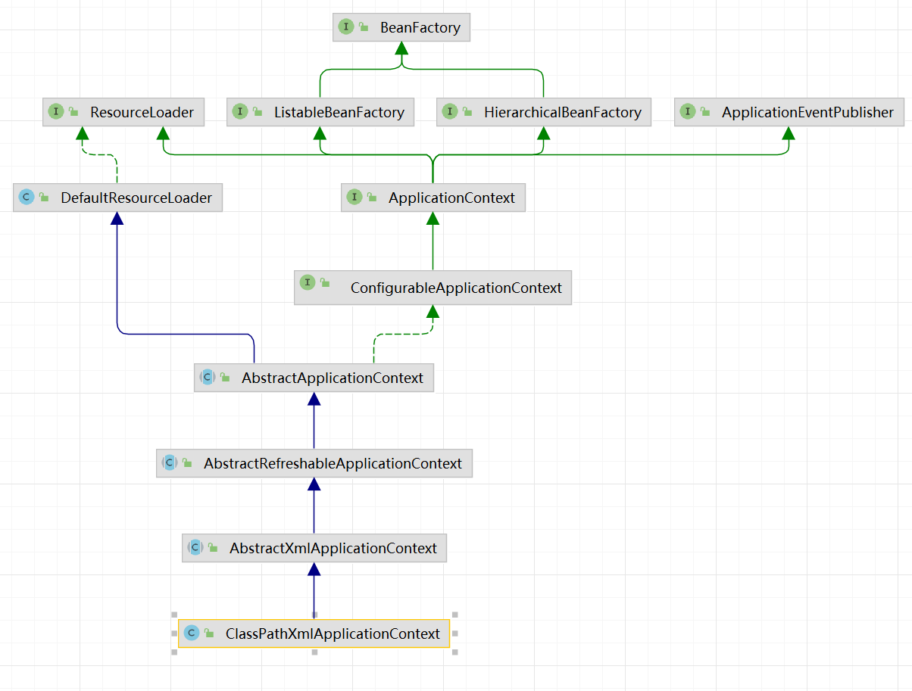
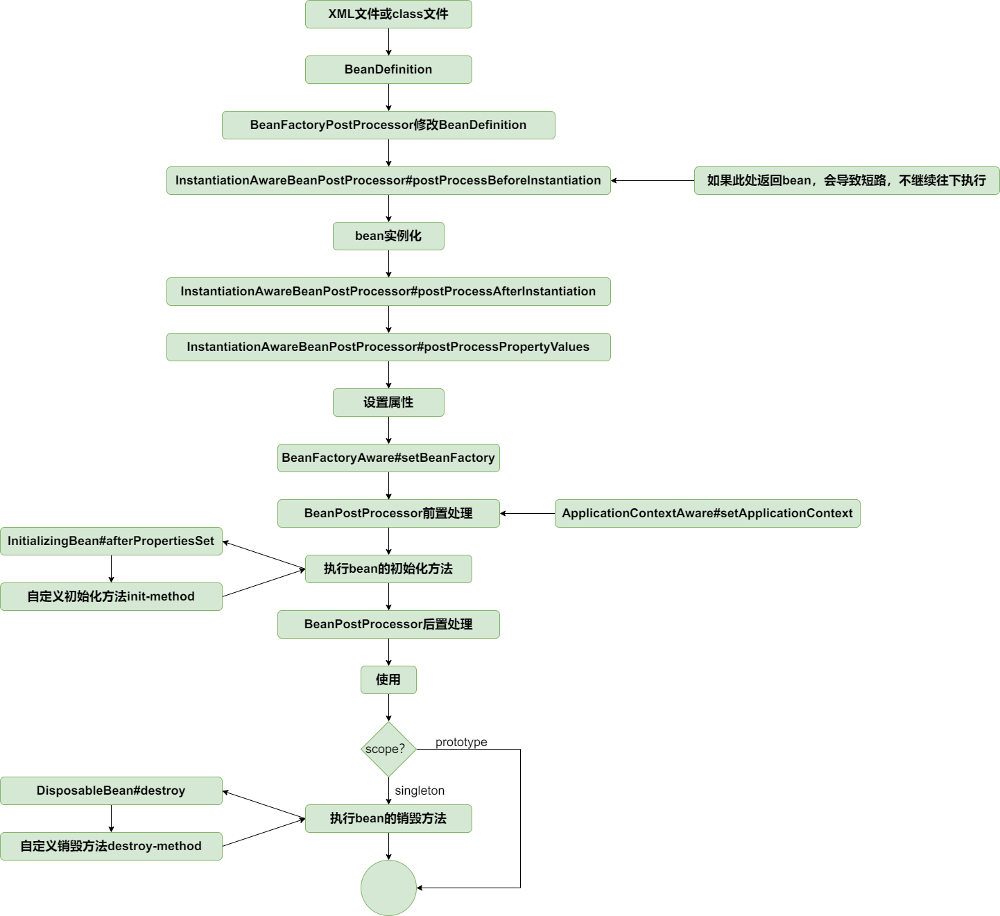
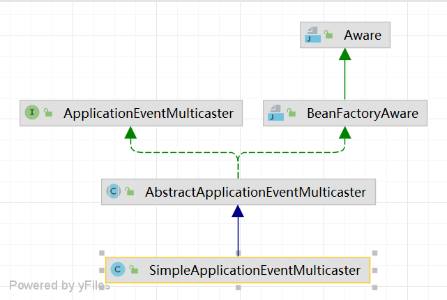
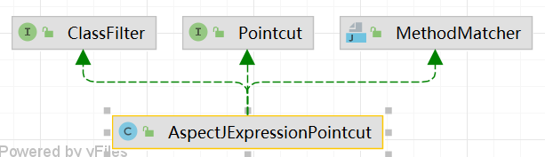

# mini-spring

##IOC

ClassPathXmlApplicationContext

IOC(Inverse of Control，控制反转)是一种软件设计原则，它强调将控制权从应用程序代码中解耦出来。在传统的编程模式中，应用程序代码通常负责创建和管理对象以及控制对象之间的依赖关系。而在IOC中，控制过程被反转，将控制的决策权交给框架或容器来管理，由容器或框架来创建和管理对象，并通过外部配置文件或注解来描述对象之间的依赖关系，使得应用程序的代码更加简洁和灵活。

常见的IOC容器包括Spring等，IOC可以提高代码的可维护性、可扩展性和可测试性，降低代码的耦合度，提高系统的灵活性和可定制性。

**资源解析**

DefaultResourceLoader:处理资源的能力，将负责解析xml配置文件

###**工厂**

BeanFactory：基础接口，定义了getBean、containsBean方法

- ListableBeanFactory：扩展了 返回所有bean的name方法、返回指定类型的所有bean实例

- HierarchicalBeanFactory：空

ApplicationEventPublisher：事件发布接口，定义了发布事件的能力

ApplicationContext：综合的空接口，未添加额外功能

ConfigurableApplicationContext：定义了刷新容器refresh()、关闭应用上下文close()、向虚拟机中注册一个钩子方法registerShutdownHook()的能力。

AbstractApplicationContext：第一个综合的抽象类，在此定义了广播applicationEventMulticaster。refresh()方法在此明确。

AbstractRefreshableApplicationContext：在此定义了beanFactory工厂字段。实现了refresh()方法中的refreshBeanFactory() 方法。AbstractRefreshableApplicationContext实现了refreshBeanFactory中的loadBeanDefinitions，实现从xml中读取BeanDefinition。

**工厂创建流程**

输入xml的地址后，由refresh()方法进行整个流程。

BeanDefinition：用来描述或定义一个被Spring容器所创建、管理和维护的Bean（也就是对象）。包含了类名、作用域（Singleton、Prototype等）、生命周期、回调方法如初始化方法和销毁方法）、依赖关系、属性值。通常由BeanFactory接口的实现类（如XmlBeanFactory、AnnotationConfigApplicationContext等）根据配置文件或其他方式来解析和创建。

####创建bean工厂

**refreshBeanFactory()**：先new一个工厂类后，loadBeanDefinitions将xml文件解析获得，解析的核心在doLoadBeanDefinitions方法中，将xml中的字符转换为beandefinition并进行注册到new的工厂类的Map<String, BeanDefinition>中去。

####添加ApplicationContextAwareProcessor类的BeanPostProcessor

目的是将实例化后的bean设置ApplicationContext。

####invokeBeanFactoryPostProcessors

在**bean**实例化之前，执行BeanFactoryPostProcessor。修改BeanDefinition

#### 扩展初始化

**registerBeanPostProcessors(beanFactory)**，注册BeanPostProcessors。注册的BeanPostProcessors在xml文件中会进行定义。解析过程中registerBeanPostProcessors会将其加入整个流程。

**initApplicationEventMulticaster()**初始化事件发布者。主要是添加applicationEventMulticaster。用于事件的广播和监听。它充当了事件发布者和事件监听者之间的中介角色。主要职责是将事件发布给所有对应的事件监听器，并将事件广播到所有匹配的监听器上。它提供了注册事件监听器、添加事件监听器、删除事件监听器等方法。

**registerListeners()**注册事件监听器。

**finishBeanFactoryInitialization(beanFactory)**。注册类型转换器和提前实例化单例bean。

####finishRefresh

定义ContextRefreshedEvent事件并通过事件发布者发布出去。

### getbean()

在从工厂中获得实例对象时通过工厂的getbean()方法。对于单例对象在refresh过程中提前实例化单例bean。这个过程也是通过getbean完成的。

在单例bean中存在三级缓存。当缓存中有需要的bean实例时，直接获取并返回，无需其他步骤。缓存本质上是一个HashMap。若是缓存中没有则需要直获取beanDefinition进行创建。

创建前先检查有没有InstantiationAwareBeanPostProcessor类的扩展，如果**bean**需要代理，直接返回代理对象。没有就执行**doCreateBean**。

doCreateBean通过反射的newInstance()方法创建对象，如果是单例模式，将实例化**bean**存储进第三级**SingletonFactory**缓存。执行BeanPostProcessorsBefore的扩展，再为bean填充属性后执行初始化方法，和**BeanPostProcessor**的前置和后置处理方法。

**三级缓存解决循环依赖**

三级缓存：singletonFactories、earlySingletonObjects和singletonObjects(一级缓存)

A依赖B，B又依赖A的情况会循环直至栈溢出。

由此开来这个循环依赖是在设置属性值时发生的。A需要设置B，B又需要设置A。则将A在实例化后就提前放进容器缓存里，这样就可以使得B需要A时可以获得A。但对于代理对象则不能解决。因为它需要提前暴露代理对象的引用，而不是暴露实例化后的bean的引用。

getBean()时依次检查一级缓存singletonObjects、二级缓存earlySingletonObjects和三级缓存singletonFactories中是否包含该bean。如果三级缓存中包含该bean，则挪至二级缓存中，然后直接返回该bean。最后将代理bean放进一级缓存singletonObjects

所以在一开始A和B会都进第三级缓存singletonFactories。在B引用A时会将A提升至二级缓存earlySingletonObjects。B初始化完成，从三级缓存singletonObjectFactory直接put到一级缓存singletonObject。A成功得到B，A完成初始化动作，从二级缓存中移入一级缓存。

在存在代理对象时，A创建原始对象到第三级缓存，在*BeanPostProcessor*后置处理中生成代理对象并存储进第一级缓存并删除第三级缓存的对象。但存在循环依赖时，创建B需要从第三级缓存获取A，在获取原始A后会执行getEarlyBeanReference获得代理对象A并放到二级缓存中。

为什么需要第二级缓存

使得存在代理时获得的代理对象是相同的。因为在第三级缓存中的getObject()方法会产生新的代理对象，每次生成新的。但存在二级过度，会不再调用getObject保证代理对象的唯一。

### 容器事件和事件监听器

ApplicationContext容器提供了完善的事件发布和事件监听功能。

AbstractApplicationContext包含其实事件发布现类实例作为其属性。refresh方法中，会实例化ApplicationEventMulticaster、注册监听器并发布容器刷新事件

BeanFactoryAware：提供setBeanFactory方法，使其可以感知BeanFactory。

ApplicationEventMulticaster：添加/移除监听者，multicastEvent遍历监听者若对事件感兴趣就相应该事件。发布事件就是调用广播的multicastEvent方法。返回监听者的onApplicationEvent方法的具体响应。

## AOP

AOP（Aspect-Oriented Programming）是一种编程范式，面向切面编程。把我们程序重复的代码抽取出来，在需要执行的时候使用动态代理技术在不修改源码的基础上，对我们的已有方法进行增强。

Joinpoint(连接点):所谓连接点是指那些被拦截到的点。在 spring 中,这些点指的是方法,因为 spring 只支持方法类型的连接点。

Pointcut(切入点):所谓切入点是指我们要对哪些 Joinpoint 进行拦截的定义。

Advice(通知/增强):所谓通知是指拦截到 Joinpoint 之后所要做的事情就是通知

Weaving(织入):是指把增强应用到目标对象来创建新的代理对象的过程。spring 采用动态代理织入，而 AspectJ 采用编译期织入和类装载期织入。

Aspect(切面):是切入点和通知（引介）的结合。

### 切点表达式

ClassFilter提供类匹配，MethodMatcher提供方法匹配，Pointcut得到前面两个类

静态代理是在编译时期就已经确定代理类的代码，代理类和实际对象实现同样的接口，并在代理类中持有一个实际对象的引用。通过代理类可以在方法调用前后进行额外的处理。静态代理的缺点是代理类和实际对象的接口需要一致，当实际对象的接口发生变化时，代理类需要同步更新。

动态代理是在运行时通过反射机制动态生成代理类的代码，代理类实现了实际对象的接口，并持有一个实际对象的引用。通过动态代理，可以在方法调用前后动态的添加、修改或删除方法的行为。动态代理的优点是不需要提前确定代理类的代码，在运行时可以动态决定代理类的行为。缺点是由于使用了反射机制，相对于静态代理而言，动态代理的性能较低。

###基于jdk动态代理

JdkDynamicAopProxy是动态代理类，在执行原始方法时会调用JdkDynamicAopProxy中的invoke方法。

在此方法中存在字段AdvisedSupport advised，提供了操作和管理 Advice 和 Advisor 的能力。Advice 表示 Aspect 在特定的 Join point 采取的操作。Advisor 持有 Advice。advised中设置了原始类、advisor。advisor又包含了execution表达式以及拦截器methodInterceptor。

invoke中会在DefaultAdvisorChainFactory中寻找方法的拦截器链。在此类中的方法里会提取advised中的advisor，利用其中的PointcutAdvisor来判断此时的方法是否符合当前对象，如果匹配就返回所有设置的拦截器methodInterceptor。在这里就是AfterReturningAdviceInterceptor类的拦截器。将拦截器统一封装成ReflectiveMethodInvocation并执行执行拦截器链。

执行拦截器链时使用新封装类的proceed() 方法，在此方法中不断调用链中单个拦截器的invoke方法。invoke方法又会回调新包装类的proceed() 方法。这样使得方法先执行，执行完后再执行拦截器内的afterReturning方法进行后置增强。

### 基于CGLIB的动态代理

基于CGLIB的动态代理是指利用CGLIB库动态生成代理类。与基于JDK动态代理不同的是，CGLIB不需要目标对象实现接口，而是通过继承目标对象的方式进行代理。

JDK动态代理是通过重写被代理对象实现的接口中的方法来实现，而CGLIB是通过继承被代理对象来实现，和JDK动态代理需要实现指定接口一样，CGLIB也要求代理对象必须要实现MethodInterceptor接口，并重写其唯一的方法intercept。

###属性注入@Value和@Autowired

注解@Value和@Autowired通过BeanPostProcessor处理。InstantiationAwareBeanPostProcessor增加postProcessPropertyValues方法，在bean实例化之后设置属性之前执行

### 类型转换

创建ConversionService的FactoryBean——ConversionServiceFactoryBean。

类型转换的时机有两个：

- 为bean填充属性时，见AbstractAutowireCapableBeanFactory#applyPropertyValues
- 处理@Value注解时，见AutowiredAnnotationBeanPostProcessor#postProcessPropertyValues

在进行转换时先获取conversionService用于转换。

conversionService中canConvert(sourceType, targetType)来判断是否又对应类型的转换器。如果有则转换，并通过反射设置属性
