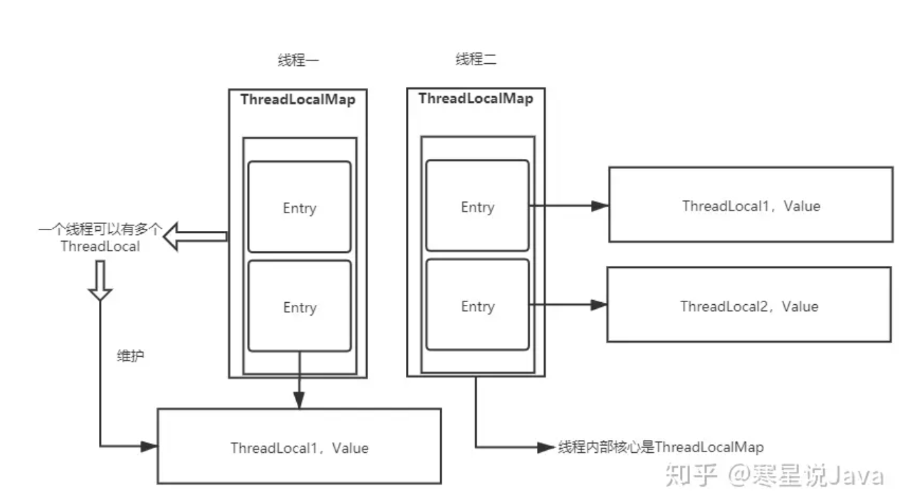

# 技术派

## 库表设计

### 功能

#### 登录权限设计

用户名-密码登录

微信公众号登录

登录成功生成session与cookie，经sessionId保存进cookie。

**表格设计**

需要用户名、密码、主键ID

是否删除、注册时间、最后修改时间

**权限设计**

普通用户：阅读、评论、点赞、关注、

管理员：文章的删除更新审核

#### 用户设计

用户ID、昵称、头像、个人简介、用户权限、公司、职务、Ip信息、主键ID

是否删除、注册时间、最后修改时间

#### 用户关系

关注与被关注

作者用户ID、关注人的ID、状态(未关注、关注、取消关注)、主键ID

是否删除、最后修改时间

#### 用户轨迹信息

阅读历史、关注列表、收藏列表、评价、

用户ID、文档ID、文档类型(文章/评论)、发布者ID、收藏状态、阅读状态、点赞状态、评论状态、

注册时间、最后修改时间

#### 文章

许多业务不需要文章本身，只需要标题信息，此外需要对文章进行版本管理。

表格1

发布者ID、文章ID、文章类型(博文/问答)、标题、摘要、来源(原创/转载/翻译)、原文链接、置顶标志、官方标志、加精标志、状态(发布/未发布)、主键ID

是否删除、注册时间、最后修改时间

表格2

文章ID、文章内容、版本号、主键ID

是否删除、注册时间、最后修改时间

#### 文章标签

一个文章对应多个标签。

标签表

标签名称、标签类型(系统、自定义)、类目ID、主键ID

是否删除、注册时间、最后修改时间

文章标签对应表

文章ID、标签、

是否删除、注册时间、最后修改时间

#### 专栏

专栏ID、发布者ID、专栏简述、封面、状态(审核、连载、完结)、类型(免费、收费、限时免费)、限时免费开始时间、结束时间、排序

注册时间、最后修改时间

专栏文章表

专栏ID、文章ID、章节顺序、主键ID

注册时间、最后修改时间

#### 评论

先查出顶级评论(一级评论)、再查询以顶级评论为父评论的回复(二级评论)、再以二级评论构建三级评论

文章ID、用户ID、评论内容、顶级评论ID、父评论ID、

是否删除、注册时间、最后修改时间

## 注解

###@Slf4j

代替private static final Logger logger = LoggerFactory.getLogger(this.XXX.class); 使用log日志的功能，在idea中的控制台中打印的日志信息。在类上加入注解后可以使用logger.trace

### @Aspect

加在类上定义切面。里面可以定义切入点和通知

###@Pointcut

定义切点，可以使用切入点表达式。@Pointcut("execution(* com.lxk.spring.aop.annotation.PersonDaoImpl.*(..))")。将其定义在空方法上。通知注解中引入这个方法来表明范围

###@annotation

@annotation表示标注了某个注解的所有方法。可以使用@Pointcut("@annotation(MdcDot) || @within(MdcDot)"),范围就是又@MdcDot注解的方法以及MdcDot类。within(类型表达式)：目标对象target的类型是否和within中指定的类型匹配

### @MapperScan

为了避免每个DAO接口上都使用@Mapper标识，使用MapperScan指定扫描的接口位置。

### @RequestParam

服务端的接口变量名可能和前端不一致使用@RequestParam(”XXX)指明

###@PathVariable

将URL中的占位符参数绑定到控制器的处理方法的参数上

~~~java
@RequestMapping("/getUserById/{name}")
public User getUser(@PathVariable("name") String name)
~~~

### @EventListener

注解在方法上，使得方法成为一个监听者，监听对应的事件

### @Async

@Async注解可以使被修饰的方法成为异步方法

### @PostConstruct

Java jdk提供的注解，而不是Spring，当依赖注入完成后用于执行初始化的方法，并且只会被执行一次。相当于init方法。

## AOP

###MdcAspect

Signature是 Java反射 API 中的一个接口，用于描述方法或构造函数的签名信息。Spring AOP 中的 JoinPoint 接口继承了反射 API 中的 Member 接口，因此可以通过 JoinPoint 对象获取到方法或构造函数的 Signature 对象。该切面的目的是为代理对象添加唯一标识traceId

## MyBatis-Plus

与表格对应的实体类XXXDO

XXXMapper实现BaseMapper完成CURD, 其中存在一些BaseMapper没有的方法进行定义并实现。实现方法：通过注解，直接写。建立Mapper的xml文件实现。

XXXDAO是数据访问层，对数据的增删改查，不涉及业务逻辑，只是按条件获得指定数据。继承ServiceImpl，会调用XXXMapper中的方法。其中使用条件构造器完成数据的复杂筛选。

XXXDTO，是对业务处理后的数据的封装，

### 条件构造器

~~~java
public List<TagDTO> listOnlineTag(String key, PageParam pageParam) {
    LambdaQueryWrapper<TagDO> query = Wrappers.lambdaQuery();
    query.eq(TagDO::getStatus, PushStatusEnum.ONLINE.getCode())
        .eq(TagDO::getDeleted, YesOrNoEnum.NO.getCode())
        .and(StringUtils.isNotBlank(key), v -> v.like(TagDO::getTagName, key))
        .orderByDesc(TagDO::getId);
    if (pageParam != null) {
        query.last(PageParam.getLimitSql(pageParam));
    }
    List<TagDO> list = baseMapper.selectList(query);
    return ArticleConverter.toDtoList(list);
}

~~~

### 请求参数

根据用户的HTTP请求，创建一个ServletRequest对象，再controller层，参数用HttpServletRequest request，相当于把前端的请求内容包装了起来，得到具体参数使用request.getParameter("XXX");这种方式适用于GET方法，对于POST方法，一般是json格式，具体参数再请求体中，无法使用getParameter获得。

服务端的接口变量名可能和前端不一致使用@RequestParam(”XXX)指明。此时接收参数直接写对应参数。(@RequestParam("id")String id）

## 服务

### 初始化

####WebMvcConfigurer

提供很多自定义的拦截器、全局异常处理、

**拦截器**globalViewInterceptor

### 动态配置刷新

environment代表了环境配置，其中getPropertySources方法得到环境中的MutablePropertySources类的属性，其中包含了List<PropertySource>. PropertySource代表了spring中对于键值属性的一种抽象，是name和source。source是任意对象。

将配置保存进数据库中，并使用Map来存储配置。首选从数据库中查询所有配置并且以k-v形式存储进Map中。将配置封装为MapPropertySource类型添加到environment中。创建DynamicConfigBinder对象将@ConfigurationProperties修饰的bean进行绑定。

### 过滤器

ReqRecordFilter任务如下

请求参数构建

添加traceId、写入最近一次请求事件(本次)、创建reqInfo请求上下文，携带用户身份等信息、初始化登录信息，将会寻找cookie中的登录信息并加载进reqInfo、通过请求IP更新UV/PV计数。

跨域问题处理

跨域问题是指客户端向服务端发送跨域请求时，浏览器会发出警告或者直接阻止请求的情况。跨域指的是在不同的域名、端口号或协议下进行数据交互的情况。

解决：使用Node.js代理。在本地创建虚拟服务器对对外面端口的请求进行代理。例如前端应用使用5173端口访问后端服务8080端口。对5173端口的请求进行代理，将其转发到8080端口。

### 登录功能

#### 微信登录

首先登录二维码是静态的，就是公众号的二维码。点击登录按钮后，前端执行*new EventSource(url)*以GET方法调用subscribe建立长连接。当在公众号输入验证码后，微信服务器会转发到java后端，执行callback。callback中调用login对验证码进行检验，并依据jwt生成sesion存储进cookie。

在生成sesion时，使用jwt。jwt由头部、何在、签证组成。设置加密算法及其密钥、签发人、过期时间、荷载设置为traceid与userid的组合。生成的token存储在redis中，

登录完成后，再次访问会在过滤器阶段进行初始化。在此阶段会查询用户的token。

#### 用户密码登录

依据用户名从数据库中查询user信息。找到密码，进行匹配。匹配完成后返回session。

#### 身份识别

### 异常处理

建立枚举，赋予两个属性code，msg。创建状态类Status，赋予两个属性code，msg

进行全局异常处理有两者方式：

实现HandlerExceptionResolver接口。重写resolveException方法。在方法中处理异常。首先将所有异常信息统一为**Status**格式。对于REST接口请求的异常，将响应内容类型为json并设置相应字段。若普通页面请求的异常返回异常页面。

使用注解@RestControllerAdvice在类上表明异常类，@ExceptionHandler表明处理方法。

### UV/PV统计

### 拦截器

拦截器处理在芳芳的前后都有操作。preHandle在执行方法前进行处理。

在preHandle中进行身份权限校验。若登录更新用户活跃度。若未登录则返回未登录错误。若请求是管理员界面，则重定向到 /admin。若访问的界面是管理员权限界面，若权限不足返回错误。

postHandle是方法执行后再执行。若返回的是modelAndView对象并且存在异常。需要重置ReqInfoContext

### **雪花算法生成主键ID**

全局唯一、单调递增、信息安全，ID不连续。

获得毫秒内的时间。若发生时间回退报异常。

若在同一时间下，产生一个增增序列，限制序列最大值未4095.若超过则阻塞至下一毫秒

若时间不同，证明已经是下一毫秒，则自增序列置0.

机器标识包含5位数据中心ID5位工作节点id

在项目中，提前生成号ID放在队列中，有需要就获取。队列中的数据数量少于阈值时再自动填充。

### **图片相关功能**

### redis

主要功能：作为缓存保存session、各种计数的统计。

**redis管道技术**

单条命令执行时，执行时间=**客户端发送时间+服务器处理和返回时间+一个网络来回的时间**。利用管道技术使得客户端一次发送多条命令，不用逐条等待返回，而是最后一起读取。只需要异常网络请求。

~~~java
add(CountConstants.ARTICLE_STATISTIC_INFO + articleId, CountConstants.READ_COUNT,
                        (connection, key, value) -> connection.hIncrBy(key, value, 1))
//(connection, key, value) -> connection.hIncrBy(key, value, 1)是ThreeConsumer类型的函数实现，
    public PipelineAction add(String key, BiConsumer<RedisConnection, byte[]> conn) {
    run.add(() -> conn.accept(connection, RedisClient.keyBytes(key)));
    return this;
}
 private List<Runnable> run = new ArrayList<>();
//run的列表内是Runnable类型的变量，需要接收函数式接口的参数，参考线程的实现。conn.accept会执行ThreeConsumer类型的函数实现。
~~~

当点击某一篇文章时，增加用户阅读数与文章的被阅读数。并且mysql中也增加。再执行顺序上，先写mysql，再写redis？？？缓存一致性问题

查看时会从缓存中查。

### 异步工具类

### 具体功能

分页参数：创建分页参数类包装pageNum、pageSize、offset、limit

## 面试

### 项目架构

本质上是一种社区，社区角色：读者、作者、管理员

从业务上来说：用户模块、文章模块、评论模块、消息通知

用户：登录、注册、个人中心信息展示、关注

文章：编辑、发布、阅读、点赞、收藏、分类、评论

消息：点赞、关注、等消息

后期优化：本地缓存、redis缓存优化。线程池异步处理、消息队列异步处理、缓存一致性

### JWT

JWT通常由三部分组成: 头信息（header）, 消息体（payload）和签名（signature）。头信息指定了该JWT使用的签名算法和Token的类型。消息体是有效负载，其中包含声明。声明是关于实体(通常是用户)和其他数据的语句。签名是对头信息和消息体进行加密生成的，用于验证令牌的真实性和完整性，加密时包含一个存储在服务端的secret，相当于密码，在验证阶段时会检验这个密码。jwt是明文的

**实现**

~~~java
//注册
//第一步生成token
String token = 
    JWT.create()
    .withIssuer(jwtProperties.getIssuer())
    .withExpiresAt(new Date(System.currentTimeMillis() + jwtProperties.getExpire()))//指定令牌过期时间
    .withPayload(session)//session在项目中是唯一编号和用户名的字典
    .sign(algorithm);//签名
//第一步将token存入cookie中
response.addCookie(SessionUtil.newCookie(LoginService.SESSION_KEY, session));
//初次登录
//依据用户名查询用户得到DB中的密码与输入的密码进行匹配，匹配通过即登录成功

//自动登录
//在过滤器中检测cookie中是否存在token。存在获取进行检验
 //对给定的会话令牌进行验证，验证的流程包括校验令牌的签名、有效期等
DecodedJWT decodedJWT = verifier.verify(session);
//对编码的Payload可以进行解码
 String pay = new String(Base64Utils.decodeFromString(decodedJWT.getPayload())); 
~~~

**优点**

简单且易于使用：JWT是一种基于标准化的轻量级身份验证和授权协议，使用简单且易于理解。

无状态性：由于JWT是无状态的，在服务器端不需要存储任何会话相关的信息。所有必要的信息都包含在JWT本身中，使得服务器端的负担更轻。

安全性：JWT使用了数字签名机制来验证数据的完整性和真实性，使得通过JWT认证的请求的源头可以被可靠地验证。这样有效地防止了数据被篡改或伪造。

**与session的比较**

传统的session形式需要将session信息存储进服务端，并保存cookie。这种方式增加服务器开销；扩展性偏差，因为保存进服务端需要下次请求还要对这个服务端，对分布式应用不友好，安全性低，会受到CSRF攻击。

如果jwt被劫持，需要及时注销。但可以通过减小令牌的有效时间来加强安全性。

###ThreadLocal

基于 ThreadLocal 在登录校验拦截器中封装线程隔离的全局上下文，以便在线程内部存储用户信息，减少用户信息的数据库查询次数。

ThreadLocal 类用来提供线程内部的局部变量，这种变量在多线程环境下访问时能保证各个线程的变量相对独立于其他线程内的变量

线程安全，每次请求都在一个线程中完成，恰好threadlocal保存的信息属于每个线程所独有，threadlocal保存的信息其实是和每个线程绑定的，完全避免了变量共享带来的线程安全问题
减少参数传递，本次请求的任何方法不管是controller还是service层，又或者是dao层都可以使用threadlocal来获取用户相关的信息。

**原理**

每个Thread线程内部都有一个ThreadLocalMap。当第一次调用ThreadLocal的get()或set()方法时，会自动创建并初始化该线程的ThreadLocalMap对象。这个ThreadLocalMap对象是线程的属性。但ThreadLocalMap这个类是ThreadLocal的内部类，没有实现 Map 接口。ThreadLocalMap里面存储线程本地对象ThreadLocal（key）和线程的变量副本（value）。

其ThreadLocalMap中的Entry使用的是K-V方式来组织数据，Entry中key是ThreadLocal对象，且是一个弱引用（弱引用，生命周期只能存活到下次GC前）。

**ThreadLocalMap为什么要用ThreadLocal做key，而不是用Thread做key？**

一个线程中很有可能不只使用了一个ThreadLocal对象。通过Thread对象，无法知道要获取哪个ThreadLocal对象。 

**Entry的key为什么设计成弱引用？**

假如key对ThreadLocal对象的弱引用，改为强引用。ThreadLocal变量生命周期完了，设置成null了，但由于key对ThreadLocal还是强引用。ThreadLocal对象和ThreadLocalMap都将不会被GC回收，于是产生了内存泄露问题。如果key是弱引用，当ThreadLocal变量指向null之后，在GC做垃圾清理的时候，key会被自动回收，其值也被设置成null。

**设计成弱引用就彻底不存在内存泄漏了吗？**

假如ThreadLocalMap中存在很多key为null的Entry，但后面的程序，一直都没有调用过有效的ThreadLocal的get、set或remove方法。 那么，Entry的value值一直都没被清空。其结果就是：Entry和ThreadLocalMap将会长期存在下去，会导致内存泄露。因为只有当其他的ThreadLocal变量，调用了它的get、set或remove，三个方法中的任何一个方法，都会自动触发清理机制，将key为null的value值清空。这样在GC时才会清理这个Entry不会内存泄漏。所以为了防止这样的内存泄漏需要在使用完ThreadLocal对象之后调用一次remove方法。

**hash冲突**

当你在一个线程需要保存多个变量时，需要创建多个ThreadLocal对象防止Key相同造成hash冲突。和HashMap的最大的不同在于，ThreadLocalMap解决Hash冲突的方式就是简单的步长加1或减1及线性探测，寻找下一个相邻的位置。当set方法存储数据时，使用hash方法计算位置，若位置有值会一直探测下一个地址。如果找到最后一个，还是没有找到，则再从头开始找。

**清理**

在探测过程中会复用key为null的脏对象并进行垃圾清理防止内存泄漏。

探测式清理：从当前节点(hash计算的值)开始遍历数组，key==null的将entry置为null，key!=null的对当前元素的key重新hash分配位置，若重新分配的位置上有元素就往后顺延。

启发式清理：从当前节点开始，进行do-while循环检查清理过期key，遇到时会触发探测式清理。结束条件是连续`n`次未发现过期key就跳出循环，n是经过位运算计算得出的，可以简单理解为数组长度的2的多少次幂次。例如：数组长度是16，那么24=16，也就是连续4次没有过期Entry。

在set、get方法中遇到过期key时会触发探测式清理。rehash中会触发探测式清理。set方法最后会执行一次发式清理，在启发式清理中发现过期key会触发探测式清理。

**ThreadLocal是如何扩容的？**

存在一个扩容阈值，为数组长度的2/3.

在set方法最后会进行扩容。扩容开始先触发探测式清理。当清理完成之后现有数组超过3/4阈值则会进扩容。数组扩容为原来的2倍。重新计算key的散列值。重新设置阈值为2/3的新数组值。

**InheritableThreadLocal**

InheritableThreadLocal类可以在子线程中能够正常获取父线程中设置的值。在它的init方法中会将父线程中往ThreadLocal设置的值，拷贝一份到子线程中。

**线程池中如何共享数据？**

使用InheritableThreadLocal不能满足。因为第一次submit任务的时候，该线程池会自动创建一个线程。因为使用了InheritableThreadLocal，所以创建线程时，会调用它的init方法，将父线程中的inheritableThreadLocals数据复制到子线程中。但第二次submit后是复用之前线程，不再调用它的init方法。此时应当使用阿里开源的TransmittableThreadLocal

### RabbitMQ

将评论、点赞、收藏、系统消息发送到RabbitMQ，实现消息的异步解耦。

**MQ**

MQ(Message Queue)，它是消息队列，是一种FIFO(先进先出)数据结构。消息由生产者发送给MQ中进行排队，然后按照原来顺序交由消息的消费者进行处理。

消息队列的主要特点：异步处理，减小请求的响应时间。应用解耦，发送方与接收方不需要彼此联系影响。流量削锋，防止短时间内流量冲垮，相当于缓冲。日志处理。

消息队列主要包含两种模型：点对点与发布订阅两种模型。

点对点：一个具体的消息只能由一个消费者消费，多个生产者可以向同一个消息队列发送消息，但是一个消息在被一个消息者处理的时候，这个消息在队列上会被锁住或者被移除并且其他消费者无法处理该消息。

发布订阅：单个消息可以被多个订阅

**选型**

选RabbitMQ。erlang语言天生具备高并发的特性，而且他的管理界面用起来十分方便。并且本项目不属于分布式的大项目，相比于单机吞吐量来说更关注时效性。

**原理**

生产者连接servlet建立连接开启信道。生产者声明交换器和队列，设置相关属性并通过路由键将交换器和队列进行绑定。消费者建立连接开启信道便于接收消息。生产者发送消息发送到服务端中的虚拟主机，虚拟主机中的交换器根据路由键选择路由规则发送到不同队列中，订阅了消息队列的消费者可以获取消息进行消费。

RabbitMQ常见的交换器direct、topic、fanout、headers。

direct：处理路由键，需要将一个队列绑定到交换机上，要求该消息与一个特定的路由键完全匹配。

topic：将路由键和某模式进行匹配。此时队列需要绑定要一个模式上。符号“#”匹配一个或多个词，符号“*”只能匹配一个词。、

fanout：不处理路由键。你只需要简单的将队列绑定到交换机上。一个发送到该类型交换机的消息都会被广播到与该交换机绑定的所有队列上。

headers：不处理路由键，而是根据发送的消息内容中的headers属性进行匹配。

channel：信道是生产消费者与rabbit通信的渠道，生产者publish或者消费者消费一个队列都是需要通过信道来通信的。信道是建立在TCP上面的虚拟链接，也就是rabbitMQ在一个TCP上面建立成百上千的信道来达到多个线程处理。

**AMQP协议**

消息（message）被发布者（publisher）发送给交换机（exchange），然后交换机将收到的消息根据路由规则分发给绑定的队列（queue）。最后AMQP代理会将消息投递给订阅了此队列的消费者，或者消费者按照需求自行获取。

**实现**

~~~java
//第一步，创建连接的工厂，并使用工厂包装连接类
ConnectionFactory connectionFactory = new ConnectionFactory();
connection = connectionFactory.newConnection();
//第二步，创建连接池，包装连接池类
private static BlockingQueue<RabbitmqConnection> pool;
//第三步，封装服务类，包含生产者和消费者
//3.1生产者
//创建连接
RabbitmqConnection rabbitmqConnection = RabbitmqConnectionPool.getConnection();
Connection connection = rabbitmqConnection.getConnection();
//创建消息通道
Channel channel = connection.createChannel();
// 声明exchange中的消息为可持久化，不自动删除
channel.exchangeDeclare(exchange, exchangeType, true, false, null);
// 发布消息
channel.basicPublish(exchange, toutingKey, null, message.getBytes());
channel.close();
RabbitmqConnectionPool.returnConnection(rabbitmqConnection);
//3.2消费者
//创建连接
RabbitmqConnection rabbitmqConnection = RabbitmqConnectionPool.getConnection();
Connection connection = rabbitmqConnection.getConnection();
//创建消息信道
final Channel channel = connection.createChannel();
//消息队列
channel.queueDeclare(queueName, true, false, false, null);
//绑定队列到交换机
channel.queueBind(queueName, exchange, routingKey);
//消费的回调函数
Consumer consumer = new DefaultConsumer(channel){@Override public void handleDelivery(){}}
//执行回调
channel.basicConsume(queueName, false, consumer);
channel.close();
RabbitmqConnectionPool.returnConnection(rabbitmqConnection);
//第四步，初始化。设置连接池属性并且执行异步的消费端检测
~~~

**异步发送如何保证可靠性**

 生产者丢失：RabbitMQ提供transaction和confirm模式来确保生产者不丢消息；

transaction机制：发送消息前，开启事务（channel.txSelect()）,然后发送消息，如果发送异常，事务就会回滚（channel.txRollback()）,如果发送成功则提交事务（channel.txCommit()）。缺点：吞吐量下降；

confirm模式：所有在该信道上发布的消息都将会被指派一个唯一的ID（从1开始），一旦消息被投递到所有匹配的队列之后；rabbitMQ就会发送一个ACK给生产者（包含消息的唯一ID），这就使得生产者知道消息已经正确到达目的队列了。失败可以进行重试操作

MQ丢失：消息持久化。处理消息队列丢数据的情况，一般是开启持久化磁盘的配置。消息持久化磁盘后，再给生产者发送一个Ack信号，如果消息持久化磁盘之前，rabbitMQ阵亡了，那么生产者收不到Ack信号，生产者会自动重发。

消费者丢失：消费者丢数据一般是因为采用了自动确认消息模式，改为手动确认消息即可。消费者在收到消息之后，处理消息之前，会自动回复RabbitMQ已收到消息；处理消息失败，就会丢失该消息；解决方案：处理消息成功后，手动回复确认消息。

**如何保证消息不被重复消费？即幂等性**

问题往往因为故障消费端的应答没有传递给消息队列，使得消息队列不知道已经消费过该消息。在写入消息队列的数据做唯一标示，消费消息时，根据唯一标识判断是否消费过；

**如何保证RabbitMQ消息的顺序性？**

拆分多个 queue，每个 queue只对应一个 consumer，让需要顺序的消息放到一个队列让一个消费者消费。缺点：多个消息队列麻烦，吞吐量下降。

一个`queue`但是也只有一个`consumer`，然后这个`consumer`内部用内存队列做排队，然后分发给底层不同的`worker`来处理，让需要顺序的消息放到一个内存队列中

**如何保证高可用的？**

RabbitMQ 有三种模式：单机模式、普通集群模式、镜像集群模式。

普通集群模式：创建的 queue，只会放在一个 RabbitMQ 实例上，但是每个实例都同步 queue 的元数据(配置信息)。消费时如果连接到另一实例，就从相应的queue拉取数据。

镜像集群模式：个 RabbitMQ 节点都有这个 queue 的一个完整镜像，包含 queue 的全部数据的意思。然后每次你写消息到 queue 的时候，都会自动把消息同步到多个实例的 queue 上。

**死信队列**

“死信”是RabbitMQ中的一种消息机制，当你在消费消息时，如果队列里的消息出现以下情况：消息被否定确认、消息在队列的存活时间超过设置的TTL时间、消息队列的消息数量已经超过最大队列长度。那么该消息将成为“死信”。如果配置了死信队列信息，那么该消息将会被丢进死信队列中，如果没有配置，则该消息将会被丢弃。

通过配置死信队列，可以让未正确处理的消息暂存到另一个队列中，待后续排查清楚问题后，编写相应的处理代码来处理死信消息，这样比手工恢复数据要好太多了。

### AOP+TraceID

记录接口的访问跟踪，实现任务的追踪和诊断

AOP 叫做⾯向切⾯编程，他是⼀个编程范式，⽬的就是提⾼代码的模块性。Srping AOP 基于动态代理 的⽅式实现，如果是实现了接⼝的话就会使⽤ JDK 动态代理，反之则使⽤ CGLIB 代理，Spring中 AOP 的应⽤主要体现在 事务、⽇志、异常处理等⽅⾯，通过在代码的前后做⼀些增强处理，可以实现对业务 逻辑的隔离，提高代码的模块化能⼒，同时也是解耦。

**实现**

~~~java
@Component
@Aspect
public class WebLogAspect {
    private final static Logger logger = LoggerFactory.getLogger(WebLogAspect.class);
    @Pointcut("@annotation(WebLog)")
    public void webLog(){}
    @Before("webLog()")
    public void doBefore(JoinPoint joinPoint){
        // 打印请求相关参数
        logger.info("========================= Start ================================");
        // 打印请求入参
        logger.info("===================== 执行doBefore ==================================");
    }
    @After("webLog()")
    public void doAfter() {
        logger.info("================================ End ===================================");
    }
    @Around("webLog()")
    public Object doAround(ProceedingJoinPoint proceedingJoinPoint) throws Throwable {
        //开始时间
        long startTime = System.currentTimeMillis();
        Object result = proceedingJoinPoint.proceed();
        // 执行耗时
        logger.info("Time-Consuming : {} ms", System.currentTimeMillis() - startTime);
        return result;
    }
}
~~~

springboot2.4.2实际测试的顺序是@Around-@Before1-方法-@AfterReturning-@After-@Around

**静态代理与动态代理**

代理模式是一种结构性设计模式，通过代理类为其他对象提供**一种代理以控制对这个对象的访问**。AOP 代理是 AOP 框架中 AOP 的实现，主要分为静态代理和动态代理。静态代理：代理类需要实现被代理类所实现的接口，同时持有被代理类的引用，新增处理逻辑，进行拦截处理，不过方法还是由被代理类的引用所执行。静态代理通常需要由开发人员在编译阶段就定义好，不易于维护。动态代理：不会修改字节码，而是在 JVM 内存中根据目标对象新生成一个 Class 对象，这个对象包含了被代理对象的全部方法，并且在其中进行了增强。

**JDK 动态代理？**

基于接口代理，通过反射机制生成一个实现代理接口的类，在调用具体方法时会调用 InvocationHandler 来处理。JDK 动态代理生成的代理对象需要继承 `Proxy` 这个类，在 Java 中类只能是单继承关系，无法再继承一个代理类，所以只能基于接口代理。需要借助 JDK 的 `java.lang.reflect.Proxy` 来创建代理对象，调用 `Proxy.newProxyInstance(ClassLoader loader, Class<?>[] interfaces, InvocationHandler h)` 方法创建一个代理对象，方法的三个入参分别是Class 类加载器、需要实现的接口、代理对象的处理器。

**CGLIB 动态代理？**

CGLIB 动态代理则是基于类代理（字节码提升），通过 ASM（Java 字节码的操作和分析框架）将被代理类的 class 文件加载进来，修改其字节码生成一个子类。需要借助于 CGLIB 的 `org.springframework.cglib.proxy.Enhancer` 类来创建代理对象，设置以下几个属性：被代理的类、回调接口。

**Spring AOP 自动代理的实现**

Bean 的实例化前和初始化后等生命周期阶段都提供了扩展点，会调用相应的 BeanPostProcessor 处理器对 Bean 进行处理。当我们开启了 AspectJ 自动代理（例如通过 `@EnableAspectJAutoProxy` 注解），则会往 IoC 容器中注册一个 `AbstractAutoProxyCreator` 自动代理对象，该对象实现了几种 BeanPostProcessor，例如在每个 Bean 初始化后会被调用，解析出当前 Spring 上下文中所有的 Advisor（会缓存），如果这个 Bean 需要进行代理，则会通过 JDK 动态代理或者 CGLIB 动态代理创建一个代理对象并返回，所以得到的这个 Bean 实际上是一个代理对象。

### Caffeine

本地缓存提高服务吞吐率，在图片、侧边栏等位置变动少，可以使用缓存

**实现**

~~~java
//第一步定义缓存管理器并在启动类中添加注解@EnableCaching
@Configuration
public class CacheConfig {
    @Bean("caffeineCacheManager")
    public CacheManager cacheManager() {
        CaffeineCacheManager cacheManager = new CaffeineCacheManager();
        cacheManager.setCaffeine(Caffeine.newBuilder()
                // 设置过期时间，写入后五分钟过期
                .expireAfterWrite(5, TimeUnit.MINUTES)
                // 初始化缓存空间大小
                .initialCapacity(100)
                // 最大的缓存条数
                .maximumSize(200)
        );
        return cacheManager;
    }
}
//第二步，在相应的方法上设置注解@Cacheable
~~~

@Cacheable: 缓存存在，则使用缓存；不存在，则执行方法，并将结果塞入缓存 @CacheEvit: 失效缓存 @CachePut: 更新缓存

失效：我使用service的A方法，想调用这个service的缓存B方法，这样是不行的。原因是@Cacheable是由AOP代理实现，生成了带有缓存的代理类。其他类想调用这个类的缓存方法时，会去调用这个代理类的方法，实现缓存功能。但是类内部调用这个方法，就不会去调用代理类的方法，导致缓存失效

**事务**

保存文章、评论、用户信息、

文章写入时使用事务进行保存。添加注解@Transactional就将整个方法开启事务

文章上传时存在图片转存时将外网图片下载并上传oss过程。但这个过程耗时不适合被事务包裹。可以采取编程式事务缩小事务的粒度。

~~~java
transactionTemplate.execute(new TransactionCallback<Long>() {
            @Override
            public Long doInTransaction(TransactionStatus status) {
                articleId = insertArticle(article, content, req.getTagIds());
                log.info("文章发布成功! title={}", req.getTitle()); 
                return articleId;
            }
        });
~~~

**失效场景**：

数据库不支持：MyISAM引擎不支持事务

类的内部访问：不带事务注解的方法A访问了B. B事务不生效。原因是类内部调用不会通过代理方式访问

私有方法：私有方法不能外部访问，只能内部访问

异常不匹配：注解默认处理运行时的异常，只有抛出异常时才会触发事务回滚

多线程：在带注解的方法中额外开启子线程操作数据库不会生效

传播属性

没有被spring管理

### Caffeine+Redis

多级缓存，解决热门数据如首页流媒体专类的吞吐瓶颈

在保存数据时使用@CachePut进行更新本地缓存，方法中更新redis。获取时使用@Cacheable，优先获取本地作为一级缓存。没有时查redis获取二级缓存并且更新一级缓存。若redis不存在则去mysql中查。

更新时先写MySQL再删除Redis

### redis分布式锁

高并发场景下，若redis里没有数据需要查询数据库时，mysql可能受大量用户影响宕机。使用分布式锁，只允许一个用户去获取数据。由于服务是集群化部署，需要分布式锁来保证这一点。

**实现**

~~~java
//实现一，直接在查询数据前进行加锁
//缺点：可能业务执行完锁还未过期。
//相当于set key value EX time NX
Boolean isLockSuccess = redisUtil.setIfAbsent(redisLockKey, null, 90L); 
if (isLockSuccess) { 
    // 加锁成功可以访问数据库 
    article = articleDao.queryArticleDetail(articleId); 
} else { 
    try { 
        // 短暂睡眠，为了让拿到锁的线程有时间访问数据库拿到数据后set进缓存， 
        Thread.sleep(200); 
    } catch (InterruptedException e) {
        e.printStackTrace(); 
    } 
    // 加锁失败采用自旋方式重新拿取数据 
    this.queryDetailArticleInfo(articleId); 
}
//实现二，增加了finally及时删除key解决一中缺点
//缺点：A线程获取锁的时间过期了，B获取了锁。但A执行完后finally中又释放了B的锁
Boolean isLockSuccess = redisUtil.setIfAbsent(redisLockKey, null, 90L); 
if (isLockSuccess) { 
    article = articleDao.queryArticleDetail(articleId); 
} else { 
    try { 
        Thread.sleep(200); 
         this.queryDetailArticleInfo(articleId);
    } catch (InterruptedException e) {
        e.printStackTrace(); 
    } finally{
        //增加了finally及时删除key
        RedisClient.del(redisLockKey);
    }
}
//实现三，加锁时设置value，不再是null，释放锁是判断与加锁时的value是否相同
//缺点：过期时间无法确定
String value = RandomUtil.randomString(6);
Boolean isLockSuccess = redisUtil.setIfAbsent(redisLockKey, value, 90L); 
if (isLockSuccess) { 
    article = articleDao.queryArticleDetail(articleId); 
} else { 
    try { 
        Thread.sleep(200); 
         this.queryDetailArticleInfo(articleId);
    } catch (InterruptedException e) {
        e.printStackTrace(); 
    } finally{
        // 这种先get出value，然后再比较删除；这无法保证原子性，为了保证原子性，采用了lua脚本 
        /* String redisLockValue = RedisClient.getStr(redisLockKey); 
        if (!ObjectUtils.isEmpty(redisLockValue) && StringUtils.equals(value, redisLockValue)) { 			              RedisClient.del(redisLockKey); } */ 
        // 采用lua脚本来进行先判断，再删除；和上面的这种方式相比保证了原子性 
        Long cad = redisLuaUtil.cad("pai_" + redisLockKey, value); 
        log.info("lua 脚本删除结果：" + cad);
    }
}
//实现四，写守护线程，每隔一段时间查看业务是否执行完毕(看门狗技术)
//实现上述技术的实现redission
RLock lock = redissonClient.getLock(redisLockKey);
try{
    //尝试加锁,最大等待时间3秒，上锁30秒自动解锁；时间结合自身而定
    if(lock.tryLock(3,30,TimeUnit.SECONDS)){
        article = articleDao.queryArticleDetail(articleId); 
    }else{
        // 未获得分布式锁线程睡眠一下；然后再去获取数据
        Thread.sleep(200); 
        this.queryDetailArticleInfo(articleId);
    }
}catch (InterruptedException e) {
        e.printStackTrace(); 
} finally{
    //判断该lock是否已经锁 并且锁是否是自己的 
    if (lock.isLocked() && lock.isHeldByCurrentThread()) { 
        lock.unlock(); 
    }
}
~~~

### 写文章图片异步转存

通过复制粘贴即可将非同源的图片下载并上传至 OSS 实现智能化转链，并借助线程池和异步任务提升系统的高并发能力；

markdown在的图片格式为的字符串。使用正则表达式匹配整个文章寻找图片链接并下载。一张图片是直接保存，多张图片进行异步并发转存。并且借助本地缓存，对于一些相同的网址不用重复上传

**实现**

~~~java
//第一步，将地址URL转换为一个InputStream对象
//网络图片
Request request = Request.Get(uri);
httpResponse = request.execute().returnResponse();
InputStream re =  httpResponse.getEntity().getContent();
//本地
Files.newInputStream(path);
//第二步，上传服务器需要获得文件类型。优先判断网址后缀，没有后缀则提取魔数判断
//依据魔数则提取文件的前4个字节并转换为16进制与对应类型的魔数进行匹配。
//保存实现
//使用缓冲复制到输出流提高读取的性能。

inputStream = new BufferedInputStream(stream);
outputStream = new BufferedOutputStream(new FileOutputStream(tempAbsFile));
int len = inputStream.available();
if (len <= 4096) {
    byte[] bytes = new byte[len];
    inputStream.read(bytes);
    outputStream.write(bytes);
} else {
    //数据量较大时，使用循环读入。减少内存占用、减少IO次数、提高响应性能
    int byteCount = 0;
    byte[] bytes = new byte[4096];
    while ((byteCount = inputStream.read(bytes)) != -1) {
        outputStream.write(bytes, 0, byteCount);
    }
}
//第二步，上传oss 参考对应oss的sdk文档即可
~~~

### 异步高并发

**实现**

~~~java
//第一步，设计线程池
ExecutorService executorService = new ExecutorBuilder()
                .setCorePoolSize(core). //参数 0
                setMaxPoolSize(max).	//50
                setKeepAliveTime(0).	//设置线程存活时间，即当池中线程多于初始大小时，多出的线程保留的时长
                setKeepAliveTime(0, TimeUnit.SECONDS).
   				 //不存储元素，每一个生产线程会阻塞到有一个 put 的线程放入元素为止没有数量限制。
    			//并且不保持这些任务，而是直接交给线程池去执行。当任务数量超过最大线程数时会直接抛异常。
                setWorkQueue(new SynchronousQueue<Runnable>()).
    			//当任务添加到线程池中被拒绝时，会在线程池当前正在运行的Thread线程池中处理被拒绝的任务。
                setHandler(new ThreadPoolExecutor.CallerRunsPolicy()).
                setThreadFactory(THREAD_FACTORY).buildFinalizable();
//执行任务时是否需要返回值来决定使用哪一种
//接收Runnable类型，无返回值
executorService.execute(call);
//接收Callable类型，返回Future，返回值在Future类中
executorService.submit(t);
//第二步，结合CompletableFuture实现创建异步任务
//与传统的Future不同，CompletableFuture可以手动完成或者触发回调函数，实现更复杂的控制流和异常处理。
//多个任务时使用List<CompletableFuture>格式的列表添加需要的任务
list.add(CompletableFuture.supplyAsync(supplyWithTime(run, name), executor));//run这里是接收Runnable类型
//allOf 处理组合任意多个 CompletableFuture，等待所有的 CompletableFuture 实例都完成，然后进行下一步操作。join获取任务结果，会阻塞当前线程，直到任务完成并返回结果
CompletableFuture.allOf(ArrayUtil.toArray(list, CompletableFuture.class)).join();
~~~

**使用**

~~~java
//普通情况，单个任务执行
//MQ消费者处理
AsyncUtil.execute(() -> rabbitmqService.processConsumerMsg());
//过滤器中更新UV/PV
AsyncUtil.execute(() -> SpringUtil.getBean(SitemapServiceImpl.class).saveVisitInfo(reqInfo.getClientIp(), reqInfo.getPath()));

//多任务并发
//首页响应
AsyncUtil.concurrentExecutor("首页响应").
    runAsyncWithTimeRecord().
    runAsyncWithTimeRecord().
    runAsyncWithTimeRecord().
    allExecuted()
//图片上传
AsyncUtil.concurrentExecutor("MdImgReplace").runAsyncWithTimeRecord().allExecuted()
~~~

**CompletableFuture**

CompletableFuture是JDK1.8里面引入的一个基于事件驱动的异步回调类。简单来说，就是当使用异步线程去执行一个任务的时候，我们希望在任务结束以后触发一个后续的动作。

举个场景例子：涉及到查询订单、支付、发送邮件通知这三个逻辑。使用CompletableFuture，可以配置查询订单结束后自动触发支付，将三个任务放在一个异步线程池里面去处理。

### Redis相关功能

实现计数统计和用户活跃度排行，先写MySQL再删除Redis保证高并发场景的缓存一致性。redis集群

**活跃度排行**是通过监听机制实现的，当出现发布文章、阅读文章、评论点赞收藏关注等行为或取消行为时会发布消息。监听器会简体操作然后增加或减小相应的分数。发布操作是在全局拦截器中，在执行方法前会进入拦截器的前置处理，如果是某些行为就会发布。

记录中使用的是redis的Zset。

如何保证幂等？

可能在并发下存在重复添加或扣除活跃度的情况。需要使用锁来解决。

**统计文章的点赞数、收藏数、评论数、粉丝数等相关信息。PV/UV计数**

PV/UV计数是在过滤器中，检测每次来的网址和自己的ip进行判断。借助redis的hash数据结构并使用管道封装来加快响应

用户信息是在各个独立的任务中，当发生了相应行为后，点赞。收藏。。会进行发布，监听器监听后会对redis增加，同样使用hash结构。信息每天定时进行mysql的保存实现缓存一致性

**缓存**

使用redis缓存保存session。

### ES查询

**mysql与es数据同步**

使用canal，监听binlog日志做同步。Canel 是一款常用的数据同步工具，其原理是基于 Binlog 订阅的方式实现，模拟一个 MySQL Slave 订阅 Binlog 日志，从而实现 CDC（Change Data Capture），将已提交的更改发送到下游。

**查询**

~~~java
//配置RestHighLevelClient，设置用户信息、连接参数
new RestHighLevelClient(builder)
//创建一个SearchSourceBuilder对象用于构建查询请求。
SearchSourceBuilder searchSourceBuilder = new SearchSourceBuilder();
//创建一个MultiMatchQueryBuilder对象，设置要匹配的关键字以及要匹配的字段。
MultiMatchQueryBuilder multiMatchQueryBuilder = QueryBuilders.multiMatchQuery(...);
searchSourceBuilder.query(multiMatchQueryBuilder);
//创建一个SearchRequest对象，将要搜索的索引和SearchSourceBuilder对象作为参数。
SearchRequest searchRequest = new SearchRequest(new String[]{EsIndexConstant.ES_INDEX_ARTICLE},
                searchSourceBuilder);
//使用RestHighLevelClient对象执行搜索请求，并获取SearchResponse对象。
SearchResponse searchResponse = restHighLevelClient.search(searchRequest, RequestOptions.DEFAULT);
//从SearchResponse对象中获取SearchHits对象，并通过SearchHit[]数组遍历每个搜索到的文档。
SearchHits hits = searchResponse.getHits();
SearchHit[] hitsList = hits.getHits();
//SearchHits对象包含了与查询条件匹配的文档集合

~~~

### 敏感词替换

**DFA算法**

DFA 算法是通过提前构造出一个 树状查找结构(实际上应该说是一个 森林)，之后根据输入在该树状结构中就可以进行非常高效的查找。

使用sensitive-word的开源库

在项目中主要是评价时会对字段进行敏感词替换。

基于mybatis拦截器的敏感词替换，实现一个自定义注解，放在需要脱敏的数据库实体对象的成员上 实现查询拦截器，再返回数据库内容到数据库实体对象上时，若判断成员上有对应注解，则赋值敏感词替换之后的内容

**mybatis拦截器**

~~~java
//@Intercepts：标识该类是一个拦截器；
//@Signature：指明自定义拦截器需要拦截哪一个类型，哪一个方法；
//- type：Executor ParameterHandler ResultHandler StatementHandler四种类型中的一种；这里是ResultSetHandler表示对拦截结果集的处理。
//- method：对应接口中的哪类方法（因为可能存在重载方法）；
//- args：对应哪一个方法的入参；
@Intercepts({
        @Signature(type = ResultSetHandler.class, method = "handleResultSets", args = {java.sql.Statement.class})
})
//重写方法
public interface Interceptor {
    Object intercept(Invocation invocation) throws Throwable;//Invocation指拦截到的对象
    Object plugin(Object o);//让mybatis判断，是否要进行拦截，然后做出决定是否生成一个代理。 Plugin.wrap(o, this);
    void setProperties(Properties var1);//拦截器需要一些变量对象，而且这个对象是支持可配置的。(没有用到)
}
//核心逻辑在intercept
//首先获得结果集
final List<Object> results = (List<Object>) invocation.proceed();
//获取拦截器中的MappedStatement对象，一个mappedStatement对象对应Mapper配置文件中的一个select/update/insert/delete节点，主要描述的是一条sql语句。
//如果是代理对象获得其的原始对象
final ResultSetHandler statementHandler = realTarget(invocation.getTarget());
final MetaObject metaObject = SystemMetaObject.forObject(statementHandler);
final MappedStatement mappedStatement = (MappedStatement) metaObject.getValue(MAPPED_STATEMENT);
//依据注解寻找敏感词字段
//核心是依据反射从mybatis结果集的类中获得字段属性，将字段名称包装，方便替换
for (Field field : tempClazz.getDeclaredFields()) {
     SensitiveField sensitiveField = field.getAnnotation(SensitiveField.class);
    if (nonNull(sensitiveField)) {
        //创建敏感字段的接收类型
        SensitiveFieldMeta sensitiveFieldMeta = new SensitiveFieldMeta();
        sensitiveFieldMeta.setName(field.getName());
        sensitiveFieldMeta.setBindField(sensitiveField.bind());
        //将字段依次添加到结果列表中
        sensitiveFieldMetaList.add(sensitiveFieldMeta);
        hasSensitiveField = true;
         }
}
//执行替换方法
//遍历结果集results，并创建objMetaObject
for (Object obj : results){
    final MetaObject objMetaObject = mappedStatement.getConfiguration().newMetaObject(obj);
    //从结果集中得到敏感字段的内容
    sensitiveObjectMeta.getSensitiveFieldMetaList().forEach(i -> {
        Object value = objMetaObject.getValue(StringUtils.isBlank(i.getBindField()) ? i.getName() : i.getBindField());
    });
   //执行替换操作
    sensitiveWordBs.replace((Stri)value);
}
~~~

