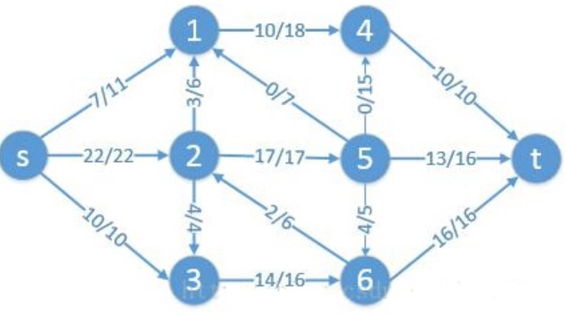
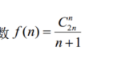
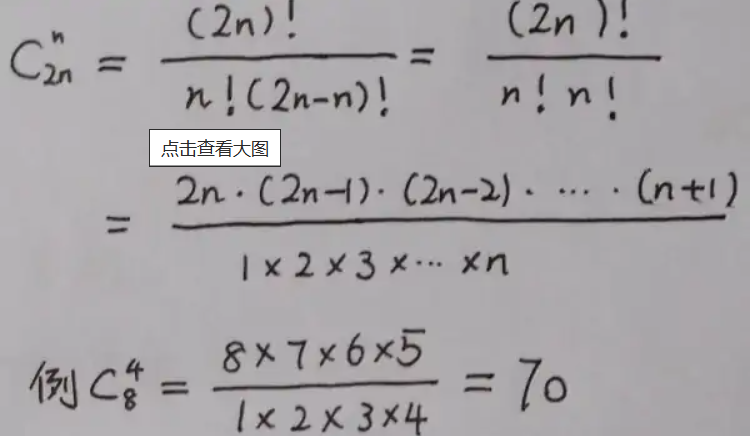

# 笔试选择

####**xml文档解析**

DOM方式: 一次性读取XML，并在内存中表示为树形结构；

SAX：以流的形式读取XML，使用事件回调。边读取XML边解析，并以事件回调的方式让调用者获取数据。占用的内存很小。

####**SJF（短作业优先调度）算法特点**

最求最少的平局等待时间。对短作业有利，对长作业不利。非抢占式的算法。有利于提高系统的吞吐量。

####**哈夫曼树**

给定N个权值作为N个叶子结点，构造一棵二叉树，求树的带权路径长度达到最小，最小的wpl值计算。WPL=`求和(wi li)`其中wi是第i个节点的权值(value)。li是第i个节点的`长(深)度`.

构造过程：将所有节点放到一个优先级队列中去，每次选取最小的两个节点，和为根，两个节点分别为和的左右节点。构造出的根节点放入优先级队列中重新竞争。

在计算`带权路径长度`的时候，需要`重新计算树的高度`(从下往上)，因为哈夫曼树是从下往上构造的，所以对于高度不太好维护，可以构造好然后计算高度。

比如上述的`WPL`为：`2*3+3*3+6*2+8*2+9*2=(2+3)*3+(6+8+9)*2=61`.

####**停机时间与可用性** 可用性/年停机时间

99％ /3.65天

99.9％ / 8.76小时

99.99％ / 52.56分钟

99.999％ / 5.26分钟

99.9999％ / 31.5秒

####**系统不会发生死锁的最少资源数**

每个进程所需资源数 - 1，再相加，就是发生死锁的临界资源数，如：进程P1，P2，P3，所需资源数分别为n1，n2，n3，则临界资源数为 (n1-1) + (n2-1) + (n3-1)。结果再加1就是不发生死锁的资源数

M个进程 ，每个进程要N个资源，不发生死锁：公式：M*（N－1）+1

**缺页率**

####**TCP分段**

MTU:512字节，数据：1500字节， IP头：20字节 问分成多少段能传输

分段后任然是IP头+数据组成，也就是说IP+数据<MTU

分段数 = 1500/（512-20）向上取整

####**网路冲突**

#### 设计模式

哪些设计模式可用于实现对象的复用和避免对象的多重实例化

####http哪些操作是幂等的

GET, HEAD, PUT, DELETE

####指令寄存器、程序寄存器、地址寄存器

程序存储器：用于存储正在执行的程序的指令和数据。

指令寄存器：用于存储当前正在执行的机器指令。当CPU从主存储器中读取一条指令时，这条指令通常会被加载到指令寄存器中，然后CPU解析并执行这条指令。

程序计数器：用于存储当前正在执行的指令的地址或位置。它用于跟踪程序的执行位置，每当一条指令被执行完毕，程序计数器会自动递增以指向下一条指令的地址。

地址寄存器：地址寄存器是用于存储地址的寄存器，它们用于存储内存地址或者I/O端口地址等。CPU需要在执行指令时从内存中读取数据或将数据写入内存，这就需要使用地址寄存器来指示内存中的位置。
####IP经过路由器

 IP数据报在路由器之间传输时,IP首部中生存时间（TTL）、首部校验和。会发生变化

####**面向对象**

 开闭原则：软件实体（模块，类，方法等）应该对扩展开放，对修改关闭。

里氏替换原则：所有引用基类的地方必须能透明地使用其派生类的对象。在任何父类可以出现的地方，都可以用子类的实例来赋值给父类型的引用。

迪米特法则（最少知道原则）：一个软件实体应当尽可能少地与其他实体发生相互作用。每一个软件单位对其他的单位都只有最少的知识，而且局限于那些与本单位密切相关的软件单位。

单一职责原则：如果一个类需要改变，改变它的理由永远只有一个。如果存在多个改变它的理由，就需要重新设计该类。

接口分隔原则：不能强迫用户去依赖那些他们不使用的接口。使用多个专门的接口比使用单一的总接口总要好。

依赖倒置原则：高层模块不应该依赖于低层模块，二者都应该依赖于抽象，抽象不应该依赖于细节，细节应该依赖于抽象，针对接口编程，不要针对实现编程。

组合/聚合复用原则：尽量使用组合/聚合，不要使用类继承。

**针对包设计的原则**

重用发布等价原则：重用的粒度就是发布的粒度。

####一个进程从执行状态转换到阻塞状态的

可能原因是本进程需要等待其他进程的执行结果、发生了I/O请求、或者执行了P操作(减1)

时间片用完是进入就绪态，执行V操作，释放资源，是不会阻塞的；

####堆排序方法构建最小堆的初始堆

调整时从下到上，从右到左

####校验算法

海明码是专为数据错误纠正而设计的校验算法

####UML

类图表达静态结构

用例图是从用户（角色）的角度出发，描述角色和用例之间的关系。

对象图和类图一样反映系统的静态过程，但它是从实际的或原型化的情景来表达的。

状态图描述类的对象所有可能的状态，以及事件发生时状态的转移条件。

活动图描述用例要求所要进行的活动，以及活动间的约束关系，有利于识别并行活动。

序列图是用来显示你的参与者如何以一系列顺序的步骤与系统的对象交互的模型。

协作图和序列图相似，显示对象间的动态合作关系。

构件图是用来表示系统中构件与构件之间，类或接口与构件之间的关系图。

部署图又叫配置图，是用来建模系统的物理部署。

最小代价生成树

求边稀疏的网的最小代价生成树的算法是克鲁斯卡尔算法(Kruskal算法)

####线索二叉树

谓线索二叉树（Threaded Binary Tree），就是把这些空链接加以利用，再指到树的其他节点，这些链接就称为线索（Thread），而这棵树就称为线索二叉树。

优点：

在二叉树中进行中序遍历时，不需要使用堆栈处理，但一般二叉树需要。
由于充分使用了空链接，因此避免了链接闲置浪费的情况。另外，在中序遍历时速度较快，节省不少时间。
任一节点都容易找出它的中序先行者与中序后继者，在中序遍历时可以不使用堆栈或递归。
缺点：

在加入或删除节点时的速度比一般二叉树慢。
线索子树间不能共用。

#### 最大流问题

技巧：  按层计算，瞻前顾后

首先计算每一层向终点方向的最大输出能力，不包括回流的量

然后计算总体的最大流量，为各个层中流量最小的一层的流量

第一层为s。朝终点最大输出量为11+22+10 = 43

第二层为节点1、2、3。    朝终点最大输出量为10+17+14 = 41（10是因为节点4最多接受10，出度为10，14是因为节点3的入度为14，所以是14而不是16）

第三层为节点4、5、6。   朝终点最大输出量为10+16+16 = 42

所以综合考虑总体最大的流量只能41.

#### cpu使用率低，负载高

等待磁盘I/O进程多，但cpu运行的进程少

####求子网掩码

20个子网，最适合的子网掩码是多少

利用子网数来计算：已知子网数是20，二进制是10100，长度是5（这里设是N位）位，C类网络255.255.255.0，将主机地址前N位置1，则有255.255.255.248。

####栈可能的输出序列

n个不同元素进栈，出栈元素不同排列顺序的个数为

####软件开发模型

瀑布模型：最早出现的软件开发模型，是所有其他软件开发模型的基础框架。它缺少了软件运行维护阶段。适应需求比较明确且变更很少的项目。

螺旋模型：一般在软件开发初期阶段需求不是很明确时，采用渐进式的开发模型。

迭代模型：开发迭代是一次完整地经过所有工作流程的过程：（至少包括）需求工作流程、分析设计工作流程、实施工作流程和测试工作流程。实质上，迭代模型是类似小型的瀑布式项目。每一个迭代都会产生一个可以发布的产品，这个产品是最终产品的一个子集。

增量模型：开始时不用投入大量人力资源，可以事先推出核心产品以稳定用户，可以有计划的管理技术风险。

####IP地址分类

A: 0-127, 1分类号，24位主机号; 

B: 128-191， 2分类号，16位主机号; 

C: 192-223，3分类号，8位主机号