# 简历相关问题

## Java基础


####**ArrayList**

- ArrayList 是由数组实现的，支持随机存取，也就是可以通过下标直接存取元素；
- 从尾部插入和删除元素会比较快捷，从中间插入和删除元素会比较低效，因为涉及到数组元素的复制和移动；
- 如果内部数组的容量不足时会自动扩容，因此当元素非常庞大的时候，效率会比较低。

添加元素过程：

- 判断是否扩容
  - 是，则扩容1.5倍。一开始是空数组，第一次添加元素是会初始化10的容量
  - 创建新数组，复制过去

- 添加新元素

时间复杂度：查询/修改O(1);插入/删除末尾O(1); 插入/删除其他O(n);

####**LinkedList**

双向链表实现。

与ArrayList区别

- `ArrayList` 和 `LinkedList` 都是不同步的，也就是不保证线程安全；

- `ArrayList` 底层使用的是 **`Object` 数组**；`LinkedList` 底层使用的是 **双向链表** 数据结构

- `ArrayList` 采用数组存储，所以插入和删除元素的时间复杂度受元素位置的影响。 比如：执行`add(E e)`方法的时候， `ArrayList` 会默认在将指定的元素追加到此列表的末尾，这种情况时间复杂度就是 O(1)。但是如果要在指定位置 i 插入和删除元素的话，时间复杂度就为 O(n)。`LinkedList` 采用链表存储，所以在头尾插入或者删除元素不受元素位置的影响时间复杂度为 O(1)，如果是要在指定位置 `i` 插入和删除元素的话， 时间复杂度为 O(n) ，因为需要先移动到指定位置再插入和删除。

- `LinkedList` 不支持高效的随机元素访问，而 `ArrayList`（实现了 `RandomAccess` 接口） 支持。快速随机访问就是通过元素的序号快速获取元素对象(对应于`get(int index)`方法)。
- `ArrayList` 的空间浪费主要体现在在 list 列表的结尾会预留一定的容量空间，而 LinkedList 的空间花费则体现在它的每一个元素都需要消耗比 ArrayList 更多的空间（因为要存放直接后继和直接前驱以及数据）。

####**HashMap**

**hash方法**：(h = key.hashCode()) ^ (h >>> 16)

扰动函数：将 hashCode 无符号右移 16 位，高 16bit 和低 16bit 做异或。原因：当数组长度很小，假设是 16，那么 n-1 即为 1111 ，这样的值和 hashCode() 直接做按位与 操作，实际上只使用了哈希值的后 4 位。如果当哈希值的高位变化很大，低位变化很小，就很容易 造成哈希冲突了，所以这里把高低位都利用起来，让高16 位也参与运算，从而解决了这个问题

**loadFactor 负载因子**

loadFactor 负载因子是控制数组存放数据的疏密程度，loadFactor 越趋近于 1，那么 数组中存放的数据(entry)也就越多，也就越密，也就是会让链表的长度增加，loadFactor 越小，也就是趋近于 0，数组中存放的数据(entry)也就越少，也就越稀疏。**loadFactor 太大导致查找元素效率低，太小导致数组的利用率低，存放的数据会很分散。loadFactor 的默认值为 0.75f 是官方给出的一个比较好的临界值**，与泊松分布有关。

给定的默认容量为 16，负载因子为 0.75。Map 在使用过程中不断的往里面存放数据，当数量超过了 16 * 0.75 = 12 就需要将当前 16 的容量进行扩容，而扩容这个过程涉及到 rehash、复制数据等操作，所以非常消耗性能。

**初始化**：HashMap 中没有 capacity 这样的字段，即使指定了初始化容量 initialCapacity ，也只是通过 tableSizeFor 将其扩容到与 initialCapacity 最接近的 2 的幂次方大小，然后暂时赋值给 threshold ，后续通过 resize 方法将 threshold 赋值给 newCap 进行 table 的初始化。

**扩容机制**

当链表长度大于阈值（默认为 8），数组长度>= 64 的情况下，转换红黑树。链表<6时会转换为链表。

扩容分两步：一是将数组的长度变为原来的两倍。二是将已经hash分布到数组中的所有元素重新计算hash值，分配到新的数组中。而数组大小必须是2^n，就可以提升重hash的性能。h & (length-1)重新计算hash值，变得只有lenth。由于2倍变化相当于二进制最左边变1。进行与运算。JDK 8 不需要像 JDK 7 那样重新计算 hash，只需要看原来的hash值新增的那个bit是1还是0就好了，是0的话就表示索引没变，是1的话，索引就变成了“原索引+原来的容量”。

**红黑树**

1. 每个节点要么是红色，要么是黑色；
2. 根节点永远是黑色的；
3. 所有的叶子节点都是是黑色的（注意这里说叶子节点其实是图中的 NULL 节点）；
4. 每个红色节点的两个子节点一定都是黑色；
5. 从任一节点到其子树中每个叶子节点的路径都包含相同数量的黑色节点；

红黑树是一种平衡的二叉树，插入、删除、查找的最坏时间复杂度都为 O(logn)，避免了二叉树最坏情况下的 O(n)时间复杂度。平衡二叉树是比红黑树更严格的平衡树，为了保持保持平衡，需要旋转的次数更多，也就是说平衡二叉树保持平衡的效率更低，所以平衡二叉树插入和删除的效率比红黑树要低。

**线程不安全**

jdk1.7的头插法会在多线程下造成死循环。原链表 3 ->7->5。A、B线程扩容，3扩容后在原位置，此时B线程扩容7，7也在原位置但由于头插发会变成7->3. 此时A线程继续执行，认为3的下一个是7.7与3死循环。

多线程put操作时，如果计算的索引位置相同可能被覆盖

put 和 get 并发时会导致 get 到 null。线程 A 执行put时，因为元素个数超出阈值而出现扩容，线程B 此时执行get，有可能导致这个问题。

####ConcurrentHashMap

是线程安全的HashMap。实现方法是CAS+synchronized

具体来说，是通过锁住链表的头节点来实现的。并且使用 volatile 关键字保证可见性。使用 CAS 来修改它的属性和进行一些操作，如CAS 操作存入数组。


#### CopyOnWriteArrayList

线程安全 List实现。 线程安全的核心在于其采用了 **写时复制（Copy-On-Write）** 的策略。当需要修改时，不会直接修改原数组，而是会先创建底层数组的副本，对副本数组进行修改，修改完之后再将修改后的数组赋值回去，这样就可以保证写操作不会影响读操作了。

add方法内部用到了 ReentrantLock                    加锁，保证了同步，避免了多线程写的时候会复制出多个副本出来。

## 并发编程

Java 线程在运行的生命周期：NEW: 初始状态、RUNNABLE: 运行状态、BLOCKED：阻塞状态、WAITING：等待状态、TIME_WAITING：超时等待状态、TERMINATED：终止状态


线程控制方法: sleep()没有释放锁、wait()释放锁。join()等带现场执行完。yield()允许其他线程执行。

~~~java
//继承Thread，重写run方法
class MyThread extends Thread{public void run() {}}
MyThread t1=new  MyThread();
t1.start();
//实现Runnable ，重写run方法
class MyRunnable implements Runnable{public void run() {}}
MyRunnable mr = new MyRunnable();
Thread t1 = new Thread(mr, "张飞");
t1.start();
//实现 Callable 接口
class CallerTask implements Callable<String> { public String call()}
FutureTask<String> task=new FutureTask<String>(new CallerTask());
new Thread(task).start();
~~~

线程间的通信手段：volatile、synchronized、wait、notify、join、管道、ThreadLocal、信号量、

### volatile

volatile实现可见性：有volatile修饰的共享变量在进行写操作时的汇编代码是具有lock前缀的指令，lock前缀的指令在多核处理器下会引发两件事：①将当前处理器缓存行的数据写回到系统内存。②处理器将缓存回写到内存的操作会使在其他CPU里缓存了该内存地址的数据无效。
为了提高处理速度，处理器不直接和内存进行通信，而是先将系统内存的数据读到内部缓存后再进行操作，但操作完不知道何时会写回内存。如果对声明了volatile的变量进行写操作，JVM就会向处理器发送一条lock前缀的指令，将这个变量在缓存行的数据写回到系统内存。为了保证各个处理器的缓存是一致的就会实现缓存一致性协议，每个处理器通过嗅探在总线上传播的数据来检查自己缓存的值是不是过期了，当处理器发现自己缓存行对应的内存地址被修改，就会将当前处理器的缓存行设置为无效状态，当处理器对这个数据进行修改操作的时候，会重新从系统内存中把数据读到处理器缓存里。

 volatile 关键字修饰共享变量可以禁止重排序

- 写屏障（Write Barrier）：当一个 volatile 变量被写入时，写屏障确保在该屏障之前的所有变量的写入操作都提交到主内存。
- 读屏障（Read Barrier）：当读取一个 volatile 变量时，读屏障确保在该屏障之后的所有读操作都从主内存中读取。

### AQS

AQS是抽象队列同步器，它是Java中用于创建同步器的一个抽象基类。AQS使用一个FIFO的等待队列来管理多个线程的竞争和等待，它通过维护一个状态变量来表示同步状态，并提供了一系列的方法来操作状态变量和等待队列，以实现线程的同步和互斥。

AQS内部是Node节点，其中有前后节点、线程、状态和nextWaiter节点。节点可以实现两种队列，线程同步队列、nextWaiter实现Condition的等待队列。

next 和 prev 用于实现同步队列（基于双向链表）。nextWaiter连接成为等待队列。

当节点抢锁失败后会加入同步队列，放入双向链表的尾部，当多个 Node 想要挂在同一个尾节点上时，会出现并发情况，使用CAS解决。先将 node.pre = tail，再使用 CAS 将 node 成为尾节点。若失败则尝试挂到新加尾节点后面。同时将此节点上的线程阻塞。释放锁时同时唤醒头节点后的节点

等待队列实现了condition的相关功能。Condition.await()让Node放入等待队列并释放锁，并且将当前线程阻塞。Condition.signal() 唤醒等待队列的首节点

### synchronized

synchronized是Java中的关键字，主要解决的是多个线程之间访问资源的同步性，可以保证被它修饰的方法或者代码块在任意时刻只能有一个线程执行。可以修饰实例方法、静态方法、代码块。

**Monitor**

对象大致可以分为三个部分，分别是对象头，实例变量和填充字节，对象头分成两个部分：MarkWord和 KlassWord。每一个锁都对应一个monitor对象

每个 Java 对象都可以关联一个 Monitor 对象，Monitor 也是 class，其**实例存储在堆中**，如果使用 synchronized 给对象上锁（重量级）之后，该对象的对象头的 Mark Word 中就被设置指向 Monitor 对象的指针，这就是重量级锁。

**工作流程**：

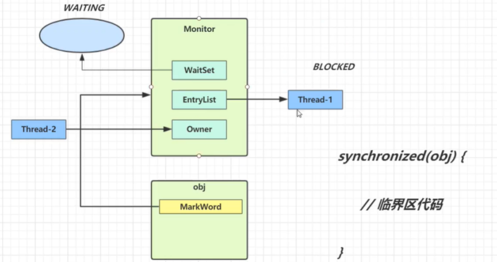

- 开始时 Monitor 中 Owner 为 null，当 Thread-2 执行 synchronized(obj) 就会将 Monitor 的所有者 Owner 置为 Thread-2，Monitor 中只能有一个 Owner，obj 对象的 Mark Word 指向 Monitor，把对象原有的 MarkWord 存入。
- 在 Thread-2 上锁的过程，Thread-3、Thread-4、Thread-5 也执行 synchronized(obj)，就会进入 EntryList BLOCKED（双向链表）
- Thread-2 执行完同步代码块的内容，根据 obj 对象头中 Monitor 地址寻找，设置 Owner 为空， 把线程栈的锁记录中的对象头的值设置回 MarkWord
- 唤醒 EntryList 中等待的线程来竞争锁，竞争是非公平的，如果这时有新的线程想要获取锁，可能 直接就抢占到了，阻塞队列的线程就会继续阻塞
- 以前获得过锁的线程，但条件不满足会进入 WAITING 状态的线程（wait-notify 机制）


`synchronized` 同步语句块的实现使用的是 `monitorenter` 和 `monitorexit` 指令，其中 `monitorenter` 指令指向同步代码块的开始位置，`monitorexit` 指令则指明同步代码块的结束位置。`synchronized` 修饰的方法并没有 `monitorenter` 指令和 `monitorexit` 指令，取得代之的确实是 `ACC_SYNCHRONIZED` 标识，该标识指明了该方法是一个同步方法。

JDK1.6中引入偏向锁和轻量级锁对synchronized进行优化。此时的synchronized一共存在四个状态：无锁状态、偏向锁状态、轻量级锁状态和重量级锁状态。随锁竞争激烈程度，锁的状态会出现一个升级的过程。即可以从偏向锁升级到轻量级锁，再升级到重量级锁。锁升级的过程是单向不可逆的，即一旦升级为重量级锁就不会再出现降级的情况。

**偏向锁**：**在大多数情况下锁不仅不存在多线程竞争关系，而且大多数情况都是被同一线程多次获得**。如果一个线程获得了锁，那么锁就进入偏向模式。当这个线程再次请求锁时，无需再做任何同步操作，即可获取锁的过程。

当锁对象第一次被线程获得的时候进入偏向状态，标记为 101，同时使用 CAS 操作将线程 ID 记录 到 Mark Word。如果 CAS 操作成功，这个线程以后进入这个锁相关的同步块，查看这个线程 ID 是自己的就表示没有竞争，就不需要再进行任何同步操作。当有另外一个线程去尝试获取这个锁对象时，偏向状态就宣告结束。

**轻量级锁**：**对于大部分的锁，在整个同步生命周期内都不存在竞争。**JVM会利用CAS尝试把对象原本的Mark Word 更新为锁记录Lock Record的指针，成功就说明加锁成功


使用轻量级锁时会创建锁记录Lock Record对象，每个线程的栈帧都会包含一个锁记录的结构，存储锁定对象的 Mark Word。锁记录的Object reference 指向锁住的对象。并且使用CAS将Object的MarkWard更改为锁记录地址以及状态00标识轻量级锁。并将原始的MarkWard存入锁记录中。

CAS失败则有两者情况：一、其他线程持有了锁对象，这证明有竞争，执行锁膨胀。二、由于可重入锁的特性，可能是自己线程以及获取了锁，则就添加一条锁记录作为重入的计数。

当退出synchronized(解锁)时，如果有取值为 null 的锁记录，表示有重入，这时重置锁记录，表示重入计数减 1，如果锁记录的值不为 null，这时使用 CAS 将 Mark Word 的值恢复给Object对象头。成功，则解锁成功；失败，说明轻量级锁进行了锁膨胀或已经升级为重量级锁，进入重量级锁解锁流程。

**重量级锁**：存在锁竞争时，轻量级锁会进入锁碰撞变成重量级锁。

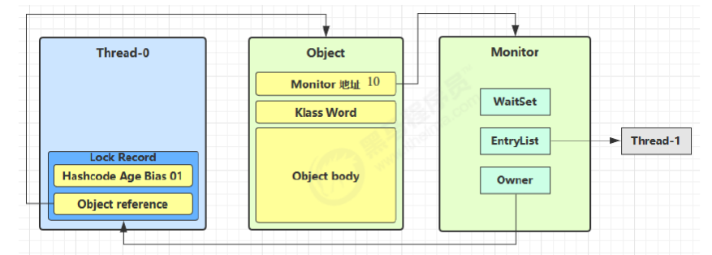

当 Thread-1 进行轻量级加锁时，Thread-0 已经对该对象加了轻量级锁。Thread-1 加轻量级锁失败，进入锁膨胀流程：为 Object 对象申请 Monitor 锁，将 Monitor 的 Owner 置为 Thread-0，将 Object 的对象头指向重量级锁地址，然后自己进入 Monitor 的 EntryList BLOCKED。

**锁的优化**

**自旋锁**：基于**在大多数情况下，线程持有锁的时间都不会太长**。操作系统实现线程之间的切换时需要从用户态转换到核心态。自旋锁会假设在不久将来，当前的线程可以获得锁，因此虚拟机会让当前想要获取锁的线程做几个空循环(这也是称为自旋的原因)，不断的尝试获取锁。

**锁消除**：对于被检测出不可能存在竞争的共享数据的锁进行消除，这是 JVM 即时编译器的优化。锁消除主要是通过逃逸分析来支持的。

**锁粗化**：对相同对象多次加锁，导致线程发生多次重入，频繁的加锁操作就会导致性能损耗，可以使用锁粗化方式优化。如果虚拟机探测到一串的操作都对同一个对象加锁，将会把加锁的范围扩展（粗化）到整个操作序列的外部。

**死锁**

Java 死锁产生的四个必要条件： 

1. 互斥条件，即当资源被一个线程使用（占有）时，别的线程不能使用 
2. 不可剥夺条件，资源请求者不能强制从资源占有者手中夺取资源，资源只能由资源占有者主动释放 
3. 请求和保持条件，即当资源请求者在请求其他的资源的同时保持对原有资源的占有 
4. 循环等待条件，即存在一个等待循环队列：p1 要 p2 的资源，p2 要 p1 的资源，形成了一个等待环路

定位死锁：使用 jps 定位进程 id，再用 jstack id 定位死锁，找到死锁的线程去查看源码，解决优化

###ReentrantLock

`ReentrantLock` 实现了 `Lock` 接口，是一个可重入且独占式的锁，和 `synchronized` 关键字类似。更灵活、更强大，增加了轮询、超时、中断、公平锁和非公平锁等高级功能。

`ReentrantLock` 里面有一个内部类 `Sync`，`Sync` 继承 AQS，添加锁和释放锁的大部分操作实际上都是在 `Sync` 中实现的。`Sync` 有公平锁 `FairSync` 和非公平锁 `NonfairSync` 两个子类。默认使用非公平锁。

**公平锁**是指多个线程按照申请锁的顺序来获取锁，线程直接进入同步队列中排队，队列中最先到的线程先获得锁。**非公平锁**是多个线程加锁时每个线程都会先去尝试获取锁，如果刚好获取到锁，那么线程无需等待，直接执行，如果获取不到锁才会被加入同步队列的队尾等待执行。

**原理**：底层通过AQS实现的。

**非公平锁**：lock方法调用CAS方法设置state的值，state=0证明无锁，当前线程可以占据。否则执行acquire(1)。nonfairTryAcquire方法首先调用getState方法获取state的值，如果state的值为0(之前占领锁的线程刚好释放了锁)，那么占据。否则那就调用查看占用锁的线程是不是自己，如果是的话那就直接将state + 1，然后返回true。如果state不为0且锁的所有者又不是自己，那就返回false，然后线程会进入到同步队列中。

**公平锁**：lock方法调用CAS方法设置state的值，state=0证明无锁。此时要先考虑同步队列是否有线程等待，再考虑自己线程。若！=0，则看是否是自己线程的锁，如果是的话那就直接将state + 1，然后返回true。不是就将本线程加入同步队列。

**synchronized 和 ReentrantLock 区别**

两者都是可重入锁，线程可以再次获取自己的内部锁。`synchronized` 是依赖于 JVM 实现的，`ReentrantLock` 是 JDK 层面实现的。相比`synchronized`，`ReentrantLock`增加了一些高级功能。**等待可中断**、**可实现公平锁** 、**可实现选择性通知（锁可以绑定多个条件）**。

- **等待可中断** : `ReentrantLock`提供了一种能够中断等待锁的线程的机制，通过 `lock.lockInterruptibly()` 来实现这个机制。也就是说正在等待的线程可以选择放弃等待，改为处理其他事情。

- **可实现公平锁** : `ReentrantLock`可以指定是公平锁还是非公平锁。而`synchronized`只能是非公平锁。所谓的公平锁就是先等待的线程先获得锁。`ReentrantLock`默认情况是非公平的，可以通过 `ReentrantLock`类的`ReentrantLock(boolean fair)`构造方法来指定是否是公平的。

- **可实现选择性通知（锁可以绑定多个条件）**: `synchronized`关键字与`wait()`和`notify()`/`notifyAll()`方法相结合可以实现等待/通知机制。`ReentrantLock`类当然也可以实现，但是需要借助于`Condition`接口与`newCondition()`方法。


Synchronized适合于并发竞争低的情况，因为Synchronized的锁升级如果最终升级为重量级锁在使用的过程中是没有办法消除的，意味着每次都要和cpu去请求锁资源，而ReentrantLock主要是提供了阻塞的能力，通过在高并发下线程的挂起，来减少竞争，提高并发能力。

### CAS算法

CAS 的全称是 **Compare And Swap（比较与交换）** ，用于实现乐观锁，被广泛应用于各大框架中。CAS 的思想很简单，就是用一个预期值和要更新的变量值进行比较，两值相等才会进行更新。CAS 是一个原子操作，底层依赖于一条 CPU 的原子指令。CAS 是一种无锁的非阻塞算法的实现。`Java` 中的 `CAS` 操作通常使用 `sun.misc.Unsafe` 类来实现

CAS 涉及到三个操作数：**V**：要更新的变量值，**E**：预期值，**N**：拟写入的新值。当且仅当 V 的值等于 E 时，CAS 通过原子方式用新值 N 来更新 V 的值。如果不等，说明已经有其它线程更新了 V，则当前线程放弃更新。

**ABA 问题**：如果一个变量 V 初次读取的时候是 A 值，并且在准备赋值的时候检查到它仍然是 A 值，在这段时间它的值可能被改为其他值，然后又改回 A，那 CAS 操作就会误认为它从来没有被修改过。这个问题被称为 CAS 操作的 **"ABA"问题。**ABA 问题的解决思路是在变量前面追加上**版本号或者时间戳**。

CAS 经常会用到自旋操作来进行重试，也就是不成功就一直循环执行直到成功。如果长时间不成功，会给 CPU 带来非常大的执行开销。

CAS高效原因：防止获取锁时频繁的上下文切换。CAS适合变量并发访问稍小的情况，大规模并发访问会导致CAS长期处于重试。

### 线程池

线程池就是管理一系列线程的资源池。当有任务要处理时，直接从线程池中获取线程来处理，处理完之后线程并不会立即被销毁，而是等待下一个任务。池化技术的思想主要是为了减少每次获取资源的消耗，提高对资源的利用率。

线程池的参数：核心线程数、最大线程数、存活时间、时间单位、任务队列、线程工厂、拒绝策略

顶级接口Executor提供了一种方式，解耦任务的提交和执行，只定义了一个 execute(Runnable command) 方法用来提交任务，至于具体任务怎么执行则交给他的实现者去自定义实现。ExecutorService 接口继承 Executor，且扩展了生命周期管理的方法、返回 Futrue 的方法、批量提交任务的方法。AbstractExecutorService 抽象类继承 ExecutorService 接口，对 ExecutorService 相关方法提供了默认实现，用FutureTask 包装 Runnable 任务，交给 execute() 方法执行，然后可以从该 FutureTask 阻塞获取执行结果。

ThreadPoolExecutor 继承 AbstractExecutorService，采用池化思想管理一定数量的线程来调度执行提交的任务，且定义了一套线程池的生命周期状态，用一个 ctl 变量来同时保存当前池状态（高3位）和当前池线程数（低29位）。ThreadPoolExecutor 类里的方法大量有同时需要获取或更新池状态和池当前线程数的场景，放一个原子变量里，可以很好的保证数据的一致性以及代码的简洁性。

**通过`ThreadPoolExecutor`构造函数来创建**

~~~java
// 实例化一个线程池
ThreadPoolExecutor executor = new ThreadPoolExecutor(3, 10, 60,
        TimeUnit.SECONDS, new ArrayBlockingQueue<>(20));
// 使用线程池执行一个任务        
executor.execute(() -> {
    // Do something
});
// 关闭线程池,会阻止新任务提交，但不影响已提交的任务
executor.shutdown();
// 关闭线程池，阻止新任务提交，并且中断当前正在运行的线程
executor.showdownNow();

public ThreadPoolExecutor(int corePoolSize,
                              int maximumPoolSize,
                              long keepAliveTime,
                              TimeUnit unit,//时间单位
                              BlockingQueue<Runnable> workQueue,
                              ThreadFactory threadFactory,//线程工厂，用来创建线程，一般默认即可
                              RejectedExecutionHandler handler//拒绝策略，
                               )
//corePoolSize 线程池的核心线程数量,有任务提交到线程池时，如果线程池中的线程数小于corePoolSize,那么则直接创建新的线程来执行任务。
//workQueue 是一个阻塞队列，用于存储来不及执行的任务的队列。当有任务提交到线程池的时候，如果线程池中的线程数大于等于corePoolSize，那么这个任务则会先被放到这个队列中，等待执行。
//maximumPoolSize 线程池的最大线程数,表示线程池支持的最大线程数量。当一个任务提交到线程池时，线程池中的线程数大于corePoolSize,并且workQueue已满，那么则会创建新的线程执行任务，但是线程数要小于等于maximumPoolSize。
//keepAliveTime 线程数大于核心线程数时，多余的空闲线程存活的最长时间
//handler 当线程池中的线程达到maximumPoolSize线程数后且workQueue已满的情况下，再向线程池提交任务则执行对应的拒绝策略
~~~


线程池从诞生到死亡，中间会经历running、shutdown、stop、tidying、terminated五个生命周期状态。

线程池任务流程


**阻塞队列**

- ArrayBlockQueue：由数组结构组成的有界阻塞队列 
- LinkedBlockingQueue：由链表结构组成的无界（默认大小 Integer.MAX_VALUE）的阻塞队列 
- PriorityBlockQueue：支持优先级排序的无界阻塞队列 
- DelayedWorkQueue：使用优先级队列实现的延迟无界阻塞队列 
- SynchronousQueue：不存储元素的阻塞队列，每一个生产线程会阻塞到有一个 put 的线程放入元 素为止 
- LinkedTransferQueue：由链表结构组成的无界阻塞队列 
- LinkedBlockingDeque：由链表结构组成的双向阻塞队列

线程池饱和策略分为一下几种：

1）AbortPolicy：线程池默认的拒绝策略，触发时会抛出 RejectedExecutionException 异常。如果是一些比较重要的业务，可以使用该拒绝策略，在系统不能进一步支持更大并发量的情况下通过抛出异常及时发现问题并进行处理。

2）CallerRunsPolicy：在线程池没关闭的情况下，由调用者线程去处理任务，反之直接丢弃。此拒绝策略追求任务都能被执行，不丢失，比较适合并发量不大并且不允许丢失任务的场景场景，性能较低。

3）DiscardPolicy：丢弃任务，不抛出异常，一般无感知。建议一些无关紧要的任务可以使用此策略。

4）DiscardOldestPolicy：丢弃队列中最老的任务，然后重新提交被拒绝的任务。需要根据业务场景进行选择是否要用。

3、4 这两种拒绝策略都在会在无感知的情况下丢弃任务，需要根据业务场景决定是否要使用。

**Worker 类**

Worker 是ThreadPoolExecutor的内部类，继承AQS，实现的Runnable,所以本身具有锁的特性，又是一个可执行任务。Worker 类内部有线程属性Thread，即为线程池的线程，Runnable类的任务firstTask。

执行线程池 `execute()` 方法提交任务时，如果需要创建一个新的工作线程，则会调用 `addWorker()` 方法，并传递Runnable类的任务绑定给线程。调用 worker对象 中 thread 的 `start()` 方法启动线程。线程的任务是worker对象本身(实现l1的Runnable接口)。

启动任务后，会执行到 Worker 的 `run()` 方法，最终的任务执行逻辑在 `runWorker()` 方法中：执行创建时添加的 `firstTask` 任务或不断调用 `getTask()` 方法从队列拉取任务，获取到任务后先执行 beforeExecute() 钩子函数，再执行任务，然后再执行 afterExecute() 钩子函数。若超时获取不到任务会调用 processWorkerExit() 方法执行 Worker 线程的清理工作。

**ThreadPoolExecutor中的锁**

**mainLock 锁**：ThreadPoolExecutor 内部维护了 ReentrantLock 类型锁 mainLock，在访问 workers 成员变量以及进行相关数据统计（ largestPoolSize、completedTaskCount）时需要获取该重入锁。目的是workers 变量用的 HashSet 是线程不安全的，是不能用于多线程环境的。以及一些数据变量也没有用volatile 修饰，需要保护。

相比于线程安全容器，此处更适合用 lock，主要原因之一就是串行化 interruptIdleWorkers() 方法，避免了不必要的中断风暴。interruptIdleWorkers() 方法在多线程访问下就会发生这种情况。一个线程调用interruptIdleWorkers() 方法对 Worker 进行中断，此时该 Worker 出于中断中状态，此时又来一个线程去中断正在中断中的 Worker 线程，这就是所谓的中断风暴。

 largestPoolSize、completedTaskCount不使用volatile ，为了保证这两个参数的准确性，在获取这两个值时，能保证获取到的一定是修改方法执行完成后的值。如果不加锁，可能在修改方法还没执行完成时，此时来获取该值，获取到的就是修改前的值，然后修改方法一提交，就会造成获取到的数据不准确了。

**Worker 线程锁**：该锁主要是用来维护运行中线程的中断状态。在runWorker() 方法中获取到任务开始执行前，需要先调用 w.lock() 方法，lock() 方法会调用 tryAcquire() 方法，tryAcquire() 实现了一把非重入锁，通过 CAS 实现加锁。interruptIdleWorkers() 方法会中断那些等待获取任务的线程，会调用 w.tryLock() 方法来加锁，如果一个线程已经在执行任务中，那么 tryLock() 就获取锁失败，保证不能中断运行中的线程了。

**execute() 和 submit() 不同**

execute() 无返回值，submit() 有返回值，会返回一个 FutureTask，然后可以调用 get() 方法阻塞获取返回值。Callable接口类似于Runnable，但是Runnable不会返回结果，并且无法抛出返回结果的异常，而Callable功能更强大一些，被线程执行后，可以返回值。

FutureTask 表示一个可以取消的异步运算类。它有启动和取消运算、查询运算是否完成和取回运算结果等方法。只有当运算完成的时候结果才能取回，如果运算尚未完成get方法将会阻塞。一个FutureTask对象可以对调用了Callable和Runnable的对象进行包装，由于FutureTask也是调用了Runnable接口所以它可以提交给Executor来执行。

调用 submit() 方法提交的任务（Runnable or Callable）会被包装成 FutureTask() 对象。FutureTask 类提供了多种任务状态。并且有Callable类的任务以及线程Thread runner。创建 FutureTask 对象时 state 置为 NEW，callable 赋值为我们传入的任务，并设置线程启动。 执行任务，执行成功后会将结果赋值给 outcome。

**优雅关闭线程池**

shuwdown：如果线程正在执行线程池里的任务，即便任务处于阻塞状态，线程也不会被中断，而是继续执行。如果线程池阻塞等待从队列里读取任务，则会被唤醒，但是会继续判断队列是否为空，如果不为空会继续从队列里读取任务，为空则线程退出。

shutdownnow：将线程池的状态设置为STOP，正在执行的任务则被停止，没被执行任务的则返回。

线程池如何进行监控？
①taskCount，线程池需要执行的任务数量。②completedTaskCount，线程池在运行过程中已经完成的任务数量，小于或等于taskCount。③largestPoolSize，线程池里曾经创建过的最大线程数量，通过这个数据可以知道线程池是否曾经满过，如果该数值等于线程池的最大大小表示线程池曾经满过。④getPoolSize，获取线程池的线程数量，如果线程池不销毁的化线程池里的线程不会自动销毁，所以这个数值只增不减。⑤getActiveCount，获取活动的线程数。
通过扩展线程池进行监控，可以继承线程池来自定义，重写线程池的beforeExecute、afterExecute和terminated方法，也可以在任务执行前、执行后和线程池关闭前来执行一些代码进行监控，例如监控任务的平均执行时间、最大执行时间和最小执行时间。

### ThreadLocal

**原理**


每个Thread线程内部都有一个ThreadLocalMap。当第一次调用ThreadLocal的get()或set()方法时，会自动创建并初始化该线程的ThreadLocalMap对象。这个ThreadLocalMap对象是线程的属性。但ThreadLocalMap这个类是ThreadLocal的内部类，没有实现 Map 接口。ThreadLocalMap里面存储线程本地对象ThreadLocal（key）和线程的变量副本（value）。


其ThreadLocalMap中的Entry使用的是K-V方式来组织数据，Entry中key是ThreadLocal对象，且是一个弱引用（弱引用，生命周期只能存活到下次GC前）。

**ThreadLocalMap为什么要用ThreadLocal做key，而不是用Thread做key？**

一个线程中很有可能不只使用了一个ThreadLocal对象。通过Thread对象，无法知道要获取哪个ThreadLocal对象。 

**Entry的key为什么设计成弱引用？**

假如key对ThreadLocal对象的弱引用，改为强引用。ThreadLocal变量生命周期完了，设置成null了，但由于key对ThreadLocal还是强引用。ThreadLocal对象和ThreadLocalMap都将不会被GC回收，于是产生了内存泄露问题。如果key是弱引用，当ThreadLocal变量指向null之后，在GC做垃圾清理的时候，key会被自动回收，其值也被设置成null。

**设计成弱引用就彻底不存在内存泄漏了吗？**

假如ThreadLocalMap中存在很多key为null的Entry，但后面的程序，一直都没有调用过有效的ThreadLocal的get、set或remove方法。 那么，Entry的value值一直都没被清空。其结果就是：Entry和ThreadLocalMap将会长期存在下去，会导致内存泄露。因为只有当其他的ThreadLocal变量，调用了它的get、set或remove，三个方法中的任何一个方法，都会自动触发清理机制，将key为null的value值清空。这样在GC时才会清理这个Entry不会内存泄漏。所以为了防止这样的内存泄漏需要在使用完ThreadLocal对象之后调用一次remove方法。

**hash冲突**

当你在一个线程需要保存多个变量时，需要创建多个ThreadLocal对象防止Key相同造成hash冲突。和HashMap的最大的不同在于，ThreadLocalMap解决Hash冲突的方式就是简单的步长加1或减1及线性探测，寻找下一个相邻的位置。当set方法存储数据时，使用hash方法计算位置，若位置有值会一直探测下一个地址。如果找到最后一个，还是没有找到，则再从头开始找。

**清理**

在探测过程中会复用key为null的脏对象并进行垃圾清理防止内存泄漏。

探测式清理：从当前节点(hash计算的值)开始遍历数组，key==null的将entry置为null，key!=null的对当前元素的key重新hash分配位置，若重新分配的位置上有元素就往后顺延。

启发式清理：从当前节点开始，进行do-while循环检查清理过期key，遇到时会触发探测式清理。结束条件是连续`n`次未发现过期key就跳出循环，n是经过位运算计算得出的，可以简单理解为数组长度的2的多少次幂次。例如：数组长度是16，那么24=16，也就是连续4次没有过期Entry。

在set、get方法中遇到过期key时会触发探测式清理。rehash中会触发探测式清理。set方法最后会执行一次发式清理，在启发式清理中发现过期key会触发探测式清理。

**ThreadLocal是如何扩容的？**

存在一个扩容阈值，为数组长度的2/3.

在set方法最后会进行扩容。扩容开始先触发探测式清理。当清理完成之后现有数组超过3/4阈值则会进扩容。数组扩容为原来的2倍。重新计算key的散列值。重新设置阈值为2/3的新数组值。

**InheritableThreadLocal**

InheritableThreadLocal类可以在子线程中能够正常获取父线程中设置的值。在它的init方法中会将父线程中往ThreadLocal设置的值，拷贝一份到子线程中。

**线程池中如何共享数据？**

使用InheritableThreadLocal不能满足。因为第一次submit任务的时候，该线程池会自动创建一个线程。因为使用了InheritableThreadLocal，所以创建线程时，会调用它的init方法，将父线程中的inheritableThreadLocals数据复制到子线程中。但第二次submit后是复用之前线程，不再调用它的init方法。此时应当使用阿里开源的TransmittableThreadLocal

## 开源框架

### Spring

#### IOC

IOC(Inverse of Control，控制反转)是一种软件设计原则，它强调将控制权从应用程序代码中解耦出来。在传统的编程模式中，应用程序代码通常负责创建和管理对象以及控制对象之间的依赖关系。而在IOC中，控制过程被反转，将控制的决策权交给框架或容器来管理，由容器或框架来创建和管理对象，并通过外部配置文件或注解来描述对象之间的依赖关系，使得应用程序的代码更加简洁和灵活。

bean的生命周期：实例化、属性赋值、初始化、销毁

#### AOP

AOP（Aspect-Oriented Programming）是一种编程范式，面向切面编程。把我们程序重复的代码抽取出来，在需要执行的时候使用动态代理技术在不修改源码的基础上，对我们的已有方法进行增强。

**JDK 动态代理**

基于接口代理，通过反射机制生成一个实现代理接口的类，在调用具体方法时会调用 InvocationHandler 来处理。JDK 动态代理生成的代理对象需要继承 `Proxy` 这个类，在 Java 中类只能是单继承关系，无法再继承一个代理类，所以只能基于接口代理。需要借助 JDK 的 `java.lang.reflect.Proxy` 来创建代理对象，调用 `Proxy.newProxyInstance(ClassLoader loader, Class<?>[] interfaces, InvocationHandler h)` 方法创建一个代理对象，方法的三个入参分别是Class 类加载器、需要实现的接口、代理对象的处理器。

**CGLIB 动态代理**

CGLIB 动态代理则是基于类代理（字节码提升），通过 ASM（Java 字节码的操作和分析框架）将被代理类的 class 文件加载进来，修改其字节码生成一个子类。需要借助于 CGLIB 的 `org.springframework.cglib.proxy.Enhancer` 类来创建代理对象，设置以下几个属性：被代理的类、回调接口。

#### 资源加载器


**refreshBeanFactory()**：先new一个工厂类后，loadBeanDefinitions将xml文件解析获得，解析的核心在doLoadBeanDefinitions方法中，将xml中的字符转换为beandefinition并进行注册到new的工厂类的Map<String, BeanDefinition>中去。

- 我们需要获取资源xml文件，使用ResourceLoader 、Resource，资源加载
- 解析资源，Beandifinationreader
- 注入bean容器

Resource接口是Spring中访问资源的抽象，ResourceLoader 为了快速返回（也就是加载）Resource实例的对象，也就是说ResourceLoader 返回Resource，Resource继承getInputStream方法，用于获取资源。在加载xml文件时获得InputStream类型进入doLoadBeanDefinitions方法进行解析。使用SAXReader解析文档获得树得到BeanDefinition。

#### 事件监听

实现Spring事件机制主要有4个类：

ApplicationEvent：事件，每个实现类表示一类事件，可携带数据。
ApplicationListener：事件监听器，用于接收事件处理时间。
ApplicationEventMulticaster：事件管理者，用于事件监听器的注册和事件的广播。
ApplicationEventPublisher：事件发布者，委托ApplicationEventMulticaster完成事件发布。

我们可以通过继承ApplicationEvent来定义一个事件。实现ApplicationListener接口定义监听者，监听者中的onApplicationEvent方法是对事件的反应。在spring中，applicationcontext实现了ApplicationEventPublisher接口可以发布事件。在refeash方法中定义了ApplicationEventMulticaster的实现类，在此来注册监听器。

当事件发布时，会调用ApplicationEventMulticaster，本质还是管理器广播了事件。广播过程中会逐个执行监听器的判断是否该响应事件，响应就调用监听器的onApplicationEvent。

ApplicationContext容器提供了完善的事件发布和事件监听功能。它继承了ApplicationEventMulticaster接口。refresh方法中，会实例化ApplicationEventMulticaster、注册监听器并发布容器刷新事件。ApplicationEventMulticaster：添加/移除监听者，multicastEvent遍历监听者若对事件感兴趣就响应该事件。发布事件就是调用广播的multicastEvent方法。返回监听者的onApplicationEvent方法的具体响应。 

#### 类型转换

**Converter**提供一个对象类型到另一个对象类型的转换

创建ConversionService的FactoryBean——ConversionServiceFactoryBean。

类型转换的时机有两个：

- 为bean填充属性时，见AbstractAutowireCapableBeanFactory#applyPropertyValues
- 处理@Value注解时，见AutowiredAnnotationBeanPostProcessor#postProcessPropertyValues

在进行转换时先获取conversionService用于转换。

conversionService中canConvert(sourceType, targetType)来判断是否又对应类型的转换器。如果有则转换，并通过反射设置属性

#### 循环依赖

三级缓存：singletonFactories、earlySingletonObjects和singletonObjects(一级缓存)

A依赖B，B又依赖A的情况会循环直至栈溢出。

由此开来这个循环依赖是在设置属性值时发生的。A需要设置B，B又需要设置A。则将A在实例化后就提前放进容器缓存里，这样就可以使得B需要A时可以获得A。但对于代理对象则不能解决。因为它需要提前暴露代理对象的引用，而不是暴露实例化后的bean的引用。

getBean()时依次检查一级缓存singletonObjects、二级缓存earlySingletonObjects和三级缓存singletonFactories中是否包含该bean。如果三级缓存中包含该bean，则挪至二级缓存中，然后直接返回该bean。最后将代理bean放进一级缓存singletonObjects

所以在一开始A和B会都进第三级缓存singletonFactories。在B引用A时会将A提升至二级缓存earlySingletonObjects。B初始化完成，从三级缓存singletonObjectFactory直接put到一级缓存singletonObject。A成功得到B，A完成初始化动作，从二级缓存中移入一级缓存。

在存在代理对象时，A创建原始对象到第三级缓存，在*BeanPostProcessor*后置处理中生成代理对象并存储进第一级缓存并删除第三级缓存的对象。但存在循环依赖时，创建B需要从第三级缓存获取A，在获取原始A后会执行getEarlyBeanReference获得代理对象A并放到二级缓存中。

为什么需要第二级缓存

使得存在代理时获得的代理对象是相同的。因为在第三级缓存中的getObject()方法会产生新的代理对象，每次生成新的。但存在二级过度，会不再调用getObject保证代理对象的唯一。

#### 代理

jdk

JdkDynamicAopProxy是动态代理类，在执行原始方法时会调用JdkDynamicAopProxy中的invoke方法。

在此方法中存在字段AdvisedSupport advised，提供了操作和管理 Advice 和 Advisor 的能力。Advice 表示 Aspect 在特定的 Join point 采取的操作。Advisor 持有 Advice。advised中设置了原始类、advisor。advisor又包含了execution表达式以及拦截器methodInterceptor。

invoke中会在DefaultAdvisorChainFactory中寻找方法的拦截器链。在此类中的方法里会提取advised中的advisor，利用其中的PointcutAdvisor来判断此时的方法是否符合当前对象，如果匹配就返回所有设置的拦截器methodInterceptor。在这里就是AfterReturningAdviceInterceptor类的拦截器。将拦截器统一封装成ReflectiveMethodInvocation并执行执行拦截器链。

执行拦截器链时使用新封装类的proceed() 方法，在此方法中不断调用链中单个拦截器的invoke方法。invoke方法又会回调新包装类的proceed() 方法。这样使得方法先执行，执行完后再执行拦截器内的afterReturning方法进行后置增强。

cglib

基于CGLIB的动态代理是指利用CGLIB库动态生成代理类。与基于JDK动态代理不同的是，CGLIB不需要目标对象实现接口，而是通过继承目标对象的方式进行代理。

JDK动态代理是通过重写被代理对象实现的接口中的方法来实现，而CGLIB是通过继承被代理对象来实现，和JDK动态代理需要实现指定接口一样，CGLIB也要求代理对象必须要实现MethodInterceptor接口，并重写其唯一的方法intercept。

### MVC

**MVC 的工作流程**


②、**前端控制器**：这个请求会先到前端控制器 DispatcherServlet，它是整个流程的入口点，负责接收请求并将其分发给相应的处理器。

③、**处理器映射**：DispatcherServlet 调用 HandlerMapping 来确定哪个 Controller 应该处理这个请求。通常会根据请求的 URL 来确定。

④、**处理器适配器**：一旦找到目标 Controller，DispatcherServlet 会使用 HandlerAdapter 来调用 Controller 的处理方法。

⑤、**执行处理器**：Controller 处理请求，处理完后返回一个 ModelAndView 对象，其中包含模型数据和逻辑视图名。

⑥、**视图解析器**：DispatcherServlet 接收到 ModelAndView 后，会使用 ViewResolver 来解析视图名称，找到具体的视图页面。

⑦、**渲染视图**：视图使用模型数据渲染页面，生成最终的页面内容。

⑧、**响应结果**：DispatcherServlet 将视图结果返回给客户端。

### Boot

**自动配置原理**

启动类上的注解`@SpringBootApplication`是一个复合注解，包含了@EnableAutoConfiguration。`EnableAutoConfiguration` 只是一个简单的注解，自动装配核心功能的实现实际是通过 `AutoConfigurationImportSelector`类，实现了`ImportSelector`接口，这个接口的作用就是收集需要导入的配置类，配合`@Import(）`就可以将相应的类导入到 Spring 容器中。获取注入类的方法是 selectImports()，它实际调用的是`getAutoConfigurationEntry`，这个方法是获取自动装配类的关键，主要流程可以分为这么几步：获取注解的属性，用于后面的排除、获取所有需要自动装配的配置类的路径、去掉重复的配置类和需要排除的重复类，把需要自动加载的配置类的路径存储起来。

## MySQL


### 索引

- 按「数据结构」分类：**B+tree索引、Hash索引、Full-text索引**。
- 按「物理存储」分类：**聚簇索引（主键索引）、二级索引（辅助索引）**。
- 按「字段特性」分类：**主键索引、唯一索引、普通索引、前缀索引**。
- 按「字段个数」分类：**单列索引、联合索引**。

索引列的选择：

- 如果有主键，默认会使用主键作为聚簇索引的索引键（key）；
- 如果没有主键，就选择第一个不包含 NULL 值的唯一列作为聚簇索引的索引键（key）；
- 在上面两个都没有的情况下，InnoDB 将自动生成一个隐式自增 id 列作为聚簇索引的索引键（key）；


####**B+Tree**

- 主键索引的 B+Tree 的叶子节点存放的是实际数据，所有完整的用户记录都存放在主键索引的 B+Tree 的叶子节点里；
- 二级索引的 B+Tree 的叶子节点存放的是主键值，而不是实际数据。

对于有 N 个叶子节点的 B+Tree，其搜索复杂度为`O(logdN)`，其中 d 表示节点允许的最大子节点个数为 d 个。在实际的应用当中， d 值是大于100的，即使数据达到千万级别时，B+Tree 的高度依然维持在 3~4 层左右，也就是说一次数据查询操作只需要做 3~4 次的磁盘 I/O 操作就能查询到目标数据。

使用二级索引查询时需要先查询主键值，再查询一级索引。这叫**回表**。不过，当查询的数据是能在二级索引的 B+Tree 的叶子节点里查询到，这时就不用再查主键索引查**叫作「覆盖索引」**。

##### **B+Tree 相比于 B 树、二叉树或 Hash 索引结构的优势**

***二叉查找树***：二叉树的每个父节点的儿子节点个数只能是 2 个，搜索复杂度为 `O(logN)`。二叉树检索到目标数据所经历的磁盘 I/O 次数要更多。当每次插入的元素都是二叉查找树中最大的元素，二叉查找树就会退化成了一条链表，查找数据的时间复杂度变成了` O(n)`

***B Tree***：B+Tree 只在叶子节点存储数据，而 B 树 的非叶子节点也要存储数据，所以 B+Tree 的单个节点的数据量更小，在相同的磁盘 I/O 次数下，就能查询更多的节点。另外，B+Tree 叶子节点采用的是双链表连接，适合 MySQL 中常见的基于范围的顺序查找，而 B 树无法做到这一点。

 ***Hash***：Hash 在做等值查询的时候效率贼快，搜索复杂度为 O(1)。但是 Hash 表不适合做范围查询。

#### B+树的页结构

页结构由7部分组成，其中的记录是按照主键值从小到大的顺序组成一个单向链表，并且提供页目录方便记录的查找。页与页之间是双向链表。当数据很多需要额外的页时，会将新的记录保存再另一个页。，新分配的数据页编号可能并不是连续的，但要保证下一个数据页中用户记录的主键值必须大于上一个页中用户记录的主键值。如果不符合就要进行调整。为了保持这样状的调整过程为**页分裂**。

但数据再页与页的查询很困难，所以也需要一个类似页目录的东西提供索引。所以将一些页成为目录。其中保存了其他非目录页的主键值和对应的页地址。形成索引。

#### B+ 树能存多少条数据

假如一行数据的大小约为1K字节，那么按 `16K / 1K = 16`，可以计算出一页大约能存放16条数据。

B+树的存放总记录数为：根节点指针数*单个叶子节点记录行数。

单个叶子节点记录行数已经算出是16，需要计算出非叶子节点能存放多少指针，主键ID为bigint类型，长度为8字节，而指针大小在InnoDB源码中设置为6字节，这样一共14字节。一页中大约可以放（16×1024）/14=1170个指针。所以高度为2的B+树，能存放1170*16=18720条这样的数据记录。3层是1170 ×16 ×1170

**联合索引**

通过将多个字段组合成一个索引，该索引就被称为联合索引。使用联合索引时，存在**最左匹配原则**，也就是按照最左优先的方式进行索引的匹配。

####**失效情况**

**对索引使用左或者左右模糊匹配**

`like %xx` 或者 `like %xx%` 这两种方式都会造成索引失效。

**对索引使用函数**

如果查询条件中对索引字段使用函数，就会导致索引失效。`select * from t_user where length(name)=6;`因为索引保存的是索引字段的原始值，而不是经过函数计算后的值，自然就没办法走索引了。

**对索引进行表达式计算**

`select * from t_user where id + 1 = 10;`但是，如果把查询语句的条件改成 where id = 10 - 1，这样就不是在索引字段进行表达式计算了，于是就可以走索引查询了。

**对索引隐式类型转换**

如果索引字段是字符串类型，但是在条件查询中，输入的参数是整型的话，你会在执行计划的结果发现这条语句会走全表扫描。**MySQL 在遇到字符串和数字比较的时候，会自动把字符串转为数字，然后再进行比较**。

**联合索引非最左匹配**

如果创建了一个 `(a, b, c)` 联合索引，先按 a 排序，在 a 相同的情况再按 b 排序，在 b 相同的情况再按 c 排序。where b=2 and c=3因为没有a会失效。原则上如果a顺序不对也会失效但mysql内部优化a的顺序无影响。

原因是，在联合索引的情况下，数据是按照索引第一列排序，第一列数据相同时才会按照第二列排序。

**WHERE 子句中的 OR**

在 WHERE 子句中，如果在 OR 前的条件列是索引列，而在 OR 后的条件列不是索引列，那么索引会失效。

**范围查询**

select * from t_table where a > 1 and b = 2失效，select * from t_table where a >= 1 and b = 2生效。SELECT * FROM t_table WHERE a BETWEEN 2 AND 8 AND b = 2生效，由于 MySQL 的 BETWEEN 包含 value1 和 value2 边界值类似于>=和<=。SELECT * FROM t_user WHERE name like 'j%' and age = 22生效，SELECT * FROM t_user WHERE name like '%j' and age = 22失效。

#### 什么时候需要 / 不需要创建索引？

**什么时候适用索引？**

- 字段有唯一性限制的，比如商品编码；
- 经常用于 `WHERE` 查询条件的字段，这样能够提高整个表的查询速度，如果查询条件不是一个字段，可以建立联合索引。
- 经常用于 `GROUP BY` 和 `ORDER BY` 的字段，这样在查询的时候就不需要再去做一次排序了，因为我们都已经知道了建立索引之后在 B+Tree 中的记录都是排序好的。

**什么时候不需要创建索引？**

- `WHERE` 条件，`GROUP BY`，`ORDER BY` 里用不到的字段，索引的价值是快速定位，如果起不到定位的字段通常是不需要创建索引的，因为索引是会占用物理空间的。
- 字段中存在大量重复数据，不需要创建索引，比如性别字段，只有男女，如果数据库表中，男女的记录分布均匀，那么无论搜索哪个值都可能得到一半的数据。在这些情况下，还不如不要索引，因为 MySQL 还有一个查询优化器，查询优化器发现某个值出现在表的数据行中的百分比很高的时候，它一般会忽略索引，进行全表扫描。
- 表数据太少的时候，不需要创建索引；
- 经常更新的字段不用创建索引，比如不要对电商项目的用户余额建立索引，因为索引字段频繁修改，由于要维护 B+Tree的有序性，那么就需要频繁的重建索引，这个过程是会影响数据库性能的。

####优化索引

**前缀索引优化**

使用前缀索引是为了减小索引字段大小，可以增加一个索引页中存储的索引值，有效提高索引的查询速度。在一些大字符串的字段作为索引时，使用前缀索引可以帮助我们减小索引项的大小。

**覆盖索引优化**

覆盖索引是指从二级索引中查询得到记录，而不需要通过聚簇索引查询获得，可以避免回表的操作。

**主键索引最好是自增**

使用自增主键，每次插入的新数据就会按顺序添加到当前索引节点的位置，不需要移动已有的数据，当页面写满，就会自动开辟一个新页面。因为每次插入一条新记录，都是追加操作，不需要重新移动数据。减小页分裂。

**防止索引失效**

 **count(1)、count(`*`)、count(字段)** 

性能排序：count(*)=count(1)>count(主键字段)>count(字段)

通过 count 函数统计有多少个记录时，MySQL 的 server 层会维护一个名叫 count 的变量。count(主键字段)时会使用一级索引，若有二级索引优先二级索引。相同数量的二级索引记录可以比聚簇索引记录占用更少的存储空间，所以二级索引树比聚簇索引树小，这样遍历二级索引的 I/O 成本比遍历聚簇索引的 I/O 成本小，因此「优化器」优先选择的是二级索引。

但count(字段)会采用全表扫描的方式来计数。count(1)，如果表里只有主键索引，没有二级索引时会进行一级索引。count(1) 相比 count(主键字段) 少一个步骤，就是不需要读取记录中的字段值。但是，如果表里有二级索引时，InnoDB 循环遍历的对象就二级索引了。当你使用 count(`*`) 时，MySQL 会将 `*` 参数转化为参数 0 来处理。

**优化count(*)**

如果对一张大表经常用 count(*) 来做统计，性能很低。如果你的业务对于统计个数不需要很精确使用 show table status 或者 explain 命令来表进行估算。果是想精确的获取表的记录总数，我们可以将这个计数值保存到单独的一张计数表中。当我们在数据表插入一条记录的同时，将计数表中的计数字段 + 1。

### 事务

事务是一组操作的集合，事务会把所有操作作为一个整体一起向系统提交或撤销操作请求，即这些操作要么同时成功，要么同时失败。

**四大特性ACID**

- 原子性(Atomicity)：事务是不可分割的最小操作单元，要么全部成功，要么全部失败
- 一致性(Consistency)：事务完成时，必须使所有数据都保持一致状态
- 隔离性(Isolation)：数据库系统提供的隔离机制，保证事务在不受外部并发操作影响的独立环境下运行
- 持久性(Durability)：事务一旦提交或回滚，它对数据库中的数据的改变就是永久的


- 原子性是通过 undo log（回滚日志） 来保证的；
- 隔离性是通过 MVCC（多版本并发控制） 或锁机制来保证的；
- 持久性是通过 redo log （重做日志）来保证的；
- 一致性则是通过持久性+原子性+隔离性来保证；

| 问题       | 描述                                                         |
| ---------- | ------------------------------------------------------------ |
| 脏读       | 一个事务读到另一个事务还没提交的数据                         |
| 不可重复读 | 一个事务先后读取同一条记录，但两次读取的数据不同             |
| 幻读       | 一个事务按照条件查询数据时，没有对应的数据行，但是再插入数据时，又发现这行数据已经存在 |

A、B是两个事务，假设都未提交。

脏读：B读到了A更新但未提交的数据，一旦A回滚，数据失效。

不可重复读：A读取数据，B更新了数据并提交，A再读数据。

幻读：AB查出5条数据，A插入新数据并提交，B再查变成了6条。

| 隔离级别              | 脏读 | 不可重复读 | 幻读 |
| --------------------- | ---- | ---------- | ---- |
| Read uncommitted      | √    | √          | √    |
| Read committed        | ×    | √          | √    |
| Repeatable Read(默认) | ×    | ×          | √    |
| Serializable          | ×    | ×          | ×    |

`READ UNCOMMITTED`由于可以读到未提交事务修改过的记录，所以直接读取记录的最新版。对于使用`SERIALIZABLE`使用加锁的方式来访问记录。对于使用`READ COMMITTED`和`REPEATABLE READ`隔离级别的事务保证读到已经提交了的事务修改过的记录，不能直接读取最新版本的记录。

### MVCC

多版本并发控制。MVCC 是通过数据行的多个版本管理来实现数据库的并发控制 。

**快照读**又叫一致性读，读取的是快照数据。不加锁的简单的 SELECT 都属于快照读，即不加锁的非阻塞读；

**当前读**读取的是记录的最新版本（最新数据，而不是历史版本的数据），读取时还要保证其他并发事务 不能修改当前记录，会对读取的记录进行加锁。加锁的 SELECT，或者对数据进行增删改都会进行当前读。

**ReadView**


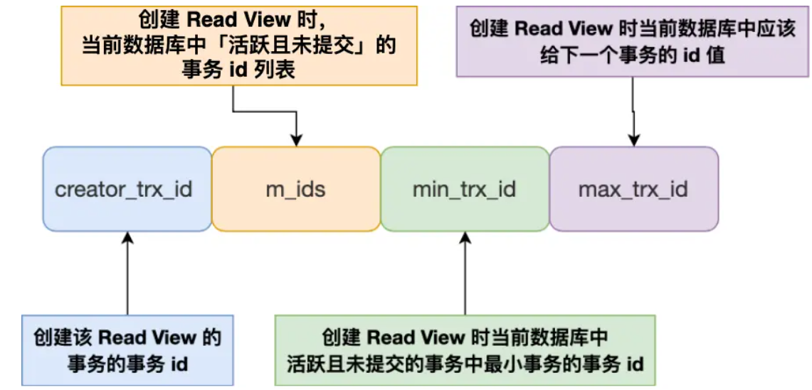

只有在对表中的记录做改动时（执行INSERT、DELETE、UPDATE这些语句时）才会为事务分配事务id，否则在一个只读事务中的事务id值都默认为0。

对于使用 InnoDB 存储引擎的数据库表，它的聚簇索引记录中都包含下面两个隐藏列：

- trx_id，当一个事务对某条聚簇索引记录进行改动时，就会**把该事务的事务 id 记录在 trx_id 隐藏列里**；
- roll_pointer，每次对某条聚簇索引记录进行改动时，都会把旧版本的记录写入到 undo 日志中，然后**这个隐藏列是个指针，指向每一个旧版本记录**，于是就可以通过它找到修改前的记录。

- `trx_id = creator_trx_id`：当前事务在访问它自己修改过的记录，该版本可以被当前事务访问。
- `trx_id <min_trx_id` : 此版本的事务在当前事务生成ReadView前已经提交，可访问
- `trx_id >max_trx_id` : 此版本的事务在当前事务生成ReadView后才开启,不可访问
- `min_trx_id <trx_id<max_trx_id` :判断一下`trx_id`属性值是不是在`m_ids`列表,在表示还活跃不可访问。不在可以访问。

`READ COMMITTD`、`REPEATABLE READ`这两个隔离级别的一个很大不同就是：生成ReadView的时机不同，Read committed在每一次进行普通SELECT操作前都会生成一个ReadView，而Repeatable Read只在第一次进行普通SELECT操作前生成一个ReadView，之后的查询操作都重复使用这个ReadView就好了。

每次生成ReadView意味着已提交的事务会排除在m_ids的列表，因为被更新了，所以当前情况可以读到已提交事务的数据造成不可重复读。

只第一次生成意味着它的版本处于第一次查询时的状态，对新提交时造成的快照忽略，解决了不可重复读。

MySQL InnoDB 引擎的默认隔离级别虽然是「可重复读」，但是它很大程度上避免幻读现象，解决的方案有两种：

- 针对**快照读**（普通 select 语句），是**通过 MVCC 方式解决了幻读**，因为可重复读隔离级别下，事务执行过程中看到的数据，一直跟这个事务启动时看到的数据是一致的，即使中途有其他事务插入了一条数据，是查询不出来这条数据的，所以就很好了避免幻读问题。
- 针对**当前读**（select ... for update 等语句），是**通过 next-key lock（记录锁+间隙锁）方式解决了幻读**，因为当执行 select ... for update 语句的时候，会加上 next-key lock，如果有其他事务在 next-key lock 锁范围内插入了一条记录，那么这个插入语句就会被阻塞，无法成功插入，所以就很好了避免幻读问题。

当AB两个事务，A首次查询时数据5，B在此时插入数据5，由于A是快照读再查询也不会读到。但若A执行更新操作，就会成功更新5。要避免就是先执行更新操作，此时会使用当前读加锁。

只有在聚簇索引记录中才有 trx_id 和 roll_pointer，如果某个查询语句是使用的二级索引来查询，要使用下面的方式判断可见性：
二级索引页面的 Page Header 部分有一个名为 PAGE_MAX_TRX_ID 的属性，执行增删改操作时，更新为max(事务 id ,PAGE_MAX_TRX_ID )， PAGE_MAX_TRX_ID 属性值设置为执行该操作的最大事务 id。
当 SELECT 语句访问某个二级索引记录时，如果 ReadView的 min_trx_id > PAGE_MAX_TRX_ID 属性值？如果是，则说明该页面中的所有记录对该 ReadView 可见；否则利用二级索引记录中的主键值进行回表操作，得到对应的聚簇索引记录后在按照聚簇索引的方式，判断该可见性。

### 锁

MySQL锁可以按模式分类为：乐观锁与悲观锁。按粒度分可以分为全局锁、表级锁、页级锁、行级锁。按属性可以分为：共享锁、排它锁。按状态分为：意向共享锁、意向排它锁。按算法分为：间隙锁、临键锁、记录锁。NOTE : **针对事物才有加锁的意义。**

####全局锁

`flush tables with read lock`添加全局锁，数据库处于只读状态，可以用于全库逻辑备份。但此时会影响业务。可以通过事务的可重复读的隔离，利用Read View进行备份。

#### 表级锁

**表锁**

表锁除了会限制别的线程的读写外，也会限制本线程接下来的读写操作。

**元数据锁**MDL

不需要显示的使用，对数据库表进行操作时，会自动添加，为了保证当用户对表执行 CRUD 操作时，防止其他线程对这个表结构做了变更。在事务提交后才会释放，这意味着**事务执行期间，MDL 是一直持有的**。

申请 MDL 锁的操作会形成一个队列，队列中**写锁获取优先级高于读锁**，一旦出现 MDL 写锁等待，会阻塞后续该表的所有 CRUD 操作。所以若存在MDL阻塞表结构变更后，后续对该表的 select 语句，就都会被阻塞。会有线程爆满的风险。

**意向锁**

了避免增删改在执行时，加的行锁与表锁的冲突，在InnoDB中引入了意向锁，使得表锁不用检查每行数据是否加锁，使用意向锁来减少表锁的检查。

**AUTO-INC 锁**

主键通常都会设置成自增，使用`AUTO_INCREMENT` 属性实现。AUTO-INC 锁是特殊的表锁机制，锁不是再一个事务提交后才释放，而是再执行完插入语句后就会立即释放。它保证了主键是自增连续的。但是， AUTO-INC 锁再对大量数据进行插入的时候，会影响插入性能，因为另一个事务中的插入会被阻塞。

5.1版本后，插入数据的时候，会为被 `AUTO_INCREMENT` 修饰的字段加上轻量级锁，给该字段赋值一个自增的值，就把这个轻量级锁释放。不需要等语句执行后才释放。但是当搭配 binlog 的日志格式是 statement 一起使用的时候，在「主从复制的场景」中会发生**数据不一致的问题**。生成的 id 可能不连续。

事务发生回滚时，赋予的自增值不会回滚导致下次赋予的值不连续。

当两个事务同时执行表插入数据时，A获得id1，2。B获得3。B再插入获得4。binlog 记录这两个 session 的 insert 语句。主从复制时，依据binlog 循序执行可能插入语句执行属性与主库不一致，导致id不连续。要解决这问题，binlog 日志格式要设置为 row，这样在 binlog 里面记录的是主库分配的自增值

####**行级锁**

InnoDB 引擎是支持行级锁的，而 MyISAM 引擎并不支持行级锁

普通的 select 语句是不会对记录加锁的，因为它属于快照读。但可以手动加锁。

对于行级锁，主要分为以下三类：

1. **记录锁**（Record Lock）：锁定单个行记录的锁，防止其他事务对此行进行update和delete。在RC（read commit ）、RR（repeat read）隔离级别下都支持。
2. **间隙锁**（GapLock）：锁定索引记录间隙（不含该记录），确保索引记录间隙不变，防止其他事务在这个间隙进行insert，产生幻读。在RR隔离级别下都支持。比如说 两个临近叶子节点为 15 23，那么间隙就是指 [15 , 23],锁的是这个间隙。
3. **临键锁**（Next-Key Lock）：行锁和间隙锁组合，同时锁住数据，并锁住数据前面的间隙Gap。在RR隔离级别下支持。**左开右闭**。

按属性可以分为

1. 共享锁（S）：允许一个事务去读一行，阻止其他事务获得相同数据集的排它锁。
2. 排他锁（X）：允许获取排他锁的事务更新数据，阻止其他事务获得相同数据集的共享锁和排他锁。

| SQL                          | 行锁类型   | 说明                                     |
| ---------------------------- | ---------- | ---------------------------------------- |
| insert                       | 排他锁     | 自动加锁                                 |
| update                       | 排他锁     | 自动加锁                                 |
| delete                       | 排他锁     | 自动加锁                                 |
| select                       | 不加任何锁 |                                          |
| select　lock　in　share mode | 共享锁     | 需要手动在SELECT之后加LOCK IN SHARE MODE |
| select　for　update          | 排他锁     | 需要手动在SELECT之后加FOR UPDATE         |

**MySQL 是怎么加行级锁的？**

InnoDB的行锁是通过给索引上的索引项加锁来实现的，所以加锁的不是数据本身而是索引。

即使是访问不同行的记录，如果使用了相同的索引键，也是会出现锁冲突的。

在某些场景下，临建锁会退化为**记录锁**或**间隙锁**，即在只使用记录锁或间隙锁就能**避免幻读现象**的场景下，临建锁会退化！

- 唯一索引等值查询：当索引项存在时，next-key lock 退化为 record lock；当索引项不存在时，默认 next-key lock，访问到不满足条件的第一个值后next-key lock退化成gap lock

- 唯一索引范围查询：默认 next-key lock，(特殊’<=’ 范围查询直到访问不满足条件的第一个值为止)

- 非唯一索引等值查询：默认next-key lock ，索引项存在/不存在都是访问到不满足条件的第一个值后next-key lock退化成gap lock

- 非唯一索引范围查询：默认 next-key lock，向右访问到不满足条件的第一个值为止

**update 语句的 where 条件没有使用索引，就会全表扫描，于是就会对所有记录加上 next-key 锁（记录锁 + 间隙锁），相当于把整个表锁住了**。

#### 死锁

解决办法：

- 回滚较小的那个事务
- 在REPEATABLE-READ隔离级别下，如果两个线程同时对相同条件记录用SELECT…FOR UPDATE加排他锁，在没有符合该条件记录情况下，两个线程都会加锁成功。程序发现记录尚不存在，就试图插入一条新记录，如果两个线程都这么做，就会出现死锁。这种情况下，将隔离级别改成READ COMMITTED，就可避免问题。

## Redis

### 数据结构

常见的有五种：**String（字符串），Hash（哈希），List（列表），Set（集合）、Zset（有序集合）**。后面又支持了四种数据类型： **BitMap（2.2 版新增）、HyperLogLog（2.8 版新增）、GEO（3.2 版新增）、Stream（5.0 版新增）**。

Redis是一个键值对数据库，键空间的键就是数据库的键，每个键都是一个字符串对象；键空间的值就是数据库的值，可以是任意一种redis对象

#### String

最基本的 key-value 结构，value其实不仅是字符串， 也可以是数字（整数或浮点数）

底层的数据结构实现主要是 int 和 SDS（简单动态字符串）。SDS 不仅可以保存文本数据，还可以保存二进制数据。使用 `len` 属性记录了字符串长度可以O(1)获得长度。拼接字符串缓冲不足时自动扩容，是安全的。

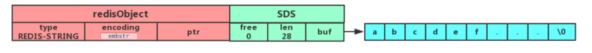

字符串对象的内部编码（encoding）有 3 种 ：**int、raw和 embstr**。embstr小字符串，通过一次内存分配函数来分配一块连续的内存空间来保存。raw大字符串，调用两次内存分配函数来分别分配两块空间来保存。整形数据保存在ptr里面。

应用场景：缓存对象，计数，分布式锁(SET 命令有个 NX 参数可以实现「key不存在才插入」，可以用它来实现分布式锁)，共享Session信息.

~~~java
//设置 key-value 类型的值
set name lin
//根据 key 获得对应的 value
get name
//判断某个 key 是否存在
exists name
//返回 key 所储存的字符串值的长度
strlen name
//删除某个 key 对应的值
del name
//批量设置 key-value 类型的值
mset key1 value1 key2 value2 
//批量获取多个 key 对应的 value
mget key1 key2 
//设置 key-value 类型的值
set number 0
//将 key 中储存的数字值增一
incr number
//将key中存储的数字值加 10
incrby number 10
//将 key 中储存的数字值减一
decr number
//将key中存储的数字值键 10
decrby number 10
//设置 key 在 60 秒后过期（该方法是针对已经存在的key设置过期时间）
expire name  60 
//查看数据还有多久过期
ttl name 
//设置 key-value 类型的值，并设置该key的过期时间为 60 秒
set key  value ex 60
~~~

#### List

List 列表是简单的字符串列表，**按照插入顺序排序**，可以从头部或尾部向 List 列表添加元素。

底层数据结构是由**双向链表或压缩列表**实现

- 如果列表的元素个数小于 `512` 个，列表每个元素的值都小于 `64` 字节，Redis 会使用**压缩列表**作为 List 类型的底层数据结构；
- 如果列表的元素不满足上面的条件，Redis 会使用**双向链表**作为 List 类型的底层数据结构；

压缩列表

它被设计成一种内存紧凑型的数据结构，占用一块连续的内存空间，不仅可以利用 CPU 缓存，而且会针对不同长度的数据，进行相应编码，这种方法可以有效地节省内存开销。


- ***zlbytes***，记录整个压缩列表占用对内存字节数；
- ***zltail***，记录压缩列表「尾部」节点距离起始地址由多少字节，也就是列表尾的偏移量；
- ***zllen***，记录压缩列表包含的节点数量；
- ***zlend***，标记压缩列表的结束点，固定值 0xFF（十进制255）。
- ***prevlen***，记录了「前一个节点」的长度，目的是为了实现从后向前遍历；
- ***encoding***，记录了当前节点实际数据的「类型和长度」，类型主要有两种：字符串和整数。
- ***data***，记录了当前节点的实际数据，类型和长度都由 `encoding` 决定；

压缩列表新增某个元素或修改某个元素时，如果空间不不够，压缩列表占用的内存空间就需要重新分配。而当新插入的元素较大时，可能会导致后续元素的 prevlen 占用空间都发生变化，从而引起「连锁更新」问题，导致每个元素的空间都要重新分配，造成访问压缩列表性能的下降。因此，**压缩列表只会用于保存的节点数量不多的场景**，只要节点数量足够小，即使发生连锁更新，也是能接受的。

在后来的版本中，新增设计了两种数据结构：quicklist（Redis 3.2 引入） 和 listpack（Redis 5.0 引入）。这两种数据结构的设计目标，就是尽可能地保持压缩列表节省内存的优势，同时解决压缩列表的「连锁更新」的问题。

应用场景：消息队列

```java
//将一个或多个值value插入到key列表的表头(最左边)，最后的值在最前面
lpush key value [value ...] 
//将一个或多个值value插入到key列表的表尾(最右边)
rpush key value [value ...]
//移除并返回key列表的头元素
lpop key     
//移除并返回key列表的尾元素
rpop key 
//返回列表key中指定区间内的元素，区间以偏移量start和stop指定，从0开始
lrange key start stop
//从key列表表头弹出一个元素，没有就阻塞timeout秒，如果timeout=0则一直阻塞
blpop key [key ...] timeout
//从key列表表尾弹出一个元素，没有就阻塞timeout秒，如果timeout=0则一直阻塞
brpop key [key ...] timeout
```


#### Hash

Hash 是一个键值对（key - value）集合，其中 value 的形式如： `value=[{field1，value1}，...{fieldN，valueN}]`。Hash 特别适合用于存储对象。

Hash 类型的底层数据结构是由**压缩列表或哈希表**实现的：

- 如果哈希类型元素个数小于 `512` 个，所有值小于 `64` 字节的话，Redis 会使用**压缩列表**作为 Hash 类型的底层数据结构；
- 如果哈希类型元素不满足上面条件，Redis 会使用**哈希表**作为 Hash 类型的 底层数据结构。

**Redis 采用了「链式哈希」来解决哈希冲突**，在不扩容哈希表的前提下，将具有相同哈希值的数据串起来，形成链接起，以便这些数据在表中仍然可以被查询到。

链式哈希局限性也很明显，随着链表长度的增加，在查询这一位置上的数据的耗时就会增加，此时需要进行 rehash，也就是对哈希表的大小进行扩展。

rehash需要两个哈希表，给「哈希表 2」 分配空间，一般会比「哈希表 1」 大一倍（两倍的意思）；将「哈希表 1 」的数据迁移到「哈希表 2」 中；迁移完成后，「哈希表 1 」的空间会被释放，并把「哈希表 2」 设置为「哈希表 1」，然后在「哈希表 2」 新创建一个空白的哈希表，为下次 rehash 做准备。

在 rehash 进行期间，每次哈希表元素进行新增、删除、查找或者更新操作时，Redis 除了会执行对应的操作之外，还会顺序将「哈希表 1 」中索引位置上的所有 key-value 迁移到「哈希表 2」上；

rehash 的触发条件跟**负载因子（load factor）**有关系。负载因子=已保存的节点数量/哈希表大小。

- 当负载因子大于等于 1 ，并且 Redis 没有执行 RDB 快照或没有进行 AOF 重写的时候，就会进行 rehash 操作。
- 当负载因子大于等于 5 时，此时说明哈希冲突非常严重了，不管有没有有在执行 RDB 快照或 AOF 重写，都会强制进行 rehash 操作。

~~~java
//存储一个哈希表key的键值
hset key field value   
//获取哈希表key对应的field键值
hget key field

//在一个哈希表key中存储多个键值对
hmset key field value [field value...] 
//批量获取哈希表key中多个field键值
hmget key field [field ...]       
//删除哈希表key中的field键值
hdel key field [field ...]    

//返回哈希表key中field的数量
hlen key       
//返回哈希表key中所有的键值
hgetall key 

//为哈希表key中field键的值加上增量n
hincrby key field n   
~~~


#### Set

Set 类型是一个无序并唯一的键值集合，它的存储顺序不会按照插入的先后顺序进行存储。

Set 类型的底层数据结构是由**哈希表或整数集合**实现的：

- 如果集合中的元素都是整数且元素个数小于 `512` 个，Redis 会使用**整数集合**作为 Set 类型的底层数据结构；
- 如果集合中的元素不满足上面条件，则 Redis 使用**哈希表**作为 Set 类型的底层数据结构。

整数集合

整数集合本质上是一块连续内存空间，由编码方式encoding、集合元素数量length、保存元素数组contents[]组成。

整数集合会有一个升级规则，就是当我们将一个新元素加入到整数集合里面，如果新元素的类型（int32_t）比整数集合现有所有元素的类型（int16_t）都要长时，整数集合需要先进行升级，也就是按新元素的类型（int32_t）扩展 contents 数组的空间大小，然后才能将新元素加入到整数集合里，当然升级的过程中，也要维持整数集合的有序性。不支持降级。

 Set 类型比较适合用来数据去重和保障数据的唯一性，还可以用来统计多个集合的交集、错集和并集等，当我们存储的数据是无序并且需要去重的情况下，比较适合使用集合类型进行存储。

~~~java
//往集合key中存入元素，元素存在则忽略，若key不存在则新建
sadd key member [member ...]
//从集合key中删除元素
srem key member [member ...] 
//获取集合key中所有元素
smembers key
//获取集合key中的元素个数
scard key
//判断member元素是否存在于集合key中
sismember key member
//从集合key中随机选出count个元素，元素不从key中删除
srandmember key [count]
//从集合key中随机选出count个元素，元素从key中删除
spop key [count]
~~~

####Zset

Zset 类型（有序集合类型）相比于 Set 类型多了一个排序属性 score（分值），对于有序集合 ZSet 来说，每个存储元素相当于有两个值组成的，一个是有序集合的元素值，一个是排序值。

Zset 类型的底层数据结构是由**压缩列表或跳表**实现的：

- 如果有序集合的元素个数小于 `128` 个，并且每个元素的值小于 `64` 字节时，Redis 会使用**压缩列表**作为 Zset 类型的底层数据结构；
- 如果有序集合的元素不满足上面的条件，Redis 会使用**跳表**作为 Zset 类型的底层数据结构；

跳表

跳表的优势是能支持平均 O(logN) 复杂度的节点查找。zset 结构体里有两个数据结构：一个是跳表，一个是哈希表。这样的好处是既能进行高效的范围查询，也能进行高效单点查询。**跳表是在链表基础上改进过来的，实现了一种「多层」的有序链表**，这样的好处是能快读定位数据。

跳跃表的每一层都是一条有序的链表。维护了多条节点路径。最底层的链表包含所有元素。

~~~JAVA
typedef struct zskiplist {
    struct zskiplistNode *header, *tail;
    unsigned long length;
    int level;
} zskipl
    
typedef struct zskiplistNode {
    //Zset 对象的元素值
    sds ele;
    //元素权重值
    double score;
    //后向指针
    struct zskiplistNode *backward;
  
    //节点的level数组，保存每层上的前向指针和跨度
    struct zskiplistLevel {
        struct zskiplistNode *forward;
        unsigned long span;
    } level[];
} zskiplis
~~~


查询

查找一个跳表节点的过程时，跳表会从头节点的最高层开始，逐一遍历每一层。在遍历某一层的跳表节点时，会用跳表节点中的 SDS 类型的元素和元素的权重来进行判断，共有两个判断条件：

- 如果当前节点的权重「小于」要查找的权重时，跳表就会访问该层上的下一个节点。
- 如果当前节点的权重「等于」要查找的权重时，并且当前节点的 SDS 类型数据「小于」要查找的数据时，跳表就会访问该层上的下一个节点。

如果上面两个条件都不满足，或者下一个节点为空时，跳表就会使用目前遍历到的节点的 level 数组里的下一层指针，然后沿着下一层指针继续查找，这就相当于跳到了下一层接着查找。

跳表的相邻两层的节点数量的比例会影响跳表的查询性能。**跳表的相邻两层的节点数量最理想的比例是 2:1，查找复杂度可以降低到 O(logN)**。

在添加元素时，依据查询的方式找到要插入的位置进行链表的插入工作，此时也会考虑层级，会生成范围为[0-1]的一个随机数，如果这个随机数小于 0.25（相当于概率 25%），那么层数就增加 1 层，然后继续生成下一个随机数，直到随机数的结果大于 0.25 结束，最终确定该节点的层数。

在面对需要展示最新列表、排行榜等场景时，如果数据更新频繁或者需要分页显示，可以优先考虑使用 Sorted Set。

**为什么 Zset 的实现用跳表而不用平衡树（如 AVL树、红黑树等）？**

- **从内存占用上来比较，跳表比平衡树更灵活一些**。平衡树每个节点包含 2 个指针（分别指向左右子树），而跳表每个节点包含的指针数目平均为 1/(1-p)，具体取决于参数 p 的大小。如果像 Redis里的实现一样，取 p=1/4，那么平均每个节点包含 1.33 个指针，比平衡树更有优势。
- **在做范围查找的时候，跳表比平衡树操作要简单**。在平衡树上，我们找到指定范围的小值之后，还需要以中序遍历的顺序继续寻找其它不超过大值的节点。如果不对平衡树进行一定的改造，这里的中序遍历并不容易实现。而在跳表上进行范围查找就非常简单，只需要在找到小值之后，对第 1 层链表进行若干步的遍历就可以实现。
- **从算法实现难度上来比较，跳表比平衡树要简单得多**。平衡树的插入和删除操作可能引发子树的调整，逻辑复杂，而跳表的插入和删除只需要修改相邻节点的指针，操作简单又快速

~~~JAVA
//往有序集合key中加入带分值元素
zadd key score member [[score member]...]   
//往有序集合key中删除元素
zrem key member [member...]                 
//返回有序集合key中元素member的分值
zscore key member
//返回有序集合key中元素个数
zcard key 
//为有序集合key中元素member的分值加上increment
zincrby key increment member 
//正序获取有序集合key从start下标到stop下标的元素
zrange key start stop [withscores]
//倒序获取有序集合key从start下标到stop下标的元素
zrevrange key start stop [withscores]
//返回有序集合中指定分数区间内的成员，分数由低到高排序。
zrangebyscore key min max [withscores] [limit offset count]
//返回指定成员区间内的成员，按字典正序排列, 分数必须相同。
zrangebylex key min max [limit offset count]
//返回指定成员区间内的成员，按字典倒序排列, 分数必须相同
zrevrangebylex key max min [limit offset count]
~~~

**quicklist**

其实 quicklist 就是「双向链表 + 压缩列表」组合，因为一个 quicklist 就是一个链表，而链表中的每个元素又是一个压缩列表。虽然压缩列表是通过紧凑型的内存布局节省了内存开销，但是因为它的结构设计，如果保存的元素数量增加，或者元素变大了，压缩列表会有「连锁更新」的风险，一旦发生，会造成性能下降。quicklist 解决办法，**通过控制每个链表节点中的压缩列表的大小或者元素个数，来规避连锁更新的问题。因为压缩列表元素越少或越小，连锁更新带来的影响就越小，从而提供了更好的访问性能。**

listpack 中每个节点不再包含前一个节点的长度了，从结构上避免了连锁更新。

#### BitMap

Bitmap，即位图，是一串连续的二进制数组（0和1），可以通过偏移量（offset）定位元素。BitMap通过最小的单位bit来进行`0|1`的设置，表示某个元素的值或者状态，时间复杂度为O(1)。

Bitmap 本身是用 String 类型作为底层数据结构实现的一种统计二值状态的数据类型。

#### HyperLogLog

一种用于「统计基数」的数据集合类型，基数统计就是指统计一个集合中不重复的元素个数。HyperLogLog 是统计规则是基于概率完成的，不是非常准确.

HyperLogLog 的优点是，在输入元素的数量或者体积非常非常大时，计算基数所需的内存空间总是固定的、并且是很小的。

#### GEO

主要用于存储地理位置信息，并对存储的信息进行操作。

GEO 本身并没有设计新的底层数据结构，而是直接使用了 Sorted Set 集合类型。

####Stream

Redis 专门为消息队列设计的数据类型。它支持消息的持久化、支持自动生成全局唯一 ID、支持 ack 确认消息的模式、支持消费组模式等，让消息队列更加的稳定和可靠。

### 持久化

Redis 共有三种数据持久化的方式：

- **AOF 日志**：每执行一条写操作命令，就把该命令以追加的方式写入到一个文件里；
- **RDB 快照**：将某一时刻的内存数据，以二进制的方式写入磁盘；
- **混合持久化方式**：Redis 4.0 新增的方式，集成了 AOF 和 RBD 的优点；

####AOF 日志

Redis 在执行完一条写操作命令后，就会把该命令以追加的方式写入到一个文件里，然后 Redis 重启时，会读取该文件记录的命令，然后逐一执行命令的方式来进行数据恢复。

Reids 是先执行写操作命令后，才将该命令记录到 AOF 日志里的，这么做其实有两个好处，**避免额外的检查开销**，**不会阻塞当前写操作命令的执行**。当然，这样做也会带来风险：**数据可能会丢**，**可能阻塞其他操作**

**AOF 写回策略**

1. Redis 执行完写操作命令后，会将命令追加到 server.aof_buf 缓冲区；
2. 然后通过 write() 系统调用，将 aof_buf 缓冲区的数据写入到 AOF 文件，此时数据并没有写入到硬盘，而是拷贝到了内核缓冲区 page cache，等待内核将数据写入硬盘；
3. 具体内核缓冲区的数据什么时候写入到硬盘，由内核决定

Redis 提供了 3 种写回硬盘的策略：

**Always**：每次写操作命令执行完后，同步将 AOF 日志数据写回硬盘

**Everysec**：每次写操作命令执行完后，先将命令写入到 AOF 文件的内核缓冲区，然后每隔一秒将缓冲区里的内容写回到硬盘

**No**：不由 Redis 控制写回硬盘的时机，转交给操作系统控制写回的时机

**AOF 重写机制**

AOF 日志过大，会触发 **AOF 重写机制**，来压缩 AOF 文件。使用重写机制后，就会读取最新的键值对 ，将设置命令记录到新的 AOF 文件，消除无用的历史命令。重写 AOF 日志的过程**由后台子进程bgrewriteaof 来完成的**，从而避免阻塞主进程。不使用线程的原因是线程之间会共享内存，那么在修改共享内存数据的时候，需要通过加锁来保证数据的安全，而这样就会降低性能。

但是重写过程中，主进程依然可以正常处理命令，会产生数据不一致问题。Redis 设置了一个 **AOF 重写缓冲区**在创建 bgrewriteaof 子进程之后使用，重写过程将命令写入到 「AOF 缓冲区」和 「AOF 重写缓冲区」。主进程收到重写完成信号后，将缓冲区内容追加到新AOF文件中。

####RDB 快照

RDB 快照就是记录某一个瞬间的内存数据，记录的是实际数据，而 AOF 文件记录的是命令操作的日志，而不是实际的数据。 RDB 恢复数据的效率会比 AOF 高。

Redis 的快照是**全量快照**，也就是说每次执行快照，都是把内存中的「所有数据」都记录到磁盘中。Redis 提供了save 和 bgsave两个命令来生成 RDB 文件。

- 执行了 save 命令，就会在主线程生成 RDB 文件，由于和执行操作命令在同一个线程，所以如果写入 RDB 文件的时间太长，**会阻塞主线程**；
- 执行了 bgsave 命令，会创建一个子进程来生成 RDB 文件，这样可以**避免主线程的阻塞**；

**写时复制技术**

执行 bgsave 命令的时候，会通过 fork() 创建子进程，此时子进程和父进程是共享同一片内存数据。主进程执行写操作，则被修改的数据会复制一份副本，然后 bgsave 子进程会把旧数据写入 RDB 文件。

Redis 在使用 bgsave 快照过程中，如果主线程修改了内存数据，不管是否是共享的内存数据，RDB 快照都无法写入主线程刚修改的数据，因为此时主线程（父进程）的内存数据和子进程的内存数据已经分离了，子进程写入到 RDB 文件的内存数据只能是原本的内存数据。

#### 混合持久化

混合持久化，既保证了 Redis 重启速度，又降低数据丢失风险。

混合持久化工作在 **AOF 日志重写过程**，

重写子进程会先将与主线程共享的内存数据以 RDB 方式写入到 AOF 文件，然后主线程处理的操作命令会被记录在重写缓冲区里，重写缓冲区里的增量命令会以 AOF 方式写入到 AOF 文件。使用了混合持久化，AOF 文件的**前半部分是 RDB 格式的全量数据，后半部分是 AOF 格式的增量数据**。

### 主从复制

主从复制是 Redis 高可用服务的最基础的保证，实现方案就是将从前的一台 Redis 服务器，同步数据到多台从 Redis 服务器上，即一主多从的模式，且主从服务器之间采用的是「读写分离」的方式。主服务器可以进行读写操作，从服务器一般是只读，并接受主服务器同步过来写操作命令。主从服务器之间的命令复制是**异步**进行的，所以无法实现强一致性保证。

**应对主从数据不一致？**

保证主从节点间的网络连接状况良好。开发一个外部程序来监控主从节点间的复制进度。用 INFO replication 命令查到主、从节点的进度，然后，我们用 master_repl_offset 减去 slave_repl_offset，得到从节点和主节点间的复制进度差。若大于我们预设的阈值，可以禁止读取

master_repl_offset是复制流中的一个偏移量，master处理完写入命令后，会把命令的字节长度做累加记录，统计在该字段。该字段也是实现部分复制的关键字段。

slave_repl_offset同样也是一个偏移量，从节点收到主节点发送的命令后，累加自身的偏移量，通过比较主从节点的复制偏移量可以判断主从节点数据是否一致。

**第一次同步**

使用 `replicaof`命令形成主服务器和从服务器的关系。第一次同步的过程可分为三个阶段：

- 第一阶段是建立链接、协商同步；
- 第二阶段是主服务器同步数据给从服务器；
- 第三阶段是主服务器发送新写操作命令给从服务器。

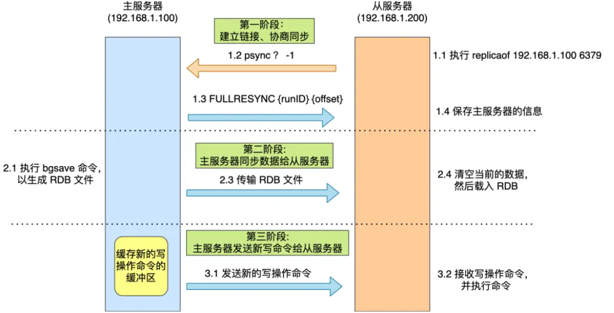

执行了 replicaof 命令后，从服务器就会给主服务器发送 `psync` 命令，表示要进行数据同步。主服务器收到 psync 命令后，会用 `FULLRESYNC` (**全量复制**)作为响应命令返回给对方。接着，主服务器会执行 bgsave 命令来生成 RDB 文件，然后把文件发送给从服务器。在生成、发送和从服务器加载时间的写命令会写入replication buffer 缓冲区。在主服务器生成的 RDB 文件发送完，从服务器收到 RDB 文件后，丢弃所有旧数据，将 RDB 数据载入到内存。完成 RDB 的载入后，会回复一个确认消息给主服务器。接着，主服务器将 replication buffer 缓冲区里所记录的写操作命令发送给从服务器。

**命令传播**

主从服务器在完成第一次同步后，双方之间就会维护一个 TCP 长连接。后续主服务器可以通过这个连接继续将写操作命令传播给从服务器。

从服务器可以有自己的从服务器，分摊主服务器的压力。


**增量复制**

主从服务器在命令同步时出现了网络断开又恢复的情况,TCP 长连接断开后，数据不一致。为了解决全量复制开销大的问题，使用增量复制的方式，只会把网络断开期间主服务器接收到的写操作命令，同步给从服务器。

- 从服务器在恢复网络后，会发送 psync 命令给主服务器，此时的 psync 命令里的 offset 参数不是 -1；
- 主服务器收到该命令后，然后用 CONTINUE 响应命令告诉从服务器接下来采用增量复制的方式同步数据；
- 然后主服务将主从服务器断线期间，所执行的写命令发送给从服务器，然后从服务器执行这些命令。

网络断开后，当从服务器重新连上主服务器时，从服务器会通过 psync 命令将自己的复制偏移量 slave_repl_offset 发送给主服务器，主服务器根据自己的 master_repl_offset 和 slave_repl_offset 之间的差距，然后来决定对从服务器执行哪种同步操作，判断出从服务器要读取的数据还在 repl_backlog_buffer 缓冲区里，那么主服务器将采用**增量同步**的方式；

**repl_backlog_buffer**，是一个「**环形**」缓冲区，用于主从服务器断连后，从中找到差异的数据；在主服务器进行命令传播时，不仅会将写命令发送给从服务器，还会将写命令写入到 repl_backlog_buffer 缓冲区里，因此 这个缓冲区里会保存着最近传播的写命令。

Redis 判断节点是否正常工作，基本都是通过互相的 ping-pong 心态检测机制，如果有一半以上的节点去 ping 一个节点的时候没有 pong 回应，集群就会认为这个节点挂掉了，会断开与这个节点的连接

**Buffer(replication buffer 、repl backlog buffer)**

- 出现的阶段不一样：
  - repl backlog buffer 是在增量复制阶段出现，**一个主节点只分配一个 repl backlog buffer**；
  - replication buffer 是在全量复制阶段和增量复制阶段都会出现，**主节点会给每个新连接的从节点，分配一个 replication buffer**；
- 这两个 Buffer 都有大小限制的，当缓冲区满了之后，发生的事情不一样：
  - 当 repl backlog buffer 满了，因为是环形结构，会直接**覆盖起始位置数据**;
  - 当 replication buffer 满了，会导致连接断开，删除缓存，从节点重新连接，**重新开始全量复制**。

**数据丢失**

主从切换过程中，产生数据丢失的情况有两种：

**异步复制同步丢失**

主节点还没来得及同步给从节点时发生了断电，那么主节点内存中的数据会丢失。可以配置min-slaves-max-lag。如果数据同步完成所需要时间超过设定值，主节点会拒绝新写入请求。

**集群产生脑裂数据丢失**

由于网络问题，集群节点之间失去联系。主从数据不同步；重新平衡选举，产生两个主服务。等网络恢复，旧主节点会降级为从节点，再与新主节点进行同步复制的时候，由于会从节点会清空自己的缓冲区，所以导致之前客户端写入的数据丢失了。

当主节点发现「从节点下线的数量太多」，或者「网络延迟太大」的时候，那么主节点会禁止写操作，直接把错误返回给客户端。

###哨兵模式

Redis 主从服务,当 Redis 的主从服务器出现故障宕机时，需要手动进行恢复。哨兵模式可以监控主从服务器，并且提供**主从节点故障转移的功能。**哨兵节点主要负责三件事情：**监控、选主、通知**。

为了更加“客观”的判断主节点故障，哨兵是以哨兵集群的方式存在的。哨兵节点至少要有 3 个。防止可能挂掉一个无法选举leader。因为leader需要大于半数，2个节点相当leader需要2票，若挂掉一个无法成功选举。

哨兵会每隔 1 秒给所有主从节点发送 PING 命令，当主从节点收到 PING 命令后，会发送一个响应命令给哨兵。如果主节点或者从节点没有在规定的时间内响应哨兵的 PING 命令，哨兵就会将它们标记为「**主观下线**」。

当一个哨兵判断主节点为「主观下线」后，就会向其他哨兵发起命令，其他哨兵收到这个命令后，就会根据自身和主节点的网络状况，做出赞成投票或者拒绝投票的响应。赞成票达成阈值后主节点就会被该哨兵标记为「客观下线」。客观下线只适用于主节点。

哨兵节点判断主节点为「客观下线」，此节点被列为候选者来竞争Leader 。候选者会向其他哨兵发送命令来投票，拿到半数以上的赞成票且大于等于哨兵配置文件中的 quorum 值的为leader，进行主从故障转移

**主从故障转移的过程**

- 第一步：在已下线主节点（旧主节点）属下的所有「从节点」里面，挑选出一个从节点，并将其转换为主节点。
- 第二步：让已下线主节点属下的所有「从节点」修改复制目标，修改为复制「新主节点」；
- 第三步：将新主节点的 IP 地址和信息，通过「发布者/订阅者机制」通知给客户端；
- 第四步：继续监视旧主节点，当这个旧主节点重新上线时，将它设置为新主节点的从节点；

新主节点选择：把网络状态不好的从节点过滤掉，对所有从节点进行三轮考察：**优先级、复制进度、ID 号**。选择优先级排名前，从主节点复制数据多，ID小的依次排序。

当新主节点出现之后，哨兵 leader 下一步要做的就是，让已下线主节点属下的所有「从节点」指向「新主节点」，这一动作可以通过向「从节点」发送 `SLAVEOF` 命令来实现。

通过 Redis 的发布者/订阅者机制来通知给客户端新主节点的信息(客户端订阅哨兵)

故障转移操作最后要做的是，继续监视旧主节点，当旧主节点重新上线时，哨兵集群就会向它发送 `SLAVEOF` 命令，让它成为新主节点的从节点

**哨兵节点之间是通过 Redis 的发布者/订阅者机制来相互发现的**。

####切片集群模式

当 Redis 缓存数据量大到一台服务器无法缓存时，就需要使用 **Redis 切片集群**Redis Cluster方案。将数据分布在不同的服务器上，以此来降低系统对单主节点的依赖。

Redis Cluster 方案采用哈希槽（Hash Slot），来处理数据和节点之间的映射关系。在 Redis Cluster 方案中，**一个切片集群共有 16384 个哈希槽**，这些哈希槽类似于数据分区，每个键值对都会根据它的 key，被映射到一个哈希槽中，具体执行过程分为两大步：

- 根据键值对的 key，按照 CRC16 算法 (opens new window)计算一个 16 bit 的值。
- 再用 16bit 值对 16384 取模，得到 0~16383 范围内的模数，每个模数代表一个相应编号的哈希槽。

### 缓存设计

####缓存雪崩

为了保证缓存中的数据与数据库中的数据一致性，会给 Redis 里的数据设置过期时间，当大量缓存数据在同一时间过期（失效）时，如果此时有大量的用户请求，都无法在 Redis 中处理，于是全部请求都直接访问数据库，从而导致数据库的压力骤增，严重的会造成数据库宕机，从而形成一系列连锁反应，造成整个系统崩溃，这就是缓存雪崩。

**方案解决**

大量数据同时过期

- **将缓存失效时间随机打散：** 我们可以在原有的失效时间基础上增加一个随机值（比如 1 到 10 分钟）这样每个缓存的过期时间都不重复了，也就降低了缓存集体失效的概率。
- **互斥锁：**如果发现访问的数据不在 Redis 里，就加个互斥锁，保证同一时间内只有一个请求来构建缓存
- **设置缓存不过期：** 我们可以通过后台服务来更新缓存数据，从而避免因为缓存失效造成的缓存雪崩，也可以在一定程度上避免缓存并发问题。

Redis 故障宕机

- 服务熔断或请求限流机制，暂停业务应用对缓存服务的访问，直接返回错误或只处理少部分请求。
- 构建 Redis 缓存高可靠集群，通过**主从节点的方式构建 Redis 缓存高可靠集群**。

####缓存击穿

被频繁地访问的数据被称为热点数据。缓存中的**某个热点数据过期**了，此时大量的请求访问了该热点数据，就无法从缓存中读取，直接访问数据库，数据库很容易就被高并发的请求冲垮，这就是**缓存击穿**的问题。缓存击穿是缓存雪崩的一个子集。 

**方案解决**

- 互斥锁方案（Redis 中使用 setNX 方法设置一个状态位，表示这是一种锁定状态），保证同一时间只有一个业务线程请求缓存，未能获取互斥锁的请求，要么等待锁释放后重新读取缓存，要么就返回空值或者默认值。
- 不给热点数据设置过期时间，由后台异步更新缓存，或者在热点数据准备要过期前，提前通知后台线程更新缓存以及重新设置过期时间；

####缓存穿透

当发生缓存雪崩或击穿时，数据库中还是保存了应用要访问的数据，一旦缓存恢复相对应的数据，就可以减轻数据库的压力。当用户访问的数据，**既不在缓存中，也不在数据库中**，导致请求在访问缓存时，发现缓存缺失，再去访问数据库时，发现数据库中也没有要访问的数据，没办法构建缓存数据，来服务后续的请求。那么当有大量这样的请求到来时，数据库的压力骤增，这就是**缓存穿透**的问题。

缓存穿透的发生一般有这两种情况：业务误操作，数据被删除。黑客恶意大量访问不存在的数据。

**方案解决**

- **非法请求的限制**：当有大量恶意请求访问不存在的数据的时候，也会发生缓存穿透，因此在 API 入口处我们要判断求请求参数是否合理，请求参数是否含有非法值、请求字段是否存在，如果判断出是恶意请求就直接返回错误，避免进一步访问缓存和数据库。
- **设置空值或者默认值**：当我们线上业务发现缓存穿透的现象时，可以针对查询的数据，在缓存中设置一个空值或者默认值，这样后续请求就可以从缓存中读取到空值或者默认值，返回给应用，而不会继续查询数据库。
- **使用布隆过滤器快速判断数据是否存在，避免通过查询数据库来判断数据是否存在**：我们可以在写入数据库数据时，使用布隆过滤器做个标记，然后在用户请求到来时，业务线程确认缓存失效后，可以通过查询布隆过滤器快速判断数据是否存在，如果不存在，就不用通过查询数据库来判断数据是否存在，即使发生了缓存穿透，大量请求只会查询 Redis 和布隆过滤器，而不会查询数据库，保证了数据库能正常运行，Redis 自身也是支持布隆过滤器的。

**布隆过滤器**

布隆过滤器由「初始值都为 0 的位图数组」和「 N 个哈希函数」两部分组成。使用 N 个哈希函数分别对数据做哈希计算，得到 N 个哈希值； N 个哈希值对位图数组的长度取模，得到每个哈希值在位图数组的对应位置。设置为1。当应用要查询数据 x 是否数据库时，只需要使用N个哈希函数计算哈希值取模后比较位图位置即可。但可能由于哈希冲突存在误判。

减少布隆过滤器的误判：增加二进制位数组的长度。增加Hash函数。

#### 动态缓存热点数据

热点数据动态缓存的策略总体思路：**通过数据最新访问时间来做排名，并过滤掉不常访问的数据，只留下经常访问的数据**。

- 先通过缓存系统做一个排序队列（比如存放 1000 个商品），系统会根据商品的访问时间，更新队列信息，越是最近访问的商品排名越靠前；
- 同时系统会定期过滤掉队列中排名最后的 200 个商品，然后再从数据库中随机读取出 200 个商品加入队列中；
- 这样当请求每次到达的时候，会先从队列中获取商品 ID，如果命中，就根据 ID 再从另一个缓存数据结构中读取实际的商品信息，并返回。

####缓存更新策略

- Cache Aside（旁路缓存）策略；
- Read/Write Through（读穿 / 写穿）策略；
- Write Back（写回）策略；

Cache Aside（旁路缓存）策略是最常用的，应用程序直接与「数据库、缓存」交互，并负责对缓存的维护，该策略又可以细分为「读策略」和「写策略」。

**写策略的步骤：**

- 先更新数据库中的数据，再删除缓存中的数据。

**读策略的步骤：**

- 如果读取的数据命中了缓存，则直接返回数据；
- 如果读取的数据没有命中缓存，则从数据库中读取数据，然后将数据写入到缓存，并且返回给用户。

Read/Write Through（读穿 / 写穿）策略原则是应用程序只和缓存交互，不再和数据库交互，而是由缓存和数据库交互，相当于更新数据库的操作由缓存自己代理了。

Write Back（写回）策略在更新数据的时候，只更新缓存，同时将缓存数据设置为脏的，然后立马返回，并不会更新数据库。对于数据库的更新，会通过批量异步更新的方式进行。

#### 数据库和缓存一致性

有了缓存，那么在数据更新时，不仅要更新数据库，而且要更新缓存。

无论是「先更新数据库，再更新缓存」，还是「先更新缓存，再更新数据库」，这两个方案都存在并发问题，当两个请求并发更新同一条数据的时候，可能会出现缓存和数据库中的数据不一致的现象。

**Cache Aside 策略**：更新数据时，**不更新缓存，而是删除缓存中的数据。然后，到读取数据时，发现缓存中没了数据之后，再从数据库中读取数据，更新到缓存中。**策略又分写策略与读策略。

写策略中，先更新数据库，再删除缓存较好，因为缓存写入速度快，实际中很难遇到数据库写缓存过程中又更新了数据库的情况。

**其他方案的问题解决**

「先更新数据库，再删除缓存」的方案虽然保证了数据库与缓存的数据一致性，但是每次更新数据的时候，缓存的数据都会被删除，这样会对缓存的命中率带来影响。**我们可以采用「更新数据库 + 更新缓存」的方案**，在更新缓存前先加个**分布式锁**，保证同一时间只运行一个请求更新缓存。在更新完缓存时，给缓存加上较短的**过期时间**，这样即时出现缓存不一致的情况，缓存的数据也会很快过期，对业务还是能接受的。

**「先删除缓存，再更新数据库」**方案在「读 + 写」并发请求而造成缓存不一致的解决办法是「**延迟双删**」。先删除缓存再更新数据库。再加了睡眠时间，再删除一次缓存。防止删完缓存之后还未更新数据库之前又来查询数据将旧数据又缓存进去的情况

对于先更新数据库，再删除缓存。但我们要保证更新数据库与删除缓存**两个操作都能成功**。

- 重试机制。
- 订阅 MySQL binlog，再操作缓存。

引入**消息队列**，将第二个操作（删除缓存）要操作的数据加入到消息队列，由消费者来操作数据。如果应用**删除缓存失败**，可以从消息队列中重新读取数据，然后再次删除缓存。如果**删除缓存成功**，就要把数据从消息队列中移除。

「**先更新数据库，再删缓存**」的策略的第一步是更新数据库，那么更新数据库成功，就会产生一条变更日志，记录在 binlog 里。通过订阅 binlog 日志，拿到具体要操作的数据，然后再执行缓存删除

## JVM

###内存结构


**虚拟机栈**：每个线程运行时所需要的内存，每个风法被执行时都会在虚拟机栈中船舰一个栈帧。不需要GC

- 局部变量表：存储方法里java基本数据类型及对象引用

- 动态链接：指向运行时常量池的方法引用

- 方法的返回地址：方法正常退出或者异常退出的定义

- 操作数栈：方法执行过程中，依据字节码往栈中写入或者提取数据。

**本地方法栈**：为虚拟机执行本地方法时提供服务的，如JNI，不需要GC

**程序计数器**：内部保存字节码的行号，用于记录正在执行的字节码指令地址，不会存在内存溢出，不进行GC

**堆**：是 JVM 内存中最大的一块，由所有线程共享，由垃圾回收器管理的主要区域，堆中对象大部分都需要考虑线程安全的问题

- 对象实例：类初始化生成的对象，基本数据类型的数组也是对象实例，new 创建对象都使用堆内存

- 字符串常量池：字符串常量池存储的是 String 对象的直接引用或者对象
- 静态变量：是有 static 修饰的变量，属于类的信息
- 线程分配缓冲区：为每个线程在堆内单独分配了一个缓冲区，多线程分配内存 时，使用 TLAB 可以避免线程安全问题，可以提升对象分配的效率。分配内存失败时，JVM 就会通过使用加锁机制确保数据操作的原子性，从而直接在堆中 分配内存

**本地内存**：线程共享的区域，本地内存这块区域是不会受到 JVM 的控制的，不会发生 GC；

**方法区**：用于存储已被虚拟机加载的类信息、常量、即时编译器编译后的代码等数据

- 常量池表：是 Class 文件的一部分，存储了类在编译期间生成的字面量、符号引用，JVM 为每个已加载的类维护一个常量池。字面量：基本数据类型、字符串类型常量、声明为 final 的常量值等；符号引用：类、字段、方法、接口等的符号引用
- 运行时常量池：常量池中的数据会在类加载的加载阶段放入运行时常量池

**内存分配**

如果内存规整，使用指针碰撞（Bump The Pointer）。所有用过的内存在一边，空闲的内存在另 外一边，中间有一个指针作为分界点的指示器，分配内存就仅仅是把指针向空闲那边挪动一段与对 象大小相等的距离 

如果内存不规整，虚拟机需要维护一个空闲列表（Free List）分配。已使用的内存和未使用的内存相互交错，虚拟机维护了一个列表，记录上哪些内存块是可用的，再分配的时候从列表中找到一块 足够大的空间划分给对象实例，并更新列表上的内容

内存分配并发问题：1. 使用线程分配缓冲区，为每个线程在堆内单独分配了一个缓冲区，多线程分配内存 时，使用 TLAB 可以避免线程安全问题。2. CAS+失败重试

### 垃圾回收GC

内存垃圾回收机制主要集中的区域就是线程共享区域：**堆和方法区**

Minor GC：回收新生代，新生代对象存活时间很短，所以 Minor GC 会频繁执行，执行的速度比较快

Full GC：回收老年代和新生代，老年代对象其存活时间长，所以 Full GC 很少执行，执行速度会比 Minor GC 慢很多

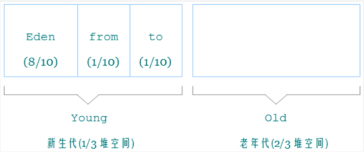

**分带**

Java8 时，堆被分为了两份：新生代和老年代（1:2），新生代里有 3 个分区：Eden、To Survivor、From Survivor。在 Java7 时，还存在一个永久代。

工作机制：

- 对象优先在 Eden 分配：当创建一个对象的时候，对象会被分配在新生代的 Eden 区，当 Eden 区 要满了时候，触发 Minor GC
- 当进行 Minor GC后，此时在 Eden 区存活的对象被移动到 to 区，并且当前对象的年龄会加 1，清 空 Eden 区 
- 当再一次触发 Minor GC的时候，会把 Eden 区中存活下来的对象和 to 中的对象，移动到 from 区 中，这些对象的年龄会加 1，清空 Eden 区和 to 区 
- 每次 MinorGC 后From 、From 两个区域名称互换 ，有数据的叫From ，无数据的为To。(上面描述没有换名称)

晋升到老年代：

- 长期存活的对象进入老年代：为对象定义年龄计数器，对象在 Eden 出生并经过 Minor GC 依然存活，将移动到 Survivor 中，年龄就增加 1 岁，增加到一定年龄则移动到老年代中
- 大对象直接进入老年代：需要连续内存空间的对象，最典型的大对象是很长的字符串以及数组；避免在 Eden 和 Survivor 之间的大量复制；经常出现大对象会提前触发 GC 以获取足够的连续空间分配给大对象
- 动态对象年龄判定：如果在 Survivor 区中相同年龄的对象的所有大小之和超过 Survivor 空间的一 半，年龄大于等于该年龄的对象就可以直接进入老年代

空间分配担保：

在发生 Minor GC 之前，虚拟机先检查老年代最大可用的连续空间是否大于新生代所有对象总空 间，如果条件成立的话，那么 Minor GC 可以确认是安全的，如果不成立，虚拟机会查看 HandlePromotionFailure 的值是否允许担保失败，如果允许那么就会 继续检查老年代最大可用的连续空间是否大于历次晋升到老年代对象的平均大小，如果大于将尝试 着进行一次 Minor GC；如果小于或者 HandlePromotionFailure 的值不允许冒险，那么就要进行 一次 Full GC。

触发full gc条件：调用 System.gc()、老年代空间不足、空间分配担保失败。程序执行时并非在所有地方都能停顿下来开始 GC，只有在安全点才能停下。

**垃圾判断**

如果一个或多个对象没有任何的引用指向它了，那么这个对象现在就是垃圾。

强引用：被强引用关联的对象不会被回收，只有所有 GCRoots 都不通过强引用引用该对象，才能被垃圾回收

软引用（SoftReference）：被软引用关联的对象只有在内存不够的情况下才会被回收

弱引用（WeakReference）：被弱引用关联的对象一定会被回收，只能存活到下一次垃圾回收发生 之前

虚引用（PhantomReference）：也称为幽灵引用或者幻影引用，是所有引用类型中最弱的一个，用于跟踪垃圾回收过程，能在这个对象被回收时收到一个系统通知

**引用计数法**：对每个对象保存一个整型的引用计数器属性，用于记录对象被引用的情况。对于一个对象 A，只要有任何一个对象引用了 A，则 A 的引用计数器就加 1；当引用失效 时，引用计数器就减 1；当对象 A 的引用计数器的值为 0，即表示对象A不可能再被使用，可进行回收**。**

缺点： 每次对象被引用时，都需要去更新计数器，有一点时间开销 浪费 CPU 资源，即使内存够用，仍然在运行时进行计数器的统计。 **无法解决循环引用问题，会引发内存泄露**（最大的缺点）

**可达性分析**：以根对象集合（GCRoots）为起始点，从上至下的方式搜索被根对象集合所连接的目标对象。可达性分析算法后，内存中的存活对象都会被根对象集合直接或间接连接着，搜索走过的路径称为引用链。没有连着的就是垃圾对象。

根对象：虚拟机栈中局部变量表中引用的对象、本地方法栈中引用的对象、堆中类静态属性引用的对象、方法区中的常量引用的对象、字符串常量池里的引用、同步锁 synchronized 持有的对象

**三色标记**：三色标记法把遍历对象图过程中遇到的对象，标记成以下三种颜色： 

白色：尚未访问过 

灰色：本对象已访问过，但是本对象引用到的其他对象尚未全部访问 

黑色：本对象已访问过，而且本对象引用到的其他对象也全部访问完成

- 1 初始时，所有对象都在白色集合 ，
- 2 将 GC Roots 直接引用到的对象挪到灰色集合，
- 3 从灰色集合中获取对象： 将本对象引用到的其他对象全部挪到灰色集合中，将本对象挪到黑色集合里面 
- 4 重复步骤 3，直至灰色集合为空时结束 
- 5 结束后，仍在白色集合的对象即为 GC Roots 不可达，可以进行回收

并发标记时，对象间的引用可能发生变化，多标和漏标的情况就有可能发生。多标：A线程断开了引用，但B线程已将标记了灰色(断开后应该是白色)。漏标：A线程断开了引用，标记了白色，但B线程又添加了引用(因为有了引用应当是灰色)。

多标情况下，本该回收的垃圾没有回收，这种垃圾为浮动垃圾，但下一轮垃圾回收就会回收。但漏标将本不该清理的清理了，会影响程序的正确性。

~~~java
//漏标情况举例
Object G = objE.fieldG; // 读，代表原始存在引用
objE.fieldG = null; // 写    断开原始的引用
objD.fieldG = G; // 写		又添加了新的引用
~~~

解决：添加读写屏障。

- 写屏障+增量更新。黑色对象新增引用，会将黑色对象变成灰色对象，最后对该节点重新扫描

- 写屏障+原始快照：：当原来成员变量的引用发生变化之前，记录下原来的引用对象。使用原来的对象关系。但这可能会导致浮点垃圾。

#### 回收算法

**复制算法**

复制算法的核心就是，将原有的内存空间一分为二，每次只用其中的一块，在垃圾回收时，将正在使用 的对象复制到另一个内存空间中，然后将该内存空间清理，交换两个内存的角色，完成垃圾的回收。

优点：简单、快。保证空间连续无碎片。

缺点：只使用内存的一半

**标记清除**

标记清除算法，是将垃圾回收分为两个阶段，分别是标记和清除。第一阶段标记引用对象(和可达分析应用，使用根节点标记)，第二阶段，将无引用的垃圾清除，并将维护空闲链表方便找到空闲空间。

缺点：标记、清除效率不高。产生碎片，需要维护空闲链表。

**标记整理**

清理阶段先将存活对象都向内存另一端移动，然后清理边界以外的垃圾，从而解决了 碎片化的问题。但需要移动大量对象，处理效率低。

**STW**：指在执行垃圾回收的过程冻结所有用户线程的运行，直到垃圾回收线程执行结束。目前主流的虚拟机采用的都是可达性算法，算法的核心是利用根对象作为起始点，根据对象之间的引用关系，即引用链，通过遍历引用链来判断对象的是否存活。然而，可达性分析算法要求全过程都基于一个能保障一致性的快照中才能够进行分析，简单来说，就是必须全程冻结用户线程的运行。

实现上Stop-The-World 需要所有的用户线程处于 SafePoint，这意味着某个用户线程运行到 SafePoint，其它用户线程可能处于不同的状态。SafePoint 就是一个安全点，可以理解为用户线程执行过程中的一些特殊位置。SafePoint 保存了当前线程的 上下文。

所有线程都到达Safepoint，有两种方法：

◉ 抢占式中断(Preemptive Suspension)
JVM会中断所有线程，然后依次检查每个线程中断的位置是否为Safepoint，如果不是则恢复用户线程，让它执行至 Safepoint 再阻塞。

◉ 主动式中断(Voluntary Suspension)
大部分 JVM 实现都是采用主动式中断，需要阻塞用户线程的时候，首先做一个标志，用户线程会主动轮询这个标志位，如果标志位处于就绪状态，就自行中断。

#### 垃圾回收器


新生代收集器：Serial、ParNew、Parallel Scavenge 

老年代收集器：Serial old、Parallel old、CMS

整堆收集器：G1

吞吐量：程序的运行时间占总运行时间的比例（总运行时间 = 程序的运行时间 + 内存回收的时间）

**Serial**

串行垃圾收集器，作用于新生代，是指使用单线程进行垃圾回收，采用复制算法。使用STW机制

 STW 机制：垃圾回收时，只有一个线程在工作，并且 Java 应用中的所有线程都要暂停，等待垃圾回收的完成。

**Serial old**

老年代垃圾回收的串行收集器，内存回收算法使用的是**标记-整理**算法，同样也采用了 串行回收和 STW 机制

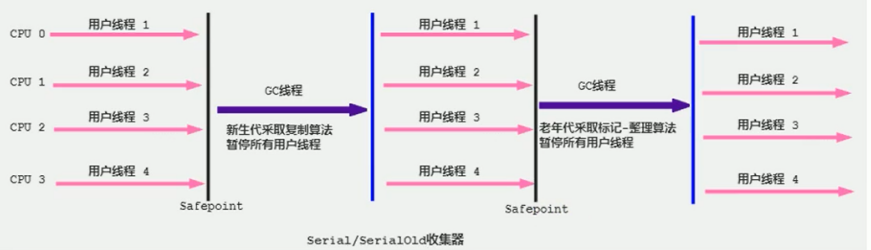

**ParNew**

并行垃圾收集器在串行垃圾收集器的基础之上做了改进，采用复制算法，将单线程改为了多线程进行垃圾回收，可以缩短垃圾回收的时间

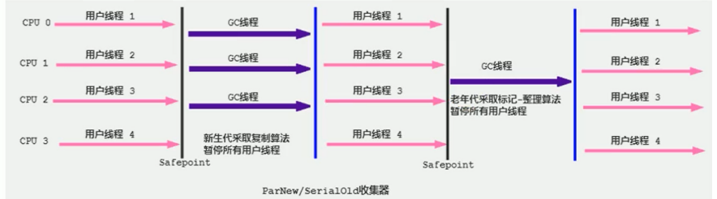

**Parallel**


Parallel Scavenge 收集器是应用于新生代的并行垃圾回收器，采用复制算法、并行回收和 Stop the World 机制 

Parallel Old 收集器：是一个应用于老年代的并行垃圾回收器，采用**标记-整理**算法

和 ParNew 不同，Parallel Scavenge 收集器的目标是达到一个可控制的吞吐量，也被称为吞吐量优先的垃圾收集器。自适应调节策略也是 Parallel Scavenge 与 ParNew 的一个重要区别。

**CMS**

款并发的、使用**标记-清除**算法、针对老年代的垃圾回收器，最大特点是让垃圾收集线程与用户线程同时工作。CMS 收集器的关注点是尽可能缩短垃圾收集时用户线程的停顿时间。**并发**不是并行。

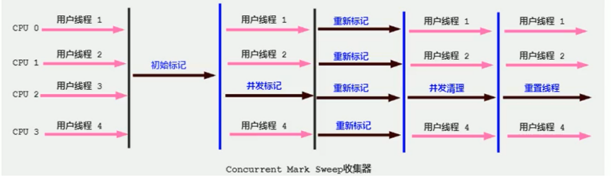

初始标记：使用 STW 出现短暂停顿，仅标记一下 GC Roots 能直接关联到的对象，速度很快 

并发标记：进行 GC Roots 开始遍历整个对象图，在整个回收过程中耗时最长，不需要 STW，可以 与用户线程并发运行

重新标记：修正并发标记期间因用户程序继续运作而导致标记产生变动的那一部分对象，比初始标记时间长但远比并发标记时间短，需要 STW（不停顿就会一直变化，采用写屏障 + 增量更新来避 免漏标情况） 

**并发**清除：清除标记为可以回收对象，不需要移动存活对象，所以这个阶段可以与用户线程同时并 发的

优点是延迟低，缺点是吞吐量降低，在并发阶段虽然不会导致用户停顿，但是会因为占用了一部分线程而导致应用程序变慢。CMS 收集器无法处理浮动垃圾。

**G1**

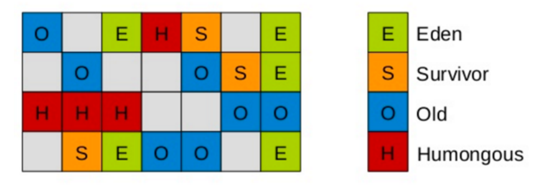

应用于新生代和老年代、采用**标记-整理**算法

分区：G1 把堆划分成多个大小相等的独立区域Region，Region仍然区分年轻代和老年代，年轻代依然有 Eden 区和 Survivor 区。但新生代和老年代不再物理隔离，逻辑上连续。不用担心每个代内存是否足 够。

新的区域 Humongous：本身属于老年代区，当出现了一个巨型对象超出了分区容量的一 半，该对象就会进入到该区域。如果一个 H 区装不下一个巨型对象，那么 G1 会寻找连续的 H 分区来存储，为了能找到连续的 H 区，有时候不得不启动 Full GC

**可预测停顿时间**模型：可以指定在 M 毫秒的时间片段内，消耗在 GC 上的时间不得超过 N 毫秒 

- 由于分块的原因，G1 可以只选取部分区域进行内存回收，这样缩小了回收的范围，对于全局停顿情况也能得到较好的控制 

- G1 跟踪各个 Region 里面的垃圾堆积的价值大小（回收所获得的空间大小以及回收所需时 间，通过过去回收的经验获得），在后台维护一个优先列表，每次根据允许的收集时间优先回 收价值最大的 Region，保证了 G1 收集器在有限的时间内可以获取尽可能高的收集效率 

- 相比于 CMS GC，G1 未必能做到 CMS 在最好情况下的延时停顿，但是最差情况要好很多


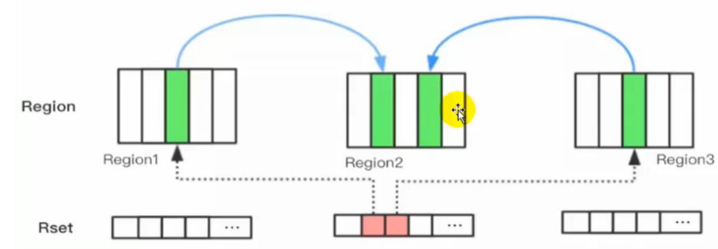

卡表Card Table是Region的内部结构划分。每个region内部被划分为若干的内存块，被称为card。除了卡表，每个region中都含有一个Remember Set记忆集，记录了其他region里的对象引用(记录谁引用了自己)

记忆集Remember Set好处：解决"跨代引用"。如果是年轻代指向老年代的引用我们不用关心，因为即使Minor GC把年轻代的对象清理掉了，程序依然能正常运行，而且随着引用链的断掉，无法被标记到的老年代对象会被后续的Major GC回收。如果是老年代指向年轻代的引用，那这个引用在Minor GC阶段是不能被回收掉的。那么需要在老年代种找到引用的对象看看是否应该被清除。此时若没有Remember Set需要遍历所有老年代对象，效率低。有了Remember Set一下就找到了。

**回收过程**：

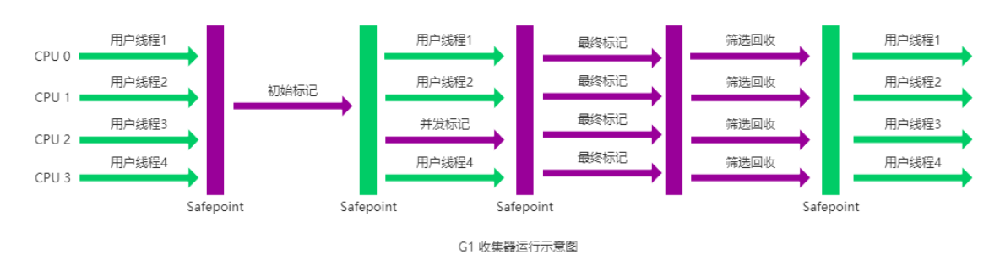

**Young GC**

当所有 eden region 被耗尽无法申请内存时，就会触发一次 Young GC。

- 扫描GCRoots，扫描的直接指向young代的对象，那如果GC Root是直接指向老年代对象的，就不往下扫描了。
- 更新Rset。更新RSet记录的时机不是伴随着引用更改马上发生的。每当老年代引用新生代对象时，这个引用记录对应的card地先会被放入Dirty Card Queue，原因是如果每次更新引用时直接更新Rset会导致多线程竞争，因为赋值操作很频繁，影响性能。
- 扫描Rset，扫描所有Rset中Old区到young区的引用。到这一步就确定出了young区域那些对象时存活的。如果没有Rset，则需要将GC Root中指向老年代的，完全遍历才能找全新生代。Rset提高了效率。

- 遍历上面的标记栈，将栈内的所有所有的对象移动至Survivor区域

**Young GC+并发标记**

当堆内存使用达到一定值（默认 45%）时，开始老年代并发标记过程，标记完成进行混合回收。G1采用三色标记算法。

- 初始标记：标记从根节点直接可达的对象，这一步伴随着young gc。
- 并发标记：从GC Roots开始对堆中对象进行可达性分析，找出各个region的存活对象信息。会计算每个区域的对象活性，即区域中存活对象的比例，若区域中的所有对象都是垃圾，则这个区域会被立即回收
- 最终标记：为了修正在并发标记期间因用户程序继续运作而导致标记产生变动的那一部分标记记录，虚拟机将这段时间对象变化记录在线程的 Remembered Set Logs 里面，最终标记阶段需要将数据合并到 Remembered Set 中。并行进行。
- 筛选回收：并发清理阶段，首先对 CSet 中各个 Region 中的回收价值和成本进行排序，根据 用户所期望的 GC 停顿时间来制定回收计划

**Mixed GC**

当很多对象晋升到老年代时，为了避免堆内存被耗尽，虚拟机会触发Mixed GC，除了回收整个 young region，还会回收一部分的 old region，过程同 YGC。

**Full GC**

对象内存分配速度过快，Mixed GC 来不及回收，导致老年代被填满，就会触发一次 Full GC，G1 的 Full GC 算法就是单线程执行的垃圾回收

**ZGC**

zgc也是将堆内存划分为一系列的内存分区，称为page。不进行分代。现可**并发**的**标记压缩**算法。与CMS中的ParNew和G1类似，ZGC也采用标记-复制算法，不过ZGC对该算法做了重大改进：ZGC在标记、转移和重定位阶段几乎都是并发的，这是ZGC实现停顿时间STW小于10ms目标的最关键原因。

**染色指针**


三色标记算法中JVM需要给对象打上黑、白、灰色的标记，但是这些标记只与对象的引用有关，与对象本身的其它属性无关。这样的场景下理论上我们只需要为对象的指针打上标记即可，无需在堆内存中为实际的对象打上标记。

染色指针是一种让指针存储额外信息的技术。直接把标记信息记载引用对象的指针上。指针是一种数据类型，用于存储变量的内存地址。一个对象的地址只使用前42位，而第43-46位可以用来存储额外的信息。标记在指针不在对象上这样省去了访问实际对象的过程。

- 染色指针可以使某个 Region 的存活对象被移走之后，这个 Region 立即就能够被释放和重用

- 可以直接从指针中看到引用对象的三色标记状态（Marked0、Marked1）、是否进入了重分配集、是否被移动过（Remapped）、是否只能通过 finalize() 方法才能被访问到
- 可以大幅减少在垃圾收集过程中内存屏障的使用数量，写屏障的目的通常是为了记录对象引用 的变动情况，如果将这些信息直接维护在指针中，显然就可以省去一些专门的记录操作

ZGC采用虚拟内存映射技术，将同一块物理内存映射为Marked 0、Marked 1和Remapped这三个虚拟内存。每个对象在堆上申请虚拟地址时，ZGC为该对象在这三个视图空间分别分配虚拟地址，这三个虚拟地址映射到同一个物理地址。染色指针中，Marked 0、Marked 1和Remapped作为ZGC的三个视图空间，在同一时间点内只能有一个是有效的。通过切换这三个视图空间，ZGC实现了并发的垃圾回收，对象的标记信息和状态可以在不同的视图之间切换，从而实现垃圾回收的并发性。

**读屏障**

读屏障是JVM向应用代码插入一小段代码的技术。当应用线程从堆中读取对象引用时，就会执行这段代码。需要注意的是，仅“从堆中读取对象引用”才会触发这段代码。

ZGC通过着色指针和读屏障技术，解决了转移过程中准确访问对象的问题，实现了并发转移。而在ZGC中，应用线程访问对象将触发“读屏障”，如果发现对象被移动了，那么“读屏障”会把读出来的指针更新到对象的新地址上，这样应用线程始终访问的都是对象的新地址。那么，JVM利用染色指针判断对象是否被移动过。

**ZGC的流程**

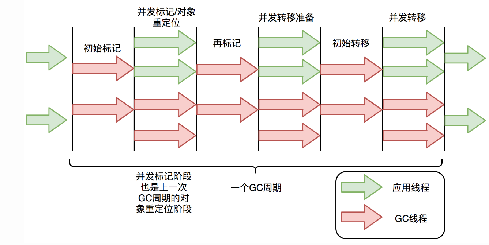

- 初始标记：与G1垃圾回收器一样，目的是标记出根对象直接引用的对象。一开始整个内存空间的地址视图被设置为Remapped。经过初始标记，所有GC Roots可达的对象就被标记为了marked1。

- 并发标记： ZGC并发地标记出所有可达的对象，包括从根对象出发的引用链上的对象。一方面将所有活跃的对象地址空间由Remapped变为marked1。另一方面，由于此阶段会遍历所有对象，正好会修复上一次GC时被标记的指针，被标记的视图为marked0。

- 再标记阶段：ZGC会修正并发标记阶段可能由于并发引起的标记不一致。

- 并发转移准备：在这个阶段ZGC进行整堆扫描，确定收集哪些Region，并将这些Region组成重分配集（Relocation Set）。与G1收集器不同，ZGC的重分配集扫描所有的Region，由于染色指针的存在，扫描过程会很快。

- 初始转移阶段：把重分配集中的存活对象复制到新的 Region 上，并为重分配集中的每个 Region 维护一个转发表 ，记录从旧地址到新地址的转向关系。视图切换回remapped

- 并发转移阶段：修正整个堆中指向重分配集中旧对象的所有引用，但是ZGC并不需要马上完成这个操作（因为有指针自愈的特性），ZGC把并发重映射阶段要做的工作巧妙的合并到下一次垃圾收集循环中的并发标记阶段中去完成，这样做的好处是节省遍历对象图的开销。

指针自愈：指针的自愈是指的当访问一个正处于重分配集中的对象时会被读屏障拦截，然后通过转发记录表forwarding table将访问转发到新复制的对象上，并且修正并更新该引用的值，使其直接指向新对象。

### 类加载

Java 对象创建：

- new关键字
- 使用Class类的 newInstance 方法（反射机制）
- 使用 Constructor 类的 newInstance 方法（反射机制）
- 使用 Clone 方法创建对象
- 使用（反）序列化机制创建对象

**对象的创建过程**

1. 类加载检查：虚拟机遇到一条 new 指令时，首先将去检查这个指令的参数是否能在常量池中定位到这个类的符号引用，并且检查这个符号引用代表的类是否已被加载过、解析和初始化过。如果没有，那必须先执行相应的类加载过程。
2. 内存分配：在类加载检查通过后，接下来虚拟机将为新生对象分配内存。分配方式有 “指针碰撞” 和 “空闲列表” 两种，选择哪种分配方式由 Java 堆是否规整决定，而 Java 堆是否规整又由所采用的垃圾收集器是否带有压缩整理功能决定。
3. 初始化零值：内存分配完成后，虚拟机需要将分配到的内存空间都初始化为零值，这保证了对象的实例字段在 Java 代码中可以不赋初始值就直接使用。
4. 设置对象头：初始化零值完成之后，虚拟机要对对象进行必要的设置，保存类的一些信息存放在对象头中。
5. 执行程序的init方法进行实例化：实例变量初始化、实例代码块初始化 、构造函数初始化

一个实例变量在对象初始化的过程中最多会被赋值**4次**

JVM 在为一个对象分配完内存之后，会给每一个实例变量赋予**默认值**，这个实例变量被第一次赋值；在**声明实例变量**的同时对其进行了赋值操作，那么这个实例变量就被第二次赋值；在**实例代码块**中又对变量做了初始化操作，那么这个实例变量就被第三次赋值；；在**构造函数**中也对变量做了初始化操作，那么这个实例变量就被第四次赋值。

初始化的流程是：**父类的类构造器<clinit>() -> 子类的类构造器<clinit>() -> 父类的成员变量和实例代码块 -> 父类的构造函数 -> 子类的成员变量和实例代码块 -> 子类的构造函数。**


目前主流的访问对象的方式有：**使用句柄**、**直接指针**。一个对象包含了3种信息，**对象头**、**实例数据**和**对齐填充**。实例数据部分是对象真正存储的有效信息，也是在程序中所定义的各种类型的字段内容。对齐填充部分不是必然存在的，也没有什么特别的含义，仅仅起占位作用。对象头包括两部分信息，第一部分用于存储对象自身的运行时数据（哈希码、GC 分代年龄、锁状态标志等等），另一部分是类型指针，即对象指向它的类元数据的指针。


####类加载过程

系统加载 Class 类型的文件主要三步：**加载->连接->初始化**。连接过程又可分为三步：**验证->准备->解析**。

**加载**

加载是类加载的其中一个阶段，完成：

- 通过类的完全限定名称获取定义该类的二进制字节流（二进制字节码） 
- 将该字节流表示的静态存储结构转换为方法区的运行时存储结构（Java 类模型） 
- 将字节码文件加载至方法区后，在堆中生成一个代表该类的 Class 对象，作为该类在方法区中的各种数据的访问入口

加载这一步主要是通过我们后面要讲到的 **类加载器** 完成的。类加载器有很多种，当我们想要加载一个类的时候，具体是哪个类加载器加载由 **双亲委派模型** 决定

创建数组类有些特殊，因为数组类本身并不是由类加载器负责创建，而是由 JVM 在运行时根据需要而直接创建的，但数组的元素类型仍然需要依靠类加载器去创建

**验证**

确保 Class 文件的字节流中包含的信息是否符合 JVM 规范，保证被加载类的正确性，不会危害虚拟机自身的安全。验证阶段主要由四个检验阶段组成：

1. 文件格式验证（Class 文件格式检查）
2. 元数据验证（字节码语义检查）
3. 字节码验证（程序语义检查）
4. 符号引用验证（类的正确性检查）

**准备**

准备阶段为静态变量（类变量）分配内存并设置初始值，使用的是方法区的内存。static 变量分配空间和赋值是两个步骤：分配空间在准备阶段完成，赋值在初始化阶段完成。如果 static 变量是 final 的基本类型以及字符串常量，那么编译阶段值（方法区）就确定了，准备 阶段会显式初始化而不是默认初始化。如public static final int value = 123;，value初始化为123而不是0.

**解析**

将常量池中类、接口、字段、方法的符号引用替换为直接引用（内存地址）的过程。

**初始化**

初始化阶段才真正开始执行类中定义的 Java 程序代码，在准备阶段，类变量已经赋过一次系统要求的初始值；在初始化阶段，通过程序制定的计划去初始化类变量和其它资源。

clinit ()：类构造器，由编译器自动收集类中所有类变量的赋值动作和静态语句块中的语句合并产生的 作用：是在类加载过程中的初始化阶段进行静态变量初始化和执行静态代码块

**卸载**

时机：执行了 System.exit() 方法，程序正常执行结束，程序在执行过程中遇到了异常或错误而异常终止，由于操作系统出现错误而导致Java 虚拟机进程终止。卸载类即该类的 Class 对象被 GC

假如一个类还未加载到内存中，那么在创建一个该类的实例时，具体过程是怎样的？

~~~java
public class StaticTest {
    public static void main(String[] args) {
        staticFunction();
    }

    static StaticTest st = new StaticTest();

    static {   //静态代码块
        System.out.println("1");
    }

    {       // 实例代码块
        System.out.println("2");
    }

    StaticTest() {    // 实例构造器
        System.out.println("3");
        System.out.println("a=" + a + ",b=" + b);
    }

    public static void staticFunction() {   // 静态方法
        System.out.println("4");
    }

    int a = 110;    // 实例变量
    static int b = 112;     // 静态变量
}/* Output: 
        2
        3
        a=110,b=0
        1
        4*/
~~~

在加载这个类时，初始化阶段存在static StaticTest st = new StaticTest()，但这个时候类都没有初始化完毕。**实例初始化不一定要在类初始化结束之后才开始初始化。**

类的生命周期是：加载->验证->准备->解析->初始化->使用->卸载，并且只有在准备阶段和初始化阶段才会涉及类变量的初始化和赋值。首先，在类的准备阶段需要做的是为类变量（static变量）分配内存并设置默认值(零值)，因此在该阶段结束后，类变量st将变为null、b变为0。

在类的初始化阶段需要做的是执行类构造器<clinit>()，需要指出的是，类构造器本质上是编译器收集所有静态语句块和类变量的赋值语句按语句在源码中的顺序合并生成类构造器<clinit>()。因此，对上述程序而言，JVM将先执行第一条静态变量的赋值语句：st = new StaticTest();

在同一个类加载器下，一个类型只会被初始化一次。所以，一旦开始初始化一个类型，无论是否完成，后续都不会再重新触发该类型的初始化阶段了。所以执行new StaticTest()时不会执行静态代码段了，因为这是在类初始化该干的事情。所以先执行了实例代码段再执行了构造函数。

执行完后再回到类初始化过程执行static StaticTest st = new StaticTest();后的静态代码块，执行完后进入main方法。

类加载：按照静态代码块静态赋值的顺序执行，在类的准备阶段赋初始值，再初始化阶段赋设定值。若此时实例化先进行实例化过程。然后执行main函数。其中实例化时先执行实例代码块以及实例赋值后执行构造函数。

#### 类加载器

类加载器是 Java 的核心组件，用于加载字节码到 JVM 内存，得到 Class 类的对象。

类加载器是一个负责加载类的对象，用于实现类加载过程中的加载这一步。每个 Java 类都有一个引用指向加载它的 ClassLoader。数组类不是通过 ClassLoader创建的（数组类没有对应的二进制字节流），是由 JVM 直接生成的。

java的加载器可以分为3种：

- 启动类加载器：最顶层的加载类，由 C++实现，通常表示为 null，并且没有父级，主要用来加载 JDK 内部的核心类库
- 扩展加载器：主要负责加载 `%JRE_HOME%/lib/ext` 目录下的 jar 包和类以及被 `java.ext.dirs` 系统变量所指定的路径下的所有类。
- 应用程序类加载器：面向我们用户的加载器，负责加载当前应用 classpath 下的所有 jar 包和类。

除了这三种类加载器之外，用户还可以加入自定义的类加载器来进行拓展，以满足自己的特殊需求。除了 `BootstrapClassLoader` 是 JVM 自身的一部分之外，其他所有的类加载器都是在 JVM 外部实现的，并且全都继承自 `ClassLoader`抽象类。这样做的好处是用户可以自定义类加载器，以便让应用程序自己决定如何去获取所需的类。

**加载模型**

在 JVM 中，对于类加载模型提供了三种，分别为全盘加载、双亲委派、缓存机制

- 全盘加载：当一个类加载器负责加载某个 Class 时，该 Class 所依赖和引用的其他 Class 也将由该类加载器负责载入
- 双亲委派：某个特定的类加载器在接到加载类的请求时，首先将加载任务委托给父加载器，依次递归，如果父加载器可以完成类加载任务，就成功返回；只有当父加载器无法完成此加载任务时，才自己去加载
- 缓存机制：所有加载过的 Class 都会被缓存，当程序中需要使用某个 Class 时，类加载器先 从缓存区中搜寻该 Class

**双亲委派模型**

该模型要求除了顶层的启动类加载器外，其它类加载器都要有父类加载器，这里的父子关系一般通过组合关系来实现，而不是继承关系 

工作过程：一个类加载器首先判断当前类是否被加载过，没有则将类加载请求转发到父类加载器，只有当父类加载器无法完成时才尝试自己加载。

双亲委派机制的优点：

- 可以避免某一个类被重复加载，当父类已经加载后则无需重复加载，保证全局唯一性 
- Java 类随着它的类加载器一起具有一种带有优先级的层次关系，从而使得基础类得到统一 
- 保护程序安全，防止类库的核心 API 被随意篡改

缺点：检查类是否加载的委托过程是单向的，这个方式虽然从结构上看比较清晰，使各 个 ClassLoader 的职责非常明确，但顶层的 ClassLoader 无法访问底层的 ClassLoader 所加载的类

**破坏双亲委派模型**

使用双亲委派也存在一定的局限性，在正常情况下，用户代码是依赖核心类库的，所以按照正常的双亲委派加载流程是没问题的；但是在加载核心类库时，如果需要使用用户代码，双亲委派流程就无法满足；需要一个类加载，但这个类与核心库种的名字一样。加载时会启动类加载器负责加载。所以需要自定义加载，但自定义加载依据双亲委派机制会传递到启动类加载器。这就导致加载失败。

双亲委派的机制是ClassLoader中的loadClass方法实现的，打破双亲委派，其实就是重写这个方法，来用我们自己的方式来实现即可。

## 项目

### JWT

JWT通常由三部分组成: 头信息（header）, 消息体（payload）和签名（signature）。头信息指定了该JWT使用的签名算法和Token的类型。消息体是有效负载，其中包含声明。声明是关于实体(通常是用户)和其他数据的语句。签名是对头信息和消息体进行加密生成的，用于验证令牌的真实性和完整性，加密时包含一个存储在服务端的secret，相当于密码，在验证阶段时会检验这个密码。jwt是明文的

**实现**

~~~java
//注册
//第一步生成token
String token = 
    JWT.create()
    .withIssuer(jwtProperties.getIssuer())
    .withExpiresAt(new Date(System.currentTimeMillis() + jwtProperties.getExpire()))//指定令牌过期时间
    .withPayload(session)//session在项目中是唯一编号和用户名的字典
    .sign(algorithm);//签名
//第一步将token存入cookie中
response.addCookie(SessionUtil.newCookie(LoginService.SESSION_KEY, session));
//初次登录
//依据用户名查询用户得到DB中的密码与输入的密码进行匹配，匹配通过即登录成功

//自动登录
//在过滤器中检测cookie中是否存在token。存在获取进行检验
 //对给定的会话令牌进行验证，验证的流程包括校验令牌的签名、有效期等
DecodedJWT decodedJWT = verifier.verify(session);
//对编码的Payload可以进行解码
 String pay = new String(Base64Utils.decodeFromString(decodedJWT.getPayload())); 
~~~

**优点**

简单且易于使用：JWT是一种基于标准化的轻量级身份验证和授权协议，使用简单且易于理解。

无状态性：由于JWT是无状态的，在服务器端不需要存储任何会话相关的信息。所有必要的信息都包含在JWT本身中，使得服务器端的负担更轻。

安全性：JWT使用了数字签名机制来验证数据的完整性和真实性，使得通过JWT认证的请求的源头可以被可靠地验证。这样有效地防止了数据被篡改或伪造。

**与session的比较**

传统的session形式需要将session信息存储进服务端，并保存cookie。这种方式增加服务器开销；扩展性偏差，因为保存进服务端需要下次请求还要对这个服务端，对分布式应用不友好，安全性低，会受到CSRF攻击。

如果jwt被劫持，需要及时注销。但可以通过减小令牌的有效时间来加强安全性。

### Redis作用

管理后台控制tag标签时使用redis的string类型存储缓存，这里用到了先写mysql再删reids的一致性策略

session的缓存使用的是string类型

计数的场景，用户的文章数、粉丝数、关注作者数

文章的点赞量、收藏量、阅读数、评论数

统计计数使用的是Hash表数据结构


这个计数不仅与计数本身相关联，还与活跃度排行榜相关，使用消息机制来增加计数和活跃的分数

活跃度是由Zset数据结构维护的，当发生阅读、点赞、评论、收藏、发布文章等事情时进行消息发布。但排行榜事件存在加分，Zset只维护了分数的排行。使用Hash结构存储排行榜相关的加分日志，防止重复添加。这个历史记录维护1天，第二天的重复行为也会加分，但今天出现取消收藏不扣分。(就是这么设计的)

用Set数据结构实现用户白名单

####Caffeine

对于一些变更频率低、实时性要求低的数据，可以放在本地缓存中，提升访问速度。项目中用于不长变的侧边栏信息，和首页的分类展示，

