# 算法岗

## Transformer

### 结构

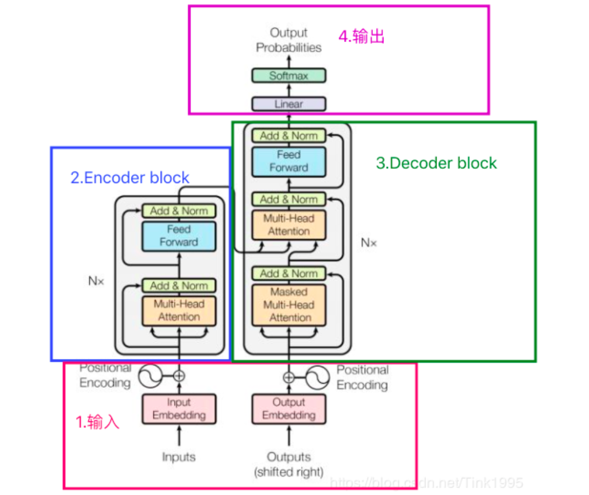


$Attention(Q,K,V) = Softmax(QK^T/\sqrt(d_k))V$

**优点**：

- 可并行
- 独立于卷积和循环，完全依赖于attention处理全局依赖，解决长距离依赖问题
- 性能强

**缺点**：

- 长度固定
- **局部信息的获取**不如RNN和CNN强：Transformer关注的全局关系，而RNN在计算过程中更关注局部，对距离更加敏感。

### 各结构作用

**多头**

并行计算：多头注意力机制允许模型同时关注输入序列的不同部分，每个注意力头可以独立计算，从而实现更高效的并行计算。这样能够加快模型的训练速度。

提升表征能力：通过引入多个注意力头，模型可以学习到不同类型的注意力权重，从而捕捉输入序列中不同层次、不同方面的语义信息。这有助于提升模型对输入序列的表征能力。

降低过拟合风险：多头注意力机制使得模型可以综合不同角度的信息，从而提高泛化能力，降低过拟合的风险。

增强模型解释性：每个注意力头可以关注输入序列的不同部分，因此可以更好地理解模型对于不同输入信息的关注程度，使得模型的决策更具解释性。

**QKV的线性变换**

线性变换矩阵将KQ投影到了不同的空间，将向量映射到高维空间，增强表征，增加了表达能力。如果不进行线性变换X=Q=K，则会导致注意力矩阵是对称的。比如“我是一个女孩”这句话，女孩对修饰我的重要性应该要高于我修饰女孩的重要性。

**除dk**

取决于Softmax的性质，如果softmax内计算的数过大或者过小，可能导致Softmax后的结果为0，导致梯度消失

为什么是dkd_kdk。假设Q、K中元素的值分布在[0,1]，softmax的计算中，分母涉及了一次对所有位置的求和，整体的分布就会扩大到[0,dkd_kdk]。

**用LN**

LN是针对每个样本序列进行归一化，没有样本间依赖，对一个序列的不同特征维度进行归一化。

CV使用BN是因为认为通道维度的信息对cv方面有重要意义，如果对通道维度也归一化会造成不同通道信息一定的损失。NLP认为句子长短不一，且各batch之间的信息没有什么关系，因此只考虑句子内信息的归一化。

**位置编码**

位置编码是为了在不同位置的词向量之间加入位置信息，以便模型能够更好地理解输入序列的顺序

## CNN

对输入层定义一个数据窗口数据和由神经元的多个权重组成的一个滤波矩阵做内积的操作就是所谓的卷积操作

**局部感知性：** CNN通过卷积操作对输入数据的局部区域进行感知和处理。这使得它能够提取图像、语音和自然语言等数据中的局部特征，从而更好地捕捉数据的结构和模式。

**参数共享：** CNN中的卷积核在整个输入数据上共享参数，这意味着对于相同的特征，无论在图像中的哪个位置，使用相同的卷积核进行处理。这种参数共享减少了需要学习的参数数量，节省了内存和计算资源，并使模型更具有泛化能力。

**稀疏连接：** 在CNN中，卷积核通常只与输入数据的一小部分区域进行连接，即稀疏连接。这使得模型更加适合处理高维数据，如图像，而不会因为参数量的急剧增加而导致过拟合问题。

**平移不变性：** 对于图像处理任务，目标通常不会因为其在图像中的位置发生变化而改变其身份。CNN通过卷积层的特性，使得模型对平移具有不变性，即对于目标在图像中的不同位置，能够产生相似的特征表示，从而增加了模型的鲁棒性。

### Faster-Rcnn

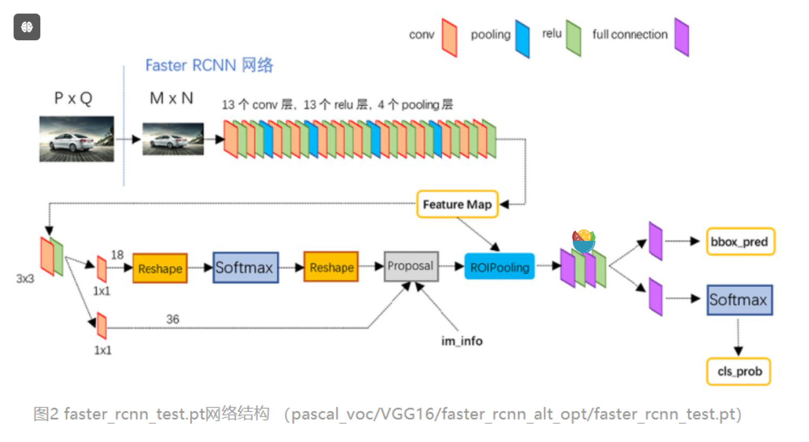

#### RPN

区域候选网络，这里任务有两部分，一个是分类：判断所有预设anchor是属于positive还是negative（即anchor内是否有目标，二分类）；还有一个bounding box regression：修正anchors得到较为准确的proposals。因此，RPN网络相当于提前做了一部分检测，即判断是否有目标（具体什么类别这里不判），以及修正anchor使框的更准一些。

#### RoI pooling

RoI Pooling层则负责收集RPN生成的proposal，并计算出proposal feature maps（从conv layers后的feature map中扣出对应位置）

#### Classification

从RoI pooling处获取到pooled_w x pooled_h大小的proposal feature map后，送入后续网络，做两件事：

（1）通过全连接层和softmax对所有proposals进行具体类别的分类（通常为多分类）

（2）再次对proposals进行bounding box regression，获取更高精度的最终的predicted box

#### 损失函数

RPN网络训练有两个Loss：

- Lcls：softmax loss，用于分类anchors属于前景还是背景（也有说用二分类交叉熵Loss的）
- Lreg：smooth L1 loss，用于修正anchor框，前面乘了一个pi*表示只回归有目标的框

### YOLO

YOLO 的核心思想就是把目标检测转变成一个**回归问题**，利用整张图作为网络的输入，仅仅经过一个神经网络，得到bounding box（边界框） 的位置及其所属的类别。

将一张图片平均分成7×7个网格，每个网格分别负责预测中心点落在该网格内的目标。

损失由三部分组成，分别是：坐标预测损失、置信度预测损失、类别预测损失。

### DETR

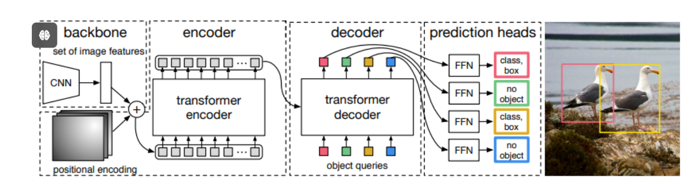

匈牙利匹配算法就是采用这种方式进行的。步骤如下：

1. 先定义一个目标任务，**怎么判断是最优匹配**？比如这里就是误差最小；
2. 列举所有的可能，最终找到误差最小的那个组合，就是一一匹配的最优组合形式了。

## 论文

### 医学知识和多层次对齐

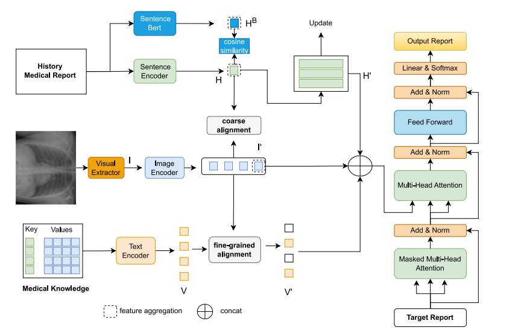

•知识扩充包括历史知识和医学词典知识。我们以字典的形式构建医学知识，其中字典中的key提供医学诊断主题，value提供医学描述和异常候选。

•我们提出了一种多级对齐方法，通过随后使用粗对齐和细对齐来减少文本和图像之间从整体到局部的模态差异。

**损失函数**

余弦相似度损失、对比损失、KL散度、交叉熵损失

### 正异常解耦

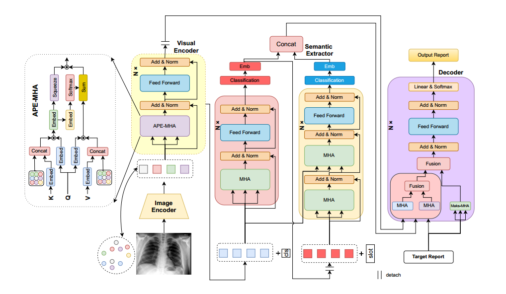

引入了一种新的利用异常模式记忆的正常-异常语义解耦网络。与直接使用医疗报告优化网络不同，我们通过从报告中提取异常语义来优化视觉提取。此外，我们在异常语义的基础上独立学习正常语义，确保视觉网络的优化不受正常语义学习的影响。然后，我们将报告中的单词分为正常/异常句子和正常/异常语义四部分，对每个部分进行不同权重的网络优化。这两种语义组件以及视觉信息被无缝集成，以促进生成精确和连贯的报告。这种方法减轻了嘈杂的正常语义和报告的影响。此外，我们开发了一种新的异常模式记忆编码器，通过捕获和嵌入图像的异常模式来提高网络检测异常的能力。

异常记忆模块：

引入一个离散的势空间，称为内存码本Ω，其中Ω中的每个条目对应于图像模式的一个势嵌入，N表示作为超参数的记忆模式的总数。在异常图像的情况下，通过视觉卷积提取的特征在Ω中搜索匹配，以找到相应的记忆模式位置。

们采用二分匹配方法并应用匈牙利算法（Kuhn, 1955）来解决这个问题。在记忆时，我们在每个图像编码对应的记忆空间中寻找一个独特的模式。匈牙利算法通过将图像特征与记忆矩阵的每个模式作为一个集成匹配问题来处理，从而在记忆矩阵中找到唯一的模式匹配。

**损失函数**

异常存储码本用于存储各种异常信息并与图像信息交互。我们想用正交性让码本学习尽可能多的关于不同模式的信息。我们用Sg表示梯度截止，用E表示单位矩阵。损失函数定义如下：

$\mathcal{L}_m= \left\|\operatorname{sg}\left[V^{i}_{c}\right]-q\left(V^{i}_{c}\right)\right\|_2^2 + \left\|\mathbf{\Omega}^{\top} \mathbf{\Omega}-E\right\|^2$

多标签分类的不对称损失：

$\mathcal{L}_s=\operatorname{asym}\left(\tilde{P}_a, \mathbf{y}_a\right)+\operatorname{asym}\left(\tilde{P}_n, \mathbf{y}_n\right)$

使用不确定性来衡量的报告的交叉熵损失

$\mathcal{L}_r^{'}=\sum_{i=1}^T \log P_\theta\left(\mathbf{R}_t \mid  \mathbf{R}_{\textless t},\mathbf{V_f}, \mathbf{S_f}\right)$

$\mathcal{L}_r=\sum_{m=0}^4 \frac{1}{\sigma_m^2}{L}_r^{m}+log(1+\sigma_m)$

通过考虑每个任务之间的同方差不确定性来设置不同任务损失函数的权值


## 损失函数

**交叉熵**

KL散度：描述两个概率分布的差异性，*两个分布差异越大，KL散度越大*。

H(p, q) = -∑(p(x) * log(q(x)))

其中，*p(x)* 是真实标签的概率分布，*q(x)* 是预测标签的概率分布。这个公式实际上是对每个类别的预测概率进行加权求和，权重是真实标签的概率分布。

$L = \frac{1}{N} \sum_{i} L_i = -\frac{1}{N} \sum_{i} \sum_{c=1}^{M} y_{ic} \log(p_{ic})$

**Focal loss**

通过一个动态缩放因子，可以动态降低训练过程中易区分样本的权重，从而将重心快速聚焦在那些难区分的样本

交叉熵的简化就是$-log(p)$,  focal loss : $-(1-p)^rlog(p)$ 。p越大证明以区分，此时前面系数越小。p小证明难区分，系数越大。

r较高时，Focal Loss会抑制easy sample，这不仅抑制了easy negative，可能也会抑制本来就很少的positive sample

**asym不对称损失**

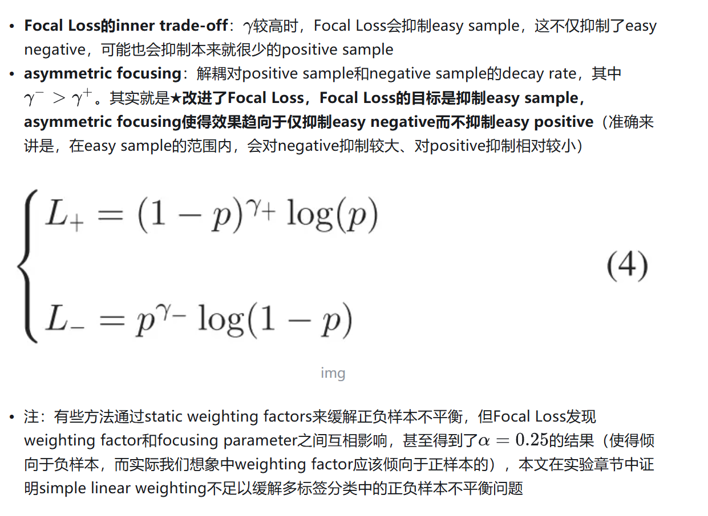

**平均绝对误差**MAE L1

 $MAE = \frac{1}{n} \sum_{i=1}^{n} |y_i - y_i| $

- 优点：无论对于什么样的输入值，都有着稳定的梯度，不会导致梯度爆炸问题，具有较为稳健性的解
- 缺点：在中心点是折点，不能求导，梯度下降时要是恰好学习到w=0就没法接着进行了

简单模型

**Smooth L1**
$\text{loss}(x, y) = \frac{1}{n} \sum_{i=1}^{n}  \begin{cases}  0.5 \cdot (y_i - f(x_i))^2, & \text{if } |y_i - f(x_i)| < 1 \\ |y_i - f(x_i)| - 0.5, & \text{otherwise} \end{cases}$

分析一下，当预测值f(xi)和真实值yi差别较小的时候（绝对值差小于1），其实使用的是L2 loss；差别大的时候，使用的是L1 loss的平移。因此，Smooth L1 loss其实是L1 loss 和L2 loss的结合，同时拥有两者的部分优点：

真实值和预测值差别较小时（绝对值差小于1），梯度也会比较小（损失函数比普通L1 loss在此处更圆滑）
真实值和预测值差别较大时，梯度值足够小（普通L2 loss在这种位置梯度值就很大，容易梯度爆炸）

**均方误差MSE**(L2)

$MSE = \frac{1}{n} \sum_{i=1}^{n} (\hat{y}_i - y_i)^2 $

在分类问题中，使用sigmoid/softmx得到概率，配合MSE损失函数时，采用梯度下降法进行学习时，会出现模型一开始训练时，学习速率非常慢的情况

- 优点：各点都连续光滑，方便求导，具有较为稳定的解
- 缺点：不是特别的稳健，因为当函数的输入值距离真实值较远的时候，对应loss值很大在两侧，则使用梯度下降法求解的时候梯度很大，可能导致梯度爆炸

**余弦相似度损失**

用于判断输入的两个向量是否相似。 常用于非线性词向量学习以及半监督学习

$l_i =  \begin{cases}  1 - \cos(a_i, b_i), & \text{if } y_i = 1 \\ \max(0, \cos(a_i, b_i) - \text{margin}), & \text{if } y_i = -1  \end{cases}$

## 训练

### 数据并行

数据并行是最常见的并行形式，因为它很简单。在数据并行训练中，数据集被分割成几个碎片，每个碎片被分配到一个设备上。这相当于**沿批次（Batch）维度对训练过程进行并行化**。每个设备将持有一个完整的模型副本，并在分配的数据集碎片上进行训练。在反向传播之后，模型的梯度将被全部减少，以便在不同设备上的模型参数能够保持同步。典型的数据并行实现：PyTorch DDP。

### 模型并行

在数据并行训练中，一个明显的特点是每个 GPU 持有整个模型权重的副本。这就带来了冗余问题。另一种并行模式是**模型并行，即模型被分割并分布在一个设备阵列上**。

通常有两种类型的模型并行：**张量并行**和**流水线并行**。

- **张量并行是在一个操作中进行并行计算**，如：矩阵-矩阵乘法。
- **流水线并行是在各层之间进行并行计算**。

因此，从另一个角度来看，张量并行可以被看作是层内并行，流水线并行可以被看作是层间并行。

## 激活函数

### [1.激活函数作用](https://dongnian.icu/llm_interview_note/#/01.大语言模型基础/1.激活函数/1.激活函数?id=_1激活函数作用)

神经网络是线性的，无法解决非线性的问题，加入激活函数就是给模型引入非线性能力；

不同的激活函数，特点和作用不同：

- `Sigmoid`和`tanh`的特点是将输出限制在`(0,1)`和`(-1,1)`之间，说明`Sigmoid`和`tanh`适合做概率值的处理，例如LSTM中的各种门；而`ReLU`就不行，因为`ReLU`无最大值限制，可能会出现很大值。
- `ReLU`适合用于深层网络的训练，而`Sigmoid`和`tanh`则不行，因为它们会出现梯度消失。

### [2.梯度爆炸和梯度消失](https://dongnian.icu/llm_interview_note/#/01.大语言模型基础/1.激活函数/1.激活函数?id=_2梯度爆炸和梯度消失)

模型中的梯度爆炸和梯度消失问题：

1. 激活函数导致的梯度消失，像 `sigmoid `和 `tanh` 都会导致梯度消失；
2. 矩阵连乘也会导致梯度消失，这个原因导致的梯度消失无法通过更换激活函数来避免。直观的说就是在反向传播时，梯度会连乘，当梯度都小于1.0时，就会出现梯度消失；当梯度都大于1.0时，就会出现梯度爆炸。

如何解决梯度爆炸和梯度消失问题：

1. 上述第一个问题只需要使用像 ReLU 这种激活函数就可以解决；
2. 上述第二个问题没有能够完全解决的方法，目前有一些方法可以很大程度上进行缓解该问题，比如：对梯度做截断解决梯度爆炸问题、残差连接、normalize。由于使用了残差连接和 normalize 之后梯度消失和梯度爆炸已经极少出现了，所以目前可以认为该问题已经解决了。

### [3.Sigmoid](https://dongnian.icu/llm_interview_note/#/01.大语言模型基础/1.激活函数/1.激活函数?id=_3sigmoid)

Sigmoid函数公式：

σ(z)=11+e−z*σ*(*z*)=1+*e*−*z*1

导数公式：

σ′(z)=σ(z)(1−σ(z))*σ*′(*z*)=*σ*(*z*)(1−*σ*(*z*))

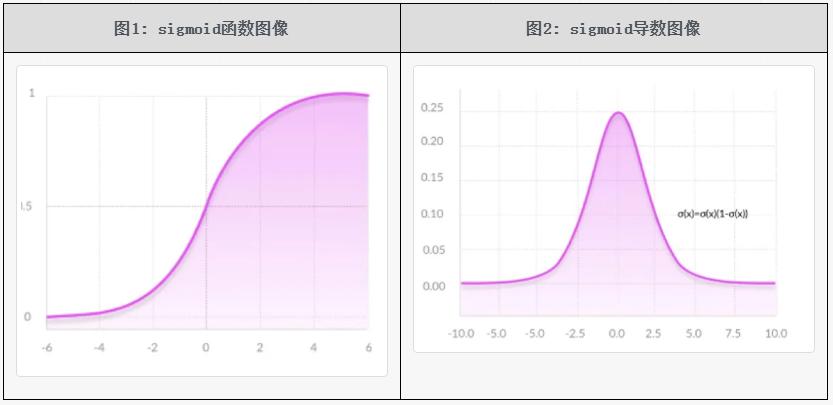

优点：

- 平滑，易于求导；
- 取值范围是`(0, 1)`，可直接用于求概率值的问题或者分类问题；比如 LSTM 中的门，二分类或者多标签分类问题；

缺点：

- **计算量大**，包含幂运算，以及除法运算；
- sigmoid 导数的取值范围是 `[0, 0.25]`，最大值都是小于 1 的，反向传播时又是"链式传导"，**经过几次相乘之后很容易就会出现梯度消失的问题**；
- **sigmoid 的输出的均值不是0**（即zero-centered），这会导致当前层接收到上一层的非0均值的信号作为输入，随着网络的加深，会改变数据的原始分布；

### [4.Tanh](https://dongnian.icu/llm_interview_note/#/01.大语言模型基础/1.激活函数/1.激活函数?id=_4tanh)

Tanh的函数公式为：

tanh⁡(z)=ez−e−zez+e−z=21+e−2z−1tanh(*z*)=*e**z*+*e*−*z**e**z*−*e*−*z*=1+*e*−2*z*2−1

> 从上述公式的第二行可以看出，tanh 函数可以由 sigmoid 函数经过平移和拉伸得到。tanh 函数的取值范围是`（-1, 1）`。

导数公式

tanh⁡(x)′=(ex+e−x)2−(ex−e−x)2(ex+e−x)2=1−(tanh⁡(x))2tanh(*x*)′=(*e**x*+*e*−*x*)2(*e**x*+*e*−*x*)2−(*e**x*−*e*−*x*)2=1−(tanh(*x*))2

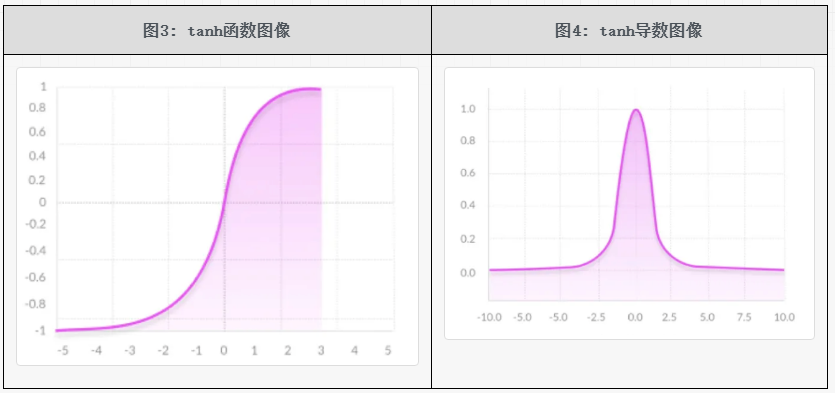

tanh 函数可以理解为是**基于 sigmoid 函数的一种改进的激活函数**，所以对于 sigmoid 函数的缺点，它能够解决一部分。但是 tanh 函数依然有着不少的缺点。tanh 函数的特点如下：

- 它的输出范围是`(-1, 1)`，解决了 sigmoid 函数输出的均值不是0（zero-centered）的问题；
- tanh 的导数取值范围是`(0, 1)`，可以看出其在反向传播的"链式传导"过程中的梯度消失问题要比 sigmoid 函数要好一些，但是其依然存在着梯度消失问题；
- **幂运算依然存在，计算量比较大**；

### [5.ReLU系列](https://dongnian.icu/llm_interview_note/#/01.大语言模型基础/1.激活函数/1.激活函数?id=_5relu系列)

#### [5.1 ReLU](https://dongnian.icu/llm_interview_note/#/01.大语言模型基础/1.激活函数/1.激活函数?id=_51-relu)

`ReLU `全称为 Rectified Linear Unit，即修正线性单元函数。该函数的公式比较简单，相应的公式和图像如下表所示。

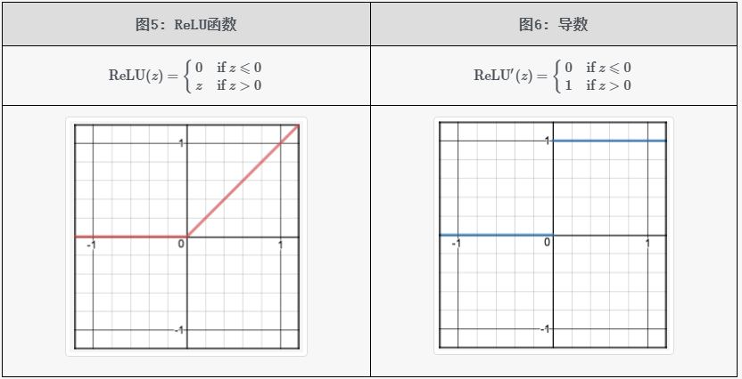

相比于 `sigmoid`、`tanh `这两个激活函数，`ReLU `激活函数的优缺点如下：

- 当 `z>0` 时，ReLU 激活函数的导数恒为常数1，这就避免了 sigmoid 和 tanh 会在神经网络层数比较深的时候出现的梯度消失的问题；

- 计算复杂度低，不再含有幂运算，只需要一个阈值就能够得到其导数；

- 经过实际实验发现，**使用 ReLU 作为激活函数，模型收敛的速度比 sigmoid 和 tanh 快**；

- 当

   

  ```
  z<0
  ```

  时，ReLU 激活函数的导数恒为常数0，这既带来了一些有利的方面，也导致了一些坏的方面，分别进行描述。

  - 有利的方面：在深度学习中，目标是从大量数据中学习到关键特征，也就是把密集矩阵转化为稀疏矩阵，保留数据的关键信息，去除噪音，这样的模型就有了鲁棒性。ReLU 激活函数中将 `z<0`的部分置为0，就是产生稀疏矩阵的过程。
  - 坏的方面：将 `z<0`的部分梯度直接置为0会导致 Dead ReLU Problem(神经元坏死现象)。**可能会导致部分神经元不再对输入数据做响应，无论输入什么数据，该部分神经元的参数都不会被更新**。（这个问题是一个非常严重的问题，后续不少工作都是在解决这个问题）

- ReLU 有可能会导致梯度爆炸问题，解决方法是梯度截断；

- ReLU 的输出不是 0 均值的，这个和 sigmoid 类似。（后续的优化工作 ELU 在该问题上解决的比较好，ELU 的输出是近似为0的）

#### [5.2 Leaky ReLU](https://dongnian.icu/llm_interview_note/#/01.大语言模型基础/1.激活函数/1.激活函数?id=_52-leaky-relu)

为了解决 ReLU 的 Dead ReLU 问题，提出了 渗漏整流线性单元(Leaky ReLU)，该方法是 ReLU 的一个变体。其在`z>0`的部分与ReLU一样保持不变；在`z<0`的部分，采用一个非常小的斜率0.01，其公式如下：

LeakyReLU⁡(z)={0.01z if z⩽0z if z>0*L**e**ak**y*ReLU(*z*)={0.01*z**z* if *z*⩽0 if *z*>0

其图像如下所示：

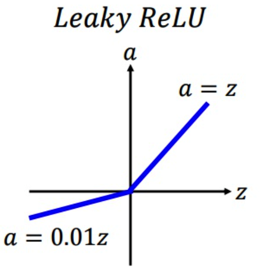

该方法是 ReLU 的一个变体，能够在一定程度上解决 Dead ReLU 问题，但是该方法的缺点是**效果并不稳定**，所以实际实验中使用该方法的并不多。

#### [5.3 PReLU, RReLU](https://dongnian.icu/llm_interview_note/#/01.大语言模型基础/1.激活函数/1.激活函数?id=_53-prelu-rrelu)

PReLU 的全称为 Parametric Relu；PReLU 的全称为 Random ReLU。

这两个方法和 Leaky ReLU 类似，都是 ReLU 的变体。也都是为了解决 Dead ReLU 问题而提出来的。

Leaky ReLU 是在`z<0`时，设置了一个较小的常数0.01作为斜率。由于这种常数值的斜率并不好，所以 PReLU 提出了可学习的斜率，RReLU 提出了随机的斜率，两者具体的公式如下。

PReLU的公式如下，这里的α*α*是可学习的：

PReLU⁡(z)={α⋅z if z⩽0z if z>0PReLU(*z*)={*α*⋅*z**z* if *z*⩽0 if *z*>0

RReLU 的公式如下，这里的 α*α*是从一个高斯分布中随机产生的，在训练过程中每次这个 α*α* 都是不相同的；在推理时会将这个α*α*都是不相同的；在推理时会将这个

RReLU⁡(z)={α⋅z if z⩽0z if z>0RReLU(*z*)={*α*⋅*z**z* if *z*⩽0 if *z*>0

PReLU 和 RReLU 的图像如下所示：

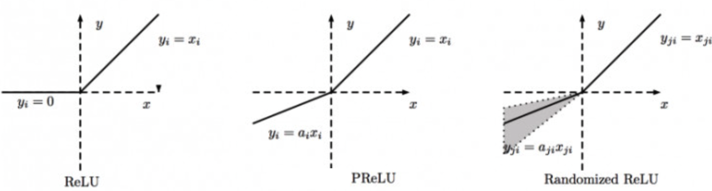

#### [5.4 ELU（指数线性单元）](https://dongnian.icu/llm_interview_note/#/01.大语言模型基础/1.激活函数/1.激活函数?id=_54-elu（指数线性单元）)

ELU 的提出也解决了 ReLU 的问题。与 ReLU 相比，ELU 有负值，这会使激活的平均值接近零，让模型学习得更快。

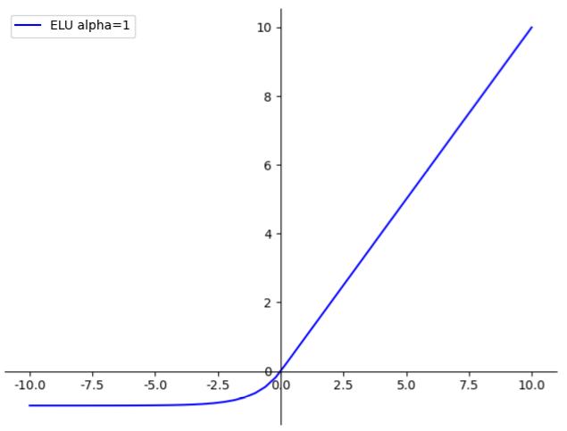

g(x)=ELU⁡(x)={x,x>0α(ex−1),x⩽0g(*x*)=ELU(*x*)={*x*,*α*(e*x*−1),*x*>0*x*⩽0

其中 α*α*不是固定的，是通过反向传播学习出来的。ELU的一个小问题是需要exp计算，运算量会更大一些。

- 融合了sigmoid和ReLU，左侧具有软饱和性，右侧无饱和性。
- 右侧线性部分使得ELU能够缓解梯度消失，而左侧软饱能够让ELU对输入变化或噪声更鲁棒。
- ELU的输出均值接近于零，所以收敛速度更快。

### [6.GeLU](https://dongnian.icu/llm_interview_note/#/01.大语言模型基础/1.激活函数/1.激活函数?id=_6gelu)

> 出自2016年的论文《Gaussian Error Linear Units (GELUs)》

先描述一下 GELU 这个激活函数直觉上是基于一个什么思路设计出来的。然后再具体看其如何近似求解、如何代码实现。

#### [6.1 介绍](https://dongnian.icu/llm_interview_note/#/01.大语言模型基础/1.激活函数/1.激活函数?id=_61-介绍)

先看一下 ReLU 激活函数是怎样做的，该函数中包含两种映射：一个是恒等映射（identity mapping），当输入值大于零时就是恒等映射；一个是置零映射（zero mapping），当输入值小于等于零时就是置零映射。

参考 ReLU 激活函数，设计另外一个包含恒等映射和置零映射的激活函数，并且参考 ReLU 函数来看，新激活函数应该有如下性质：

1. 在输入 `x` 满足某些条件时，为恒等映射；
2. 在输入 `x` 满足另外一些条件时，为置零映射；
3. 在输入 `x` 是一个较大的正值时，更希望为恒等映射；在输入 `x` 为一个较小的负值时，更希望是一个置零映射；

以上就是想要新设计的激活函数的性质。

下面的图7和图8是标准正态分布的概率密度函数和累积分布函数的图像。接下来根据下图8中的累积分布函数设计一个新的函数。

符号定义：输入值用 x*x* 表示，ϕ(⋅)*ϕ*(⋅)表示下图8中的正态分布的累积分布函数，f(⋅)*f*(⋅)表示新设计的函数。

设计的新函数：给定输入值 x*x*，函数 f(x)*f*(*x*)的输出值以 ϕ(x)*ϕ*(*x*)的概率采用恒等映射，以 1−ϕ(x)1−*ϕ*(*x*)的概率采用置零映射。也就是下述公式：

f(x)=x⋅ϕ(x)+0⋅(1−ϕ(x))=x⋅ϕ(x)*f*(*x*)=*x*⋅*ϕ*(*x*)+0⋅(1−*ϕ*(*x*))=*x*⋅*ϕ*(*x*)

然后看一下，新设计的这个公式是否满足上述的激活函数性质。前两条是肯定满足的，主要看一下第3条性质：

- 当输入 x*x* 是一个较大的正值时，从图8中可以看出 ϕ(x)*ϕ*(*x*)的函数图像逐渐趋近于1，由于函数 f(x)*f*(*x*)的输出值以 ϕ(x)*ϕ*(*x*)的概率采用恒等映射，所以有接近于1的概率采用恒等映射；
- 当输入 x*x* 是一个较小的负值时，ϕ(x)*ϕ*(*x*)趋近于0，由于函数 f(x)*f*(*x*)以 1−ϕ(x)1−*ϕ*(*x*)的概率采用置零映射，所以有接近于1的概率采用置零映射；

可以看出新设计的这个函数是满足上述激活函数的性质的。

为了更直观描述设计该函数时的直觉，上述都是采用图8进行描述的，上述公式如果使用图7中的概率密度函数就是如下形式：

f(x)=x⋅p(X<x)+0⋅(1−p(X<x))=x⋅p(X<x)*f*(*x*)=*x*⋅*p*(*X*<*x*)+0⋅(1−*p*(*X*<*x*))=*x*⋅*p*(*X*<*x*)

其中x*x*表示实际的输入值，X*X*表示随机变量。到此就得到了GELU的常见形式，公式如下所示：

GELU=x⋅p(X<x)=x⋅ϕ(x)*GE**LU*=*x*⋅*p*(*X*<*x*)=*x*⋅*ϕ*(*x*)

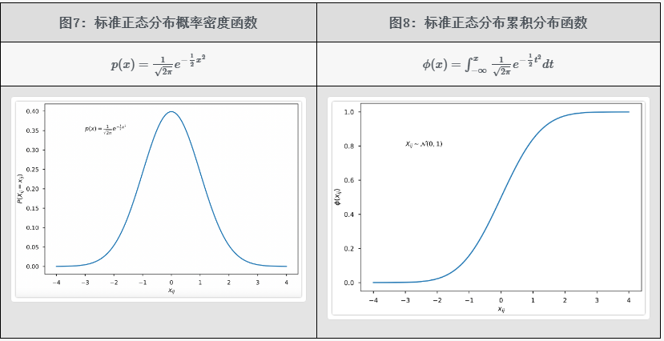

> 这里描述的设计 GELU 函数的直觉思路是非常简化的版本，只是为了易于理解。实际在设计这个函数时还需要考虑更多的因素，比如该函数的那几条性质和 ReLU 很像，已经有了 ReLU 为什么还要设计这个函数，这个函数在理论上是否能够解决 ReLU 的存在的 Dead ReLU 等问题；

#### [6.2 函数及导数](https://dongnian.icu/llm_interview_note/#/01.大语言模型基础/1.激活函数/1.激活函数?id=_62-函数及导数)

GeLU 公式为：

GELU=x⋅ϕ(x)*GE**LU*=*x*⋅*ϕ*(*x*)

使用该函数作为激活函数时，需要求解其导数。对其求导可得：

ddxGELU=ϕ(x)+xddxϕ(x)=ϕ(x)+x⋅p(X=x)*d**x**d**GE**LU*=*ϕ*(*x*)+*x**d**x**d**ϕ*(*x*)=*ϕ*(*x*)+*x*⋅*p*(*X*=*x*)

其中X*X*是随机变量，p(X=x)*p*(*X*=*x*)是图7中的标准正态分布概率密度函数中，随机变量取值为x*x*时的值。

GELU 函数及其导数的图像如下所示。可以看出其函数图像和 ReLU 非常相似，其导数图像也和 ReLU 的导数图像非常相似，不过该图像是连续的。

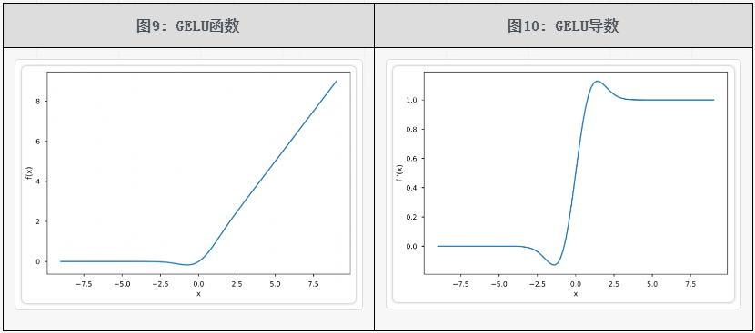

GELU 激活函数的优缺点：

- 从其函数图像可以看出，在负值区域，不再全为0，这解决了 Dead ReLU 问题；
- GELU 函数是处处连续、光滑可导的；

#### [6.3 精确计算](https://dongnian.icu/llm_interview_note/#/01.大语言模型基础/1.激活函数/1.激活函数?id=_63-精确计算)

对于 GeLU 的加速计算有两种方法。

第一种方法是精确求解。有一个函数为 Gauss Error function (gef)，由于使用率非常高所以在常见的库（比如TensorFlow、PyTorch）中都有针对该函数的优化，该函数的公式如下。

erf⁡(y)=2π∫0ye−t2dterf(*y*)=*π*2∫0*y**e*−*t*2*d**t*

所以如果能够先求解出erf(⋅)*er**f*(⋅)，再由该函数求解出 ϕ(x)*ϕ*(*x*)，那么可以加快计算。下面省略具体的推导过程，直接给出计算公式：

ϕ(x)=1+erf⁡(x2)2*ϕ*(*x*)=21+erf(2*x*)

另一种方法是不精确求解，而是求解其近似值。为了加速计算，还可以使用近似计算的方式。GELU 的近似公式如下所示：

GELU=0.5∗x(1+tanh⁡[2π(x+0.044715x3)])*GE**LU*=0.5∗*x*(1+tanh[*π*2(*x*+0.044715*x*3)])

### [7.Swish](https://dongnian.icu/llm_interview_note/#/01.大语言模型基础/1.激活函数/1.激活函数?id=_7swish)

该激活函数的公式为：

f(x)=x⋅σ(x)*f*(*x*)=*x*⋅*σ*(*x*)

Swish导数：

f′(x)=σ(x)+x⋅σ(x)⋅(1−σ(x))=x⋅σ(x)+σ(x)(1−x⋅σ(x))=f(x)+σ(x)⋅(1−f(x))*f*′(*x*)=*σ*(*x*)+*x*⋅*σ*(*x*)⋅(1−*σ*(*x*))=*x*⋅*σ*(*x*)+*σ*(*x*)(1−*x*⋅*σ*(*x*))=*f*(*x*)+*σ*(*x*)⋅(1−*f*(*x*))

该激活函数的图像为：

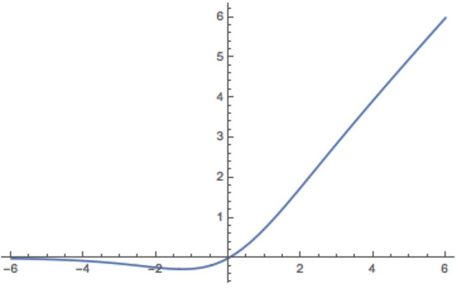

Swish特点：

- 和ReLU一样，没有上边界，因此不会出现梯度饱和现象
- 有下边界，可以产生更强的正则化效果（x左半轴慢慢趋近于0）
- 非单调
- 处处连续且可到，更容易训练

关于正则化效果：x轴越靠近左半轴，纵坐标的值越小，甚至接近于0，如果x值是-10，那么经过激活之后的值接近于0，那么就可以一定程度上过滤掉一部分信息，起到[正则化](https://so.csdn.net/so/search?q=正则化&spm=1001.2101.3001.7020)的效果。

### [8.GLU](https://dongnian.icu/llm_interview_note/#/01.大语言模型基础/1.激活函数/1.激活函数?id=_8glu)

GLU 全称为 Gated Linear Unit，即**门控线性单元函数**。

参考ReLU激活函数，激活函数GLU的公式为如下公式的形式

GLU⁡(x)=x⊗σ(g(x))GLU(*x*)=*x*⊗*σ*(*g*(*x*))

这里有一个新符号 g(x)*g*(*x*)表示的是向量x*x*经过一层MLP或者卷积，⊗⊗表示两个向量逐元素相乘，σ*σ* 表示sigmoid函数。

当σ(g(x))*σ*(*g*(*x*))趋近于0时表示对x*x*进行阻断，当σ(g(x))*σ*(*g*(*x*))趋近于1时表示允许x*x*通过，以此实现门控激活函数的效果。

## 基础

### **拟合**

过拟合（over-fitting），机器学习模型或者是深度学习模型在训练样本中表现得过于优越，导致在验证数据集以及测试数据集中表现不佳。也就是泛化误差比较大，泛化能力差。从方差和偏差的角度来说，过拟合也就是训练集上高方差，低偏差

原因：

- 数据量太小
- 模型复杂度太高
- 过度训练

解决

- 正则化：L1、L2、dropout、BN
- 加大数据量、数据增强、数据清洗
- 减小模型参数、或者微调大模型
- 学习率衰减

### **正则化**

**正则化**是指在机器学习和统计建模中的一种技术，用于控制模型的复杂度，**防止模型在训练数据上过度拟合（overfitting）**。当模型过度拟合时，它会学习到训练数据中的噪声和细微变化，导致在新数据上的性能下降。

正则化通过在模型的**损失函数中引入额外的惩罚项**，来对模型的参数进行约束，从而**降低模型的复杂度**。这个额外的惩罚通常与模型参数的大小或者数量相关，旨在鼓励模型学习简单的规律，而不是过度拟合训练数据。

L1 正则化：也称为 Lasso 正则化，它通过在模型的损失函数中增加权重的 L1 范数（权重向量的绝对值之和）来实现正则化。L1 正则化倾向于产生稀疏权重矩阵，即将一些权重推向零，从而实现特征选择的效果。

L2 正则化：也称为 Ridge 正则化，它通过在模型的损失函数中增加权重的 L2 范数（权重向量的平方和）来实现正则化。L2 正则化会使权重值变得较小，但不会直接导致权重稀疏，因此不具有特征选择的作用，但可以有效地控制模型的复杂度。

### 归一化

1. BN是在batch上，对N、H、W做归一化，而保留通道 C 的维度。BN对较小的batch size效果不好。BN适用于固定深度的前向神经网络，如CNN，不适用于RNN；

2. LN在通道方向上，对C、H、W归一化，主要对RNN效果明显；

3. IN在图像像素上，对H、W做归一化，用在风格化迁移；

4. GN将channel分组，然后再做归一化。

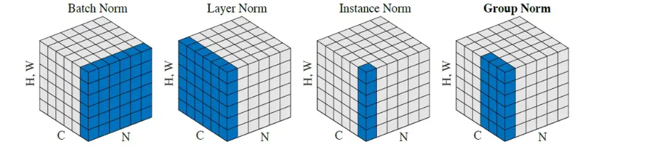