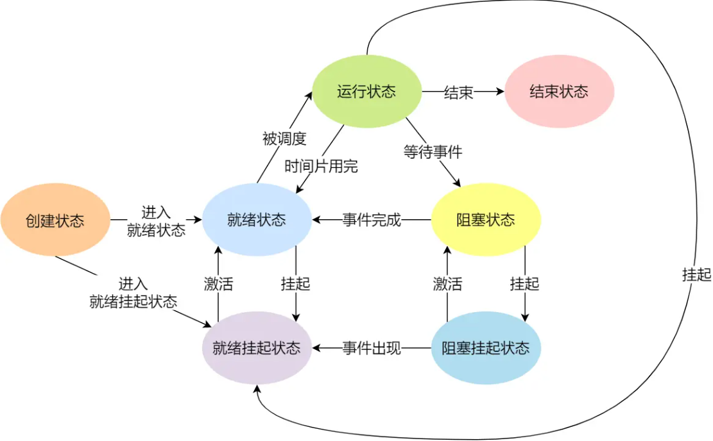
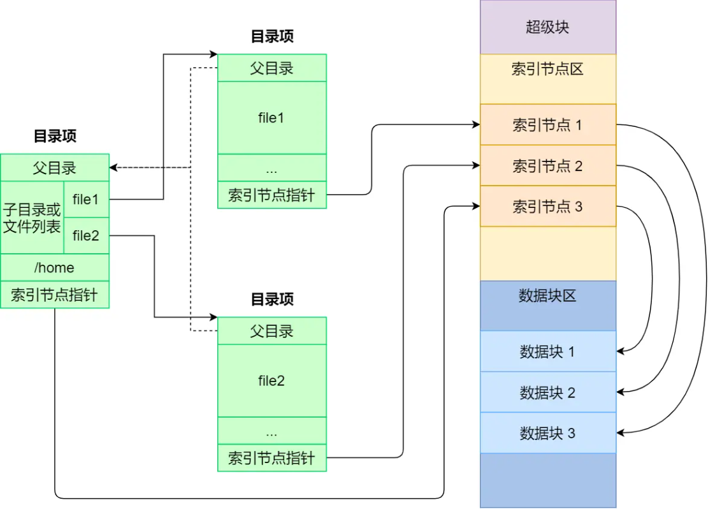

# 系统

## 内存管理

**虚拟内存**

将进程所使用的地址隔离起来，每个进程分配独立的地址互不干扰，起到这样作用的地址是虚拟地址。将不同进程的虚拟地址和不同内存的物理地址映射起来。我们程序所使用的内存地址叫做**虚拟内存地址**。实际存在硬件里面的空间地址叫**物理内存地址**

虚拟内存作用

- 虚拟内存可以使得进程对运行内存超过物理内存大小，因为程序运行符合局部性原理，CPU 访问内存会有很明显的重复访问的倾向性，对于那些没有被经常使用到的内存，我们可以把它换出到物理内存之外，比如硬盘上的 swap 区域。
- 由于每个进程都有自己的页表，所以每个进程的虚拟内存空间就是相互独立的。进程也没有办法访问其他进程的页表，所以这些页表是私有的，这就解决了多进程之间地址冲突的问题。
- 页表里的页表项中除了物理地址之外，还有一些标记属性的比特，比如控制一个页的读写权限，标记该页是否存在等。在内存访问方面，操作系统提供了更好的安全性。

####虚拟地址与物理地址之间的关系？

主要有两种方式，分别是**内存分段和内存分页**

**内存分段**

分段机制下的虚拟地址由两部分组成，**段选择因子**和**段内偏移量**。段选择子里面最重要的是**段号**，用作段表的索引。**段表**里面保存的是这个**段的基地址、段的界限和特权等级**等。段基地址加上段内偏移量得到物理内存地址。

缺点：

1.**内存碎片：**内存分段管理可以做到段根据实际需求分配内存，所以有多少需求就分配多大的段，所以**不会出现内部内存碎片**。但是由于每个段的长度不固定，所以多个段未必能恰好使用所有的内存空间，会产生了多个不连续的小物理内存，导致新的程序无法被装载，所以**会出现外部内存碎片**的问题。

解决「外部内存碎片」的问题就是**内存交换**：将部分内存写道硬盘上，用完时再读回。

2.**内存交换的效率低**：硬盘的访问速度要比内存慢太多，若交换空间大，会卡顿。

**内存分页**

分页是把整个虚拟和物理内存空间切成一段段固定尺寸的大小。这样一个连续并且尺寸固定的内存空间叫页。虚拟地址与物理地址之间通过页表来映射。页表是存储在内存，**内存管理单元** （*MMU*）负责将虚拟内存地址转换成物理地址。

内存分页由于内存空间都是预先划分好的，也就不会像内存分段一样，在段与段之间会产生间隙非常小的内存，这正是分段会产生外部内存碎片的原因。而采用了分页，页与页之间是紧密排列的，所以不会有外部碎片。

Swap 机制：内存空间不够时，操作系统会把其他正在运行的进程中的「最近没被使用」的内存页面给释放掉，暂时写在硬盘上，称为**换出**。需要再加载称为**换入**。所以磁盘写入量很小，内存交换的效率就相对比较高。

虚拟地址分为页号和页内偏移。页号作为页表的索引，**页表**包含物理页每页所在**物理内存的基地址**，基地址+页内偏移=物理内存地址

**缺点**：

内存分页机制分配内存的最小单位是一页，即使程序不足一页大小，我们最少只能分配一个页，所以页内会出现内存浪费，所以会有内部内存碎片。

每个页表需要的存储空间随进程的变多而增大。可能会消耗很多空间来存储页表。

**多级页表**

我们把这个 100 多万个「页表项」的单级页表再分页，将一级页表分为 `1024` 个二级页表，每二级页表中包含 `1024` 个「页表项」，形成二级分页。如果某个一级页表的页表项没有被用到，也就不需要创建这个页表项对应的二级页表了，即可以在需要时才创建二级页表。对于 64 位的系统，两级分页肯定不够了，就变成了四级目录。

虚拟地址到物理地址的转换步骤变多，有时间开销。使用页表缓存(TLB)，把最常访问的几个页表项存储到访问速度更快的硬件。

#### 段页式内存管理

内存分段和内存分页组合使用。先将程序划分为多个有逻辑意义的段；接着再把每个段划分为多个页；地址结构就由**段号、段内页号和页内位移**三部分组成。

### malloc分配内存

malloc 申请虚拟内存的时候，会有两种方式向操作系统申请堆内存。

- 方式一：通过 brk() 系统调用从堆分配内存
- 方式二：通过 mmap() 系统调用在文件映射区域分配内存；

- 如果用户分配的内存小于 128 KB，则通过 brk() 申请内存；
- 如果用户分配的内存大于 128 KB，则通过 mmap() 申请内存；

malloc() 在分配内存的时候，并不是老老实实按用户预期申请的字节数来分配内存空间大小，而是**会预分配更大的空间作为内存池**。**malloc(1) 实际上预分配 132K 字节的内存**。

- malloc 通过 **brk()** 方式申请的内存，free 释放内存的时候，**并不会把内存归还给操作系统，而是缓存在 malloc 的内存池中，待下次使用**；
- malloc 通过 **mmap()** 方式申请的内存，free 释放内存的时候，**会把内存归还给操作系统，内存得到真正的释放**。

向操作系统申请内存，是要通过系统调用的，执行系统调用是要进入内核态的，然后在回到用户态，运行态的切换会耗费不少时间。申请内存的操作应该避免频繁的系统调用，如果都用 mmap 来分配内存，等于每次都要执行系统调用。

### 内存回收

- **后台内存回收**（kswapd）：在物理内存紧张的时候，会唤醒 kswapd 内核线程来回收内存，这个回收内存的过程**异步**的，不会阻塞进程的执行。
- **直接内存回收**（direct reclaim）：如果后台异步回收跟不上进程内存申请的速度，就会开始直接回收，这个回收内存的过程是**同步**的，会阻塞进程的执行。

如果直接内存回收后，空闲的物理内存仍然无法满足此次物理内存的申请会触发OOM。

OOM Killer 机制会根据算法选择一个占用物理内存较高的进程，然后将其杀死，以便释放内存资源，如果物理内存依然不足，OOM Killer 会继续杀死占用物理内存较高的进程，直到释放足够的内存位置。

杀死哪个进程由oom_badness()得分决定，高的先死。用「系统总的可用页面数」乘以 「OOM 校准值 oom_score_adj」再除以 1000，最后再加上进程已经使用的物理页面数，计算出来的值越大，那么这个进程被 OOM Kill 的几率也就越大。

- 如果你不想某个进程被首先杀掉，那你可以调整该进程的 oom_score_adj，从而改变这个进程的得分结果，降低该进程被 OOM 杀死的概率。
- 如果你想某个进程无论如何都不能被杀掉，那你可以将 oom_score_adj 配置为 -1000。

主要有两类内存可以被回收，文件页和匿名页的回收都是基于 LRU 算法，也就是优先回收不常访问的内存。：

- **文件页**：内核缓存的磁盘数据（Buffer）和内核缓存的文件数据（Cache）都叫作文件页。大部分文件页，都可以直接释放内存。但对于脏页，要先写入磁盘，然后才能进行内存释放。
- **匿名页**：这部分内存没有实际载体，不像文件缓存有硬盘文件这样一个载体，比如堆、栈数据等。这部分内存很可能还要再次被访问，所以不能直接释放内存，它们**回收的方式是通过 Linux 的 Swap 机制**，Swap 会把不常访问的内存先写到磁盘中，然后释放这些内存，给其他更需要的进程使用。再次访问这些内存时，重新从磁盘读入内存就可以了。


## 进程与线程

进程：运行的程序叫进程

线程：一个进程内的不同任务叫线程。是进程当中的一条执行流程

协程：用户态的轻量级线程，线程内部调度的基本单位

并发和并行：一个核交替进行不同的任务就是并发；多核处理不同的任务就是并行。

**进程的状态**



当进程请求某个事件且必须等待时，例如请求 I/O 事件会进入阻塞状态，在虚拟内存管理的操作系统中，通常会把阻塞状态的进程的物理内存空间换出到硬盘。进程没有占用实际的物理内存空间的情况，这个状态就是挂起状态。

在操作系统中，是用**进程控制块**（*process control block，PCB*）数据结构来描述进程的。PCB 是进程存在的唯一标识。PCB 主要包含下面几部分的内容：进程的描述信息、调度信息、对资源的需求情况、打开的文件信息、处理机的状态信息

**进程的上下文切换**

进程的上下文切换不仅包含了虚拟内存、栈、全局变量等用户空间的资源，还包括了内核堆栈、寄存器等内核空间的资源。会把交换的信息保存在进程的 PCB，当要运行另外一个进程的时候，我们需要从这个进程的 PCB 取出上下文，然后恢复到 CPU 中

**僵尸进程**：子进程已经终止，但是其父进程仍在运行，且父进程没有调用 wait()或 waitpid()等系统调用来获取子进程的状态信息，释放子进程占用的资源，导致子进程的 PCB 依然存在于系统中，但无法被进一步使用。这种情况下，子进程被称为“僵尸进程”。避免僵尸进程的产生，父进程需要及时调用 wait()或 waitpid()系统调用来回收子进程。

**孤儿进程**：一个进程的父进程已经终止或者不存在，但是该进程仍在运行。这种情况下，该进程就是孤儿进程。孤儿进程通常是由于父进程意外终止或未及时调用 wait()或 waitpid()等系统调用来回收子进程导致的。

**守护进程**：指在后台运行的，没有控制终端与之相连的进程。它独立于控制终端，周期性地执行某种任务。

**线程**

同一个进程内多个线程之间可以共享代码段、数据段、打开的文件等资源，但每个线程各自都有一套独立的寄存器和栈，这样可以确保线程的控制流是相对独立的。

**线程上下文切换**

两个线程不是属于同一个进程，则切换的过程就跟进程上下文切换一样；当不属于一个进程时，因为虚拟内存是共享的，所以在切换时，虚拟内存这些资源就保持不动，只需要切换线程的私有数据、寄存器等不共享的数据。

**线程的实现方式**

用户线程：在用户空间实现的线程，不是由内核管理的线程，是由用户态的线程库来完成线程的管理；

内核线程：在内核中实现的线程，是由内核管理的线程；

轻量级进程：在内核中来支持用户线程；

### 线程与进程的比较

- 进程是资源（包括内存、打开的文件等）分配的单位，线程是 CPU 调度的单位；
- 进程拥有一个完整的资源平台，而线程只独享必不可少的资源，如寄存器和栈；
- 线程同样具有就绪、阻塞、执行三种基本状态，同样具有状态之间的转换关系；
- 线程能减少并发执行的时间和空间开销；

**有了进程为什么还需要线程?**

进程切换是一个开销很大的操作，线程切换的成本较低。

线程更轻量，一个进程可以创建多个线程。

多个线程可以并发处理不同的任务，更有效地利用了多处理器和多核计算机。而进程只能在一个时间干一件事，如果在执行过程中遇到阻塞问题比如 IO 阻塞就会挂起直到结果返回。

同一进程内的线程共享内存和文件，因此它们之间相互通信无须调用内核。

**一个进程可以创建多少线程**

- 如果是32 位系统，用户态的虚拟空间只有 3G，如果创建线程时分配的栈空间是 10M，那么一个进程最多只能创建 300 个左右的线程。
- 如果是64 位系统，用户态的虚拟空间大到有 128T，理论上不会受虚拟内存大小的限制，而会受系统的参数或性能限制。

**调度**

选择一个进程运行这一功能是在操作系统中完成的，通常称为**调度程序**（*scheduler*）。

- **非抢占式调度算法**挑选一个进程，然后让该进程运行直到被阻塞，或者直到该进程退出，才会调用另外一个进程，也就是说不会理时钟中断这个事情。
- **抢占式调度算法**挑选一个进程，然后让该进程只运行某段时间，如果在该时段结束时，该进程仍然在运行时，则会把它挂起，接着调度程序从就绪队列挑选另外一个进程。这种抢占式调度处理，需要在时间间隔的末端发生**时钟中断**，以便把 CPU 控制返回给调度程序进行调度，也就是常说的**时间片机制**。

### 调度算法

通常有以下情况会发生进程调度：

1. 当进程从运行状态转到等待状态；
2. 当进程从运行状态转到就绪状态；
3. 当进程从等待状态转到就绪状态；
4. 当进程从运行状态转到终止状态；

**先来先服务调度算法**

每次从就绪队列选择最先进入队列的进程，然后一直运行，直到进程退出或被阻塞，才会继续从队列中选择第一个进程接着运行。

**最短作业优先调度算法**

它会优先选择运行时间最短的进程来运行，这有助于提高系统的吞吐量。

**高响应比优先调度算法**

每次进行进程调度时，先计算「响应比优先级」，然后把「响应比优先级」最高的进程投入运行，「响应比优先级」的计算公式：(等待时间+要求服务时间)/要求服务时间。进程要求服务的时间不可预估，高响应比优先调度算法是「理想型」的调度算法，不可实现。

**时间片轮转调度算法**

每个进程被分配一个时间段，称为时间片，即允许该进程在该时间段中运行。

**最高优先级调度算法**

从就绪队列中选择最高优先级的进程进行运行。进程的优先级可以分为，静态优先级(不变化)和动态优先级(随着时间的推移增加等待进程的优先级)。

**多级反馈队列调度算法**

「时间片轮转算法」和「最高优先级算法」的综合和发展。

- 设置了多个队列，赋予每个队列不同的优先级，每个**队列优先级从高到低**，同时**优先级越高时间片越短**；
- 新的进程会被放入到第一级队列的末尾，按先来先服务的原则排队等待被调度，如果在第一级队列规定的时间片没运行完成，则将其转入到第二级队列的末尾，以此类推，直至完成；
- 当较高优先级的队列为空，才调度较低优先级的队列中的进程运行。如果进程运行时，有新进程进入较高优先级的队列，则停止当前运行的进程并将其移入到原队列末尾，接着让较高优先级的进程运行；

#### 内存页面置换算法

当 CPU 访问的页面不在物理内存时，便会产生一个**缺页中断**，请求操作系统将所缺页调入到物理内存。

- 缺页中断在指令执行「期间」产生和处理中断信号，而一般中断在一条指令执行「完成」后检查和处理中断信号。
- 缺页中断返回到该指令的开始重新执行「该指令」，而一般中断返回回到该指令的「下一个指令」执行。

执行缺页中断处理函数，会查找该页面在磁盘中的页面的位置。需要把该页面换入到物理内存中，但前提是物理内存中存在空闲页。

找不到空闲页的话，就说明此时内存已满了，这时候，就需要「页面置换算法」选择一个物理页，如果该物理页有被修改过（脏页），则把它换出到磁盘，然后把该被置换出去的页表项的状态改成「无效的」，最后把正在访问的页面装入到这个物理页中。

**最佳页面置换算法**

该算法实现需要计算内存中每个逻辑页面的「下一次」访问时间，然后比较，选择未来最长时间不访问的页面。但实际系统中无法预测下一次。是理想的无法实现的。

**先进先出置换算法**

选择在内存驻留时间很长的页面进行中置换

**最近最久未使用的置换算法*LRU***

选择最长时间没有被访问的页面进行置换

**时钟页面置换算法**

把所有的页面都保存在一个类似钟面的「环形链表」中，一个表针指向最老的页面。

当发生缺页中断时，算法首先检查表针指向的页面：

- 如果它的访问位位是 0 就淘汰该页面，并把新的页面插入这个位置，然后把表针前移一个位置；
- 如果访问位是 1 就清除访问位，并把表针前移一个位置，重复这个过程直到找到了一个访问位为 0 的页面为止；

发生缺页时会将沿途遇到访问位为1的修改为0.遇到0淘汰。

**最不常用算法*LFU***

当发生缺页中断时，选择「访问次数」最少的那个页面，并将其淘汰。

#### 磁盘调度算法

为了提高磁盘的访问性能，一般是通过优化磁盘的访问请求顺序来做到的。

**先来先服务**

先到来的请求，先被服务。

**最短寻道时间优先**

优先选择从当前磁头位置所需寻道时间最短的请求。但这个算法可能存在某些请求的饥饿，假设是一个动态的请求，磁头在可能在一小块区域来回移动，一些磁道横长时间不会响应

**扫描算法**

磁头在一个方向上移动，访问所有未完成的请求，直到磁头到达该方向上的最后的磁道，才调换方向，这就是扫描算法。

**循环扫描算法**

只有磁头朝某个特定方向移动时，才处理磁道访问请求，而返回时直接快速移动至最靠边缘的磁道，也就是复位磁头，这个过程是很快的，并且返回中途不处理任何请求，该算法的特点，就是**磁道只响应一个方向上的请求**。

**LOOK 与 C-LOOK算法**

我们前面说到的扫描算法和循环扫描算法，都是磁头移动到磁盘「最始端或最末端」才开始调换方向。

LOOK 与 C-LOOK算法是对扫描算法和循环扫描算法的优化，仅仅移动到最远的请求位置，然后立即反向移动不需要移动到磁盘的最始端或最末端。

###进程间通信方式

每个进程的用户地址空间都是独立的,但内核空间是每个进程都共享的，进程之间要通信必须通过内核。

#### 管道

「`|`」竖线就是一个匿名管道，用完了就销毁。将前一个命令的输出，作为后一个命令的输入。管道还有另外一个类型是命名管道，先需要通过 `mkfifo` 命令来创建，并且指定管道名字

于匿名管道，它的通信范围是存在父子关系的进程。因为管道没有实体，也就是没有管道文件，只能通过 fork 来复制父进程 fd 文件描述符，来达到通信的目的。对于命名管道，它可以在不相关的进程间也能相互通信。因为命令管道，提前创建了一个类型为管道的设备文件，在进程里只要使用这个设备文件，就可以相互通信。

#### 消息队列

管道的通信方式是效率低的，因此管道不适合进程间频繁地交换数据。

消息队列是保存在内核中的消息链表， 消息体是用户自定义的数据类型，消息的发送方和接收方要约定好消息体的数据类型。A进程把数据放在对应的消息队列后就可返回，B 进程需要时再读取数据。消息队列生命周期随内核，如果没有释放消息队列或者没有关闭操作系统，消息队列会一直存在。

缺点：核中每个消息体都有一个最大长度的限制，消息队列不适合比较大数据的传输。消息队列通信过程中，存在用户态与内核态之间的数据拷贝开销。

#### 共享内存

共享内存的机制，就是拿出一块虚拟地址空间来，映射到相同的物理内存中。进程写入的东西，另外一个进程马上就能看到。

如果多个进程同时修改同一个共享内存，有可能就冲突。

**信号量**使得共享资源在任意时刻只能被一个进程访问，避免冲突。信号量其实是一个整型的计数器，主要用于实现进程间的互斥与同步，而不是用于缓存进程间通信的数据。

信号量表示资源的数量，控制信号量的方式有两种原子操作：一个是 **P 操作**，这个操作会把信号量减去 1，另一个是 **V 操作**，这个操作会把信号量加上 1。P 操作是用在进入共享资源之前，V 操作是用在离开共享资源之后。

信号初始化为 `1`，就代表着是**互斥信号量**。A 在访问共享内存前，先执行了 P 操作，信号量变为 0可访问共享内存。 B 也想访问共享内存，执行了 P 操作，结果信号量变为了 -1， B 被阻塞。 A 访问完执行 V 操作，信号量恢复为 0唤醒阻塞中的线程 B，B访问完执行 V 操作，信号量恢复到初始值 1。

初始化信号量为 `0`，实现多进程同步为**同步信号量**。B进程依赖A进程数据，所以需要在A之后进行。若B执行到 P 操作，信号量变-1，B被阻塞。直到A执行V操作使信号量变为0，会唤醒阻塞的B

#### 信号

异常情况下的工作模式，就需要用「信号」的方式来通知进程。

信号事件的来源主要有硬件来源（如键盘 Cltr+C ）和软件来源（如 kill 命令）。如果进程在后台运行，可以通过 `kill` 命令的方式给进程发送信号，但前提需要知道运行中的进程 PID 号。

信号是进程间通信机制中**唯一的异步通信机制**。可以在任何时候发送信号给某一进程。

####Socket 通信

跨网络与不同主机上的进程之间通信，就需要 Socket 通信了。实际上，Socket 通信不仅可以跨网络与不同主机的进程间通信，还可以在同主机上进程间通信。

### 多线程冲突

多个线程如果竞争共享资源，如果不采取有效的措施，则会造成共享数据的混乱。

**互斥**

多线程执行操作共享变量可能会导致竞争状态，此段代码称为临界区，所以访问共享资源的代码片段，一定不能给多线程同时执行。我们希望这段代码是互斥，这段代码执行过程中，最多只能出现一个线程。

**同步**

同步，就是并发进程/线程在一些关键点上可能需要互相等待与互通消息，这种相互制约的等待与互通信息称为进程/线程同步。

### **锁**

为了实现进程/线程间正确的协作，操作系统必须提供实现进程协作的措施和方法，主要的方法有两种：锁和信号量。根据锁的实现不同，可以分为「忙等待锁」和「无忙等待锁」。

忙等待锁：当获取不到锁时，线程就会一直 while 循环，不做任何事情，所以就被称为「忙等待锁」，也被称为**自旋锁**

无忙等待锁：获取不到锁的时候，不用自旋。把当前线程放入到锁的等待队列，然后执行调度程序，把 CPU 让给其他线程执行。

#### 互斥锁与自旋锁

最底层的两种锁，是其他高级锁的基础

- **互斥锁**加锁失败后，线程会**释放 CPU** ，给其他线程；
- **自旋锁**加锁失败后，线程会**忙等待**，直到它拿到锁；

互斥锁加锁失败而阻塞的现象，是由操作系统内核实现的，会从用户态陷入到内核态，让内核帮我们切换线程，虽然简化了使用锁的难度，但是存在一定的性能开销成本。旋锁是通过 CPU 提供的 `CAS` 函数，在「用户态」完成加锁和解锁操作，不会主动产生线程上下文切换。

#### 读写锁

当「写锁」没有被线程持有时，多个线程能够并发地持有读锁。一旦「写锁」被线程持有后，读线程的获取读锁的操作会被阻塞，其他写线程的获取写锁的操作也会被阻塞。

#### 乐观锁与悲观锁

互斥锁、自旋锁、读写锁，都是属于悲观锁。

悲观锁认为多线程同时修改共享资源的概率比较高，于是很容易出现冲突，所以访问共享资源前，先要上锁。

乐观锁假定冲突的概率很低，先修改完共享资源，再验证这段时间内有没有发生冲突，如果没有其他线程在修改资源，那么操作完成，如果发现有其他线程已经修改过这个资源，就放弃本次操作。

CAS 是乐观锁，但基于 CAS 实现的自旋锁是悲观锁。CAS 和自旋锁不同之处，自旋锁基于 CAS 加了while 或者睡眠 CPU 的操作而产生自旋的效果，加锁失败会忙等待直到拿到锁，自旋锁是要需要事先拿到锁才能修改数据的，所以算悲观锁。

### 怎么避免死锁？

当两个线程为了保护两个不同的共享资源而使用了两个互斥锁，那么这两个互斥锁应用不当的时候，可能会造成两个线程都在等待对方释放锁，这种情况就是发生了**死锁**。

死锁发生的必要条件：

**互斥**：资源必须处于非共享模式，即一次只有一个进程可以使用。如果另一进程申请该资源，那么必须等待直到该资源被释放为止。

**占有并等待**：一个进程至少应该占有一个资源，并等待另一资源，而该资源被其他进程所占有。

**非抢占**：资源不能被抢占。只能在持有资源的进程完成任务后，该资源才会被释放。

**循环等待**：有一组等待进程 `{P0, P1,..., Pn}`， `P0` 等待的资源被 `P1` 占有，`P1` 等待的资源被 `P2` 占有，……，`Pn-1` 等待的资源被 `Pn` 占有，`Pn` 等待的资源被 `P0` 占有。

最常见的并且可行的解决死锁的方法就是**使用资源有序分配法，来破环环路等待条件**。

当线程 A 是先尝试获取资源 A，然后尝试获取资源 B 的时候，线程 B 同样也是先尝试获取资源 A，然后尝试获取资源 B。也就是说，线程 A 和 线程 B 总是以相同的顺序申请自己想要的资源。

###为什么线程崩溃崩溃不会导致 JVM 崩溃?

进程中各个线程的地址空间是共享的，某个线程对地址的非法访问就会导致内存的不确定性，进而可能会影响到其他线程。线程崩溃后，通过信号使进程崩溃。如果自定义了信号处理函数会到此函数中执行。JVM 自定义了自己的信号处理函数，拦截了 SIGSEGV 信号，针对这两者不让它们崩溃。

## 文件系统

文件系统是操作系统中负责管理持久数据的子系统，负责把用户的文件存到磁盘硬件中。

文件系统的基本数据单位是文件，它的目的是对磁盘上的文件进行组织管理，那组织的方式不同，就会形成不同的文件系统。

Linux 文件系统会为每个文件分配两个数据结构：索引节点（index node）和目录项（directory entry），它们主要用来记录文件的元信息和目录层次结构。

- 索引节点，也就是 *inode*，用来记录文件的元信息，比如 inode 编号、文件大小、访问权限、创建时间、修改时间、**数据在磁盘的位置**等等。索引节点是文件的**唯一**标识，它们之间一一对应，也同样都会被存储在硬盘中，所以**索引节点同样占用磁盘空间**。
- 目录项，也就是 *dentry*，用来记录文件的名字、**索引节点指针**以及与其他目录项的层级关联关系。多个目录项关联起来，就会形成目录结构，但它与索引节点不同的是，**目录项是由内核维护的一个数据结构，不存放于磁盘，而是缓存在内存**。

磁盘读写的最小单位是**扇区**（512B），为了提高读写效率，文件系统把多个扇区组成了一个**逻辑块**，每次读写的最小单位就是逻辑块（数据块）。



磁盘进行格式化的时候，会被分成三个存储区域，分别是超级块、索引节点区和数据块区。

- *超级块*，用来存储文件系统的详细信息，比如块个数、块大小、空闲块等等。当文件系统挂载时进入内存
- *索引节点区*，用来存储索引节点；当文件被访问时进入内存
- *数据块区*，用来存储文件或目录数据；

**虚拟文件系统**

文件系统的种类众多，而操作系统希望对用户提供一个统一的接口，于是在用户层与文件系统层引入了中间层，这个中间层就称为虚拟文件系统（Virtual File System，VFS）。

###**文件存储**

数据在磁盘上的存放方式：连续空间存放方式、非连续空间存放方式。非连续空间存放方式又可以分为「链表方式」和「索引方式」。

**连续空间存放方式**

连续空间存放方式顾名思义，文件存放在磁盘「连续的」物理空间中。读写效率很高，因为一次磁盘寻道就可以读出整个文件。使用连续存放的方式有一个前提，必须先知道一个文件的大小。连续空间存放的方式虽然读写效率高，**但是有「磁盘空间碎片」和「文件长度不易扩展」的缺陷。**

**非连续空间存放方式**

链表的方式存放是**离散的，不用连续的**，于是就可以**消除磁盘碎片**，可大大提高磁盘空间的利用率，同时**文件的长度可以动态扩展**。根据实现的方式的不同，链表可分为「**隐式链表**」和「**显式链接**」两种形式。

隐式链表：实现的方式是文件头要包含「第一块」和「最后一块」的位置，并且每个数据块里面留出一个指针空间，用来存放下一个数据块的位置。

显式链接：把用于链接文件各数据块的指针，显式地存放在内存的一张链接表中，该表在整个磁盘仅设置一张，每个表项中存放链接指针，指向下一个数据块号。

**索引**的实现是为每个文件创建一个「**索引数据块**」，里面存放的是**指向文件数据块的指针列表**

链表 + 索引的组合，这种组合称为「**链式索引块**」，它的实现方式是在索引数据块留出一个存放下一个索引数据块的指针。

###空闲空间管理

**空闲表法**

空闲表法就是为所有空闲空间建立一张表，表内容包括空闲区的第一个块号和该空闲区的块个数

**空闲链表法**

使用「链表」的方式来管理空闲空间，每一个空闲块里有一个指针指向下一个空闲块

**位图法**

位图是利用二进制的一位来表示磁盘中一个盘块的使用情况，磁盘上所有的盘块都有一个二进制位与之对应。

###目录

目录其实也是个文件，和普通文件不同的是，普通文件的块里面保存的是文件数据，而目录文件的块里面保存的是目录里面一项一项的文件信息。最简单的保存格式就是**列表**，就是一项一项地将目录下的文件信息（如文件名、文件 inode、文件类型等）列在表里。

保存目录的格式改成**哈希表**，对文件名进行哈希计算，把哈希值保存起来，如果我们要查找一个目录下面的文件名，可以通过名称取哈希。如果哈希能够匹配上，就说明这个文件的信息在相应的块里面。

### 软链接和硬链接

硬链接是多个目录项中的「索引节点」指向一个文件（同一个 inode），inode 是不可能跨越文件系统,所以硬链接是不可用于跨文件系统的。

软链接相当于重新创建一个文件，这个文件有独立的 inode，但是这个文件的内容是另外一个文件的路径，所以访问软链接的时候，实际上相当于访问到了另外一个文件，所以软链接是可以跨文件系统的，甚至目标文件被删除了，链接文件还是在的，只不过指向的文件找不到了而已。

### 文件IO

**缓冲与非缓冲 I/O**

- 缓冲 I/O，利用的是标准库的缓存实现文件的加速访问，而标准库再通过系统调用访问文件。
- 非缓冲 I/O，直接通过系统调用访问文件，不经过标准库缓存。

**直接与非直接 I/O**

- 直接 I/O，不会发生内核缓存和用户程序之间数据复制，而是直接经过文件系统访问磁盘。
- 非直接 I/O，读操作时，数据从内核缓存中拷贝给用户程序，写操作时，数据从用户程序拷贝给内核缓存，再由内核决定什么时候写入数据到磁盘。

以下几种场景会触发内核缓存的数据写入磁盘：

- 在调用 `write` 的最后，当发现内核缓存的数据太多的时候，内核会把数据写到磁盘上；
- 用户主动调用 `sync`，内核缓存会刷到磁盘上；
- 当内存十分紧张，无法再分配页面时，也会把内核缓存的数据刷到磁盘上；
- 内核缓存的数据的缓存时间超过某个时间时，也会把数据刷到磁盘上

**阻塞与非阻塞 I/O VS 同步与异步 I/O**

- 阻塞I/O：当用户程序执行 `read` ，线程会被阻塞，一直等到内核数据准备好，并把数据从内核缓冲区拷贝到应用程序的缓冲区中，当拷贝过程完成，`read` 才会返回。
- 非阻塞I/O：read 请求在数据未准备好的情况下立即返回，可以继续往下执行，此时应用程序不断轮询内核，直到数据准备好，内核将数据拷贝到应用程序缓冲区

非阻塞每次轮询内核的 I/O 是否准备好应用程序啥也做不了，只是在循环。 使用**I/O 多路复用**，如果没有事件发生，那么当前线程就会发生阻塞，这时 CPU 会切换其他线程执行任务，等内核发现有事件到来的时候，会唤醒阻塞在 I/O 多路复用接口的线程

阻塞 I/O、非阻塞 I/O，还是基于非阻塞 I/O 的多路复用都是**同步调用**。因为它们在 read 调用时，内核将数据从内核空间拷贝到应用程序空间，过程都是需要等待的，也就是说这个过程是同步的，如果内核实现的拷贝效率不高，read 调用就会在这个同步过程中等待比较长的时间。

**异步 I/O** 是「内核数据准备好」和「数据从内核态拷贝到用户态」这两个过程都不用等待。

### Page Cache

Page Cache 的本质是由 Linux 内核管理的内存区域。page 是内存管理分配的基本单位， Page Cache 由多个 page 构成。

Page Cache 用于缓存文件的页数据，buffer cache 用于缓存块设备（如磁盘）的块数据。

任何系统引入缓存，就会引发一致性问题：内存中的数据与磁盘中的数据不一致。文件 = 数据 + 元数据。元数据用来描述文件的各种属性，也必须存储在磁盘上。保证文件一致性其实包含了两个方面：数据一致+元数据一致。

 Linux 下以两种方式实现文件一致性：

1. **Write Through（写穿）**：向用户层提供特定接口，应用程序可主动调用接口来保证文件一致性；
2. **Write back（写回）**：系统中存在定期任务（表现形式为内核线程），周期性地同步文件系统中文件脏数据块，这是默认的 Linux 一致性方案；

上述两种方式最终都依赖于系统调用，sync()：则是对系统中所有的脏的文件数据元数据刷新至磁盘中。

进程在执行 write （使用缓冲 IO）系统调用的时候，实际上是将文件数据写到了内核的 page cache，即使进程崩溃了，文件数据还是保留在内核的 page cache，我们读数据的时候，也是从内核的 page cache 读取，因此还是依然读的进程崩溃前写入的数据。内核会找个合适的时机，将 page cache 中的数据持久化到磁盘。

优势：加快数据访问、减少 I/O 次数，提高系统磁盘 I/O 吞吐量

缺点：需要占用额外物理内存空间、对应用层并没有提供很好的管理 API

## 键盘敲入 A 字母

CPU 是通过设备控制器来和设备打交道的。输入输出设备可分为两大类 ：块设备和字符设备。

- *块设备*，把数据存储在固定大小的块中，每个块有自己的地址，硬盘、USB 是常见的块设备。
- *字符设备*，以字符为单位发送或接收一个字符流，字符设备是不可寻址的，也没有任何寻道操作，鼠标是常见的字符设备。

每种设备都有一个设备控制器，当 CPU 给设备发送了一个指令，让设备控制器去读设备的数据，它读完的时候，使用DMA方式。它可以使得设备在 CPU 不参与的情况下，能够自行完成把设备 I/O 数据放入到内存。

那当用户输入了键盘字符，**键盘控制器**就会产生扫描码数据，并将其缓冲在键盘控制器的寄存器中，紧接着键盘控制器通过总线给 CPU 发送**中断请求**。CPU 收到中断请求后，操作系统会**保存被中断进程的 CPU 上下文**，然后调用键盘的**中断处理程序**。键盘的中断处理程序是在**键盘驱动程序**初始化时注册的，那键盘**中断处理函数**的功能就是从键盘控制器的寄存器的缓冲区读取扫描码，再根据扫描码找到用户在键盘输入的字符，如果输入的字符是显示字符，那就会把扫描码翻译成对应显示字符的 ASCII 码，比如用户在键盘输入的是字母 A，是显示字符，于是就会把扫描码翻译成 A 字符的 ASCII 码。把 ASCII 码放到「读缓冲区队列」，接下来就是要把显示字符显示屏幕了，显示设备的驱动程序会定时从「读缓冲区队列」读取数据放到「写缓冲区队列」，最后把「写缓冲区队列」的数据一个一个写入到显示设备的控制器的寄存器中的数据缓冲区，最后将这些数据显示在屏幕里。显示出结果后，恢复被中断进程的上下文。

## 网络系统

###零拷贝

DMA ：在进行 I/O 设备和内存的数据传输的时候，数据搬运的工作全部交给 DMA 控制器，而 CPU 不再参与任何与数据搬运相关的事情，这样 CPU 就可以去处理别的事务。

用户进程调用 read 方法，向操作系统发出 I/O 请求，操作系统将 I/O 请求发送 DMA，DMA 进一步将 I/O 请求发送给磁盘，数据从磁盘读取到磁盘控制器的缓冲区中，向 DMA 发起中断信号，DMA 收到磁盘的信号，将磁盘控制器缓冲区中的数据拷贝到内核缓冲区中。DMA 读取了足够多的数据，就会发送中断信号给 CPU

**传统的文件传输**

需要磁盘-内核缓存-用户缓存-socket缓存-网卡。4次用户态与内核态的上下文切换(read2次write2次)。还发生了 4 次数据拷贝。要想提高文件传输的性能，就需要减少「用户态与内核态的上下文切换」和「内存拷贝」的次数。

减少「用户态与内核态的上下文切换」

读取磁盘数据的时候，之所以要发生上下文切换，这是因为用户空间没有权限操作磁盘或网卡，都需要交由操作系统内核来完成所以，要想减少上下文切换到次数，就要减少系统调用的次数。

减少「数据拷贝」

用户空间我们并不会对数据「再加工」，所以数据实际上可以不用搬运到用户空间，因此用户的缓冲区是没有必要存在的。

**零拷贝技术**

**mmap + write**

`mmap()` 系统调用函数会直接把内核缓冲区里的数据「**映射**」到用户空间，这样，不用read()，操作系统内核与用户空间就不需要再进行任何的数据拷贝操作。

4 次上下文切换，和 3 次数据拷贝：应用进程调用了 `mmap()` 后，DMA 会把磁盘的数据拷贝到内核的缓冲区里。接着，应用进程跟操作系统内核「共享」这个缓冲区。减小了一次数据拷贝，但还是4次上下文切换。

**sendfile**

2 次上下文切换，和 3 次数据拷贝：替代前面的 `read()` 和 `write()` 这两个系统调用，这样就可以减少一次系统调用，也就减少了 2 次上下文切换的开销。其次，该系统调用，可以直接把内核缓冲区里的数据拷贝到 socket 缓冲区里，不再拷贝到用户态。

**SG-DMA 技术**

2 次上下文切换和2 次数据拷贝：对于支持网卡支持 SG-DMA 技术的情况下， `sendfile()` 系统调用通过 DMA 将磁盘上的数据拷贝到内核缓冲区里；缓冲区描述符和数据长度传到 socket 缓冲区，这样网卡的 SG-DMA 控制器就可以直接将内核缓存中的数据拷贝到网卡的缓冲区里，此过程不需要将数据从操作系统内核缓冲区拷贝到 socket 缓冲区中，这样就减少了一次数据拷贝；

这就是所谓的零拷贝技术，因为我们没有在内存层面去拷贝数据，没有通过 CPU 来搬运数据，所有的数据都是通过 DMA 来进行传输的。

还可以利用PageCache来加速文件传输，利用PageCache的缓存最近被访问的数据以及于都功能

**大文件传输**

传输大文件（GB 级别的文件）的时候，PageCache 会不起作用，文件大会导致PageCache 空间占满，这样小文件无法使用，其次无法利用缓存。

在高并发的场景下，针对大文件的传输的方式，应该使用「异步 I/O + 直接 I/O」来替代零拷贝技术。

### I/O 多路复用：select/poll/epoll

#### socket模型

使用 Socket 编程可以跨主机间通信。实现客户端和服务器能在网络中通信。

服务端首先调用 `socket()` 函数，创建网络协议为 IPv4，以及传输协议为 TCP 的 Socket ，接着调用 `bind()` 函数，给这个 Socket 绑定一个 IP 地址和端口。随后就可以调用 `listen()` 函数进行监听。服务端进入了监听状态后，通过调用 `accept()` 函数，来从内核获取客户端的连接，如果没有客户端连接，则会阻塞等待客户端连接的到来。

客户端在创建好 Socket 后，调用 `connect()` 函数发起连接，该函数的参数要指明服务端的 IP 地址和端口号。随后进行三次握手。当 TCP 全连接队列不为空后，服务端的 `accept()` 函数，就会从内核中的 TCP 全连接队列里拿出一个已经完成连接的 Socket 返回应用程序，后续数据传输都用这个 Socket。

####**多用户服务**

TCP Socket 调用流程是最简单、最基本的，它基本只能一对一通信，因为使用的是同步阻塞。

**多进程模型**

基于最原始的阻塞网络 I/O， 如果服务器要支持多个客户端，使用**多进程模型**，也就是为每个客户端分配一个进程来处理请求。

通过 `fork()` 函数创建一个子进程，子进程不需要关心「监听 Socket」，只需要关心「已连接 Socket」；父进程则相反。

当「子进程」退出时，实际上内核里还会保留该进程的一些信息，也是会占用内存的，如果不做好“回收”工作，就会变成**僵尸进程**，随着僵尸进程越多，会慢慢耗尽我们的系统资源。有两种方式可以在子进程退出后回收资源，分别是调用 `wait()` 和 `waitpid()` 函数。

**多线程模型**

进程间上下文切换的“包袱”很重，多线程是轻量级的模型。

当服务器与客户端 TCP 完成连接后，通过 `pthread_create()` 函数创建线程，在线程里和客户端进行通信，从而达到并发处理的目的。

尽管线程切换的上写文开销不大，但是如果频繁创建和销毁线程，系统开销也是不小。使用**线程池**的方式来避免线程的频繁创建和销毁。线程池，就是提前创建若干个线程，这样当由新连接建立时，将这个已连接的 Socket 放入到一个队列里，然后线程池里的线程负责从队列中取出「已连接 Socket 」进行处理。

####I/O 多路复用

多线程/进程方式每一个连接都要分配一个进程/线程。当连接数很大时，操作系统不能满足要求。**I/O 多路复用**只使用一个进程来维护多个 Socket，采取类似并发的思路 。

select/poll/epoll 内核提供给用户态的多路复用系统调用，进程可以通过一个系统调用函数从内核中获取多个事件。

**select** 

将已连接的 Socket 都放到一个文件描述符集合，然后调用 select 函数将文件描述符集合**拷贝**到内核里，让内核通过**遍历**文件描述符集合的方式来检查是否有网络事件产生。时间发生时，将此 Socket 标记为可读或可写。再把整个文件描述符集合**拷贝**回用户态里，用户态通过**遍历**找到可读或可写的 Socket。需要进行 **2 次「遍历」文件描述符集合**和**2 次「拷贝」文件描述符集合**

select 使用固定长度的 BitsMap，表示文件描述符集合，而且所支持的文件描述符的个数是有限制的。默认1024.

**poll** 

不再用 BitsMap 来存储所关注的文件描述符，用链表形式来组织，突破了 select 的文件描述符个数限制。其余与select没有本质区别

**epoll**

```c
int s = socket(AF_INET, SOCK_STREAM, 0);
bind(s, ...);
listen(s, ...)

int epfd = epoll_create(...);
epoll_ctl(epfd, ...); //将所有需要监听的socket添加到epfd中

while(1) {
    int n = epoll_wait(...);
    for(接收到数据的socket){
        //处理
    }
}
```

epoll 在内核里使用红黑树来跟踪进程所有待检测的文件描述字，红黑树是个高效的数据结构，增删改一般时间复杂度是 `O(logn)`。select/poll 内核里没有保存所有待检测的 socket 的数据结构，需要对整个socket集合进行拷贝，epoll只需要传入1个。

epoll 使用**事件驱动**的机制，内核里**维护了一个链表来记录就绪事件**，当某个 socket 有事件发生时，通过**回调函数**内核会将其加入到这个就绪事件列表中，当用户调用 `epoll_wait()` 函数时，只会返回有事件发生的文件描述符的个数，不需要像 select/poll 那样轮询扫描整个 socket 集合。

epoll 支持两种事件触发模式，分别是边缘触发和水平触发。

被监控的 Socket 描述符上有可读事件发生时，边缘触发epoll_wait只提醒一次，水平触发会一直提醒直到数据被read读完。边缘触发模式一般和非阻塞 I/O 搭配使用。select/poll 只有水平触发模式，epoll 默认的触发模式是水平触发，但是可以根据应用场景设置为边缘触发模式。

### 高性能网络模式

[两种高效的事件处理模式：Reactor模式和Proactor模式-CSDN博客](https://blog.csdn.net/ZYZMZM_/article/details/98049471)

####**Reactor 模式**

基于面向对象的思想，对 I/O 多路复用作了一层封装，让使用者不用考虑底层网络 API 的细节，只需要关注应用代码的编写。这种模式就是Reactor 模式。

Reactor 模式主要由 Reactor 和处理资源池这两个核心部分组成，它俩负责的事情如下：

- Reactor 负责监听和分发事件，事件类型包含连接事件、读写事件；
- 处理资源池负责处理事件，如 read -> 业务逻辑 -> send；

**单 Reactor 单进程 / 线程**

进程里有 **Reactor、Acceptor、Handler** 这三个对象。Reactor 对象通过 select  监听事件，如果是连接建立的事件，则交由 Acceptor 对象进行处理，通过 accept 方法 获取连接，并创建一个 Handler 对象来处理后续的响应事件。如果不是连接建立事件， 则交由当前连接对应的 Handler 对象来进行响应，通过 read -> 业务处理 -> send 的流程来完成完整的业务流程。

缺点：只有一个进程，**无法充分利用 多核 CPU 的性能**；Handler 对象在业务处理时，整个进程是无法处理其他连接的事件的，**如果业务处理耗时比较长，那么就造成响应的延迟**；

**单 Reactor 多进程 / 线程**

与单线程的区别是Handler 对象不再负责业务处理，只负责数据的接收和发送，将数据发给子线程里的 Processor 对象进行业务处理；

单 Reactor 多进程相比单 Reactor 多线程实现起来很麻烦，主要因为要考虑子进程 <-> 父进程的双向通信，并且父进程还得知道子进程要将数据发送给哪个客户端。

缺点：因为一个 Reactor 对象承担所有事件的监听和响应，而且只在主线程中运行，在面对瞬间高并发的场景时，容易成为性能的瓶颈的地方

**多 Reactor 多进程 / 线程**

- 主线程中的 MainReactor 对象通过 select 监控连接建立事件，收到事件后通过 Acceptor 对象中的 accept 获取连接，将新的连接分配给某个子线程；
- 子线程中的 SubReactor 对象将 MainReactor 对象分配的连接加入 select 继续进行监听，并创建一个 Handler 用于处理连接的响应事件。
- 如果有新的事件发生时，SubReactor 对象会调用当前连接对应的 Handler 对象来进行响应。
- Handler 对象通过 read -> 业务处理 -> send 的流程来完成完整的业务流程。

#### **Proactor 模式**

Reactor 是非阻塞同步网络模式，而 **Proactor 是异步网络模式**。

Proactor 模式的工作流程：

Proactor Initiator 负责创建 Proactor 和 Handler 对象，并将 Proactor 和 Handler 都通过 Asynchronous Operation Processor 注册到内核， 负责处理注册请求，并处理 I/O 操作；完成 I/O 操作后通知 Proactor；Proactor 根据不同的事件类型回调不同的 Handler 进行业务处理；

- **Reactor 是非阻塞同步网络模式，感知的是就绪可读写事件**。在每次感知到有事件发生（比如可读就绪事件）后，就需要应用进程主动调用 read 方法来完成数据的读取，也就是要应用进程主动将 socket 接收缓存中的数据读到应用进程内存中，这个过程是同步的，读取完数据后应用进程才能处理数据。
- **Proactor 是异步网络模式， 感知的是已完成的读写事件**。在发起异步读写请求时，需要传入数据缓冲区的地址（用来存放结果数据）等信息，这样系统内核才可以自动帮我们把数据的读写工作完成，这里的读写工作全程由操作系统来做，并不需要像 Reactor 那样还需要应用进程主动发起 read/write 来读写数据，操作系统完成读写工作后，就会通知应用进程直接处理数据。

###一致性哈希

大多数网站背后都会用多台服务器构成集群来对外提供服务。要合理分配客户端的请求。这个问题就是「负载均衡问题」。

最简单的方式，引入一个中间的负载均衡层，让它将外界的请求「轮流」的转发给内部的集群。可以引入权重值，将硬件配置更好的节点的权重值设高。加权轮询算法使用场景是建立在每个节点存储的数据都是相同的前提。所以不能应对分布式系统。

**哈希算法**。对同一个关键字进行哈希计算，计算结果相同，这样就可以将某个 key 确定到一个节点了，可以满足分布式系统的负载均衡需求。计算hash后取模确定节点。但是有一个很致命的问题，如果节点数量发生了变化，也就是在对系统做扩容或者缩容时，必须迁移改变了映射关系的数据，否则会出现查询不到数据的问题。

**一致性哈希算法**就很好地解决了分布式系统在扩容或者缩容时，发生过多的数据迁移的问题。与哈希算法不同的是，哈希算法是对节点的数量进行取模运算，而一致哈希算法是对 $2^{32}$进行取模运算，是一个固定的值。

一致性哈希要进行两步哈希：对存储节点进行哈希计算，也就是对存储节点做哈希映射,当对数据进行存储或访问时，对数据进行哈希映射；**一致性哈希是指将「存储节点」和「数据」都映射到一个首尾相连的哈希环上**。「数据」进行哈希映射,映射的结果值往**顺时针的方向的找到第一个节点**，就是存储该数据的节点。

因此，在一致哈希算法中，如果增加或者移除一个节点，仅影响该节点在哈希环上顺时针相邻的后继节点，其它数据也不会受到影响。但是一致性哈希算法并不保证节点能够在哈希环上分布均匀,虽然减少了数据迁移量，但是存在节点分布不均匀的问题。

**虚拟节点**:要想解决节点能在哈希环上分配不均匀的问题，就是要有大量的节点，节点数越多，哈希环上的节点分布的就越均匀。具体做法是，不再将真实节点映射到哈希环上，而是将虚拟节点映射到哈希环上，并将虚拟节点映射到实际节点，所以这里有「两层」映射关系。

### Linux命令

####性能

通常是以 4 个指标来衡量网络的性能

- *带宽*，表示链路的最大传输速率，单位是 b/s （比特 / 秒），带宽越大，其传输能力就越强。
- *延时*，表示请求数据包发送后，收到对端响应，所需要的时间延迟。不同的场景有着不同的含义，比如可以表示建立 TCP 连接所需的时间延迟，或一个数据包往返所需的时间延迟。
- *吞吐率*，表示单位时间内成功传输的数据量，单位是 b/s（比特 / 秒）或者 B/s（字节 / 秒），吞吐受带宽限制，带宽越大，吞吐率的上限才可能越高。
- *PPS*，全称是 Packet Per Second（包 / 秒），表示以网络包为单位的传输速率，一般用来评估系统对于网络的转发能力。

除了以上这四种基本的指标，还有一些其他常用的性能指标

- *网络的可用性*，表示网络能否正常通信；
- *并发连接数*，表示 TCP 连接数量；
- *丢包率*，表示所丢失数据包数量占所发送数据组的比率；
- *重传率*，表示重传网络包的比例；

使用 `ifconfig` 或者 `ip` 命令来查看网络的配置和状态。包含网口的连接状态标志、MTU 大小、网口的 IP 地址、子网掩码、MAC 地址、网关地址、网络包收发的统计信息。通常有网络收发的字节数、包数、错误数以及丢包情况的信息。

使用 `netstat` 或者 `ss`，这两个命令查看 socket、网络协议栈、网口以及路由表的信息。包含了 socket 的状态（*State*）、接收队列（*Recv-Q*）、发送队列（*Send-Q*）、本地地址（*Local Address*）、远端地址（*Foreign Address*）、进程 PID 和进程名称（*PID/Program name*）等。

使用 `sar` 命令当前网络的吞吐率和 PPS。

使用 `ping` 命令查看连通性和延时。

使用`ls -lh` 命令查看日志文件的大小。当发现日志很大的时候，我们可以使用 `scp` 命令将文件传输到闲置的服务器再分析。`cat` 命令是用来查看文件内容的，慎用。对于大文件，用 `less` 命令去读文件里的内容，因为 less 并不会加载整个文件，而是按需加载。

#### 目录

- `cd usr`：切换到该目录下 usr 目录
- `cd ..（或cd../）`：切换到上一层目录
- `cd /`：切换到系统根目录
- `cd ~`：切换到用户主目录
- **`cd -`：** 切换到上一个操作所在目录

- `ls`：显示目录中的文件和子目录的列表。例如：`ls /home`，显示 `/home` 目录下的文件和子目录列表。
- `ll`：`ll` 是 `ls -l` 的别名，ll 命令可以看到该目录下的所有目录和文件的详细信息
- `mkdir [选项] 目录名`：创建新目录（增）。例如：`mkdir -m 755 my_directory`，创建一个名为 `my_directory` 的新目录，并将其权限设置为 755，即所有用户对该目录有读、写和执行的权限。
- `find [路径] [表达式]`：在指定目录及其子目录中搜索文件或目录（查），非常强大灵活。例如：① 列出当前目录及子目录下所有文件和文件夹: `find .`；② 在`/home`目录下查找以 `.txt` 结尾的文件名:`find /home -name "*.txt"` ,忽略大小写: `find /home -i name "*.txt"` ；③ 当前目录及子目录下查找所有以 `.txt` 和 `.pdf` 结尾的文件:`find . \( -name "*.txt" -o -name "*.pdf" \)`或`find . -name "*.txt" -o -name "*.pdf"`。
- `pwd`：显示当前工作目录的路径。
- `rmdir [选项] 目录名`：删除空目录（删）。例如：`rmdir -p my_directory`，删除名为 `my_directory` 的空目录，并且会递归删除`my_directory`的空父目录，直到遇到非空目录或根目录。
- `rm [选项] 文件或目录名`：删除文件/目录（删）。例如：`rm -r my_directory`，删除名为 `my_directory` 的目录，`-r`(recursive,递归) 表示会递归删除指定目录及其所有子目录和文件。
- `cp [选项] 源文件/目录 目标文件/目录`：复制文件或目录（移）。例如：`cp file.txt /home/file.txt`，将 `file.txt` 文件复制到 `/home` 目录下，并重命名为 `file.txt`。`cp -r source destination`，将 `source` 目录及其下的所有子目录和文件复制到 `destination` 目录下，并保留源文件的属性和目录结构。
- `mv [选项] 源文件/目录 目标文件/目录`：移动文件或目录（移），也可以用于重命名文件或目录。例如：`mv file.txt /home/file.txt`，将 `file.txt` 文件移动到 `/home` 目录下，并重命名为 `file.txt`。`mv` 与 `cp` 的结果不同，`mv` 好像文件“搬家”，文件个数并未增加。而 `cp` 对文件进行复制，文件个数增加了

- `touch [选项] 文件名..`：创建新文件或更新已存在文件（增）。例如：`touch file1.txt file2.txt file3.txt` ，创建 3 个文件。
- `ln [选项] <源文件> <硬链接/软链接文件>`：创建硬链接/软链接。例如：`ln -s file.txt file_link`，创建名为 `file_link` 的软链接，指向 `file.txt` 文件。`-s` 选项代表的就是创建软链接，s 即 symbolic（软链接又名符号链接） 。
- `cat/more/less/tail 文件名`：文件的查看（查） 。命令 `tail -f 文件` 可以对某个文件进行动态监控，例如 Tomcat 的日志文件， 会随着程序的运行，日志会变化，可以使用 `tail -f catalina-2016-11-11.log` 监控 文 件的变化 。
- `vim 文件名`：修改文件的内容（改）。vim 编辑器是 Linux 中的强大组件，是 vi 编辑器的加强版，vim 编辑器的命令和快捷方式有很多，但此处不一一阐述，大家也无需研究的很透彻，使用 vim 编辑修改文件的方式基本会使用就可以了。在实际开发中，使用 vim 编辑器主要作用就是修改配置文件，下面是一般步骤：`vim 文件------>进入文件----->命令模式------>按i进入编辑模式----->编辑文件 ------->按Esc进入底行模式----->输入：wq/q!` （输入 wq 代表写入内容并退出，即保存；输入 q!代表强制退出不保存）。

#### 文件

命令：`tar -zcvf 打包压缩后的文件名 要打包压缩的文件` ，其中：

- z：调用 gzip 压缩命令进行压缩
- c：打包文件
- v：显示运行过程
- f：指定文件名

`tar [-xvf]` 压缩文件， x 代表解压

`scp [选项] 源文件 远程文件` （scp 即 secure copy，安全复制）：用于通过 SSH 协议进行安全的文件传输，可以实现从本地到远程主机的上传和从远程主机到本地的下载。

`rsync [选项] 源文件 远程文件` : 可以在本地和远程系统之间高效地进行文件复制，并且能够智能地处理增量复制，节省带宽和时间。

`ftp` (File Transfer Protocol)：提供了一种简单的方式来连接到远程 FTP 服务器并进行文件上传、下载、删除等操作。

通过 **`ls -l`** 命令我们可以 查看某个目录下的文件或目录的权限

修改文件/目录的权限的命令：`chmod`。