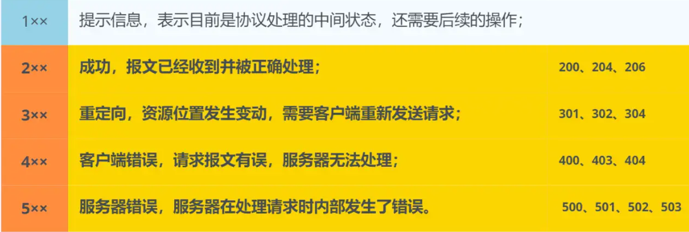
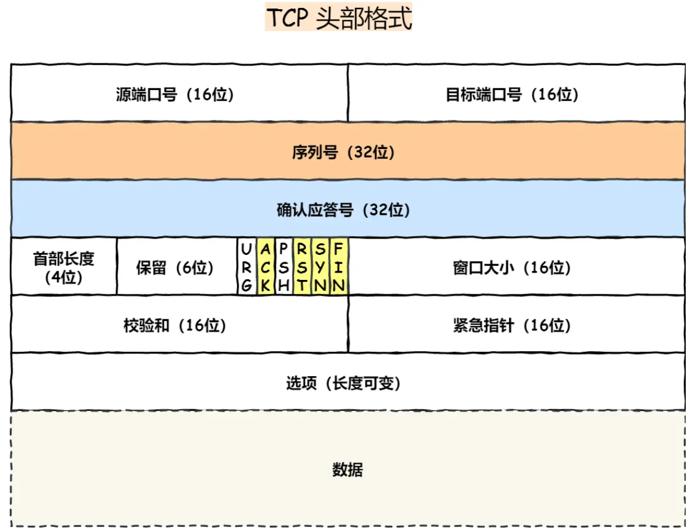
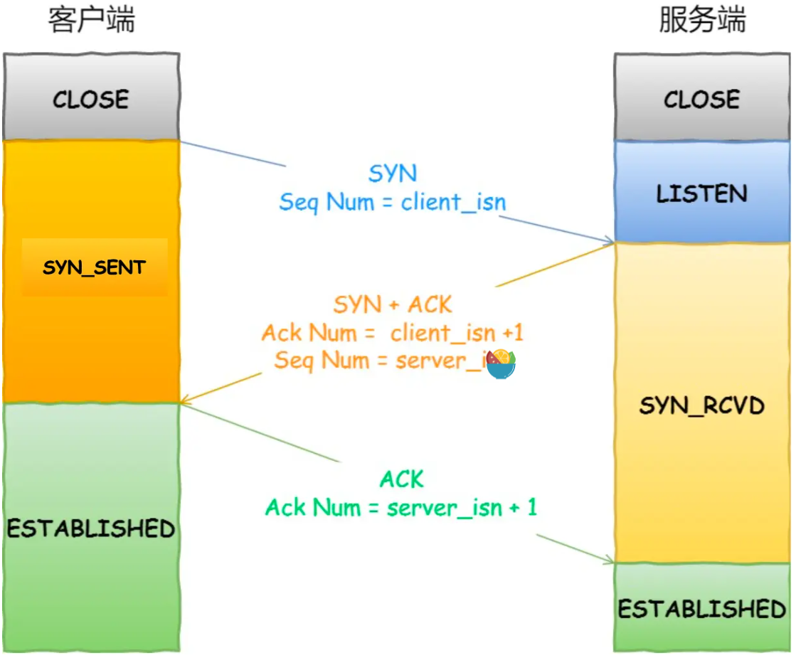
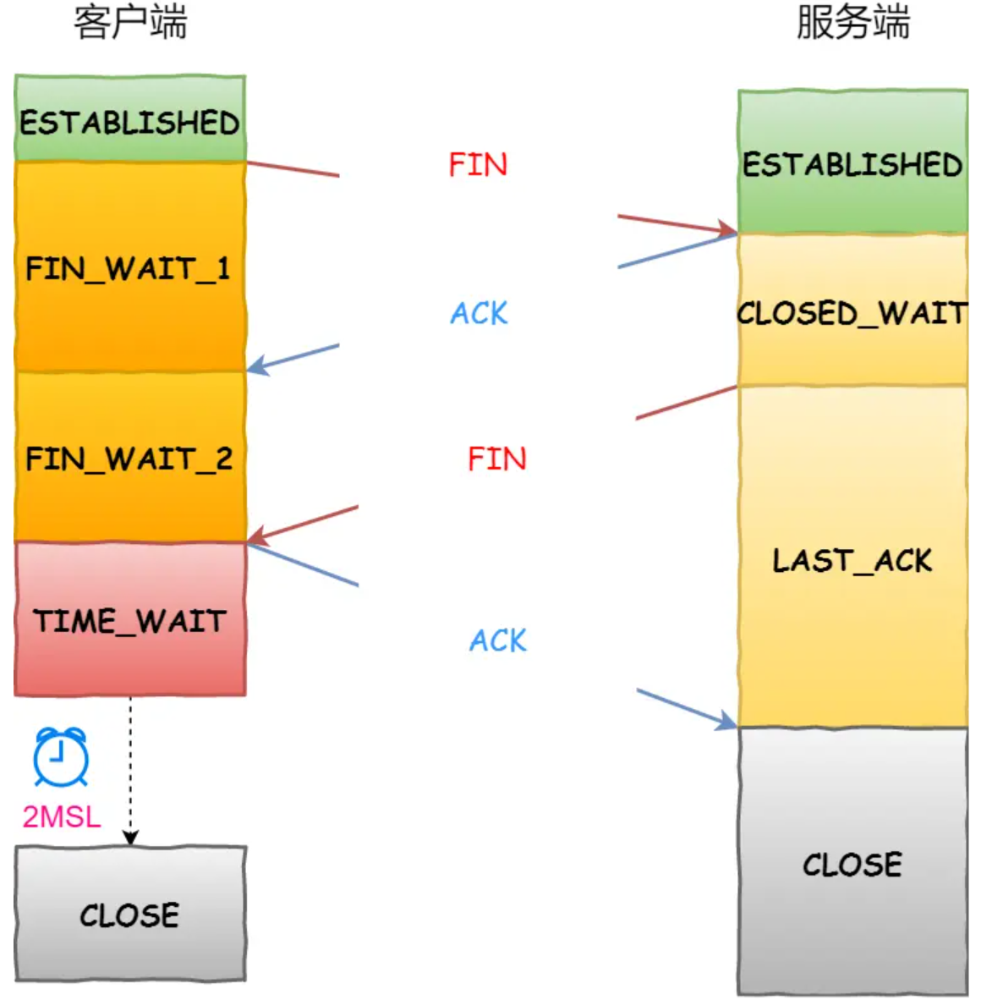

# 网络

OSI七层模型：应用层-表示层-会话层-传输层-网络层-数据链路层-物理层

TCP/IP分层： 应用层-网络层-传输层-网络接口层

## HTTP

http是超文本传输协议，属于网络层协议。

### GET 和 POST 有什么区别？

GET 的语义是请求获取指定的资源。GET 方法是安全(不会破坏服务器上的资源)、幂等（执行相同的操作，结果相同）、可被缓存的。POST 的语义是根据请求负荷（报文主体）对指定的资源做出处理，具体的处理方式视资源类型而不同。POST 不安全，不幂等，（大部分实现）不可缓存。POST 用 body 传输数据，而 GET 用 URL 传输，这样数据会在浏览器地址拦容易看到。GET有游览器的长度限制。POST编码类型更多

### HTTP的缓存

对于一些具有重复性的 HTTP 请求，我们可以把这对「请求-响应」的数据都缓存在本地。优点是可以减少不必要的网络传输，加快加载速度，减小服务器负载。缺点是占内存。HTTP 缓存有强制缓存与协商缓存两种。在响应时会优先强制缓存。

强缓存指的是只要浏览器判断缓存没有过期，则直接使用浏览器的本地缓存。强缓存是利用 HTTP 响应头部Cache-Control(相对时间，优先级高)或者Expires（绝对时间）决定。浏览器第一次请求访问服务器资源时，服务器会在返回这个资源的同时加上Cache-Control设置过期时间，浏览器再次请求时比较时间来决定是否使用缓存。Expires过度依赖本地时间，如果本地与服务器时间不同步会无法缓存，一般不使用。

通过服务端告知客户端是否可以使用缓存的方式被称为协商缓存。其实现方式有两种。

一：If-Modified-Since、Last-Modified（响应资源的最后修改时间）字段。If-Modified-Since 是比较标志，携带时会将请求的Last-Modified时间与服务器的最后修改时间比较。若资源被修改，返回200和最新资源不使用缓存。若无修改，返回304使用缓存。

二：If-None-Match、ETag(唯一标识响应资源)字段。当Cache-Control时间过期时，If-None-Match 值设置为 Etag 的值。服务器收到请求后进行比对，如果资源没有变化返回 304，如果资源变化了返回 200。

同时有 Etag 和 Last-Modified 字段会优先使用Etag 方式。因为文件的最后修改时间可能变化但内容其实没变。If-Modified-Since的查询粒度是秒，Etag粒度更细，可以在1s内刷新多次。有些服务器不能获取文件的最后修改时间。但Etag也有缺点，需要计算文件指纹需要更多的计算开销。ETag有强验证和弱验证，强验证，ETag生成的哈希码深入到每个字节。文件中一个字节改变了，也会生成不同的哈希值。弱验证是提取文件的部分属性来生成哈希值。快但准确率低。

###HTTP常见状态码

「**200 OK**」是最常见的成功状态码，表示一切正常。如果是非 `HEAD` 请求，服务器返回的响应头都会有 body 数据。

「**204 No Content**」也是常见的成功状态码，与 200 OK 基本相同，但响应头没有 body 数据。

「**206 Partial Content**」是应用于 HTTP 分块下载或断点续传，表示响应返回的 body 数据并不是资源的全部，而是其中的一部分，也是服务器处理成功的状态。

「**301 Moved Permanently**」表示永久重定向，说明请求的资源已经不存在了，需改用新的 URL 再次访问。

「**302 Found**」表示临时重定向，说明请求的资源还在，但暂时需要用另一个 URL 来访问。

「**304 Not Modified**」不具有跳转的含义，表示资源未修改，重定向已存在的缓冲文件，也称缓存重定向，也就是告诉客户端可以继续使用缓存资源，用于缓存控制。

「**400 Bad Request**」表示客户端请求的报文有错误，但只是个笼统的错误。

「**403 Forbidden**」表示服务器禁止访问资源，并不是客户端的请求出错。

「**404 Not Found**」表示请求的资源在服务器上不存在或未找到，所以无法提供给客户端。

「**500 Internal Server Error**」与 400 类型，是个笼统通用的错误码，服务器发生了什么错误，我们并不知道。

「**501 Not Implemented**」表示客户端请求的功能还不支持，类似“即将开业，敬请期待”的意思。

「**502 Bad Gateway**」通常是服务器作为网关或代理时返回的错误码，表示服务器自身工作正常，访问后端服务器发生了错误。

「**503 Service Unavailable**」表示服务器当前很忙，暂时无法响应客户端，类似“网络服务正忙，请稍后重试”的意思。

###HTTP演进

#### HTTP1.1

使用长连接。不用每次请求都三次握手四次挥手。只要任意一端没有明确提出断开连接，则保持 TCP 连接状态。

管道网络传输，同一个 TCP 连接里面，客户端可以发起多个请求。不用等待之前请求应答。但是服务器必须按照接收请求的顺序发送对这些管道化请求的响应。

在不使用管道网络传输时，一次请求必须完成响应后才可进行第二次请求。若第一次被阻塞会已知等待，这称为「队头堵塞」。

优化：

*尽量避免发送 HTTP 请求*：缓存技术

*在需要发送 HTTP 请求时，考虑如何减少请求次数*：减少重定向请求，合并请求，延迟发送请求。

*减少服务器的 HTTP 响应的数据大小*；压缩

#### HTTP2

http1.1缺点：请求 / 响应头部（Header）未经压缩就发送，首部信息越多延迟越大。发送冗长的首部。每次互相发送相同的首部造成的浪费较多；服务器是按请求的顺序响应的，有队头阻塞(响应的队头阻塞)；没有请求优先级控制；请求只能从客户端开始，服务器只能被动响应。

HTTP2基于HTTPS，更安全。

**头部压缩**：如果你同时发出多个请求的头是一样或相似，HTTP2协议会帮你消除重复的部分(HPACK)。原理是客户端服务器同时维护一张头信息表，所有字段都会存入这个表，生成一个索引号，以后就不发送同样字段了，只发送索引号。

**二进制格式**：HTTP/2 不再像 HTTP/1.1 里的纯文本形式的报文，而是全面采用了二进制格式，头信息和数据体都是二进制。

**并发传输**：引出 Stream ，多个 Stream 复用在一条 TCP 连接。不同的 HTTP 请求用独一无二的 Stream ID 来区分。

**服务器推送**：服务端可以**主动**向客户端发送消息。可以将相关联的资源主动推给客户端，减小消息传递的次数。

#### HTTP3

HTTP/2 是基于 TCP 协议来传输数据的,TCP 层必须保证收到的字节数据是完整且连续的，这样内核才会将缓冲区里的数据返回给 HTTP 应用.所以在TCP这里导致阻塞。

基于 TCP 传输协议的 HTTP 协议，由于是通过四元组（源 IP、源端口、目的 IP、目的端口）确定一条 TCP 连接。当移动设备的网络从 4G 切换到 WIFI 时，意味着 IP 地址变化了，那么就必须要断开连接，然后重新建立连接。

基于 UDP 的 **QUIC 协议**，UDP 发送是不管顺序，也不管丢包的，所以不会出现像 HTTP/2 队头阻塞的问题。QUIC 连接上的多个 Stream 之间并没有依赖，都是独立的，某个流发生丢包了，只会影响该流，其他流不受影响。

QUIC 内部包含了 TLS，它在自己的帧会携带 TLS 里的“记录”，再加上 QUIC 使用的是 TLS/1.3，因此仅需 1 个 RTT 就可以「同时」完成建立连接与密钥协商。

QUIC 协议通过**连接 ID** 来标记通信的两个端点，客户端和服务器可以各自选择一组 ID 来标记自己，因此即使移动设备的网络变化后，导致 IP 地址变化了，只要仍保有上下文信息。

### HTTPS

HTTP 由于是明文传输，存在窃听、篡改、冒充风险。通过在TCP基础上增加SSL/TLS来进行加密。

**混合加密**

在通信建立前采用**非对称加密**的方式交换「会话秘钥」，通信过程中全部使用**对称加密**的「会话秘钥」的方式加密明文数据。

**摘要算法 + 数字签名**

为了保证传输的内容不被篡改，使用摘要算法，其实是哈希函数计算内容哈希值。数字签名使用私钥加密，公钥解密。保证消息不被冒充。因为冒充者没有私钥，冒充的内容无法通过公钥解开。

**数字证书**

为了放置公钥私钥被一块冒充，需要第三方机构开具证书来保证公钥是可信的。

#### RSA握手

1.客户端向服务器发起加密通信请求ClientHello，携带支持的TLS版本和加密算法、一个随机数A

2.服务器响应SeverHello。携带确定TLS版本和加密算法。服务器数字证书和随机数B

3.客户端验证证书，取出公钥，加密随机数C，通知会话密钥通信。双方都获得了ABC。会使用三个数与机密算法生成会话密钥。客户端握手结束

4.服务器接收C后计算会话密钥。向客户端发送最后的信息，通知会话密钥通信，握手结束通知。

握手之后的对话使用 "对话密钥" 加密（对称加密），服务器的公钥和私钥只用于加密和解密 "对话密钥"（非对称加密），无其他作用。

基于 RSA 算法的 HTTPS 存在「前向安全」的问题：如果服务端的私钥泄漏了，过去被第三方截获的所有 TLS 通讯密文都会被破解。

#### ECDHE 握手解析

1.客户端向服务器发起加密通信请求ClientHello，携带支持的TLS版本和加密算法、一个随机数A

2.服务器响应SeverHello。携带确定TLS版本和加密算法。服务器数字证书和随机数B。发送完证书后，发送「**Server Key Exchange**」消息。最后「**Server Hello Done**」表明服务端消息完毕。此时选定了椭圆曲线、基点 G、公钥

3.客户端验证证书，成一个随机数C作为客户端椭圆曲线的私钥，然后再根据服务端前面给的信息，生成客户端的椭圆曲线公钥，然后用「**Client Key Exchange**」消息发给服务端。最终的会话密钥，就是用「客户端随机数A + 服务端随机数B + x（ECDHE 算法算出的共享密钥） 」三个材料生成的。算好会话密钥后，客户端会发一个「**Change Cipher Spec**」消息告诉服务端后续改用对称算法加密通信。

4.最后，服务端也会有一个同样的操作，发「**Change Cipher Spec**」和「**Encrypted Handshake Message**」消息，如果双方都验证加密和解密没问题，那么握手正式完成。

**数学本质**

算法的核心是离散对数，$a^i(\%p) = b$. 当p是一个很大的质数时，即使知道a和b也无法计算出i。

我们需要已知的模数和底数用 P 和 G 来代称。代指公式的p ，a。双方各自生成随机数a，b作为私钥。则公钥分别为A = G ^ a ( mod P )；B = G ^ b ( mod P )；根据离散对数知道AB无法计算ab。依据公钥私钥计算B ^ a ( mod P )=A ^ b ( mod P )这就是两者的对称加密密钥。

ECDHE 算法利用了 ECC 椭圆曲线特性计算出公钥，以及最终的会话密钥。使得公钥每次是变换的。得到前向安全性。

####校验数字证书

数字证书的作用，是用来认证公钥持有者的身份，以防止第三方进行冒充。

CA 签发证书的过程：CA 会把持有者的公钥、用途、颁发者、有效时间等信息打包进行 Hash 计算，CA 会使用自己的私钥将该 Hash 值加密生成签名，并将签名添加在文件证书中。

客户端验证：客户端会使用同样的 Hash 算法获取该证书的 Hash 值，浏览器收到证书后可以使用 CA 的公钥解密证书中的hash签名，两者一整则为信赖的证书。

###HTTP与RPC

**TCP 是传输层的协议**，而基于 TCP 造出来的 HTTP 和**各类** RPC 协议，它们都只是定义了不同消息格式的**应用层协议**而已。**RPC**，又叫做**远程过程调用**。它本身并不是一个具体的协议，而是一种**调用方式**。

 RPC 和 HTTP 区别：

请求时HTTP需要DNS解析得到IP地址。RPC通过专门的中间服务去获得。

 TCP 连接之后会保持长连接。RPC也是通过建立 TCP 长链接进行数据交互，但不同的地方在于，RPC 协议一般还会再建个**连接池**，在请求量大的时候，建立多条连接放在池内。发数据的时候就从池里取一条连接出来，用完放回去，下次再复用。

TCP 传输的消息包含消息头和消息体，有许多冗余。RPC，因为它定制化程度更高，可以采用体积更小的 序列化协议去保存结构体数据。

###WebSocket

TCP 协议本身是**全双工**的，但我们最常用的 HTTP/1.1，虽然是基于 TCP 的协议，但它是**半双工**的，对于大部分需要服务器主动推送数据到客户端的场景，都不太友好，因此我们需要使用支持全双工的 WebSocket 协议。在 HTTP/1.1 里，只要客户端不问，服务端就不答。基于这样的特点，对于登录页面这样的简单场景，可以使用**定时轮询或者长轮询**的方式实现**服务器推送**(comet)的效果。对于客户端和服务端之间需要频繁交互的复杂场景，比如网页游戏，都可以考虑使用 WebSocket 协议。 WebSocket 会先利用HTTP协议加上一些特殊的 header 头进行握手升级操作，升级成功后就跟 HTTP 没有任何关系了，之后就用 WebSocket 的数据格式进行收发数据。

## TCP/IP

TCP协议处于传输层。是**面向连接的、可靠的、基于字节流**的传输层通信协议。TCP首部如果不计选项和填充字段，它通常是20个字节

### 三次握手与四次挥手

1.客户端随机初始化序号client_isn，SYN置1并发送，客户端处于 `SYN-SENT` 状态。

2.服务端接收，并初始化自己的序号server_isn，并依据client_isn确定应答号。SYN和ACK置1并发送。服务端处于 `SYN-RCVD` 状态。

3.客户端接收，依据server_isn 确定确认应答号，ACK置1并发送。客户端处于 `ESTABLISHED`

服务端收到客户端的应答报文后，也进入 `ESTABLISHED` 状态。

若最后的应答报文丢失，服务端还未重发就来了数据，也会正常接收，因为数据中包含ACK，也有确认号。相当于最后的ACK与数据一块发过来了。

- 客户端打算关闭连接，此时会发送一个 TCP 首部 `FIN` 标志位被置为 `1` 的报文，也即 `FIN` 报文，之后客户端进入 `FIN_WAIT_1` 状态。
- 服务端收到该报文后，就向客户端发送 `ACK` 应答报文，接着服务端进入 `CLOSE_WAIT` 状态。
- 客户端收到服务端的 `ACK` 应答报文后，之后进入 `FIN_WAIT_2` 状态。
- 等待服务端处理完数据后，也向客户端发送 `FIN` 报文，之后服务端进入 `LAST_ACK` 状态。
- 客户端收到服务端的 `FIN` 报文后，回一个 `ACK` 应答报文，之后进入 `TIME_WAIT` 状态
- 服务端收到了 `ACK` 应答报文后，就进入了 `CLOSE` 状态，至此服务端已经完成连接的关闭。
- 客户端在经过 `2MSL` 一段时间后，自动进入 `CLOSE` 状态，至此客户端也完成连接的关闭。

### TCP重传机制

TCP 针对数据包丢失的情况，会用**重传机制**解决。常见的重传机制：超时重传、快速重传、SACK、D-SACK。

RTT：包的往返时间。RTO：超时重传时间。RTO应当略大于RTT

超时重传：当发出数据后久久没有应答会重发该数据。

快速重传：不以时间为驱动，当收到三个相同的 ACK 报文时，会在定时器过期之前，重传丢失的报文段。

SACK：TCP 头部「选项」字段里加一个 `SACK`将缓存的地图发送给发送方，发送方就可以知道哪些数据收到了，哪些数据没收到，知道了这些信息，就可以**只重传丢失的数据**。

D-STACK：使用了 SACK 来告诉「发送方」有哪些数据被重复接收了。可以明确重传是因为数据收到但应答丢失还是数据丢失。

### TCP流量控制

使用滑动窗口(缓存空间)控制流量。窗口的大小是由接收方的决定的。接收方会返回自己剩余的窗口大小，发送发依据此控制发送数据的多少。

发送方窗口：已发送但未收到ACK(SND.UNA)、未发送但还在接收方外的窗口(SND.NXT)。**可用窗口大 = SND.WND -（SND.NXT - SND.UNA）**

接收方窗口：未收到但可以的窗口(SND.NXT)

两者窗口不是完全相等，接收窗口的大小是**约等于**发送窗口的大小的。

送窗口和接收窗口中所存放的字节数，都是放在操作系统内存缓冲区中的，而操作系统的缓冲区，会**被操作系统调整**。

TCP 是如何解决窗口关闭时，潜在的死锁现象呢？

窗口大小为 0 时，就会阻止发送方给接收方传递数据，直到窗口变为非 0 为止，但若告知变为非0的ACK丢失，发送方会一直认为不能发送发生死锁。

TCP 为每个连接设有一个持续定时器，只要 TCP 连接一方收到对方的零窗口通知，就启动持续计时器。如果持续计时器超时，就会发送窗口探测报文，而对方在确认这个探测报文时，给出自己现在的接收窗口大小。

**糊涂窗口综合症**

接收方太忙，来不及取走窗口数据，窗口可能非常小。此时发生方可能只能发送几个字节的数据。但`TCP + IP` 头有 `40` 个字节。不划算。

解决：1接收方不通告小窗口给发送方、2发送方避免发送小数据

1.当「窗口大小」小于 min( MSS，缓存空间/2 ) ，也就是小于 MSS 与 1/2 缓存大小中的最小值时，就会向发送方通告窗口为 0

2.使用 **Nagle 算法**. 要等到窗口大小 >= `MSS` 或是 数据大小 >= `MSS`并且收到之前发送数据的 `ack` 回包时才发送数据，负责就囤积不发送。

### 拥塞控制

为了在「发送方」调节所要发送数据的量，定义了一个叫做「**拥塞窗口**」的概念。**拥塞窗口 cwnd**是发送方维护的一个 的状态变量，它会根据**网络的拥塞程度动态变化的**。

只要「发送方」没有在规定时间内接收到 ACK 应答报文，也就是**发生了超时重传，就会认为网络出现了用拥塞。**

拥塞控制主要是四个算法：慢启动、拥塞避免、拥塞发生、快速恢复

**慢启动**：当发送方每收到一个 ACK，就拥塞窗口 cwnd 的大小就会*2。

**拥塞避免算法**：当拥塞窗口 `cwnd` 「超过」慢启动门限 `ssthresh` 就会进入拥塞避免算法。每当收到一个 ACK 时，cwnd 增加 1

**拥塞发生**：当网络出现拥塞，也就是会发生数据包重传，当发生了「超时重传」，则就会使用拥塞发生算法。`ssthresh` 设为 `cwnd/2`，`cwnd` 重置为 `1`。发生「快速重传算法」时，TCP 认为这种情况不严重，`cwnd = cwnd/2`，`ssthresh = cwnd`;进入快速恢复算法

**快速恢复**：拥塞窗口 `cwnd = ssthresh + 3`，重传丢失的数据包，如果再收到重复的 ACK，那么 cwnd 增加 1，如果收到新数据的 ACK 后，设置 cwnd 为 ssthresh，接着就进入了拥塞避免算法。

### TCP优化

**三次握手的优化**

修改一些数据丢失后的重传次数，有时可以减少以尽快报错。

优化SYN攻击的手段

TCP Fast Open 功能绕过三次握手

**四次挥手的优化**

**减小重发次数，限制孤儿连接**

主动方发送 FIN 报文后，连接就处于 FIN_WAIT1 状态，但是当迟迟收不到对方返回的 ACK 时，连接就会一直处于 FIN_WAIT1 状态。此时可以考虑调整**tcp_orphan_retries** 减小 FIN重传次数。如果遇到恶意攻击，FIN 报文根本无法发出(窗口为0)，调整 **tcp_max_orphans** 参数，它定义了「孤儿连接」（调用了 `close` 函数关闭的连接）的最大数量。

**减小close 连接的最大等待时间。**

当主动方收到 ACK 报文后，会处于 FIN_WAIT2 状态，就表示主动方的发送通道已经关闭，接下来将等待对方发送 FIN 报文，关闭对方的发送通道。如果连接是用 shutdown 函数关闭的，连接可以一直处于 FIN_WAIT2 状态，因为它可能还可以发送或接收数据。但对于 close 函数关闭的孤儿连接，由于无法再发送和接收数据，所以这个状态不可以持续太久，而 **tcp_fin_timeout** 控制了这个状态下连接的持续时长。

**减小TIME_WAIT时间**

当收到被动方发来的 FIN 报文后，主动方会立刻回复 ACK，表示确认对方的发送通道已经关闭，接着就处于 TIME_WAIT 状态。**tcp_max_tw_buckets** 当 TIME_WAIT 的连接数量超过该参数时，新关闭的连接就不再经历 TIME_WAIT 而直接关闭。**tcp_tw_reuse** 参数，可以在建立新连接时，复用处于 TIME_WAIT 状态的连接（TIME_WAIT 状态的连接创建时间超过 1 秒）（只用于建立连接的发起方，因为是在调用 connect() 时起作用的）

### 如何解决粘包？

粘包的问题出现是因为不知道一个用户消息的边界在哪，如果知道了边界在哪，接收方就可以通过边界来划分出有效的用户消息。

一般有三种方式分包的方式：

- 固定长度的消息；
- 特殊字符作为边界；
- 自定义消息结构。

###握手的相关问题

#### 为什么是三次握手

*原因一：避免历史连接*

客户端先发送了 SYN（seq = 90）报文，然后客户端宕机了，而且这个 SYN 报文还被网络阻塞了，服务端并没有收到，接着客户端重启后，又重新向服务端建立连接，发送了 SYN（seq = 100）报文。此时服务器接收SYN（seq = 90）返回应答。客户端会发现应答的确认应答号不对，应该是101而不是91。所以会向服务端发RST终止。

*原因二：同步双方初始序列号*

客户端发送携带「初始序列号」的 `SYN` 报文的时候，需要服务端回一个 `ACK` 应答报文，表示客户端的 SYN 报文已被服务端成功接收，那当服务端发送「初始序列号」给客户端的时候，依然也要得到客户端的应答回应

#### 如何绕过三次握手

TCP Fast Open 功能，这个功能可以减少 TCP 连接建立的时延。

在客户端首次建立连接时进行正常的三次握手，但客户端发送SYN时，报文包含 Fast Open 选项。服务器生成 Cookie，并将其置于 SYN-ACK 数据包中的 Fast Open 选项以发回客户端；客户端收到 SYN-ACK 后，本地缓存 Fast Open 选项中的 Cookie。

客户端再次向服务器建立连接时，该报文包含TCP Fast Open 的Cookie和「数据」，服务器会对收到 Cookie 进行校验，服务器将在 SYN-ACK 报文中对 SYN 和「数据」进行确认，服务器随后将「数据」递送至相应的应用程序；且其随后发出的 SYN-ACK 报文将只确认 SYN 的对应序列号；如果服务器接受了 SYN 报文中的「数据」，服务器可在握手完成之前发送「数据」。客户端将发送 ACK 确认服务器发回的 SYN 以及「数据」。

#### 初始化的序列号要求每次不一致

- 为了防止历史报文被下一个相同四元组的连接接收（主要方面）；
- 为了安全性，防止黑客伪造的相同序列号的 TCP 报文被对方接收；

#### SYN 报文什么时候情况下会被丢弃？

开启 tcp_tw_recycle 参数，并且在 NAT 环境下，造成 SYN 报文被丢弃

对于服务器来说，如果同时开启了recycle 和 timestamps 选项，则会开启一种称之为「 per-host 的 PAWS 机制」。PAWS 要求连接双方维护最近一次收到的数据包的时间戳，如果发现收到的数据包中时间戳不是递增的，则表示该数据包是过期的，就会直接丢弃这个数据包。但是如果客户端网络环境是用了 NAT 网关，那么客户端环境的每一台机器通过 NAT 网关后，都会是相同的 IP 地址，在服务端看来，就好像只是在跟一个客户端打交道一样，无法区分出来。

TCP 两个队列满了（半连接队列和全连接队列），造成 SYN 报文被丢弃

#### 已建立连接的TCP，收到SYN会发生什么？

服务器处于Established 状态，若超过了TCP保活时间会自动关闭，若服务端在客户端宕机时发送数据会返回RST被关闭客户端的 SYN 报文里的端口号与历史连接不相同，会重新握手

客户端的 SYN 报文里的端口号与历史连接相同，服务端会回复一个携带了正确序列号和确认号的 ACK 报文，这个 ACK 被称之为 Challenge ACK。客户端收到这个 Challenge ACK，发现确认号并不是自己期望收到的，就会回 RST 

#### TCP 层分片

- `MTU`：一个网络包的最大长度，以太网中一般为 `1500` 字节；
- `MSS`：除去 IP 和 TCP 头部之后，一个网络包所能容纳的 TCP 数据的最大长度；

当 TCP 层发现数据超过 MSS 时，则就先会进行分片。

为什么不用IP分片：当 IP 层有一个超过 `MTU` 大小的数据（TCP 头部 + TCP 数据）要发送，那么 IP 层就要进行分片。IP 层本身没有超时重传机制，它由传输层的 TCP 来负责超时和重传。若IP分片丢失，整个IP报文都要重传。

### 挥手的相关问题

#### 为什么挥手需要四次？

服务端通常需要等待完成数据的发送和处理，所以服务端的 `ACK` 和 `FIN` 一般都会分开发送，因此是需要四次挥手。服务器收到客户端的 FIN 报文时，内核会马上回一个 ACK 应答报文，**但是服务端应用程序可能还有数据要发送，所以并不能马上发送 FIN 报文，而是将发送 FIN 报文的控制权交给服务端应用程序**：

但是**在特定情况下，四次挥手是可以变成三次挥手的**

**TCP 延迟确认机制：**发送没有携带数据的 ACK，它的网络效率也是很低的，所以就衍生出了 TCP 延迟确认，当有响应数据要发送时，ACK 会随着响应数据一起立刻发送给对方。当没有响应数据要发送时，ACK 将会延迟一段时间，以等待是否有响应数据可以一起发送

当被动关闭方在 TCP 挥手过程中，如果「没有数据要发送」，同时「没有开启 TCP_QUICKACK（默认情况就是没有开启，没有开启 TCP_QUICKACK，等于就是在使用 TCP 延迟确认机制）」，那么第二和第三次挥手就会合并传输，这样就出现了三次挥手。

#### FIN 报文一定得调用关闭连接的函数，才会发送吗？

不一定。如果进程退出了，不管是不是正常退出，还是异常退出（如进程崩溃），内核都会发送 FIN 报文，与对方完成四次挥手

#### 如果连接双方同时关闭连接，会怎么样？

由于 TCP 是双全工的协议，所以是会出现两方同时关闭连接的现象，也就是同时发送了 FIN 报文。两方发送 FIN 报文时，都认为自己是主动方，所以都进入了 FIN_WAIT1 状态。接下来，**双方在等待 ACK 报文的过程中，都等来了 FIN 报文。这是一种新情况，所以连接会进入一种叫做 CLOSING 的新状态，它替代了 FIN_WAIT2 状态**。接着，双方内核回复 ACK 确认对方发送通道的关闭后，进入 TIME_WAIT 状态，等待 2MSL 的时间后，连接自动关闭。

#### 关闭的连接的函数

- close 函数，同时 socket 关闭发送方向和读取方向，也就是 socket 不再有发送和接收数据的能力。如果有多进程/多线程共享同一个 socket，如果有一个进程调用了 close 关闭只是让 socket 引用计数 -1，并不会导致 socket 不可用，同时也不会发出 FIN 报文，其他进程还是可以正常读写该 socket，直到引用计数变为 0，才会发出 FIN 报文。
- shutdown 函数，可以指定 socket 只关闭发送方向而不关闭读取方向，也就是 socket 不再有发送数据的能力，但是还是具有接收数据的能力。如果有多进程/多线程共享同一个 socket，shutdown 则不管引用计数，直接使得该 socket 不可用，然后发出 FIN 报文，如果有别的进程企图使用该 socket，将会受到影响。

#### 第二次挥手失败

也就是对于服务器发出的ACK失败后，客户端会重发FIN。若close断开连接达到指定时间后客户端就会断开连接（close 函数关闭连接的，处于 FIN_WAIT_2 状态是有时长限制的）。但是注意，如果主动关闭方使用 shutdown 函数关闭连接，指定了只关闭发送方向，而接收方向并没有关闭，那么意味着主动关闭方还是可以接收数据的。此时主动关闭方的连接将会一直处于 `FIN_WAIT2` 状态。

#### 第四次挥手失败

服务端的FIN会重发，达到了最大重传次数，于是再等待一段时间（时间为上一次超时时间的 2 倍），如果还是没能收到客户端的第四次挥手（ACK 报文），那么服务端就会断开连接。客户端在收到第三次挥手后，就会进入 TIME_WAIT 状态，开启时长为 2MSL 的定时器，如果途中再次收到第三次挥手（FIN 报文）后，就会重置定时器，当等待 2MSL 时长后，客户端就会断开连接。

#### 四次挥手中收到乱序的 FIN 包会如何处理？

在 FIN_WAIT_2 状态时，如果收到乱序的 FIN 报文，那么就被会加入到「乱序队列」，并不会进入到 TIME_WAIT 状态。等再次收到前面被网络延迟的数据包时，会判断乱序队列有没有数据，然后会检测乱序队列中是否有可用的数据，如果能在乱序队列中找到与当前报文的序列号保持的顺序的报文，就会看该报文是否有 FIN 标志，如果发现有 FIN 标志，这时才会进入 TIME_WAIT 状态。

#### 为什么 TIME_WAIT 等待的时间是 2MSL？

`MSL` 是 Maximum Segment Lifetime，**报文最大生存时间**，它是任何报文在网络上存在的最长时间，超过这个时间报文将被丢弃。

*原因一：防止历史连接中的数据，被后面相同四元组的连接错误的接收*

为了防止历史连接中的数据，被后面相同四元组的连接错误的接收。`2MSL` 时长，这个时间足以让两个方向上的数据包都被丢弃，使得原来连接的数据包在网络中都自然消失，再出现的数据包一定都是新建立连接所产生的。(产生这个错误的前提是服务端与客户端的IP端口都一致，并且信的序号与之前的连接的序号恰好一致)

*原因二：保证「被动关闭连接」的一方，能被正确的关闭*

如果第四次挥手丢包，可以有一次重发的机会。若没有TIME_WAIT，客户端则关闭了。服务端则重传的 FIN 报文，而这时客户端已经进入到关闭状态了，在收到服务端重传的 FIN 报文后，就会回 RST 报文。

#### TIME_WAIT 过多有什么危害？

- 第一是占用系统资源，比如文件描述符、内存资源、CPU 资源、线程资源等；
- 第二是占用端口资源，端口资源也是有限的，一般可以开启的端口为 `32768～61000`，也可以通过 `net.ipv4.ip_local_port_range`参数指定范围。

#### 服务器出现大量 TIME_WAIT 状态的原因有哪些？

***第一个场景：HTTP 没有使用长连接***

没有长连接后每一次HTTP请求都会关闭，一般来说都是由服务端主动关闭，则务端上就会出现 TIME_WAIT 状态的连接。

客户端禁用了长连接，服务端开启 长连接，谁是主动关闭方？服务端

 HTTP 请求的 header 就会有 `Connection:close` 信息，这时服务端在发完 HTTP 响应后，就会主动关闭连接。

客户端开启了长连接，服务端禁用长连接，谁是主动关闭方？服务端

服务端主动关闭连接的情况下，只要调用一次 close() 就可以释放连接，剩下的工作由内核 TCP 栈直接进行了处理。整个过程只有一次 syscall；如果是要求客户端关闭，则服务端在写完最后一个 response 之后需要把这个 socket 放入 readable 队列，调用 select / epoll 去等待事件；然后调用一次 read() 才能知道连接已经被关闭，这其中是两次 syscall，多一次用户态程序被激活执行，而且 socket 保持时间也会更长。

***第二个场景：HTTP 长连接超时***

如果使用了 HTTP 长连接，如果客户端完成一个 HTTP 请求后，就不再发起新的请求。为了避免资源浪费的情况，web 设置了超时时间，定时器的时间一到，触发回调函数来关闭该连接，那么此时服务端上就会出现 TIME_WAIT 状态的连接。

***第三个场景：HTTP 长连接的请求数量达到上限***

HTTP 长连接上已经接收并处理的客户端请求的数量达到最大值会主动关闭长连接，那么此时服务端上就会出现 TIME_WAIT 状态的连接。（调大 nginx 的 keepalive_requests 参数可避免）

#### 服务器出现大量 CLOSE_WAIT 状态的原因有哪些？

CLOSE_WAIT 状态是「被动关闭方」才会有的状态，服务端第一次收到FIN时会进入CLOSE_WAIT 。如果「被动关闭方」没有调用 close 函数关闭连接，那么就无法发出 FIN 报文，从而无法使得 CLOSE_WAIT 状态的连接转变为 LAST_ACK 状态。

#### 快速恢复处于TIME_WAIT 的连接

打开 net.ipv4.tcp_tw_reuse 和 net.ipv4.tcp_timestamps 选项，则可以复用处于 TIME_WAIT 的 socket 为新的连接所用。

net.ipv4.tcp_max_tw_buckets当系统中处于 TIME_WAIT 的连接一旦超过这个值时，系统就会将后面的 TIME_WAIT 连接状态重置。

*使用 SO_LINGER*，我们可以通过设置 socket 选项，来设置调用 close 关闭连接行为。

#### 在 TIME_WAIT 状态的 TCP 连接，收到 SYN 后会发生什么？

如果处于 TIME_WAIT 状态的连接收到「合法的 SYN 」后，就会重用此四元组连接，跳过 2MSL 而转变为 SYN_RECV 状态，接着就能进行建立连接过程。

如果处于 TIME_WAIT 状态的连接收到「非法的 SYN 」后，就会再回复一个第四次挥手的 ACK 报文，客户端收到后，发现并不是自己期望收到确认号（ack num），就回 RST 报文给服务端。

#### 在 TIME_WAIT 状态，收到 RST 会断开连接吗？

- 如果 `net.ipv4.tcp_rfc1337` 参数为 0，则提前结束 TIME_WAIT 状态，释放连接。
- 如果 `net.ipv4.tcp_rfc1337` 参数为 1，则会丢掉该 RST 报文。

#### 如果已经建立了连接，但是客户端突然出现故障了怎么办？

为了避免这种情况，TCP 搞了个**保活机制**。定义一个时间段，在这个时间段内，如果没有任何连接相关的活动，TCP每隔一个时间间隔，发送一个探测报文。1.对端程序是正常工作的。报文正常响应，TCP保活时间重置。2.对端主机宕机并重启。端是可以响应的，但由于没有该连接的有效信息，会产生一个 RST 报文。3.对端主机宕机，连续几次，达到保活探测次数后，TCP 会报告该 TCP 连接已经死亡。

#### 如果已经建立了连接，但是服务端的进程崩溃会发生什么？

当服务端的进程崩溃后，内核需要回收该进程的所有 TCP 连接资源，于是内核会发送第一次挥手 FIN 报文，后续的挥手过程也都是在内核完成，并不需要进程的参与，所以即使服务端的进程退出了，还是能与客户端完成 TCP 四次挥手的过程。

### UDP与TCP区别

UDP 不提供复杂的控制机制，利用 IP 提供面向「无连接」的通信服务。UDP 协议真的非常简，头部只有 `8` 个字节只包含两个端口号、包长度、校验和与数据。

TCP 是面向连接的传输层协议，传输数据前先要建立连接。UDP不需要。TCP是一对一的两点服务，UDP支持一对一、一对多、多对多。UDP不保证可靠性。但改进的QUIC可以实现可靠传输。TCP有拥塞控制和流量控制。UDP没有。TCP首部没有使用选项字段是占据20字节，UDP只有8字节。TCP是流式传输，没有边界但保证顺序。UDP是以包发送有边界。TCP数据若大于MSS会在传输层分片。UDP大小大于MTU会在IP分片。

 TCP 头部有「首部长度」字段: TCP 有**可变长**的「选项」字段，而 UDP 头部长度则是**不会变化**的，无需多一个字段去记录 UDP 的首部长度。

TCP 头部长度计算:TCP 长度=IP长度-IP首部长度-TCP首部长度

###TCP 协议缺陷

- 升级 TCP 的工作很困难；
- TCP 建立连接的延迟；
- TCP 存在队头阻塞问题；
- 网络迁移需要重新建立 TCP 连接；

### 基于 UDP 协议实现可靠传输-QUIC

### 半连接队列和全连接队列

第一次握手后，内核会把该连接存储到半连接队列，第三次握手，内核会把连接从半连接队列移除，然后创建新的完全的连接，并将其添加到 accept 队列，等待进程调用 accept 函数时把连接取出来。

1. 如果半连接队列满了，并且没有开启 tcp_syncookies，则会丢弃；
2. 若全连接队列满了，且没有重传 SYN+ACK 包的连接请求多于 1 个，则会丢弃；
3. 如果没有开启 tcp_syncookies，并且 max_syn_backlog 减去 当前半连接队列长度小于 (max_syn_backlog >> 2)，则会丢弃；

全连接队列满了也不一定只能丢弃，还可以选择向客户端发送 RST 复位报文，告诉客户端连接已经建立失败。打开这一功能需要将 tcp_abort_on_overflow 参数设置为 1。

全连接队列的长度取决于 somaxconn 和 backlog 之间的最小值，也就是 min(somaxconn, backlog)

### SYN攻击

服务端每接收到一个 `SYN` 报文，就进入`SYN_RCVD` 状态，但服务端发送出去的 `ACK + SYN` 报文，无法得到未知 IP 主机的 `ACK` 应答，久而久之就会占满服务端的半连接队列，使得服务端不能为正常用户服务。

避免 SYN 攻击方式，可以有以下四种方法：

**调大 netdev_max_backlog**

当网卡接收数据包的速度大于内核处理的速度时，会有一个队列保存这些数据包。控制该队列的最大值

**增大 TCP 半连接队列**

同时增大下面这三个参数：net.ipv4.tcp_max_syn_backlog、listen() 函数中的 backlog、net.core.somaxconn

**开启 tcp_syncookies**

开启 syncookies 功能就可以在不使用 SYN 半连接队列的情况下成功建立连接，相当于绕过了 SYN 半连接来建立连接。根据算法，计算出一个 `cookie` 值放到第二次报文的「序列号」里服务端回第二次握手给客户端；

**减少 SYN+ACK 重传次数**

减少 SYN-ACK 的重传次数，以加快处于 SYN_REVC 状态的 TCP 连接断开。SYN-ACK 报文的最大重传次数由 `tcp_synack_retries`内核参数决定

### TCP连接的异常断开

#### 主机崩溃

客户端主机崩溃了，服务端是**无法感知到的**，在加上服务端没有开启 TCP keepalive(TCP保活机制)，又没有数据交互的情况下，**服务端的 TCP 连接将会一直处于 ESTABLISHED 连接状态**，直到服务端重启进程。

有保活机制会按照保活机制处理

#### 进程崩溃

TCP 的连接信息是由内核维护的，所以当服务端的进程崩溃后，内核需要回收该进程的所有 TCP 连接资源，于是内核会发送第一次挥手 FIN 报文，后续的挥手过程也都是在内核完成，并不需要进程的参与，所以即使服务端的进程退出了，还是能与客户端完成 TCP四次挥手的过程。

#### 客户端主机宕机，又迅速重启

在客户端主机宕机后，服务端向客户端发送的报文会得不到任何的响应，在一定时长后，服务端就会触发**超时重传**机制，重传未得到响应的报文。只要有一方重启完成后，收到之前 TCP 连接的报文，都会回复 RST 报文，以断开连接。

#### 客户端主机宕机，一直没有重启

服务端超时重传报文的次数达到一定阈值后，内核就会判定出该 TCP 有问题，然后通过 Socket 接口告诉应用程序该 TCP 连接出问题了，于是服务端的 TCP 连接就会断开。

#### 拔掉网线

在客户端拔掉网线后，服务端向客户端发送的数据报文会得不到任何的响应，在等待一定时长后，服务端就会触发**超时重传**机制，重传未得到响应的数据报文。服务端超时重传报文的次数达到一定阈值后，内核就会判定出该 TCP 有问题断开连接。

如果在服务端重传报文的过程中，客户端刚好把网线插回去了，由于拔掉网线并不会改变客户端的 TCP 连接状态，并且还是处于 ESTABLISHED 状态，所以这时客户端是可以正常接收服务端发来的数据报文的，然后客户端就会回 ACK 响应报文。

##Socket 编程

###TCP的Socket 编程

- 服务端和客户端初始化 `socket`，得到文件描述符；
- 服务端调用 `bind`，将 socket 绑定在指定的 IP 地址和端口;
- 服务端调用 `listen`，进行监听，会创建半连接队列和全连接队列；
- 服务端调用 `accept`，等待客户端连接；
- 客户端调用 `connect`，向服务端的地址和端口发起连接请求；
- 服务端 `accept` 返回用于传输的 `socket` 的文件描述符；
- 客户端调用 `write` 写入数据；服务端调用 `read` 读取数据；
- 客户端断开连接时，会调用 `close`，那么服务端 `read` 读取数据的时候，就会读取到了 `EOF`，待处理完数据后，服务端调用 `close`，表示连接关闭。

**backlog 的意义**

Linux内核中会维护两个队列：半连接队列（SYN 队列）、全连接队列（Accpet 队列）。

backlog 变成 accept 队列，也就是已完成连接建立的队列长度，**所以现在通常认为 backlog 是 accept 队列。**

**客户端 connect 成功返回是在第二次握手，服务端 accept 成功返回是在三次握手成功之后。**

accpet 系统调用并不参与 TCP 三次握手过程，它只是负责从 TCP 全连接队列取出一个已经建立连接的 socket，用户层通过 accpet 系统调用拿到了已经建立连接的 socket，就可以对该 socket 进行读写操作了。所以没有 accept，也能建立 TCP 连接。

客户端是可以自己连自己的形成连接（**TCP自连接**），也可以两个客户端同时向对方发出请求建立连接（**TCP同时打开**），这两个情况都有个共同点，就是**没有服务端参与，也就是没有 listen，就能 TCP 建立连接。**尽管没listen，就没有全连接和半连接队列，但内核还有个全局 hash 表，可以用于存放 sock 连接的信息。

服务端如果只 bind 了 IP 地址和端口，而没有调用 listen 的话，然后客户端对服务端发起了 TCP 连接建立。客户端对服务端发起 SYN 报文后，服务端回了 RST 报文。