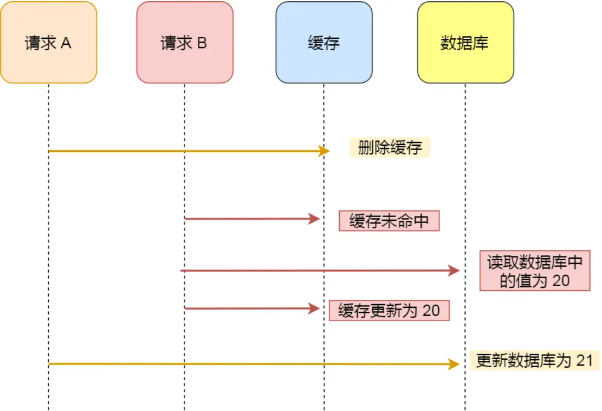

# 面试复盘

## 缓存一致性问题

缓存系统的数据一致性通常包括持久化层和缓存层的一致性(MySQL与Redis)、以及多级缓存之间(本地缓存+redis)的一致性

###MySQL与Redis

####旁路缓存模式

在读请求中，首先请求缓存，若缓存命中，则直接返回缓存中的数据；若缓存未命中，则查询数据库并将查询结果更新至缓存，然后返回查询出的数据。在写请求中，先**更新数据库，再删除缓存**。

**为什么不直接更新缓存？**

首先是**性能**，当该缓存对应的结果需要消耗大量的计算过程才能得到时，比如需要访问多张数据库表并联合计算，那么在写操作中更新缓存的动作将会是一笔不小的开销。同时，当写操作较多时，可能也会存在刚更新的缓存还没有被读取到，又再次被更新的情况，这样的更新是白白消耗机器性能的，会导致缓存利用率不高。而等到读请求未命中缓存时再去更新，也符合懒加载的思路，需要时再进行计算。

其次是**安全**，在并发场景下，在写请求中更新缓存可能会引发数据的不一致问题。两个线程先后更新数据库，有先后更新缓存。但由于网络延迟，更新缓存的顺序可能与数据库不一致。造成缓存里的是旧值。

**为什么不是先删除缓存？**

先删了缓存，还没等更新数据库，又来一个线程读了数据，缓存种又被存进了旧值。

但这种情况可以利用延迟双删的方案解决。开始删除缓存，过段时间再删一次。但双删的缺点就是这个延迟很难预估。

**更新数据库，再删除缓存的模式会又不一致问题吗？**

**情况一：**更新数据库前，缓存失效，有线程读，还没等写入缓存，就触发了删除缓存。这样旧值在删除缓存后又被添加了进去

这种场景的出现，不仅需要缓存失效且读写并发执行，而且还需要读请求查询数据库的执行早于写请求更新数据库，同时读请求的执行完成晚于写请求。足以见得，这种不一致场景产生的条件非常严格，在实际的生产中出现的可能性较小。

**情况二：**读请求在删缓存之前，更新Mysql之后。这样读的是旧值。虽然在下一次读请求中，缓存会被更新，但如果业务层面对这种情况的容忍度较低，可以采用加锁在写请求中保证“更新数据库&删除缓存”的串行执行为原子性操作。

####**补偿机制**

可能存在更新数据库成功，但删除缓存失败的场景，产生数据的不一致的问题。针对可能出现的删除失败问题，目前业界主要有以下几种补偿机制。

**删除重试机制**

我们可以引入**消息队列**，将第二个操作（删除缓存）要操作的数据加入到消息队列，由消费者来操作数据。

**订阅 MySQL binlog，再操作缓存**

binlog文件中记录的是对数据库的各种修改操作。引入Canal中间件，模拟主从复制的交互协议，把自己伪装成一个 MySQL 的从节点，向 MySQL 主节点发送 dump 请求，MySQL 收到请求后，就会开始推送 Binlog 给 Canal，Canal 解析 Binlog 字节流之后，转换为便于读取的结构化数据，供下游程序订阅使用。

####读穿 / 写穿

Read/Write Through（读穿 / 写穿）策略原则是应用程序只和缓存交互，不再和数据库交互，而是由缓存和数据库交互，相当于更新数据库的操作由缓存自己代理了。

#### 写回

Write Back（写回）策略在更新数据的时候，只更新缓存，同时将缓存数据设置为脏的，然后立马返回，并不会更新数据库。对于数据库的更新，会通过批量异步更新的方式进行。

### 本地缓存一致性

两级缓存与数据库的数据要保持一致，一旦数据发生了修改，在修改数据库的同时，本地缓存、远程缓存应该同步更新。

分布式环境下，一级缓存之间也会存在一致性问题，当一个节点下的本地缓存修改后，需要通知其他节点也刷新本地缓存中的数据

解决方案1: Redis

利用Reids的发布订阅功能来实现分布式缓存下不用节点的缓存同步。

解决方案2: MQ

一般现在部署都是集群部署，有多个不同节点的本地缓存; 可以使用MQ的广播模式，当数据修改时向MQ发送消息，节点监听并消费消息，删除本地缓存，达到最终一致性；

解决方案3：Canal + MQ

如果你不想在你的业务代码发送MQ消息，还可以适用近几年比较流行的方法：订阅数据库变更日志，再操作缓存。Canal 订阅Mysql的 Binlog日志，当发生变化时向MQ发送消息，进而也实现数据一致性。

以L2Cache方案为例

获得数据：查L1缓存-查L2缓存-查数据库依次进行

缓存的更新策略：

缓存更新包含了对L1、L2缓存的操作，同时会通知其他缓存节点进行缓存更新。

**主动更新模式**

获得数据时，数据不存在，则重新加载内存。

- 具体来说L1不存在，从L2取，L2存在，更新L1。L2不存在，从数据库中取。

  如果L2不存在，从数据库中读取数据，通过CAS放进L2中。并在之后通过MQ/Redis发布更新缓存的消息，使用refrash方法刷新缓存更新L1。若不存在L2，直接发布消息更新L1

数据发生改变时，先写DB, 先更新L2,再更新L1。更新L1时调用MQ/Redis发布更新缓存的消息，保证一级缓存之间的一致性。

**自动更新模式**

通过定期刷新过期缓存（只对过期缓存进行重新加载），尽可能的保证分布式缓存的一致性。考虑到性能问题，不建议通过 定期刷新过期缓存 的方式来刷新缓存，因为当缓存数据量很大时，定时刷新过期缓存，会占用cpu资源。

**缓存淘汰**

获取缓存时去检查缓存是否过期，若过期则淘汰缓存。对于L2可以由自己的淘汰机制管理

#### Redis发布订阅机制

Redis目前支持普通订阅和模式订阅.

**普通订阅**

Redis服务端使用了字典来存储订阅关系。key为频道名字，值为订阅同一频道组成的client链表。

发消息：在 pubsub_channels 字典里找到频道 channel 的订阅者列表，然后将消息发送给列表上所有客户端；

**模式订阅**

Redis将所有模式的订阅关系都保存在服务器状态的 pubsub_patterns 链表，链表的每个节点都包含着一个 pubsub Pattern 结构，这个结构的 pattern 属性记录了被订阅的模式，而 client 属性则记录了订阅模式的客户端。

发消息：遍历 pubsub_patterns 链表，查找与channel 频道相匹配的 pattern 模式，并将消息发送给订阅了这些 pattern 模式的客户端。

在L2中，多个客户端订阅了同一个通道，当本地缓存更新时，会发送消息，每个订阅的客户端都会消费消息，对自己的L1缓存执行相应设定的操作，比如：更新缓存或删除缓存。

#### 消息队列

生产者只能把消息发送给一个exchange，exchange只做一件简单的事情：一方面它们接收从生产者发送过来的消息，另一方面，它们把接收到的消息推送给队列。一个exchage必须清楚地知道如何处理一条消息。

当多个消费者希望订阅同一个消息进行处理时，则需要将声明交换器为fanout，它使得生产者生产的消息以广播的形式加入到所有订阅的队列中去，不同的消费者获得队列中的消息进行消费。注意，消费者不能连接同一个队列，这样消息会产生竞争，只能由1个消费者获得。

#### 订阅Binlog来实现缓存同步

Binlog是MySQL中的一种二进制日志文件。它可以记录MySQL内部对数据库的所有修改，用于主从复制。存在3种模式，Statement(修改sql语句)、Row（数据变化)、Mixed(前两种模式的结合,会根据执行的每一条具体的 SQL 语句来区分对待记录的日志形式)。

**借助Canal监听日志实现同步**

Canal可以解析binlog增量日志，canal 模拟 MySQL slave 的交互协议，伪装自己为从节点，向 MySQL master获取增量日志并解析。然后利用MQ同步数据到缓存。

## 接口性能

**指标**

QPS:每秒请求数

TPS:每秒事务数，一个事务是指一个客户端向服务器发送请求然后服务器做出响应的过程。

QPS vs TPS：对于一个页面的一次访问，形成一个TPS；但一次页面请求，可能产生多次对服务器的请求，会有多个QPS

RT（Response-time）响应时间：客户端发起请求到收到服务器响应结果的时间

并发数：是指系统同时能处理的请求数量，这个也反应了系统的负载能力。

吞吐量：一次性能测试过程中网络上传输的数据量综合，吞吐量是指系统在单位时间内处理请求的数量，TPS、QPS都是吞吐量的常用量化指标。

吞吐率=吞吐量 / 传输时间

## 缓存淘汰策略

###LRU

当规定空间用尽且需要放入新数据的时候，会优先淘汰最久未被访问的数据

缺点：在存在周期性的局部热点数据场景，有大概率可能造成**缓存污染**。，影响命中率

优点：实现简单、对突发性的稀疏流量表现很好。

改进：

LRU-K：LRU-K有两个队列，新来的元素先进入到历史访问队列中，该队列用于记录元素的访问次数，采用的淘汰策略是LRU或者FIFO，当历史队列中的元素访问次数达到K的时候，才会进入缓存队列。也就是说没有到达K次访问的数据并不会被缓存。相比于LRU，缓存数据更不容易被替换，而且偶发性的数据不易被缓存。在保证了缓存数据纯净的同时还提高了热点数据命中率。

Two Queues与LRU-K相比，他也同样是两个队列，不同之处在于，他的队列一个是缓存队列，一个是FIFO队列，当新元素进来的时候，首先进入FIFO队列，当该队列中的元素被访问的时候，会进入LRU队列。

### LFU

如果一个数据在最近一段时间内**使用次数很少，使用频率最低**，那么在将来一段时间内被使用的可能性也很小。与LRU的区别在于LRU是以时间先后来衡量，LFU是以时间段内的使用次数衡量

缺点：需要额外的空间记录频率；在存在局部突发流量场景下，有大概率可能造成**缓存污染**， 算法命中率会急剧下降。

优点：实现简单、对突发性的稀疏流量表现很好。

改进：

#### TinyLFU

使用Count-Min Sketch算法存储访问频率，极大的节省空间；并且减少hash碰撞。可以看作是布隆过滤器的同源的算法。一个hash函数的hash值匹配到一列中，列中的数值频率+1.使用这种二维的记录形式比hashmap减小hash冲突。估算计数时，根据哈希映射到每一行的对应位置，然后读取所有行的计数，返回其中最小的一个。

Count-Min Sketch用n个hash函数会存访问次数,但没必要存太大的数字。超过15就能认为是热门了，个long有64位，可以存16个4位。

为了让缓存降低“新鲜度”，剔除掉过往频率很高，但之后不经常的缓存，Caffeine 有一个 Freshness Mechanism。就是当整体的统计计数（当前所有记录的频率统计之和，这个数值内部维护）达到某一个值时，那么所有记录的频率统计除以 2。

TinyLFU 在面对突发性的稀疏流量（sparse bursts）时表现很差，因为新的记录（new items）还没来得及建立足够的频率就被剔除出去了，这就使得命中率下降。

###W-TinyLFU

Caffeine使用W-TinyLFU作为淘汰策略。W-TinyLFU = LRU + LFU

**窗口缓存**

LFU需要记录频率，但开始时频率很低可能会被淘汰。W-TinyLFU中使用LRU来作为一个`窗口缓存`，主要是让元素能够有机会在`窗口缓存`中去积累它的频率，避免因为频率很低而直接被淘汰。

**频率统计**

W-TinyLFU中使用BloomFilter+CountMinSketch来统计元素的访问频率，BloomFilter作为一个前置计数器，而CountMinSketch则作为主计数器。BloomFilter避免前面所提到的稀疏流量对CountMinSketch计数器的影响，也就是稀疏流量只会在BloomFilter中进行计数（可以当成是最大值为1的计数），换句话说就是如果BloomFilter中没有计数则先把这次的计数加到BloomFilter中。需要BloomFilter的主要原因是CountMinSketch也是基于概率的，在计数的正确性一定的情况下，越多的元素进入CountMinSketch计数器，那么CountMinSketch就需要越大和越多的哈希函数。而BloomFilter可以帮忙抵挡那部分计数值还不需要那么大的元素，这样我们就可以减小CountMinSketch计数器的大小。

**保鲜机制**

前面提到了LFU建立起一定频率后就难以被淘汰，们会在进行一定次数的操作之后，把前面提到的BloomFilter和CountMinSketch计数器的计数值进行衰减。对于BloomFilter会直接清空（置0），而CountMinSketch则会把每个元素的计数除以二。

**主缓存**SLRU

SLRU就是把缓存分成两段，一段是`淘汰段`，一段是`保护段`，两个段都是普通的LRU实现。第一次被访问的元素将进入淘汰段，只有处于淘汰段中的元素再次被访问才会进入保护段。保护段中的元素如果被淘汰将会再次进入淘汰段，而淘汰段的元素被淘汰则会被移出缓存。

简单来说就是每个元素至少两次被访问才会进入保护段，而保护段中的元素是受保护的，它更难被淘汰，因为就算被淘汰也只是移动到淘汰段。

