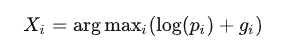
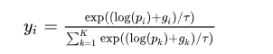

# Gumbel softmax

## 需求

在一些场景中，需要对离散变量进行采样。例如神经网络经过softmax后得到预测概率X=[0.1,0.2,0.5,0.2],这是一个概率分布。我们可以知道0.5的项最大。这里其实选择0.5的过程进行了一个argmax操作。就是选择最大可能项。但这个操作不可导。在一些分类等需求中，我们是对softmax结果进行求交叉熵来进行loss传递。但如果要对分类结果进行后续处理（采样）就无法进行梯度传递。Gumbel softmax可以解决这两个问题。一是我们要解决的是在后续处理中，使概率小的选项也可以被选择。二是不可求导的问题。

## 方法

熟悉VAE的应该知道，其中的重参数技巧就是为了解决不可导问题。就是要将概率分布P与一个无需求导的随机变量E相结合，那么采样过程通过E进行。（要求结合后的分布，与原分布p 相等或近似即可）

仿照VAE在Gumbel softmax中就是与Gumbel分布的随机变量结合



但argmax使得X还是不可导，一种方法是将随机变量X的取值从{1,2,...k}变为用一个K维的one_hot向量编码来表示.比如，本来取 Xi=i ，现如果用one_hot来表示的话，就是 Xi=(0,...,1,...,0) ，也就是第 i 个下标的值为1，其它都为0，我们记第 i 个下标的值为 yi 。那么我们就可以用softmax函数来近似这个one_hot向量



t是温度系数，t越小让本来大的Xi越大，使其接近1.使得整个分布接近离散的one-hot分布。t越大生成的分布越平滑。

生成Gumbel 分布的样本（即gi）需要inverse CDF method

```python
def gumbel_softmax_sampling(h, mu=0, beta=1, tau=0.1):
    """
    h : (N x K) tensor. Assume we need to sample a NxK tensor, each row is an independent r.v.
    """
    shape_h = h.shape
    p = F.softmax(h, dim=1)
    y = torch.rand(shape_h) + 1e-25  # ensure all y is positive.
    g = inverse_gumbel_cdf(y, mu, beta)
    x = torch.log(p) + g  # samples follow Gumbel distribution.
    # using softmax to generate one_hot vector:
    x = x/tau
    y_soft = F.softmax(x, dim=1)  # now, the x approximates a one_hot vector.
    return x
```