# RNN模型与NLP应用

## 数据处理基础

### 将语言信息→计算机可处理的数据

例如：性别：用0和1表示

​			国籍：国籍是categorical features，假如有197个国家。可以用1-197表示国籍，（为什么无0，因为我们一般将0作为数据集中缺失的数据）但这个数字没有大小含义，只有类别概念。我们对数字进行one hot编码。每个国籍变成了一个197维的向量。

​		（为什么用one hot？以国籍为例子，如果美国=1，中国=2，印度=3.那么美国+中国=印度 显然错误。如果one hot之后，美国+中国=[1,1,0,0...]。这样更合理。）

​			categorical features要用向量表示，不是标量。

### 处理文本信息

1. 句子分割为单词（tokenization），有许多注意点：是否大小写敏感，是否删除the a等这种高频无意义词，是否检查拼写错误等等

2. 计算词频

   将文字中每个单词出现次数记录，由大到小排列，再赋予1-n的value。

   排序可以删掉低频词（英文字典有超过10k的词，我们只保留10k，一方面低频词可能无意义（比如个人的名字或拼写错误）另一方面减轻编码负担，减少词向量维度）

3.one hot 编码

##  文本处理和词嵌入

### 文本处理

以电影评论为例子。text[i]代表第i条评论

我们对每一条评论作分割单词的处理得到tokens[i],再将每个词用数字表示变成sequences[i].

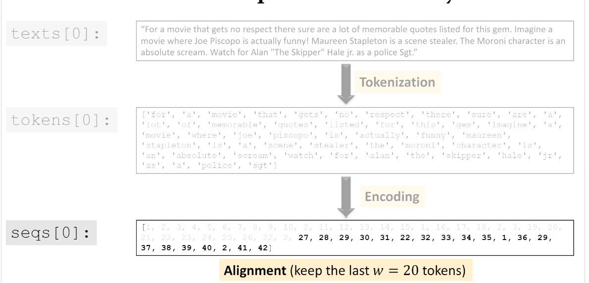

可以看到由于评论不同，得到的sequences长度不同，我们需要统一长度：设定每个序列w个词，超过则删除前面的词，少于则用0填充。

### 词嵌入

经过上面处理，每个单词由一个数字表示了，我们可以通过one hot处理。但这样的处理使得在句子长的时候维度太高。

所以我们要将高维的one hot 编码后的数据维度由高变低。

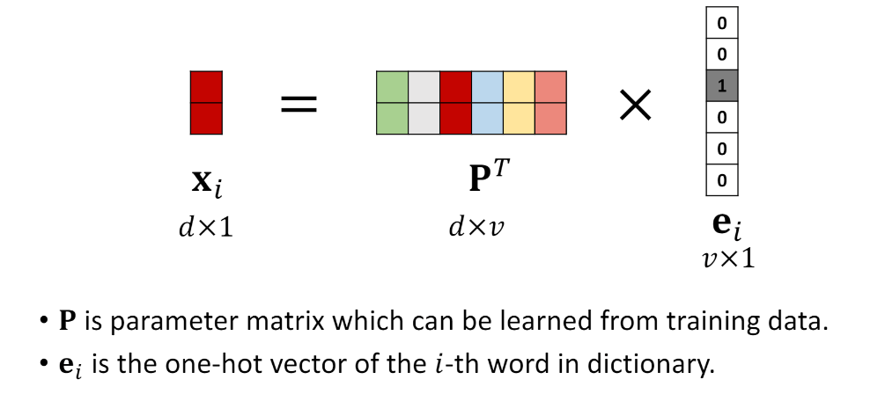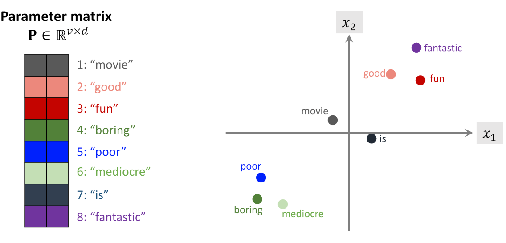

将向量*参数矩阵p进行低维映射得到词向量xi。

v是onehot之后的维度，也就是单词的数量。d是词向量的维度，自己决定。

p的每一行代表了1个词向量，对应1个单词，如上图。（因为onehot编码对应位置是1，所以结果xi和参数矩阵的每一行相同）

参数矩阵通过训练数据学习得到。假如我们的v（vocabulary）=10k，指定d（embedding dim）=8.输入的句子指定长度是20（这里就是前面提到的sequence），则词向量之后的输出是（20，8）。

什么是vocabulary sequence？

vocabulary是可以当作字典，全部英文单词取最高频的前10k，这样可以给每一个评论的词编号，sequence是每一条评论的词，并且调整到20.

为什么输出是（20，8），v=10k，d设置为8，那么参数矩阵p就是10k*8的参数量，经过与e_i相乘得到的x_i就是（20，8）.

## Simple RNN

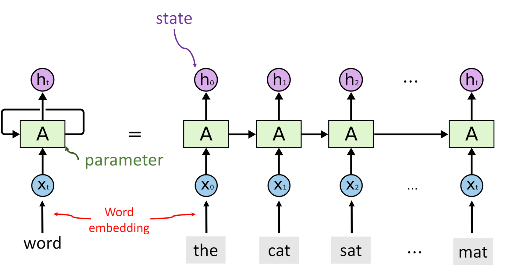

RNN模型不像CNN一样是one to one的，而是more to one/more。更适合时序序列，单词经过词嵌入得到输入x_t，经过参数矩阵A得到输出h_t,其中由于信息传递，h_t包含了h0到h_t的所有信息。注意参数矩阵A只有1个。

RNN内部是如何工作的？

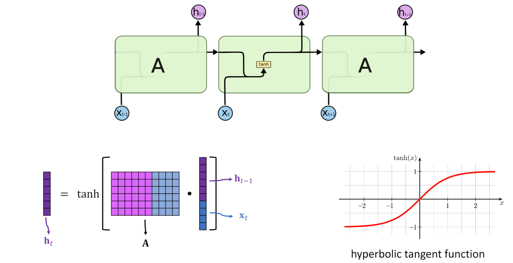

首先x_t与h_t-1进行结合，与参数矩阵相乘，最后经过激活函数得到h_t.

simpleRCNN缺点：由于rnn存在梯度消失和梯度爆炸，不擅长长序列，他容易忘记前面的输入内容。

## LSTM

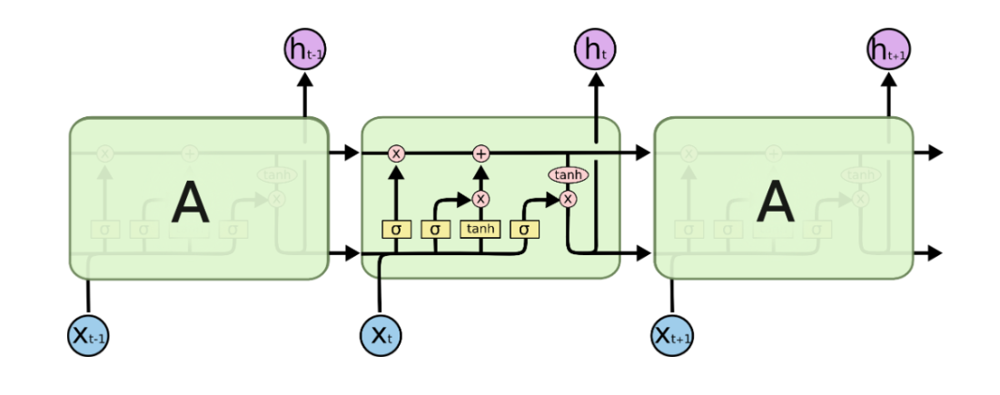

LSTM存在传输带c_t，让前面神经元信息直接传递给下一层，解决梯度消失

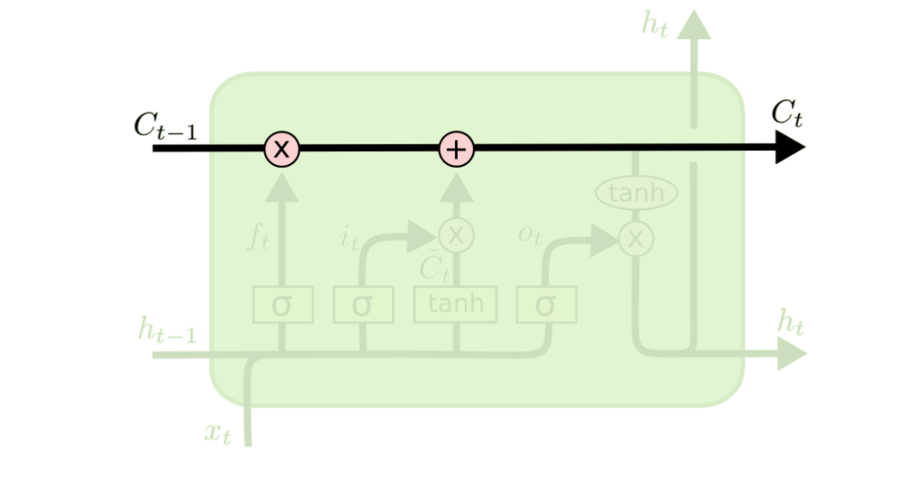

LSTM中存在很多门结构。

遗忘门：

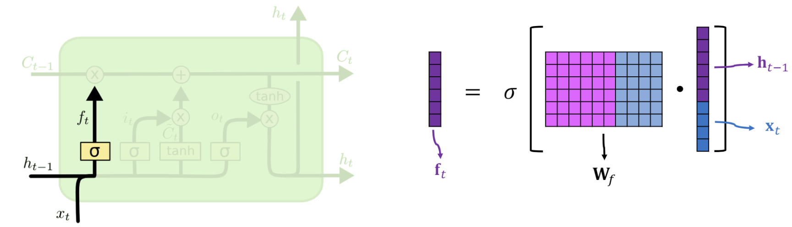

遗忘门原理由图中可以看到具体计算首先x_t与h_t-1进行结合，与参数矩阵相乘，最后经过激活函数得到f_t.得到的参数f_t与c_t-1进行点乘来起到筛选信息的作用。举下例说明，得到f矩阵中元素为0，则c_t-1对应行信息不能通过，若为1，则全部通过，通过这样的运算，起到了遗忘作用。

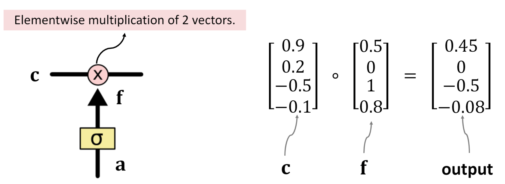

输入门：

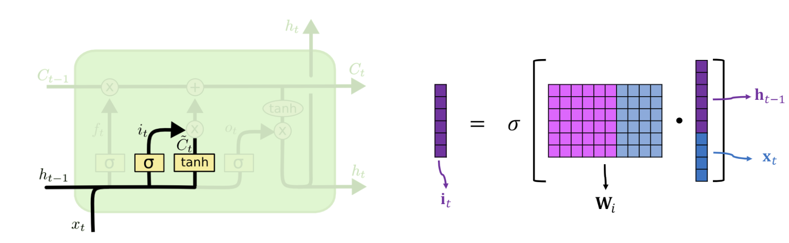

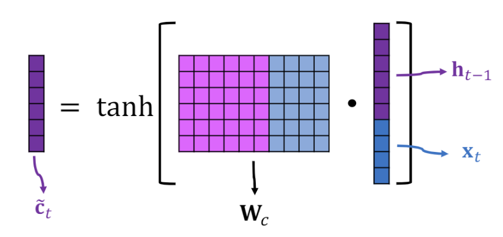

输入门有两条支路，存在两个参数矩阵，两者激活函数不同。

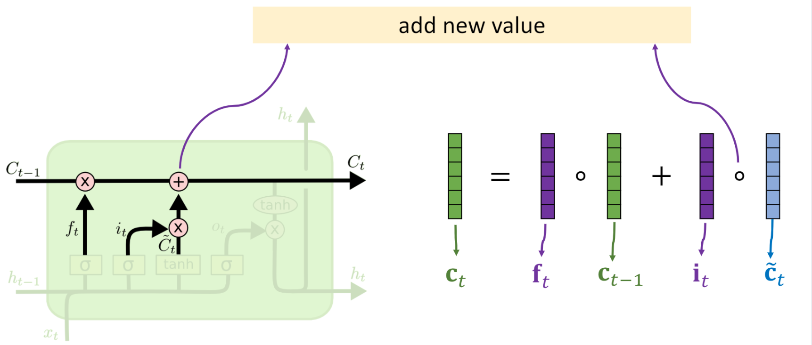

我们可以看到传输带c的参数更新过程，首先先经过与ft的点乘进行‘’遗忘‘’过程，再添加输入门最后的输出，这是添加新的信息的过程。

输出门：

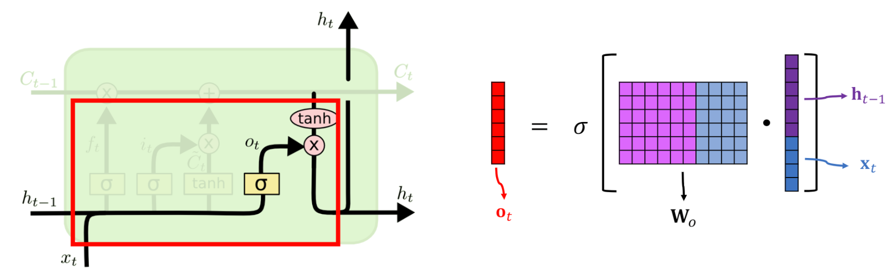

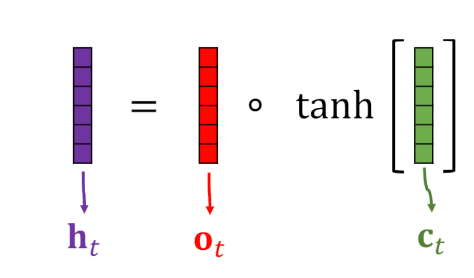

输出门的作用是得到最后的输出矩阵h_t,先得到o_t，再将c的结果经过激活函数与o_t进行点乘得到最后h。

经过上面过程，整个LSTM存在着4个参数矩阵。经过训练来更新。