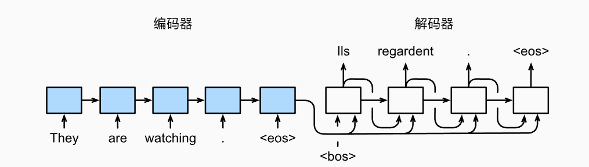

# RNN模型与NLP应用

## 数据处理基础

### 将语言信息→计算机可处理的数据

例如：性别：用0和1表示

​			国籍：国籍是categorical features，假如有197个国家。可以用1-197表示国籍，（为什么无0，因为我们一般将0作为数据集中缺失的数据）但这个数字没有大小含义，只有类别概念。我们对数字进行one hot编码。每个国籍变成了一个197维的向量。

​		（为什么用one hot？以国籍为例子，如果美国=1，中国=2，印度=3.那么美国+中国=印度 显然错误。如果one hot之后，美国+中国=[1,1,0,0...]。这样更合理。）

​			categorical features要用向量表示，不是标量。

### 处理文本信息

1. 句子分割为单词（tokenization），有许多注意点：是否大小写敏感，是否删除the a等这种高频无意义词，是否检查拼写错误等等

2. 计算词频

   将文字中每个单词出现次数记录，由大到小排列，再赋予1-n的value。

   排序可以删掉低频词（英文字典有超过10k的词，我们只保留10k，一方面低频词可能无意义（比如个人的名字或拼写错误）另一方面减轻编码负担，减少词向量维度）

3.one hot 编码

##  文本处理和词嵌入

### 文本处理

以电影评论为例子。text[i]代表第i条评论

我们对每一条评论作分割单词的处理得到tokens[i],再将每个词用数字表示变成sequences[i].

可以看到由于评论不同，得到的sequences长度不同，我们需要统一长度：设定每个序列w个词，超过则删除前面的词，少于则用0填充。

### 词嵌入

经过上面处理，每个单词由一个数字表示了，我们可以通过one hot处理。但这样的处理使得在句子长的时候维度太高。

所以我们要将高维的one hot 编码后的数据维度由高变低。

将向量*参数矩阵p进行低维映射得到词向量xi。

v是onehot之后的维度，也就是单词的数量。d是词向量的维度，自己决定。

p的每一行代表了1个词向量，对应1个单词，如上图。（因为onehot编码对应位置是1，所以结果xi和参数矩阵的每一行相同）

参数矩阵通过训练数据学习得到。假如我们的v（vocabulary）=10k，指定d（embedding dim）=8.输入的句子指定长度是20（这里就是前面提到的sequence），则词向量之后的输出是（20，8）。

什么是vocabulary sequence？

vocabulary是可以当作字典，全部英文单词取最高频的前10k，这样可以给每一个评论的词编号，sequence是每一条评论的词，并且调整到20.

为什么输出是（20，8），v=10k，d设置为8，那么参数矩阵p就是10k*8的参数量，经过与e_i相乘得到的x_i就是（20，8）.

## Simple RNN

RNN模型不像CNN一样是one to one的，而是more to one/more。更适合时序序列，单词经过词嵌入得到输入x_t，经过参数矩阵A得到输出h_t,其中由于信息传递，h_t包含了h0到h_t的所有信息。注意参数矩阵A只有1个。

RNN内部是如何工作的？

首先x_t与h_t-1进行结合，与参数矩阵相乘，最后经过激活函数得到h_t.

simpleRCNN缺点：由于rnn存在梯度消失和梯度爆炸，不擅长长序列，他容易忘记前面的输入内容。

## LSTM

LSTM存在传输带c_t，让前面神经元信息直接传递给下一层，解决梯度消失

LSTM中存在很多门结构。

遗忘门：

遗忘门原理由图中可以看到具体计算首先x_t与h_t-1进行结合，与参数矩阵相乘，最后经过激活函数得到f_t.得到的参数f_t与c_t-1进行点乘来起到筛选信息的作用。举下例说明，得到f矩阵中元素为0，则c_t-1对应行信息不能通过，若为1，则全部通过，通过这样的运算，起到了遗忘作用。

输入门：

输入门有两条支路，存在两个参数矩阵，两者激活函数不同。

我们可以看到传输带c的参数更新过程，首先先经过与ft的点乘进行‘’遗忘‘’过程，再添加输入门最后的输出，这是添加新的信息的过程。

输出门：

输出门的作用是得到最后的输出矩阵h_t,先得到o_t，再将c的结果经过激活函数与o_t进行点乘得到最后h。

经过上面过程，整个LSTM存在着4个参数矩阵。经过训练来更新。

## seq2seq

在这里我们以机器翻译为例解释seq2seq的模型。

我们的目标是英语到德语。首先是数据处理，即对英语样本与德语标签分别进行tokenization。由于英语与德语的字典不一样，所以有两个不同的tokenization形式。在tokenization时有两种，一种是word 即将句子以单词划分，一种是char，即句子以字母划分。（这里以char为例）在德语标签进行tokenization时，要另外加两个单独的标签，即起始符与停止符。tokenization后将各个数据变为词向量。

随后将英语句子输入编码器当中（以LSTM为例），这里LSTM的初始HC向量均为0矩阵。最后经过LSTM得到最后的结果H、C。然后经过解码器，解码器的初始化HC是编码器最后的结果，蕴含了编码器信息。在解码阶段输入是德语句子的，首次会输入起始符，起始符的标签是德语句子的第一个字母，两种计算损失并更新网络，第二次输入起始符和德语的一个真实字母，标签是德语的第二个字母，进行预测并计算损失回传。重复这个过程，最后将真实德语整个句子作为输入，标签就是停止符。

以上是训练过程，在预测时解码器输入就不再是德语的真实值，而是上一个阶段生成的德语预测。此时LSTM细胞的HC也变成了上一个LSTM细胞得到的HC。知道预测时预测到终止符。

训练过程说下一个时间步的输入是之前所有的字母，事实上时间步的输入还是只有一个字母，之所以说所有字母是因为HC更新了状态，HC的状态包含了之前输入的信息，所以说是之前的字母一块输入了。

以上两个图分别表示了训练与预测阶段的表现形式（图是单词编码）。

这里还要注意，这里演示是长度展开的，但实际上RNN是在自我循环，所以他不对翻译句子的长度有要求，只要没有预测出终止符，他就可以继续预测下去，也就是长度在变长。

其实难理解的是解码器。预测阶段好理解，就是解码器前一个时间步的输出会作为下一个时间步的输入。训练阶段时，我们知道翻译的真实值，所以下一个时间步的输入实际上是真实标签。

## 注意力机制 Attention

seq2seq这样的模型是利用编码器的最后一个状态送给解码器解码，但这样的结构在句子特别长的时候会忘记。为了改善长句子的效果，Attention出现了。

传统seq2seq结构用编码器的最后一个状态h_m作为解码器的最初状态s0.

Attention是这样做的，他将s0与编码器的所有中间状态计算相关性，得到m个系数a。a1...am加和为1。利用得到的系数对所有的h做加权平均。这样就不会遗忘之前的状态了。

那么具体如何来得到a呢？

第一种方式是通过h_i与s0直接结合再与参数矩阵相乘。相乘结构经过激活函数之后再与参数V做内积得到最终系数a，算出m个a后做softmax得到最终系数。

第二种首先将hi与s0分别与两个参数矩阵相乘来进行线性变换得到ki与q0向量。然后计算ki与q0向量的内积得到a，所有a进行softmax得到最终系数。

第二种方式现在更常用一些。transformer利用的注意力机制就是这种计算方式。

经过上面的注意力机制我们得到了c0，但有了c0之后我们变成了右面这种计算s1的方式。计算s2时，我们就需要输入、s1、c1了，c1是s1与h1....hm的注意力计算得到的，他的形式如同计算c0一样。如此我们得到了c0..cn,s0....sn.

## 自注意力机制 Self-attention

RNN结构或多或少总有遗忘，Self-attention改善了这种情况。

自注意力机制这样做，在原来的只有单一输入基础上的x1基础上增加c0（这里的c并不是LSTM中的传输带c）。c0蕴含了之前的注意力信息。c0与h0都是0.得到h1后我们计算h2。那么我们需要用到c1，c1是利用h1与h0和h1做相关性计算，得到系数a，经过系数a对h做加权平均得到c1.如此循环，我们计算ci，就是利用hi与h1...hi（h0是0故忽略）计算相关性，得到系数，然后加权和做ci。