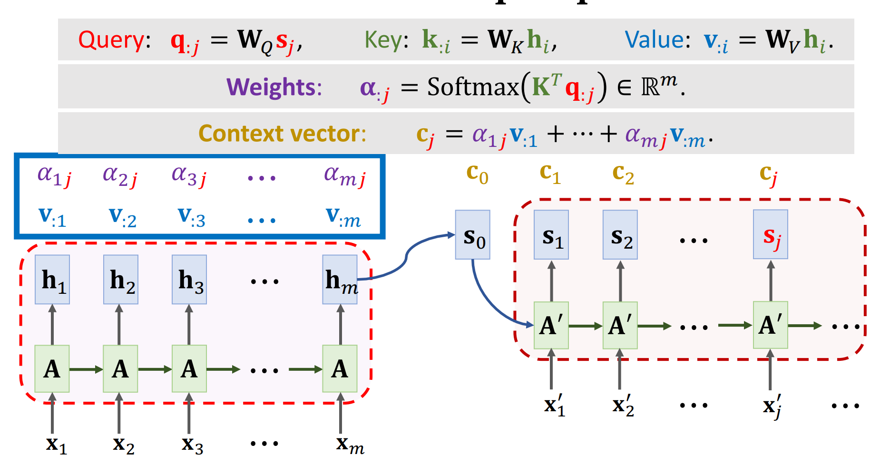
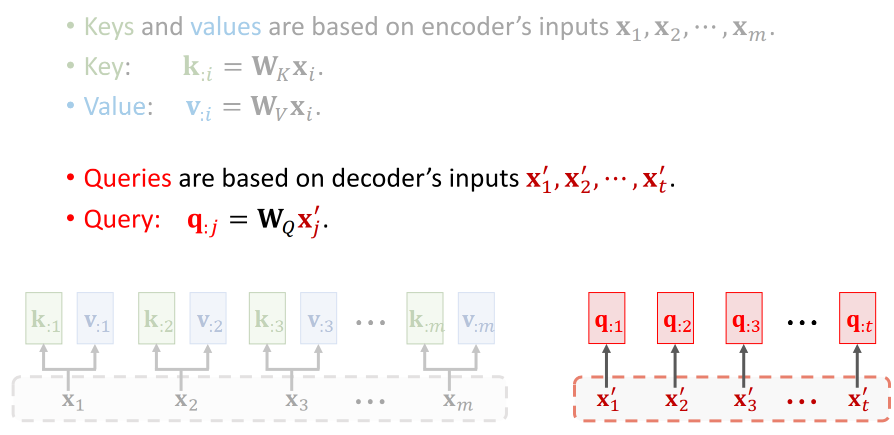
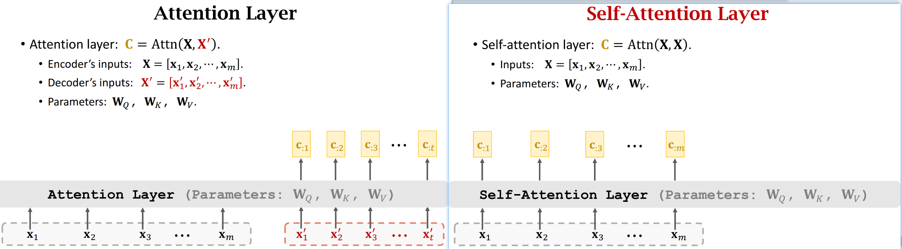
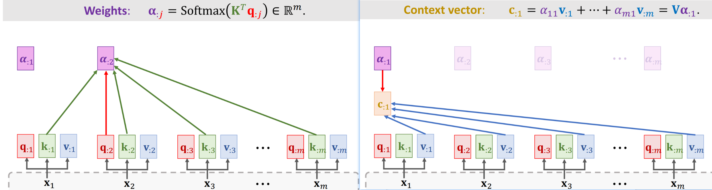
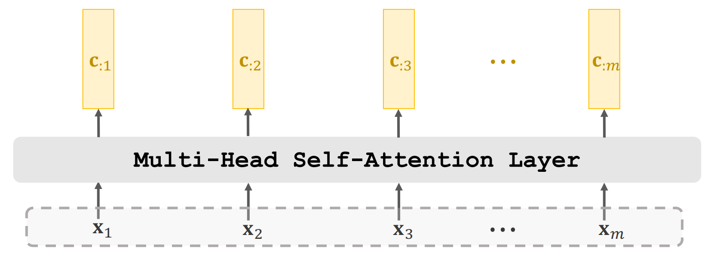
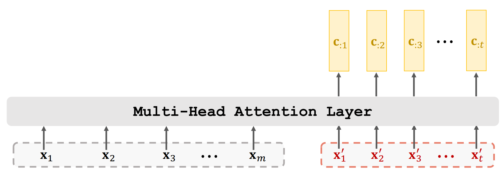
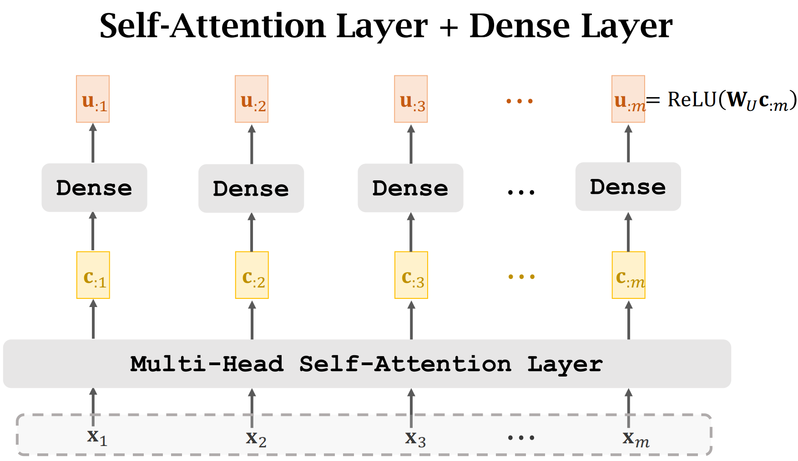
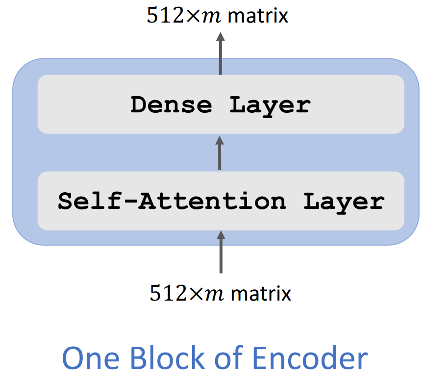
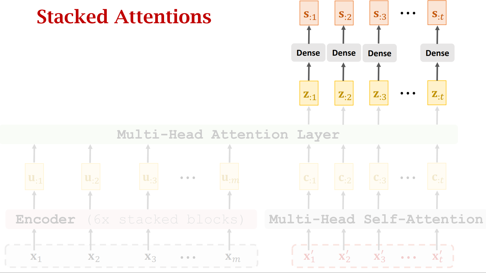
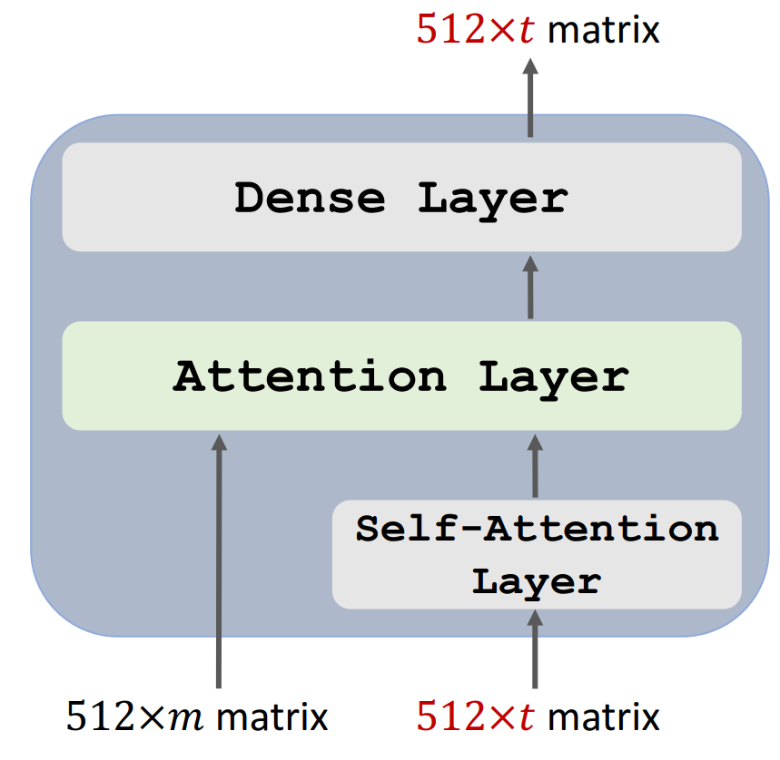

# Transformer

Transformer是一种seq2seq结构。

Transformer没有RNN。

Transformer基于自注意力机制

## RNN+Attention

在Transformer出现之前，一般是RNN+Attention的结构，我们先来看看带rnn的结构是如何计算的。



这里的原理在NLP基础那里已经描述过了，简略说下。三个参数矩阵与编码器解码器相乘得到q、k、v。举一个形象的例子，我是中国人－＞I am a Chinese.。在模型的解码阶段，每次生成一个词．譬如生成am的时候，am就是query，key是输入的所有词：我,是，中国人.value是这些词的隐含层向量．V代表每个source中输出的context vector；

## Attention without RNN



我们这样去掉RNN。

对输入X用两个参数矩阵做线性变换得到KV，对输出做线性变换得到Q。我们用q1与K相乘计算相关性得到a1，利用a1系数对V进行加权平均得到c1.以此类推可以得到c1...ct.由计算过程可以看出在计算ci时需要用到1个解码器的输入和所有编码器的信息

以机器翻译为例子，英语到法语翻译来说，我们通过所有英语得到向量c1经过softmax输出单词可能性得到第一个法语单词，第二个法语计算中有第一个生成的法语作为输入，并且计算了所有英语的信息后得到第二个法语单词，以此类推得到整个句子。整个过程与RNN很类似，只不过最终结果h由c替代。

## Self-Attention





上面介绍了Attention，Self-Attention与Attention原理一致，只不过只有自己的输入，QKV都是自己经过三个不同的参数矩阵产生的，来源相同所以叫自注意力。得到QKV之后的计算与Attention一致，不再赘述。最终得到的整个C向量就是自注意力的最终输出结果。

## Multi-Head Attention

多头注意力是由多个单头注意力组成的。单头注意力就是Self-Attention介绍的内容。多个单头之间参数不共享，1个头3个参数矩阵，l头就有3l个参数矩阵。将多个头得到的不同C堆叠起来就是多头注意力的输出。



同理，我们可以构建Multi-Head Attention。



## Transformer’s Encoder

我们将Multi-Head Attention与全连接层结合就得到了Transformer中的encoder的基本组成。多个这样的组件堆叠就是整个encoder



## Transformer’s Decoder




Decoder是这样组成的，在上面的encoder中我们得到了U结果，我们解码器的输入是x，先经过Multi-Head Attention得到C，就像上面解说的Attention结构一样，两个输入可以构成Attention层，Attention层的结果经过全连接层得到Decoder的输出。

整个Transformer’训练测试过程不一样，与seq2seq一样，训练时我们知道真实标签，decoder的输入出来encoder的输出外就是真实标签的mask（要把上次输出时间步后的mask掉）。测试时没有label，所以一步一步解码，利用上次的decoder输出得到的预测作为出来encoder的输出外的输入。

## mask

以R2Gen代码来讲，在报告生成中的transformer里存在两种mask

一是在编码器端的att_masks（相当于普通的padding_mask）

二是解码器端的seq_mask（相当于普通的sequence_mask）

att_masks：根据图像最终编码的大小生成了一个[batch_size,1,图像像素数]（图像像素数是指一般224经过32缩小后的7*7大小，也就是49，但由于是两个图，故这里是98）

seq_mask：seq指的是label，例如报告标签[1，2，3，4，5，6，7，8，9，2，3，3，3......]（1指开始，2结束，3是pad）。seq的长度是这个batch里最长的label。

```python
seq = seq[:, :-1] # 去除结束符(2,41)->(2,40)
seq_mask = (seq.data >3) #将除真实字符外的项变为fasle (2,40)
seq_mask[:, 0] += True #保留开始符(2,40)

seq_mask = seq_mask.unsqueeze(-2)#扩维度(2,40)->(2,1,40)
seq_mask = seq_mask &subsequent_mask(seq.size(-1)).to(seq_mask)#(2,1,40)->(2,40,40)
#subsequent_mask目的是产生一个上三角矩阵，上三角的值全为 1，下三角的值为0，对角线也是 0。把这个矩阵作用在每一个seq_mask序列上
```

mask的作用就是在注意力计算时候将我不想要得到注意力结果的时候（att_masks是pad所以没必要，seq_mask是遮蔽未来标签）。

在编码器中是自注意力机制QKV都是图像信息，如（2，98，512），由于是多头注意力（2，98，512）->（2，8，98，64）

```python
scores = torch.matmul(query, key.transpose(-2, -1)) / math.sqrt(d_k)#(2,8,98,98)得到注意力系数
if mask is not None:
    scores = scores.masked_fill(mask == 0, float('-inf'))#经不想要的设为负无穷，这样在softmax时就接近0
p_attn = F.softmax(scores, dim=-1)
```

解码器中存在注意力KV来自编码器，Q是已经生成的标签信息。如（2，40，512）.其余思路同上。
