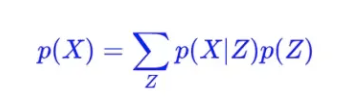

# VAE

## 目标

希望构建一个从隐变量 *Z* 生成目标数据 *X* 的模型：*X*=*g*(*Z*)

## 背景

我们有样本X(x1,x2...xn). X本质上是所有样本的一个采样。*X* 的真实分布 为*p*(*X*)。如果我们知道*p*(*X*)，那么我们可以随意生成X样本。神经网络的本质就是为了逼近某个真实分布。对于生成模型来说，根据 *p*(*X*) 来采样，就可以得到所有可能的 *X* 了（包括 {*X*1,…,*X*n} 以外的），这是一个终极理想的生成模型了。

但这个很难实现，所以我们转化一下。假设存在一个隐变量Z，它的分布是*p*(Z) 。根据*p*(Z) 我们能求出*p*(*X*) 。这里*p*(Z) 是先验分布，*p*(X|Z) 是后验分布。

在VAE中，给定一个真实样本 *Xk*，我们假设存在一个专属于Xk 的分布 p(Z|Xk)（学名叫后验分布），并进一步假设这个分布是（独立的、多元的）正态分布。*p*(*Z*) 假设是标准正态分布。这里强调专属是因为我们需要在p(Z|Xk)中采样*Zk* 还原为 *Xk*。其实有多少个 *X* 就有多少个正态分布，只有这样才方便后面的生成器做还原。如果假设 *p*(*Z*) 是正态分布，然后从 *p*(*Z*) 中采样一个 *Z*，那么我们不能知道这个 *Z* 对应于哪个真实的 *X* 。所以不同的输入样本有自己专属的后验分布。

下面这个图比较形象，*P*(*x*) 就是在积分域上所有高斯分布的累加。*p*(*Z*) 是标准正态分布。

## 方法

前面我们已经假定了后验分布p(Z|Xk)是正太分布，所以只要知道均值方差就可以得到这个分布。神经网络的作用就在此，它来训练逼近这样一个后验分布p(Z|Xk)。自此，我能知道专属于 *Xk* 的均值和方差了。从这个专属分布中采样一个 *Zk* 出来，然后经过一个生成器还原得到*Xk*。

但单纯的减小生成样本与真实样本的差距会使模型丧失生成能力。（就是说给定已知样本Xk，网络可以复原重建一个很好的Xk，但网络只是记忆来这个图片的分布，不能生成新的分布。也可以说我们还不能产生任何未知的东西，因为我们不能随意产生合理的潜在变量。因为合理的潜在变量都是编码器从原始图片中产生的。）

VAE是这样做的，它对编码器添加约束，就是强迫它产生服从单位高斯分布的潜在变量。正式这种约束，把VAE和标准自编码器给区分开来了。

得到正太分布后就需要采样出Zx送给生成器进行复原。但这个采样的过程是不可导的。所以这里使用来重参数技巧。本来我们需要从*N*(*μ*,*σ*^2) 采样Z，现在转化成从*N*(0,I)中采样

这样间接采样就避免不可导的问题。因为我们采样的操作是从标准正态分布采样的，但标准正态分布不需要优化，所以不可导无所谓，梯度可以正常传递给模型来优化产生正态分布的网络就可以。

## 

