# 报告生成评价指标

## image-captioning metrics

### BLUE

BLEU（双语互译质量评估辅助工具）。它是用来评估机器翻译质量的工具。BLEU算法实际上就是在判断两个句子的相似程度。它的总体思想就是准确率，假如给定标准译文reference，神经网络预测生成的句子是candidate，句子长度为n，candidate中有m个单词出现在reference，m/n就是bleu的1-gram的计算公式。

BLEU还有许多变种。根据n-gram可以划分成多种评价指标，常见的指标有BLEU-1、BLEU-2、BLEU-3、BLEU-4四种，其中n-gram指的是连续的单词个数为n。

计算公式：其实注意分母的数值与句子的n-gram中的n有关，不单单指的是句子的单词数，而是指的从头开始有几n对词。分子指的是预测的句子中从头开始的几n对词中，有多少在真实句子中出现了。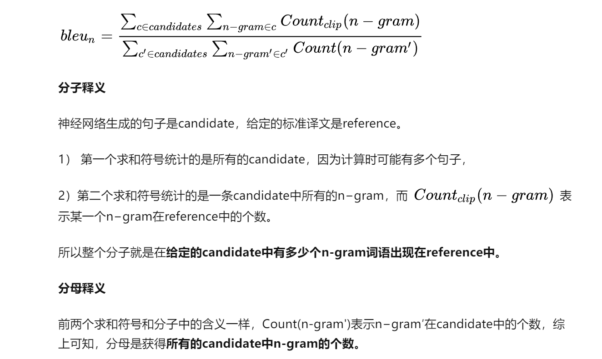

#### 原始的BLEU

原始的BLEU只考虑几个候选翻译的单词有多少出现在参考翻译中，但是这样容易掉入常用词的陷阱。例如：

|            |       |      |      |      |      |      |      |
| ---------- | ----- | ---- | ---- | ---- | ---- | ---- | ---- |
| Candidate  | the   | the  | the  | the  | the  | the  | the  |
| Reference1 | the   | cat  | is   | on   | the  | mat  |      |
| Reference2 | there | is   | a    | cat  | on   | the  | mat  |

如果按照上面计算1-gram分数就是1，但显然是错的

所以我们将BLEU进行改进提出改进型BLEU。

#### 改进型BLEU

$$
\operatorname{Count}_{w_{i}, j}^{c l i p}=\min \left(\operatorname{Count}_{w_{i}}, \operatorname{Re} f_{j_{-}} \operatorname{Count}_{w_{i}}\right)
$$

$$
\operatorname{Count}^{c l i p}=\max \left(\operatorname{Count}_{w_{i}, j}^{c l i p}\right), i=1,2,3 \ldots \ldots
$$

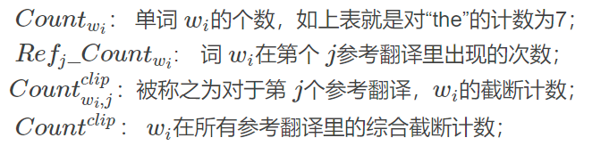

用改进后的$\operatorname{Count}^{c l i p}$代替原始公式中的分子就可以改进上述问题。这里$Ref_{1}\_Count_{'the'}=2$，所以$Count_{'the',1}^{clip}=min(7,2)=2$,同理$Count_{'the',2}^{clip}=1$,$Count^{clip}=max(1,2)=2$,分母不变，仍是候选句子的n-gram个数。这里分母为7。

其实 改进的n-gram精度得分可以用了衡量翻译评估的充分性和流畅性两个指标：一元组属于字符级别，关注的是翻译的充分性，就是衡量你的逐字逐字翻译能力； 多元组上升到了词汇级别的，关注点是翻译的流畅性，词组准了，说话自然相对流畅了。所以我们可以用多组多元精度得分来衡量翻译结果的.

事实是这样的，随着n-gram的增大，精度得分总体上成指数下降的，而且可以粗略的看成随着n而指数级的下降。我们这里采取**几何加权平均**，并且将各n-gram的作用视为等重要的，即取权重服从均匀分布。
$$
p_{\text {ave }}=\sum_{n=1}^{N} \sqrt{\prod_{n=1}^{N} p_{n}^{w_{n}}}=\frac{1}{\sum_{n=1}^{N} w_{n}} \exp \left(\sum_{i=1}^{N} w_{n} * \log ^{p_{n}}\right)=\exp \left(\frac{1}{N} * \sum_{i=1}^{N} \log ^{p_{n}}\right)
$$
pn为改进的多元精度， wn为赋予的权重（这里都是1）。

当译句比参考翻译都要长时，分母增大了，这就相对惩罚了译句较长的情况。译句较短就更严重了

| Candidate  | the   | cat  |      |      |      |      |      |
| ---------- | ----- | ---- | ---- | ---- | ---- | ---- | ---- |
| Reference1 | the   | cat  | is   | on   | the  | mat  |      |
| Reference2 | there | is   | a    | cat  | on   | the  | mat  |

显然，这时候选翻译的精度得分又是1（12+1212+12）！短译句就是这样，很容易得高分…所以必须要设计一个有效的惩罚措施去控制。首先，定一个名词叫“**最佳匹配长度**”（best match length），就是，如果译句长度和任意一个参考翻译的长度相同，就认为它满足最佳匹配长度。这种情况下，就不要惩罚了，惩罚因子要设为1。
$$
B P=\left\{\begin{array}{l}
1 \ldots \ldots \ldots \ldots i f \ldots c>r \\
e^{1-\frac{r}{c}} \ldots \ldots \text {. . . . . } c \leq r
\end{array}\right.
$$
见上式，rr是一个参考翻译的词数，cc是一个候选翻译的词数，BP代表译句较短惩罚值。由此，最终BLEU值得计算公式为：
$$
B L E U=B P * \exp \left(\sum_{n=1}^{N} w_{n} * \log ^{p_{n}}\right)
$$

### ROUGE 

#### Rouge-N

Rouge-N实际上是将模型生成的结果和标准结果按N-gram拆分后，计算召回率。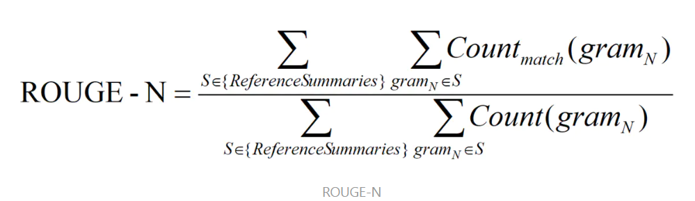

分母是参考句子的所有n-gram组合，分子是生成句子的组合。如果给定多个 参考译文ROUGE-N 会分别计算机器译文和这些参考译文的 ROUGE-N 分数，并取其最大值。

#### Rouge-L

'L'是最长公共子序列，一般用LCS表示。LCS(X,Y)表示橘子X,Y的最长公共子序列长度。这里的XY不一定非要连续的，可以中间隔着其他的。

ROUGE-L计算公式如下（参考句子X长度m，生成Y长度n）

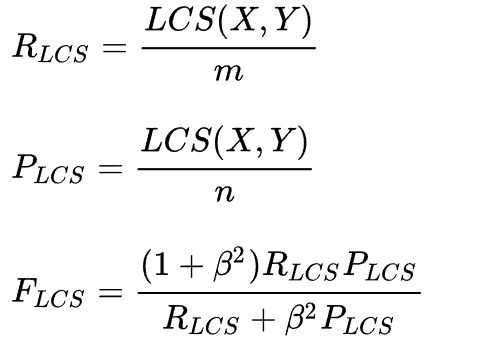

公式中的 R_LCS 表示召回率，而 P_LCS 表示精确率，F_LCS 就是 ROUGE-L。F_LCS为两者之之间的重合度，参数β在国际评比中一般设为∞，所以F值一般由召回率R确定。

#### ROUGE-W ROUGE-S

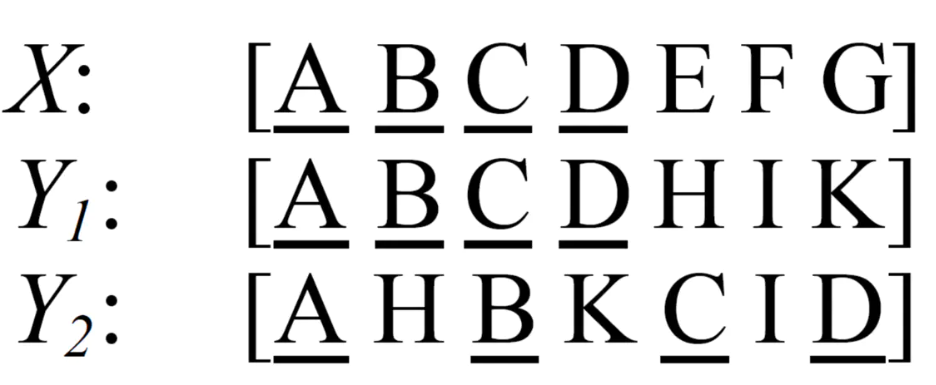

ROUGE-L存在问题，如上图，X是参考，Y是生成，明显Y1好，但根据上面的计算发现Y1Y2得分一样。因此提出了一种加权最长公共子序列方法 (WLCS)，给连续翻译正确的更高的分数。

ROUGE-S使用了skip-grams，在参考摘要和待评测摘要进行匹配时，不要求gram之间必须是连续的，可以“跳过”几个单词，比如skip-bigram，在产生grams时，允许最多跳过两个词。比如“cat in the hat”的 skip-bigrams 就是 “cat in, cat the, cat hat, in the, in hat, the hat”.

### METERO

METERO是基于单字的精确率和召回率的调和平均。首先仍然定义了精确率P和召回率R：

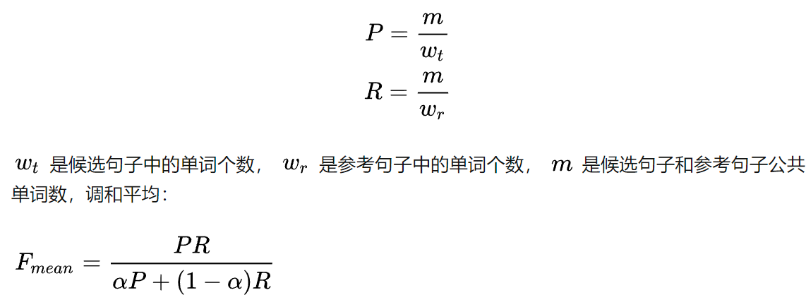

以上只考虑了单个单词，希望匹配到的连续长度越长越好，所以引入了惩罚因子pen。

metero = （1-pen）*F_mean

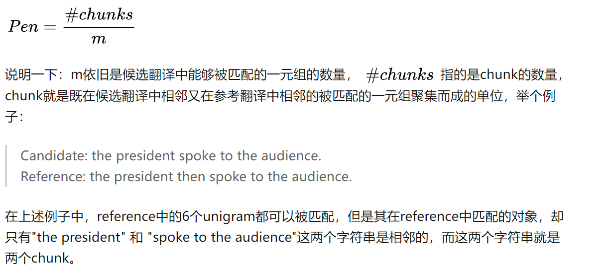

### CIDEr

CIDEr专门设计出来描述图像字幕。这个指标将每个句子都看作“文档”，将句子的N-gram表示成TF-IDF向量，通过对每个n元组进行(TF-IDF) 权重计算，然后计算生成字幕与ground truth字幕的余弦相似度，来衡量图像标注的一致性的。

#### TF-IDF词向量表示

TF-IDF的英文表示是term frequency（词频），inverse document frequency（逆文件频率）。词频 (TF) 指的是某一个给定的词语在该文件中出现的次数。这个数字通常会被归一化(一般是词频除以文章总词数), 以防止它偏向长的文件。DF的主要思想是：如果包含词条t的文档越少, IDF越大，则说明词条具有很好的类别区分能力。某一特定词语的IDF，可以由总文件数目除以包含该词语之文件的数目，再将得到的商取对数得到。

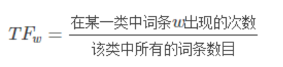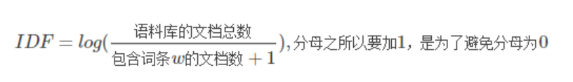

TF-IDF = TF*IDF
$$
\operatorname{CIDEr}_{n}(c, S)=\frac{1}{M} \sum_{i=1}^{M} \frac{g^{n}(c) \cdot g^{n}\left(S_{i}\right)}{\left\|g^{n}(c)\right\| \times\left\|g^{n}\left(S_{i}\right)\right\|}
$$
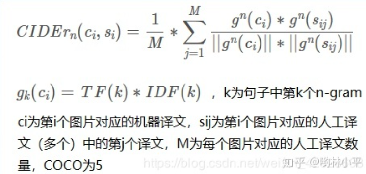

举例：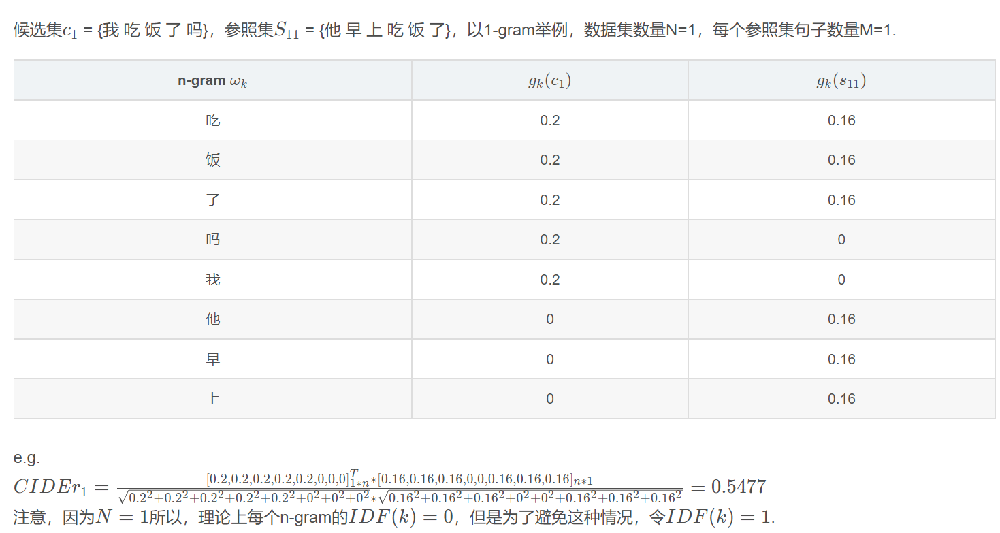

以吃为例，g_k(c1)=吃 在c1中出现个数/c1的总词条数目

g_k(s11)==吃 在s11中出现个数/s11的总词条数目
### SPICE
SPICE 使用基于图的语义表示来编码字幕中的目标, 分布和关系。它先将待评价字幕和ground truth字幕用概率上下文无关文法 (PCFG) 编码成语义依赖树，然后用基于规则的方法把语义依赖树映射成场景图。最后计算待评价的字幕中目标、分布和关系的F分数。
