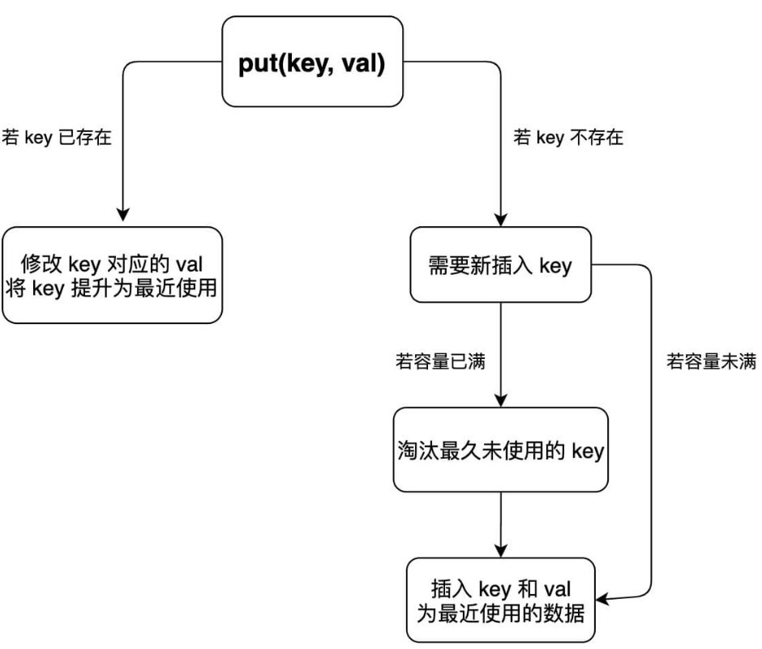
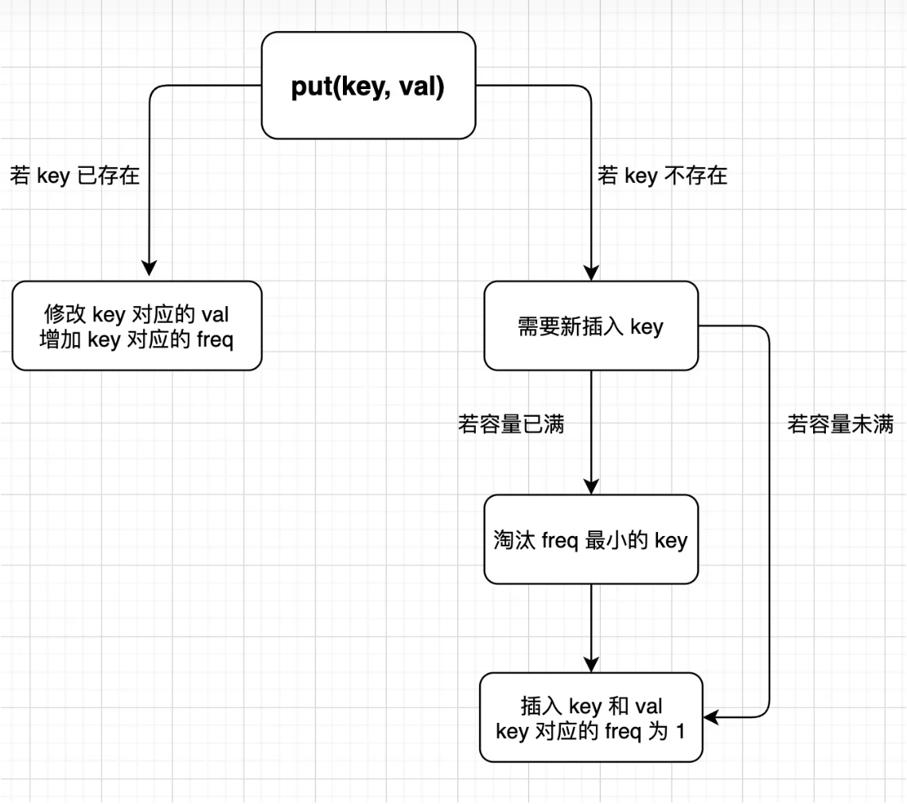
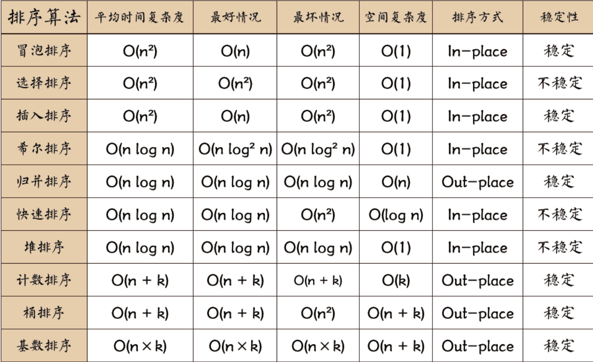

#经典算法

## KMP

字符串匹配算法

```java
public class KMP {
    private int[][] dp;
    private String pat;

    public KMP(String pat) {
        this.pat = pat;
        int M = pat.length();
        // dp[状态][字符] = 下个状态
        dp = new int[M][256];
        // base case
        dp[0][pat.charAt(0)] = 1;
        // 影子状态 X 初始为 0
        int X = 0;
        // 构建状态转移图
        for (int j = 1; j < M; j++) {
            for (int c = 0; c < 256; c++){
                dp[j][c] = dp[X][c];
            }
            dp[j][pat.charAt(j)] = j + 1;
            // 更新影子状态
            X = dp[X][pat.charAt(j)];
        }
    }

    public int search(String txt) {
        int M = pat.length();
        int N = txt.length();
        // pat 的初始态为 0
        int j = 0;
        for (int i = 0; i < N; i++) {
            // 计算 pat 的下一个状态
            j = dp[j][txt.charAt(i)];
            // 到达终止态，返回结果
            if (j == M) return i - M + 1;
        }
        // 没到达终止态，匹配失败
        return -1;
    }
}
```

~~~java
public int strStr(String haystack, String needle) {
    char[] str1 = haystack.toCharArray();
    char[] str2 = needle.toCharArray();
    int i1=0, i2=0;
    int[] next = getNextArray(str2);
    while(i1<str1.length && i2<str2.length) {
        if(str1[i1] == str2[i2]){
            i1++;
            i2++;
        }else if(next[i2]==-1){
            i1++;
        }else{
            //此时i2表示的下表发生不匹配，需要寻找0- i-1匹配时的最长公共前后缀
            i2 = next[i2];
        }
    }
    return i2 == str2.length ? i1-i2:-1;

}
//求取匹配串的next数组，数组ms[i]表示0 - i-1的数组的最大公共前后缀。
//i-1是为了方便next[i2]得到的数字就是i2的新的下标。
public int[] getNextArray(char[] ms){
    if(ms.length == 1){
        return new int[] {-1};
    }
    int[] next = new int[ms.length];
    next[0] = -1;
    next[1] = 0;
    int i = 2;
    int cn=0;//代表最大前后缀的长度
    while(i<next.length){
        if(ms[i-1]==ms[cn]){
            next[i++] = ++cn;
        } else if(cn>0){
            cn = next[cn];
        } else{
            next[i++] = 0;
        }
    }
    return next;
}

~~~


## 并查集

```java
class UF {
    // 连通分量个数
    private int count;
    // 存储每个节点的父节点
    private int[] parent;

    // n 为图中节点的个数
    public UF(int n) {
        this.count = n;
        parent = new int[n];
        for (int i = 0; i < n; i++) {
            parent[i] = i;
        }
    }
    // 将节点 p 和节点 q 连通
    public void union(int p, int q) {
        int rootP = find(p);
        int rootQ = find(q);
        
        if (rootP == rootQ)
            return;
        
        parent[rootQ] = rootP;
        // 两个连通分量合并成一个连通分量
        count--;
    }
    // 判断节点 p 和节点 q 是否连通
    public boolean connected(int p, int q) {
        int rootP = find(p);
        int rootQ = find(q);
        return rootP == rootQ;
    }
    public int find(int x) {
        if (parent[x] != x) {
            parent[x] = find(parent[x]);
        }
        return parent[x];
    }
    // 返回图中的连通分量个数
    public int count() {
        return count;
    }
}

```

## LRU（Least Recently Used）

[146. LRU 缓存 - 力扣（LeetCode）](https://leetcode.cn/problems/lru-cache/description/)

功能：接收一个参数capacity为缓存的容量。满缓存时删除最早使用的哪个内容
实现put功能依据存入key、val，

实现get功能依据key得到val



```java
//利用哈希表实现key与val的对应
//利用链表完成时间排序，包含了删除添加，
//删除要求Key、val都删除，依据链表要找到两者，所以链表中包含两个信息。
//删除时要调整链表结构，保证O(1),需要双向链表

class Node{
    public int key ,val;
    public Node next, pre;
    public Node(int k, int v){
        this.key = k;
        this.val = v;
    }
}
class DoubleList{
    private Node head,tail;
    private int size;
    public DoubleList(){
        head = new Node(0,0);
        tail = new Node(0,0);
        head.next = tail;
        tail.pre = head;
        size = 0;
    }
    public void addLast(Node x){
        x.next = tail;
        x.pre = tail.pre;
        tail.pre = x;
        x.pre.next = x;
        size++;
    }
    public void remove(Node x){
        x.pre.next = x.next;
        x.next.pre = x.pre;
        size--;
    }
    public Node removeFirst(){
        if (head.next == tail)
            return null;
        Node first = head.next;
        remove(first);
        return first;
    }  
    public int size() { return size; }
}
class LRUCache {
    HashMap<Integer,Node> map;
    DoubleList cache;
    int cap;
    public LRUCache(int capacity) {
        map = new HashMap<>();
        cache = new DoubleList();
        cap = capacity;

    }
    public void makeRencently(int key){
        Node node = map.get(key);
        cache.remove(node);
        cache.addLast(node);
    }
    public int get(int key) {
        if(!map.containsKey(key)){
            return -1;
        }
        makeRencently(key);
        return map.get(key).val;
    }
    public void removeLeastRecently(){
        Node node = cache.removeFirst();
        map.remove(node.key);
    }
    public void addRecently(int key, int val){
        Node node = new Node(key,val);
        cache.addLast(node);
        map.put(key,node);
    }
    public void put(int key, int value) {
        if(map.containsKey(key)){
            map.get(key).val = value;
            makeRencently(key);
            return;
        }
        if(cap == cache.size()){
            removeLeastRecently();
        }
        addRecently(key, value);
    }
}
```


```java
class LRUCache {
    int cap;
    LinkedHashMap<Integer, Integer> cache = new LinkedHashMap<>();
    public LRUCache(int capacity) { 
        this.cap = capacity;
    }
    public int get(int key) {
        if (!cache.containsKey(key)) {
            return -1;
        }
        makeRecently(key);
        return cache.get(key);
    }
    public void put(int key, int val) {
        if (cache.containsKey(key)) {
            cache.put(key, val);
            makeRecently(key);
            return;
        }
        if (cache.size() >= this.cap) {
            // 链表头部就是最久未使用的 key
            int oldestKey = cache.keySet().iterator().next();
            cache.remove(oldestKey);
        }
        // 将新的 key 添加链表尾部
        cache.put(key, val);
    }
    
    private void makeRecently(int key) { //调整至最新就是先删除再添加
        int val = cache.get(key);
        cache.remove(key);
        cache.put(key, val);
    }
}
```

## LFU (Least Frequently Used)

[460. LFU 缓存 - 力扣（LeetCode）](https://leetcode.cn/problems/lfu-cache/description/)

功能：接收一个参数capacity为缓存的容量。满缓存时删除频率最低使用的内容(相同频率删除最早的那个)
实现put功能依据存入key、val

实现get功能依据key得到val



```java
//get方法返回val，需要一个哈希表key-val
//get或者删除时需要对特定key频率进行加减，需要一个哈希表key-freq
//删除时要遵循删除频率最低，时间最久的顺序。每个频率对应链表按照时间顺序.删除key需要哈希表fre-key
//需要记录最小频率方便删除

class Node{
    public int key, val;
    int freq = 1;
    public Node next, pre;
    public Node(int k, int v){
        this.key = k;
        this.val = v;
    }
}
class DoubleList{
    public Node head,tail;
    public int size;
    public DoubleList(){
        head = new Node(0,0);
        tail = new Node(0,0);
        head.next = tail;
        tail.pre = head;
        
    }
    public void addLast(Node x){
        x.next = tail;
        x.pre = tail.pre;
        tail.pre = x;
        x.pre.next = x;
        size++;
    }
    public void remove(Node x){
        x.pre.next = x.next;
        x.next.pre = x.pre;
        size--;
    }
    public Node removeFirst(){
        if (head.next == tail)
            return null;
        Node first = head.next;
        remove(first);
        return first;
    }  
    public int size() { return size; }
}

class LFUCache{
    int cap;//总容量
    int size;//现容量
    HashMap<Integer, Node> cache; 
    HashMap<Integer, DoubleList> freqMap;
    int minFreq;
    public LFUCache(int capacity) {
        cache = new HashMap<> ();
        freqMap = new HashMap<>();
        this.cap = capacity;
        this.minFreq = 0;
    }
    public int get(int key) {
        if(!cache.containsKey(key)){
            return -1;
        }
        incFreq(key);
        return cache.get(key).val;
    }
    public void put(int key, int val){
        if (this.cap == 0) {
            return;
        }
        if (cache.containsKey(key)) {
            cache.get(key).val = val;
            incFreq(key);
            return;
        }
        if (this.cap <= size){
            removeMin();
        }
        Node newNode = new Node(key, val);
        cache.put(key, newNode);
        addFreqmap(1,newNode);
        size++;
        this.minFreq = 1;
    }
    public void incFreq(int key){
        Node node = cache.get(key);
        int freq = node.freq;
        DoubleList freqList = freqMap.get(freq);
        freqList.remove(node);
        if (freq == minFreq && freqList.head.next == freqList.tail){//原始频率是最小频率，只有最小频率的链表没有了才可能minFreq++
            minFreq++;
        }
        node.freq++;
        addFreqmap(freq+1,node);
    }
    private void removeMin() {
        DoubleList minList = freqMap.get(minFreq);
        cache.remove(minList.head.next.key);
        minList.remove(minList.head.next);
        size--;
    }
    private void addFreqmap(int freq,Node node){
        DoubleList freqList = freqMap.get(freq);
        if(freqList == null){
            freqMap.put(freq, new DoubleList());
            freqList = freqMap.get(freq);
        }
        freqList.addLast(node);
    }    
}

```

## 快速幂

~~~java
public double myPow(double x, int n) {
    long b = n;
    if(b<0){
        b = -b;
        x = 1/x;
    }
    double res=1;
    while(b !=0){
        if(b%2 ==1){
            res = res * x;
        }
        b = b/2;
        x = x*x;

    }
    return res;
}
~~~

## **Dijkstra**

~~~java
//建图算法，输入节点个数和节点之间的关系
List<Integer>[] buildGraph (int numCourses, int[][] prerequisites){
        List<Integer>[] graph = new LinkedList[numCourses];
        for (int i = 0; i < numCourses; i++) {
            graph[i] = new LinkedList<>();
        }
        for(int[] l:prerequisites){
            int from = l[1];
            int to = l[0];
            graph[from].add(to);
        }
        return graph;
    }
// 返回节点 from 到节点 to 之间的边的权重
int weight(int from, int to);
//新建类表示节点和start到节点的距离
class State {
    // 图节点的 id
    int id;
    // 从 start 节点到当前节点的距离
    int dist;

    State(int id, int dist) {
        this.id = id;
        this.dist = dist;
    }
}

// 输入一幅图和一个起点 start，计算 start 到其他节点的最短距离
int[] dijkstra(int start, List<Integer>[] graph) {
    // 图中节点的个数
    int V = graph.length;
    // 记录最短路径的权重，你可以理解为 dp table
    // 定义：distTo[i] 的值就是节点 start 到达节点 i 的最短路径权重
    int[] distTo = new int[V];
    // 求最小值，所以 dp table 初始化为正无穷
    Arrays.fill(distTo, Integer.MAX_VALUE);
    // base case，start 到 start 的最短距离就是 0
    distTo[start] = 0;

    // 优先级队列，distFromStart 较小的排在前面
    Queue<State> pq = new PriorityQueue<>((a, b) -> {
        return a.dist - b.dist;
    });

    // 从起点 start 开始进行 BFS
    pq.offer(new State(start, 0));

    while (!pq.isEmpty()) {
        State curState = pq.poll();
        int curID = curState.id;
        int curDist = curState.dist;

        if (curDist > distTo[curID]) {
            // 已经有一条更短的路径到达 curNode 节点了
            continue;
        }
        // 将 curNode 的相邻节点装入队列
        for (int nextID : graph[curID]) {
            // 看看从 curNode 达到 nextNode 的距离是否会更短
            int distToNext = distTo[curID] + weight(curID, nextID);
            if (distTo[nextID] > distToNext) {
                // 更新 dp table
                distTo[nextID] = distToNext;
                // 将这个节点以及距离放入队列
                pq.offer(new State(nextID, distToNext));
            }
        }
    }
    return distTo;
}
~~~


## HashMap

~~~java
//put前先考虑扩容；存储时，数组位置为空直接放，不为空则遍历链表检查hash、equals。都不想等则插入头
//扩容时创建两倍大小数组借助putVal重排布
public class MyHashMap<K,V>{
    //节点类
    class Node<K, V> {
        //键值对
        private K key;
        private V value;

        //链表，后继
        private Node<K, V> next;

        public Node(K key, V value) {
            this.key = key;
            this.value = value;
        }

        public Node(K key, V value, Node<K, V> next) {
            this.key = key;
            this.value = value;
            this.next = next;
        }
    }
    //默认容量
    final int DEFAULT_CAPACITY = 16;
    //负载因子
    final float LOAD_FACTOR = 0.75f;
    //HashMap的大小
    private int size;
    //桶数组
    Node<K, V>[] buckets;
   //无参构造器，设置桶数组默认容量
    public ThirdHashMap() {
        buckets = new Node[DEFAULT_CAPACITY];
        size = 0;
    }
	//有参构造器，指定桶数组容量
    public ThirdHashMap(int capacity) {
        buckets = new Node[capacity];
        size = 0;
    }
    //哈希函数，获取地址
    private int getIndex(K key, int length) {
        //获取hash code
        int hashCode = key.hashCode();
        //和桶数组长度取余
        int index = hashCode % length;
        return Math.abs(index);
    }
    public void put(K key, V value) {
        //判断是否需要进行扩容
        if (size >= buckets.length * LOAD_FACTOR) resize();
        putVal(key, value, buckets);
    }
    //将元素存入指定的node数组
    private void putVal(K key, V value, Node<K, V>[] table) {
        //获取位置
        int index = getIndex(key, table.length);
        Node node = table[index];
        //插入的位置为空
        if (node == null) {
            table[index] = new Node<>(key, value);
            size++;
            return;
        }
        //插入位置不为空，说明发生冲突，使用链地址法,遍历链表
        while (node != null) {
            //如果key相同，就覆盖掉
            if ((node.key.hashCode() == key.hashCode())
                    && (node.key == key || node.key.equals(key))) {
                node.value = value;
                return;
            }
            node = node.next;
        }
        //当前key不在链表中，插入链表头部
        Node newNode = new Node(key, value, table[index]);
        table[index] = newNode;
        size++;
    }
    //扩容
    private void resize() {
        //创建一个两倍容量的桶数组
        Node<K, V>[] newBuckets = new Node[buckets.length * 2];
        //将当前元素重新散列到新的桶数组
        rehash(newBuckets);
        buckets = newBuckets;
    }
    //重新散列当前元素
    private void rehash(Node<K, V>[] newBuckets) {
        //map大小重新计算
        size = 0;
        //将旧的桶数组的元素全部刷到新的桶数组里
        for (int i = 0; i < buckets.length; i++) {
            //为空，跳过
            if (buckets[i] == null) {
                continue;
            }
            Node<K, V> node = buckets[i];
            while (node != null) {
                //将元素放入新数组
                putVal(node.key, node.value, newBuckets);
                node = node.next;
            }
        }
    }
    public V get(K key) {
        //获取key对应的地址
        int index = getIndex(key, buckets.length);
        if (buckets[index] == null) return null;
        Node<K, V> node = buckets[index];
        //查找链表
        while (node != null) {
            if ((node.key.hashCode() == key.hashCode())
                    && (node.key == key || node.key.equals(key))) {
                return node.value;
            }
            node = node.next;
        }
        return null;
    }
    
}

~~~

## 线程池

~~~java
public class MyThreadPool{
    /**存放线程的集合*/
    private ArrayList<MyThead> threads;
    /**任务队列*/
    private ArrayBlockingQueue<Runnable> taskQueue;
    /**线程池初始限定大小*/
    private int threadNum;
    /**已经工作的线程数目*/
    private int workThreadNum;
    
    private final ReentrantLock mainLock = new ReentrantLock();
    
    public MyThreadPool(int initPoolNum) {
        threadNum = initPoolNum;
        threads = new ArrayList<>(initPoolNum);
        //任务队列初始化为线程池线程数的四倍
        taskQueue = new ArrayBlockingQueue<>(initPoolNum*4);
        
        threadNum = initPoolNum;
        workThreadNum = 0;
    }
    
    public void execute(Runnable runnable) {
        try {
            mainLock.lock();
            //线程池未满，每加入一个任务则开启一个线程
            if(workThreadNum < threadNum) {
                MyThead myThead = new MyThead(runnable);
                myThead.start();
                threads.add(myThead);
                workThreadNum++;
            }
            //线程池已满，放入任务队列，等待有空闲线程时执行
            else {
                //队列已满，无法添加时，拒绝任务
                if(!taskQueue.offer(runnable)) {
                    rejectTask();
                }
            }
        } finally {
            mainLock.unlock();
        }
    }
    
    private void rejectTask() {
        System.out.println("任务队列已满，无法继续添加，请扩大您的初始化线程池！");
    }
    public static void main(String[] args) {
        MyThreadPool myThreadPool = new MyThreadPool(5);
        Runnable task = new Runnable() {
            @Override
            public void run() {
                System.out.println(Thread.currentThread().getName()+"执行中");
            }
        };
        
        for (int i = 0; i < 20; i++) {
            myThreadPool.execute(task);
        }
    }
    
    class MyThead extends Thread{
        private Runnable task;
        
        public MyThead(Runnable runnable) {
            this.task = runnable;
        }
        @Override
        public void run() {
            //该线程一直启动着，不断从任务队列取出任务执行
            while (true) {
                //如果初始化任务不为空，则执行初始化任务
                if(task != null) {
                    task.run();
                    task = null;
                }
                //否则去任务队列取任务并执行
                else {
                    Runnable queueTask = taskQueue.poll();
                    if(queueTask != null)
                        queueTask.run();    
                }
            }
        }
    }
}
~~~


## 十大排序算法



### 快排

~~~java
void quickSort(int[] stock,int l, int r){
    if(l>=r) return;
    int i = l, j = r;
    int num = stock[l];
    while(i<j){
        while(i<j&&stock[j]>=num) j--;
        while(i<j&&stock[i]<=num) i++;
        swap(stock, i, j);
    }
    swap(stock, i, l);
    quickSort(stock, l, i - 1);
    quickSort(stock, i + 1, r);
}
void swap(int[] stock, int i, int j) {
    int tmp = stock[i];
    stock[i] = stock[j];
    stock[j] = tmp;
}
~~~


### 归并排序

~~~java
/* 合并左子数组和右子数组 */
void merge(int[] nums, int left, int mid, int right) {
    // 左子数组区间为 [left, mid], 右子数组区间为 [mid+1, right]
    // 创建一个临时数组 tmp ，用于存放合并后的结果
    int[] tmp = new int[right - left + 1];
    // 初始化左子数组和右子数组的起始索引
    int i = left, j = mid + 1, k = 0;
    // 当左右子数组都还有元素时，进行比较并将较小的元素复制到临时数组中
    while (i <= mid && j <= right) {
        if (nums[i] <= nums[j])
            tmp[k++] = nums[i++];
        else
            tmp[k++] = nums[j++];
    }
    // 将左子数组和右子数组的剩余元素复制到临时数组中
    while (i <= mid) {
        tmp[k++] = nums[i++];
    }
    while (j <= right) {
        tmp[k++] = nums[j++];
    }
    // 将临时数组 tmp 中的元素复制回原数组 nums 的对应区间
    for (k = 0; k < tmp.length; k++) {
        nums[left + k] = tmp[k];
    }
}

/* 归并排序 */
void mergeSort(int[] nums, int left, int right) {
    // 终止条件
    if (left >= right)
        return; // 当子数组长度为 1 时终止递归
    // 划分阶段
    int mid = (left + right) / 2; // 计算中点
    mergeSort(nums, left, mid); // 递归左子数组
    mergeSort(nums, mid + 1, right); // 递归右子数组
    // 合并阶段
    merge(nums, left, mid, right);
}
~~~

### 堆排序

~~~java
/* 堆的长度为 n ，从节点 i 开始，从顶至底堆化 */
void siftDown(int[] nums, int n, int i) {
    while (true) {
        // 判断节点 i, l, r 中值最大的节点，记为 ma
        int l = 2 * i + 1;
        int r = 2 * i + 2;
        int ma = i;
        if (l < n && nums[l] > nums[ma])
            ma = l;
        if (r < n && nums[r] > nums[ma])
            ma = r;
        // 若节点 i 最大或索引 l, r 越界，则无须继续堆化，跳出
        if (ma == i)
            break;
        // 交换两节点
        int temp = nums[i];
        nums[i] = nums[ma];
        nums[ma] = temp;
        // 循环向下堆化
        i = ma;
    }
}

/* 堆排序 */
void heapSort(int[] nums) {
    // 建堆操作：依照层次遍历有底至顶进行向上堆化，由于叶子节点没有子节点，所以要从最后一个非叶子节点开始，也就是数组最后一个元素的父节点，(nums.length-1 -1)/2

    for (int i = nums.length / 2 - 1; i >= 0; i--) {
        siftDown(nums, nums.length, i);
    }
    // 从堆中提取最大元素，循环 n-1 轮
    for (int i = nums.length - 1; i > 0; i--) {
        // 交换根节点与最右叶节点（交换首元素与尾元素）
        int tmp = nums[0];
        nums[0] = nums[i];
        nums[i] = tmp;
        // 以根节点为起点，从顶至底进行堆化
        siftDown(nums, i, 0);
    }
}
~~~


###选择排序

~~~java
/* 选择排序 */
void selectionSort(int[] nums) {
    int n = nums.length;
    // 外循环：未排序区间为 [i, n-1]
    for (int i = 0; i < n - 1; i++) {
        // 内循环：找到未排序区间内的最小元素
        int k = i;
        for (int j = i + 1; j < n; j++) {
            if (nums[j] < nums[k])
                k = j; // 记录最小元素的索引
        }
        // 将该最小元素与未排序区间的首个元素交换
        int temp = nums[i];
        nums[i] = nums[k];
        nums[k] = temp;
    }
}
~~~

### 插入排序

~~~java
/* 插入排序 */
void insertionSort(int[] nums) {
    // 外循环：已排序元素数量为 1, 2, ..., n
    for (int i = 1; i < nums.length; i++) {
        int base = nums[i], j = i - 1;
        // 内循环：将 base 插入到已排序部分的正确位置
        while (j >= 0 && nums[j] > base) {
            nums[j + 1] = nums[j]; // 将 nums[j] 向右移动一位
            j--;
        }
        nums[j + 1] = base;        // 将 base 赋值到正确位置
    }
}
}

~~~


