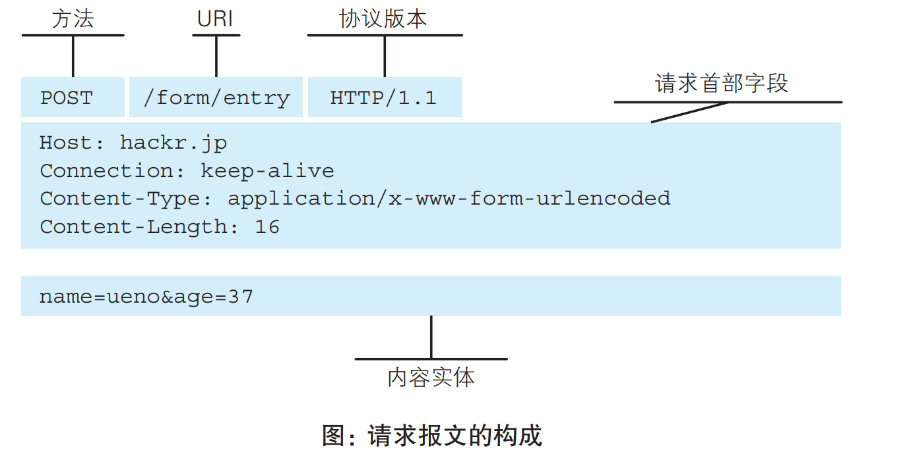
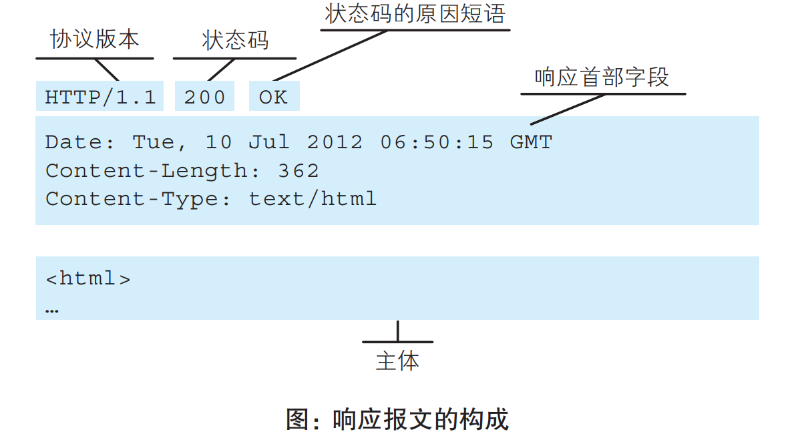
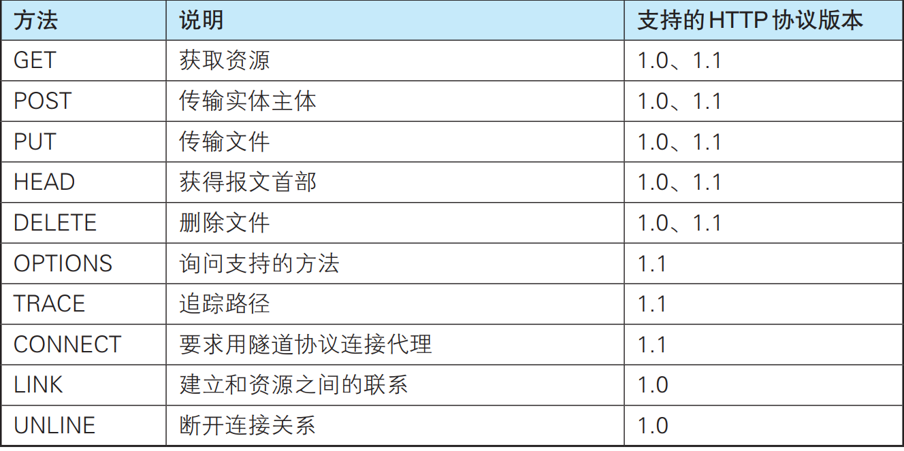
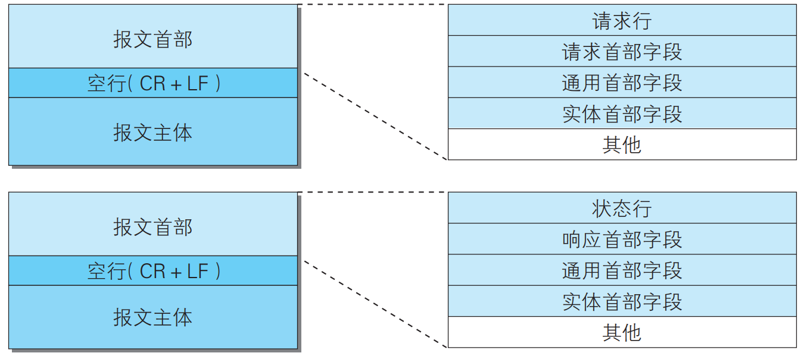

# HTTP

##TCP/IP 协议族

计算机与网络设备要相互通信，双方就必须基于相同的方法。与互联网相关联的协议集合起来总称为 TCP/IP。

TCP/IP 协议族按层次分别分为以下 4 层：应用层、传输层、网络层和数据链路层。

**应用层：**决定了向用户提供应用服务时通信的活动。FTP、DNS、HTTP 协议都处于该层。

**传输层：**传输层对上层应用层，提供处于网络连接中的两台计算机之间的数据传输。TCP、UDP处于该层。

**网络层：**网络层用来处理在网络上流动的数据包。该层规定了通过怎样的路径（所谓的传输路线）到达对方计算机，并把数据包传送给对方。IP处于该层

**链路层:**用来处理连接网络的硬件部分。包括控制操作系统、硬件的设备驱动、NIC(网卡)等物理可见部分

**IP**

IP（Internet Protocol）网际协议位于网络层。IP 协议的作用是把各种数据包传送给对方。

IP 间的通信依赖 MAC 地址。通常是经过多台计算机和网络设备中转才能连接到对方。中转时使用中转设备的 MAC 地址来搜索下一个中转目标。会采用 ARP 协议。ARP 是一种用以解析地址的协议，根据通信方的 IP 地址就可以反查出对应的 MAC 地址。

**TCP**

TCP 位于传输层，提供可靠的字节流服务。为了方便传输， 将大块数据分割成以报文段为单位的数据包进行管理。

为了准确无误地将数据送达目标处，TCP 协议采用了三次握手策略。目的是向对方确认是否成功送达。这个过程使用标志SYN和 ACK 。

发送端首先发送带 SYN 标志的数据包，接收端收到后， 回传一个带有 SYN/ACK 标志的数据包，最后，发送端再回传一个带 ACK 标志的数据包，代表“握手”结束。

**DNS**

DNS服务是和 HTTP 协议一样位于应用层 的协议。它提供域名到 IP 地址之间的解析服务。

DNS 协议提供通过域 名查找 IP 地址，或逆向从 IP 地址反查域名的服务。

**URI**

URI 就是由某个协议方案表示的资源的定位标识符。URI 用字符串标识某一互联网资源，而 URL 表示资源的地点（互联网上所处的位置）。可见 URL 是 URI 的子集。　

## HTTP 协议通信

HTTP 协议规定，请求从客户端发出，最后服务器端响应该请求并返回。

HTTP 是一种无状态协议，自身不对请求和响应之间的通信状态进行保存。为了实现期望的保持状态功能，引入了 Cookie 技术。

**Cookie 技术**

通过在请求和响应报文中写入 Cookie 信息来控制客户端的状态。Cookie 会根据从服务器端发送的响应报文内的一个叫做 Set-Cookie 的首部字段信息，通知客户端保存 Cookie。当下次客户端再往该服务器发送请求时，客户端会自动在请求报文中加入 Cookie 值后发送出去。

### HTTP 方法

**GET：获取资源**

GET 方法用来请求访问已被 URI 识别的资源。指定的资源经服务器端解析后返回响应内容。

**POST：传输实体主体**

虽然用 GET 方法也可以传输实体的主体，但一般不用 GET 方法进行传输，而是用 POST 方法。

**PUT：传输文件**

PUT 方法用来传输文件。要求在请求报文的主体中包含文件内容，然后保存到请求 URI 指定的位置。

**HEAD：获得报文首部**

HEAD 方法和 GET 方法一样，只是不返回报文主体部分。用于确认 URI 的有效性及资源更新的日期时间等。

**DELETE：删除文件**

DELETE 方法用来删除文件，是与 PUT 相反的方法。DELETE 方 法按请求 URI 删除指定的资源

**OPTIONS：询问支持的方法**

OPTIONS 方法用来查询针对请求 URI 指定的资源支持的方法。

**TRACE：追踪路径**

TRACE 方法是让 Web 服务器端将之前的请求通信环回给客户端的方法。客户端通过 TRACE 方法可以查询发送出去的请求是怎样被加工修改 / 篡改的。

**CONNECT：要求用隧道协议连接代理**

CONNECT 方法要求在与代理服务器通信时建立隧道，实现用隧道 协议进行 TCP 通信。主要使用 SSL和 TLS协议把通信内容加密后经网络隧道传输

##HTTP 报文

用于 HTTP 协议交互的信息被称为 HTTP 报文。请求端（客户端）的 HTTP 报文叫做请求报文，响应端（服务器端）的叫做响应报文。HTTP 报文大致可分为报文首部和报文主体两块。

### 报文首部

首部内容为客户端和服务器分别处理请求和响应提供所需要的信息。

在请求中，HTTP 报文由方法、URI、HTTP 版本、HTTP 首部字段等部分构成

响应中，HTTP 报文由 HTTP 版本、状态码（数字和原因短语）、 HTTP 首部字段 3 部分构成

#### 首部字段

客户端与服务器无论是请求还是响应都会使用首 部字段，它能起到传递额外重要信息的作用。结构：首部字段名: 字段值

## HTTPS

HTTP 主要有这些不足：

通信使用明文（不加密），内容可能会被窃听

不验证通信方的身份，因此有可能遭遇伪装

无法证明报文的完整性，所以有可能已遭篡改

实际上这是不加密通信的通用缺点,具体来说可能有以下问题：

HTTP 协议中的请求和响应不会对通信方进行确认。任何人都可以发起请求。无法确定服务器是否是真实服务器；无法确定响应返回的客户端是真实客户端；无法确定对方是否由访问某些内容的权限；无法判定请求是来自何方、出自谁手；即使是无意义的请求也会照单全收。无法阻止海量请求下的 DoS 攻击；

无法证明报文完整性，可能已遭篡改。请求或响应在传输途中，遭攻击者拦截并篡改内容的攻击称为中间人攻击。

**加密技术**

通信加密：HTTP 协议中没有加密机制，但可以通 过和 SSL或 TLS的组合使用，加密 HTTP 的通信内容。用 SSL 建立安全通信线路之后，就可以在这条线路上进行 HTTP 通信了。与 SSL 组合使用的 HTTP 被称为 HTTPS

内容加密：把 HTTP 报 文里所含的内容进行加密处理。但不同于通信加密，内容有被篡改的风险

HTTP 协议无法确定通信方。但SSL 则可以，它提供加密处理，而且还使用证书可用于确定方。(证书由值得信任的第三方机构颁发，用以证明服务器和客户端是实际存在的。)

虽然有使用 HTTP 协议确定报文完整性的方法，但并不实用。SSL 提供认证和加 密处理及摘要功能。仅靠 HTTP 确保完整性是非常困难的，因此通过和 其他协议组合使用来实现这个目标。

### SSL

通常，HTTP 直接和 TCP 通信。当使用 SSL 时，则演变成先和 SSL 通信，再由 SSL 和 TCP 通信了。简言之，所谓 HTTPS，其实就是身披 SSL 协议这层外壳的 HTTP. SSL 是独立于 HTTP 的协议，所以不光是 HTTP 协议，其他运行在 应用层的 SMTP 和 Telnet 等协议均可配合 SSL 协议使用。

**公开密钥加密**

加密和解密同用一个密钥的方式称为共享密钥加密。以共享密钥方式加密时必须将密钥也发给对方。但如何发送是问题

公开密钥加密方式很好地解决了共享密钥加密的困难。公开密钥加密使用一对非对称的密钥：私有密钥、公开密钥。使用公开密钥加密时，发送密文的一方使用对方的公开密钥进行 加密处理，对方收到被加密的信息后，再使用自己的私有密钥进行解密。

HTTPS 采用共享密钥加密和公开密钥加密两者并用的混合加密机制。

**HTTPS 的通信步骤**

客户端通过发送 Client Hello 报文开始 SSL 通信。包含客户端支持的 SSL 的指定版本、加密组件、列表。服务器可进行 SSL 通信时，会以 Server Hello 报文作为应答。之后服务器发送 Certificate 报文，包含公开密钥证书。最后服务器发送 Server Hello Done 报文通知客户端，SSL 握手协商部分结束。SSL 第一次握手结束之后，客户端以 Client Key Exchange 报文作为回应。客户端继续发送 Change Cipher Spec 报文，提示服务器采用 Pre-master secret 密钥加密。客户端发送 Finished 报文。服务器同样发送 Change Cipher Spec 报文。服务器同样发送 Finished 报文。服务器和客户端的 Finished 报文交换完毕之后，SSL 连接完成。发送 HTTP 请求。发送 HTTP 响应。完成后客户端断开连接，发送 close_notify。

总结：客户端Client Hello→服务器Server Hello→服务器Certificate →服务器Server Hello Done →客户端Client Key Exchange→客户端Change Cipher Spec→客户端Finished→服务器Change Cipher Spec→服务器Finished →HTTP 请求→HTTP 响应→断开连接

在以上流程中，应用层发送数据时会附加一种叫做 MAC的报文摘要，MAC能够查知报文是否遭到篡改， 从而保护报文的完整性。

使用 SSL 时，它的处理速度会变慢。

###身份认证

计算机本身无法确认网络的那头究竟有谁，需要客户端自报家门。自报家门需要认证信息。

HTTP 使用的认证方式：BASIC 认证（基本认证）、DIGEST 认证（摘要认证）、SSL 客户端认证、FormBase 认证（基于表单认证）

##追加协议

###SPDY

**HTTP 的瓶颈**

一条连接上只可发送一个请求。

请求只能从客户端开始。客户端不可以接收除响应以外的指令。

请求 / 响应首部未经压缩就发送。首部信息越多延迟越大。

发送冗长的首部。每次互相发送相同的首部造成的浪费较多。

可任意选择数据压缩格式。非强制压缩发送。

**SPDY** 

SPDY 没有完全改写 HTTP 协议，而是在 TCP/IP 的应用层与运输层之间通过新加会话层的形式运作。SPDY 以会话层的形式加入，控制对数据的流动，但还是采用 HTTP 建立通信连接。

使用 SPDY 后，HTTP 协议额外获得功能：多路复用流、赋予请求优先级、压缩 HTTP 首部、推送功能、服务器提示功能

###WebSocket

WebSocket，即 Web 浏览器与 Web 服务器之间全双工通信标准。

一旦 Web 服务器与客户端之间建立起 WebSocket 协议的通信连接， 之后所有的通信都依靠这个专用协议进行。通信过程中可互相发送 JSON、XML、HTML 或图片等任意格式的数据。

WebSocket 协议的主要特点：推送功能、减少通信量

实现 WebSocket 通信，在 HTTP 连接建立之后，需要完成一次 “握手”步骤。用到 HTTP 的 Upgrade 首部字段， 告知服务器通信协议发生改变，以达到握手的目的。服务器返回状态码 101 Switching Protocols 的响应。成功握手确立 WebSocket 连接之后，通信时不再使用 HTTP 的数据 帧，而采用 WebSocket 独立的数据帧

##Web攻击技术

**在客户端即可篡改请求**

在 Web 应用中，从浏览器那接收到的 HTTP 请求的全部内容，都 可以在客户端自由地变更、篡改。在 HTTP 请求报文内加载攻击代码，就能发起对 Web 应用的攻击。

对 Web 应用的攻击模式有以下两种：主动攻击、被动攻击

主动攻击是指攻击者通过直接访问 Web 应用，把攻击代码传入的攻击模式。有代表性的攻击是 SQL 注入攻击和 OS 命令注入攻击。

被动攻击是指利用圈套策略执行攻击代码的攻击模式。在被动攻击过程中，攻击者不直接对目标 Web 应用访问发起攻击。

**因输出值转义不完全引发的安全漏洞**

Web 应用的安全对策：客户端的验证、Web 应用端（服务器端）的验证

**跨站脚本攻击XSS**

跨站脚本攻击（Cross-Site Scripting，XSS）是指通过存在安全漏洞 的 Web 网站注册用户的浏览器内运行非法的 HTML 标签或 JavaScript 进行的一种攻击。

如何防范XSS攻击 1）前端，服务端，同时需要字符串输入的长度限制。 2）前端，服务端，同时需要对HTML转义处理。将其中的”<”,”>”等特殊字符进行转义编码。 防 XSS 的核心是必须对输入的数据做过滤处理。

**因会话管理疏忽引发的安全漏洞**

会话劫持：是指攻击者通过某种手段拿到了用户的 会话 ID，并非法使用此会话 ID 伪装成用户，达到攻击的目的

**跨站点请求伪造CSRF**

跨站点请求伪造（Cross-Site Request Forgeries，CSRF）攻击是指攻击者通过设置好的陷阱，强制对已完成认证的用户进行非预期的个人信息或设定信息等某些状态更新，属于被动攻击。