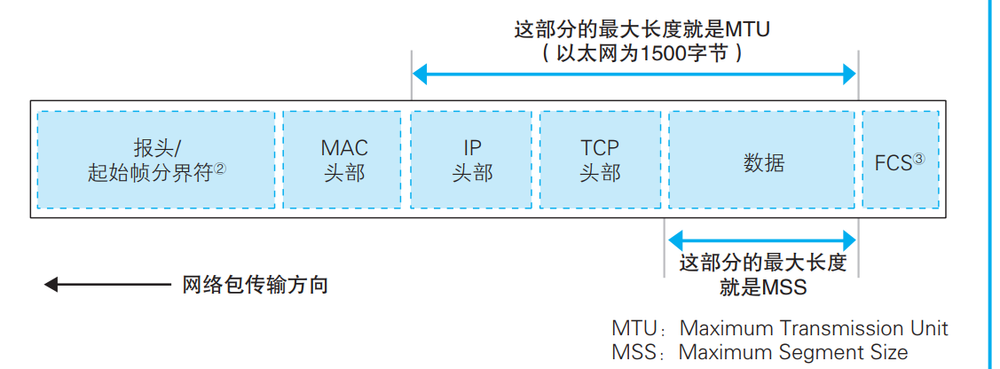

# 网络连接

##基础定义

URL(Uniform Resource Locator)：网址，'http://......; ftp:; file:; mailto:; ...'

URI(Uniform Resource Identifier):一般来说，URI 的内容是一个存放网页数据的文件名或者是一个 CGI 程序的文件名

## HTTP 协议过程

定义了客户端和服务器之间交互的消息内容和步骤的协议。

客户端会向服务器发送请求消息（包含目标URI和方法）。方法有GET(获取 URI 指定的信息)、POST(从客户端向服务器发送数据)、...  HTTP 消息中还有一些用来表示附加信息的头字段。客户端向 Web 服务器发送数据时，会先发送头字段，然后再发送数据。

Web 服务器解析客户端消息，并完成相应操作。将结果存放在响应消息中，响应消息的开头有一个状态码， 它用来表示操作的执行结果是成功还是发生了错误。

HTTP过程需要遵循严格的格式要求，请求消息的第一行称为请求行。包含了方法和URI。第二行开始为消息头，消息头的规格中定义了很多项目，如日期、客户端支持的 数据类型、语言、压缩格式、客户端和服务器的软件名称和版本、数据有效期和最后更新时间等。需要发送的数据。这一部分称为消息体。

响应消息的格式以及基本思路和请求消息是相同的

### TCP/IP协议

它只是利用 IP 进行通信时所必须用到的协议群的统称。TCP/IP 就是为使用互联网而开发制定的协议族。

TCP/IP结构:由一些小的子网，通过路由器连接起来组成一个大的网络。这里的子网可以理解为用集线器连接起来的几台计算机。

####IP地址

网络中所有设备都会被分配一个地址，称其IP地址(32 比特的数字)，包含了网络号和主机号.在组建网络时，用户可以自行决定它们之间的分配关系。使用子网掩码作为附加信息标识哪里是主机号,子网掩码是一串与 IP 地址长度相同的 32 比特数字，其左边一半都是 1，右边一半都是0，1 的部分表示网络号，为 0 的部分表示主机号。

## 浏览器生成消息

### 解析URL

URL包含Web名称、文件的路径名

### 生成HTTP请求消息

依据URL信息以及HTTP协议的相关规则，生成HTTP请求消息

### DNS服务器查询IP

生成消息后需要将消息发送给服务器。需要知道服务器域名对应的 IP 地址。通过DNS进行查询。

计算机上有 DNS 客户端称为 DNS 解析器，解析器实际上是一段程序，包含在操作系统的 Socket 库中。通过解析器向 DNS 服务器发出查询，然后 DNS 服务器会返回响应消息。

**DNS 服务器的基本工作**

接收来自客户端的查询消息，然后根据消息的内容返回响应。

客户端的查询消息：域名、Class(现在只有IN表示互联网)、记录类型

### 委托协议栈发送消息

得到IP地址之后，可以委托操作系统内部的协议栈向这个目标 IP 地址发送消息了。

收发数据的操作：（1）创建套接字（创建套接字阶段）（2）将管道连接到服务器端的套接字上（连接阶段）（3）收发数据（通信阶段）（4）断开管道并删除套接字（断开阶段）

管道在连接时是由客户端发起的，但在断开时可以由客户端或服务器任意一方发起。

## 用电信号传输 TCP/IP 数据

###创建套接字

**协议栈的内部结构**

协议栈的上半部分有两块，分别是负责用 TCP 协议收发数据的部分和负责用 UDP 协议收发数据的部分，它们会接受应用程序的委托执行收发数据的操作。

浏览器、邮件等一般应用程序收发数据时用 TCP；DNS 查询等收发较短的控制数据时用 UDP。

下面一半是用 IP 协议控制网络包收发操作的部分，发送网络包的操作由 IP 来负责。IP 中还包括 ICMP 协议和 ARP协议。 ICMP 用于告知网络包传送过程中产生的错误以及各种控制消息，ARP 用 于根据 IP 地址查询相应的以太网 MAC 地址 。IP 下面的网卡驱动程序负责控制网卡硬件，而最下面的网卡则负责完 成实际的收发操作，也就是对网线中的信号执行发送和接收的操作。

**套接字**

套接字中记录了用于控制通信操作的各种控制信息(例如通信对象的 IP 地址、端口号、通信操作进行状态等)，协议栈则需要根据这些信息判断下一步的行动，这就是套接字的作用。

创建套接字时，首先分配一个套接字所需的内存空间，然后向其中写入初始状态,此时里面还没有任何控制信息

###连接服务器

创建套接字之后，应用程序（浏览器）就会调用 connect，随后协议栈会将本地的套接字与服务器的套接字进行连接.

连接操作的目的：（1）把服务器的 IP 地址和端口号等信息告知协议栈；（2）客户端向服务器传达开始通信的请求(告知服务器必要的信息)；（3）分配临时存放要收发的数据的内存空间（缓冲区）

**连接操作的实际过程**

TCP头部：

connect（< 描述符 >, < 服务器 IP 地址和端口号 >, …）

连接操作的第一步是在 客户端TCP 模块处创建表示连接控制信息的头部，通过 TCP 头部中的发送方和接收方端口号可以找到要连接的套接字。TCP 头部创建好后，TCP 模块会将信息传递给 IP 模块并委托它以网络包发送给服务器。

服务器上的 IP 模块会将接收到的数据传递给 TCP 模块，服务器的 TCP 模块根据接收的TCP 头部中的信息找到服务器中端口号对应的套接字。套接字中会写入相应的信息，并将状态改为正在连接，服务器的 TCP 模块会返回响应，ACK 置1，表示收到，SYN为1表示连接成功。客户端通过 服务器TCP 头部的信息确认连接服务器的操作是否成功(依据SYN)，成功时向套接字中写入服务器的 IP 地址、端口号等信息，将状态改为连接完毕。客户端ACK置1返回，表示收到

### 收发数据

数据收发操作是从应用程序调用 write 将要发送的数据交给协议栈。

协议栈不是一收到数据就马上发送，而是先存放在内部的发送缓冲区中。依据网络包的最大长度(MTU)和个网络包中所能容纳的最大 数据长度(MSS)以及时间决定的。(MSS = MTU-头部的长度)。

当HTTP请求消息很长时，超过 MSS 的长度，发送缓冲区中的数据会被以 MSS 长度为单位进行拆分。拆分的每一块数据前面都要加上 TCP 头部。

**使用 ACK 号检验包的完整性**

TCP 模块在拆分数据时，会先算好每一块数据相当于从头开始的第几个字节，接下来在发送这一块数据时，将算好的字节数写在 TCP 头部中作为序号。接收方会将到目前为止接收到的数据长度加起来，计算出一共已经收到了多少个字节，然后将这个数值写入 TCP 头部的 ACK 号中发送给发送方。

在实际的通信中，序号并不是从 1开始的，是随机的。因此需要将初始的随机值告知接收方。在连接时，将 SYN 控制位设为 1 并发送给服务器的同时，将序号的初始值告知对方。

在进行双向通信时，客户端先计算出一个序号，然后将序号和数据一起发送给服务器，服务器收到之后会计算 ACK 号并返回给客户端；相反地，服务器也需要先计算出另一个序号，然后将序号和数据一起发送给客户端，客户端收到之后计算 ACK 号并返回给服务器

我们可以确认接收方有没有收到 某个包，如果没有收到则重新发送，这样一来，无论网络中发生任何错误， 我们都可以发现并采取补救措施（重传网络包）。因此，网卡、集线器、路由器都没有错误补偿机制，一旦检测到错误 就直接丢弃相应的包。

**使用窗口有效管理 ACK 号**

实际中并不是每发送一个包就等待一个 ACK 号。而是滑动窗口方式来管理数据发送和 ACK 号的操作。

接收方的 TCP 收到包后，会先将数据存放到接收缓冲区中，并计算ACK与切分的数据还原。当未处理完就又来新的数据时同样存到缓存区中。为了防止接收过快溢出缓存区，接收方要告诉发送发子集的接收限制，控制发送方的发送时间

**ACK 与窗口的合并**

提高收发数据的效率，并不需要每次告知发送方剩余的缓冲区大小，发送方可以根据开始告知的大小和发送的多少自行计算，只有当接收缓存区处理完，缓存区变换时才告知就可

其次，防止ACK返回与窗口更新分两次发给发送方造成浪费。因此，接收方在发送 ACK 号和窗口更新时，并不会马上把包发送出去，而是会等待一段时间，把两种通知合并在一个包里面发送。

###从服务器断开并删除套接字

数据全部发送完毕后，数据发送完毕方会发起断开过程。

以服务器发起断开为例，服务器的协议栈会生成包含断开信息的 TCP 头部(控制位中的 FIN置1)，客户端收到后，套接字标记为进入断开操作状态，返回ACK，随后如服务器一样，TCP 头部(控制位中的 FIN置1），服务器就会返回 ACK。

### IP 与以太网的包收发操作

**以太网**：以太网是一种为多台计算机能够彼此自由和廉价地相互通信而设计的通信技术

网络的本质是网线，网络中任何一台设备发送的信号所有设备都能接收到，依据信号中的地址信息，匹配设备接收，其他设备丢弃(交换式集线器使得信号会流到根据 MAC 地址指定的设备，而不会到达其他设备)。MAC 头部中的MAC 地址，确定发出者和接收者。

TCP 模块在执行连接、收发、断开等各阶段操作时，都需要委托 IP 模块将数据封装成包发送给通信对象。

一个包包含了头部与数据，发送方先创建包，添加合适的头部与数据组成正确的包，包会通过网络转发设备发送，网络中有路由器和集线器两种不同的转发设备。路由器根据目标地址判断下一个路由器的位置(IP 规则传输)；集线器在子网中将网络包传输到下一个路由(以太网规则传输).IP头部使用IP协议，MAC头使用以太网协议

目的IP写入IP头部，IP协议依据IP地址确定方向找到下一个路由器，找到路由器的MAC地址写入MAC头部，IP协议委托以太网协议将包传输。

IP 模块负责添加MAC 头部、IP 头部。

**IP头部**：

其中最重要的内容就是 IP 地址，由 TCP 模块告知，TCP 模块在执行连接操作时从应用程序那里获得对应IP地址

**MAC头部**

以太网在判断网络包目的地时和 TCP/IP 的方 式不同，因此必须采用相匹配的方式。

IP 模块在生成 IP 头部后，会在它前面再加上 MAC 头部，包含了接收方和发送方的 MAC 地址、以太类型等信息。

**ARP 查询目标路由器的 MAC 地址**

MAC头部需要目标的MAC地址，使用 ARP查询

APR：利用广播的方式，对所有设备询问对应IP地址的MAC地址，查询结果放到 ARP 缓存中(减少 ARP 包的数量)。

**IP 包转换成电或光信号**

以太包准备后，需要将包的数字信号转换为电/光信号，由网卡完成。

网卡驱动从 IP 模块获取包放入缓存区，然后向 MAC 模块发送发送包的命令。MAC 模块将包从缓冲区中取出，在开头加上报头和起始帧分界符，在末尾加上用于检测错误的帧校验序列。

发送时需要由数据信号与时钟信号，根据电流与电压转换01信号实现信息转换。其中时钟信号表示了一位01的间隔。实际上数据信号与时钟信号是合并转发的，报头作用就是用来测量时钟信号的特殊信号。

**向集线器发送网络包**

发送信号的操作分为两种，一种是使用集线器的半双工模式，另一种是使用交换机的全双工模式。

在半双工模式中，为了避免信号碰撞，首先要判断网线中是否存在其 他设备发送的信号。如果有，则需要等待该信号传输完毕.

全双工模式是交换机特有的工作模式，它可以同时进行发送和接收操作，集线器不具备这样的特性。

**接收返回包**

信号的开头是报头，首 先，PHY （MAU）模块会将信号转换成通用格式并发送给 MAC 模块，MAC 模块再从头开始将信号转换为数字信息，并存放到缓冲区中。网卡执行接收包的操作的过程发起中断通知计算机，网卡驱动被中断处理程序调用后，会从网卡的缓冲区中取出收到的包，依据MAC 头部的以太类型判断协议的类型。

以太类型若是 0800，则由TCP/IP 协议栈处理，IP模块开始工作。检查 IP 头部，确认格式，查看接收方 IP 地址，接收方 IP 地址不是自己时，IP 模块会通过 ICMP 消息将错误告知发送方。IP 地址正确，IP 模块会将切分的小包还原成原始的包(分片重组)。IP 模块的工作结束交给TCP模块。

CP 模块会根据 IP 头部中IP 地址，以及 TCP 头部中端口号来查找套接字。根据套接字中记录的通信状态，执行相应的操作。

###UDP 协议的收发操作

有些应用程序不使用 TCP 协议，而是使用 UDP 协议来收发数据。如DNS服务器查询 IP

为了实现可靠性，TCP通过复杂机制负责高效的传输，遇到错误会重发某部分。但在数据很少的情况下，一个包即可装下，无需重发某部分，直接全部重发即可，无需管理发送和确认的进度。

UDP 没有 TCP 的接收确认、窗口等机制，因此在收发数据之前也不需要交换控制信息，也就是说不需要建立和断开连接的步骤，只要在从应用程序获取的数据前面加上 UDP 头部，然后交给 IP 进行发送就可以了。

发送音频和视频数据时，防止卡顿，需要使用UDP这种快速的协议，

##集线器、交换机和路由器

###信号在网线和集线器中传输

网络包会通过集线器、路由器等设备被转发，最终到达目的地。

信号在网线的传输过程中， 能量会逐渐损失。网线越长，信号衰减就越严重。局域网网线使用的是双绞线，两根信号线 为一组缠绕在一起，这是为了抑制噪声的影响

**集线器**

集线器（Hub）是指将多条以太网双绞线或光纤集合连接在同一段物理介质下的设备。集线器是运作在OSI模型中的物理层。它可以视作多端口的中继器，若它侦测到碰撞，它会提交阻塞信号。

信号到达集线器后，会被广播到整个网络中。由设备根据接收方 MAC 地址来判断应该接收哪些包。

使用集线器时，多台计算机同时发送信号，信号就会在集线器内部混杂在一起，无法使用，这种现象称为碰撞。不过，只要不用集线器，就不会发生碰撞。

**交换机**

交换机的设计是将网络包原样转发到目的地。信号到达网线接口，并由 PHY（MAU）模块进行接收，将网线中的信号转换为通用格式，然后传递给 MAC 模块。交换机的端口不核对接收方 MAC 地址，而是直接接收所有的包并存放到缓冲区中。

交换机端口的 MAC 模块不具有 MAC 地址。

交换机在转发包的过程中，还需要对 MAC 地址表的内容进行维护。（1）收到包时，将发送方 MAC 地址以及其输入端口的号码写入 MAC 地址表中。（2）删除地址表中某条记录的操作，这是为了防止设备移动时产生问题。

**路由器**

路由器包括转发模块和端口模块，转发模块负责判断包的转发目的地，端口模块负责包的收发操作

首先通过端口将发过来的包接收，这一步的工作过程取决于端口对应的通信技术。以太网端口按照以太网规范，无线局域网端口按照无线局域网的规范。转发模块会根据接收到的包的 IP 头部中记录的接收方 IP 地址，在路由表中进行查询，以此判断转发目标。转发模块将包转移到转发目标对应的端口，端口再按照硬件的规则将包发送出去。

交换机是通过 MAC 头部中的接收 方 MAC 地址来判断转发目标的，而路由器则是根据 IP 头部中的 IP 地址 来判断的。

**路由器的包接收操作**

路由器的端口都具有 MAC 地址，只接收与自身地址匹配的包， 遇到不匹配的包则直接丢弃

