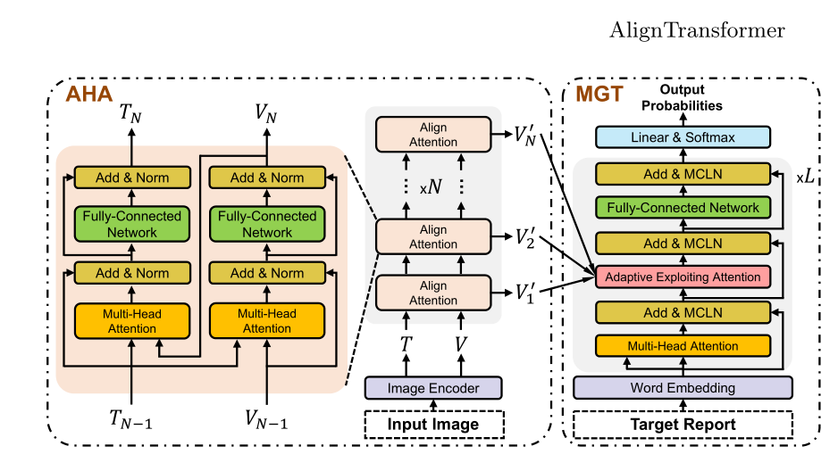

# AlignTransformer：视觉区域和疾病标签的层次对齐，用于生成医疗报告

AlignTransformer: Hierarchical Alignment of Visual Regions and Disease Tags for Medical Report Generation

论文2022 笔记2022.7.19

## 问题

1）严重的数据偏差：正常视觉区域在数据集中占主导地位，而非异常视觉区域；

2）医疗报告是非常长的序列。

## 提出方法

我们提出了一个AlignTransformer框架，该框架包括Align层次注意（AHA）和多粒度变换（MGT）模块：

1）AHA模块首先从输入图像中预测疾病标签，然后通过分层对齐视觉区域和疾病标签来学习多粒度视觉特征。获得的基于疾病的视觉特征能够更好地表示输入图像的异常区域，可以缓解数据偏差问题；

2） MGT模块有效地使用了多粒度特征和Transformer框架来生成长医疗报告。

## 模型结构

### Align Hierarchy Attention（AHA）

AHA作为编码器来提取视觉特征。为了聚焦异常区域，AHA首先从输入图像中预测疾病标签，然后将这些标签与相应的视觉区域对齐。为了适应粗粒度和细粒度视觉特征，AHA引入了层次对齐模型。具体来说，首先使用疾病标签找到最相关的视觉区域，为每个疾病标签提取基于疾病的视觉特征。然后，进一步使用提取的视觉特征查找最相关的疾病标签，并过滤出每个视觉特征的不相关疾病标签。通过在不同粒度级别执行上述过程，视觉感受野在疾病标签的指导下逐渐集中在显著的异常区域。这样，我们可以获得异常区域的特征，用于缓解数据偏差；

V是图像提取的特征，T是预测的可能性最大的10个疾病标签。首先使用疾病标签T作为Query，以查找V中最相关的视觉区域，生成v_1,再把v_1作为Query，查找T中最相关的标签，生成t_1，最后将v_1与t_1相加送给解码器。

### Multi-Grained Transformer（MGT）

这个部分整体是transformer的结构，其中AEA模块来自MeshedMemory Transformer。来自适应融合编码器的多个输出，MCLN来源于R2Gen。

