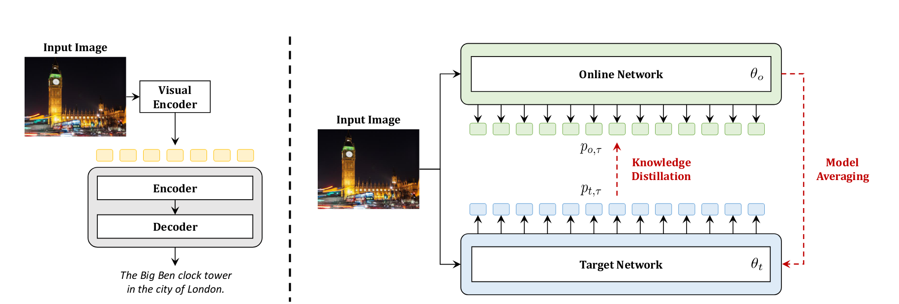
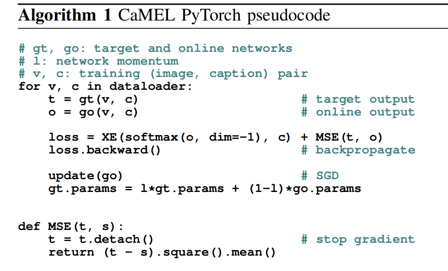

# CaMEL：图像字幕的平均教师学习

CaMEL: Mean Teacher Learning for Image Captioning

## 问题

大多数现有的图像字幕方法都是基于使用单一语言模型，经过训练以通过交叉熵损失再现真实字幕，然后在微调阶段通过 REINFORCE 算法。在本文中，我们采用了不同的路径，并研究了基于两种不同语言模型之间相互作用的训练策略的开发。

大多数字幕方法都依赖于单一语言模型，该模型以输入图像为条件，并经过训练以再现真实句子。形式上，给定图像-字幕对 D = {(vi, ti)}i 的数据集，语言模型旨在学习序列中下一个单词的概率分布。

## 方法

在 CaMEL 中，我们不是训练单一语言模型，而是依赖两种不同语言模型的相互作用——在线模型和目标语言模型，它们在训练阶段相互交互和学习。在训练时在线模型和目标语言模型之间的交互是双重的。通过 XE（交叉熵） 或 SCST（自临界序列训练） 对在线语言模型进行关于 groundtruth 字幕的训练。此外，它还使用目标语言模型进行知识蒸馏。反过来，目标语言模型根据在线模型权重的指数移动平均值更新其权重。

## 模型

