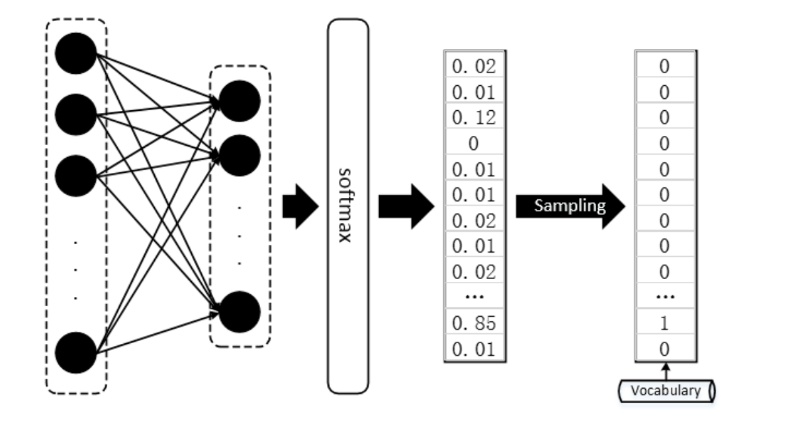
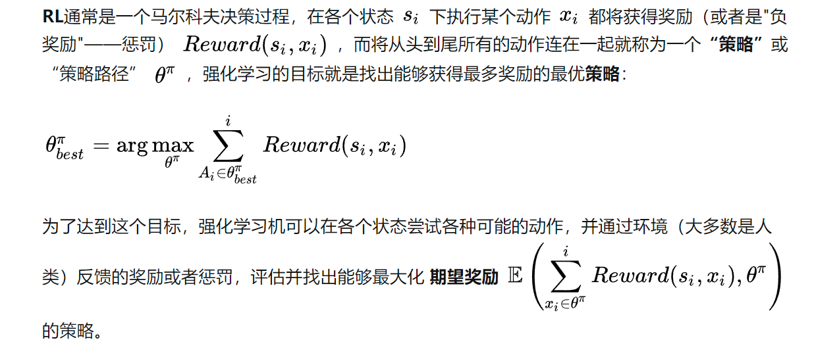
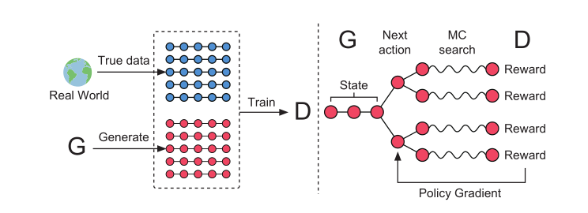

#  GAN生成文本

​																																															笔记：2022.6.28

## GAN为何不能直接用于文本生成？

GAN的作者早在原版论文时就提及，GAN只适用于连续型数据的生成，对于离散型数据效果不佳。那么我们需要先明确一个概念，什么是连续数据什么是离散数据？

举个例子来讲，图像数据是典型的连续数据，图像矩阵中的元素是可微分的，其数值直接反映出图像本身的明暗，色彩等因素。以灰度图像来说，数值0-255反应了明暗变化，并且是连续的。也就是说，从图像矩阵到图像，不需要“采样”（Sampling）。文本数据可就不一样了，，假设我们的词库（Vocabulary）大小为1000，那么每当我们预测下一个出现的词时，理应得到的是一个One-hot的Vector，这个Vector中有999项是0，只有一项是1，而这一项就代表词库中的某个词。然而，真正的隔阂在于，我们每次用无论什么分类器或者神经网络得到的直接结果，都是一个1000维的概率分布，而非正正好好是一个One-hot的Vector，即便是使用softmax作为输出，顶多也只能得到某一维上特别大，其余维上特别小的情况，而将这种输出结果过渡到One-hot vector 然后再从词库中查询出对应index的词，这样的操作被称为“Sampling”，通常，我们找出值最大的那一项设其为1，其余为0。

当前神经网络的优化方法大多数都是基于梯度的（Gradient based），很多文献这么说：GAN在面对离散型数据时，判别网络无法将梯度Back propagation（BP）给生成网络。这句话当时让我等听的云里雾里，不妨换一个角度理解，我们知道，基于梯度的优化方法大致意思是这样的，微调网络中的参数（weight），看看最终输出的结果有没有变得好一点，有没有达到最好的情形。

但是判别器**D**得到的是Sampling之后的结果，也就是说，我们经过参数微调之后，即便softmax的输出优化了一点点，比如上图的例子中，正确结果本应是第三项。但预测错误，网络进行更新，假如下一次预测其output的倒数第二项从0.85变为了0.65，第三项从 0.12变为了 0.32，但是经过Sampling之后，生成器**G**输出的结果还是跟以前一模一样，并再次将相同的答案重复输入给判别器**D**，这样判别器**D**给出的评价就会毫无意义，生成器**G**的训练也会失去方向。有人或许说那直接不Sampling，将softmax的输出直接给判别器不行吗？当然不行，判别器是判断是否是真样本，而我们的真样本是One-hot Vector。是一个只有1个1其余为0的向量。那么如果不Sampling，那岂不是只有softmax后存在唯一一个1才是真样本，其实就是根本无需判断生成分布是否与真实分布是否接近，而只需要判断分布是不是one-hot形式就可以了。

补充解释：初的 GANs 仅仅定义在实数领域，GANs 通过训练出的生成器来产生合成数据，然后在合成数据上运行判别器，判别器的输出梯度将会告诉你，如何通过略微改变合成数据而使其更加现实。一般来说只有在数据连续的情况下，你才可以略微改变合成的数据，而如果数据是离散的，则不能简单的通过改变合成数据。例如，如果你输出了一张图片，其像素值是1.0，那么接下来你可以将这个值改为1.0001。如果输出了一个单词“penguin”，那么接下来可以将penguin对应的高维向量加0.001，但可能不存在改变后对应的单词。 因为所有的自然语言处理（NLP）的基础都是离散值，如“单词”、“字母”或者“音节”。

WGAN和Gumbel-softmax在一定程度上改进了GAN在离散数据的表现，但是在生成文本上能力还是有限。

## Reinforcement Learning在GAN文本生成中所扮演的作用

## seqGAN

以文本生成为例解释一下，句子由一个一个词生成的，在t时刻

state：已经生成词y_1,y_2,...y_t-1(当前的状态)

action：选择一个y作为yt

policy：在state下如何选择yt（LSTM）

reward：在state下，选择y_t=y,有多好

强化学习是在t时间步下，我采取policy得到action，我们有很多action的可能，每个可能得到了不同的yt，而不同的yt有不同的reward。我们期望得到所有时间步得到yt的reward的加和最大。

我们以seqGAN中的决策为例解释一下他是如何用强化学习的。

在时间步t下存在很多action的可能，我选择了一个action后那么我需要计算reward，但是t时间步下我们可能还没有生成所以的句子，也就是说此时我们可能只生成了半句话，这里seqGAN直接利用蒙特卡洛搜索（MC Search）搜索得到整个句子。每个搜索得到的句子就可以送给D去计算reward。

那么实际上我在t下有很多的action，我现在这个action的概率p，在这个action下得到的reward是R，我们的目标是想要PR的乘积最大。

通过强化学习，将梯度优化的重心就转化到了生成对话的概率上来。奖励会使模型趋于将优质对话的出现概率提高，而惩罚则会让模型趋于将劣质对话的出现概率降低。

seqGAN的训练步骤：

1. 预训练G与D
2. 开始进行对抗训练，首先训练一轮Generator。首先利用当前的Generator生成batch_size大小数据，然后利用rollout网络（rollout网络其实可以看作另一个生成器）进行MC search并采样句子喂给Discriminator进行评价返回rewards，最后根据rewards更新Generator参数。细致一点，当我们生成到第t个词后利用MC搜索出后续的n条路径喂给Discriminator，并将反馈的rewards取平均。

3. 更新rollout参数
4. 训练n轮Discriminator，采用更新后的Generator生成一些新的负样本对Discriminator训练n轮

2、3、4步需要迭代多轮，这样便完成了seqGAN的训练。