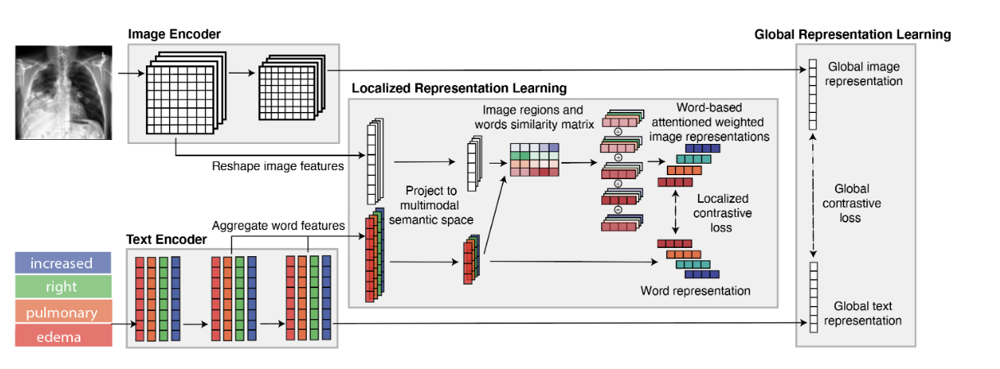
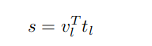
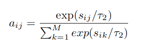
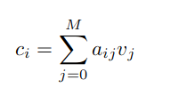

# GLoRIA：用于标签高效医学图像识别的多模态全局-局部表示学习框架

ICCV 2021      2022.10.12

## 方法

一个使用注意力机制通过对比图像子区域和配对报告中的单词来学习图像全局-局部表示的框架。我们不依赖于预训练的对象检测器，而是学习注意力权重，强调特定单词的重要图像子区域，以创建上下文感知的局部图像表示。

图像经过resnet50生成的B×C作为全局特征，其中间状态如B×C×7×7作为局部特征。

文字经过编码生成B×K×d作为局部表示，编码相加作为全局表示。

在多模态在多模态特征空间中，配对的图像和报告有望具有相似的语义信息。因此，第一个学习目标是通过使用全局表示来最大化图像和文本的真实对与随机对之间的对齐。特征空间中，配对的图像和报告有望具有相似的语义信息。因此，第一个学习目标是通过使用全局表示来最大化图像和文本的真实对与随机对之间的对齐。

虽然全局对比损失限制了整个图像和文本之间的对齐，但仅依靠全局表示可能会限制医学图像识别。我们学习了基于不同图像子区域对给定单词重要性的权重的注意力。通过将注意力加权图像表示与相应的词嵌入进行对比，注意力权重作为我们局部表示目标的一部分被学习。

为了学习上一节介绍的注意力权重，我们需要一个本地化的目标进行训练。在这里，我们建立了一个学习局部化多模态表征的对比目标。具体来说，我们使用一个局部特征匹配函数Z来聚合所有W词特征ti和它们相应的注意力加权图像特征ci之间的相似性。

其实过程上就是先计算相似性矩阵，得到一张图片中各个部分与单词A对相似性系数，相乘后得到注意力图像，因为图像有B×C×49,将这49个部分相加，得到单词A所对应对图像。局部损失就是这样对比的。

