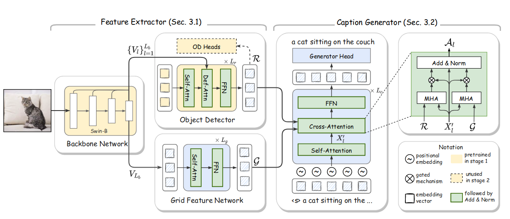
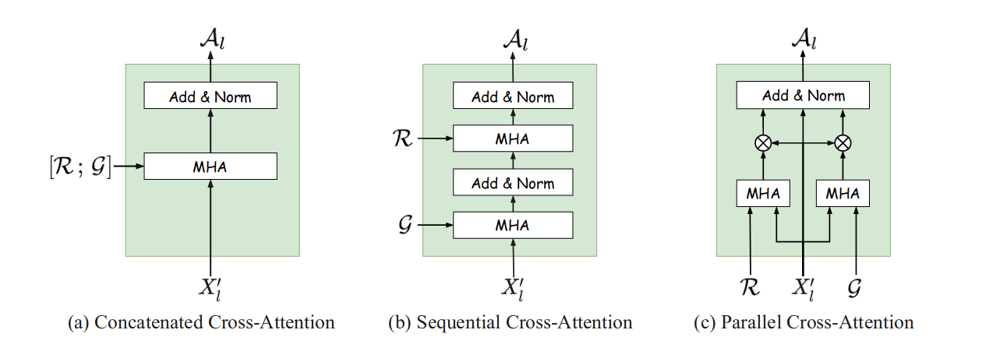

# GRIT：使用双重视觉特征的更快更好的图像字幕转换器

GRIT: Faster and Better Image captioning Transformer Using Dual Visual Features

## 问题 

当前最先进的图像字幕方法采用基于区域的特征，因为它们提供了描述图像内容所必需的对象级信息；它们通常由对象检测器（例如 Faster R-CNN）提取。但是，它们存在一些问题，例如缺乏上下文信息、检测不准确的风险以及高计算成本。前两个可以通过额外使用基于网格的特征来解决。然而，如何提取和融合这两种类型的特征是未知的。

## 方法

本文提出了一种仅限 Transformer 的神经架构，称为 GRIT（基于网格和区域的图像字幕转换器），它有效地利用了这两种视觉特征来生成更好的字幕。

## 模型

特征提取：采用Swin Transformer作为特征提取的基础backbone 。目标检测器选择Deformable DETR。（除了这个目标检测器性能好外，还有就是不经过NMS，方便与端到端训练）对象检测器接收两个输入：主干生成的多尺度特征图，以及 N 个可学习对象查询 R0 。Grid Feature Network：该网络从 Swin Transformer 主干接收最后一个多尺度特征图后通过多层自注意力网络。

Caption Generation：字幕生成器接收两种类型的视觉特征，区域特征 R ∈ RN×d 和网格特征 G ∈ RM×d 作为输入。

交叉注意子层：经过对三种不同的交叉注意力层的实验选择C（平行交叉注意）作为其基础结构。

