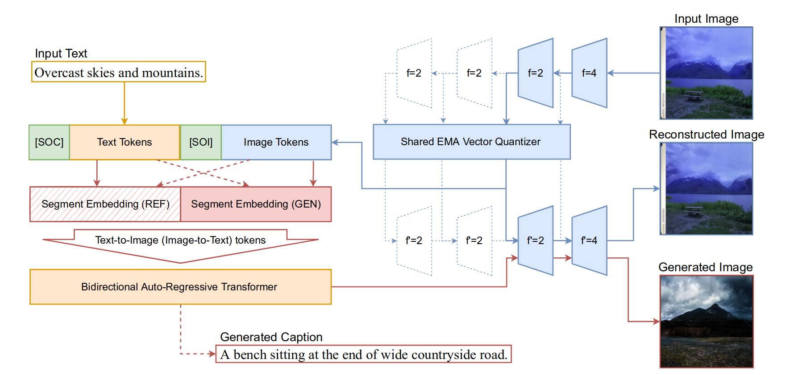

# L-Verse：图像和文本之间的双向生成

L-Verse: Bidirectional Generation Between Image and Text

CVPR2022

## 方法

为了更好地利用图像和文本之间的相关性，我们提出了 L-Verse，这是一种新颖的架构，由用于图像到文本和文本到图像的特征增强变分自动编码器 (AugVAE) 和双向自回归转换器 (BiART) 组成

## 模型

特征增强变分自动编码器

图像经过编码器得到不同下采样的特征层：(64 × 64 × 256, 32 × 32 × 256, 16 × 16 × 256, and 8 × 8 × 256)。这四个张量使用codebook(8192) 对每个潜在映射进行量化。注意，在这里存在4个共享权值的codebook。这分别对应了4种下采样的特征层。这里感觉就像目标检测中分层检测目标但detect层权值也是共享的。

双向自回归变压器

学习如何区分图像→文本序列和文本→图像序列。我们只是告诉我们的双向自回归转换器（BiART）给定的文本（或图像）是条件引用（[REF]）还是生成目标（[GEN]）。

对于训练，我们在每次迭代中交替输入文本→图像或图像→文本顺序。在每次迭代中，BiART 优化两个负对数似然 (NLL) 损失：(i) 用于索引为 [REF] 的条件参考 y 和 (ii) 用于索引为 [GEN] 的生成目标 x。当收敛时，BiART 执行图像到文本（图 2 中的虚线红线）和文本到图像（图 2 中连接的红线）生成，无需任何微调。