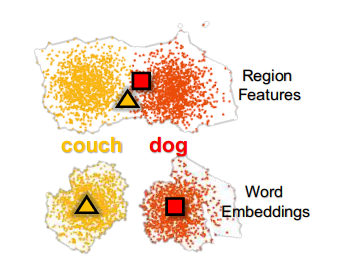
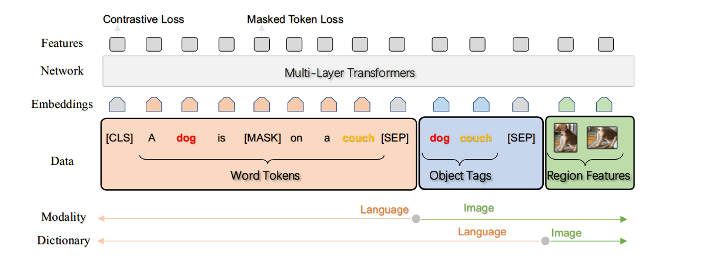
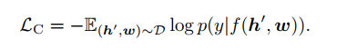

# Oscar：视觉语言任务的对象语义对齐预训练

Oscar: Object-Semantics Aligned Pre-training for Vision-Language Tasks

ECCV 2020

## 问题

结合目标检测对提取，现有方法只是简单地将图像区域特征和文本特征连接起来作为模型的输入进行预训练，并使用 selfattention 以蛮力的方式学习图像-文本语义对齐。另外还有如下问题：

(i) 模糊性。视觉区域特征通常是通过 Faster R-CNN 对象检测器从过采样区域 中提取的，这不可避免地导致不同位置的图像区域之间存在重叠。这为提取的视觉嵌入带来了歧义。

(ii) 缺乏grounding。 VLP （图像语言预训练任务）是一个弱监督学习问题，因为图像中的区域或对象与文本中的单词或短语之间没有明确标记的对齐方式。然而，我们可以看到像狗和沙发这样的对象在图像及其配对文本中都出现，

## 方法

但在本文中，我们提出了一种新的学习方法 Oscar，使用在图像中检测到的对象标签作为锚点，以显着简化对齐的学习。我们的方法的动机是观察到图像中的对象可以被准确地检测到，并且经常在配对文本中被提及。

其实就是在图像对编码空间，两个目标对距离可能很近，比较难区分，但文字不同，经过预训练的语言模型很容易将两个单词在编码空间中分开。

## 模型

我们将训练样本定义为三元组(w, q, v)，每个元组由一个文本序列w、一组对象标签q和一组图像区域特征v组成。我们的方法的动机是观察到图像中的对象可以被目标检测器准确检测 ，并且这些对象经常在配对文本中被提及。

经过预训练模型的对齐作用，对象标签的图像区域与文本中的语义相关词查询时，注意力权重高于其他区域。

目标检测器提取的图像区域与这个区域对坐标表示结合起来作为输入v。

q是标签的词嵌入序列，w是文字序列编码。

这种三元组对输入可以从两种角度去看：

 Dictionary View：将H=[wq]看作一个整体，同属于文字模态。并且在预训练的时候沿用了BERT的Masked Token Loss，随机Mask掉15%的 H 中的tokens，要求模型根据 H 中剩余的tokens以及所有的image tokens来predict被mask的tokens。

Modality View：将H=[qv]看作一个整体，同属于视觉模态。在预训练的时候50%的几率用随机的tags替换掉object tags构造负样本对。以此使用对比学习。利用encoder的[cls]经过一层FC layer来判断这个三元组是否为对应的三元组。

总loss就是两者之和。

