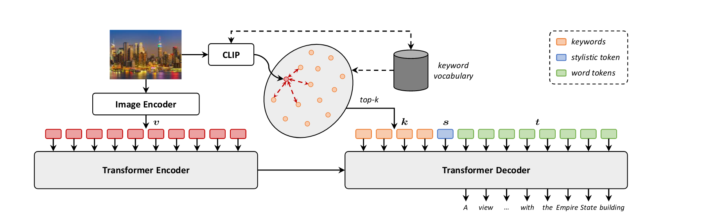

# Universal Captioner：通过内容风格分离的长尾视觉和语言模型训练

Universal Captioner: Long-Tail Vision-and-Language Model Training through Content-Style Separation

## 问题

虽然字幕模型在描述自然图像方面取得了令人信服的结果，但它们仍然没有涵盖现实世界概念的整个长尾分布。

## 方法

我们提出了一个模型，该模型可以利用嘈杂的图像-字幕对，同时保持传统人工注释数据集（如 COCO）的描述风格。我们的模型通过使用关键字和风格标记将内容与风格分开，采用即时语言建模的单一目标，并且比其他最近的提议更简单。

## 模型

给定图像字幕对 D = {(vi, ti)}i 的数据集，分为两个子集 Dm 和 Dh，分别包含机器收集和人类收集的对。无论输入图像的内容如何，模型都应该能够转移训练期间看到的描述性风格。在 Dm 和 Dh 在语义内容（例如物体和场景）方面也不同的情况下，模型还必须转移语义词以正确描述 Dm 中具有 Dh 风格的图像，反之亦然。

首先，我们提取文本关键词，它可以以文本形式表示图像的内容，而不管其相关标题的描述风格如何；然后，我们使用风格标记来调节具有不同描述风格的语言模型。

1）关键词提取：提取视觉输入的浓缩文本表示旨在促进视觉和文本特征之间的客观转移。为了提取关键字，我们利用在大规模数据上训练的多模态检索方法 CLIP。给定一个可能的关键字字典 Q，图像 v 的关键字集合是根据检索模型本身定义的匹配函数，通过选择 Q 中与 v 相似度最高的 k 个元素获得的。（为了确保对 D 的语义分布有足够的语义覆盖，Q 必须足够大。在我们的案例中，我们使用在 OpenWebText 语料库中找到的所有 unigram 集构建 Q）

2）风格提取：我们让语言模型充分了解每个训练标题所属的描述风格。除了文本关键字，给定一个（图像，标题）对，我们还提取了一个风格标记 s，它指示 t 是属于 Dh 还是 Dm 的描述性风格。这是通过可学习的标记嵌入来实现的，它可以连接到关键字的表示。

整个模型如图所示，图像输入编码器，生成解码器输入。图像输入CLIP提取关键词K；提取风格特征S；掩码t；（S是如何提取貌似就是像bert一样给了一个空白嵌入，随训练学习风格信息）