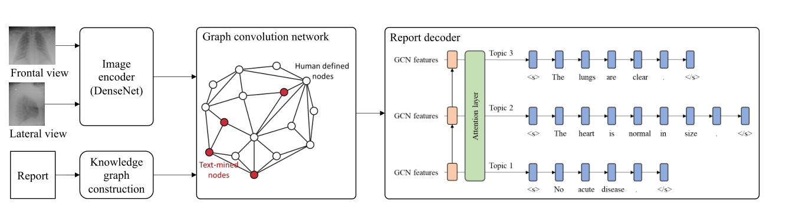

# 先验知识增强了放射报告的生成

Prior Knowledge Enhances Radiology Report Generation

论文：AMIA2022   笔记：2022.7.18

## 问题

深度学习方法往往忽视了医学发现之间的相互影响，这可能是限制生成报告质量的瓶颈。

## 提出方法

在信息丰富的知识图中挖掘和表示医学发现之间的关联，并将此先验知识与放射报告生成相结合，以帮助提高生成报告的质量。

1） 我们在图中对先验知识进行文本挖掘和建模；

2） 我们将先验知识与基于图的知识推理相结合，以增强报告生成；

## 模型

为了训练模型，我们采用了现有的两步程序，多标签分类，然后生成报告。

模型模拟放射科医生的阅读程序，首先在他们阅读医学图像时观察多个发现，然后编辑放射学报告。我们首先以数据驱动的方式构建先验知识图（即医学发现之间的关系）。图像被馈送到图像编码器以提取视觉特征，然后将其传递到基于知识图的图卷积网络。然后，该网络基于先验知识图传播放射学概念之间的语义相关性，从而将领域知识注入概念表示学习。然后，我们连接正侧视图的节点特征并训练报告解码器。

### 先验知识图构造

知识图中的节点是放射学概念（例如疾病或身体部位），边缘是概念之间的语义关联。知识图由两部分组成。第一部分由领域专家手动定义。第二部分包括以数据驱动方式从放射学报告中挖掘的补充概念及其相关性。