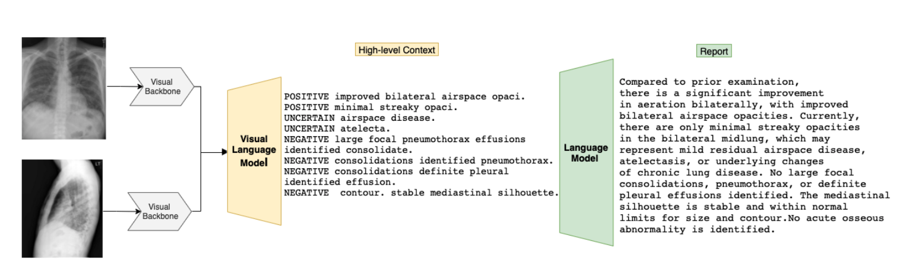

# 基于Transformer的渐进式放射报告生成

Progressive Transformer-Based Generation of Radiology Reports

论文：EMNLP2021 笔记：2022.7.4

## 问题

之前研究大多图像直接报告。这里提出渐进式。

## 提出方法

提出了一个连续（即图像到文本到文本）生成框架，其中我们将放射报告生成问题分为两个步骤。与立即从图像生成完整的放射学报告相反，该模型在第一步从图像生成全局概念，然后使用transformer架构将其转换为更精细和连贯的文本。

## 模型结构

与一次从图像生成完整的放射学报告相反，论文将放射报告生成问题分为两个步骤。在第一步中，该模型从图像生成全局概念，然后使用transformer架构将其转换为更精细和连贯的文本。每个步骤都遵循基于transformer的序列到序列范例。

框架可以分为三个主要部分视觉主干（Densenet）、作为视觉语言模型的中间编码器（ViLM）、作为语言模型的最终编码器-解码器（LM）。视觉主干就是CNN没有什么特殊的。

### 中间编码器ViLM

中间编码器是由MeshedMemory Transformer组成的。MeshedMemory Transformer提出了利用模型性能的两个调整：内存增强编码器和网状解码器。MeshedMemory Transformer还不懂，后面了解之后再做笔记。

### LM

第三个组件也基于transformer作为序列到序列模型，使用BART作为预训练的语言模型，并对我们的目标域进行微调。

## 训练

首先为训练数据集中的每个报告提取高级上下文C，为此，我们采用了MIRQI工具。然后，我们为每个阶段构建独立的训练数据，即ViLM和LM的微调。更具体地说，给定训练对（I，C），我们对ViLM进行微调。另一方面，通过在LM阶段使用训练对（C，R）对BART进行微调。在微调了ViLM和LM之后，该模型首先生成中间上下文，然后通过在最后阶段添加更细粒度的细节来生成完整的放射学报告。