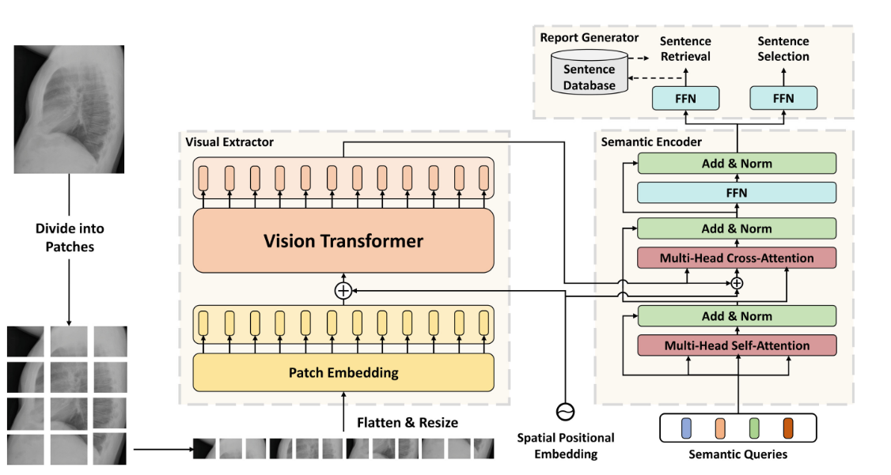

# 基于Transformer的语义查询式报告生成

TranSQ: Transformer-Based Semantic Query for Medical Report Generation

论文：MICCAI 2022          笔记：2022.9.25

## 问题

医学报告是一种高度模式化的语句集合。每个句子对应特定类型的疾病的表述。

## 提出方法

可以根据特定的图像语义特征找出对应的模式化语句描述。将报告生成建模成集预测问题。模型生成一组语义特征来匹配可能的临床问题，并通过句子检索和选择来撰写报告。

## 模型

### Visual Extractor

图像被VIT编码成序列特征。

### Semantic Encoder

给定提取的视觉特征，我们用一组 K 个语义查询 q =[q1,...,qK] 观察图像的有价值的区域或特征，其中每个查询 qi 对应于一个潜在的主题定义。 请注意，由于语义查询是排列不变的因此输出的差异来自于语义查询嵌入的值，该值是通过训练过程获得的。

### Report Generator

报告生成器模块完成两个任务：生成候选句子和预测句子选择的概率。 在这项工作中，候选句子是由检索策略生成的。 对于每个语义特征 ，通过前馈网络将其转换为句子嵌入，并在数据库中检索以生成候选句子。 句子选择是通过一个多标签分类器来实现的。

### 损失函数

他通过匈牙利算法进行二分匹配，将生成的语义