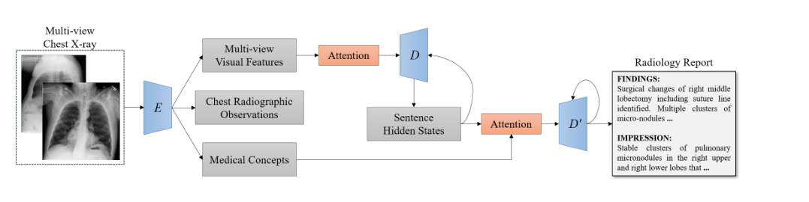
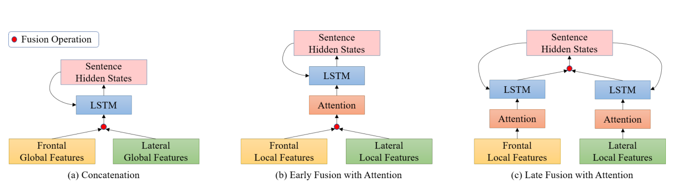
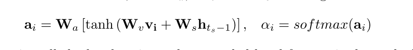

# 基于多视图图像融合和医学概念丰富的放射报告自动生成

Automatic Radiology Report Generation based on Multi-view Image Fusion and Medical Concept Enrichment

​																																						论文：2019.7 笔记：2022.6.27

## 问题

问题一：生成报告在理解医学内容并与自然语言描述联系起仍然具有挑战性

问题二：相应的数据集的数据规模仍然非常有限。

## 提出方法

1. 提出了一种生成式编码器-解码器模型
2. 大量的胸部x射线图像对编码器进行预训练解决问题二
3. 通过加强交叉视图一致性来利用多视图图像。

## 模型结构

### 编码器

将一名患者的正面和侧面图像视为一个输入对输入编码，编码器使用Resnet-152作为主干，提取视觉特征。

Chest Radiographic Observations 是指通过大型类似数据集进行多标签分类的预训练。Visual Features作为实际训练过程中提取的视觉信息，Medical Concepts 是通过单独的网络层提取的Tag信息

## 解码器

解码器采用两层解码，一层Sentence LSTM 和一层Word LSTM。

多视图融合，文章中使用了两种不同视图进行信息提取，得到的不同特征图。我的理解是这里并没有将两种图化为不同通道进行合并，而是分别输入特征提取网络得到不同的特征图。为了保证特征一致性，文中采用了一种MSE损失来优化网络得到同样含义的特征图（同一个人特征应当具有统一性。）

文章中讨论了对不同视图如何进行特征融合，给予了3种方案。

a：得到特征图直接融合  

b：将两种特征经过注意力机制筛选融合，得到输出给LSTM作为输入x

c：将两种特征分别经过注意力机制输出分别给不同LSTM作为输入x，并将得到的h进行融合。

计算注意力时也会用到LSTM输出的h_t-1，这里视图中的LSTM其实是多层的，他的每一层的输入都是h_t-1与视觉特征v的注意力机制的结果。c的不同在于是将LSTM生成的h进行融合再分别返回与单个视图进行注意力。

# 结果

论文的实验结果表明，多视图融合后期注意力的方式即C方案效果更好。并且融入tag的这种思路带来更好的效果。
