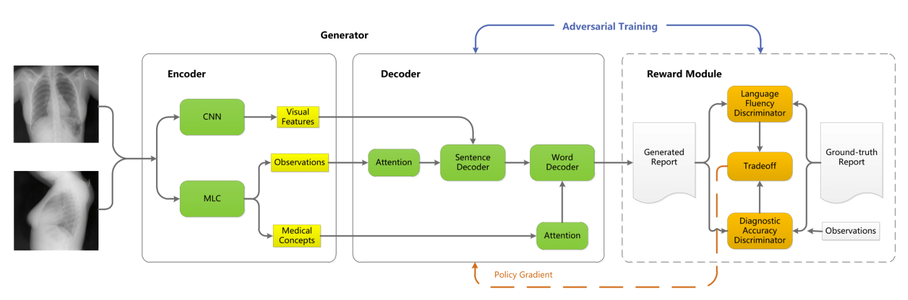

# 基于对抗强化学习的胸部X线图像自动报告生成

Automatic Report Generation for Chest X-Ray Images via Adversarial Reinforcement Learning

​																																						论文：2021.1 笔记：2022.6.26

## 问题

1. 以往的医疗报告生成模型大多是通过最小化交叉熵损失或常见的图像字幕指标训练，忽略诊断准确性。
2. 输出离散时梯度无法传递回生成模型的问题

## 提出方法

利用生成对抗，准确度鉴别器（AD）和流利度鉴别器（FD）充当判别器。解决问题1。

将AD与FD加权得分被视为一种“奖励”，用于通过强化学习对报告生成器进行培训，解决问题2。

模型：生成器采用多类型医学概念融合编码器和层次解码器。

多视图简单融合

中间语义tag与注意力机制

多层LSTM机制

## 自然图像字幕与医学报告生成

（1）与自然图像相比，胸部x光涉及复杂而抽象的医学概念，如图1所示的“肺不张”和“心脏肿大”，普通编码器难以捕捉；

（2） 自然图像标题大多只有一句话，而搜索结果包含四句、五句甚至更多的句子，因此基本解码器可能很难了解这种长期依赖关系；

（3）对于医疗报告的生成，应将诊断准确性放在首位，而不是盲目追求高文本相关性分数（如BLEU分数）。

## 模型结构

### 编码器

#### MLC分支

On the Automatic Generation of Medical Imaging Reports这篇论文中介绍了这个思路。

在医学报告中存在多个部分，Findings表示了图的一些事实表现。impression是对Findings的总结。本论文的最终任务是生成Findings。在医学领域存在一些特定词汇，如医学主题词表（MeSH），MeSH》汇集约18,000多个医学词。利用特定词对Findings进行信息提取，提取的标签可以当作多标签分类任务的标签，这种提取的信息也是一种中间语义信息被整个网络利用。

MLC分支是基于VGG-16的小型多任务网络，完成多标签分类任务。并且多标签任务有2个，这两个任务使用不同的分类层共享相同的主干。给定图像张量I，MLC网络输出14维向量。利用BCE训练。预测给定图像的常见观察结果和其他医学概念。这些预测的医学标签被嵌入到向量中，然后插入到解码器中。

在本论文中，作者基于这一问题：MLC任务比文本生成更容易学习；共享网络倾向于学习优先级较高的前一个任务，损失较低，而后一个任务的性能较差。因此，该编码器选择了两个独立的CNN分支，即CNN主干和MLC分支，分别用于提取视觉和语义特征。不再采用共享网络的做法。

#### CNN分支

同一患者可能存在一个或多个代表不同视图的放射学图像。本论文采取了一种多视图融合的思想。不同的视图被视为不同的输入通道，并且假设深度CNN可以学习如何在训练期间执行有效的特征融合。不同的视图组合输入这样完成融合。

提取图像使用的resnet152网络。给定一组正面和侧面放射学图像，将其调整大小并打包成一个形状为224×224×2的三维（3D）张量I，这意味着每个通道代表一个特定视图。然后，将输入张量输入到所提出的CNN主干中，并最终编码为1024维视觉向量v。

### 解码器

#### attention

左边Atten：在图里可以看出，最开始左边注意力有3个输入，S、I、h。h这里指的是LSTM的的隐层输出h，他的初始值是CNN输出的视觉特征向量，即Visual feature。I是指MLC输出的observation的可能性，他是一组可能性向量，也就是图中的probablilities。S是指的observation embedings，他是已知的字典。计算公式如下

结果是S_att,我们先计算了系数α，系数与S相乘得到注意力输出。

#### Sentence LSTM Word LSTM

Sentence LSTM 这里采用了多层LSTM的结构，有两个输入，一个是注意力输出，一个是视觉信息向量。Word LSTM与Sentence LSTM类似，不过它还包含了前面输出的word词向量。

为什么分这两种LSTM？

思想可能参考论文On the Automatic Generation of Medical Imaging Reports。认为影像报告中的描述通常很长，包含多个句子。生成如此长的文本非常重要。单层LSTM对长单词序列的建模能力较差，我们利用了报告的组成性质，并采用两种LSTM来生成长文本。Sentence LSTM结合共同注意机制，首先生成高级主题 topic，然后根据主题Word LSTM生成细粒度描述。

### 对抗

参考的是seqGAN的思路，可以见笔记GAN生成文本。

这里对抗思想的训练步骤如下：

1. 使用word2vec对embedding预训练。

2. 对MLC预训练

3. 固定MLC，对编码器解码器进行预训练

4. 对判别器进行预训练

5. 对抗训练：

   

