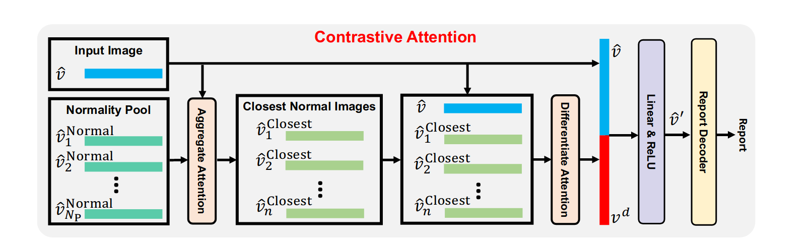

# 基于对比注意自动胸部 X 射线报告生成

Contrastive Attention for Automatic Chest X-ray Report Generation

## 问题

大多数情况下，正常区域支配着整个胸部 X 线图像，而这些正常区域的相应描述支配着最终报告。由于这种数据偏差，基于学习的模型可能无法关注异常区域。

## 方法

为了有效地捕获和描述异常区域，我们提出了对比注意 (CA) 模型。 CA 模型不是只关注当前输入图像，而是将当前输入图像与正常图像进行比较以提取对比信息。获得的对比信息可以更好地表示异常区域的视觉特征。

## 模型

1）我们首先构建一组正常图像，这些图像都是从训练数据集中提取的； 

2）我们引入Aggregate Attention来优先考虑与当前输入图像更接近的正常图像，并过滤掉看起来不同的正常图像； 

3）我们进一步引入了Differential Attention来提炼输入图像和精炼后的正常图像之间的共同特征。然后，从输入图像的视觉特征中减去获得的共同特征。以这种方式，输入图像的剩余视觉特征被视为捕获输入图像和正常图像之间的区分特性的对比信息。

先从数据集中提取P个正常图像，与输入图像进行Aggregate Attention，Aggregate Attention作用是排除一些噪声图像与一些视角有明显差异对图像，以防对Contrastive Attention造成负面影响。Aggregate Attention其实就是一个transformer中对点积注意力。注意这里V上全局视觉信息，所以进行完一次注意力只有1个V_closest,所以这里使用n个Aggregate Attention来生成n个V_closes。

Differentiate Attention来提取公共特征，具体做法上将V与得到的n个V_closes连接后进行自注意力计算，得到结果再全局平均池化，得到共同信息V_c。再用V-V_c得到差异信息V_d。

最后将V_d与初始V连接送入全连接层得到经过注意力的新V',所有对视觉信息与V_d连接送入全连接层得到V'_i.

得到对比之后的信息送入普通的一个Decoder就可以了。

