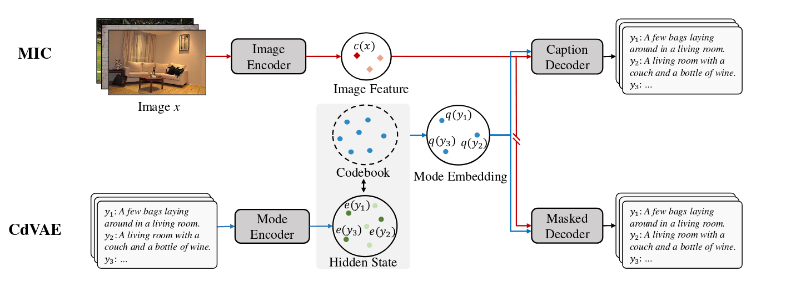
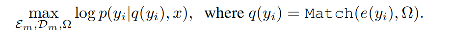
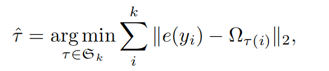

# 学习图像字幕的独特和代表性模式

Learning Distinct and Representative Modes for Image Captioning

## 问题

现有一些方法生成的字幕往往偏向于仅捕获训练语料库中最一般模式（即语言模式）的“平均”字幕，即所谓的模式崩溃问题。受其影响，生成的字幕在多样性上受到限制，并且通常比人类制作的自然图像描述信息量少。

## 方法

在本文中，我们试图通过提出用于图像字幕的离散模式学习 (DML) 范式来避免这个问题。我们的创新想法是探索训练字幕语料库中的丰富模式，以学习一组“模式嵌入”，并进一步使用它们来控制现有图像字幕模型生成字幕的模式。具体来说，所提出的 DML 优化了由图像条件离散变分自动编码器 (CdVAE) 分支和模式条件图像字幕 (MIC) 分支组成的双重架构。 CdVAE 分支将每个图像标题映射到存储在学习码本中的模式嵌入之一，并使用纯非自回归生成目标进行训练，以使模式具有独特性和代表性。 MIC 分支可以简单地从现有的图像字幕模型修改，其中模式嵌入作为控制信号添加到原始词嵌入中。

## 模型

我们的 DML 从嵌入矩阵 Ω ∈ Rk×d 中采样潜在变量，我们称之为码本（code book）。它定义了一个离散的潜在空间，其中 Ω 中的每个条目对应于一个潜在的模式嵌入，k 是一个超参数，表示码本中的模式总数。

CdVAE 分支：包含一个模式编码器 Em 和一个掩码解码器 Dm。

在训练期间，模式编码器 Em 用于提取每个字幕 yi 的表示，用 e(yi) 表示，并将表示与 Ω 中的条目之一进行匹配。然后将匹配的条目作为 yi 的模式嵌入，记为 q(yi)。我们将字幕的模式分配视为二分图匹配问题，并使用匈牙利算法解决它。具体来说，对于所有与图像配对的参考字幕 ，我们在来自 Em 的输出隐藏状态 e(yi) 和 Ω 中的模式嵌入之间构建二分图。我们首先用 ∅ 填充 {ei}到码本 k 的大小（假设 n < k）。然后，我们搜索具有最低分配成本的 k 个元素 τ ∈ Sk 的排列

使用一般的图像字幕的解码方式会使得解码器在重构yi时忽略模式嵌入，所以对 DML 的 CdVAE 分支使用完全非自回归 (NAT) 目标，以促进模式嵌入的训练。具体来说，掩码解码器 Dm 是 N个Transformer解码器层的堆栈，它以 q(yi)、x 和一系列 T [MASK] token作为输入，并以条件独立的方式预测 yi 中的每个目标token。

MIC：由图像编码器 Ec 和字幕解码器 Dc 组成。标准的基于编码器-解码器的图像字幕模型中，编码器 Ec 将来自图像 x 的信息编码为一系列隐藏状态，然后解码器 Dc 处理编码器隐藏状态并预测参考标题 yi。 

在推理过程中，CdVAE 分支被删除，MIC 的推理遵循与原始图像字幕模型非常相似的过程。唯一的区别是它需要从码本中选择一种模式嵌入并将其添加到输入令牌嵌入中。