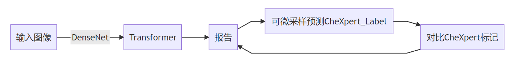

# 学习生成临床一致的胸部X光报告

Learning to Generate Clinically Coherent Chest X-Ray Reports

论文：EMNLP-2020 笔记：2022.7.5

## 问题

典型的抽象方法往往会产生流畅但临床上不正确的放射学报告。

通常用于评估图像字幕系统的语言生成指标无法直接评估生成报告的描述准确性，而准确性在医学领域十分关键。

## 提出方法

（1）我们将transformer模型应用于放射报告生成，并证明其优于竞争基线，这可以通过语言生成指标和生成报告的临床一致性来衡量。（2） 我们开发了一个程序，从生成的报告中以可微的方式提取临床信息，并利用这种可微性来训练我们的报告生成模型，以生成更具临床连贯性的报告。

## 模型结构

论文开发了一个由两个阶段组成的端到端报告生成框架。第一阶段是使用标准语言目标训练的报告生成模型。在第二阶段，从模型中对一份报告进行差异采样，并从该报告中提取临床观察结果。

视觉提取使用DenseNet-121模型，得到的图像特征嵌入位置编码送入编码器，解码器配置就是普通transformer中的一样。

第一个阶段就是普通的生成报告

第二个阶段是微调，在生成报告的基础上，经过chexpert网络提取分类判断一致性，对模型进行微调。

这里的DenseNet并不进行训练，直接用预训练权重提取特征（不能理解）

训练完得到的报告并没有实际转换成文本，而是一个预测的概率分布。得到概率分布后进行第二步微调。原始的chexpert采用的是提取关键词，在这里其实是构建1个LSTM网络进行分类，将其分类到预测的14个多标签上，然后根据损失调整模型。

但是这里输入是概率分布，他是一个离散的采样，不可导，这里利用Gumbel-Softmax trick使其可导进行训练优化。

这里不可导的原因一开始也比较疑惑，其实是和GAN中离散不可导一样的。也可参考下面描述：

通常在强化学习中，如果动作空间是离散的，比如上、下、左、右四个动作，通常的做法是网络输出一个四维的one-hot向量(不考虑空动作)，分别代表四个动作。比如[1,0,0,0]代表上，[0,1,0,0]代表下等等。而具体取哪个动作呢，就根据输出的每个维度的大小，选择值最大的作为输出动作,即argmax()......

[Gumbel-Softmax Trick和Gumbel分布 - initial_h - 博客园 (cnblogs.com)](https://www.cnblogs.com/initial-h/p/9468974.html)

