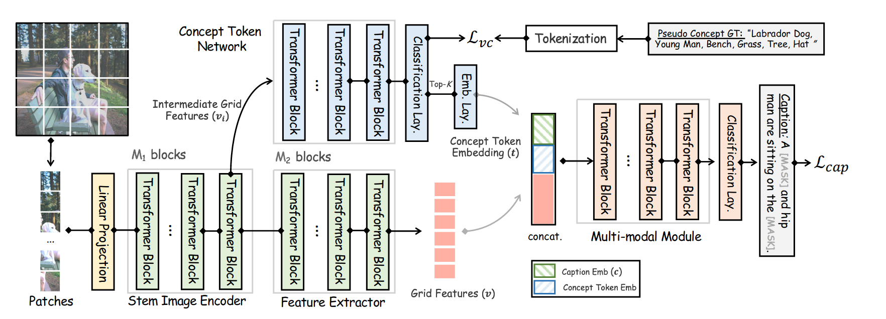

# 将语义概念注入端到端图像字幕

Injecting Semantic Concepts into End-to-End Image Captioning

CVPR2022

## 问题

最近的视觉语言研究正在转向无检测器的趋势，利用网格表示进行更灵活的模型训练和更快的推理速度。

## 方法

在本文中，我们关注性能更好的无检测器图像描述模型，并提出了一种基于纯视觉变换器的图像描述模型，称为 ViTCAP，其中使用网格表示而不提取区域特征。

## 模型

原始图像首先被送入图像编码器以生成中间表示 (vi) 和最终的网格表示 (v)。然后，CTN 分支将 vi 作为输入并预测概念标记 (t)，然后是允许跨模态交互并生成标题 (c) 的多模态模块。我们在所有模块中都采用了 Transformer 框架，但图像编码器和 CTN 模块不是特定于架构的。

概念令牌网络 (CTN) ：用于处理中间特征 vi。对应于 [CLS] 的输出表示用于预测具有多线性感知 (MLP) 网络的概念标记。概念标记的词汇与用于字幕的词汇相同。值得注意的是，我们在令牌级别而不是标签级别预测概念，因此多模态解码模块可以直接使用前 K 个（在我们的实验中为 K = 50）令牌进行自回归解码.CTN的目标是预测多个概念。目标标签可由字幕提取，其实转化是一个多分类问题。这里损失采用asymmetric focal loss。

多模态融合模块：Top-K 概念标记的索引通过嵌入层 lc 映射到标记嵌入。然后，该模块将概念标记嵌入 (t) 和网格表示 (v) 的串联作为输入以生成描述。这里不是全部字幕预测，而是15%的mask进行预测的。

在我们的训练中，我们尝试应用一个经过训练的基于检测器的字幕模型作为教师，即 VinVL ，以协助 ViTCAP 的训练。请注意，Teacher 模型是一个两阶段的 VL 模型，采用来自检测器的区域特征和对象标签，产生与 ViTCAP 不同的视觉特征，因此像注意力图损失和隐藏状态损失这样的蒸馏目标并不直接适用。我们对学生（Pθ）和教师（Pθt）模型的预测之间的掩码令牌概率采用分类蒸馏损失。

