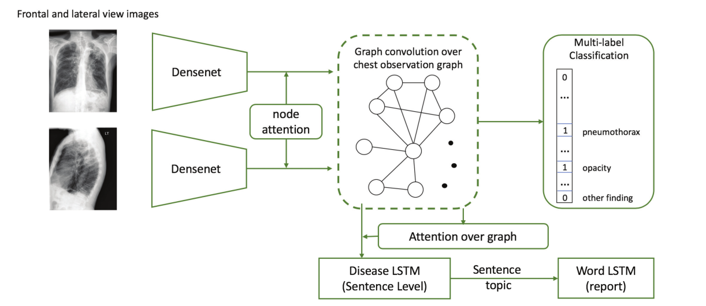
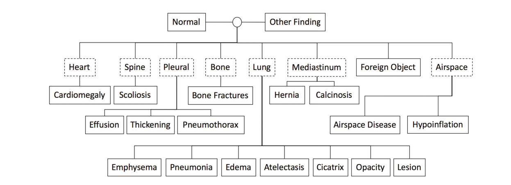

# 当放射报告生成遇到知识图

When Radiology Report Generation Meets Knowledge Graph

论文:AAAI2020  笔记:2022.7.6

## 问题

1）与自然图像字幕中每一个词的同等重要性相比，积极的疾病关键词提及的准确性在放射学图像报告中至关重要；

2）报告质量的评估应更注重疾病关键词及其相关属性的匹配，而不是计算N-gram的出现次数。

## 提出方法

利用预先构建的图嵌入模块（用图卷积神经网络建模），对多种疾病的发现进行辅助生成报告。知识图谱的纳入允许对每个疾病发现和它们之间的关系建模进行专门的特征学习。

## 模型结构

在CheXpert上预训练的DenseNet-121被采纳为网络的主干。对于这两项任务，正面和侧面的图像被输入到主干CNN模型中，然后它们的特征通过注意力机制被送入图嵌入模块。之后，两个视图的图形特征被串联起来。然后，该框架分支为一个多标签分类器和一个报告生成解码器。分类分支首先被训练，并在报告生成解码器的训练中保持固定。

## 这里图模型的理解

这里构建了这样一个图结构。图神经网络输入有两个，一个输入维度为 N × F⁰ 的特征矩阵 X，其中 N 是图网络中的节点数而 F⁰ 是每个节点的输入特征数。一个图结构的维度为 N × N 的矩阵表征，表示连接关系，也就是邻接矩阵A。图像经过CNN提取特征通过注意力得到X的初始化参数。A是图的连接关系，就是上图的表征。经过图卷积模型之后。

X的初始化参数：在DenseNet-121中的第四个基本块之后，我们在输出激活时采用了空间注意力模块。注意力图计算使用卷积层实现，卷积层的滤波器大小为1×1，然后在空间位置上使用softmax层，其中通道数等于查找类的数量。然后，将图中节点的初始特征作为激活的注意力加权和，其中注意力权重来自相应的通道。全局节点的特征用全局平均池的输出初始化。（不理解）通过这种方式，图上的每个节点学习关注不同的空间区域，并将学习其自己的专用特征以进行相应的查找。

在图卷积层的末尾，应用全局平均池来获得图级特征，然后使用带Sigmoid激活的全连接层作为多标签分类任务来预测每个发现的概率。除此之外，我们在节点注意力模块中添加了一个辅助损失。对于每个节点，在从注意力模块获得其初始特征后，我们添加了一个具有sigmoid激活的完全连接层，作为辅助分类器。每个节点将被强制表示一个特定的发现并确定其存在。这样，节点可以彼此区分，并被引导关注不同疾病类别的图像的不同区域。

