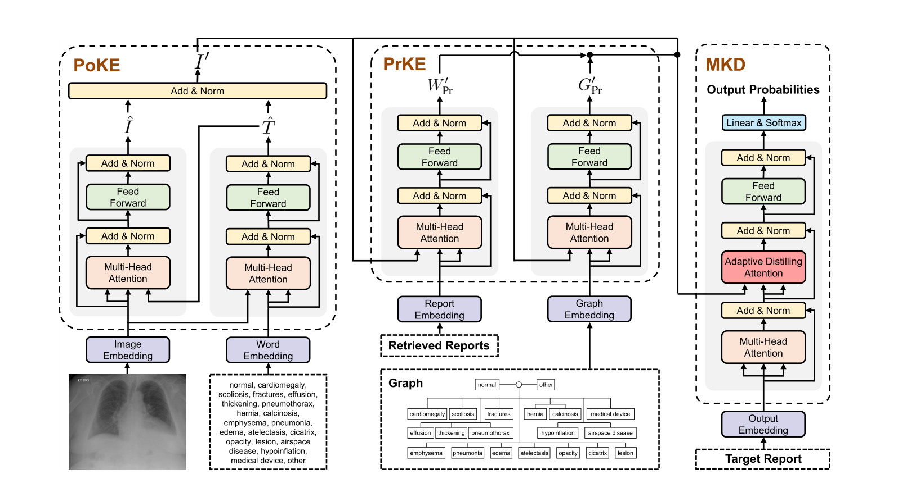
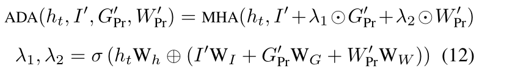

# 探索和提取后验和先验知识以生成放射报告

Exploring and Distilling Posterior and Prior Knowledge for Radiology Report Generation

论文：CVPR2021  笔记：2022.7.5

## 问题

由于严重的视觉和文本数据偏差，报告生成对于数据驱动的神经网络来说仍然是一项具有挑战性的工作。

以前模型大多基于cnn-rnn架构存在两个问题

1. 数据集中正常图像是多数，而异常是少数，其次，正常图像的外观大大优于异常图像，会分散模型的注意力，使其无法准确捕捉罕见且多样的异常区域特征。
2. 在报告中，放射科医生倾向于描述图像中的所有项目，使正常区域的描述占据整个报告的主导地位。此外，许多相似的句子被用来描述相同的正常区域。由于这种不平衡的文本分布，使用此类数据集进行训练使正常句子的生成占主导地位使模型无法描述特定的关键异常。广泛使用的HRNN生成了一些正常的重复句子，并且无法描述一些罕见但重要的异常。

## 提出方法

首先明确：先验是指根据以往经验和分析，而后验是指基于新的数据，对原来的先验修正。

论文提出了一种后验和先验知识探索与提取方法（PPKED）来模拟放射科医生的工作模式，放射科医生将首先检查异常区域并将疾病主题标签分配给异常区域，然后依靠多年的先验医学知识和先前工作经验积累来编写报告。因此，PPKED包括三个模块：后验知识管理器（PoKE）、先验知识管理器（PrKE）和多领域知识提取器（MKD）。具体来说，PoKE探索了后验知识，后验知识提供了显式异常视觉区域，以缓解视觉数据偏差；PrKE从先验医学知识图（医学知识）和先验放射学报告（工作经验）中探索先验知识，以减轻文本数据偏差。MKD对探索的知识进行提炼，以生成最终报告。在MIMIC-CXR和IUX射线数据集上进行评估，我们的方法能够在这两个数据集上优于以前最先进的模型。

## 模型结构

### 后验知识管理器（PoKE）：

图像经过resnet152提取特征，具体提取2048个 7*7的特征图，然后把它们映射到512维上。并且输入常见的疾病主题词进行嵌入。poke的作用就是经这张图的信息进行提取，并且由于疾病主题词让他更关注异常情况。（根据文章中描述，感觉像是在CheXpert dataset训练之后，再用本数据集多标签分类训练后直接提取特征不再更新）

### 先验知识管理器（PrKE）：

先验工作经验，我们首先从ResNet-152的最后一个平均池层提取所有训练图像的图像嵌入。然后，给定输入图像，我们再次使用ResNet-152获得图像嵌入。最后，我们从训练语料库中检索到与输入图像具有最高余弦相似度的NK=100图像。返回顶级NK检索图像的报告，并将其编码。实现中，我们使用BERT编码器，然后在所有输出向量上使用最大池层作为报告嵌入模块，以获得检索到的报告。

先验医学知识：构建一张医学图。词袋中的主题被设置为节点，根据它们相关的器官和身体部分进行分组；对于分在一起的主题用边连接起来，用图卷积神经网络提取先验医学知识（一组节点）参考：When radiology report generation meets knowledge graph.

编码器的其他结构同transformer。

### 多领域知识提取器（MKD）

这其实就是解码器，它接受之前的后验知识和后验知识，利用自适应提取注意力（ADA）来提取知识。ADA计算方式如下，本质上是将后验知识提取的图像信息与先验融合对ht进行注意力。

### 信息流程

PoKE: 从输入的图像中提取后验知识，对图像进行编码，然后根据余弦相似度过滤掉不想关的主题，因为词袋中包含的是异常的主题，所以这样就可以找到异常区域，还可以将参与的异常区域和相关主题进行对齐，模拟放射科医生在检查异常区域时将疾病主题分配给异常区域的工作模式，对齐后直接相加经过LayerNorm就得到了图像的后验知识，这些后验知识被称为放射科医生检查异常区域的第一印象
PrKE: 由先前工作经验和先前医学知识组成，分别用Wpr和Gpr来表示，通过这两个部分来处理PoKE中的后验知识，就可以获得输入图像异常区域的先验知识
MKD: 获得先验与后验知识后，MKD作为解码器来生成最终的放射学报告；MKD将词嵌入和位置嵌入和作为输入。

