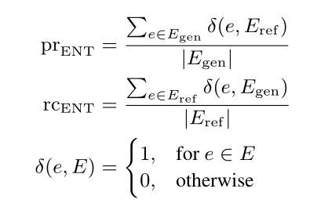
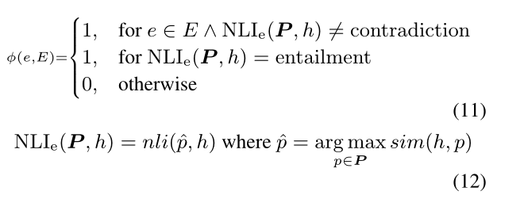

# 提高图文放射报告生成的事实完整性和一致性

 Improving Factual Completeness and Consistency of Image-to-Text Radiology Report Generation

论文：2021 笔记2022.7.17

## 问题

现有的报告生成系统尽管在自然语言生成指标（如CIDEr或BLEU）上取得了较高的性能，但仍然存在生成不完整和不一致的问题。

## 提出方法

我们提出了两种简单的image-to-text放射报告生成奖励，其重点是捕获生成报告的事实完整性和一致性，以及一种基于弱监督的方法，用于训练放射领域NLI模型以实现第二种奖励。

首先，我们提出了精确的实体匹配奖励（factENT），它通过测量生成报告在放射领域中的覆盖率，与参考报告进行比较，来捕获生成报告的完整性。奖励的目标是更好地捕捉实体中编码的疾病和解剖学知识。其次，我们提出了蕴涵实体匹配奖励（factENTNLI），它通过自然语言推理（NLI）模型扩展了factENT，该模型进一步考虑了生成的实体与参考文献中的描述在推理上的一致性。

## 模型

基础架构就是M2T的模型，这里重点是如何利用RL将两种奖励应用的。

### factENT

设计一个F-score entity match reward 捕捉事实的完整性。该奖励假设编码器编码了与事实完整性相关的疾病和解剖学知识。

通过 Biomedical and clinical English model packages in the Stanza Python NLP library提取报告中的关键词作为标签。计算如下的精确度与回归和作为奖励

### factENTNLI

还设计了一个F-score风格的奖励，该奖励使用非线性学习扩展事实，以捕捉事实的一致性。

这个奖励将factENT中的ð扩展。

中h是一个包含e的句子，P是对应部分文本中的所有句子（如果h是生成报告中的句子，P是相应参考报告中的所有句子），nli(∗, ∗) 是一个NLI函数，返回一个NLI标签，该标签是{蕴涵、中立、矛盾}。sim(∗, ∗) 是文本相似性函数。我们使用BERTScore作为sim函数。精确性和召回率的调和平均值被视为factENTNLI，以鼓励生成的文本和相应的参考文本之间保持平衡的事实一致性

弱监督部分没搞懂，等看看代码再说。