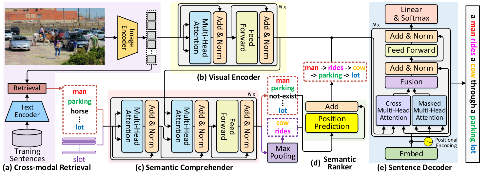
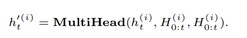
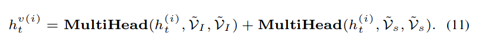
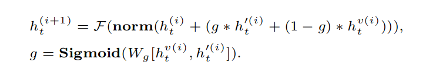

# 理解和排序图像字幕的语义

Comprehending and Ordering Semantics for Image Captioning

## 问题

理解图像中丰富的语义并按语言顺序对它们进行排序对于为图像字幕撰写具有视觉基础和语言连贯性的描述至关重要。现代技术通常利用预先训练的对象检测器/分类器来挖掘图像中的语义，而未充分利用语义的固有语言顺序。

## 方法

在本文中，我们提出了一种 Transformer 式结构的新配方，即理解和排序语义网络 (COS-Net)，它将丰富的语义理解和可学习的语义排序过程新颖地统一到一个单一架构中。

## 模型

图像编码：图像经过resnet101（CLIP中的）进行编码。并添加全局特征V_c送入visual encoder。

跨模态检索（Cross-modal Retrieval）：利用跨模态检索模型（即 CLIP）在每个输入图像的训练句池中搜索语义相关的句子.通过将输入图像 I 作为搜索查询，我们根据 I 与每个字幕之间的余弦相似度从训练句池中检索前 K 个字幕 （这个字幕库应该直接采取的是CLIP预训练的预料库）

语义理解器（Semantic Comprehender）：跨模态检索生的丰富语义包含了一些无关的语义信息，所以在这里进行排除。同时用更相关但缺失的语义词丰富主要语义线索。我们将这种语义筛选和丰富的过程表述为一个集合预测问题。这里我们嵌入了一些空的slot来代表丢失的或缺少的语义关联词。使用图像编码为Q，语义检索的语义与空slot作为V，将语义理解器实现为 N个堆叠的 Transformer 块。在训练期间，我们包括一个代理目标，通过鼓励过滤初级语义线索中不相关的语义词和重建缺失的相关语义词来优化语义理解器。在这里，我们将这个过程表述为单标签和多标签分类问题的组合。其实就是输出来语义词在词表上的可能概率。滤初级语义线索中不相关的语义词过程视为单标签分类的任务，其目标是用交叉熵损失来衡量的。同时，我们将推断缺失的相关语义词的过程视为多标签分类的任务。具体来说，在使用 sigmoid 激活对参数语义查询 solt输出的预测进行归一化之后，我们对它们执行最大池化以实现语义词汇表上的整体概率分布。因此，多标签分类的目标是用asymmetric loss计算。

语义排序器模块：这里利用注意力机制动态推断每个语义词的语言位置。形式上，我们首先初始化一组 D 维位置编码 Vp ∈ RNp×D ，它们描述了一个序列中的所有语言顺序，其中 Np 是语义词序列的最大长度。接下来，对于每个语义词，我们测量其在所有位置编码 Vp 上的注意力分布，然后通过聚合所有带有注意力的位置编码来计算其参与的位置编码。

解码器：普通的解码器都是先MASK再Cross，这里变成来一个并行的过程，上一个时间步的目标字幕编码，一分支输入普通mask注意力，一支路与图像编码和语义排序编码分别进行交叉注意力后相加。结果再进行融合。公式如下：

