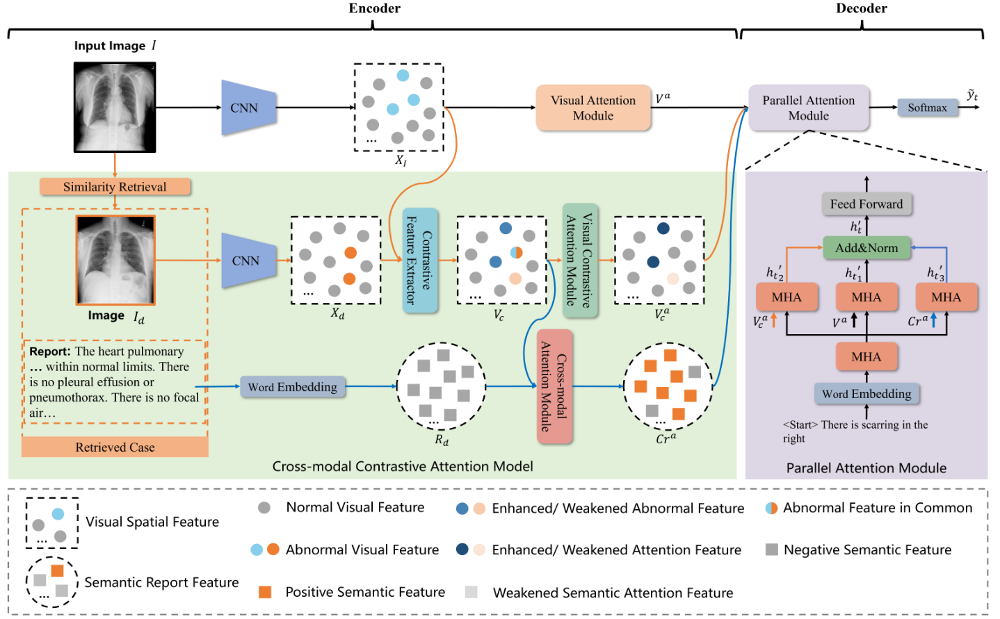
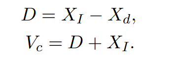
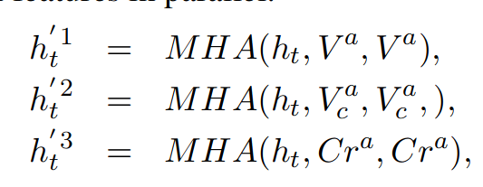
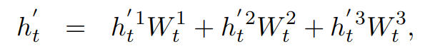

# 用于医疗报告生成的跨模态对比注意模型

Cross-modal Contrastive Attention Model for Medical Report Generation

## 问题

正常的生理结构在图像中占主导地位，只有微小的异常。现有方法忽略了利用来自类似历史案例的有用信息。

## 方法

提出了一种新颖的跨模态对比注意 (CMCA) 模型，用于从相似案例中捕获视觉和语义信息。

## 模型

CMCA 检索输入图像的最相似案例，然后通过扩大差异并保持输入图像和检索到的图像之间的共同点来生成对比特征。对比特征用于提取视觉异常和语义匹配的信息。

VCAM从对比特征中提取有区别的异常视觉信息，其中输入图像的独特异常区域被增强，相似区域被保留。

他们的特异性差异通过视觉特征相减得到Vc。为了防止出现的负值再与输入图像相加。得到的Vc再通过自注意力层得到Vca

 CAM 通过将检索报告中的正语义信息与对比特征对齐来匹配它，在视觉和语义模式之间建立了交互。其实就是普通的交叉注意力层。

并行注意模块如图所示

