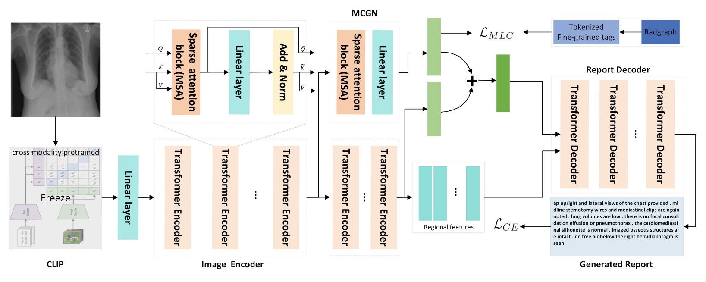

# 用于射线报告生成的医学语义辅助转换器

A Medical Semantic-Assisted Transformer for Radiographic Report Generation

MICCAI2022

## 问题

1. 射线图像彼此非常相似，普通CNN很难捕捉细粒度的视觉差异。

2. 现有方法往往无法提供有效的医学语义特征。

## 方法

提出了一种内存增强的稀疏注意力块，它利用双线性池来捕获输入细粒度图像特征之间的高阶交互，同时产生稀疏注意力。

引入了一种新颖的医学概念生成网络 (MCGN) 来预测细粒度的语义概念，并将它们作为指导纳入报告生成过程。

## 模型

稀疏注意力块MSA

我们假设全局特征为查询 Q ∈ RDq，区域特征为键 K ∈ RN×Dk 和值 V ∈ RN×Dv。为了记录历史信息，我们使用额外的“内存槽”扩展键和值集，以编码和收集来自所有先前过程的特征。我们的记忆增强注意力的键和值可以分别定义为：K = [K, Mk] 和 V = [V, Mv]，其中 Mk 和 Mv 是具有 nm 行的可学习矩阵，并且 [·, ·]表示串联。然后，执行低秩双线性池  以获得联合双线性查询键 Bk 和查询值 Bv

