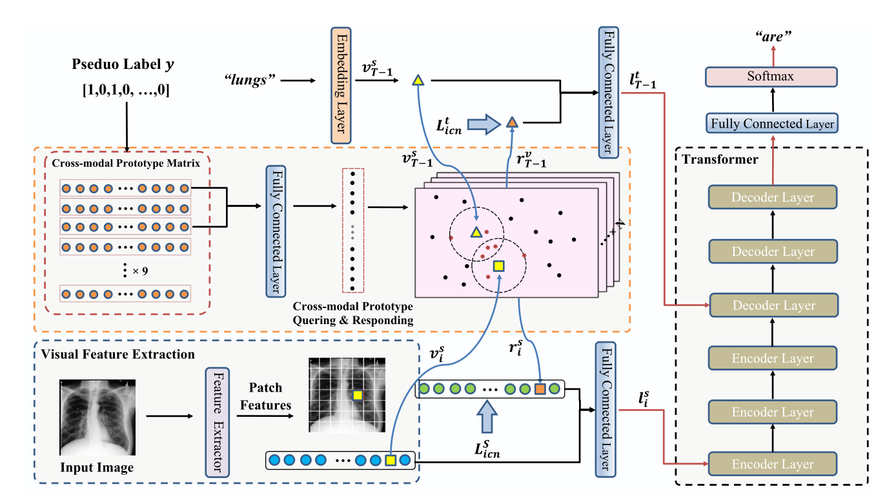

# 用于放射报告生成的跨模式原型驱动网络

Cross-modal Prototype Driven Network for Radiology Report Generation

论文：ECCV2022  笔记：2022.7.13

## 问题

以前的方法通常采用编码器-解码器架构，并侧重于单模态特征学习，而很少研究跨模态特征交互。

常用的数据集存在显著的数据偏差：大多数训练样本都是正常情况，任何异常区域通常只存在于图像的一小部分中，即使在病理情况下，大多数陈述也可能与正常结果的描述有关。

是Cross-modal Memory Networks for Radiology Report Generation的改进论文。

## 提出方法

提出了一种跨模式原型驱动网络（XPRONET）来促进跨模式学习，并利用它来改进放射报告生成任务。

通过三个完全可微且互补的模块实现的：

1. 一个共享的跨模态原型矩阵，用于记录跨模态原型；

2. 跨模态原型网络，用于学习跨模态原型，并将跨模态信息嵌入到视觉和文本特征中；

3. 以及改进的多标签对比损失，以支持和增强多标签原型学习。

与前论文区别：

设计了一个共享的矩阵来学习跨模态，并提出了一种改进的多标签对比损失。而Cross-modal Memory Networks随机初始化了一个记忆矩阵并使用了交叉熵损失（但好像都是共享矩阵，只有损失区别？）

此外，我们的查询和响应过程与类相关，也就是说，跨模态模式学习仅在共享相同标签的跨模态原型上执行，而不是在所有跨模态原型上执行。

采用了一种更有效的方法将跨模态信息提取到单模态表示中，而不是R2GenCMN中使用的简单平均函数。

## 模型结构

### Cross-modal Prototype Network

#### Pseudo Label Generation

Cross-modal Prototype 需要每个样本的类别信息，但数据集中通常没有提供此类信息。我们利用CheXbert，为每个图像-文本对生成一个伪标签。

#### Prototype Matrix Initialization

随机初始化矩阵不会捕获任何有意义的语义信息，并阻碍后续的原型学习。因此，我们建议利用先验信息初始化语义跨模态原型矩阵。

利用预训练的视觉提取器 (imagenet-pretrained) 和 Bert (ChexBert) 来提取视觉和文本特征。结合视觉和文字特征。利用 K-mean 算法将跨模态特征聚类到 14 个聚类。

#### Cross-modal Prototype Querying

这个地方主要区别是他不是用生成的Prototype Matrix，而是用Prototype Matrix中与图像标签同一类的部分

